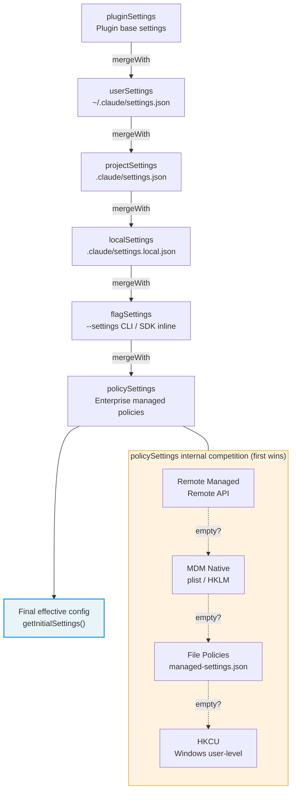

# Appendix B: 환경 변수 레퍼런스 (Environment Variable Reference)

이 부록은 Claude Code v2.1.88의 주요 사용자 설정 환경 변수를 나열한다. 기능 도메인별로 분류하였으며, 사용자에게 보이는 동작에 영향을 미치는 변수만 기재한다. 내부 telemetry 및 플랫폼 감지 변수는 생략하였다.

## Context Compaction

| Variable | 효과 | Default |
|----------|------|---------|
| `CLAUDE_CODE_AUTO_COMPACT_WINDOW` | context window 크기(token) override | Model default |
| `CLAUDE_AUTOCOMPACT_PCT_OVERRIDE` | auto-compaction threshold를 백분율(0-100)로 override | Computed value |
| `DISABLE_AUTO_COMPACT` | auto-compaction 완전 비활성화 | `false` |

## Effort and Reasoning

| Variable | 효과 | Valid Values |
|----------|------|-------------|
| `CLAUDE_CODE_EFFORT_LEVEL` | effort level override | `low`, `medium`, `high`, `max`, `auto`, `unset` |
| `CLAUDE_CODE_DISABLE_FAST_MODE` | Fast Mode 가속 출력 비활성화 | `true`/`false` |
| `DISABLE_INTERLEAVED_THINKING` | extended thinking 비활성화 | `true`/`false` |
| `MAX_THINKING_TOKENS` | thinking token 제한 override | Model default |

## Tools and Output Limits

| Variable | 효과 | Default |
|----------|------|---------|
| `BASH_MAX_OUTPUT_LENGTH` | Bash 명령어의 최대 출력 문자 수 | 8,000 |
| `CLAUDE_CODE_GLOB_TIMEOUT_SECONDS` | Glob 검색 timeout(초) | Default |

## Permissions and Security

| Variable | 효과 | 비고 |
|----------|------|------|
| `CLAUDE_CODE_DUMP_AUTO_MODE` | YOLO classifier 요청/응답 내보내기 | Debug 전용 |
| `CLAUDE_CODE_DISABLE_COMMAND_INJECTION_CHECK` | Bash command injection 탐지 비활성화 | 보안 수준 저하 |

## API and Authentication

| Variable | 효과 | Security Level |
|----------|------|---------------|
| `ANTHROPIC_API_KEY` | Anthropic API 인증 키 | Credential |
| `ANTHROPIC_BASE_URL` | 커스텀 API endpoint (proxy 지원) | Redirectable |
| `ANTHROPIC_MODEL` | 기본 model override | Safe |
| `CLAUDE_CODE_USE_BEDROCK` | AWS Bedrock을 통한 inference 라우팅 | Safe |
| `CLAUDE_CODE_USE_VERTEX` | Google Vertex AI를 통한 inference 라우팅 | Safe |
| `CLAUDE_CODE_EXTRA_BODY` | API 요청에 추가 필드 삽입 | Advanced use |
| `ANTHROPIC_CUSTOM_HEADERS` | 커스텀 HTTP 요청 헤더 | Safe |

## Model Selection

| Variable | 효과 | Example |
|----------|------|---------|
| `ANTHROPIC_DEFAULT_HAIKU_MODEL` | 커스텀 Haiku model ID | Model string |
| `ANTHROPIC_DEFAULT_SONNET_MODEL` | 커스텀 Sonnet model ID | Model string |
| `ANTHROPIC_DEFAULT_OPUS_MODEL` | 커스텀 Opus model ID | Model string |
| `ANTHROPIC_SMALL_FAST_MODEL` | 빠른 inference model (예: 요약용) | Model string |
| `CLAUDE_CODE_SUBAGENT_MODEL` | sub-Agent가 사용하는 model | Model string |

## Prompt Caching

| Variable | 효과 | Default |
|----------|------|---------|
| `CLAUDE_CODE_ENABLE_PROMPT_CACHING` | Prompt Caching 활성화 | `true` |
| `DISABLE_PROMPT_CACHING` | Prompt Caching 완전 비활성화 | `false` |

## Session and Debugging

| Variable | 효과 | 용도 |
|----------|------|------|
| `CLAUDE_CODE_DEBUG_LOG_LEVEL` | 로그 상세 수준 | `silent`/`error`/`warn`/`info`/`verbose` |
| `CLAUDE_CODE_PROFILE_STARTUP` | 시작 성능 profiling 활성화 | Debug |
| `CLAUDE_CODE_PROFILE_QUERY` | query pipeline profiling 활성화 | Debug |
| `CLAUDE_CODE_JSONL_TRANSCRIPT` | 세션 transcript를 JSONL로 기록 | File path |
| `CLAUDE_CODE_TMPDIR` | 임시 디렉터리 override | Path |

## Output and Formatting

| Variable | 효과 | Default |
|----------|------|---------|
| `CLAUDE_CODE_SIMPLE` | 최소 System Prompt 모드 | `false` |
| `CLAUDE_CODE_DISABLE_TERMINAL_TITLE` | 터미널 제목 설정 비활성화 | `false` |
| `CLAUDE_CODE_NO_FLICKER` | 전체 화면 모드 깜빡임 감소 | `false` |

## MCP (Model Context Protocol)

| Variable | 효과 | Default |
|----------|------|---------|
| `MCP_TIMEOUT` | MCP 서버 연결 timeout (ms) | 10,000 |
| `MCP_TOOL_TIMEOUT` | MCP tool 호출 timeout (ms) | 30,000 |
| `MAX_MCP_OUTPUT_TOKENS` | MCP tool 출력 token 제한 | Default |

## Network and Proxy

| Variable | 효과 | 비고 |
|----------|------|------|
| `HTTP_PROXY` / `HTTPS_PROXY` | HTTP/HTTPS proxy | Redirectable |
| `NO_PROXY` | proxy를 우회할 호스트 목록 | Safe |
| `NODE_EXTRA_CA_CERTS` | 추가 CA 인증서 | TLS 신뢰에 영향 |

## Paths and Configuration

| Variable | 효과 | Default |
|----------|------|---------|
| `CLAUDE_CONFIG_DIR` | Claude 설정 디렉터리 override | `~/.claude` |

---

## 버전 변화: v2.1.91 신규 변수 (Version Evolution: v2.1.91 New Variables)

| Variable | 효과 | 비고 |
|----------|------|------|
| `CLAUDE_CODE_AGENT_COST_STEER` | sub-agent 비용 조절 | multi-agent 시나리오에서 리소스 소비를 제어한다 |
| `CLAUDE_CODE_RESUME_THRESHOLD_MINUTES` | 세션 재개 시간 threshold | 세션 재개를 위한 시간 범위를 제어한다 |
| `CLAUDE_CODE_RESUME_TOKEN_THRESHOLD` | 세션 재개 token threshold | 세션 재개를 위한 token 예산을 제어한다 |
| `CLAUDE_CODE_USE_ANTHROPIC_AWS` | AWS 인증 경로 | Anthropic AWS 인프라 인증을 활성화한다 |
| `CLAUDE_CODE_SKIP_ANTHROPIC_AWS_AUTH` | AWS 인증 건너뛰기 | AWS를 사용할 수 없을 때의 fallback 경로 |
| `CLAUDE_CODE_DISABLE_CLAUDE_API_SKILL` | Claude API skill 비활성화 | 엔터프라이즈 compliance 시나리오 제어 |
| `CLAUDE_CODE_PLUGIN_KEEP_MARKETPLACE_ON_FAILURE` | Plugin marketplace 장애 허용 | marketplace fetch 실패 시 캐시된 버전을 유지한다 |
| `CLAUDE_CODE_REMOTE_SETTINGS_PATH` | 원격 설정 경로 override | 엔터프라이즈 배포를 위한 커스텀 설정 URL |

### v2.1.91 제거된 변수 (v2.1.91 Removed Variables)

| Variable | 원래 효과 | 제거 사유 |
|----------|----------|----------|
| `CLAUDE_CODE_DISABLE_COMMAND_INJECTION_CHECK` | command injection 검사 비활성화 | Tree-sitter 인프라 전체 제거 |
| `CLAUDE_CODE_DISABLE_MOUSE_CLICKS` | 마우스 클릭 비활성화 | 기능 deprecated |
| `CLAUDE_CODE_MCP_INSTR_DELTA` | MCP instruction delta | 기능 리팩터링 |

---

## 설정 우선순위 시스템 (Configuration Priority System)

환경 변수는 Claude Code 설정 시스템의 한 측면에 불과하다. 전체 설정 시스템은 6개 계층의 소스로 구성되며, 가장 낮은 우선순위부터 가장 높은 우선순위 순으로 병합된다—나중 소스가 이전 소스를 override한다. 이 우선순위 체인을 이해하는 것은 "왜 내 설정이 적용되지 않는가"를 진단하는 데 매우 중요하다.

### 6계층 우선순위 모델 (Six-Layer Priority Model)

설정 소스는 `restored-src/src/utils/settings/constants.ts:7-22`에 정의되어 있으며, 병합 로직은 `restored-src/src/utils/settings/settings.ts:644-796`의 `loadSettingsFromDisk()` 함수에 구현되어 있다.

| 우선순위 | Source ID | 파일 경로 / 소스 | 설명 |
|----------|-----------|-----------------|------|
| 0 (최저) | pluginSettings | Plugin 제공 기본 설정 | 화이트리스트 필드(예: `agent`)만 포함하며, 모든 파일 소스의 기본 계층 역할을 한다 |
| 1 | `userSettings` | `~/.claude/settings.json` | 사용자 전역 설정, 모든 프로젝트에 적용된다 |
| 2 | `projectSettings` | `$PROJECT/.claude/settings.json` | 프로젝트 공유 설정, 버전 관리에 커밋된다 |
| 3 | `localSettings` | `$PROJECT/.claude/settings.local.json` | 프로젝트 로컬 설정, `.gitignore`에 자동 추가된다 |
| 4 | `flagSettings` | `--settings` CLI 파라미터 + SDK inline 설정 | 커맨드 라인 또는 SDK를 통해 전달되는 임시 override |
| 5 (최고) | `policySettings` | 엔터프라이즈 관리 정책 (여러 경쟁 소스) | 엔터프라이즈 관리자가 강제하는 정책, 아래 참조 |

### 병합 의미론 (Merge Semantics)

병합은 lodash의 `mergeWith`를 사용한 deep merge로 수행되며, 커스텀 merger는 `restored-src/src/utils/settings/settings.ts:538-547`에 정의되어 있다.

- **객체**: 재귀적으로 병합되며, 나중 소스의 필드가 이전 소스를 override한다
- **배열**: 병합 후 중복 제거(`mergeArrays`)되며, 교체되지 않는다—이는 여러 계층의 `permissions.allow` 규칙이 누적됨을 의미한다
- **`undefined` 값**: `updateSettingsForSource`(`restored-src/src/utils/settings/settings.ts:482-486`)에서 "이 키를 삭제"로 해석된다

이 배열 병합 의미론은 특히 중요하다: 사용자가 `userSettings`에서 하나의 tool을 허용하고 `projectSettings`에서 다른 tool을 허용하면, 최종 `permissions.allow` 목록에는 두 가지 모두 포함된다. 이를 통해 다계층 permission 설정이 서로를 override하는 대신 누적될 수 있다.

### Policy Settings (policySettings) 4계층 경쟁 (Four-Layer Competition)

Policy settings(`policySettings`)는 자체적인 내부 우선순위 체인을 가지며, "내용이 있는 첫 번째 소스가 승리"하는 전략을 사용한다. 이는 `restored-src/src/utils/settings/settings.ts:322-345`에 구현되어 있다.

| 하위 우선순위 | 소스 | 설명 |
|-------------|------|------|
| 1 (최고) | Remote Managed Settings | API에서 동기화된 엔터프라이즈 정책 캐시 |
| 2 | MDM Native Policies (HKLM / macOS plist) | `plutil` 또는 `reg query`로 읽는 시스템 수준 정책 |
| 3 | File Policies (`managed-settings.json` + `managed-settings.d/*.json`) | Drop-in 디렉터리 지원, 알파벳 순서로 병합된다 |
| 4 (최저) | HKCU User Policies (Windows 전용) | 사용자 수준 레지스트리 설정 |

Policy settings는 다른 소스와 다르게 병합된다는 점에 주의해야 한다: 정책 내부의 4개 하위 소스는 **경쟁 관계**(첫 번째가 승리)에 있는 반면, 정책 전체는 다른 소스와 **가산 관계**(설정 체인의 최상위에 deep merge)에 있다.

### Override 체인 흐름도 (Override Chain Flowchart)

**Figure B-1: 설정 우선순위 Override 체인**

### 캐싱과 무효화 (Caching and Invalidation)

설정 로딩에는 2계층 캐싱 메커니즘(`restored-src/src/utils/settings/settingsCache.ts`)이 있다.

1. **파일 수준 캐시**: `parseSettingsFile()`이 각 파일의 파싱 결과를 캐시하여 반복적인 JSON 파싱을 방지한다
2. **세션 수준 캐시**: `getSettingsWithErrors()`가 병합된 최종 결과를 캐시하여 세션 전체에서 재사용한다

캐시는 `resetSettingsCache()`를 통해 일괄 무효화된다—사용자가 `/config` 명령어 또는 `updateSettingsForSource()`를 통해 설정을 변경할 때 트리거된다. 설정 파일 변경 감지는 `restored-src/src/utils/settings/changeDetector.ts`가 담당하며, 파일 시스템 감시를 통해 React 컴포넌트 재렌더링을 구동한다.

### 진단 권장 사항 (Diagnostic Recommendations)

설정이 "적용되지 않을 때" 다음 순서로 문제를 해결한다:

1. **소스 확인**: `/config` 명령어를 사용하여 현재 유효한 설정과 소스 주석을 확인한다
2. **우선순위 확인**: 더 높은 우선순위의 소스가 설정을 override하고 있는가? `policySettings`가 가장 강력한 override이다
3. **배열 병합 확인**: permission 규칙은 가산적이다—더 높은 우선순위 소스에 `deny` 규칙이 있으면, 낮은 우선순위의 `allow`가 이를 override할 수 없다
4. **캐싱 확인**: 같은 세션 내에서 `.json` 파일을 수정한 후에도 설정이 캐시되어 있을 수 있다—세션을 재시작하거나 `/config`를 사용하여 새로고침을 트리거한다
