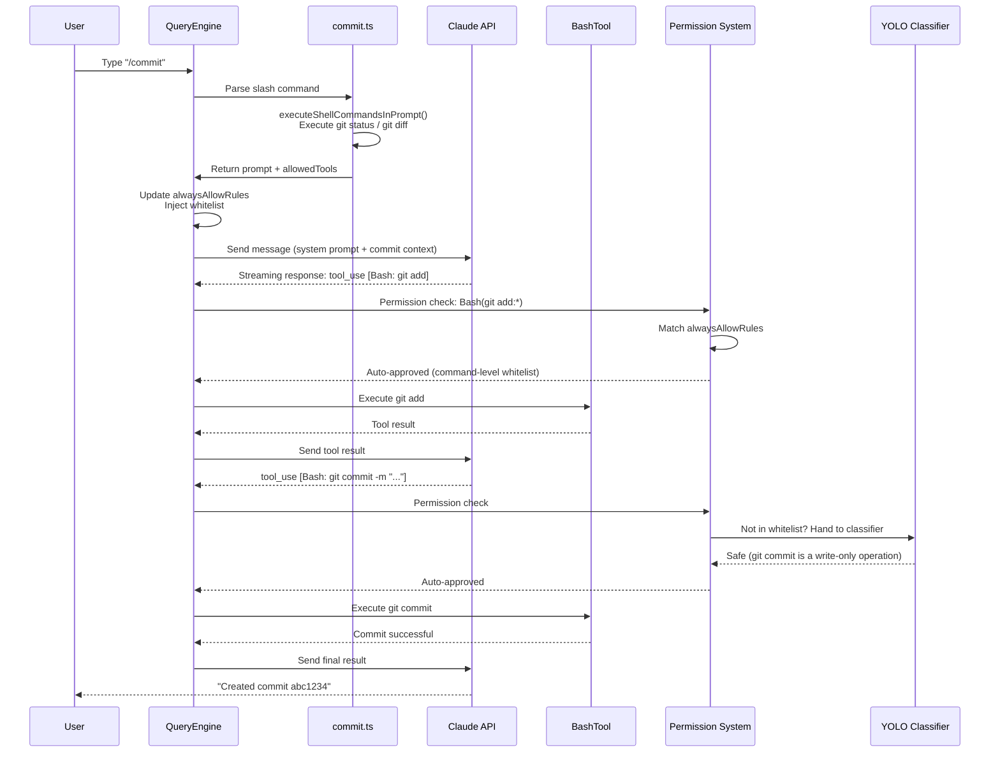
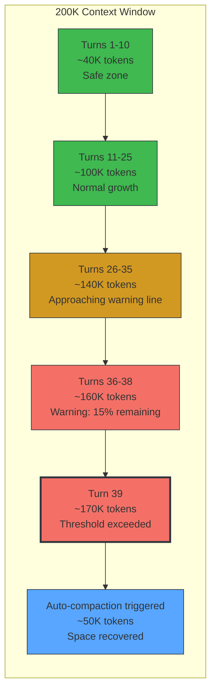
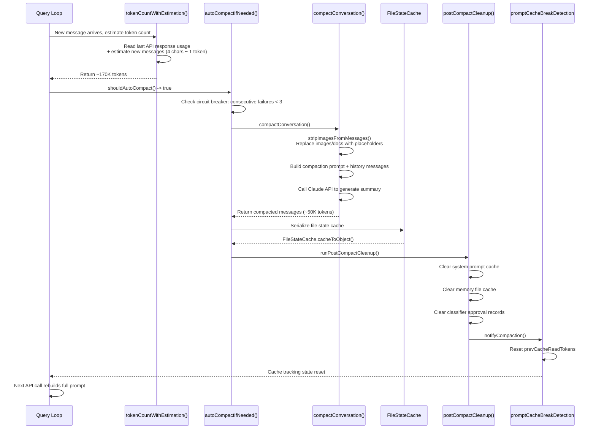
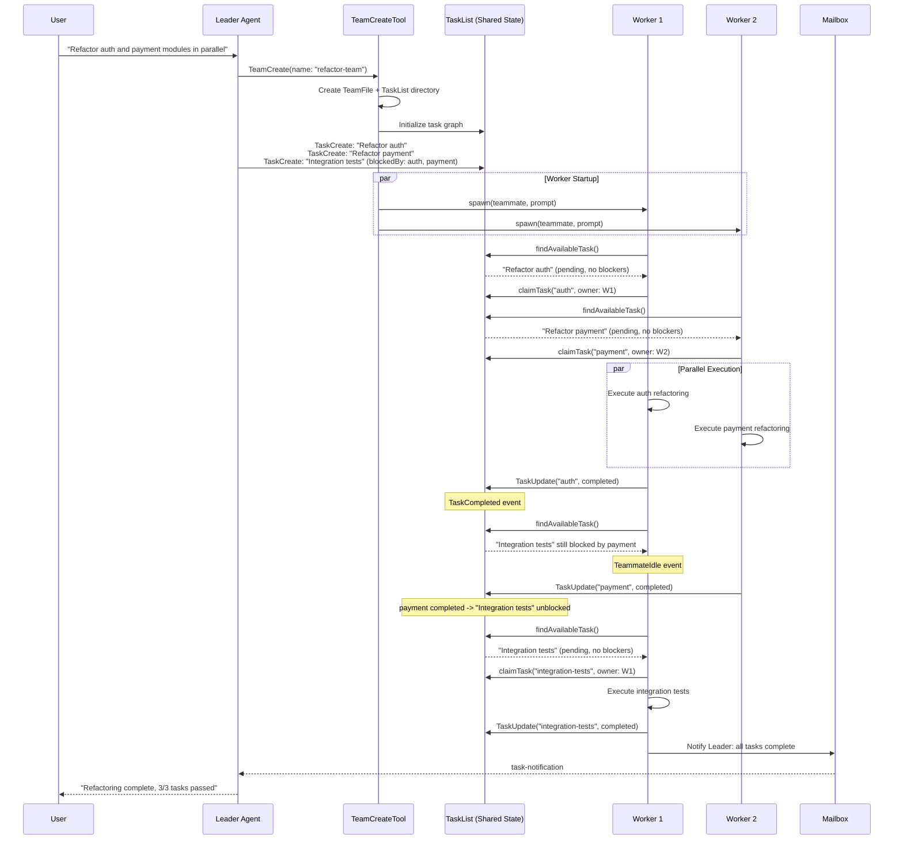

# Appendix F: End-to-End Case Trace (종단 간 사례 추적)

> 이 부록은 세 가지 완전한 요청 lifecycle trace를 통해 모든 Chapter에 걸친 분석을 연결한다. 각 사례는 사용자 입력에서 시작하여 여러 하위 시스템을 거쳐 최종 출력으로 끝난다. 이 사례들을 읽을 때, 각 단계의 내부 메커니즘을 더 깊이 이해하기 위해 인용된 Chapter를 교차 참조하는 것을 권장한다.

---

## 사례 1: `/commit`의 완전한 여정 (Case 1: The Complete Journey of a `/commit`)

> 관련 Chapter: Chapter 3 (Agent Loop) -> Chapter 5 (System Prompts) -> Chapter 4 (Tool Orchestration) -> Chapter 16 (Permission System) -> Chapter 17 (YOLO Classifier) -> Chapter 13 (Cache Hits)

### 시나리오 (Scenario)

사용자가 git repository에서 `/commit`을 입력한다. Claude Code는 workspace 상태를 확인하고, commit 메시지를 생성하고, git commit을 실행해야 한다 — 이 과정 전체에서 whitelist에 등록된 git 명령어는 자동으로 승인된다.

### 요청 흐름 (Request Flow)



### 하위 시스템 상호작용 상세 (Subsystem Interaction Details)

**Phase 1: Command Parsing (Chapter 3)**

사용자가 `/commit`을 입력하면 `QueryEngine.processUserInput()`은 slash command 접두사를 인식하고 command registry(`restored-src/src/commands/commit.ts:6-82`)에서 `commit` command 정의를 조회한다. command 정의에는 두 가지 핵심 필드가 포함되어 있다:

- `allowedTools`: `['Bash(git add:*)', 'Bash(git status:*)', 'Bash(git commit:*)']` — 모델이 이 세 가지 유형의 git 명령어만 사용하도록 제한한다
- `getPromptContent()`: API로 전송하기 전에 `executeShellCommandsInPrompt()`를 통해 로컬에서 `git status`와 `git diff HEAD`를 실행하여 실제 repository 상태를 prompt에 삽입한다

이는 모델이 막연한 "커밋을 도와줘"라는 지시가 아니라, 현재 diff를 포함한 완전한 context를 수신함을 의미한다.

**Phase 2: Permission Injection (Chapter 16)**

API를 호출하기 전에 `QueryEngine`은 `allowedTools`를 `AppState.toolPermissionContext.alwaysAllowRules.command`(`restored-src/src/QueryEngine.ts:477-486`)에 기록한다. 효과: 이 대화 턴 동안 `Bash(git add:*)` 패턴에 일치하는 모든 tool 호출은 사용자 확인 없이 자동으로 승인된다.

**Phase 3: API 호출과 Caching (Chapter 5, Chapter 13)**

API 호출 시 system prompt는 `cache_control` 마커가 포함된 여러 블록으로 분할된다(`restored-src/src/utils/api.ts:72-84`). 사용자가 이전에 다른 명령을 실행한 적이 있다면, system prompt의 접두사 부분(tool 정의, 기본 규칙)이 prompt cache에 적중할 수 있으며, `/commit`이 주입한 새 context만 재처리하면 된다.

**Phase 4: Tool 실행과 분류 (Chapter 4, Chapter 17)**

모델이 `tool_use` 블록을 반환한 후 permission system은 우선순위에 따라 확인한다:

1. 먼저 `alwaysAllowRules`를 확인한다 — `git add`와 `git status`는 whitelist에 직접 일치한다
2. `git commit`의 경우, whitelist에 없으면 YOLO classifier(`restored-src/src/utils/permissions/yoloClassifier.ts:54-68`)에 넘겨 안전성을 평가한다
3. `BashTool`이 실제 명령을 실행하며, `bashPermissions.ts`를 통해 AST 수준의 command parsing을 수행한다

**Phase 5: Attribution 계산**

commit이 완료되면 `commitAttribution.ts`(`restored-src/src/utils/commitAttribution.ts:548-743`)가 Claude의 문자 기여 비율을 계산하여 commit 메시지에 `Co-Authored-By` 서명을 추가할지 결정한다.

### 이 사례가 보여주는 것 (What This Case Demonstrates)

간단한 `/commit` 뒤에서 최소 6개의 하위 시스템이 협력한다: command system은 context injection을 제공하고, permission system은 whitelist 자동 승인을 제공하고, YOLO classifier는 fallback 평가를 제공하고, BashTool은 실제 명령을 실행하고, prompt caching은 중복 계산을 줄이고, attribution 모듈은 저작권을 처리한다. 이것이 harness engineering의 핵심이다 — 각 하위 시스템이 자신의 역할을 수행하며, Agent Loop의 통합된 cycle을 통해 조율된다.

---

## 사례 2: 긴 대화에서 Auto-Compaction 발동 (Case 2: A Long Conversation Triggering Auto-Compaction)

> 관련 Chapter: Chapter 9 (Auto-Compaction) -> Chapter 10 (File State Preservation) -> Chapter 11 (Micro-Compaction) -> Chapter 12 (Token Budget) -> Chapter 13 (Cache Architecture) -> Chapter 26 (Context Management Principles)

### 시나리오 (Scenario)

사용자가 대규모 코드베이스에서 긴 리팩토링 대화를 진행하고 있다. 약 40턴의 상호작용 후 context window가 200K token 한계에 접근하면서 auto-compaction이 발동된다.

### Token 소비 타임라인 (Token Consumption Timeline)



### 주요 임계값 (Key Thresholds)

| 임계값 | 계산 | 근사값 | 목적 |
|--------|------|--------|------|
| Context window | `MODEL_CONTEXT_WINDOW_DEFAULT` | 200,000 | 모델 최대 입력 |
| 유효 window | Context window - max_output_tokens | ~180,000 | 출력 공간 확보 |
| Compaction 임계값 | 유효 window - 13K buffer | ~167,000 | Auto-compaction 발동 |
| 경고 임계값 | 유효 window - 20K | ~160,000 | 로그 경고 |
| 차단 임계값 | 유효 window - 3K | ~177,000 | /compact 강제 실행 |

출처: `restored-src/src/services/compact/autoCompact.ts:28-91`, `restored-src/src/utils/context.ts:8-9`

### Compaction 실행 흐름 (Compaction Execution Flow)



### 하위 시스템 상호작용 상세 (Subsystem Interaction Details)

**Phase 1: Token Counting (Chapter 12)**

각 API 호출 후 `tokenCountWithEstimation()`(`restored-src/src/utils/tokens.ts:226-261`)은 마지막 응답에서 `input_tokens + cache_creation_input_tokens + cache_read_input_tokens`를 읽은 다음, 이후 추가된 메시지의 추정값(4문자가 약 1 token)을 더한다. 이 함수가 모든 context 관리 결정의 데이터 기반이다.

**Phase 2: 임계값 평가 (Chapter 9)**

`shouldAutoCompact()`(`restored-src/src/services/compact/autoCompact.ts:225-226`)는 token 수를 compaction 임계값(~167K)과 비교한다. 임계값을 초과한 후에는 circuit breaker도 확인한다 — compaction이 3회 연속 실패하면 재시도를 중단한다(lines 260-265). 이는 Chapter 26의 "runaway loop를 circuit-break하라" 원칙의 구체적인 구현이다.

**Phase 3: Compaction 실행 (Chapter 9)**

`compactConversation()`(`restored-src/src/services/compact/compact.ts:122-200`)이 실제 compaction을 수행한다:

1. 이미지와 문서 콘텐츠를 제거하고 `[image]`/`[document]` placeholder로 대체한다
2. compaction prompt를 구성하고 완전한 메시지 기록을 Claude에 보내 요약을 생성한다
3. 압축된 메시지 배열을 반환한다(약 400개 메시지에서 약 80개로 축소)

**Phase 4: File State 보존 (Chapter 10)**

compaction 전에 `FileStateCache`(`restored-src/src/utils/fileStateCache.ts:30-143`)는 캐시된 모든 파일 경로, 내용, 타임스탬프를 직렬화한다. 이 데이터는 compaction 후 메시지에 첨부 파일로 주입되어, 모델이 compaction 이후에도 어떤 파일을 읽고 편집했는지 여전히 "기억"할 수 있게 한다. 캐시는 LRU 전략을 사용하며 100개 항목과 25MB 총 크기로 제한된다.

**Phase 5: Cache 무효화 (Chapter 13)**

compaction이 완료된 후 `runPostCompactCleanup()`(`restored-src/src/services/compact/postCompactCleanup.ts:31-77`)이 포괄적인 정리를 수행한다:

- system prompt 캐시를 지운다(`getUserContext.cache.clear()`)
- memory file 캐시를 지운다
- YOLO classifier의 승인 기록을 지운다
- cache tracking 모듈에 상태 리셋을 알린다(`notifyCompaction()`)

이는 compaction 후 첫 번째 API 호출이 완전한 system prompt를 재구성해야 함을 의미한다 — prompt cache는 완전히 miss된다. 이것이 compaction의 숨겨진 비용이다: context 공간은 절약하지만, 전체 cache 재구성이라는 대가를 치른다.

### 이 사례가 보여주는 것 (What This Case Demonstrates)

Auto-compaction은 고립된 기능이 아니라 다섯 가지 하위 시스템의 협력이다: token counting, 임계값 평가, 요약 생성, file state 보존, cache 무효화. 이는 Chapter 26의 핵심 원칙을 구현한다: **context 관리는 Agent의 핵심 역량이지 부가 기능이 아니다**. 모든 단계가 "충분한 정보 보존"과 "충분한 공간 확보" 사이에서 정밀한 trade-off를 만든다.

---

## 사례 3: Multi-Agent 협업 실행 (Case 3: Multi-Agent Collaborative Execution)

> 관련 Chapter: Chapter 20 (Agent Spawning) -> Chapter 20b (Teams Scheduling Kernel) -> Chapter 5 (System Prompt Variants) -> Chapter 25 (Harness Engineering Principles)

### 시나리오 (Scenario)

사용자가 Claude Code에 여러 모듈을 병렬로 리팩토링하도록 요청한다. 메인 Agent가 Team을 생성하고 sub-Agent에 작업을 할당하면, sub-Agent가 TaskList를 통해 자동으로 작업을 claim하고 완료한다.

### Agent 통신 시퀀스 (Agent Communication Sequence)



### 하위 시스템 상호작용 상세 (Subsystem Interaction Details)

**Phase 1: Team 생성 (Chapter 20, Chapter 20b)**

`TeamCreateTool`(`restored-src/src/tools/AgentTool/AgentTool.tsx`)은 두 가지 작업을 수행한다: `TeamFile` 설정을 생성하고 해당 TaskList 디렉토리를 초기화한다. Chapter 20b에서 분석한 바와 같이: **Team = TaskList** — team과 task table은 동일한 런타임 객체의 두 가지 뷰다.

Worker의 물리적 backend는 `detectAndGetBackend()`(`restored-src/src/utils/swarm/backends/`)에 의해 결정된다:

| Backend | 프로세스 모델 | 감지 조건 |
|---------|-------------|----------|
| Tmux | 독립 CLI 프로세스 | 기본 backend (Linux/macOS) |
| iTerm2 | 독립 CLI 프로세스 | macOS + iTerm2 |
| In-Process | AsyncLocalStorage 격리 | tmux/iTerm2 없음 |

**Phase 2: Task Graph 구성 (Chapter 20b)**

Leader가 생성한 작업은 단순한 Todo 목록이 아니라 `blocks`/`blockedBy` 의존성 관계가 있는 DAG다(`restored-src/src/utils/tasks.ts`):

```typescript
// restored-src/src/utils/tasks.ts
{
  id: "auth",
  status: "pending",
  blocks: ["integration-test"],
  blockedBy: [],
}
{
  id: "integration-test",
  status: "pending",
  blocks: [],
  blockedBy: ["auth", "payment"],
}
```

이 설계는 Leader가 모든 작업과 의존성을 한 번에 선언하고, "언제 병렬 실행이 가능한지"는 런타임이 결정하도록 한다.

**Phase 3: 자동 Claim (Chapter 20b)**

`useTaskListWatcher.ts`의 `findAvailableTask()`가 Swarm의 최소 scheduler다:

1. `status === 'pending'`이고 `owner`가 비어 있는 작업을 필터링한다
2. `blockedBy`의 모든 작업이 완료되었는지 확인한다
3. 발견되면 `claimTask()`가 원자적으로 소유권을 claim한다

이는 Chapter 25의 핵심 원칙 중 하나를 구현한다: **scheduling과 reasoning을 분리하라** — 모델이 자연어로 작업 의존성을 판단할 필요가 없다; 런타임이 이미 후보를 단 하나의 명확한 작업으로 좁혀 놓았다.

**Phase 4: Context 격리 (Chapter 20)**

각 In-Process Worker는 `AsyncLocalStorage`(`restored-src/src/utils/teammateContext.ts:41-64`)를 통해 독립적인 context를 유지한다:

```typescript
// restored-src/src/utils/teammateContext.ts:41
const teammateStorage = new AsyncLocalStorage<TeammateContext>();
```

`TeammateContext`에는 `agentId`, `agentName`, `teamName`, `parentSessionId` 등의 필드가 포함된다. 이는 동일 프로세스 내의 여러 Agent가 서로의 상태를 오염시키지 않도록 보장한다.

**Phase 5: Event Surface (Chapter 20b)**

Worker가 작업을 완료하면 두 가지 유형의 이벤트가 발생한다(`restored-src/src/query/stopHooks.ts`):

- `TaskCompleted`: 작업을 완료로 표시하며, 잠재적으로 다른 작업의 차단을 해제한다
- `TeammateIdle`: Worker가 유휴 상태에 들어가 TaskList로 돌아가 새 작업을 찾는다

이로써 Teams는 hybrid pull + push 모델이 된다 — 유휴 Worker가 능동적으로 작업을 pull하고, 작업 완료 이벤트가 Leader에 push된다.

**Phase 6: 통신 (Chapter 20b)**

Worker들은 서로 직접 대화하지 않는다. 모든 협력은 두 가지 채널을 통해 흐른다:

- **TaskList** (공유 파일 시스템 상태): `~/.claude/tasks/{team-name}/`
- **Mailbox** (영속적 메시지 큐): `~/.claude/teams/{team}/inboxes/*.json`

`task-notification` 메시지가 Leader의 메시지 스트림에 주입될 때, prompt는 이를 `<task-notification>` 태그로 구분하도록(사용자 입력이 아님) 명시적으로 요구한다.

### 이 사례가 보여주는 것 (What This Case Demonstrates)

multi-Agent 협업의 핵심은 "Agent들이 서로 대화하게 하는 것"이 아니라, **공유 task graph + 원자적 claim + turn-end event**가 협업 kernel을 형성하는 것이다. Claude Code의 Swarm은 본질적으로 분산 scheduler다: Leader가 작업 의존성을 선언하고, Worker가 자동으로 작업을 claim하고, 런타임이 동시성 충돌을 관리한다. 이는 Chapter 25 원칙의 직접적인 구현이다: "먼저 협업 상태를 외부화(externalize)한 다음, 서로 다른 실행 단위가 그것을 중심으로 협력하게 하라."
