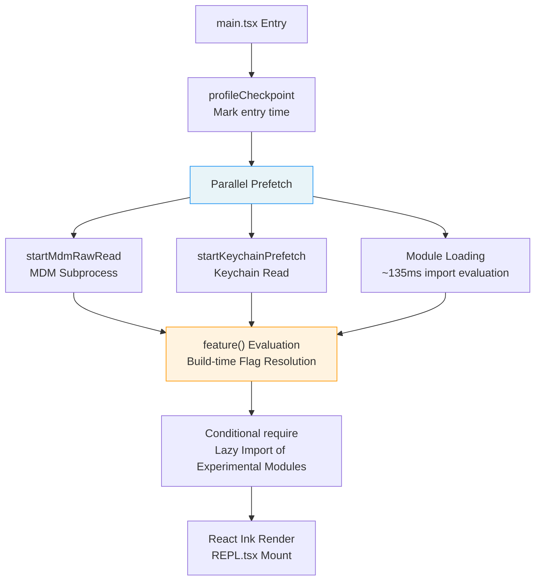
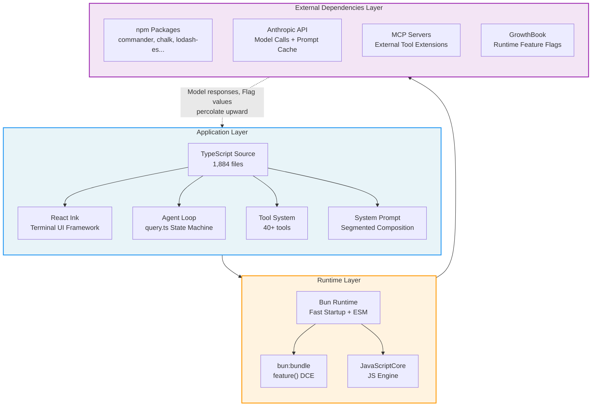

# Chapter 1: AI Coding Agent의 완전한 기술 스택 (The Full Tech Stack of an AI Coding Agent)

> **포지셔닝**: 이 Chapter는 Claude Code의 완전한 기술 스택 — Bun runtime, React Ink terminal UI, TypeScript 타입 시스템 — 과 이러한 기술 선택 위에서 Three-Layer Architecture가 구체적으로 어떻게 구현되는지를 분석한다. 사전 지식: 없음, 독립적으로 읽을 수 있다. 대상 독자: CC 아키텍처를 처음 접하는 독자, 또는 Bun + React Ink + TypeScript 기술 선정을 이해하고자 하는 개발자.

## 왜 중요한가 (Why This Matters)

AI coding agent가 "사용자 입력을 받는" 단계에서 "당신의 codebase에서 실제 동작을 수행하는" 단계로 어떻게 넘어가는지 이해하려면, 먼저 그 기술 스택을 이해해야 한다. 기술 스택은 단순히 성능의 상한선만 결정하는 것이 아니다. 아키텍처의 경계를 결정한다. 무엇을 compile time에 할 수 있고, 무엇이 runtime으로 미뤄져야 하며, 무엇을 모델 스스로가 결정하도록 해야 하는지.

Claude Code의 기술 스택 선택은 하나의 핵심 철학을 드러낸다. **AI coding agent는 전통적인 CLI 도구가 아니다. 모델이 단지 tool을 사용하는 데 그치지 않고 자신만의 tool을 작성할 수도 있는, "on distribution" 상에서 동작하는 시스템이다**. 이는 기술 스택 전체가 "모델을 first-class citizen으로" 염두에 두고 설계되어야 함을 의미한다. entry-point 시작 최적화부터 build-time Feature Flag 제거까지, 모든 계층이 이 목표를 위해 봉사한다.

이 Chapter는 책 전체를 관통하는 핵심 개념인 **Three-Layer Architecture**를 확립하고, 이것이 Claude Code v2.1.88에서 구체적으로 어떻게 구현되는지를 source code 분석을 통해 보여준다. 당신이 직접 AI Agent를 만들고 있다면, 이 Chapter의 아키텍처 모델과 시작 최적화 전략은 바로 차용할 수 있다. 단순히 Claude Code가 왜 지금과 같이 동작하는지를 이해하고 싶다면, Three-Layer Architecture는 이 책에서 가장 근본적인 레퍼런스 프레임워크다.

---

## 소스 코드 분석 (Source Code Analysis)

### 1.1 기술 스택 개관: TypeScript + React Ink + Bun

Claude Code의 기술 선택은 한 문장으로 요약할 수 있다. **type safety를 위한 TypeScript, 컴포넌트 기반 terminal UI를 위한 React Ink, 그리고 빠른 시작과 build-time 최적화를 위한 Bun**.

#### TypeScript: Application Layer 언어

전체 codebase는 1,884개의 TypeScript source file로 구성되어 있다. TypeScript의 type system은 AI Agent 개발에서 독특한 이점을 가진다. tool의 input/output schema를 type 정의로부터 직접 생성할 수 있고, 이 schema가 곧 모델에게 전송되는 JSON Schema가 된다. 타입 정의, runtime validation, 모델에 대한 지시(instruction)가 하나로 통합되는 것이다.

#### React Ink: Terminal UI 프레임워크

Claude Code의 상호작용 인터페이스는 전통적인 readline REPL이 아니라 완전한 React 애플리케이션이다. React Ink는 React의 컴포넌트 모델을 terminal로 가져와, 복잡한 UI 상태 관리(streaming 출력, 여러 tool의 병렬 표시, permission dialog 등)를 선언적으로 표현할 수 있게 한다. 메인 UI 컴포넌트는 `restored-src/src/screens/REPL.tsx`에 위치하며, 그 자체로 5,000줄이 넘는 단일 React 컴포넌트다.

#### Bun: Runtime 겸 Build Tool

Bun은 여기서 이중 역할을 수행한다.

1. **Runtime**: Node.js보다 빠른 시작 속도. CLI 도구에서는 결정적이다. 사용자는 `claude`를 입력한 뒤 즉각적인 반응을 기대한다
2. **Build tool**: `bun:bundle`이 제공하는 `feature()` 함수를 통해 build-time Dead Code Elimination(DCE)이 가능해지며, 이는 전체 Feature Flag 시스템의 주춧돌이다

---

### 1.2 Entry Point 분석: `main.tsx`의 시작 오케스트레이션

`main.tsx`는 전체 애플리케이션의 entry point다. 처음 20줄의 코드는 정교하게 설계된 시작 최적화 전략을 보여준다.

#### Parallel Prefetch

```typescript
// restored-src/src/main.tsx:9-20 (ESLint comments and blank lines omitted)
import { profileCheckpoint, profileReport } from './utils/startupProfiler.js';
profileCheckpoint('main_tsx_entry');

import { startMdmRawRead } from './utils/settings/mdm/rawRead.js';
startMdmRawRead();

import { ensureKeychainPrefetchCompleted, startKeychainPrefetch }
  from './utils/secureStorage/keychainPrefetch.js';
startKeychainPrefetch();
```

코드 구성을 주목하자. 각 `import` 직후에 곧바로 side-effect 호출이 이어진다. source의 주석(`restored-src/src/main.tsx:1-8`)은 설계 의도를 명시적으로 설명하고 있다.

1. **`profileCheckpoint`**: heavyweight 모듈 평가가 시작되기 전에 entry 시각을 마킹한다
2. **`startMdmRawRead`**: MDM(Mobile Device Management) subprocess(macOS에서는 `plutil`, Windows에서는 `reg query`)를 spawn하여, 이후 이어지는 약 135ms의 import 평가와 병렬로 실행되게 한다
3. **`startKeychainPrefetch`**: 두 개의 macOS Keychain read operation(OAuth token과 legacy API key)을 병렬로 시작한다. prefetch 없이 수행되면 `isRemoteManagedSettingsEligible()`이 synchronous spawn을 통해 이들을 순차적으로 읽으며, 시작 때마다 약 65ms가 추가된다

이 세 operation은 동일한 패턴을 따른다. **I/O 집약적인 operation을 모듈 로딩 중의 "죽은 시간(dead time)"에 밀어넣어 병렬로 실행하게 하는 것**이다. 이는 우연한 최적화가 아니다. ESLint 주석 `// eslint-disable-next-line custom-rules/no-top-level-side-effects`는 팀이 top-level side-effect를 금지하는 custom rule을 두고 있음을 보여주며, 이 경우는 면밀한 검토 끝에 의도적으로 예외 처리된 케이스다.

**Failure mode**: 이 prefetch operation들은 모두 "best effort"다. Keychain 접근이 거부되면(사용자가 인가하지 않았다면) `ensureKeychainPrefetchCompleted()`는 null을 반환하고, 앱은 인터랙티브 자격 증명 프롬프트로 fallback한다. MDM subprocess가 timeout하면, 이후의 `plutil` 호출이 synchronous하게 재시도된다. 이러한 "optimistic parallel + pessimistic fallback" 설계는 prefetch 실패가 결코 시작을 block하지 않도록 보장한다.

#### Lazy Import

parallel prefetch 이후, `main.tsx`는 두 번째 시작 최적화 전략을 보여준다. 조건부 lazy import다.

```typescript
// restored-src/src/main.tsx:70-80 (helper functions and ESLint comments omitted)
const getTeammateUtils = () =>
  require('./utils/teammate.js') as typeof import('./utils/teammate.js');
// ...

const coordinatorModeModule = feature('COORDINATOR_MODE')
  ? require('./coordinator/coordinatorMode.js') as ...
  : null;

const assistantModule = feature('KAIROS')
  ? require('./assistant/index.js') as ...
  : null;
```

여기에는 두 가지 서로 다른 lazy loading 전략이 있다.

- **Function-wrapped `require`** (예: `getTeammateUtils`): 순환 의존성(`teammate.ts -> AppState.tsx -> ... -> main.tsx`)을 끊기 위해 사용된다. 호출될 때에만 모듈이 resolve된다
- **Feature Flag-guarded `require`** (예: `coordinatorModeModule`): Bun의 `feature()`를 사용해 build-time 제거를 수행한다. `COORDINATOR_MODE`가 `false`일 때, `require` 표현식 전체와 그 import 트리가 build 결과물에서 제거된다

#### 시작 흐름 개요



**Figure 1-1: main.tsx Startup Flow**

#### Gate로서의 Feature Flag

21번째 줄부터, `feature('...')` 함수가 entry file 전반에 걸쳐 등장한다.

```typescript
// restored-src/src/main.tsx:21
import { feature } from 'bun:bundle';
```

`bun:bundle`의 이 `feature()` 함수는 전체 Feature Flag 시스템을 이해하는 데 핵심이다. 이는 runtime 조건문이 아니다. **compile-time constant**다. Bun의 bundler가 `feature('X')`를 처리할 때, build configuration에 따라 이를 `true` 또는 `false` literal로 치환하며, JavaScript 엔진의 dead code elimination이 도달 불가능한 분기를 제거한다.

> **Note**: `bun:bundle`의 `feature()`는 공개된 Bun API가 아니라 Anthropic의 build pipeline 내 custom conditional compilation 메커니즘이다. 즉, Claude Code의 build는 특정 버전의 Bun에 강하게 결합되어 있다.

---

### 1.3 Three-Layer Architecture

Claude Code의 아키텍처는 세 개의 layer로 나눌 수 있으며, 각 layer의 책임은 명확히 정의되어 있다. 이 아키텍처 모델은 이후 Chapter들에서 반복적으로 참조된다. Chapter 3의 Agent Loop은 Application Layer에서 실행되고, Chapter 4의 tool execution orchestration은 Application Layer와 Runtime Layer에 걸쳐 있으며, Chapter 13–15의 caching 최적화는 세 layer 전체의 협업을 필요로 한다.



**Figure 1-2: Claude Code Three-Layer Architecture**

#### Application Layer (TypeScript)

Application Layer는 모든 비즈니스 로직이 위치하는 곳이다. 다음을 포함한다.

- **Agent Loop** (`query.ts`): "모델 호출 -> tool 실행 -> 계속 여부 결정" loop를 오케스트레이션하는 핵심 state machine (Chapter 3 참조)
- **Tool System** (`tools.ts` + `tools/` 디렉터리): 40개 이상의 tool 등록, permission 검사, 실행 (Chapter 2 참조)
- **System Prompt** (`constants/prompts.ts`): 분할 구성(segmented composition) prompt 아키텍처 (Chapter 5 참조)
- **React Ink UI** (`screens/REPL.tsx`): terminal 인터페이스의 선언적 렌더링

#### Runtime Layer (Bun/JSC)

Runtime Layer는 세 가지 핵심 기능을 제공한다.

1. **빠른 시작**: Bun의 시작 속도는 CLI 도구 경험에 결정적이다
2. **Build-time 최적화**: `bun:bundle`의 `feature()` 함수가 compile-time Feature Flag 제거를 가능케 한다
3. **JavaScript 엔진**: Bun은 내부적으로 V8이 아닌 JavaScriptCore(JSC, Safari의 JS 엔진)를 사용한다

#### External Dependencies Layer

External Dependencies Layer는 다음을 포함한다.

- **npm 패키지**: `commander` (CLI argument parsing), `chalk` (terminal coloring), `lodash-es` (utility functions) 등
- **Anthropic API**: 모델 호출과 Prompt Cache를 위한 서버
- **MCP (Model Context Protocol) Server**: 외부 tool 확장 기능
- **GrowthBook**: runtime A/B testing과 Feature Flag 서비스

### AppState: 계층을 가로지르는 상태 관리

Three-Layer Architecture는 코드의 정적 조직을 기술하지만, runtime에서는 layer들이 동작을 조율할 공유 상태 컨테이너가 필요하다. Claude Code의 해법은 `AppState`다. Zustand에서 영감을 받은 immutable state store로, `restored-src/src/state/` 디렉터리에 정의되어 있다.

#### Store의 최소 구현

state store의 핵심은 단 34줄이다 (`restored-src/src/state/store.ts:1-34`).

```typescript
// restored-src/src/state/store.ts:10-34
export function createStore<T>(
  initialState: T,
  onChange?: OnChange<T>,
): Store<T> {
  let state = initialState
  const listeners = new Set<Listener>()

  return {
    getState: () => state,
    setState: (updater: (prev: T) => T) => {
      const prev = state
      const next = updater(prev)
      if (Object.is(next, prev)) return   // Reference equality → skip notification
      state = next
      onChange?.({ newState: next, oldState: prev })
      for (const listener of listeners) listener()
    },
    subscribe: (listener: Listener) => {
      listeners.add(listener)
      return () => listeners.delete(listener)
    },
  }
}
```

이 Store에는 세 가지 핵심 설계 특성이 있다.

1. **Immutable update**: `setState`는 `(prev) => next` updater 함수를 받는다. caller는 (in-place로 변이시키는 대신) 새 object를 반환해야 하며, `Object.is`로 실제 변경이 일어났는지 판단한다
2. **Publish-subscribe**: `subscribe` / `listeners`로 observer pattern을 구현한다. React이든 non-React이든 어떤 코드든 상태 변화를 구독할 수 있다
3. **Change callback**: 상태 변경 시마다 `onChange` hook이 호출된다. `onChangeAppState` (`restored-src/src/state/onChangeAppState.ts:43`)는 이를 사용해 permission mode 변경을 CCR/SDK로 동기화하고, credential cache를 비우며, 환경 변수를 적용하는 등 side-effect를 처리한다

#### React 쪽: useSyncExternalStore 통합

React 컴포넌트는 `useAppState` Hook을 통해 state slice를 구독한다 (`restored-src/src/state/AppState.tsx:142-163`).

```typescript
// restored-src/src/state/AppState.tsx:142-163
export function useAppState(selector) {
  const store = useAppStore();
  const get = () => selector(store.getState());
  return useSyncExternalStore(store.subscribe, get, get);
}
```

`useSyncExternalStore`는 React 18 API로, 외부 store를 React의 concurrent mode와 안전하게 통합하기 위해 설계되었다. 각 컴포넌트는 자신이 관심 있는 slice만 구독한다. 예를 들어 `useAppState(s => s.verbose)`는 `verbose` 필드가 바뀔 때만 re-render를 유발한다. REPL.tsx에는 20개 이상의 `useAppState` 호출이 있으며 (`restored-src/src/screens/REPL.tsx:618-639`), 각 호출은 정확히 하나의 state 필드만 선택해 불필요한 UI 갱신을 피한다.

#### Non-React 쪽: Store 직접 접근

React 컴포넌트 트리 바깥 — CLI handler, tool executor, Hook callback — 에서는 코드가 `store.getState()`로 직접 상태를 읽고 `store.setState()`로 쓴다. 예를 들어,

- 요청 취소 시 task 목록 읽기: `store.getState().tasks` (`restored-src/src/hooks/useCancelRequest.ts:173`)
- MCP 연결 관리에서 client 목록 읽기: `store.getState().mcp.clients` (`restored-src/src/services/mcp/useManageMCPConnections.ts:1044`)
- inbox polling에서 team context 읽기: `store.getState()` (`restored-src/src/hooks/useInboxPoller.ts:143`)

이러한 이중 접근 패턴 — React에서는 subscription 기반의 `useAppState`, non-React에서는 imperative한 `getState()` — 은 하나의 state store가 선언적 UI 렌더링과 imperative한 비즈니스 로직을 동시에 서비스할 수 있게 한다.

#### 상태의 규모

`AppState`의 타입 정의(`restored-src/src/state/AppStateStore.ts:89-452`)는 360줄이 넘으며, 60개 이상의 top-level field를 포함한다. settings snapshot(`settings`), permission context(`toolPermissionContext`), MCP 연결 상태(`mcp`), plugin 시스템(`plugins`), task 레지스트리(`tasks`), team 협업 context(`teamContext`), speculative execution(`speculation`) 등이 포함된다. 핵심 field는 compile-time immutability 보장을 위해 `DeepImmutable<>`로 래핑되지만, `tasks`, `mcp`, `plugins`처럼 function 타입을 포함하는 field는 제외된다.

이 state store의 설계는 Claude Code의 한 아키텍처 철학을 반영한다. **흩어진 module-level 변수들을 하나의 global state store로 대체해, 상태의 흐름과 의존성을 추적 가능하게 만든다**. 이후 Chapter에서 "Agent Loop이 permission mode를 읽는다"거나 "tool executor가 MCP 연결을 확인한다"고 언급될 때, 이들은 모두 동일한 `AppState` 인스턴스의 서로 다른 slice에 접근하는 것이다.

---

#### Layer 경계의 의미

Three-Layer Architecture의 핵심은 **layer 간 정보 흐름의 방향**에 있다.

- Application Layer -> Runtime Layer: TypeScript 코드는 JavaScript로 컴파일된다. `feature()` 호출은 이 시점에 resolve된다
- Runtime Layer -> External Dependencies Layer: HTTP 요청, npm 패키지 로딩, MCP 연결
- External Dependencies Layer -> Application Layer: 모델 응답, tool 결과, Feature Flag 값 — 이 정보들은 두 layer를 거쳐 **위로 percolate(스며오름)하여** Application Layer로 되돌아온다

이 percolation 경로를 이해하는 것이 중요하다. GrowthBook이 `tengu_*` Feature Flag의 새 값을 반환할 때, 이는 build-time `feature()` 함수에는 영향을 주지 않고(그것들은 이미 build time에 구워져 있다) runtime의 조건 로직에 영향을 준다. Claude Code는 **두 개의 병렬적인 Feature Flag 메커니즘**을 갖는다. build-time `feature()`와 runtime GrowthBook으로, 서로 다른 목적을 수행한다(뒤에서 자세히 다룬다).

---

### 1.4 왜 "On Distribution"이 중요한가 (Why "On Distribution" Matters)

"On distribution"은 Claude Code의 아키텍처 결정을 이해하기 위한 핵심 개념이며, 이 책의 핵심 주장 중 하나다. 전통적인 CLI 도구는 **개발 시점(development time)**에 모든 기능을 정의한 뒤 사용자에게 배포한다. 그러나 AI coding agent는 다르다. 그 동작은 **사용 시점(usage time)**에 모델에 의해 동적으로 결정된다.

구체적으로,

1. **모델이 tool을 선택한다**: Agent Loop의 매 iteration마다, 모델은 어떤 tool을 호출할지와 어떤 파라미터를 넘길지 결정한다. tool의 `description`과 `inputSchema`는 단순한 문서가 아니라 모델에게 전송되는 지시(instruction)다
2. **모델이 자신의 tool을 작성한다**: `BashTool`을 통해 모델은 임의의 shell 명령을 실행할 수 있고, `FileWriteTool`을 통해 새 파일을 만들 수 있으며, `SkillTool`을 통해 사용자 정의 prompt template을 로드·실행할 수 있다
3. **모델이 자신의 context를 관리한다**: Compaction, Microcompact, Context Collapse를 통해 모델은 자신의 context window를 스스로 관리하는 데 참여한다

이는 기술 스택이 전통적인 소프트웨어가 고려하지 않는 차원을 고려해야 함을 의미한다. **모델은 runtime의 일부이며, 그 동작은 코드만으로 완전히 통제되지 않고 prompt, tool 설명, context에 의해 집합적으로 형성된다**.

#### 아키텍처에 미치는 깊은 영향

"On distribution"은 추상적인 개념에 머물지 않는다. Claude Code의 여러 핵심 아키텍처 결정을 직접적으로 형성한다.

**테스트와 검증의 근본적인 어려움.** 전통적인 소프트웨어는 unit test와 integration test로 모든 코드 경로를 커버할 수 있다. 그러나 모델이 결정에 참여하면, 동일한 입력이 서로 다른 tool 호출 시퀀스를 만들어낼 수 있다. Claude Code의 접근은 가능한 모든 모델 동작을 커버하려 하지 않고 다음과 같은 방식을 택한다. (a) fail-closed default를 통해(Chapter 2 참조) 모든 tool 호출이 안전하도록 보장한다. (b) permission 시스템을 통해(Chapter 16 참조) 위험한 operation 이전에 사람의 확인 지점(checkpoint)을 둔다. (c) A/B testing을 통해(Chapter 7 참조) 실제 사용 환경에서 동작 변경을 검증한다.

**API contract로서의 tool 설명.** 전통적인 소프트웨어에서 API 문서는 사람 개발자를 위한 것이다. AI Agent에서 tool 설명은 모델을 위한 지시다. 즉, tool의 `description` 필드는 "이 tool이 무엇을 하는가"만 기술해서는 안 되고, "모델이 언제 이 tool을 사용해야 하는가"도 안내해야 한다. Chapter 8에서는 tool prompt가 "micro-harness"로 어떻게 기능하는지를 심층적으로 분석한다.

**Feature Flag는 모델의 인지 경계를 통제한다.** `feature('WEB_BROWSER_TOOL')`이 `false`일 때, 모델은 browser tool을 사용할 수 없을 뿐 아니라 browser tool이 존재한다는 사실 자체를 알지 못한다. tool schema에 포함되지 않기 때문이다.

```typescript
// restored-src/src/tools.ts:117-119
const WebBrowserTool = feature('WEB_BROWSER_TOOL')
  ? require('./tools/WebBrowserTool/WebBrowserTool.js').WebBrowserTool
  : null;
```

이것이 "on distribution"의 가장 직접적인 표현이다. build-time 결정이 모델의 runtime 능력 경계에 직접적으로 영향을 미친다.

#### 전통적 소프트웨어와의 비교

| 차원 | 전통적 CLI 도구 | AI Coding Agent |
|-----------|---------------------|-----------------|
| 동작의 결정성 | 결정적 — 동일 입력이 동일 출력 | 비결정적 — 모델이 서로 다른 tool 시퀀스를 선택할 수 있음 |
| 능력 경계 | compile time에 고정 | build-time (`feature()`) + runtime (모델 결정)의 이중 결정 |
| API 문서의 대상 | 사람 개발자 | 모델 — 문서는 레퍼런스가 아니라 지시 |
| 테스트 전략 | 코드 경로 커버 | 안전 경계 커버 (permission + fail-closed) |
| 버전 관리 | 코드 버전 = 동작 버전 | 코드 버전 x 모델 버전 x prompt 버전 |

---

### 1.5 Build-Time Dead Code Elimination: `feature()`의 동작 원리

`feature()` 함수는 Bun의 bundler 모듈 `bun:bundle`에서 제공되며, Claude Code에서 build-time 조건부 컴파일을 구현하기 위해 광범위하게 사용된다.

#### 메커니즘

Bun의 bundler가 `feature('X')` 호출을 만나면 다음과 같이 처리한다.

1. build configuration에서 `X`의 값을 조회한다
2. `feature('X')`를 `true` 또는 `false` literal로 치환한다
3. JavaScript 엔진의 optimizer가 도달 불가능한 분기를 식별해 제거한다

즉, 다음 코드는

```typescript
const SleepTool = feature('PROACTIVE') || feature('KAIROS')
  ? require('./tools/SleepTool/SleepTool.js').SleepTool
  : null;
```

`PROACTIVE=false, KAIROS=false`인 build에서는 다음과 같이 변한다.

```typescript
const SleepTool = false || false
  ? require('./tools/SleepTool/SleepTool.js').SleepTool
  : null;
```

이는 다시 `const SleepTool = null;`로 최적화되며, `SleepTool.js`와 그 전체 의존성 트리는 최종 bundle에 나타나지 않는다.

#### 사용 패턴

`tools.ts`에서 `feature()`의 사용 패턴은 네 가지로 나뉜다. 단일 Flag guard, 다중 Flag OR 조합, 다중 Flag AND 조합, array spread. 이러한 패턴은 `commands.ts` (`restored-src/src/commands.ts:59-100`)에도 나타나며, slash command의 가용성을 통제한다. tool registration pipeline의 전체 분석은 Chapter 2에서 다룬다.

#### Runtime Flag와의 구분

Claude Code에는 혼동되기 쉬운 두 개의 Feature Flag 메커니즘이 있다.

| 차원 | Build-time `feature()` | Runtime GrowthBook `tengu_*` |
|-----------|----------------------|------------------------------|
| 결정 시점 | Bun 번들링 중 | session 시작 시 GrowthBook에서 fetch |
| 영향 범위 | 코드가 bundle에 존재하는지 여부 | 코드 로직의 runtime 분기 |
| 수정 방법 | rebuild와 release 필요 | server-side 설정으로 즉시 반영 |
| 전형적 사용 사례 | 실험 기능의 전체 모듈 트리 제거 | A/B testing, 점진적 롤아웃 |
| 예시 | `feature('KAIROS')` | `tengu_ultrathink_enabled` |

두 메커니즘은 상호 보완적이다. `feature()`는 "이 기능이 존재하는가"를 다루고, GrowthBook은 "어떤 사용자가 이 기능을 받는가"를 다룬다. 어떤 기능은 보통 먼저 `feature()`로 모듈 로딩을 guard하고, 이후 runtime 동작은 GrowthBook으로 통제한다.

---

### 1.6 Tool Registration Pipeline: Feature Flag의 실전

`tools.ts`의 `getAllBaseTools()` 함수 (`restored-src/src/tools.ts:193-251`)는 Feature Flag 시스템이 가장 집약적으로 드러나는 지점이다. 네 가지 서로 다른 tool 등록 전략을 보여준다.

#### 전략 1: 무조건 등록

```typescript
// restored-src/src/tools.ts:195-209 (only listing some core tools)
AgentTool,
TaskOutputTool,
BashTool,
// ... GlobTool/GrepTool (conditional, see Strategy 4)
FileReadTool,
FileEditTool,
FileWriteTool,
NotebookEditTool,
WebFetchTool,
WebSearchTool,
// ...
```

이들은 핵심 tool(약 12개)이며, 조건 없이 항상 사용 가능하다.

#### 전략 2: Build-time Feature Flag Guard

```typescript
// restored-src/src/tools.ts:217
...(WebBrowserTool ? [WebBrowserTool] : []),
```

`WebBrowserTool`은 파일 상단에서 `feature('WEB_BROWSER_TOOL')`로 guard된다. Flag가 false이면 변수는 `null`이 되고, 이 spread는 빈 배열이 된다. **tool의 전체 코드가 build 결과물에 존재하지 않는다**.

#### 전략 3: Runtime Environment Variable Guard

```typescript
// restored-src/src/tools.ts:214-215
...(process.env.USER_TYPE === 'ant' ? [ConfigTool] : []),
...(process.env.USER_TYPE === 'ant' ? [TungstenTool] : []),
```

`ConfigTool`과 `TungstenTool`은 runtime 환경 변수 `USER_TYPE`으로 통제된다. 코드는 build 결과물에 존재하지만, Anthropic 내부 사용자(`ant`)에게만 보인다. 이는 A/B testing의 "staging area" 패턴이다. 외부 공개에 앞서 내부에서 검증한다.

#### 전략 4: Runtime Function Guard

```typescript
// restored-src/src/tools.ts:201
...(hasEmbeddedSearchTools() ? [] : [GlobTool, GrepTool]),
```

이것은 역방향 guard다. Bun의 single-file 실행 파일에 search tool(`bfs`/`ugrep`)이 embed되어 있으면, 독립된 `GlobTool`과 `GrepTool`은 오히려 제거된다. 모델이 `BashTool`을 통해 embed된 tool에 접근할 수 있기 때문이다. 이 전략은 서로 다른 build 버전 간에 동등한 검색 능력을 보장하되, 하부 구현만 달라지게 한다.

---

### 1.7 89개 Feature Flag의 전체 지형

소스 코드에서 모든 `feature('...')` 호출을 추출한 결과, 89개의 build-time Feature Flag가 식별되었다. 전체 목록과 분류는 Appendix D에 있다. 여기서는 이 Flag들이 드러내는 제품 방향성에 집중한다.

**KAIROS 계열** (6개 Flag, 총 84회 이상 참조): 가장 큰 Flag 클러스터이며, 완전한 "assistant mode" 제품을 가리킨다. 자율적 백그라운드 동작(`KAIROS`), memory curation(`KAIROS_DREAM`), push notification(`KAIROS_PUSH_NOTIFICATION`), GitHub Webhook 통합(`KAIROS_GITHUB_WEBHOOKS`). 이는 CLI 도구의 강화가 아니라 전혀 다른 제품 형태다.

**Multi-Agent orchestration** (`COORDINATOR_MODE` + `TEAMMEM` + `UDS_INBOX`, 총 90회 이상 참조): multi-Agent 협업을 위한 인프라 — Worker 할당, teammate memory 공유, Unix Domain Socket 기반 inter-process 통신 (Chapter 20 참조).

**Remote 및 분산** (`BRIDGE_MODE` + `DAEMON` + `CCR_*`): 원격 제어와 분산 실행 — Claude Code를 로컬 CLI에서 원격 제어 가능한 Agent 플랫폼으로 확장한다.

**Context 최적화** (`CONTEXT_COLLAPSE` + `CACHED_MICROCOMPACT` + `REACTIVE_COMPACT`): 세 가지 서로 다른 granularity의 context 관리 전략으로, 200K token window 내에서 팀이 지속적으로 탐색하고 있음을 반영한다 (Part 3 참조).

**Classifier 시스템** (`TRANSCRIPT_CLASSIFIER` 69회 참조 + `BASH_CLASSIFIER` 33회 참조): 두 주요 classifier는 auto mode의 핵심이다. 전자는 permission을 결정하고, 후자는 명령의 안전성을 분석한다 (Chapter 17 참조).

89개라는 숫자 자체가 하나의 이야기를 들려준다. Claude Code는 안정된 완성품이 아니라 빠르게 iterate되는 실험 플랫폼이다. 각 Flag는 탐색 중인 한 방향을 나타내며, 그들의 존재 자체가 "on distribution" 철학의 직접적인 표현이다. 팀은 모델이 무엇을 할 수 있는지와 무엇을 해야 하는지를 지속적으로 실험하고 있다.

---

## 패턴 추출 (Pattern Extraction)

### Pattern 1: 시작 시 Parallel Prefetch

- **해결하는 문제**: CLI 도구의 시작 시간은 사용자 경험에 직접적으로 영향을 준다. I/O 작업(Keychain 읽기, MDM 조회)은 시작을 block한다
- **핵심 접근**: I/O 집약적 작업을 모듈 로딩 중의 "죽은 시간"에 밀어넣어 병렬로 실행하고, 결과가 필요할 때 `ensureXxxCompleted()`로 await한다
- **전제 조건**: I/O 작업이 idempotent하고, fail-safe하며, 명확한 timeout과 fallback 경로를 가져야 한다
- **Source reference**: `restored-src/src/main.tsx:9-20`

### Pattern 2: Dual-Layer Feature Flag

- **해결하는 문제**: 실험 기능은 서로 다른 granularity의 통제가 필요하다. "코드 내에 기능이 존재하는가"와 "어떤 사용자가 기능을 받는가"는 서로 독립된 두 차원이다
- **핵심 접근**: build-time `feature()`는 전체 모듈 트리를 제거하고, runtime GrowthBook은 동작 파라미터를 통제한다. 전자는 모델이 "볼 수 있는" tool을 결정하고, 후자는 모델의 동작 설정을 결정한다
- **전제 조건**: build tool이 compile-time constant 치환과 DCE를 지원해야 하며, runtime Flag 서비스(예: GrowthBook, LaunchDarkly)가 가용해야 한다
- **Source reference**: `restored-src/src/main.tsx:21` (feature import), `restored-src/src/tools.ts:117-119` (tool gating)

### Pattern 3: Model-Aware API Design

- **해결하는 문제**: AI Agent 아키텍처는 사람 개발자뿐 아니라 모델을 위해서도 설계되어야 한다. tool 설명은 단순한 문서가 아니라 모델에 대한 지시다
- **핵심 접근**: tool의 `description`과 `inputSchema`는 동시에 세 가지 역할을 수행한다. 사람 문서, runtime validation, 모델 지시. 타입 정의 -> Schema -> 모델 지시가 하나로 통합된다
- **전제 조건**: Schema 생성을 지원하는 타입 시스템(예: TypeScript + Zod)이 필요하다
- **Source reference**: `restored-src/src/Tool.ts` (tool interface definition, see Chapter 2)

### Pattern 4: Fail-Closed Default

- **해결하는 문제**: 새 tool은 보안 또는 동시성 리스크를 도입할 수 있다. "누군가 설정을 잊었을 때"의 동작은 default가 결정한다
- **핵심 접근**: 모든 tool 속성의 default는 가장 안전한 값(`isConcurrencySafe: false`, `isReadOnly: false`)으로 둔다. 잠금을 해제하려면 명시적 선언이 필요하다
- **전제 조건**: "안전"과 "위험"의 정의가 명확해야 하며, default가 한 곳에서 중앙 관리되어야 한다
- **Source reference**: `restored-src/src/Tool.ts:748-761` (`TOOL_DEFAULTS`, see Chapter 2 and Chapter 25)

---

## 당신이 할 수 있는 일 (What You Can Do)

자신만의 AI Agent 시스템을 만들고 있다면, 이 Chapter의 분석에서 바로 적용할 수 있는 실천적 제안은 다음과 같다.

1. **시작 시간을 최적화하라.** Agent의 시작 경로에서 I/O blocking 지점(자격 증명 읽기, 설정 로딩, 모델 warm-up)을 식별하고 병렬화하라. 사용자가 체감하는 "첫 응답까지의 시간(time to first response)"은 도구 품질에 대한 판단에 직접 영향을 준다
2. **Build-time Flag와 runtime Flag를 구분하라.** 실험 기능이 있다면, build-time 제거로 "기능의 존재 여부"(모델이 볼 수 있는 tool에 영향)를 통제하고, runtime Flag로 "누가 기능을 받는가"(A/B testing, 점진적 롤아웃)를 통제하는 것을 고려하라
3. **Model-friendly한 tool 설명을 설계하라.** tool 설명은 사람만을 위한 것이 아니다. 모델의 tool 선택의 근거다. 서로 다른 설명 표현을 테스트해 보고, 모델의 tool 선택 동작이 바뀌는지 관찰하라
4. **Default를 audit하라.** tool 시스템의 모든 설정 항목의 default 값을 점검하라. 새 tool의 개발자가 속성 설정을 잊었을 때, 시스템의 동작은 가장 permissive한 쪽이 아니라 가장 안전한 쪽이어야 한다
5. **Three-Layer Architecture를 진단 프레임워크로 사용하라.** Agent의 동작이 비정상일 때, three-layer 모델로 문제를 위치시키라. application-layer 로직(prompt / tool 설명)인가? runtime-layer 설정(Feature Flag 상태)인가? 아니면 external-dependency-layer 응답(API 반환 / MCP server 상태)인가?

다음 Chapter에서는 모델의 "손"인 tool 시스템을 심층 분석한다. 40개 이상의 tool이 통일된 interface contract, permission 모델, Feature Flag guard를 통해 어떻게 확장 가능한 능력 시스템을 이루는지 살펴본다.

---

### Version Evolution Notes

> 이 Chapter의 핵심 분석은 v2.1.88 source code를 기반으로 한다. v2.1.92 기준, 이 Chapter에서 다룬 기술 스택과 시작 흐름에는 주요한 구조적 변경이 없다. 구체적인 signal 변화는 [Appendix E](../Appendix/AppE-VersionEvolution.md)를 참고한다.
