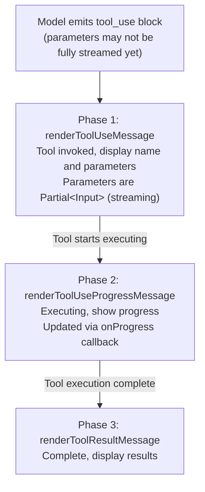

# Chapter 2: Tool System — 모델의 손이 되는 40개 이상의 Tool (Tool System — 40+ Tools as the Model's Hands)

## 왜 Tool System이 Claude Code의 핵심인가

대규모 언어 모델은 텍스트 도메인에서 "사고"하지만, 소프트웨어 엔지니어링의 동작은 file system, terminal, network에서 일어난다. **tool system**은 이 두 세계를 잇는 다리다. 모델의 의도를 실제 side-effect로 번역하고, 그 side-effect의 결과를 다시 모델이 소비할 수 있는 텍스트로 번역한다.

Claude Code의 tool system은 40개 이상의 built-in tool과 무제한 MCP 확장 tool을 관리한다. 이 tool들은 평면적인 배열이 아니다. 정교한 pipeline을 통과한다. **Definition -> Registration -> Filtering -> Invocation -> Rendering**. 각 단계에는 명확한 contract가 있다. 이 Chapter는 `Tool.ts`의 interface 정의에서 출발해 이 pipeline의 각 계층에서 내려진 설계 결정을 해부한다.

---

## 2.1 `Tool` Interface Contract

모든 tool — built-in `BashTool`이든 MCP protocol로 로드된 third-party tool이든 — 은 동일한 TypeScript interface를 만족해야 한다. 이 interface는 `restored-src/src/Tool.ts:362-695`에 정의되어 있으며, tool system 전체의 주춧돌이다.

### 핵심 필드 개요

| 필드 | 타입 | 책임 | 필수 여부 |
|-------|------|---------------|----------|
| `name` | `readonly string` | tool의 고유 식별자. permission 매칭, analytics, API 전송에 사용 | Yes |
| `description` | `(input, options) => Promise<string>` | 모델로 전송되는 tool 설명 텍스트를 반환. permission context에 따라 동적으로 조정 가능 | Yes |
| `prompt` | `(options) => Promise<string>` | tool의 system prompt를 반환 (Chapter 8 참조) | Yes |
| `inputSchema` | `z.ZodType` (Zod v4) | Zod schema로 tool 파라미터 구조를 정의. API용 JSON Schema로 자동 변환 | Yes |
| `call` | `(args, context, canUseTool, parentMessage, onProgress?) => Promise<ToolResult>` | tool의 핵심 실행 로직 | Yes |
| `checkPermissions` | `(input, context) => Promise<PermissionResult>` | tool-level permission 검사. 일반 permission 시스템 이후 수행 | Yes* |
| `validateInput` | `(input, context) => Promise<ValidationResult>` | permission 검사 이전에 입력의 적법성 검증 | No |
| `maxResultSizeChars` | `number` | 단일 tool result의 문자 수 제한. 초과 시 디스크로 persist | Yes |
| `isConcurrencySafe` | `(input) => boolean` | 다른 tool과 동시에 실행할 수 있는지 여부 | Yes* |
| `isReadOnly` | `(input) => boolean` | read-only operation인지 여부 (file system을 수정하지 않음) | Yes* |
| `isEnabled` | `() => boolean` | 현재 환경에서 이 tool이 가용한지 여부 | Yes* |

> *표시된 필드는 `buildTool()`이 기본값을 제공하므로 tool 정의에서 생략 가능하다.

심층적으로 살펴볼 가치가 있는 설계 선택이 몇 가지 있다.

**`description`은 문자열이 아니라 함수다.** 같은 tool이라도 permission mode에 따라 다른 설명이 필요할 수 있다. 예를 들어 사용자가 특정 subcommand를 금지하는 `alwaysDeny` rule을 설정한 경우, tool 설명이 모델에게 "이런 operation은 시도하지 말라"고 선제적으로 알려 prompt 수준에서 무의미한 tool 호출을 방지할 수 있다.

**`inputSchema`는 Zod v4를 사용한다.** 이를 통해 tool 파라미터의 엄격한 runtime validation을 수행하면서, `z.toJSONSchema()`를 통해 Anthropic API용 JSON Schema를 자동 생성할 수 있다. Zod의 `z.strictObject()`는 모델이 정의되지 않은 파라미터를 전달하지 않도록 보장한다.

**`call`은 `canUseTool` callback을 받는다.** 이는 매우 중요한 설계다. tool은 실행 중 sub-operation에 대해 재귀적으로 permission을 확인해야 할 수 있다. 예를 들어 `AgentTool`은 sub-Agent를 spawn할 때 그 sub-Agent가 특정 tool을 사용할 permission이 있는지 확인해야 한다. permission 검사는 일회성 gate가 아니라 실행 과정 전반에 걸친 지속적 검증이다.

### Rendering Contract: 세 가지 메서드 그룹

`Tool` interface는 terminal UI에서 tool의 완전한 lifecycle 표현을 구성하는 렌더링 메서드 세트를 정의한다 (Section 2.5 참조).

```
renderToolUseMessage          // tool이 호출되었을 때 표시
renderToolUseProgressMessage  // 실행 중 progress 표시
renderToolResultMessage       // 실행 완료 후 결과 표시
```

또한 선택적인 메서드들도 있다: `renderToolUseErrorMessage`, `renderToolUseRejectedMessage` (permission 거부), `renderGroupedToolUse` (병렬 tool의 그룹 표시).

---

## 2.2 `buildTool()` Factory 함수와 Fail-Closed Default

모든 구체 tool은 `Tool` interface를 만족하는 object로 직접 export되는 것이 아니라, `buildTool()` factory 함수를 통해 구성된다. 이 함수는 `restored-src/src/Tool.ts:783-792`에 정의되어 있다.

```typescript
export function buildTool<D extends AnyToolDef>(def: D): BuiltTool<D> {
  return {
    ...TOOL_DEFAULTS,
    userFacingName: () => def.name,
    ...def,
  } as BuiltTool<D>
}
```

runtime 동작은 최소한이다. 단순한 object spread다. 그러나 타입 수준의 설계(`BuiltTool<D>` 타입)는 `{ ...TOOL_DEFAULTS, ...def }`의 의미를 정확히 모델링한다. tool 정의가 메서드를 제공하면 정의 버전을 사용하고, 그렇지 않으면 default를 사용한다.

### Default와 "Fail-Closed" 철학

`TOOL_DEFAULTS` (`restored-src/src/Tool.ts:757-769`)는 다음 안전 원칙을 따라 설계되었다. **불확실할 때는 가장 위험한 시나리오를 가정한다**.

| 기본 메서드 | 기본값 | 설계 의도 |
|---------------|---------------|---------------|
| `isEnabled` | `() => true` | 명시적으로 disable하지 않는 한 tool은 기본적으로 가용 |
| `isConcurrencySafe` | `() => false` | **Fail-closed**: 안전하지 않다고 가정, 동시 실행 금지 |
| `isReadOnly` | `() => false` | **Fail-closed**: 쓰기를 수행한다고 가정, permission 요구 |
| `isDestructive` | `() => false` | 기본적으로 비파괴적 |
| `checkPermissions` | `{ behavior: 'allow' }` 반환 | 일반 permission 시스템에 위임 |
| `toAutoClassifierInput` | `() => ''` | 기본적으로 자동 안전성 분류에 참여하지 않음 |
| `userFacingName` | `() => def.name` | tool 이름 사용 |

가장 중요한 두 default는 `isConcurrencySafe: false`와 `isReadOnly: false`다. 즉, 새 tool이 이 속성들을 선언하는 것을 잊으면, 시스템은 자동으로 "file system을 수정할 수 있으며 동시에 실행될 수 없는" 것으로 취급한다 — 가장 보수적이고 안전한 가정이다. tool 개발자가 `isConcurrencySafe() { return true }`와 `isReadOnly() { return true }`를 능동적으로 선언할 때에만 시스템이 제약을 완화한다.

### 실제 tool은 `buildTool`을 어떻게 사용하는가

`GrepTool`을 예로 들면 (`restored-src/src/tools/GrepTool/GrepTool.ts:160-194`),

```typescript
export const GrepTool = buildTool({
  name: GREP_TOOL_NAME,
  searchHint: 'search file contents with regex (ripgrep)',
  maxResultSizeChars: 20_000,
  strict: true,
  // ...
  isConcurrencySafe() { return true },   // Search is a safe concurrent operation
  isReadOnly() { return true },           // Search doesn't modify files
  // ...
})
```

`GrepTool`은 두 default를 명시적으로 override한다. search operation은 본질적으로 read-only이고 concurrency-safe하기 때문이다. 반대로 `BashTool` (`restored-src/src/tools/BashTool/BashTool.tsx:434-441`)은 조건부 concurrency safety를 갖는다.

```typescript
isConcurrencySafe(input) {
  return this.isReadOnly?.(input) ?? false;
},
isReadOnly(input) {
  const compoundCommandHasCd = commandHasAnyCd(input.command);
  const result = checkReadOnlyConstraints(input, compoundCommandHasCd);
  return result.behavior === 'allow';
},
```

`BashTool`은 명령이 read-only로 판정될 때에만 동시 실행을 허용한다. `git status`는 동시에 실행할 수 있지만 `git push`는 불가능하다. 이 **input-aware concurrency control**이 `buildTool`의 메서드 시그니처가 `input` 파라미터를 받는 이유다.

---

## 2.3 Tool Registration Pipeline: `tools.ts`

`restored-src/src/tools.ts`는 Tool Pool의 조립 센터다. 다음 핵심 질문에 답한다. **현재 환경에서 모델은 어떤 tool을 사용할 수 있는가?**

### 3단계 필터링

tool은 정의부터 최종 가용성까지 3단계 필터링을 거친다.

**Level 1: Compile-time/startup-time 조건부 로딩.** 많은 tool이 Feature Flag로 조건부 로드된다 (`restored-src/src/tools.ts:16-135`).

```typescript
const SleepTool =
  feature('PROACTIVE') || feature('KAIROS')
    ? require('./tools/SleepTool/SleepTool.js').SleepTool
    : null

const cronTools = feature('AGENT_TRIGGERS')
  ? [
      require('./tools/ScheduleCronTool/CronCreateTool.js').CronCreateTool,
      require('./tools/ScheduleCronTool/CronDeleteTool.js').CronDeleteTool,
      require('./tools/ScheduleCronTool/CronListTool.js').CronListTool,
    ]
  : []
```

`feature()` 함수는 `bun:bundle`에서 제공되며 bundle time에 평가된다. 즉, disable된 tool은 **최종 JavaScript bundle에 아예 나타나지 않는다** — runtime `if` 문보다 더 철저한 형태의 dead code elimination이다.

Feature Flag 외에도 환경 변수 기반의 조건부 로딩이 있다.

```typescript
const REPLTool =
  process.env.USER_TYPE === 'ant'
    ? require('./tools/REPLTool/REPLTool.js').REPLTool
    : null
```

`USER_TYPE === 'ant'`는 Anthropic 내부 직원용 특수 tool(`REPLTool`, `ConfigTool`, `TungstenTool` 등)을 표시하며, 공개 버전에서는 가용하지 않다.

**Level 2: `getAllBaseTools()`가 base tool pool을 조립한다.** 이 함수(`restored-src/src/tools.ts:193-251`)는 Level 1 필터링을 통과한 모든 tool을 배열로 모은다. 시스템의 "tool registry"다. 잠재적으로 존재할 수 있는 모든 tool이 여기에 등록된다. 현재 버전은 약 40개 이상의 built-in tool을 포함하며, 어떤 Feature Flag가 활성화되어 있는지에 따라 동적으로 조정된다.

```typescript
export function getAllBaseTools(): Tools {
  return [
    AgentTool,
    TaskOutputTool,
    BashTool,
    ...(hasEmbeddedSearchTools() ? [] : [GlobTool, GrepTool]),
    FileReadTool,
    FileEditTool,
    FileWriteTool,
    // ... 30+ more tools omitted
    ...(isToolSearchEnabledOptimistic() ? [ToolSearchTool] : []),
  ]
}
```

흥미로운 조건 하나를 주목하자. `hasEmbeddedSearchTools()`. Anthropic 내부 build에서는 `bfs`(fast find)와 `ugrep`이 Bun 바이너리에 embed되어 있다. 이 시점에서는 shell의 `find`와 `grep`이 이미 이 fast tool들로 alias되어 있기 때문에, 독립된 `GlobTool`과 `GrepTool`은 중복된다.

**Level 3: `getTools()` runtime 필터링.** 마지막 필터링 계층이다 (`restored-src/src/tools.ts:271-327`). 세 가지 operation을 수행한다.

1. **Permission 거부 필터링**: `filterToolsByDenyRules()`가 `alwaysDeny` rule에 의해 차단된 tool을 제거한다. 사용자가 `"Bash": "deny"`를 설정하면 `BashTool`은 모델에게 전송되는 tool 목록에 아예 나타나지 않는다.
2. **REPL mode 숨김**: REPL mode가 활성화되면 `Bash`, `Read`, `Edit` 등 기본 tool은 숨겨진다. `REPLTool`의 VM context를 통해 간접적으로 노출된다.
3. **`isEnabled()` 최종 체크**: 각 tool의 `isEnabled()` 메서드가 마지막 switch다.

### Simple Mode vs. Full Mode

`getTools()`는 "simple mode"(`CLAUDE_CODE_SIMPLE`)도 지원한다. `Bash`, `FileRead`, `FileEdit` 세 핵심 tool만 노출한다. 일부 통합 시나리오에서 유용하다. tool 수를 줄이면 token 소비가 낮아지고 모델의 의사 결정 부담도 감소한다.

### MCP Tool 통합

최종 tool pool은 `assembleToolPool()` (`restored-src/src/tools.ts:345-367`)로 조립된다.

```typescript
export function assembleToolPool(
  permissionContext: ToolPermissionContext,
  mcpTools: Tools,
): Tools {
  const builtInTools = getTools(permissionContext)
  const allowedMcpTools = filterToolsByDenyRules(mcpTools, permissionContext)
  const byName = (a: Tool, b: Tool) => a.name.localeCompare(b.name)
  return uniqBy(
    [...builtInTools].sort(byName).concat(allowedMcpTools.sort(byName)),
    'name',
  )
}
```

여기서 두 가지 핵심 설계가 있다.

1. **Built-in tool이 우선순위를 갖는다**: `uniqBy`는 동일한 이름이 처음 등장한 쪽을 유지한다. built-in tool이 먼저 나열되므로 이름이 충돌할 때 승리한다.
2. **안정적인 prompt caching을 위한 이름 정렬**: built-in tool과 MCP tool은 각각 정렬된 뒤 concatenate된다(섞이지 않는다). built-in tool이 "연속된 prefix"로 등장하도록 보장하기 위해서다. 이는 API 서버 쪽의 cache breakpoint 설계와 함께 작동한다. MCP tool이 built-in tool 사이에 섞여 있다면, MCP tool의 추가·삭제가 발생할 때마다 그 하위의 모든 cache key가 무효화될 것이다. Chapter 13 참조.

---

## 2.4 Tool Result Size Budget

tool이 결과를 반환할 때, 시스템은 핵심적인 긴장 관계에 직면한다. 모델은 올바른 결정을 내리기 위해 완전한 정보를 봐야 하지만, context window는 제한적이다. Claude Code는 **two-level budget**을 통해 이를 해결한다.

### Level 1: Tool별 결과 제한 `maxResultSizeChars`

각 tool은 `maxResultSizeChars` 필드를 통해 자신만의 결과 크기 제한을 선언한다. 이 제한을 초과하는 결과는 디스크에 persist되며, 모델은 preview와 디스크 파일 경로만 본다.

tool별 `maxResultSizeChars` 비교는 다음과 같다.

| Tool | `maxResultSizeChars` | 비고 |
|------|---------------------|-------|
| `McpAuthTool` | 10,000 | Auth 결과, 데이터 볼륨 작음 |
| `GrepTool` | 20,000 | 검색 결과는 간결해야 함 |
| `BashTool` | 30,000 | Shell 출력은 길 수 있음 |
| `GlobTool` | 100,000 | 파일 목록은 많을 수 있음 |
| `AgentTool` | 100,000 | Sub-Agent 결과 |
| `WebSearchTool` | 100,000 | 웹 검색 결과 |
| `BriefTool` | 100,000 | Brief 요약 |
| `FileReadTool` | **Infinity** | 절대 persist되지 않음 (아래 참조) |

`FileReadTool`의 `maxResultSizeChars: Infinity`는 특별한 설계다. Read -> 파일로 persist -> Read의 순환 참조를 피하기 위함이다. 시스템에는 전역 상한선 `DEFAULT_MAX_RESULT_SIZE_CHARS = 50,000`도 있으며 (`restored-src/src/constants/toolLimits.ts:13`), tool이 무엇을 선언하든 상관없이 hard cap 역할을 한다.

### Level 2: Message별 합산 제한

모델이 한 turn 내에서 여러 tool을 병렬로 호출하면, 모든 tool 결과는 같은 user message 내 여러 `tool_result` block으로 전송된다. `MAX_TOOL_RESULTS_PER_MESSAGE_CHARS = 200,000` (`restored-src/src/constants/toolLimits.ts:49`)는 단일 message 내 tool 결과의 총 크기를 제한하여, N개의 병렬 tool이 집합적으로 context window를 압도하는 것을 방지한다.

FileReadTool Infinity 설계 근거, message별 budget persist 구현 세부사항(`ContentReplacementState` 결정의 persist와 Infinity 예외 메커니즘 포함)은 Chapter 4에서 다룬다.

### Size Budget 파라미터 요약

| 상수 | 값 | 정의 위치 |
|----------|-------|-------------------|
| `DEFAULT_MAX_RESULT_SIZE_CHARS` | 50,000 chars | `constants/toolLimits.ts:13` |
| `MAX_TOOL_RESULT_TOKENS` | 100,000 tokens | `constants/toolLimits.ts:22` |
| `MAX_TOOL_RESULT_BYTES` | 400,000 bytes | `constants/toolLimits.ts:33` (= 100K tokens x 4 bytes/token) |
| `MAX_TOOL_RESULTS_PER_MESSAGE_CHARS` | 200,000 chars | `constants/toolLimits.ts:49` |
| `TOOL_SUMMARY_MAX_LENGTH` | 50 chars | `constants/toolLimits.ts:57` |

---

## 2.5 3단계 Rendering Flow

terminal UI에서 tool의 표현은 일회성 이벤트가 아니라 3단계 점진적 프로세스다. 이 세 단계는 tool 실행 lifecycle과 일대일로 대응된다.

### 흐름도



### Phase 1: `renderToolUseMessage` — 의도 표시

모델이 `tool_use` block을 출력하면 이 메서드가 즉시 호출된다. 시그니처에서 핵심 타입을 주목하라.

```typescript
renderToolUseMessage(
  input: Partial<z.infer<Input>>,  // Note: Partial!
  options: { theme: ThemeName; verbose: boolean; commands?: Command[] },
): React.ReactNode
```

`input`이 `Partial`인 이유는 다음과 같다. API는 tool 파라미터 JSON을 streaming 방식으로 반환하며, JSON parsing이 완료되기 전에는 일부 필드만 사용할 수 있다. UI는 파라미터가 불완전한 상태에서도 렌더링할 수 있어야 한다. 사용자가 빈 화면을 봐서는 안 된다.

`BashTool`을 예로 들면, `command` 필드가 완전히 수신되지 않은 상태에서도 UI는 이미 "Bash" label과 그때까지 수신된 부분 명령 텍스트를 표시할 수 있다.

### Phase 2: `renderToolUseProgressMessage` — 프로세스 가시성

이것은 **선택적** 메서드다. 오래 실행되는 tool(`BashTool`, `AgentTool` 등)에게는 progress 피드백이 결정적이다. `BashTool`은 shell 명령이 2초 이상 실행되면 progress를 표시하기 시작한다 (`PROGRESS_THRESHOLD_MS = 2000`, `restored-src/src/tools/BashTool/BashTool.tsx:55`).

Progress는 `onProgress` callback을 통해 전달된다. 각 tool의 progress 데이터 구조는 서로 다르다. `BashTool`의 `BashProgress`는 stdout/stderr 조각을 포함하고, `AgentTool`의 `AgentToolProgress`는 sub-Agent의 message stream을 포함한다. 이 타입들은 `restored-src/src/types/tools.ts`에 통일적으로 정의되어 있으며, `ToolProgressData` union type으로 제약된다.

### Phase 3: `renderToolResultMessage` — 결과 표시

이것도 **선택적** 메서드다. 생략하면 tool 결과는 terminal에 렌더링되지 않는다 (예: `TodoWriteTool`의 결과는 대화 흐름이 아니라 전용 panel을 통해 표시된다).

`renderToolResultMessage`는 `style?: 'condensed'` 옵션을 받는다. non-verbose mode에서는 검색 계열 tool(`GrepTool`, `GlobTool`)이 간결한 요약을 표시하고 (예: "Found 42 files across 3 directories"), verbose mode에서는 전체 결과를 표시한다. tool은 `isResultTruncated(output)`를 사용해 현재 결과가 truncate되었는지 UI에 알릴 수 있으며, fullscreen mode에서 "click to expand" 상호작용을 가능케 한다.

### Grouped Rendering: `renderGroupedToolUse`

모델이 한 turn 내에서 같은 유형의 tool을 여러 개 병렬 호출할 때 (예: `Grep` 검색 5회), 각각을 개별 렌더링하면 화면 공간을 크게 소비한다. `renderGroupedToolUse` 메서드는 tool이 여러 병렬 호출을 compact한 그룹 뷰로 병합할 수 있게 한다 — 예: "Searched 5 patterns, found 127 results across 34 files."

이 메서드는 **non-verbose mode에서만** 작동한다. verbose mode에서는 각 tool 호출이 여전히 원래 위치에서 독립적으로 렌더링되어, 디버깅 중 정보 손실이 없도록 보장된다.

---

## 2.6 구체적 Tool에서 본 설계 패턴

### BashTool: 가장 복잡한 Tool

`BashTool` (`restored-src/src/tools/BashTool/BashTool.tsx`)은 tool system 전체에서 단일 tool 중 가장 복잡하다. shell 명령의 의미 공간이 무한하기 때문이다. 다음을 수행해야 한다.

- **명령 구조 파싱**으로 read-only 여부 판정 (`checkReadOnlyConstraints`와 `parseForSecurity`)
- **Pipe와 compound 명령 이해** (`ls && echo "---" && ls`도 여전히 read-only)
- **조건부 동시성**: read-only 명령만 동시에 실행할 수 있음
- **Progress 추적**: 2초 이상 실행되는 명령은 streaming stdout 출력을 표시
- **파일 변경 추적**: `fileHistoryTrackEdit`와 `trackGitOperations`로 shell 명령에 의한 파일 수정 기록
- **Sandbox 실행**: 특정 조건에서 `SandboxManager`를 통해 격리 실행

`BashTool`의 `maxResultSizeChars`는 30,000으로 설정되어 있다. `GrepTool`의 20,000보다 관대한데, shell 출력이 일반적으로 더 구조화된 정보를 담고 있으며(컴파일 에러, 테스트 결과 등) 모델이 올바른 결정을 내리기 위해 충분한 context를 봐야 하기 때문이다.

### GrepTool: Concurrency Safety의 본보기

`GrepTool`의 설계는 비교적 깔끔하다. `isConcurrencySafe: true`와 `isReadOnly: true`를 무조건적으로 선언한다. 검색 operation은 결코 file system을 수정하지 않기 때문이다. `maxResultSizeChars`는 20,000으로 설정되어 있다. 이 길이를 초과하는 검색 결과는 모델의 검색 범위가 너무 넓다는 신호이며, 디스크에 persist하고 preview를 반환하는 것이 오히려 모델이 전략을 조정하는 데 도움이 된다.

### FileReadTool: `Infinity`의 철학

`FileReadTool`은 `maxResultSizeChars`를 `Infinity`로 설정하고, 대신 자체 `maxTokens`와 `maxSizeBytes` 제한으로 출력 크기를 통제한다. 이는 앞서 언급한 순환 read 문제를 피하며, `FileReadTool`의 결과가 디스크 참조로 교체되지 않음을 의미한다. 모델은 항상 파일 내용을 직접 본다.

---

## 2.7 Deferred Loading과 ToolSearch

tool 수가 일정 임계를 초과하면(특히 많은 MCP tool이 연결된 뒤), 모든 tool의 완전한 schema를 모델에게 전송하는 것은 많은 token을 소비한다. Claude Code는 **Deferred Loading** 메커니즘으로 이를 해결한다.

`shouldDefer: true`로 표시된 tool은 초기 prompt에 tool name만 전송하고(`defer_loading: true`), 완전한 파라미터 schema는 보내지 않는다. 모델은 이러한 deferred tool을 호출하기 전에 먼저 `ToolSearchTool`을 호출해 키워드로 검색하고 tool의 완전한 정의를 가져와야 한다.

각 tool의 `searchHint` 필드는 이 목적을 위해 설계되었다. `ToolSearchTool`이 키워드 매칭을 수행하는 데 도움이 되도록 3–10 단어의 능력 설명을 제공한다. 예를 들어 `GrepTool`의 `searchHint`는 `'search file contents with regex (ripgrep)'`이다.

`alwaysLoad: true`로 표시된 tool은 절대 defer되지 않는다. 완전한 schema가 항상 초기 prompt에 나타난다. 모델이 첫 대화 turn에서 직접 호출할 수 있어야 하는 핵심 tool을 위한 설정이다.

---

## 2.8 패턴 추출 (Pattern Extraction)

Claude Code의 tool system 설계로부터, AI Agent builder에게 보편적 가치를 갖는 몇 가지 패턴을 추출할 수 있다.

**Pattern 1: Fail-closed default.** `buildTool()`의 default는 가장 위험한 시나리오(concurrency-safe가 아님, read-only가 아님)를 가정하며, tool 개발자가 안전 속성을 능동적으로 선언하도록 요구한다. 이는 안전성을 "opt-in"에서 "opt-out"으로 뒤집어, 누락으로 인한 리스크를 크게 줄인다.

**Pattern 2: 계층적 budget 통제.** 단일 tool 결과에 상한이 있고, 단일 message에도 합산 상한이 있다. 두 계층은 상호 보완적이다. tool별 제한은 단일 지점의 폭주를 막고, message 제한은 병렬 호출로 인한 집합적 폭발을 막는다.

**Pattern 3: Input-aware 속성.** `isConcurrencySafe(input)`과 `isReadOnly(input)`은 전역적 판단이 아니라 tool input을 받는다. 동일한 `BashTool`이라도 `ls`와 `rm`에 대해 완전히 다른 안전 속성을 가진다. 이러한 fine-grained input awareness는 정밀한 permission 통제의 기반이다. Chapter 4 참조.

**Pattern 4: 점진적 렌더링.** 3단계 렌더링(의도 -> progress -> 결과)은 사용자에게 tool 실행의 매 단계에서 가시성을 제공한다. `Partial<Input>` 설계는 파라미터 streaming 중에도 UI가 비어 있지 않도록 보장한다. 이는 사용자 신뢰에 결정적이다. 사용자는 Agent가 무엇을 하고 있는지 알아야 하며, 회전하는 loading icon만 바라봐서는 안 된다.

**Pattern 5: Compile-time 제거 vs. runtime 필터링.** Feature Flag는 `bun:bundle`의 `feature()`로 disable된 tool 코드를 compile time에 제거하고, permission rule은 runtime에 tool 목록을 필터링한다. 두 메커니즘은 서로 다른 목적을 수행한다. 전자는 bundle 크기와 공격 표면을 줄이고, 후자는 사용자 수준의 설정을 지원한다.

---

## 당신이 할 수 있는 일 (What You Can Do)

Claude Code의 tool system 설계 경험을 바탕으로, 자신만의 AI Agent tool system을 만들 때 취할 수 있는 행동은 다음과 같다.

- **"Fail-closed" default를 채택하라.** tool 등록 프레임워크에서 `isConcurrencySafe`, `isReadOnly` 같은 안전 속성의 default를 가장 보수적인 옵션으로 설정하라. 안전을 기본으로 가정하지 말고, tool 개발자가 능동적으로 안전 속성을 선언하게 하라.
- **모든 tool에 결과 크기 제한을 설정하라.** tool이 무한히 큰 결과를 반환하게 두지 말라. tool별 제한(`maxResultSizeChars` 같은)과 message별 합산 제한을 설정하라. 초과 시 디스크에 persist하고 preview를 반환하라.
- **tool 설명을 정적 문자열이 아니라 함수로 만들라.** permission mode나 context에 따라 tool이 서로 다른 동작 제한을 가진다면, 설명을 동적으로 생성하여 prompt 수준에서 모델이 무의미한 호출을 피하도록 안내할 수 있다.
- **3단계 렌더링을 구현하라.** 오래 실행되는 tool에 대해 progress 피드백을 제공하라(의도 표시 -> 실행 progress -> 최종 결과). 사용자가 항상 Agent가 무엇을 하는지 알 수 있게 하라. 파라미터 streaming 중에도 렌더링할 수 있도록 `Partial<Input>`을 지원하라.
- **조건부 로딩으로 tool 집합을 줄이라.** Feature Flag나 환경 변수를 통해 불필요한 tool을 compile time/startup time에 걸러내어 token 소비와 모델의 의사 결정 부담을 낮춰라. 많은 MCP tool을 다루는 시나리오에서는 deferred loading 메커니즘을 고려하라.
- **tool 순서를 안정적으로 유지하라.** API prompt caching을 사용한다면, tool 목록 순서가 요청 간에 안정적으로 유지되도록 보장하라. built-in tool을 연속된 prefix로 배치하고, MCP tool은 이름 정렬 후 append하여 빈번한 cache key 무효화를 피하라.

---

## 요약 (Summary)

Claude Code의 tool system은 정교한 계층화 아키텍처다. `Tool` interface가 contract를 정의하고, `buildTool()`이 안전한 default를 제공하며, `tools.ts` 등록 pipeline이 compile-time과 runtime의 2단계 필터링을 통해 tool pool을 조립하고, size budget 메커니즘이 tool별과 message별 두 수준에서 context 소비를 통제하며, 3단계 렌더링이 tool 실행 과정을 사용자에게 완전히 투명하게 만든다.

이 시스템의 설계 철학은 한 문장으로 요약할 수 있다. **옳은 일은 쉽게, 위험한 일은 어렵게 만들어라.** `buildTool()`의 fail-closed default는 "안전 속성 선언을 잊는 것"을 안전한 실수로 만든다. 계층적 budget은 "tool이 너무 많은 데이터를 반환하는 것"을 통제 가능한 degradation으로 만든다. 조건부 로딩은 "실험적 tool을 추가하는 것"을 zero-risk operation으로 만든다.

tool 호출과 orchestration — 완전한 permission 검사 흐름, 동시 실행 스케줄링 전략, streaming progress 전파 메커니즘을 포함 — 은 Chapter 4에서 자세히 다룬다.
