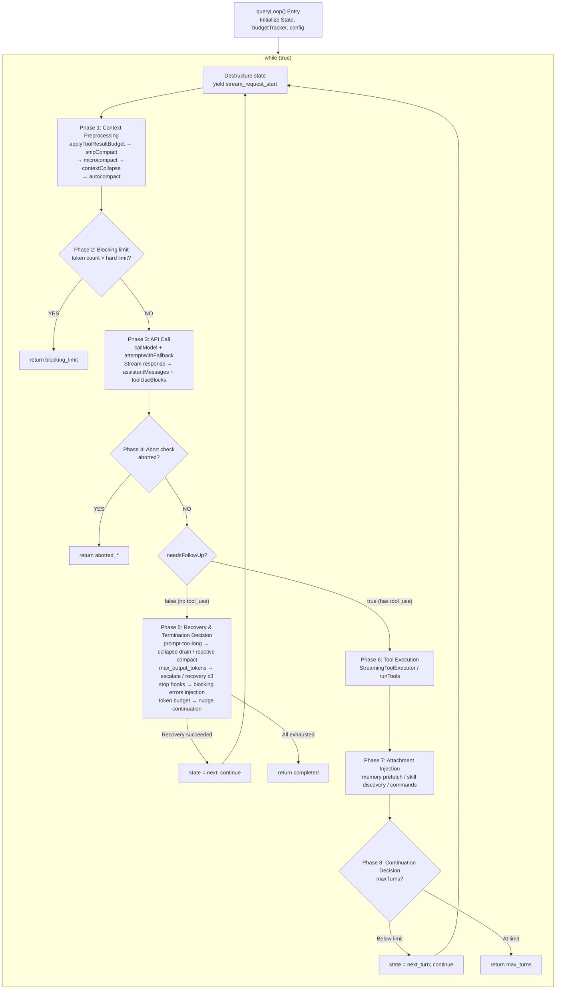

# Chapter 3: Agent Loop — 사용자 입력부터 모델 응답까지의 전체 lifecycle (Agent Loop — The Full Lifecycle from User Input to Model Response)

> *"A loop is not a loop when every iteration reshapes the world it runs in."*

이 Chapter는 책 전체의 anchor다. Chapter 5의 API 호출 구성에서 Chapter 9의 automatic compaction 전략까지, Chapter 13의 streaming 응답 처리에서 Chapter 16의 permission 검사 시스템까지 — 이후 Chapter에서 논의되는 거의 모든 서브시스템은 궁극적으로 `queryLoop()`이라는 핵심 loop 내에서 orchestration되고 조율되며 구동된다. 이 loop를 이해한다는 것은 Claude Code가 AI Agent로서 뛰는 심장을 이해한다는 뜻이다.

## 3.1 Agent Loop이 단순한 REPL이 아닌 이유

전통적인 REPL(Read-Eval-Print Loop)은 무상태(stateless)의 3단 cycle이다. 입력을 읽고, 평가하고, 결과를 출력한다. iteration 간 context 전달도, 자동 복구도, 자신의 상태에 대한 인식도 없다.

Agent Loop은 근본적으로 다르다. 다음 비교표를 보자.

| 차원 | 전통적 REPL | Claude Code Agent Loop |
|-----------|-----------------|----------------------|
| 상태 모델 | Stateless 또는 history-only | `State` 타입에 10개의 mutable 필드. iteration 간 운반 |
| Loop 종료 | 사용자가 명시적으로 exit | 7가지 `Continue` transition + 10가지 `Terminal` 종료 사유 |
| 에러 처리 | 에러 출력 후 계속 | 자동 degradation, 모델 전환, reactive compact, retry 제한 |
| Context 관리 | 없음 | snip -> microcompact -> context collapse -> autocompact의 4단 pipeline |
| Tool 실행 | 없음 | streaming parallel 실행, permission 검사, 결과 budget trimming |
| 대화 용량 | OOM까지 무제한 증가 | token budget 추적, automatic compaction, blocking limit hard cap |

Agent Loop의 매 iteration은 자신의 동작 조건을 바꿀 수 있다. compaction은 message 배열을 줄이고, 모델 degradation은 inference backend를 바꾸며, stop hook은 새 제약 message를 주입한다. 이것은 loop가 아니라 **self-modifying state machine**이다.

## 3.2 queryLoop State Machine 개관

### 3.2.1 Entry: `query()`와 `queryLoop()`

entry 함수 `query()`는 얇은 래퍼다. `queryLoop()`을 호출해 결과를 얻은 뒤, 소비된 모든 command에 lifecycle 완료를 알린다.

```
restored-src/src/query.ts:219-238
```

```typescript
export async function* query(params: QueryParams): AsyncGenerator<...> {
  const consumedCommandUuids: string[] = []
  const terminal = yield* queryLoop(params, consumedCommandUuids)
  for (const uuid of consumedCommandUuids) {
    notifyCommandLifecycle(uuid, 'completed')
  }
  return terminal
}
```

실제 state machine은 `queryLoop()` (`restored-src/src/query.ts:241`)에 있다. `while (true)` loop로, `state = next; continue`를 통해 다음 iteration으로 넘어가거나 `return { reason: '...' }`로 종료한다.

### 3.2.2 State 타입: Iteration을 가로지르는 Mutable State

`State` 타입은 loop가 iteration 간 운반해야 하는 모든 mutable 상태를 정의한다 (`restored-src/src/query.ts:204-217`).

| 필드 | 타입 | 의미 |
|-------|------|-----------|
| `messages` | `Message[]` | 현재 대화 message 배열. 매 iteration 후 assistant 응답과 tool 결과가 append됨 |
| `toolUseContext` | `ToolUseContext` | tool 실행 context. 가용 tool 목록, permission mode, abort signal 등을 포함 |
| `autoCompactTracking` | `AutoCompactTrackingState \| undefined` | auto-compaction 추적 상태. compaction이 trigger되었는지와 연속 실패 횟수를 기록 |
| `maxOutputTokensRecoveryCount` | `number` | 지금까지 시도된 max_output_tokens recovery 횟수. 최대 3회 |
| `hasAttemptedReactiveCompact` | `boolean` | reactive compact가 시도되었는지. retry 죽음의 loop를 방지 |
| `maxOutputTokensOverride` | `number \| undefined` | default max_output_tokens의 override 값. escalation retry에 사용 (예: 8k -> 64k) |
| `pendingToolUseSummary` | `Promise<...> \| undefined` | 이전 라운드 tool 실행 요약의 Promise. 다음 라운드의 모델 streaming 중 병렬로 await됨 |
| `stopHookActive` | `boolean \| undefined` | stop hook 활성 여부. 중복 trigger 방지 |
| `turnCount` | `number` | 현재 turn 수. `maxTurns` 제한 검사에 사용 |
| `transition` | `Continue \| undefined` | 이전 iteration이 왜 계속되었는지. 테스트와 디버깅에서 recovery 경로가 실제로 trigger되었는지 assert할 수 있게 함 |

핵심 설계 결정 하나를 주목하자. 소스 주석은 명시적으로 언급한다. "Continue sites write `state = { ... }` instead of 9 separate assignments" (`restored-src/src/query.ts:267`). 즉, 모든 continuation point는 완전한 `State` object를 명시적으로 구성해야 한다. 이 접근은 "필드 리셋을 잊는" 버그 유형을 제거한다. 7개의 continuation point를 가진 loop에서 이는 이론적 리스크가 아니라 필연적 사고다.

### 3.2.3 Continue Transition 유형

loop는 내부에 7개의 `continue` 지점을 가지며, 각각 transition 사유를 기록한다. 소스 코드에서 추출한 전체 enumeration은 다음과 같다.

| `Continue.reason` | Trigger 조건 | 전형적 동작 |
|-------------------|-------------------|------------------|
| `next_turn` | 모델이 `tool_use` block을 반환 | assistant + tool_result append, turnCount 증가, 다음 turn 시작 |
| `max_output_tokens_escalate` | 모델 출력이 truncate되었고 아직 escalate되지 않음 | maxOutputTokensOverride를 64k로 설정, 같은 요청을 그대로 재시도 |
| `max_output_tokens_recovery` | 출력 truncate, escalation 소진, recovery 횟수 < 3 | 모델에게 계속할 것을 요청하는 meta message 주입, recovery 횟수 증가 |
| `reactive_compact_retry` | prompt-too-long 또는 media-size 에러 | reactive compact 수행 후 재시도 |
| `collapse_drain_retry` | pending context collapse 제출이 있는 상태에서 prompt-too-long | 대기 중인 collapse를 모두 실행한 뒤 재시도 |
| `stop_hook_blocking` | stop hook이 blocking 에러를 반환 | message 스트림에 blocking 에러 주입, 모델에게 교정 기회 부여 |
| `token_budget_continuation` | token budget이 아직 소진되지 않음 | 모델이 계속 작업하도록 격려하는 nudge message 주입 |

### 3.2.4 Terminal 종료 사유

loop는 `return`으로 종료되며, 반환값에는 `reason` 필드가 포함된다. 소스 코드에서 추출한 전체 enumeration은 다음과 같다.

| `Terminal.reason` | 의미 |
|-------------------|-----------|
| `completed` | 모델이 정상적으로 완료 (tool_use 없음), 또는 API 에러이지만 recovery 소진 |
| `blocking_limit` | token 수가 hard limit에 도달, 계속 불가 |
| `prompt_too_long` | prompt-too-long 에러와 모든 recovery 수단(collapse drain + reactive compact) 실패 |
| `image_error` | 이미지 크기/형식 에러 |
| `model_error` | 모델 호출이 예상치 못한 예외를 발생 |
| `aborted_streaming` | 사용자가 streaming 응답 도중 중단 |
| `aborted_tools` | 사용자가 tool 실행 도중 중단 |
| `stop_hook_prevented` | stop hook이 계속을 차단 |
| `hook_stopped` | tool 실행 중 Hook이 후속 operation을 차단 |
| `max_turns` | 최대 turn 제한 도달 |

> **Interactive 버전**: [Agent Loop 애니메이션 시각화 보기](agent-loop-viz.html) — "help me fix a bug"라는 완전한 대화가 state machine을 어떻게 흐르는지 관찰할 수 있다. 각 단계를 클릭하면 소스 참조와 상세 설명이 나타난다.

다음 흐름도는 state machine의 완전한 topology를 보여준다.



일반 텍스트 환경에서 읽어야 하는 독자를 위해 원본 ASCII 버전도 함께 제공한다.

<details>
<summary>ASCII Flow Diagram (펼치려면 클릭)</summary>

```
┌──────────────────────────────────────────────────────────────────────┐
│                        queryLoop() Entry                             │
│  Initialize State, budgetTracker, config, pendingMemoryPrefetch      │
└──────────────┬───────────────────────────────────────────────────────┘
               │
               ▼
┌───────────────────────────────────────────────────┐
│              while (true) {                       │
│  Destructure state → messages, toolUseContext, ...│
│  yield { type: 'stream_request_start' }           │
├───────────────────────────────────────────────────┤
│                                                   │
│   ┌──────────────────────────────────────────┐    │
│   │ Phase 1: Context Preprocessing           │    │
│   │ applyToolResultBudget                    │    │
│   │ → snipCompact (HISTORY_SNIP)             │    │
│   │ → microcompact                           │    │
│   │ → contextCollapse (CONTEXT_COLLAPSE)     │    │
│   │ → autocompact ───── See Ch.9 ──────────  │    │
│   └──────────────┬───────────────────────────┘    │
│                  │                                │
│                  ▼                                │
│   ┌──────────────────────────────────────────┐    │
│   │ Phase 2: Blocking limit check            │    │
│   │ token count > hard limit ?               │    │
│   │   YES → return {reason:'blocking_limit'} │    │
│   └──────────────┬───────────────────────────┘    │
│                  │ NO                             │
│                  ▼                                │
│   ┌──────────────────────────────────────────┐    │
│   │ Phase 3: API Call ── See Ch.5 & Ch.13 ── │    │
│   │ attemptWithFallback loop                 │    │
│   │ callModel({                              │    │
│   │   messages: prependUserContext(...)      │    │
│   │   systemPrompt: appendSystemContext(...) │    │
│   │ })                                       │    │
│   │                                          │    │
│   │ Stream response → assistantMessages[]    │    │
│   │                → toolUseBlocks[]         │    │
│   │ FallbackTriggeredError → switch model    │    │
│   └──────────────┬───────────────────────────┘    │
│                  │                                │
│                  ▼                                │
│   ┌──────────────────────────────────────────┐    │
│   │ Phase 4: Abort check                     │    │
│   │ abortController.signal.aborted ?         │    │
│   │   YES → return {reason:'aborted_*'}      │    │
│   └──────────────┬───────────────────────────┘    │
│                  │ NO                             │
│                  ▼                                │
│   ┌──────────────────────────────────────────┐    │
│   │ Phase 5: needsFollowUp == false branch   │    │
│   │ (model did not return tool_use)          │    │
│   │                                          │    │
│   │ ┌─ prompt-too-long recovery ───────────┐ │    │
│   │ │ collapse drain → reactive compact    │ │    │
│   │ │ Success → state=next; continue       │ │    │
│   │ └──────────────────────────────────────┘ │    │
│   │ ┌─ max_output_tokens recovery ─────────┐ │    │
│   │ │ escalate(8k→64k) → recovery(×3)      │ │    │
│   │ │ Success → state=next; continue       │ │    │
│   │ └──────────────────────────────────────┘ │    │
│   │ ┌─ stop hooks ── See Ch.16 ────────────┐ │    │
│   │ │ blockingErrors → state=next;continue │ │    │
│   │ └──────────────────────────────────────┘ │    │
│   │ ┌─ token budget check ─────────────────┐ │    │
│   │ │ budget remaining → state=next;       │ │    │
│   │ │ continue                             │ │    │
│   │ └──────────────────────────────────────┘ │    │
│   │                                          │    │
│   │ return { reason: 'completed' }           │    │
│   └──────────────────────────────────────────┘    │
│                  │                                │
│            needsFollowUp == true                  │
│                  │                                │
│                  ▼                                │
│   ┌──────────────────────────────────────────┐    │
│   │ Phase 6: Tool Execution                  │    │
│   │ streamingToolExecutor.getRemainingResults│    │
│   │ or runTools() ── See Ch.4 ────────────── │    │
│   │ → toolResults[]                          │    │
│   └──────────────┬───────────────────────────┘    │
│                  │                                │
│                  ▼                                │
│   ┌──────────────────────────────────────────┐    │
│   │ Phase 7: Attachment Injection            │    │
│   │ getAttachmentMessages()                  │    │
│   │ pendingMemoryPrefetch consume            │    │
│   │ skillDiscoveryPrefetch consume           │    │
│   │ queuedCommands drain                     │    │
│   └──────────────┬───────────────────────────┘    │
│                  │                                │
│                  ▼                                │
│   ┌──────────────────────────────────────────┐    │
│   │ Phase 8: Continuation Decision           │    │
│   │ maxTurns check                           │    │
│   │ state = { reason: 'next_turn', ... }     │    │
│   │ continue                                 │    │
│   └──────────────────────────────────────────┘    │
│                                                   │
└───────────────────────────────────────────────────┘
```

</details>

## 3.3 단일 iteration의 완전한 흐름

단일 iteration의 각 phase를 처음부터 끝까지 추적해 보자.

### 3.3.1 Context 전처리 Pipeline

매 iteration 시작 시, 원본 `messages` 배열은 API로 전송되기 전에 4~5단계의 처리를 거쳐야 한다. 이 단계들은 엄격한 순서로 실행되며, 순서를 바꿀 수 없다.

**Level 1: Tool Result Budget Trimming**

```
restored-src/src/query.ts:379-394
```

`applyToolResultBudget()`는 집계된 tool 결과에 size 제한을 적용한다. 모든 compaction 단계 이전에 실행된다. 이후의 cached microcompact는 내용을 검사하지 않고 `tool_use_id`만으로 동작하므로, 내용을 먼저 trim해도 간섭하지 않는다.

**Level 2: History Snip**

```
restored-src/src/query.ts:401-410
```

`snipCompactIfNeeded()`는 가벼운 compaction이다. history에서 오래된 message를 snip하여 token 공간을 확보한다. 중요하게도, `tokensFreed` 값을 반환한다. 이 값은 autocompact에 전달되어, snip이 이미 확보한 공간을 임계 결정이 고려할 수 있게 한다.

**Level 3: Microcompact**

```
restored-src/src/query.ts:414-426
```

Microcompact는 autocompact 이전에 실행되는 fine-grained compaction이다. "cached edit" mode(`CACHED_MICROCOMPACT`)도 지원하며, API의 cache 삭제 메커니즘을 활용해 추가 API 호출 없는 compaction을 달성한다.

**Level 4: Context Collapse**

```
restored-src/src/query.ts:440-447
```

Context Collapse는 read-time projection 메커니즘이다. 소스 주석이 우아한 설계를 드러낸다.

> *"Nothing is yielded — the collapsed view is a read-time projection over the REPL's full history. Summary messages live in the collapse store, not the REPL array."* (`restored-src/src/query.ts:434-436`)

즉, collapse는 원본 message 배열을 수정하지 않고 매 iteration에서 re-project한다. collapse 결과는 continuation point에서 `state.messages`로 전달되며, 다음 `projectView()`는 no-op이 된다. archive된 message가 이미 입력에서 부재하기 때문이다.

**Level 5: Autocompact** (Chapter 9 참조)

```
restored-src/src/query.ts:454-468
```

automatic compaction은 가장 무거운 전처리 단계다. context collapse 이후에 실행된다. 만약 collapse가 이미 token 수를 임계 아래로 낮추었다면, autocompact는 no-op이 되어 단일 요약을 생성하는 대신 더 fine-grained한 context를 보존한다.

이 5단 pipeline의 설계는 한 원칙을 따른다. **가벼운 것에서 무거운 것으로, 국소적인 것에서 전역적인 것으로**. 각 level은 너무 많은 정보를 잃지 않고 공간을 확보하려 시도하며, 이전 level이 충분하지 않을 때에만 다음 level이 활성화된다.

### 3.3.2 Context 주입: prependUserContext와 appendSystemContext

message 전처리가 완료된 뒤, context는 두 함수를 통해 API 요청에 주입된다.

**`appendSystemContext`** (`restored-src/src/utils/api.ts:437-447`):

```typescript
export function appendSystemContext(
  systemPrompt: SystemPrompt,
  context: { [k: string]: string },
): string[] {
  return [
    ...systemPrompt,
    Object.entries(context)
      .map(([key, value]) => `${key}: ${value}`)
      .join('\n'),
  ].filter(Boolean)
}
```

system context는 system prompt의 끝에 append된다. 이 내용(현재 날짜, 작업 디렉터리 등)은 system prompt의 특별한 caching 위치의 이점을 받는다. API의 prompt caching은 system prompt에 가장 친화적이다.

**`prependUserContext`** (`restored-src/src/utils/api.ts:449-474`):

```typescript
export function prependUserContext(
  messages: Message[],
  context: { [k: string]: string },
): Message[] {
  // ...
  return [
    createUserMessage({
      content: `<system-reminder>\n...\n</system-reminder>\n`,
      isMeta: true,
    }),
    ...messages,
  ]
}
```

user context는 `<system-reminder>` 태그로 감싸져 **message 배열의 첫 user message로 prepend**된다. 이 위치 선택은 자의적이지 않다. context가 모든 대화 이전에 나타나도록 보장하며, `isMeta: true`로 표시된다(사용자 UI에 표시되지 않음). 중요한 prompt 텍스트가 포함된다. "this context may or may not be relevant to your tasks". 이는 모델에게 관련 없는 context를 무시할 자유를 준다.

호출 시점을 주목하자 (`restored-src/src/query.ts:660`).

```typescript
messages: prependUserContext(messagesForQuery, userContext),
systemPrompt: fullSystemPrompt,  // already appendSystemContext'd
```

`prependUserContext`는 전처리 pipeline 중이 아니라 API 호출 시점에 실행된다. 즉, user context는 token 카운팅이나 compaction 결정에 참여하지 않는다. "투명한" 주입이다.

### 3.3.3 Message 정규화 Pipeline

API 호출 구성 단계 (`restored-src/src/services/api/claude.ts:1259-1314`)에서 message는 4단계 정규화 pipeline을 통과한다. 이 pipeline의 책임은 Claude Code의 풍부한 내부 message 타입을 Anthropic API가 수용하는 엄격한 포맷으로 변환하는 것이다.

**Step 1: `normalizeMessagesForAPI()`** (`restored-src/src/utils/messages.ts:1989`)

가장 복잡한 정규화 단계다. 다음 작업을 수행한다.

1. **Attachment 재정렬**: `reorderAttachmentsForAPI()`를 통해 tool_result 또는 assistant message에 도달할 때까지 attachment message를 위로 이동
2. **Virtual message 필터링**: 표시 전용으로 `isVirtual` 표시된 message 제거 (예: REPL 내부 tool 호출)
3. **System/progress message stripping**: `progress` 타입 message와 `local_command`가 아닌 `system` message 필터링
4. **Synthetic 에러 message 처리**: PDF/이미지/request-too-large 에러를 감지하고, 원본 user message에서 해당 media block을 strip하기 위해 역방향 검색
5. **Tool input 정규화**: `normalizeToolInputForAPI`를 통해 tool input 포맷 처리
6. **Message 병합**: 인접한 같은 role의 message 병합 (API는 user/assistant의 엄격한 교대를 요구)

**Step 2: `ensureToolResultPairing()`** (`restored-src/src/utils/messages.ts:5133`)

`tool_use` / `tool_result` 페어링 mismatch를 수정한다. 이 mismatch는 특히 remote session(remote/teleport session) 복구 시 흔하다. orphan `tool_use` block에 synthetic 에러 `tool_result`를 삽입하고, 존재하지 않는 `tool_use`를 참조하는 orphan `tool_result` block을 strip한다.

**Step 3: `stripAdvisorBlocks()`** (`restored-src/src/utils/messages.ts:5466`)

advisor block을 strip한다. 이 block은 API가 수용하려면 특정 beta header가 필요하다 (`restored-src/src/services/api/claude.ts:1304`).

```typescript
if (!betas.includes(ADVISOR_BETA_HEADER)) {
  messagesForAPI = stripAdvisorBlocks(messagesForAPI)
}
```

**Step 4: `stripExcessMediaItems()`** (`restored-src/src/services/api/claude.ts:956`)

API는 요청 당 최대 100개의 media item(이미지 + 문서)을 제한한다. 이 함수는 에러를 발생시키는 대신 오래된 message부터 초과된 media item을 조용히 제거한다. 이는 hard error로부터의 복구가 어려운 Cowork/CCD 시나리오에서 중요하다.

이 pipeline의 실행 순서는 자의적이지 않다. 소스 주석은 왜 정규화가 `ensureToolResultPairing` 이전에 와야 하는지 설명한다 (`restored-src/src/services/api/claude.ts:1272-1276`).

> *"normalizeMessagesForAPI uses isToolSearchEnabledNoModelCheck() because it's called from ~20 places (analytics, feedback, sharing, etc.), many of which don't have model context."*

이는 한 아키텍처적 사실을 드러낸다. `normalizeMessagesForAPI`는 널리 재사용되는 함수이며, 그 interface는 추가 파라미터를 함부로 받을 수 없다. 모델 특정 post-processing(예: tool search 필드 stripping)은 그 이후의 독립된 단계로 실행되어야 한다.

### 3.3.4 API 호출 Phase (Chapter 5 및 Chapter 13 참조)

API 호출은 `attemptWithFallback` loop로 래핑된다 (`restored-src/src/query.ts:650-953`).

```typescript
let attemptWithFallback = true
while (attemptWithFallback) {
  attemptWithFallback = false
  try {
    for await (const message of deps.callModel({
      messages: prependUserContext(messagesForQuery, userContext),
      systemPrompt: fullSystemPrompt,
      // ...
    })) {
      // Process streaming response messages
    }
  } catch (innerError) {
    if (innerError instanceof FallbackTriggeredError && fallbackModel) {
      currentModel = fallbackModel
      attemptWithFallback = true
      // Clean up orphaned messages, reset executor
      continue
    }
    throw innerError
  }
}
```

여기에는 주목할 만한 우아한 설계가 몇 가지 있다.

**Message immutability.** streaming message는 yield되기 전에 복제된다. 원본 `message`는 `assistantMessages` 배열에 push되고(API로 다시 전송), 복제된 버전(observable input이 backfill됨)이 SDK caller에게 yield된다. 소스 주석 (`restored-src/src/query.ts:744-746`)은 직접 설명한다. "mutating it would break prompt caching (byte mismatch)".

**Error withholding 메커니즘.** 복구 가능한 에러(prompt-too-long, max-output-tokens, media-size)는 streaming phase 동안 보류된다. caller에게 즉시 yield되지 않는다. 이후의 복구 로직이 복구가 불가능하다고 확정한 뒤에만 caller에게 release된다. 이는 SDK consumer(Desktop/Cowork 등)가 session을 조기 종료하는 것을 방지한다.

**Tombstone 처리.** streaming fallback이 발생하면, 이미 yield된 부분 message는 tombstone으로 삭제 통지된다 (`restored-src/src/query.ts:716-718`). 이는 미묘한 문제를 해결한다. 부분 message(특히 thinking block)는 서명을 동반하며, degradation 후 API가 "thinking blocks cannot be modified" 에러를 보고하게 된다.

### 3.3.5 Tool 실행 Phase (Chapter 4 참조)

모델 응답이 완료된 뒤 `tool_use` block이 있으면, loop는 tool 실행 phase로 진입한다 (`restored-src/src/query.ts:1363-1408`).

Claude Code는 두 가지 tool 실행 mode를 지원한다.

1. **Streaming parallel 실행** (`StreamingToolExecutor`): 모델이 여전히 streaming 중일 때 tool이 실행되기 시작한다. API 호출 phase 동안 각 `tool_use` block이 도착할 때마다 executor에 `addTool()`된다 (`restored-src/src/query.ts:841-843`). streaming이 끝난 뒤 `getRemainingResults()`가 완료된 결과와 대기 중인 결과를 모두 수집한다.
2. **Batch 실행** (`runTools()`): 모든 tool_use block을 먼저 수집한 뒤 한 번에 실행한다.

Tool 실행 결과는 `normalizeMessagesForAPI`를 통해 정규화되어 `toolResults` 배열에 append된다.

### 3.3.6 Stop Hook과 계속 결정

모델 응답에 tool_use가 없을 때(`needsFollowUp == false`), loop는 종료 결정 경로로 진입한다. 이 경로는 여러 계층의 복구 로직과 hook 검사를 포함한다.

**Stop Hook** (`restored-src/src/query.ts:1267-1306`):

```typescript
const stopHookResult = yield* handleStopHooks(
  messagesForQuery, assistantMessages,
  systemPrompt, userContext, systemContext,
  toolUseContext, querySource, stopHookActive,
)
```

stop hook이 `blockingErrors`를 반환하면, loop는 이 에러 message를 주입하고 계속한다 (`transition: { reason: 'stop_hook_blocking' }`). 모델에게 교정 기회를 주는 것이다. 이는 Claude Code의 permission 시스템의 핵심 실행 지점이다. Chapter 16 참조.

**Token Budget 체크** (`restored-src/src/query.ts:1308-1355`):

`TOKEN_BUDGET` feature가 활성화된 경우, loop는 현재 turn의 token 소비가 budget 내인지 확인한다. 모델이 "일찍 끝냈"지만 budget이 남았다면, loop는 nudge message를 주입해 (`transition: { reason: 'token_budget_continuation' }`) 모델이 계속 작업하도록 격려한다. 이 메커니즘은 "diminishing returns" 감지도 지원한다. 모델의 증분 출력이 더 이상 실질적으로 기여하지 못한다면, budget이 소진되지 않았더라도 일찍 중단한다.

### 3.3.7 Attachment 주입과 Turn 준비

tool 실행 완료 후, loop는 다음 turn으로 들어가기 전에 attachment를 주입한다 (`restored-src/src/query.ts:1580-1628`).

1. **Queued command 처리**: 현재 agent address(main thread와 sub-agent 구분)에 대한 global command queue에서 command를 가져와 attachment message로 변환
2. **Memory prefetch 소비**: loop 진입 시점에 시작된 memory prefetch(`startRelevantMemoryPrefetch`)가 완료되고 이번 turn에 아직 소비되지 않았다면, 결과를 주입
3. **Skill discovery 소비**: skill discovery prefetch가 완료되었다면 결과를 주입

이러한 주입은 모델 streaming과 tool 실행의 latency를 활용한다. 백그라운드에서 병렬로 실행되며 이 시점에는 보통 완료되어 있다.

## 3.4 Abort/Retry/Degradation

### 3.4.1 FallbackTriggeredError와 모델 전환

API 호출이 고부하 등의 이유로 실패하면 `FallbackTriggeredError`가 throw된다 (`restored-src/src/query.ts:894-950`). 처리 흐름은 다음과 같다.

1. `currentModel`을 `fallbackModel`로 전환
2. `assistantMessages`, `toolResults`, `toolUseBlocks`를 clear
3. `StreamingToolExecutor`를 폐기하고 재구축 (orphan tool_result 누수 방지)
4. `toolUseContext.options.mainLoopModel` 업데이트
5. thinking 서명 block strip (모델 바인딩이기 때문에, degradation된 모델에서 400 에러를 유발)
6. 사용자에게 알리는 system message yield

중요한 점은, 이 degradation이 `attemptWithFallback` loop 내부에서 발생한다는 것이다. `attemptWithFallback = true`를 설정하고 `continue`함으로써 같은 iteration 내에서 즉시 재시도한다. 외부 `while (true)` loop로 재진입할 필요가 없다.

### 3.4.2 max_output_tokens 복구: 세 번의 기회

모델 출력이 truncate되면 복구 전략은 두 계층을 갖는다.

**Layer 1: Escalation.** 현재 default 8k 제한을 사용 중이고 override가 적용되지 않았다면, `maxOutputTokensOverride`를 64k(`ESCALATED_MAX_TOKENS`)로 직접 설정하고 같은 요청을 재시도한다. 이는 "무료" 복구다. multi-turn 대화가 필요 없다.

**Layer 2: Multi-turn 복구.** escalation 후에도 truncation이 지속되면 meta message를 주입한다.

```
"Output token limit hit. Resume directly — no apology, no recap of what you were doing.
Pick up mid-thought if that is where the cut happened.
Break remaining work into smaller pieces."
```

이 message는 신중하게 쓰여 있다. 사과 금지(token 낭비), 재요약 금지(정보 반복), 작업 분해(per-output 요구량 감소). 최대 3회 재시도 (`MAX_OUTPUT_TOKENS_RECOVERY_LIMIT`, `restored-src/src/query.ts:164`).

### 3.4.3 Reactive Compact: prompt-too-long의 마지막 방어선

API가 prompt-too-long 에러를 반환하면 복구 전략도 두 계층을 갖는다.

1. **Context Collapse Drain**: 먼저 모든 staging된 context collapse를 제출한다. fine-grained context를 보존하는 저렴한 operation이다
2. **Reactive Compact**: drain이 충분하지 않으면 전체 reactive compact를 실행한다. retry 죽음의 loop 방지를 위해 `hasAttemptedReactiveCompact = true`로 표시한다

두 방법 모두 실패하면 에러가 caller에게 release되고 loop는 종료된다. 소스 주석은 왜 여기서 stop hook을 실행할 수 없는지를 특별히 강조한다 (`restored-src/src/query.ts:1169-1172`).

> *"Do NOT fall through to stop hooks: the model never produced a valid response, so hooks have nothing meaningful to evaluate. Running stop hooks on prompt-too-long creates a death spiral: error -> hook blocking -> retry -> error -> ..."*

## 3.5 단일 iteration sequence diagram

```
User            queryLoop          PreProcess            API             Tools         StopHooks
 │                  │                    │                  │              │              │
 │    messages      │                    │                  │              │              │
 │─────────────────>│                    │                  │              │              │
 │                  │                    │                  │              │              │
 │                  │ applyToolResult    │                  │              │              │
 │                  │ Budget             │                  │              │              │
 │                  │───────────────────>│                  │              │              │
 │                  │                    │                  │              │              │
 │                  │   snipCompact      │                  │              │              │
 │                  │───────────────────>│                  │              │              │
 │                  │                    │                  │              │              │
 │                  │   microcompact     │                  │              │              │
 │                  │───────────────────>│                  │              │              │
 │                  │                    │                  │              │              │
 │                  │  contextCollapse   │                  │              │              │
 │                  │───────────────────>│                  │              │              │
 │                  │                    │                  │              │              │
 │                  │   autocompact      │                  │              │              │
 │                  │───────────────────>│                  │              │              │
 │                  │ messagesForQuery   │                  │              │              │
 │                  │<───────────────────│                  │              │              │
 │                  │                    │                  │              │              │
 │                  │ prependUserContext │                  │              │              │
 │                  │ appendSystemContext│                  │              │              │
 │                  │                    │                  │              │              │
 │                  │  callModel(...)    │                  │              │              │
 │                  │                    │                  │              │              │
 │                  │  stream messages   │                  │              │              │
 │<─────────────────│<──────────────────────────────────────│              │              │
 │  (yield)         │                    │                  │              │              │
 │                  │                    │                  │  tool_use?   │              │
 │                  │                    │                  │              │              │
 │                  │────────────── needsFollowUp ────────────────────────>│              │
 │                  │           runTools / StreamingToolExecutor           │              │
 │<─────────────────│<─────────────────────────────────────────────────────│              │
 │  (yield results)                      │                  │              │              │
 │                  │                    │                  │              │              │
 │                  │     attachments (memory, skills, commands)           │              │
 │                  │                    │                  │              │              │
 │                  │     state = { reason: 'next_turn', ... }             │              │
 │                  │     continue ──────────────────────────> next iteration             │
 │                  │                    │                  │              │              │
 │            ──── OR ──── needsFollowUp == false ────────────────────────>│              │
 │                  │                    │                  │              │              │
 │                  │   handleStopHooks  │                  │              │              │
 │                  │────────────────────────────────────────────────────────────────────>│
 │                  │   blockingErrors?  │                  │              │              │
 │                  │<────────────────────────────────────────────────────────────────────│
 │                  │                    │                  │              │              │
 │                  │    return { reason: 'completed' }     │              │              │
 │<─────────────────│                    │                  │              │              │
```

## 3.6 패턴 추출 (Pattern Extraction)

1,730줄에 달하는 `queryLoop()` 소스 코드를 통독한 뒤, 몇 가지 깊은 패턴이 떠오른다.

### Pattern 1: 증분 수정이 아닌 명시적 상태 재구성

모든 `continue` 지점은 완전한 새 `State` object를 구성한다. `state.maxOutputTokensRecoveryCount++` 같은 코드는 없고, `state = { ..., maxOutputTokensRecoveryCount: maxOutputTokensRecoveryCount + 1, ... }`만 있다. 이는 세 가지 이점을 가져온다.

1. **망각 면역**: 필드 리셋을 잊는 것이 불가능하다
2. **감사 가능성**: 각 continuation point의 완전한 의도가 단일 object literal에 드러난다
3. **테스트 용이성**: `transition` 필드를 통해 테스트가 recovery 경로가 실제로 trigger되었는지 assert할 수 있다

### Pattern 2: Withhold-Release

복구 가능한 에러는 consumer에게 즉시 노출되지 않는다. 보류되며(`assistantMessages`에 push되지만 yield되지 않음), 모든 복구 수단이 소진될 때에만 release된다. 이 패턴은 실제 문제를 해결한다. SDK consumer(Desktop, Cowork)는 에러를 보는 순간 session을 종료한다. 복구가 성공한다면, 에러를 조기 노출한 것은 불필요한 중단이다.

### Pattern 3: 가벼움에서 무거움으로 이어지는 계층적 복구

context compaction(snip -> microcompact -> collapse -> autocompact)이든 에러 복구(escalate -> multi-turn -> reactive compact)이든, 전략은 항상 가장 가벼운 수단(정보 손실 최소)부터 시작해 점진적으로 escalate한다. 이는 단순한 성능 최적화가 아니라 정보 보존 전략이다. 각 level은 "최소 비용으로 최대 공간"을 교환한다.

### Pattern 4: 백그라운드 병렬화의 sliding window

memory prefetch는 loop 진입 시 시작되고, tool 요약은 tool 실행 이후 비동기로 launch되며, skill discovery는 iteration 시작 시 비동기로 시작된다. 이들은 모두 모델이 streaming 응답을 생성하는 5~30초의 window 동안 완료된다. 이 "대기하면서 준비 작업을 완료하는" 패턴은 latency를 거의 보이지 않게 숨긴다.

### Pattern 5: 단일 시도 가드를 통한 죽음의 loop 보호

`hasAttemptedReactiveCompact`, `maxOutputTokensRecoveryCount`, `state.transition?.reason !== 'collapse_drain_retry'` — 이 가드들은 각 복구 전략이 최대 한 번(또는 제한된 횟수)만 실행되도록 보장한다. `while (true)` loop에서 이런 가드 없이는 무한 loop를 초대하는 셈이다. 소스 주석에 반복적으로 등장하는 "death spiral" 표현(`restored-src/src/query.ts:1171`, `1295`)은 이것이 이론적 우려가 아님을 보여준다. 이 가드들은 실제 production 사고로부터 학습된 것이다.

## 당신이 할 수 있는 일 (What You Can Do)

자신만의 AI Agent 시스템을 만들고 있다면, `queryLoop()`의 설계에서 바로 차용할 수 있는 실천은 다음과 같다.

- **모든 복구 전략에 단일 시도 가드를 설정하라.** `while (true)` loop에서 모든 자동 복구(compaction, retry, degradation)는 무한 loop 방지를 위한 boolean flag나 카운터를 가져야 한다. 의도가 분명하도록 `hasAttempted*`로 명명하라.
- **"가벼움에서 무거움으로" 이어지는 계층적 compaction 전략을 채택하라.** context가 제한을 초과했을 때 바로 full 요약으로 점프하지 말라. 먼저 오래된 message를 trim(snip)하고, 그 다음 microcompact, 그 다음 collapse, 그리고 마지막으로 full compaction(autocompact)을 시도하라. 각 layer는 최대한 많은 context 정보를 보존한다.
- **증분 수정 대신 완전한 state 재구성으로 대체하라.** loop의 모든 `continue` 지점에서, 필드를 하나씩 수정하는 대신 완전한 새 state object를 구성하라. 이는 "필드 리셋을 잊는" 버그 유형을 제거한다. 특히 continuation 경로가 여러 개일 때.
- **복구 가능한 에러는 보류하라.** 에러를 상위 consumer에게 첫 기회에 노출하지 말라. 먼저 모든 복구 수단을 시도하고, 모든 시도가 실패한 뒤에만 에러를 release하라. 이는 상위 layer가 에러를 보자마자 session을 조기 종료하는 것을 방지한다.
- **모델 응답 대기 window를 병렬 prefetch에 활용하라.** API 호출과 동시에 memory prefetch, skill discovery 등 async 작업을 시작하라. 모델이 응답을 생성하는 5~30초는 "무료" 연산 시간이다.
- **Transition 사유를 기록하라.** loop가 왜 계속되었는지를 state에 기록하라(예: `next_turn`, `reactive_compact_retry`). 이는 디버깅에 도움이 되고, 자동화 테스트가 특정 복구 경로가 trigger되었는지 assert할 수 있게 한다.

## 3.7 Chapter 요약

`queryLoop()`는 Claude Code의 심장 박동이다. 사용자와 모델 사이에서 단순히 message를 전달하지 않고, 매 iteration마다 context 용량을 능동적으로 관리하고, tool 실행을 orchestration하며, 에러 복구를 처리하고, permission 검사를 실행한다. 이 loop의 topology와 transition 의미를 이해하고 나면, 이후 Chapter에서 논의되는 모든 서브시스템 — autocompact (Chapter 9), API 호출 구성 (Chapter 5), streaming 응답 처리 (Chapter 13), permission 검사 (Chapter 16) — 이 당신의 mental model 내에서 정확히 그들이 호출되는 위치와 시점에 정밀하게 자리 잡을 수 있다.

이 loop의 가장 심오한 설계 특성은 다음과 같다. **실패할 수 있음을 알고 그에 대비한다**. "모든 일이 잘 풀린다면"의 낙관적 경로가 아니라, "일이 틀어졌을 때 어떻게 우아하게 복구할 것인가"의 방어적 설계다. 이것이 바로 demo 수준의 AI chat 인터페이스를 production 수준의 AI Agent로 변환하는 핵심 엔지니어링 결정이다.
