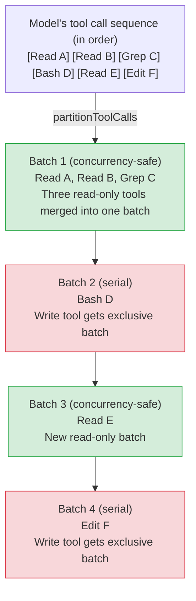

# Chapter 4: Tool 실행 Orchestration — Permission, Concurrency, Streaming, Interrupt (Tool Execution Orchestration — Permissions, Concurrency, Streaming, and Interrupts)

> **포지셔닝**: 이 Chapter는 CC가 tool 호출을 동시에 실행하는 방식 — partition 스케줄링, permission 결정 체인, streaming executor, 큰 결과의 persist — 을 분석한다. 사전 지식: Chapter 2 (Tool System), Chapter 3 (Agent Loop). 대상 독자: CC가 tool 호출을 동시에 실행하고 permission 검사 및 streaming 출력을 어떻게 처리하는지 이해하려는 독자.

> Chapter 3에서는 Agent Loop의 전체 lifecycle을 해부했다. 모델이 `tool_use` 타입의 content block을 반환하면 loop는 "tool 실행 phase"로 진입한다. 이 Chapter는 그 phase의 내부 구현을 심층적으로 다룬다. tool 호출이 어떻게 분할·스케줄링되는지, 단일 tool 실행이 어떤 lifecycle 단계를 거치는지, permission 결정 체인이 어떻게 layer별로 필터링하는지, 큰 결과가 어떻게 persist되는지, streaming executor가 concurrency와 interrupt를 어떻게 처리하는지를 다룬다.

## 4.1 Tool 실행 Orchestration이 왜 중요한가

단일 Agent Loop iteration 내에서 모델은 여러 tool 호출을 동시에 요청할 수 있다. 예를 들어 모델이 서로 다른 파일을 읽기 위해 3개의 `Read` 호출을 내고, 이어서 테스트를 실행하기 위해 `Bash` 호출을 낼 수 있다. 이 호출들을 모두 병렬로 실행할 수는 없다. 읽기 operation은 안전하지만, `git checkout`은 작업 디렉터리 상태를 바꿀 수 있어 병렬 read가 일관성 없는 결과를 얻을 수 있다.

Claude Code의 tool orchestration layer는 세 가지 핵심 문제를 해결한다.

1. **안전한 concurrency**: read-only tool은 처리량 향상을 위해 병렬 실행될 수 있고, write tool은 일관성 보장을 위해 직렬 실행되어야 한다
2. **Permission gating**: 모든 tool은 실행 전에 permission 결정 체인을 통과해야 한다. 사용자가 위험한 operation에 대한 통제권을 유지하게 한다
3. **결과 관리**: tool 출력은 거대할 수 있고 (`cat` 명령은 수십만 문자를 반환할 수 있다), context window 오버플로를 피하기 위해 지능적인 trimming이 필요하다

이 세 문제에 대한 해법은 세 개의 핵심 파일에 분산되어 있다. `toolOrchestration.ts` (batch 스케줄링), `toolExecution.ts` (단일 tool lifecycle), `StreamingToolExecutor.ts` (streaming 동시 executor).

## 4.2 partitionToolCalls: Tool 호출 분할

### 4.2.1 분할 알고리즘

Agent Loop이 `ToolUseBlock` batch를 orchestration layer에 넘길 때, 첫 단계는 이를 "concurrency-safe batch"와 "serial batch"가 교대하는 형태로 분할하는 것이다. 이는 `partitionToolCalls` 함수의 책임이다.



**Figure 4-1: partitionToolCalls 분할 로직.** 연속된 concurrency-safe tool들은 같은 batch로 병합되고(녹색), non-concurrency-safe tool은 각각 전용 batch를 갖는다(빨강).

분할 로직의 핵심은 `reduce` operation이다 (`restored-src/src/services/tools/toolOrchestration.ts:91-116`).

```typescript
function partitionToolCalls(
  toolUseMessages: ToolUseBlock[],
  toolUseContext: ToolUseContext,
): Batch[] {
  return toolUseMessages.reduce((acc: Batch[], toolUse) => {
    const tool = findToolByName(toolUseContext.options.tools, toolUse.name)
    const parsedInput = tool?.inputSchema.safeParse(toolUse.input)
    const isConcurrencySafe = parsedInput?.success
      ? (() => {
          try {
            return Boolean(tool?.isConcurrencySafe(parsedInput.data))
          } catch {
            return false  // Conservative strategy: parse failure = unsafe
          }
        })()
      : false
    if (isConcurrencySafe && acc[acc.length - 1]?.isConcurrencySafe) {
      acc[acc.length - 1]!.blocks.push(toolUse)  // Merge into previous concurrent batch
    } else {
      acc.push({ isConcurrencySafe, blocks: [toolUse] })  // Create new batch
    }
    return acc
  }, [])
}
```

핵심 설계 결정.

- **분류 전에 validate**: input은 `isConcurrencySafe` 호출 전에 Zod schema validation을 통과해야 한다. 모델이 유효하지 않은 input을 생성하면 tool은 보수적으로 concurrency-safe가 아닌 것으로 표시된다.
- **예외 = 안전하지 않음**: `isConcurrencySafe` 자체가 예외를 던지면(예: `shell-quote`가 Bash 명령을 파싱하는 데 실패) 직렬 실행으로 fallback된다. 전형적인 "fail-closed" 보안 패턴이다.
- **Greedy 병합**: 연속된 concurrency-safe tool은 non-safe tool을 만날 때까지 같은 batch로 병합된다. 상대적 호출 순서를 유지하면서 parallelism을 최대화한다.

### 4.2.2 isConcurrencySafe 판정 로직

`isConcurrencySafe`는 `Tool` interface의 필수 메서드다 (`restored-src/src/Tool.ts:402`). default 구현은 `false`를 반환한다 (`restored-src/src/Tool.ts:759`). 각 tool은 자체 의미에 기반해 자신만의 구현을 제공한다.

| Tool | Concurrency-safe? | 이유 |
|------|-------------------|--------|
| FileRead, Glob, Grep | 항상 `true` | 순수 read, side effect 없음 |
| BashTool | 명령에 따라 다름 | `isReadOnly(input)`에 위임하여 명령이 read-only인지 분석 |
| FileEdit, FileWrite | `false` | 파일 시스템 수정 |
| AgentTool | `false` | sub-Agent를 spawn하므로 상태를 수정할 수 있음 |

`BashTool`을 예로 들면 (`restored-src/src/tools/BashTool/BashTool.tsx:434-436`),

```typescript
isConcurrencySafe(input) {
  return this.isReadOnly?.(input) ?? false;
},
```

Bash tool의 concurrency safety는 전적으로 명령 내용에 의존한다. `ls`, `cat`, `git log`는 안전하지만 `rm`, `git checkout`, `npm install`은 그렇지 않다. `isReadOnly`는 명령 구조를 파싱해 이 판정을 내린다.

## 4.3 runTools: Batch 스케줄링 엔진

`runTools` (`restored-src/src/services/tools/toolOrchestration.ts:19-82`)는 orchestration layer의 entry point다. 분할된 batch를 iterate하며, concurrency-safe batch에는 `runToolsConcurrently`를, serial batch에는 `runToolsSerially`를 호출한다.

### 4.3.1 동시 실행 경로

동시 경로는 `all()` 유틸 함수 (`restored-src/src/utils/generators.ts:32`)를 사용해 여러 async generator를 하나로 병합하며, concurrency cap을 둔다.

```typescript
async function* runToolsConcurrently(...) {
  yield* all(
    toolUseMessages.map(async function* (toolUse) {
      yield* runToolUse(toolUse, ...)
      markToolUseAsComplete(toolUseContext, toolUse.id)
    }),
    getMaxToolUseConcurrency(),  // Default 10, overridable via env var
  )
}
```

concurrency cap은 환경 변수 `CLAUDE_CODE_MAX_TOOL_USE_CONCURRENCY`로 설정되며 (`restored-src/src/services/tools/toolOrchestration.ts:8-11`), 기본값은 10이다.

중요한 디테일은 **context modifier의 지연 적용**이다. 동시에 실행되는 tool들은 각자 context 수정을 생성할 수 있지만(예: 가용 tool 목록 갱신), 이 수정들을 동시 실행 중에 즉시 적용할 수는 없다. race condition이 발생한다. 따라서 modifier는 queue에 모아졌다가, 전체 동시 batch가 완료된 뒤 tool 등장 순서로 순차적으로 적용된다 (`restored-src/src/services/tools/toolOrchestration.ts:31-63`).

### 4.3.2 직렬 실행 경로

직렬 경로는 각 tool을 순서대로 직접 실행하며, 각 실행 후 즉시 context 수정을 적용한다.

```typescript
for (const toolUse of toolUseMessages) {
  for await (const update of runToolUse(toolUse, ...)) {
    if (update.contextModifier) {
      currentContext = update.contextModifier.modifyContext(currentContext)
    }
    yield { message: update.message, newContext: currentContext }
  }
}
```

이는 write tool이 이전 tool이 수정한 context 상태를 볼 수 있도록 보장한다.

## 4.4 단일 Tool 실행 Lifecycle

모든 tool 호출은 concurrent 경로든 serial 경로든 결국 `runToolUse` (`restored-src/src/services/tools/toolExecution.ts:337`)와 `checkPermissionsAndCallTool` (`restored-src/src/services/tools/toolExecution.ts:599`)로 진입한다. 이 두 함수가 단일 tool의 완전한 lifecycle을 구성한다.

```
┌─────────────────────────────────────────────────────────────────┐
│                    Single-Tool Execution Lifecycle                │
│                                                                  │
│  ① Tool Lookup ──→ ② Schema Validation ──→ ③ Input Validation   │
│       │              │                  │                         │
│   Tool not found? Validation failed? Validation failed?          │
│   ↓ Return error  ↓ Return error     ↓ Return error              │
│                                                                  │
│  ④ PreToolUse Hooks ──→ ⑤ Permission Decision ──→ ⑥ tool.call() │
│       │                      │               │                   │
│   Hook blocked?        Permission denied? Execution error?       │
│   ↓ Return error      ↓ Return error     ↓ Return error         │
│                                                                  │
│  ⑦ Result Mapping ──→ ⑧ Large Result Persistence ──→ ⑨ PostToolUse Hooks │
│                                          │                       │
│                                   Hook prevents continuation?    │
│                                   ↓ Stop subsequent loops        │
└─────────────────────────────────────────────────────────────────┘
```

**Figure 4-2: 단일 tool lifecycle 흐름.** 각 단계는 흐름을 종료시키는 에러 message를 생성할 수 있다. 성공 경로는 좌에서 우로 9개 단계를 모두 통과한다.

### 4.4.1 Phase 1: Tool Lookup과 Input Validation

`runToolUse`는 먼저 가용 tool 집합에서 대상 tool을 검색한다 (`restored-src/src/services/tools/toolExecution.ts:345-356`). 찾지 못하면 deprecated tool alias도 확인한다. 이는 오래된 session 기록의 tool 호출이 여전히 실행될 수 있도록 보장한다.

Input validation은 두 단계다.

1. **Schema validation**: Zod의 `safeParse`로 모델 출력 파라미터의 타입을 검사한다 (`restored-src/src/services/tools/toolExecution.ts:615-616`). 모델이 생성한 파라미터 타입이 항상 올바른 것은 아니다. 예를 들어 배열이어야 할 파라미터로 문자열을 출력할 수 있다.

2. **Semantic validation**: `tool.validateInput()`을 통한 tool 고유의 비즈니스 로직 검증 (`restored-src/src/services/tools/toolExecution.ts:683-684`). 예를 들어 FileEdit tool은 대상 파일의 존재 여부를 확인할 수 있다.

주목할 만한 디테일: tool이 deferred tool이고 그 schema가 API로 전송되지 않았다면, 시스템은 Zod 에러 message에 hint를 append해 모델이 먼저 `ToolSearch`로 tool schema를 load한 뒤 재시도하도록 안내한다 (`restored-src/src/services/tools/toolExecution.ts:578-597`).

### 4.4.2 Phase 2: Speculative Classifier Launch

permission 검사에 진입하기 전에, 현재 tool이 Bash tool이라면 시스템은 **allow classifier를 사전 실행(speculatively launch)**한다 (speculative classifier check, `restored-src/src/services/tools/toolExecution.ts:740-752`). 이 classifier는 PreToolUse Hook과 병렬로 실행되므로, 사용자가 permission 결정을 내려야 할 때 결과가 이미 준비되어 있을 수 있다. 이는 최적화다. 사용자가 classifier latency를 기다리는 것을 피한다.

### 4.4.3 Phase 3: PreToolUse Hooks

시스템은 등록된 모든 `PreToolUse` hook을 실행한다 (`restored-src/src/services/tools/toolExecution.ts:800-862`). Hook은 다음과 같은 효과를 낼 수 있다.

- **Input 수정**: `updatedInput`을 반환해 원본 파라미터를 교체
- **Permission 결정**: `allow`, `deny`, `ask`를 반환해 이후 permission 검사에 영향
- **실행 차단**: `preventContinuation` flag 설정
- **Context 추가**: 모델이 참조할 추가 정보 주입

hook 실행이 abort signal에 의해 중단되면, 시스템은 즉시 종료하고 취소 message를 반환한다.

### 4.4.4 Phase 4: Permission 결정 체인

permission 시스템은 tool 실행 lifecycle에서 가장 복잡한 부분이다. 결정 체인은 `resolveHookPermissionDecision` (`restored-src/src/services/tools/toolHooks.ts:332-433`)이 조율하며, 다음 우선순위를 따른다.

```
┌──────────────────────────────────────────────────────────────────┐
│                       Permission Decision Chain                    │
│                                                                    │
│  PreToolUse Hook Decision                                          │
│  ├─ allow ──→ Check rule permissions (settings.json deny/ask)      │
│  │            ├─ No matching rule ──→ Allow (skip user prompt)     │
│  │            ├─ deny rule ──→ Deny (rule overrides Hook)          │
│  │            └─ ask rule ──→ Prompt user (rule overrides Hook)    │
│  ├─ deny ──→ Deny directly                                        │
│  └─ ask ──→ Enter normal permission flow (with Hook's              │
│             forceDecision)                                          │
│                                                                    │
│  No Hook Decision ──→ Normal permission flow                       │
│  ├─ Tool's own checkPermissions                                    │
│  ├─ General rule matching (settings.json)                          │
│  ├─ YOLO/Auto classifier (see Chapter 17)                          │
│  └─ User interactive prompt (see Chapter 16)                       │
└──────────────────────────────────────────────────────────────────┘
```

**Figure 4-3: Permission 결정 체인 다이어그램.** Hook의 `allow`는 settings.json의 `deny` rule을 override할 수 없다. 이것이 defense in depth가 작동하는 방식이다.

결정 체인의 핵심 불변식: **Hook의 `allow` 결정은 settings.json의 deny/ask rule을 우회할 수 없다**. Hook이 operation을 승인하더라도, settings.json에 명시적 deny rule이 있다면 operation은 여전히 거부된다. 이는 사용자가 설정한 보안 경계가 항상 효력을 가지도록 보장한다 (`restored-src/src/services/tools/toolHooks.ts:373-405`).

permission 시스템의 완전한 아키텍처는 Chapter 16에서 다루고, YOLO classifier 구현은 Chapter 17에서 다룬다.

### 4.4.5 Phase 5: Tool 실행

permission이 통과하면 시스템은 `tool.call()`을 호출한다 (`restored-src/src/services/tools/toolExecution.ts:1207-1222`). 실행은 `startSessionActivity('tool_exec')`와 `stopSessionActivity('tool_exec')` 사이에 래핑되어 active session 상태를 추적한다.

tool 실행 중의 progress event는 `Stream` object를 통해 전달된다 (`restored-src/src/services/tools/toolExecution.ts:509`). `streamedCheckPermissionsAndCallTool`은 `checkPermissionsAndCallTool` Promise 결과와 실시간 progress event를 동일한 async iterable로 병합하여, caller가 progress update와 최종 결과를 모두 수신할 수 있게 한다.

### 4.4.6 Phase 6: PostToolUse Hook과 결과 처리

tool 실행이 성공하면 시스템은 순차적으로 다음을 수행한다.

1. **결과 매핑**: `tool.mapToolResultToToolResultBlockParam()`을 통해 tool 출력을 API 포맷으로 변환 (`restored-src/src/services/tools/toolExecution.ts:1292-1293`)
2. **큰 결과 persist**: 결과가 임계를 초과하면 디스크에 쓰고 요약으로 교체 (Section 4.6 참조)
3. **PostToolUse Hook**: post-hook을 실행. MCP tool 출력을 수정하거나 이후 loop 계속을 차단할 수 있다 (`restored-src/src/services/tools/toolExecution.ts:1483-1531`)

MCP tool의 경우, hook은 `updatedMCPToolOutput`을 반환해 tool 출력을 수정할 수 있다. 이 수정은 `addToolResult` 호출 이전에 적용되며, 수정된 버전이 message history에 저장되도록 보장한다. Non-MCP tool의 경우 결과 매핑이 hook 이전에 완료되므로, hook은 정보를 append할 수는 있지만 결과를 수정할 수는 없다.

tool 실행이 실패하면 시스템은 대신 `PostToolUseFailure` hook을 실행하여 (`restored-src/src/services/tools/toolExecution.ts:1700-1713`), hook이 에러를 검사하고 추가 context를 주입할 수 있게 한다.

## 4.5 StreamingToolExecutor: Streaming 동시 Executor

앞서 설명한 `runTools`는 batch mode로 동작한다. 분할과 실행을 시작하기 전에 모든 `tool_use` block이 도착하기를 기다린다. 그러나 streaming 응답 시나리오에서는 tool 호출 block이 API stream에서 하나씩 파싱된다. `StreamingToolExecutor` (`restored-src/src/services/tools/StreamingToolExecutor.ts`)는 다른 전략을 구현한다. **도착하는 즉시 tool 호출 실행을 시작하며, 모두가 준비될 때까지 기다리지 않는다**.

### 4.5.1 State Machine 모델

`StreamingToolExecutor`는 각 tool에 대해 4개 상태의 lifecycle을 유지한다.

```
queued ──→ executing ──→ completed ──→ yielded
```

- **queued**: tool이 등록되었지만 아직 시작되지 않음
- **executing**: tool이 현재 실행 중
- **completed**: tool이 끝났고 결과가 버퍼링됨
- **yielded**: 결과가 caller에 의해 소비됨

state transition은 `processQueue()`에 의해 구동된다 (`restored-src/src/services/tools/StreamingToolExecutor.ts:140-151`). tool이 완료되거나 새 tool이 enqueue될 때마다 queue processor가 깨어나 다음 실행 가능한 tool을 시작하려 시도한다.

### 4.5.2 Concurrency 통제

`canExecuteTool` 메서드 (`restored-src/src/services/tools/StreamingToolExecutor.ts:129-135`)는 핵심 concurrency 전략을 구현한다.

```typescript
private canExecuteTool(isConcurrencySafe: boolean): boolean {
  const executingTools = this.tools.filter(t => t.status === 'executing')
  return (
    executingTools.length === 0 ||
    (isConcurrencySafe && executingTools.every(t => t.isConcurrencySafe))
  )
}
```

규칙은 간결하다.
- 실행 중인 tool이 없다면 어떤 tool이든 시작할 수 있다
- 실행 중인 tool이 있다면, 새 tool은 자신과 현재 실행 중인 모든 tool이 concurrency-safe일 때에만 시작할 수 있다
- Non-concurrency-safe tool은 exclusive access가 필요하다

### 4.5.3 Bash 에러 Cascade Abort

`StreamingToolExecutor`는 우아한 에러 처리 메커니즘을 구현한다. Bash tool이 에러를 낼 때, 모든 형제 병렬 Bash tool이 취소된다 (`restored-src/src/services/tools/StreamingToolExecutor.ts:357-363`).

```typescript
if (tool.block.name === BASH_TOOL_NAME) {
  this.hasErrored = true
  this.erroredToolDescription = this.getToolDescription(tool)
  this.siblingAbortController.abort('sibling_error')
}
```

이 설계는 실용적 관찰에 기반한다. Bash 명령은 보통 암묵적 의존성 체인을 가진다. `mkdir`이 실패하면 이어지는 `cp` 명령도 실패할 운명이다. 각자 독립적으로 에러를 보고하게 두느니, 선제적으로 취소하는 편이 낫다. 그러나 이 전략은 **Bash tool에만 적용된다**. `Read`, `WebFetch` 같은 tool은 독립적이므로 하나의 실패가 다른 것에 영향을 주어서는 안 된다.

에러 cascade는 `siblingAbortController`를 사용하며, 이는 `toolUseContext.abortController`의 자식 controller다. sibling controller를 abort하면 실행 중인 subprocess가 취소되지만, 부모 controller는 abort하지 **않는다**. 즉, Agent Loop 자체는 단일 Bash 에러로 인해 현재 turn을 종료하지 않는다.

### 4.5.4 Interrupt 동작

각 tool은 자신의 interrupt 동작을 선언할 수 있다: `'cancel'` 또는 `'block'` (`restored-src/src/Tool.ts:416`). 사용자가 interrupt signal을 보낼 때,

- **cancel** tool: 즉시 취소 message를 수신한다. 결과는 synthesize된 REJECT_MESSAGE로 교체된다
- **block** tool: 완료까지 계속 실행된다 (interrupt에 응답하지 않음)

`StreamingToolExecutor`는 `updateInterruptibleState()`를 통해 현재 실행 중인 모든 tool이 interruptible한지 추적한다 (`restored-src/src/services/tools/StreamingToolExecutor.ts:254-259`). 이 정보는 UI layer로 전달되어 "Press ESC to cancel" 표시 여부를 결정한다.

### 4.5.5 Progress Message의 즉시 전달

일반 tool 결과는 순서대로 전달되어야 하지만(순서 의미 보존), **progress message는 즉시 전달될 수 있다** (`restored-src/src/services/tools/StreamingToolExecutor.ts:417-420`). `StreamingToolExecutor`는 progress message를 별도의 `pendingProgress` queue에 저장한다. `getCompletedResults()`는 tool 목록을 스캔할 때 progress message를 먼저 yield하며, tool 완료 순서의 제약을 받지 않는다.

완료된 결과가 없지만 tool이 실행 중일 때, `getRemainingResults()`는 `Promise.race`를 사용해 어떤 tool의 완료 **또는** 새 progress message의 도착을 기다린다 (`restored-src/src/services/tools/StreamingToolExecutor.ts:476-481`). 불필요한 polling을 피한다.

## 4.6 Tool 결과 관리: Budget과 Persist

### 4.6.1 큰 결과 Persist

`Bash` tool의 `cat` 명령은 수십만 문자를 반환할 수 있다. 이런 거대한 결과를 context window에 직접 집어넣는 것은 token budget을 낭비할 뿐 아니라 모델의 주의를 분산시킬 수 있다. `toolResultStorage.ts`는 큰 결과 persist 메커니즘을 구현한다.

persist 임계 결정은 다음 우선순위를 따른다 (`restored-src/src/utils/toolResultStorage.ts:55-78`).

1. **GrowthBook override**: 운영 팀이 Feature Flag (`tengu_satin_quoll`)로 특정 tool에 대한 커스텀 임계를 설정할 수 있다
2. **Tool 선언 값**: 각 tool의 `maxResultSizeChars` 속성
3. **Global 상한**: `DEFAULT_MAX_RESULT_SIZE_CHARS = 50,000` 문자 (`restored-src/src/constants/toolLimits.ts:13`)

최종 임계는 tool 선언 값과 global 상한 중 작은 쪽이다. 그러나 tool이 `Infinity`를 선언하면 persist는 skip된다. 예를 들어 `Read` tool은 자체적으로 출력 경계를 관리하며, 그 출력을 파일에 persist했다가 모델이 다시 `Read`하게 하는 것은 순환 참조가 된다.

결과가 임계를 초과하면 `persistToolResult` (`restored-src/src/utils/toolResultStorage.ts:137`)가 전체 내용을 session 디렉터리 하위의 `tool-results/` subdirectory에 쓰고, preview가 포함된 요약 message를 생성한다.

```
<persisted-output>
Output too large (245.0 KB). Full output saved to: /path/to/tool-results/abc123.txt

Preview (first 2.0 KB):
[First 2000 bytes of content...]
...
</persisted-output>
```

Preview 생성 (`restored-src/src/utils/toolResultStorage.ts:339-356`)은 줄 중간에서 자르는 것을 피하기 위해 newline 경계에서 truncate하려 시도한다. truncation 지점 검색 범위는 임계의 50%와 100% 사이의 마지막 newline이다.

### 4.6.2 Message별 집계 Budget

단일 tool size 제한 외에도, 시스템은 **message별 집계 budget**을 유지한다. 단일 turn 내 여러 병렬 tool이 각자 임계 근처의 결과를 반환하면, 그 합은 합리적 제한을 훨씬 초과할 수 있다(예: 각 40K를 반환하는 tool 10개 = 400K 문자).

집계 budget의 기본값은 200,000 문자다 (`restored-src/src/constants/toolLimits.ts:49`). GrowthBook Flag (`tengu_hawthorn_window`)로 override 가능하다. 초과 시 시스템은 가장 큰 tool 결과부터 persist하며, 총합이 budget 내로 떨어질 때까지 계속한다.

**prompt cache 안정성**을 유지하기 위해, 집계 budget 시스템은 `ContentReplacementState`를 유지한다 (`restored-src/src/utils/toolResultStorage.ts:390-393`). 어떤 tool 결과가 persist되었는지 기록한다. 한 번 평가에서 결과가 persist되면, 이후 모든 평가에서 동일한 persist 버전을 사용한다. 이후 turn에서 총합이 budget을 초과하지 않더라도 마찬가지다. 이는 "cache thrashing"을 피한다. 같은 message가 API 호출 간에 다른 내용을 가져 prefix cache가 무효화되는 현상이다.

### 4.6.3 빈 결과 Padding

간과하기 쉬운 디테일: 빈 `tool_result` 내용은 일부 모델(특히 Capybara)이 이를 turn 경계로 오해해 `\n\nHuman:` stop sequence를 출력하고 응답을 종료하게 할 수 있다 (`restored-src/src/utils/toolResultStorage.ts:280-295`). 시스템은 빈 결과를 감지해 placeholder 텍스트(예: `(Bash completed with no output)`)를 주입하여 이를 방지한다.

## 4.7 Stop Hook: Tool 실행 후의 interruption 지점

PreToolUse와 PostToolUse hook 모두 **이후 loop 계속의 중단(prevent continuation)**을 요청할 수 있다. 이는 `preventContinuation` flag로 구현된다.

PreToolUse hook이 이 flag를 설정하면 (`restored-src/src/services/tools/toolHooks.ts:500-508`), tool은 여전히 실행되지만(deny 결정도 함께 반환되지 않는 한), 실행 완료 후 시스템은 `hook_stopped_continuation` 타입의 attachment message를 message 목록에 append한다 (`restored-src/src/services/tools/toolExecution.ts:1572-1582`). Agent Loop은 이 message 타입을 감지하고 현재 iteration을 종료하며, 결과를 다음 reasoning 라운드를 위해 모델에게 보내지 않는다.

PostToolUse hook도 유사하게 계속을 차단할 수 있으며 (`restored-src/src/services/tools/toolHooks.ts:118-129`), 더 일반적인 사용 사례다. 예를 들어 hook이 위험한 operation의 결과를 감지한 뒤 Agent loop을 중단시키기로 결정할 수 있다.

## 4.8 패턴 추출 (Pattern Extraction)

### Pattern 1: Greedy-Merge Pipeline 분할

tool 호출 분할은 "greedy merge" 전략을 사용한다. 연속된 같은 타입의 tool은 같은 batch로 병합되고, 타입 전환 지점이 batch 경계가 된다. 이 패턴의 핵심 통찰은 다음과 같다. **순서 보장과 병렬 효율성 사이에서 단순한 중간 지점을 택하라.** 완전한 parallelism(순서 무시)은 불일치를 유발할 수 있고, 완전한 serialization(타입 무시)은 성능을 낭비한다. greedy 병합은 상대적 순서를 유지하면서 거의 최적의 parallelism을 달성한다.

### Pattern 2: Fail-Closed 안전 default

parse 실패나 예외 시 `isConcurrencySafe`는 `false`로 default되고, `Tool` interface의 default 구현도 `false`다. Permission hook의 `allow`는 deny rule을 override할 수 없다. 이들은 모두 "fail-closed" 패턴의 표현이다. **시스템이 안전성을 판단할 수 없을 때, 더 보수적인 동작을 선택하라**. AI Agent 시스템에서 이 원칙은 특히 중요하다. 모델 출력은 예측 불가능하며, "이런 일은 보통 일어나지 않는다"는 낙관적 설계는 보안 취약점이 될 수 있다.

### Pattern 3: 계층적 에러 Cascade

Bash 에러는 형제 Bash tool을 취소하지만 Read/Grep 등 독립적 tool에는 영향을 주지 않는다. Sibling abort controller는 subprocess를 취소하지만 부모 Agent Loop은 abort하지 않는다. 이 **선택적 cascading**은 두 극단을 피한다. 완전한 격리(에러 무시)와 global abort(하나의 작은 에러가 전체 session을 죽이는 것).

### Pattern 4: Cache-Stable 결과 관리

큰 결과 persist 시스템은 `ContentReplacementState`를 사용해 동일한 결과가 서로 다른 API 호출에서 항상 동일한 교체 내용을 사용하도록 보장한다. 이는 prompt cache 최적화의 열쇠다. **성능을 위해 약간의 논리적 단순성을 희생해 결정성을 유지하라**. 유사한 cache 안정성 설계는 Chapter 13–15의 caching architecture에서 반복된다.

---

## 당신이 할 수 있는 일 (What You Can Do)

Claude Code의 tool 실행 orchestration에서 추출한 실천 가능한 권고는, 다중 tool 호출을 orchestration해야 하는 어떤 AI Agent 시스템에도 적용할 수 있다.

- **Input 기반의 concurrency 분할을 구현하라.** 모든 tool 호출을 단순히 serialize하지 말라. 각 tool 호출이 실제 input에 기반해 read-only/concurrency-safe인지 판단하고, 연속된 safe 호출을 동시 batch로 병합해 처리량을 최대화하라.
- **Concurrency 안전성에 "fail-closed" default를 설정하라.** input parsing이 실패하거나 `isConcurrencySafe`가 예외를 던지면 직렬 실행으로 default하라. 불확실할 때 concurrency가 안전하다고 절대 가정하지 말라.
- **Bash 에러에 대해 선택적 cascade abort를 구현하라.** shell 명령이 실패하면 형제 shell 명령을 취소하라(암묵적 의존성을 가질 가능성이 높다). 그러나 독립적 read-only tool(`Read`, `Grep` 등)은 취소하지 말라. 전체 Agent Loop 중단을 피하기 위해 자식 `AbortController`를 사용하라.
- **큰 결과에 2단계 budget 통제를 구현하라.** 단일 tool 결과에 문자 제한을 두고, 단일 message의 모든 tool 결과에도 집계 제한을 두라. budget 초과 시 가장 큰 결과부터 디스크에 persist하고 preview를 반환하라.
- **결과 교체에서 결정성을 유지하라.** tool 결과가 한 번 persist되어 교체되면, 현재 집계 budget을 초과하지 않더라도 이후 모든 API 호출에서 동일한 교체 버전을 사용하라. 이는 prompt cache hit rate에 결정적이다.
- **빈 tool 결과에 placeholder 텍스트를 주입하라.** 빈 `tool_result`는 모델이 turn 경계로 오해할 수 있다. `(Bash completed with no output)` 같은 텍스트를 주입해 모델이 예기치 않게 응답을 종료하는 것을 방지하라.
- **Permission 검사를 defense in depth로 설계하라.** Hook의 `allow` 결정이 사용자 설정 `deny` rule을 우회해서는 안 된다. 다층 permission 검사(hook -> tool 자체 -> rule 매칭 -> 사용자 상호작용)는 보안 경계가 항상 유효하도록 보장한다.

---

이 Chapter는 tool 실행 orchestration layer가 동시 효율성, 안전 통제, context 관리를 어떻게 균형 있게 조율하는지를 드러냈다. 다음 Chapter부터 Part 2로 진입하여, 모델 동작을 harness하는 또 다른 핵심 control surface인 system prompt 아키텍처를 분석한다.

---

### Version Evolution: v2.1.92 변경사항

> 다음 분석은 v2.1.92 bundle string signal 추론에 기반하며, 완전한 소스 코드 증거는 없다. v2.1.91에서 이미 문서화된 변경사항(`staleReadFileStateHint` 파일 상태 추적 등)은 여기서 반복하지 않는다.

#### AdvisorTool — 최초의 non-execution tool

v2.1.92의 tool 목록에 완전히 새로운 이름이 등장한다: `AdvisorTool`. bundle의 event signal(`tengu_advisor_command`, `tengu_advisor_dialog_shown`, `tengu_advisor_tool_call`, `tengu_advisor_result`)과 함께, 관련 식별자 `advisor_model`, `advisor_redacted_result`, `advisor_tool_token_usage`와 함께 고려하면, 이것이 **embedded advisor Agent**임을 추론할 수 있다. 자체 독립 모델 호출 체인(`advisor_model`은 별도의 모델이나 설정을 암시)을 가지고, tool 호출을 생성하며(`advisor_tool_call`), 결과는 redaction을 거칠 수 있다(`advisor_redacted_result`).

이는 v2.1.88의 40개 이상 tool 시스템(Chapter 2 참조)에 선례가 없다. v2.1.88의 모든 tool은 **execution-type**이다. Read는 파일을 읽고, Bash는 명령을 실행하며, Edit는 파일을 수정하고, Grep는 내용을 검색한다. 그들의 공통 특성은 환경 상태를 직접 변경하거나 환경 데이터를 반환한다는 것이다. AdvisorTool은 이 패턴을 깨뜨린다. 외부 operation을 실행하지 않고, 대신 **사용자나 Agent에게 제안을 제공한다**.

이 설계 선택은 Agent 시스템의 진화 방향을 반영한다. **"오직 실행만 하는 것"에서 "먼저 제안하고, 그 다음 실행하는 것"으로**. 이는 plan mode(Chapter 20c 참조)의 철학 — 실행 전 의도 정렬 — 과 일치한다. 차이는 plan mode가 사용자 주도 워크플로우인 반면, AdvisorTool은 Agent 동작 중 자동으로 trigger될 수 있다는 점이다(`advisor_dialog_shown`은 dialog를 pop up한다고 시사한다).

`CLAUDE_CODE_DISABLE_ADVISOR_TOOL` 환경 변수의 존재는 이 기능이 disable될 수 있음을 나타낸다. 이는 Claude Code의 확립된 "progressive autonomy" 원칙(Chapter 27 참조)과 일치한다. 새 능력은 기본 활성화되지만 opt-out 가능하다.

#### Tool Result Deduplication — Context Hygiene의 새 방어선

`tengu_tool_result_dedup` event는 tool 결과 layer에서의 deduplication 메커니즘을 드러낸다. v2.1.88에서 context hygiene은 주로 두 방어선에 의존했다. 단일 tool 결과 truncation(`DEFAULT_MAX_RESULT_SIZE_CHARS = 50,000`, `restored-src/src/constants/toolLimits.ts:13` 참조)과 compaction(Chapter 11 참조). v2.1.92는 세 번째를 추가한다. **tool 결과 deduplication**.

이는 v2.1.91에서 새로 추가된 `tengu_file_read_reread`(반복된 파일 읽기 감지)와 함께 완전한 체인을 이룬다. `file_read_reread`는 입력 쪽에서 "같은 파일을 다시 읽었다"를 감지하고, `tool_result_dedup`은 출력 쪽에서 "이 결과는 이전과 같으므로 context window를 중복 점유할 필요가 없다"를 처리한다.

설계 철학: context는 Agent의 가장 소중한 자원이며, 모든 layer는 deduplication과 cleanup 메커니즘을 가져야 한다 — 입력 dedup, 출력 dedup, compaction. 이 세 방어선은 각자 서로 다른 stage를 지키며, 집합적으로 context hygiene을 유지한다.

## Version Evolution: v2.1.91 변경사항

> 다음 분석은 v2.1.91 bundle signal 비교에 기반한다.

v2.1.91의 `sdk-tools.d.ts`는 tool 결과 메타데이터에 새로운 `staleReadFileStateHint` 필드를 추가했다. tool 실행이 이전에 읽은 파일의 mtime 변경을 유발할 때, 시스템은 staleness hint를 자동 생성한다. 이는 tool 실행 orchestration layer의 새로운 출력 채널이며, 모델이 자신의 operation이 파일 시스템에 미친 side effect를 인지할 수 있게 한다.
