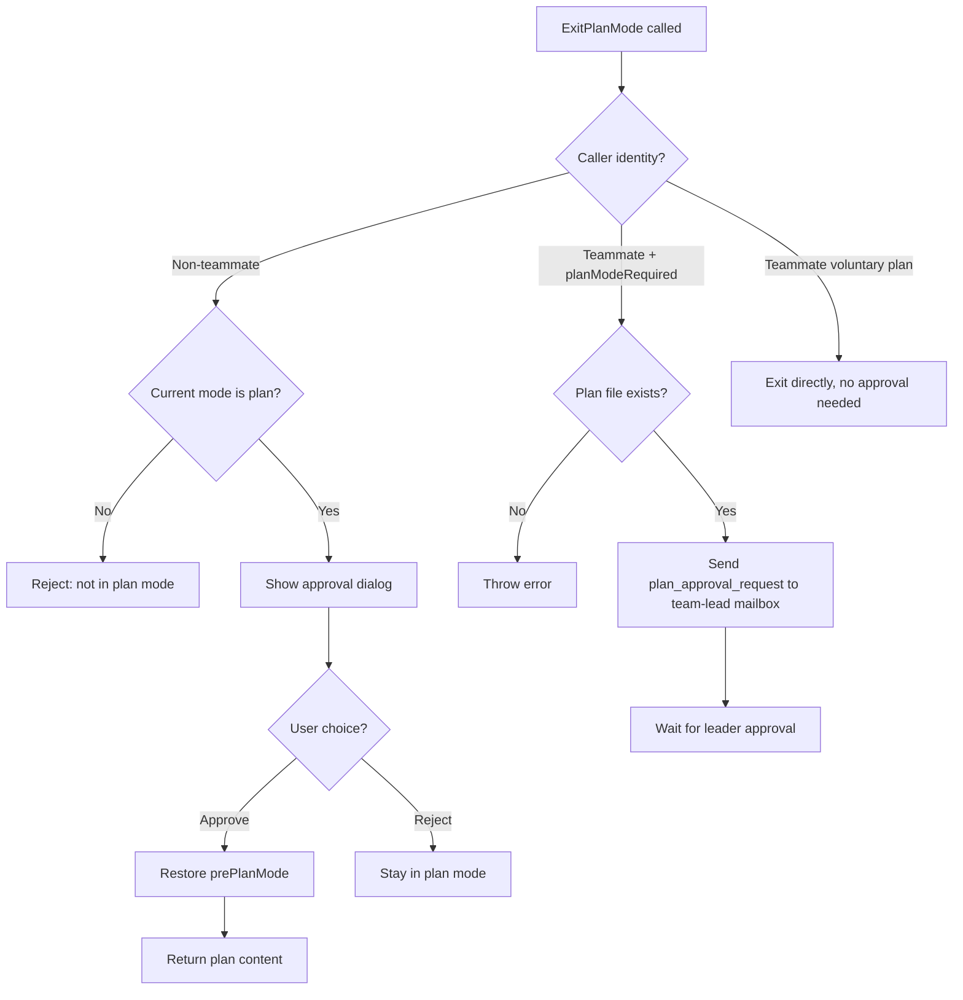
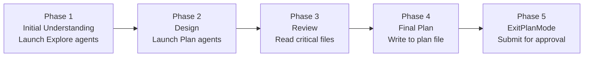

# Chapter 4b: Plan Mode — "먼저 행동하고 나중에 묻기"에서 "뛰기 전에 먼저 살피기"로 (Plan Mode — From "Act First, Ask Later" to "Look Before You Leap")

> **포지셔닝**: 이 Chapter는 Claude Code의 Plan Mode를 분석한다. 완전한 "먼저 계획하고, 그 다음 실행하는" state machine이다. 사전 지식: Chapter 3 (Agent Loop), Chapter 4 (Tool Execution Orchestration). 사용 시점: CC가 human-aligned 계획 승인 메커니즘을 어떻게 구현하는지 이해하고 싶거나, 자신의 AI Agent에 유사한 "act 이전에 plan" 워크플로를 구현하고자 할 때.

---

## 왜 중요한가

AI coding agent의 가장 큰 리스크 중 하나는 잘못된 코드를 쓰는 것이 아니라 **잘못된 것에 대해 올바른 코드를 쓰는 것**이다. 사용자가 "refactor the auth module"이라고 말할 때, 에이전트가 JWT를 선택할 수 있지만 사용자는 OAuth2를 염두에 두고 있었을 수 있다. 에이전트가 즉시 구현을 시작해 버리면, 사용자가 방향이 잘못되었음을 발견할 무렵에는 이미 수십 개 파일이 수정된 뒤다.

Plan Mode는 **intent alignment(의도 정렬)** 문제를 해결한다. 에이전트가 어떤 코드든 수정하기 전에, 먼저 codebase를 탐색하고 plan을 만든 뒤 사용자 승인을 받는다. 이는 단순한 "하기 전에 묻기"가 아니다. permission mode 전환, plan 파일 persist, 워크플로 prompt 주입, 팀 간 승인 protocol, Auto Mode와의 복잡한 상호작용을 포괄하는 완전한 state machine이다.

엔지니어링 관점에서 Plan Mode는 세 가지 핵심 설계 결정을 보여준다.

1. **동작 제약으로서의 permission mode**: plan mode에 진입한 뒤, 모델의 toolset은 read-only로 제한된다. "please don't modify files"라는 prompt가 아니라, permission 시스템이 tool 실행 이전에 write operation을 intercept하는 방식으로 이루어진다.
2. **정렬 매개체로서의 plan 파일**: plan은 대화 context에 텍스트로 머무르지 않는다. Markdown 파일로 디스크에 기록되어, 사용자가 외부 편집기에서 수정할 수 있고, CCR 원격 session이 로컬 터미널로 전송할 수도 있다.
3. **boolean flag가 아닌 state machine**: Plan Mode는 단순한 `isPlanMode` flag가 아니다. 진입, 탐색, 승인, 종료, 복원을 포괄하는 완전한 state transition chain이며, 각 transition에는 관리해야 할 side effect가 있다.

---

## 4b.1 Plan Mode State Machine: Entry와 Exit

Plan Mode의 핵심에는 두 tool — `EnterPlanMode`와 `ExitPlanMode` — 과 이들이 trigger하는 permission mode transition이 있다.

### Plan Mode 진입

Plan Mode에 진입하는 두 경로가 있다.

1. **모델이 능동적으로 `EnterPlanMode` tool을 호출** — 사용자 확인 필요
2. **사용자가 수동으로 `/plan` 명령을 입력** — 즉시 적용

두 경로 모두 궁극적으로 동일한 핵심 함수 `prepareContextForPlanMode`를 호출한다.

```typescript
// restored-src/src/utils/permissions/permissionSetup.ts:1462-1492
export function prepareContextForPlanMode(
  context: ToolPermissionContext,
): ToolPermissionContext {
  const currentMode = context.mode
  if (currentMode === 'plan') return context
  if (feature('TRANSCRIPT_CLASSIFIER')) {
    const planAutoMode = shouldPlanUseAutoMode()
    if (currentMode === 'auto') {
      if (planAutoMode) {
        return { ...context, prePlanMode: 'auto' }
      }
      // ... deactivate auto mode and restore permissions stripped by auto
    }
    if (planAutoMode && currentMode !== 'bypassPermissions') {
      autoModeStateModule?.setAutoModeActive(true)
      return {
        ...stripDangerousPermissionsForAutoMode(context),
        prePlanMode: currentMode,
      }
    }
  }
  return { ...context, prePlanMode: currentMode }
}
```

핵심 설계: **`prePlanMode` 필드가 진입 이전의 mode를 저장한다**. 이는 고전적인 "save/restore" 패턴이다. plan mode에 진입할 때, 현재 mode(`default`, `auto`, `acceptEdits` 중 하나일 수 있음)가 `prePlanMode`에 저장되고, exit 시 복원된다. 이는 Plan Mode가 **reversible operation**이며 사용자의 이전 permission 설정을 잃지 않음을 보장한다.

`EnterPlanMode` tool 정의 자체가 몇 가지 중요한 제약을 드러낸다.

```typescript
// restored-src/src/tools/EnterPlanModeTool/EnterPlanModeTool.ts:36-102
export const EnterPlanModeTool: Tool<InputSchema, Output> = buildTool({
  name: ENTER_PLAN_MODE_TOOL_NAME,
  shouldDefer: true,
  isEnabled() {
    // Disabled when --channels is active, preventing plan mode from becoming a trap
    if ((feature('KAIROS') || feature('KAIROS_CHANNELS')) &&
        getAllowedChannels().length > 0) {
      return false
    }
    return true
  },
  isConcurrencySafe() { return true },
  isReadOnly() { return true },
  async call(_input, context) {
    if (context.agentId) {
      throw new Error('EnterPlanMode tool cannot be used in agent contexts')
    }
    // ... execute mode switch
  },
})
```

주목할 만한 세 가지 제약.

| 제약 | 코드 | 이유 |
|-----------|------|--------|
| `shouldDefer: true` | Tool 정의 | Deferred loading — 초기 schema 공간을 소비하지 않음 (Chapter 2 참조) |
| Agent context 금지 | `context.agentId` 체크 | Sub-agent는 자체적으로 plan mode에 진입해서는 안 됨. 이것은 main session의 권한 |
| Channel 활성 시 disable | `getAllowedChannels()` 체크 | KAIROS mode에서 사용자는 Telegram/Discord에 있을 수 있어 승인 dialog를 볼 수 없다. exit할 방법 없이 plan mode에 진입하면 "trap"이 된다 |

### Plan Mode 종료

종료는 진입보다 훨씬 복잡하다. `ExitPlanModeV2Tool`은 세 가지 실행 경로를 갖는다.



종료의 가장 복잡한 부분은 **permission 복원**이다.

```typescript
// restored-src/src/tools/ExitPlanModeTool/ExitPlanModeV2Tool.ts:357-403
context.setAppState(prev => {
  if (prev.toolPermissionContext.mode !== 'plan') return prev
  setHasExitedPlanMode(true)
  setNeedsPlanModeExitAttachment(true)
  let restoreMode = prev.toolPermissionContext.prePlanMode ?? 'default'
  
  if (feature('TRANSCRIPT_CLASSIFIER')) {
    // Circuit breaker defense: if auto mode gate is disabled, fall back to default
    if (restoreMode === 'auto' &&
        !(permissionSetupModule?.isAutoModeGateEnabled() ?? false)) {
      restoreMode = 'default'
    }
    // ... sync auto mode activation state
  }
  
  // Non-auto mode: restore dangerous permissions that were stripped
  const restoringToAuto = restoreMode === 'auto'
  if (restoringToAuto) {
    baseContext = permissionSetupModule?.stripDangerousPermissionsForAutoMode(baseContext)
  } else if (prev.toolPermissionContext.strippedDangerousRules) {
    baseContext = permissionSetupModule?.restoreDangerousPermissions(baseContext)
  }
  
  return {
    ...prev,
    toolPermissionContext: {
      ...baseContext,
      mode: restoreMode,
      prePlanMode: undefined, // clear the saved mode
    },
  }
})
```

이 코드는 **circuit breaker defense pattern**을 보여준다. 사용자가 auto mode에서 plan에 진입했지만, plan 도중 auto mode의 circuit breaker가 trip되었다면(예: 연속된 거부가 제한을 초과), plan을 exit할 때 auto로 복원하지 않고 `default`로 fallback한다. 이는 위험한 시나리오를 방지한다. Plan Mode exit이 circuit breaker를 우회해 auto mode로 바로 복원되는 것.

### State Transition Debouncing

사용자는 plan mode를 빠르게 toggle할 수 있다(진입 → 즉시 종료 → 다시 진입). `handlePlanModeTransition`은 이 edge case를 처리한다.

```typescript
// restored-src/src/bootstrap/state.ts:1349-1363
export function handlePlanModeTransition(fromMode: string, toMode: string): void {
  // When switching TO plan, clear any pending exit attachment — prevents sending both enter and exit notifications
  if (toMode === 'plan' && fromMode !== 'plan') {
    STATE.needsPlanModeExitAttachment = false
  }
  // When leaving plan, mark that an exit attachment needs to be sent
  if (fromMode === 'plan' && toMode !== 'plan') {
    STATE.needsPlanModeExitAttachment = true
  }
}
```

이는 고전적인 **one-shot notification** 설계다. attachment flag는 소비 즉시 clear되어 중복 전송을 방지한다.

---

## 4b.2 Plan 파일: 지속적인 Intent Alignment

Plan Mode의 핵심 설계 결정 하나: **plan은 대화 context에 머무르지 않는다. 디스크 파일에 기록된다**. 이는 세 가지 이점을 가져온다.

1. 사용자는 외부 편집기에서 plan을 수정할 수 있다 (`/plan open`)
2. Plan은 context compaction에서도 손실 없이 생존한다 (Chapter 10 참조)
3. CCR 원격 session의 plan은 로컬 터미널로 전송될 수 있다

### 파일 이름과 저장

```typescript
// restored-src/src/utils/plans.ts:79-128
export const getPlansDirectory = memoize(function getPlansDirectory(): string {
  const settings = getInitialSettings()
  const settingsDir = settings.plansDirectory
  let plansPath: string

  if (settingsDir) {
    const cwd = getCwd()
    const resolved = resolve(cwd, settingsDir)
    // Path traversal defense
    if (!resolved.startsWith(cwd + sep) && resolved !== cwd) {
      logError(new Error(`plansDirectory must be within project root: ${settingsDir}`))
      plansPath = join(getClaudeConfigHomeDir(), 'plans')
    } else {
      plansPath = resolved
    }
  } else {
    plansPath = join(getClaudeConfigHomeDir(), 'plans')
  }
  // ...
})

export function getPlanFilePath(agentId?: AgentId): string {
  const planSlug = getPlanSlug(getSessionId())
  if (!agentId) {
    return join(getPlansDirectory(), `${planSlug}.md`)  // main session
  }
  return join(getPlansDirectory(), `${planSlug}-agent-${agentId}.md`)  // sub-agent
}
```

| 차원 | 설계 결정 | 이유 |
|-----------|----------------|--------|
| 기본 위치 | `~/.claude/plans/` | Project 독립적 global 디렉터리 — 코드 repository를 오염시키지 않음 |
| 설정 가능 | `settings.plansDirectory` | 팀이 이를 `.claude/plans/` 같은 project-local 디렉터리로 설정 가능 |
| Path traversal 방어 | `resolved.startsWith(cwd + sep)` | 설정된 경로가 project root를 escape하는 것을 방지 |
| 파일 이름 | `{wordSlug}.md` | UUID 대신 word slug(예: `brave-fox.md`) 사용 — human-readable |
| Sub-agent 격리 | `{wordSlug}-agent-{agentId}.md` | 각 sub-agent는 독립된 plan 파일을 가져 덮어쓰기를 방지 |
| Memoization | `memoize(getPlansDirectory)` | 모든 tool 렌더링마다 `mkdirSync` syscall이 trigger되는 것을 방지 (#20005 regression fix) |

### Plan Slug 생성

각 session은 고유한 word slug를 생성하며, `planSlugCache`에 캐시된다.

```typescript
// restored-src/src/utils/plans.ts:32-49
export function getPlanSlug(sessionId?: SessionId): string {
  const id = sessionId ?? getSessionId()
  const cache = getPlanSlugCache()
  let slug = cache.get(id)
  if (!slug) {
    const plansDir = getPlansDirectory()
    for (let i = 0; i < MAX_SLUG_RETRIES; i++) {
      slug = generateWordSlug()
      const filePath = join(plansDir, `${slug}.md`)
      if (!getFsImplementation().existsSync(filePath)) {
        break  // found a non-conflicting slug
      }
    }
    cache.set(id, slug!)
  }
  return slug!
}
```

충돌 감지는 최대 10회 재시도한다 (`MAX_SLUG_RETRIES = 10`). `generateWordSlug()`는 `adjective-noun` 조합을 사용하므로(각 단어 유형당 어휘 크기는 보통 수천 개, 수백만 개의 가능한 조합), 자주 사용되는 디렉터리에서도 충돌 확률이 매우 낮다.

### `/plan` 명령

사용자는 `/plan` 명령을 통해 plan과 상호작용한다.

```typescript
// restored-src/src/commands/plan/plan.tsx:64-121
export async function call(onDone, context, args) {
  const currentMode = appState.toolPermissionContext.mode
  
  // If not in plan mode, enable it
  if (currentMode !== 'plan') {
    handlePlanModeTransition(currentMode, 'plan')
    setAppState(prev => ({
      ...prev,
      toolPermissionContext: applyPermissionUpdate(
        prepareContextForPlanMode(prev.toolPermissionContext),
        { type: 'setMode', mode: 'plan', destination: 'session' },
      ),
    }))
    const description = args.trim()
    if (description && description !== 'open') {
      onDone('Enabled plan mode', { shouldQuery: true })  // with description → trigger query
    } else {
      onDone('Enabled plan mode')
    }
    return null
  }
  
  // Already in plan mode — show current plan or open in editor
  if (argList[0] === 'open') {
    const result = await editFileInEditor(planPath)
    // ...
  }
}
```

`/plan` 명령은 네 가지 동작을 한다.
- `/plan` — Plan mode 활성화 (아직 plan mode가 아닌 경우)
- `/plan <description>` — Description과 함께 plan mode 활성화 (`shouldQuery: true`는 모델이 plan을 시작하도록 trigger)
- `/plan` (이미 plan mode인 경우) — 현재 plan 내용과 파일 경로 표시. plan이 없으면 "No plan written yet" 표시
- `/plan open` — 외부 편집기에서 plan 파일 열기

---

## 4b.3 Plan Prompt 주입: 5-Phase 워크플로

Plan Mode에 진입한 뒤, 시스템은 **attachment message**를 통해 모델에 워크플로 지시를 주입한다. 이것이 Plan Mode의 핵심 동작 제약이다. tool 제한으로 모델에게 "무엇을 할 수 없는지"를 알리는 대신, prompt로 "무엇을 해야 하는지"를 알린다.

### Attachment 유형

Plan Mode는 세 가지 attachment 유형을 사용한다.

| Attachment 유형 | Trigger | 내용 |
|----------------|---------|---------|
| `plan_mode` | 매 N human message turn마다 주입 | Full 또는 sparse 워크플로 지시 |
| `plan_mode_reentry` | Exit 후 plan mode에 재진입 | "You previously exited plan mode — check the existing plan first" |
| `plan_mode_exit` | Plan mode exit 후 첫 turn | "You've exited plan mode — you can now start implementing" |

### Full vs. Sparse Throttling

```typescript
// restored-src/src/utils/attachments.ts:1195-1241
function getPlanModeAttachments(messages, toolUseContext) {
  // Check how many human turns since the last plan_mode attachment
  const { turnCount, foundPlanModeAttachment } = 
    getPlanModeAttachmentTurnCount(messages)
  
  // Already have an attachment and interval too short → skip
  if (foundPlanModeAttachment &&
      turnCount < PLAN_MODE_ATTACHMENT_CONFIG.TURNS_BETWEEN_ATTACHMENTS) {
    return []
  }
  
  // Decide full or sparse
  const attachmentCount = countPlanModeAttachmentsSinceLastExit(messages)
  const reminderType = attachmentCount %
    PLAN_MODE_ATTACHMENT_CONFIG.FULL_REMINDER_EVERY_N_ATTACHMENTS === 1
    ? 'full' : 'sparse'
  
  attachments.push({ type: 'plan_mode', reminderType, isSubAgent, planFilePath, planExists })
  return attachments
}
```

**Full attachment**는 완전한 5-phase 워크플로 지시(~2,000자 이상)를 포함한다. **Sparse attachment**는 한 줄 리마인더다.

```
Plan mode still active (see full instructions earlier in conversation). 
Read-only except plan file ({planFilePath}). Follow 5-phase workflow.
```

이는 **token 비용 최적화**다. Full 지시는 1번째, 6번째, 11번째... 발생 시에만 주입되고, 나머지 turn은 모두 sparse를 사용한다. plan mode가 exit될 때마다 카운터가 리셋된다.

### 5-Phase 워크플로 (Standard Mode)

`isPlanModeInterviewPhaseEnabled()`이 `false`를 반환할 때, 모델은 5-phase 지시를 받는다.



```typescript
// restored-src/src/utils/messages.ts:3227-3292 (core instructions, simplified)
const content = `Plan mode is active. The user indicated that they do not want 
you to execute yet -- you MUST NOT make any edits (with the exception of the 
plan file mentioned below)...

## Plan Workflow

### Phase 1: Initial Understanding
Goal: Gain a comprehensive understanding of the user's request...
Launch up to ${exploreAgentCount} Explore agents IN PARALLEL...

### Phase 2: Design
Launch Plan agent(s) to design the implementation...
You can launch up to ${agentCount} agent(s) in parallel.

### Phase 3: Review
Read the critical files identified by agents...
Use AskUserQuestion to clarify any remaining questions.

### Phase 4: Final Plan
Write your final plan to the plan file (the only file you can edit).

### Phase 5: Call ExitPlanMode
Once you are happy with your final plan file - call ExitPlanMode.
This is critical - your turn should only end with either AskUserQuestion OR ExitPlanMode.`
```

Agent 수는 구독 tier에 따라 동적으로 조정된다.

```typescript
// restored-src/src/utils/planModeV2.ts:5-29
export function getPlanModeV2AgentCount(): number {
  // Environment variable override
  if (process.env.CLAUDE_CODE_PLAN_V2_AGENT_COUNT) { /* ... */ }
  // Max 20x subscription → 3 agents
  if (subscriptionType === 'max' && rateLimitTier === 'default_claude_max_20x') return 3
  // Enterprise/Team → 3 agents
  if (subscriptionType === 'enterprise' || subscriptionType === 'team') return 3
  // Others → 1 agent
  return 1
}
```

| 구독 Tier | Plan Agent 수 | Explore Agent 수 |
|------------------|-------------|----------------|
| Max (20x) | 3 | 3 |
| Enterprise / Team | 3 | 3 |
| Others | 1 | 3 |

### Interview 워크플로 (Iterative Mode)

`isPlanModeInterviewPhaseEnabled()`이 `true`를 반환할 때(Anthropic 내부 사용자에게는 항상 true), 다른 워크플로가 사용된다.

```typescript
// restored-src/src/utils/messages.ts:3323-3378
const content = `Plan mode is active...

## Iterative Planning Workflow

You are pair-planning with the user. Explore the code to build context, 
ask the user questions when you hit decisions you can't make alone, and 
write your findings into the plan file as you go.

### The Loop
Repeat this cycle until the plan is complete:
1. **Explore** — Use Read, Glob, Grep to read code...
2. **Update the plan file** — After each discovery, immediately capture what you learned.
3. **Ask the user** — When you hit an ambiguity, use AskUserQuestion. Then go back to step 1.

### First Turn
Start by quickly scanning a few key files... Then write a skeleton plan and 
ask the user your first round of questions. Don't explore exhaustively before engaging the user.

### Asking Good Questions
- Never ask what you could find out by reading the code
- Batch related questions together
- Focus on things only the user can answer: requirements, preferences, tradeoffs`
```

Interview mode와 표준 5-phase mode의 핵심 차이.

| 차원 | 5-Phase Mode | Interview Mode |
|-----------|-------------|----------------|
| 상호작용 스타일 | 충분히 탐색 후 plan 제출 | iterate하며 탐색 및 질문 |
| Agent 사용 | Explore/Plan agent 강제 사용 | 직접 tool 사용 장려, agent는 선택적 |
| Plan 파일 | Phase 4에서 한 번 작성 | 각 발견마다 증분 업데이트 |
| 사용자 참여 | Phase 5에서 최종 승인 | 지속적 참여, multi-turn 대화 |
| 타겟 사용자 | 외부 사용자 (더 자동화) | 내부 사용자 (더 협업적) |

### Pewter Ledger 실험: Plan 파일 길이 최적화

Plan Mode의 흥미로운 A/B 실험은 `tengu_pewter_ledger`다. plan 파일의 구조와 길이를 최적화한다.

```typescript
// restored-src/src/utils/planModeV2.ts:66-95
// Baseline (control, 14d ending 2026-03-02, N=26.3M):
//   p50 4,906 chars | p90 11,617 | mean 6,207 | 82% Opus 4.6
//   Reject rate monotonic with size: 20% at <2K → 50% at 20K+
//
// Primary: session-level Avg Cost
export function getPewterLedgerVariant(): PewterLedgerVariant {
  const raw = getFeatureValue_CACHED_MAY_BE_STALE('tengu_pewter_ledger', null)
  if (raw === 'trim' || raw === 'cut' || raw === 'cap') return raw
  return null
}
```

네 가지 실험 arm은 Phase 4 지시를 점진적으로 조인다.

| Arm | 핵심 지시 | 목표 효과 |
|-----|----------------|---------------|
| **control** | "Begin with Context section... concise enough to scan quickly" | Baseline: 평균 6,207자 |
| **trim** | "One-line Context... single verification command" | 가벼운 압축 |
| **cut** | "Do NOT write Context/Background... Most good plans under 40 lines" | 중간 압축 |
| **cap** | "Hard limit: 40 lines. If longer, delete prose — not file paths" | Hard cap |

주석에 기록된 baseline 데이터는 핵심 발견을 드러낸다. **reject rate는 plan 길이와 단조 상관 관계에 있다**. 2K 미만 plan은 20% reject rate를, 20K+ plan은 50% reject rate를 보인다. 긴 plan이 더 나은 plan을 의미하지 않는다.

### 내부 사용자와 외부 사용자의 서로 다른 Trigger 임계

EnterPlanMode tool prompt는 두 버전을 갖는다.

```typescript
// restored-src/src/tools/EnterPlanModeTool/prompt.ts:166-170
export function getEnterPlanModeToolPrompt(): string {
  return process.env.USER_TYPE === 'ant'
    ? getEnterPlanModeToolPromptAnt()
    : getEnterPlanModeToolPromptExternal()
}
```

| 차원 | 외부 버전 | 내부 버전 |
|-----------|-----------------|-----------------|
| Trigger 임계 | **낮음** — "Prefer using EnterPlanMode for implementation tasks unless simple" | **높음** — "Plan mode is valuable when approach is genuinely unclear" |
| 예시 차이 | "Add a delete button" → plan **해야** 함 (확인 dialog, API, 상태 개입) | "Add a delete button" → plan **하지 말아야** 함 ("Implementation path is clear") |
| 기본 선호 | "If unsure, err on the side of planning" | "Prefer starting work and using AskUserQuestion" |

이 내부/외부 차이는 제품 전략을 반영한다. 외부 사용자는 더 많은 alignment 보호가 필요하고(에이전트가 방향을 틀었을 때 비용이 큰 rework 회피), 내부 사용자는 tool 동작에 더 익숙해 빠른 실행을 선호한다.

---

## 4b.4 승인 흐름: Human-AI 협업의 결정적 지점

### 사용자 승인 (표준 흐름)

모델이 `ExitPlanMode`를 호출하면, non-teammate 시나리오에서 사용자 승인 dialog가 trigger된다.

```typescript
// restored-src/src/tools/ExitPlanModeTool/ExitPlanModeV2Tool.ts:221-238
async checkPermissions(input, context) {
  if (isTeammate()) {
    return { behavior: 'allow' as const, updatedInput: input }
  }
  return {
    behavior: 'ask' as const,
    message: 'Exit plan mode?',
    updatedInput: input,
  }
}
```

승인 후, `mapToolResultToToolResultBlockParam`이 승인된 plan을 tool_result에 주입한다.

```typescript
// restored-src/src/tools/ExitPlanModeTool/ExitPlanModeV2Tool.ts:481-492
return {
  type: 'tool_result',
  content: `User has approved your plan. You can now start coding. Start with updating your todo list if applicable

Your plan has been saved to: ${filePath}
You can refer back to it if needed during implementation.${teamHint}

## ${planLabel}:
${plan}`,
  tool_use_id: toolUseID,
}
```

사용자가 CCR Web UI에서 plan을 수정했다면, `planWasEdited` flag가 모델에게 내용이 수정되었음을 알린다.

```typescript
// restored-src/src/tools/ExitPlanModeTool/ExitPlanModeV2Tool.ts:477-478
const planLabel = planWasEdited
  ? 'Approved Plan (edited by user)'
  : 'Approved Plan'
```

### Team Leader 승인

Teams mode에서는 teammate agent의 plan이 team lead 승인을 필요로 한다 (Chapter 20b 참조). `ExitPlanModeV2Tool`은 mailbox 시스템을 통해 승인 요청을 보낸다.

```typescript
// restored-src/src/tools/ExitPlanModeTool/ExitPlanModeV2Tool.ts:264-312
if (isTeammate() && isPlanModeRequired()) {
  const approvalRequest = {
    type: 'plan_approval_request',
    from: agentName,
    timestamp: new Date().toISOString(),
    planFilePath: filePath,
    planContent: plan,
    requestId,
  }
  
  await writeToMailbox('team-lead', {
    from: agentName,
    text: jsonStringify(approvalRequest),
    timestamp: new Date().toISOString(),
  }, teamName)
  
  return {
    data: {
      plan, isAgent: true, filePath,
      awaitingLeaderApproval: true,
      requestId,
    },
  }
}
```

승인 요청은 team lead의 mailbox 파일(`~/.claude/teams/{team}/inboxes/team-lead.json`)에 기록되는 JSON message다. Message는 concurrency safety를 위해 `proper-lockfile`을 사용한다.

### Plan 실행 검증

ExitPlanMode 반환값에는 `hasTaskTool` flag가 포함된다.

```typescript
// restored-src/src/tools/ExitPlanModeTool/ExitPlanModeV2Tool.ts:405-408
const hasTaskTool =
  isAgentSwarmsEnabled() &&
  context.options.tools.some(t => toolMatchesName(t, AGENT_TOOL_NAME))
```

Agent Swarm이 가용할 때, tool_result에 힌트가 append된다.

> If this plan can be broken down into multiple independent tasks, consider using the TeamCreate tool to create a team and parallelize the work.

이는 Plan Mode 출력을 multi-agent 실행에 **원활하게 연결**한다 (Chapter 20b 참조).

---

## 4b.5 Auto Mode와 Plan Mode의 상호작용

Auto Mode (YOLO classifier, Chapter 17 참조)와 Plan Mode의 상호작용은 CC의 permission 시스템에서 가장 복잡한 부분 중 하나다.

### 진입 시 Permission 저장

사용자가 auto mode에서 plan mode로 진입할 때, 두 가지 전략이 있다.

```typescript
// restored-src/src/utils/permissions/permissionSetup.ts:1469-1486
if (currentMode === 'auto') {
  if (planAutoMode) {
    // Keep auto active → classifier continues working during plan
    return { ...context, prePlanMode: 'auto' }
  }
  // Deactivate auto → strip dangerous permissions
  // ...
}
```

`shouldPlanUseAutoMode()`는 사용자 설정에 기반해 plan mode 중에도 classifier를 active하게 유지할지 결정한다. Active하게 유지되면 plan mode에서 모델의 read-only operation은 여전히 classifier에 의해 auto-approve된다. Deactivate되면 모든 operation이 사용자 확인을 필요로 한다.

### 종료 시 Circuit Breaker 체크

```typescript
// restored-src/src/tools/ExitPlanModeTool/ExitPlanModeV2Tool.ts:328-346
if (feature('TRANSCRIPT_CLASSIFIER')) {
  const prePlanRaw = appState.toolPermissionContext.prePlanMode ?? 'default'
  if (prePlanRaw === 'auto' &&
      !(permissionSetupModule?.isAutoModeGateEnabled() ?? false)) {
    const reason = permissionSetupModule?.getAutoModeUnavailableReason() ?? 'circuit-breaker'
    gateFallbackNotification = 
      permissionSetupModule?.getAutoModeUnavailableNotification(reason) ??
      'auto mode unavailable'
  }
}
```

이 로직은 다음을 보장한다. **plan mode 중 auto mode의 circuit breaker가 trip되었다면(예: classifier의 연속 거부가 제한 초과), plan exit 시 auto로 복원하지 않고 default로 degrade한다**. 사용자는 알림을 본다.

> plan exit → default · auto mode unavailable

### Session 중 설정 변경

사용자가 plan mode 중 `useAutoModeDuringPlan` 설정을 수정하면, `transitionPlanAutoMode`가 즉시 적용된다.

```typescript
// restored-src/src/utils/permissions/permissionSetup.ts:1502-1517
export function transitionPlanAutoMode(
  context: ToolPermissionContext,
): ToolPermissionContext {
  if (context.mode !== 'plan') return context
  // Plan entered from bypassPermissions doesn't allow auto activation
  if (context.prePlanMode === 'bypassPermissions') return context
  
  const want = shouldPlanUseAutoMode()
  const have = autoModeStateModule?.isAutoModeActive() ?? false
  // Activate or deactivate auto based on want/have
}
```

---

## 4b.6 Plan Agent: Read-Only Architect

Plan Mode의 5-phase 워크플로는 Phase 2에서 built-in Plan agent를 사용한다 (agent 시스템은 Chapter 20 참조). 이 agent의 정의는 tool 제한을 통해 read-only 동작이 어떻게 강제되는지 보여준다.

```typescript
// restored-src/src/tools/AgentTool/built-in/planAgent.ts:73-92
export const PLAN_AGENT: BuiltInAgentDefinition = {
  agentType: 'Plan',
  disallowedTools: [
    AGENT_TOOL_NAME,      // cannot spawn sub-agents
    EXIT_PLAN_MODE_TOOL_NAME,  // cannot exit plan mode
    FILE_EDIT_TOOL_NAME,  // cannot edit files
    FILE_WRITE_TOOL_NAME, // cannot write files
    NOTEBOOK_EDIT_TOOL_NAME,
  ],
  tools: EXPLORE_AGENT.tools,
  omitClaudeMd: true,     // don't inject CLAUDE.md, saves tokens
  getSystemPrompt: () => getPlanV2SystemPrompt(),
}
```

Plan agent의 system prompt는 read-only 제약을 더욱 강화한다.

```
=== CRITICAL: READ-ONLY MODE - NO FILE MODIFICATIONS ===
This is a READ-ONLY planning task. You are STRICTLY PROHIBITED from:
- Creating new files (no Write, touch, or file creation of any kind)
- Modifying existing files (no Edit operations)
- Using redirect operators (>, >>, |) or heredocs to write to files
- Running ANY commands that change system state
```

이 이중 제약(tool blocklist + prompt 금지)은 모델이 tool 제한을 "잊더라도" prompt가 write operation 시도를 막도록 보장한다.

---

## 패턴 추출 (Pattern Extraction)

Plan Mode 구현에서, 다음과 같은 재사용 가능한 AI Agent 설계 패턴을 추출할 수 있다.

### Pattern 1: Permission Mode의 Save/Restore

**문제**: 제약 mode에 임시 진입한 뒤, 이전 상태를 정확히 복원해야 한다.

**해법**: permission context에 `prePlanMode` 필드를 추가한다. 진입 시 저장, exit 시 복원.

```
Entry: context.prePlanMode = context.mode; context.mode = 'plan'
Exit:  context.mode = context.prePlanMode; context.prePlanMode = undefined
```

**전제 조건**: Exit 시, 외부 조건(circuit breaker 같은)이 원본 mode로의 복원을 여전히 허용하는지 확인해야 한다. 그렇지 않다면 안전한 default로 degrade한다.

### Pattern 2: 정렬 매개체로서의 Plan 파일

**문제**: 대화 context 안의 plan은 compaction 중 손실되며, 사용자는 에이전트 밖에서 보거나 수정할 수 없다.

**해법**: plan을 human-readable한 이름(word slug)을 가진 디스크 파일에 기록해, 외부 편집과 cross-session 복구를 지원한다.

**전제 조건**: path traversal 방어, 충돌 감지, 원격 session을 위한 snapshot persist가 필요하다.

### Pattern 3: Full/Sparse Throttling

**문제**: 매 turn마다 완전한 워크플로 지시를 주입하면 token을 낭비하지만, 모델에게 전혀 리마인더하지 않으면 워크플로 drift가 발생한다.

**해법**: 첫 발생 시 full 지시를 주입하고, 이후는 sparse 리마인더를 사용하며, N번마다 full을 다시 주입한다. 상태 전환 시 카운터를 리셋한다.

**전제 조건**: human turn으로 카운트해야 한다(tool 호출 turn이 아님). 그렇지 않으면 10개의 tool 호출이 반복된 리마인더를 trigger한다.

### Pattern 4: 내부/외부 동작 Calibration

**문제**: 서로 다른 사용자 집단은 에이전트 자율성에 대해 서로 다른 기대를 갖는다. 외부 사용자는 더 많은 alignment 보호가 필요하고, 내부 사용자는 더 많은 실행 효율이 필요하다.

**해법**: `USER_TYPE`을 통해 prompt variant를 구분한다. 외부 버전은 trigger 임계를 낮추고("확신 없으면 plan"), 내부 버전은 임계를 높인다("작업을 시작하고 구체적 질문을 하라").

**전제 조건**: 서로 다른 임계가 사용자 만족과 rework rate에 어떻게 영향을 주는지 검증할 A/B testing 인프라가 필요하다.

### Pattern 5: State Transition Debouncing

**문제**: 빠른 mode toggle(plan → normal → plan)은 중복되거나 모순된 알림을 유발할 수 있다.

**해법**: 단일 소비 flag(`needsPlanModeExitAttachment`)를 사용한다. 진입 시 대기 중인 exit 알림을 clear하고, exit 시 새 알림을 set한다.

**전제 조건**: Flag는 소비(attachment 전송) 직후 clear되어야 하며, 진입/exit operation은 flag에 대해 상호 배타적으로 동작해야 한다.

---

## 사용자가 할 수 있는 일 (What Users Can Do)

### 기본 사용법

| 행동 | 방법 |
|--------|-----|
| Plan Mode 진입 | `/plan` 또는 `/plan <description>`, 또는 모델이 자체적으로 `EnterPlanMode` 호출 |
| 현재 plan 보기 | `/plan`을 다시 입력 |
| 편집기에서 plan 수정 | `/plan open` |
| Plan Mode 종료 | 모델이 `ExitPlanMode` 호출 → 사용자가 승인 dialog에서 확인 |

### 설정 옵션

| 설정 | 효과 |
|---------|--------|
| `settings.plansDirectory` | 커스텀 plan 파일 저장 디렉터리 (project root 기준 상대 경로) |
| `CLAUDE_CODE_PLAN_V2_AGENT_COUNT` | Plan agent 수 override (1-10) |
| `CLAUDE_CODE_PLAN_V2_EXPLORE_AGENT_COUNT` | Explore agent 수 override (1-10) |
| `CLAUDE_CODE_PLAN_MODE_INTERVIEW_PHASE` | Interview 워크플로 활성화 (`true`/`false`) |

### 사용 권장 사항

1. **큰 refactor에는 Plan Mode를 선호하라**: 3개 이상 파일에 영향을 주는 변경은 `/plan refactor the auth system`으로 시작해, 모델이 접근을 만들게 한 뒤 실행 전에 확인하라.
2. **재계획하지 말고 plan을 수정하라**: plan이 대체로 옳지만 조정이 필요하다면, `/plan open`으로 편집기에서 직접 수정하라. 모델에게 재계획시키는 것보다 효율적이다.
3. **Agent 실행 시 `mode: 'plan'` 지정하기**: Agent tool의 `mode` 파라미터를 통해 sub-agent가 plan mode에서 동작하게 할 수 있다. 큰 task가 실행 전 승인을 거치도록 보장한다.

---

## Version Evolution Note

> 이 Chapter의 핵심 분석은 Claude Code v2.1.88을 기반으로 한다. Plan Mode는 활발히 진화 중인 서브시스템이다. interview 워크플로(`tengu_plan_mode_interview_phase`)와 plan 길이 실험(`tengu_pewter_ledger`)은 분석 시점에 여전히 A/B testing 중이었다. Plan Mode의 원격 확장인 Ultraplan(remote plan mode)은 Chapter 20c에서 다룬다.
