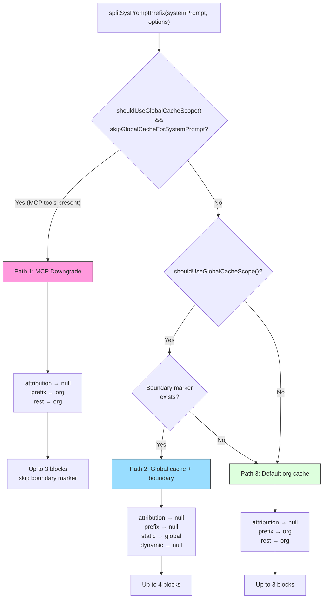
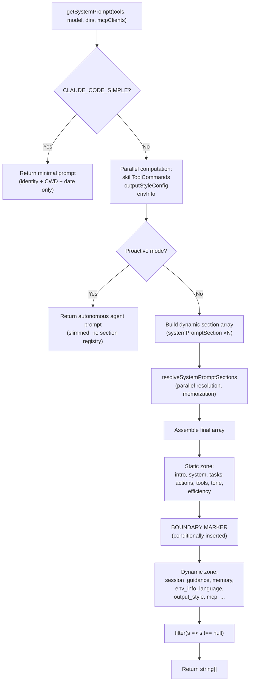

# Chapter 5: System Prompt Architecture

> **Positioning**: 이 Chapter는 CC가 System Prompt를 동적으로 조립하는 방법 — section 등록과 memoization, 캐시 경계 마커, 다중 소스 우선순위 합성 — 을 분석한다. 사전 지식: Chapter 3 (Agent Loop). 대상 독자: CC가 System Prompt를 동적으로 조립하는 방법을 이해하고 싶은 독자, 또는 자신의 Agent를 위한 prompt architecture를 설계하려는 개발자.

> Chapter 4는 Tool 실행의 전체 오케스트레이션 과정을 해부했다. 모델이 어떤 Tool 호출을 하기 전에, 먼저 "자신이 누구인지 알아야" 한다 — 그것이 바로 System Prompt의 역할이다. 이 Chapter는 System Prompt의 조립 아키텍처를 깊이 있게 다룬다: section이 어떻게 등록되고 memoize되는지, 정적/동적 콘텐츠가 경계 마커로 어떻게 분리되는지, 캐시 최적화 계약이 API 레이어에서 어떻게 지켜지는지, 다중 소스 prompt가 우선순위에 따라 어떻게 최종적으로 모델에 전달되는 instruction 집합으로 합성되는지를 다룬다.

## 5.1 System Prompt에 "아키텍처"가 필요한 이유 (Why the System Prompt Needs "Architecture")

순진한 구현이라면 System Prompt를 단일 문자열 상수로 하드코딩할 수 있다. 그러나 Claude Code의 System Prompt는 세 가지 엔지니어링 과제를 직면한다.

1. **볼륨과 비용 (Volume and Cost)**: 완전한 System Prompt는 identity 소개, 행동 지침, Tool 사용 지침, 환경 정보, 메모리 파일, MCP 지침 등 10개 이상의 섹션을 포함하며, 총 수만 개의 token에 달한다. API 호출마다 이 모든 것을 재전송하는 것은 prompt caching 비용을 막대하게 증가시킨다.
2. **변동 빈도의 차이 (Varying Change Frequencies)**: Identity 소개와 코딩 지침은 모든 사용자, 모든 세션에서 동일하지만, 환경 정보(working directory, OS 버전)는 세션마다 다르며, MCP 서버 지침은 대화 중간에도 바뀔 수 있다.
3. **다중 소스 Override (Multi-Source Overrides)**: 사용자는 `--system-prompt`로 prompt를 커스터마이즈할 수 있고, Agent 모드는 자체 전용 prompt를 갖고, coordinator 모드는 독립된 prompt를 가지며, Loop 모드는 모든 것을 완전히 override할 수 있다 — 이 소스들 간의 우선순위는 모호해서는 안 된다.

Claude Code의 해결책은 **섹션화된 합성 아키텍처(sectioned composition architecture)**다: System Prompt를 독립적이고 memoize 가능한 section들로 분할하고, registry를 통해 라이프사이클을 관리하며, 경계 마커로 캐시 계층을 구분하고, 최종적으로 API 레이어에서 `cache_control`이 포함된 request 블록으로 변환한다.

> **Interactive Version**: [Click to view the prompt assembly animation](prompt-assembly-viz.html) — 7개의 section이 층층이 쌓이면서 캐시 비율이 실시간으로 계산되는 모습을 지켜보라.

## 5.2 Section Registry: systemPromptSection의 Memoization과 Cache Awareness

### 5.2.1 핵심 추상화 (Core Abstraction)

System Prompt의 최소 단위는 **section**이다. 각 section은 이름, compute 함수, 캐시 전략으로 구성된다. 이 추상화는 `systemPromptSections.ts`에 정의되어 있다.

```typescript
type SystemPromptSection = {
  name: string
  compute: ComputeFn        // () => string | null | Promise<string | null>
  cacheBreak: boolean       // false = memoizable, true = recomputed each turn
}
```

**Source Reference:** `restored-src/src/constants/systemPromptSections.ts:10-14`

두 개의 팩토리 함수가 section을 생성한다.

- **`systemPromptSection(name, compute)`** — **Memoized section**을 생성한다. Compute 함수는 첫 호출 시에만 실행되고, 결과는 전역 상태에 캐시되며, 이후 turn에서는 캐시된 값이 직접 반환된다. `/clear` 또는 `/compact`가 실행되면 캐시는 리셋된다.
- **`DANGEROUS_uncachedSystemPromptSection(name, compute, reason)`** — **Volatile section**을 생성한다. Compute 함수는 resolve될 때마다 다시 실행된다. `DANGEROUS_` 접두어와 필수 `reason` 파라미터는 의도적인 API friction으로, 이런 유형의 section이 **prompt caching을 깨뜨린다**는 사실을 개발자에게 상기시킨다.

```
┌───────────────────────────────────────────────────────────────────────┐
│                      Section Registry                                 │
│                                                                       │
│  ┌─────────────────────┐   ┌──────────────────────────────────────┐  │
│  │ systemPromptSection │   │ DANGEROUS_uncachedSystemPromptSection│  │
│  │   cacheBreak=false  │   │         cacheBreak=true              │  │
│  └────────┬────────────┘   └────────────┬─────────────────────────┘  │
│           │                              │                            │
│           ▼                              ▼                            │
│  ┌─────────────────────────────────────────────────────────────────┐  │
│  │            resolveSystemPromptSections(sections)                │  │
│  │                                                                 │  │
│  │  for each section:                                              │  │
│  │    if (!cacheBreak && cache.has(name)):                         │  │
│  │      return cache.get(name)    ← memoization hit               │  │
│  │    else:                                                        │  │
│  │      value = await compute()                                    │  │
│  │      cache.set(name, value)    ← write to cache                │  │
│  │      return value                                               │  │
│  └─────────────────────────────────────────────────────────────────┘  │
│                                                                       │
│  Cache storage: STATE.systemPromptSectionCache (Map<string, string|null>) │
│  Reset timing: /clear, /compact → clearSystemPromptSections()        │
└───────────────────────────────────────────────────────────────────────┘
```

**Figure 5-1: Section Registry의 memoization 흐름.** Memoized section(`cacheBreak=false`)은 첫 계산 후 전역 Map에 캐시되고, volatile section(`cacheBreak=true`)은 매번 재계산된다.

### 5.2.2 Resolution 흐름 (Resolution Flow)

`resolveSystemPromptSections`는 section 정의를 실제 문자열로 변환하는 핵심 함수다(`restored-src/src/constants/systemPromptSections.ts:43-58`).

```typescript
export async function resolveSystemPromptSections(
  sections: SystemPromptSection[],
): Promise<(string | null)[]> {
  const cache = getSystemPromptSectionCache()
  return Promise.all(
    sections.map(async s => {
      if (!s.cacheBreak && cache.has(s.name)) {
        return cache.get(s.name) ?? null
      }
      const value = await s.compute()
      setSystemPromptSectionCacheEntry(s.name, value)
      return value
    }),
  )
}
```

몇 가지 핵심 설계 결정:

- **병렬 Resolution (Parallel Resolution)**: `Promise.all`을 사용해 모든 section의 compute 함수를 병렬로 실행한다. 이는 I/O 작업이 필요한 section(예: CLAUDE.md 파일을 읽는 `loadMemoryPrompt`)에서 특히 중요하다.
- **null은 유효한 값 (null is Valid)**: Compute 함수가 `null`을 반환하면 해당 section이 최종 prompt에 포함될 필요가 없음을 의미한다. `null` 값도 캐시되어, 이후 turn에서의 반복적인 조건 검사를 피한다.
- **캐시 저장 위치 (Cache Storage Location)**: 캐시는 `STATE.systemPromptSectionCache`(`restored-src/src/bootstrap/state.ts:203`)에 저장되며, `Map<string, string | null>` 타입이다. 모듈 레벨 변수 대신 전역 상태를 선택한 것은 `/clear`와 `/compact` 명령이 모든 상태를 일관되게 리셋할 수 있도록 하기 위함이다.

### 5.2.3 캐시 라이프사이클 (Cache Lifecycle)

캐시 삭제는 `clearSystemPromptSections` 함수가 담당한다(`restored-src/src/constants/systemPromptSections.ts:65-68`).

```typescript
export function clearSystemPromptSections(): void {
  clearSystemPromptSectionState()   // clear the Map
  clearBetaHeaderLatches()          // reset beta header latches
}
```

이 함수는 두 시점에서 호출된다.

1. **`/clear` 명령** — 사용자가 대화 기록을 명시적으로 클리어하면, 모든 section 캐시가 무효화되고 다음 API 호출에서 모든 section이 재계산된다.
2. **`/compact` 명령** — 대화가 compaction될 때도 section 캐시가 무효화된다. Compaction이 context 상태(예: 사용 가능한 Tool 목록)를 바꿀 수 있기 때문에, 이전 상태에서 계산된 section 값은 더 이상 올바르지 않을 수 있다.

함께 호출되는 `clearBetaHeaderLatches()`는 새로운 대화가 AFK, fast-mode 등의 beta feature header를 재평가할 수 있도록 보장하며, 이전 turn의 latch 값이 이어지지 않도록 한다.

## 5.3 DANGEROUS_uncachedSystemPromptSection을 언제 써야 하는가 (When to Use DANGEROUS_uncachedSystemPromptSection)

`DANGEROUS_` 접두어는 장식이 아니다 — 이것은 실제 엔지니어링 트레이드오프를 표시한다. 소스 코드에서 유일한 사용 예를 보자.

```typescript
DANGEROUS_uncachedSystemPromptSection(
  'mcp_instructions',
  () =>
    isMcpInstructionsDeltaEnabled()
      ? null
      : getMcpInstructionsSection(mcpClients),
  'MCP servers connect/disconnect between turns',
),
```

**Source Reference:** `restored-src/src/constants/prompts.ts:513-520`

MCP 서버는 대화의 두 turn 사이에 연결되거나 해제될 수 있다. 만약 MCP instructions section이 memoize되었다면, turn 1에서 서버 A만 연결된 상태로 계산되어 A에 대한 instructions가 캐시되고, turn 3에서는 서버 B도 연결되었을 수 있지만 캐시는 여전히 A만 포함된 이전 값을 반환한다 — 모델은 B의 존재를 결코 알지 못하게 된다.

이것이 `DANGEROUS_uncachedSystemPromptSection`의 사용 사례다: **section의 콘텐츠가 대화 라이프사이클 내에서 변할 수 있고, 오래된 값을 사용하면 기능적 오류가 발생하는 경우**.

코드 주석의 `reason` 파라미터(`'MCP servers connect/disconnect between turns'`)는 단순한 문서화가 아니라 코드 리뷰 제약이기도 하다 — 새로운 `DANGEROUS_` section을 도입하는 모든 PR은 왜 캐시 무효화가 필요한지 설명해야 한다.

소스 코드에는 "DANGEROUS에서 일반 caching으로 downgrade"한 사례도 기록되어 있다. `token_budget` section은 한때 `getCurrentTurnTokenBudget()`을 기반으로 동적으로 전환되는 `DANGEROUS_uncachedSystemPromptSection`이었지만, 이는 budget이 전환될 때마다 약 20K token의 캐시를 깨뜨렸다. 해결책은 prompt 텍스트를 재작성하여 budget이 없을 때 자연스럽게 no-op이 되도록 하는 것이었고, 이를 통해 일반 `systemPromptSection`으로 downgrade되었다(`restored-src/src/constants/prompts.ts:540-550`).

## 5.4 정적/동적 경계: SYSTEM_PROMPT_DYNAMIC_BOUNDARY (Static vs. Dynamic Boundary)

### 5.4.1 경계 마커 정의 (Boundary Marker Definition)

System Prompt 내부에는 명시적인 구분선이 있어서 콘텐츠를 "static zone"과 "dynamic zone"으로 분할한다.

```typescript
export const SYSTEM_PROMPT_DYNAMIC_BOUNDARY =
  '__SYSTEM_PROMPT_DYNAMIC_BOUNDARY__'
```

**Source Reference:** `restored-src/src/constants/prompts.ts:114-115`

이 문자열 상수는 최종적으로 모델에 전송되는 텍스트에는 나타나지 않는다 — 이것은 **in-band signal**로, System Prompt 배열 내부에만 존재하며 다운스트림의 `splitSysPromptPrefix` 함수가 식별하고 처리한다.

### 5.4.2 경계의 위치와 의미 (Boundary Position and Meaning)

`getSystemPrompt` 함수의 반환 배열에서 경계 마커는 정확히 정적 콘텐츠와 동적 콘텐츠 사이에 배치된다(`restored-src/src/constants/prompts.ts:560-576`).

```
Return array structure:
[
  getSimpleIntroSection(...)          ─┐
  getSimpleSystemSection()             │ Static zone: identical for all users/sessions
  getSimpleDoingTasksSection()         │ → cacheScope: 'global'
  getActionsSection()                  │
  getUsingYourToolsSection(...)        │
  getSimpleToneAndStyleSection()       │
  getOutputEfficiencySection()        ─┘
  SYSTEM_PROMPT_DYNAMIC_BOUNDARY      ← boundary marker
  session_guidance                    ─┐
  memory (CLAUDE.md)                   │ Dynamic zone: varies by session/user
  env_info_simple                      │ → cacheScope: null (not cached)
  language                             │
  output_style                         │
  mcp_instructions (DANGEROUS)         │
  scratchpad                           │
  ...                                 ─┘
]
```

**Figure 5-2: 정적/동적 경계 다이어그램.** 경계 마커는 System Prompt 배열을 두 영역으로 나누고, 각각 다른 캐시 scope에 대응한다.

핵심 규칙은: **경계 마커 앞의 모든 콘텐츠는 모든 조직, 모든 사용자, 모든 세션에서 완전히 동일하다**는 것이다. 이는 이들이 `scope: 'global'`을 사용하여 조직 간 캐시를 공유할 수 있다는 의미다 — 한 사용자의 API 호출로 계산된 캐시 prefix는 다른 어떤 사용자의 호출에서도 직접 히트할 수 있다.

경계 마커는 first-party API provider가 global caching을 활성화한 경우에만 삽입된다.

```typescript
...(shouldUseGlobalCacheScope() ? [SYSTEM_PROMPT_DYNAMIC_BOUNDARY] : []),
```

`shouldUseGlobalCacheScope()`(`restored-src/src/utils/betas.ts:227-231`)는 API provider가 `'firstParty'`(즉, Anthropic API를 직접 사용)인지 확인하고, 실험적 beta feature가 환경 변수로 비활성화되지 않았는지도 확인한다. 서드파티 provider(예: Foundry를 통한 접근)는 global caching을 사용하지 않는다.

### 5.4.3 세션 변수를 경계 뒤로 밀어내기 (Pushing Session Variations Past the Boundary)

소스 코드에는 `getSessionSpecificGuidanceSection`이 존재하는 이유를 설명하는 신중하게 작성된 주석이 있다(`restored-src/src/constants/prompts.ts:343-347`).

> Session-variant guidance that would fragment the cacheScope:'global' prefix if placed before SYSTEM_PROMPT_DYNAMIC_BOUNDARY. Each conditional here is a runtime bit that would otherwise multiply the Blake2b prefix hash variants (2^N).

이 주석은 미묘하지만 중요한 설계 제약을 드러낸다: **static zone은 세션마다 달라지는 어떠한 조건 분기도 포함해서는 안 된다**. 만약 사용 가능한 Tool 목록, Skill 명령, Agent tool, 기타 runtime 정보가 경계 앞에 나타나면, 각 Tool 조합이 다른 Blake2b prefix hash를 만들어 global 캐시 변형의 수가 기하급수적으로 증가(2^N, N은 조건 비트 수)하여 적중률이 사실상 0으로 떨어진다.

따라서 runtime 상태에 의존하는 모든 콘텐츠 — Tool guidance (session guidance), 메모리 파일, 환경 정보, 언어 설정 — 은 경계 뒤의 dynamic zone에 memoized section(`systemPromptSection`)으로 배치되며, 정적 문자열로 두지 않는다.

## 5.5 splitSysPromptPrefix의 세 가지 코드 경로 (The Three Code Paths of splitSysPromptPrefix)

`splitSysPromptPrefix`(`restored-src/src/utils/api.ts:321-435`)는 논리적 System Prompt 배열을 API request를 위한 cache control이 포함된 `SystemPromptBlock[]`으로 변환하는 브리지다. 이 함수는 runtime 조건에 따라 세 가지 다른 코드 경로 중 하나를 선택한다.



**Figure 5-3: splitSysPromptPrefix 세 경로 flowchart.** Global 캐시 feature 여부와 MCP tool 존재 여부에 따라 함수는 서로 다른 캐시 전략을 선택한다.

### 5.5.1 Path 1: MCP Downgrade 경로 (Path 1: MCP Downgrade Path)

**트리거 조건:** `shouldUseGlobalCacheScope() === true` 이고 `options.skipGlobalCacheForSystemPrompt === true`

MCP tool이 세션에 존재하면, tool schema 자체가 사용자 레벨의 동적 콘텐츠이므로 global 캐시가 불가능하다. 이 경우 System Prompt의 static zone이 이론적으로 global 캐시될 수 있더라도, tool schema의 존재가 global caching의 실제 이득을 크게 감소시킨다. 따라서 `splitSysPromptPrefix`는 **org 레벨 caching으로 downgrade**를 선택한다.

```typescript
// Path 1 core logic (restored-src/src/utils/api.ts:332-359)
for (const prompt of systemPrompt) {
  if (!prompt) continue
  if (prompt === SYSTEM_PROMPT_DYNAMIC_BOUNDARY) continue // skip boundary
  if (prompt.startsWith('x-anthropic-billing-header')) {
    attributionHeader = prompt
  } else if (CLI_SYSPROMPT_PREFIXES.has(prompt)) {
    systemPromptPrefix = prompt
  } else {
    rest.push(prompt)
  }
}
// Result: [attribution:null, prefix:org, rest:org]
```

경계 마커는 그대로 건너뛰고(`continue`), 모든 특수하지 않은 블록은 단일 `org` 레벨 캐시 블록으로 병합된다. `skipGlobalCacheForSystemPrompt` 값은 `claude.ts`의 검사에서 온다(`restored-src/src/services/api/claude.ts:1210-1214`): downgrade는 MCP tool이 실제로 request에 렌더링될 때(`defer_loading`이 아닌 경우)에만 트리거된다.

### 5.5.2 Path 2: Global Cache + 경계 경로 (Path 2: Global Cache + Boundary Path)

**트리거 조건:** `shouldUseGlobalCacheScope() === true`, MCP에 의해 downgrade되지 않음, 경계 마커가 System Prompt에 존재

이것은 MCP tool이 없는 first-party 사용자를 위한 주요 경로이며, 최고의 캐시 효율을 제공한다.

```typescript
// Path 2 core logic (restored-src/src/utils/api.ts:362-409)
const boundaryIndex = systemPrompt.findIndex(
  s => s === SYSTEM_PROMPT_DYNAMIC_BOUNDARY,
)
if (boundaryIndex !== -1) {
  for (let i = 0; i < systemPrompt.length; i++) {
    const block = systemPrompt[i]
    if (!block || block === SYSTEM_PROMPT_DYNAMIC_BOUNDARY) continue
    if (block.startsWith('x-anthropic-billing-header')) {
      attributionHeader = block
    } else if (CLI_SYSPROMPT_PREFIXES.has(block)) {
      systemPromptPrefix = block
    } else if (i < boundaryIndex) {
      staticBlocks.push(block)        // before boundary → static
    } else {
      dynamicBlocks.push(block)       // after boundary → dynamic
    }
  }
  // Result: [attribution:null, prefix:null, static:global, dynamic:null]
}
```

이 경로는 최대 **4개의 텍스트 블록**을 생성한다.

| Block | cacheScope | Description |
|-------|-----------|-------------|
| attribution header | `null` | Billing attribution header, 캐시 안 됨 |
| system prompt prefix | `null` | CLI prefix 식별자, 캐시 안 됨 |
| static content | `'global'` | 조직 간 캐시 가능한 핵심 지침 |
| dynamic content | `null` | 세션별 콘텐츠, 캐시 안 됨 |

`scope: 'global'`을 사용하는 static 블록은 Anthropic API 백엔드가 모든 Claude Code 사용자 간에 이 캐시 prefix를 공유할 수 있음을 의미한다. Static zone이 일반적으로 수만 개의 token에 달하는 identity 소개와 행동 지침을 포함한다는 점을 고려하면, 고동시성에서 이 캐시가 제공하는 계산 비용 절감은 막대하다.

### 5.5.3 Path 3: 기본 Org 캐시 경로 (Path 3: Default Org Cache Path)

**트리거 조건:** Global 캐시 기능이 활성화되지 않음(서드파티 provider) 또는 경계 마커가 존재하지 않음

이것은 가장 단순한 fallback 경로다.

```typescript
// Path 3 core logic (restored-src/src/utils/api.ts:411-434)
for (const block of systemPrompt) {
  if (!block) continue
  if (block.startsWith('x-anthropic-billing-header')) {
    attributionHeader = block
  } else if (CLI_SYSPROMPT_PREFIXES.has(block)) {
    systemPromptPrefix = block
  } else {
    rest.push(block)
  }
}
// Result: [attribution:null, prefix:org, rest:org]
```

모든 특수하지 않은 콘텐츠는 `org` 레벨 캐시를 사용하는 단일 블록으로 병합된다. 이는 서드파티 provider에게 충분하다 — 같은 조직 내 사용자들은 같은 System Prompt prefix를 공유하며 조직 레벨 캐시 히트를 여전히 얻을 수 있다.

### 5.5.4 splitSysPromptPrefix에서 API Request로 (From splitSysPromptPrefix to API Request)

`buildSystemPromptBlocks`(`restored-src/src/services/api/claude.ts:3213-3237`)는 `splitSysPromptPrefix`의 직접 소비자다. 이 함수는 `SystemPromptBlock[]`을 Anthropic API가 기대하는 `TextBlockParam[]` 형식으로 변환한다.

```typescript
export function buildSystemPromptBlocks(
  systemPrompt: SystemPrompt,
  enablePromptCaching: boolean,
  options?: { skipGlobalCacheForSystemPrompt?: boolean; querySource?: QuerySource },
): TextBlockParam[] {
  return splitSysPromptPrefix(systemPrompt, {
    skipGlobalCacheForSystemPrompt: options?.skipGlobalCacheForSystemPrompt,
  }).map(block => ({
    type: 'text' as const,
    text: block.text,
    ...(enablePromptCaching && block.cacheScope !== null && {
      cache_control: getCacheControl({
        scope: block.cacheScope,
        querySource: options?.querySource,
      }),
    }),
  }))
}
```

매핑 규칙은 단순하다: `cacheScope`가 `null`이 아닌 블록은 `cache_control` 속성을 받고, `null` 블록은 받지 않는다. API 백엔드는 `cache_control.scope` 값(`'global'` 또는 `'org'`)을 사용해 캐시 공유 범위를 결정한다.

## 5.6 System Prompt 빌드 흐름 (System Prompt Build Flow)

### 5.6.1 getSystemPrompt의 전체 흐름 (The Complete Flow of getSystemPrompt)

`getSystemPrompt`(`restored-src/src/constants/prompts.ts:444-577`)는 System Prompt를 빌드하는 메인 진입점이다. 이 함수는 tool 목록, 모델 이름, 추가 working directory, MCP client 목록을 받아 `string[]` 배열을 반환한다.



**Figure 5-4: System Prompt 빌드 flowchart.** 진입점에서 최종 반환까지의 완전한 데이터 흐름.

빌드 프로세스에는 세 가지 fast path가 있다.

1. **CLAUDE_CODE_SIMPLE 모드**: `CLAUDE_CODE_SIMPLE` 환경 변수가 true일 때, identity, working directory, 날짜만 포함하는 최소 prompt를 바로 반환한다. 주로 테스트와 디버깅 시나리오를 위한 것이다.
2. **Proactive 모드**: `PROACTIVE` 또는 `KAIROS` feature flag가 활성화되고 active할 때, 슬림한 autonomous agent prompt를 반환한다. 이 경로는 **section registry를 우회**하고 문자열 배열을 직접 조립한다는 점에 주의하라.
3. **표준 경로**: 전체 section 등록, resolution, 정적/동적 분할 흐름을 거친다.

### 5.6.2 Section Registry 개요 (Section Registry Overview)

표준 경로에 등록된 동적 section들(`restored-src/src/constants/prompts.ts:491-555`)은 dynamic zone의 모든 콘텐츠를 구성한다.

| Section Name | Type | Content Description |
|-------------|------|---------------------|
| `session_guidance` | Memoized | Tool guidance, interaction mode 힌트 |
| `memory` | Memoized | CLAUDE.md 메모리 파일 내용 (Chapter 6 참조) |
| `ant_model_override` | Memoized | Anthropic 내부 모델 override 지침 |
| `env_info_simple` | Memoized | Working directory, OS, Shell 등 환경 정보 |
| `language` | Memoized | 언어 설정 |
| `output_style` | Memoized | 출력 스타일 설정 |
| `mcp_instructions` | **Volatile** | MCP 서버 지침 (대화 중 변경 가능) |
| `scratchpad` | Memoized | Scratchpad 지침 |
| `frc` | Memoized | Function result cleanup 지침 |
| `summarize_tool_results` | Memoized | Tool 결과 요약 지침 |
| `numeric_length_anchors` | Memoized | Length anchor (Ant 내부 전용) |
| `token_budget` | Memoized | Token budget 지침 (feature-gated) |
| `brief` | Memoized | Briefing section (KAIROS feature-gated) |

유일한 `DANGEROUS_uncachedSystemPromptSection`은 `mcp_instructions`이며 — 이는 Section 5.3의 분석과 일치한다. 다른 모든 section은 memoize되어, 세션 라이프사이클 내에서 한 번만 계산되고 이후에는 변경되지 않는다.

## 5.7 buildEffectiveSystemPrompt의 우선순위 (Priority of buildEffectiveSystemPrompt)

`getSystemPrompt`는 "default System Prompt"를 빌드한다. 그러나 실제 호출에서는 여러 소스가 이 기본값을 override하거나 보완할 수 있다. `buildEffectiveSystemPrompt`(`restored-src/src/utils/systemPrompt.ts:41-123`)는 우선순위에 따라 최종 유효 prompt를 합성하는 역할을 맡는다.

### 5.7.1 우선순위 체인 (Priority Chain)

```
Priority 0 (highest): overrideSystemPrompt
  ↓ when absent
Priority 1: coordinator system prompt
  ↓ when absent
Priority 2: agent system prompt
  ↓ when absent
Priority 3: customSystemPrompt (--system-prompt)
  ↓ when absent
Priority 4 (lowest): defaultSystemPrompt (output of getSystemPrompt)

+ appendSystemPrompt is always appended at the end (except for override)
```

### 5.7.2 각 우선순위 레벨의 동작 (Behavior at Each Priority Level)

**Override:** `overrideSystemPrompt`가 존재할 때(예: Loop 모드가 설정한 loop instructions), 해당 문자열만 포함하는 배열을 직접 반환하며 다른 모든 소스를 무시한다. **`appendSystemPrompt`도 포함해서** 무시한다(`restored-src/src/utils/systemPrompt.ts:56-58`).

```typescript
if (overrideSystemPrompt) {
  return asSystemPrompt([overrideSystemPrompt])
}
```

**Coordinator:** `COORDINATOR_MODE` feature flag가 활성화되고 `CLAUDE_CODE_COORDINATOR_MODE` 환경 변수가 true일 때, coordinator 전용 System Prompt가 default를 대체한다. 순환 의존성을 피하기 위해 `coordinatorMode` 모듈의 lazy import를 사용한다는 점에 주목하라(`restored-src/src/utils/systemPrompt.ts:62-75`).

**Agent:** `mainThreadAgentDefinition`이 설정되어 있을 때, 동작은 Proactive 모드가 active한지에 따라 달라진다.

- **Proactive 모드에서**: Agent instructions가 default prompt의 끝에 **append**되며 대체되지 않는다. 이는 Proactive 모드의 default prompt가 이미 슬림한 autonomous agent identity이기 때문이며, Agent 정의는 그 위에 domain instructions만 추가한다 — teammates 모드의 동작과 일치한다.
- **일반 모드에서**: Agent instructions가 default prompt를 **대체**한다.

**Custom:** `--system-prompt` 커맨드라인 인자로 지정된 prompt가 default prompt를 대체한다.

**Default:** `getSystemPrompt`의 완전한 출력.

**Append:** `appendSystemPrompt`가 설정되어 있으면 최종 배열의 끝에 append된다. 이는 System Prompt를 완전히 override하지 않고 추가 지침을 주입하는 메커니즘을 제공한다.

### 5.7.3 최종 합성 로직 (Final Synthesis Logic)

Override나 coordinator가 없을 때, 핵심 삼중 선택 로직은 다음과 같다(`restored-src/src/utils/systemPrompt.ts:115-122`).

```typescript
return asSystemPrompt([
  ...(agentSystemPrompt
    ? [agentSystemPrompt]
    : customSystemPrompt
      ? [customSystemPrompt]
      : defaultSystemPrompt),
  ...(appendSystemPrompt ? [appendSystemPrompt] : []),
])
```

이는 깔끔한 ternary chain이다: Agent > Custom > Default, 추가로 optional append. `asSystemPrompt`는 반환 값의 타입 안전성을 보장하는 branded type 변환이다(타입 시스템에 대한 논의는 Chapter 8 참조).

## 5.8 캐시 최적화 계약: 설계 제약과 함정 (Cache Optimization Contract: Design Constraints and Pitfalls)

System Prompt 아키텍처는 암묵적 **캐시 최적화 계약**을 수립한다. 이 계약을 위반하면 캐시 히트율이 급락한다. 다음은 소스 코드에서 추출한 핵심 제약들이다.

### Constraint 1: Static Zone은 세션 변수를 포함하면 안 된다

Section 5.4.3에서 논의했듯이, 경계 앞의 어떤 조건 분기든 hash 변형 수를 기하급수적으로 증가시킨다. PR #24490과 #24171은 이 유형의 버그를 기록했다: 한 개발자가 부주의하게 static zone에 `if (hasAgentTool)` 조건을 넣었고, 이로 인해 global 캐시 히트율이 95%에서 10% 미만으로 급락했다.

### Constraint 2: DANGEROUS section은 충분한 justification이 필요하다

`DANGEROUS_uncachedSystemPromptSection`의 모든 사용은 코드 리뷰에서 면밀히 검토된다. `reason` 파라미터는 runtime에서 사용되지 않지만(파라미터 이름의 `_` 접두어에 주목: `_reason`), PR 리뷰의 anchor 역할을 한다 — 리뷰어는 justification이 충분한지, memoized section으로 downgrade할 대안이 있는지 확인한다.

### Constraint 3: MCP Tool은 Global 캐시 Downgrade를 트리거한다

MCP tool이 존재할 때, `splitSysPromptPrefix`는 자동으로 org 레벨 caching으로 downgrade한다. 이 결정은 엔지니어링 판단에 기반한다: MCP tool schema는 사용자 레벨 동적 콘텐츠이며, System Prompt의 static zone이 이론적으로 global 캐시될 수 있더라도, tool schema 블록의 존재는 API request가 이미 global 캐시 불가능한 큰 블록을 포함함을 의미한다. System Prompt에 대한 global caching의 marginal benefit이 추가 복잡성을 정당화하기에 충분하지 않다.

### Constraint 4: 경계 마커의 위치는 아키텍처 불변량이다

소스 코드 주석은 직설적이다(`restored-src/src/constants/prompts.ts:572`).

```
// === BOUNDARY MARKER - DO NOT MOVE OR REMOVE ===
```

경계 마커를 이동하거나 삭제하는 것은 코드 변경이 아니다 — 이는 모든 first-party 사용자의 caching 동작을 바꾸는 아키텍처 변경이다.

## 5.8 패턴 추출 (Pattern Extraction)

System Prompt 아키텍처에서 다음과 같은 재사용 가능한 엔지니어링 패턴을 추출할 수 있다.

### Pattern 1: Sectioned Memoization

- **해결 문제:** 큰 prompt에서 일부 콘텐츠는 정적이고 일부는 동적이며, 모든 것을 재계산하면 리소스 낭비가 발생한다.
- **해결책:** Prompt를 독립 section들로 분할하고, 각각 명확한 캐시 전략(memoized vs. volatile)을 갖게 한다. 팩토리 함수로 두 타입을 구분하고, volatile 타입에는 API friction을 추가한다(`DANGEROUS_` 접두어 + 필수 `reason`).
- **전제 조건:** 캐시 Map을 보유하는 전역 상태 매니저와, 잘 정의된 캐시 무효화 시점(예: `/clear`, `/compact`)이 필요하다.
- **코드 템플릿:**
  ```
  memoizedSection(name, computeFn)        → cached after first computation
  volatileSection(name, computeFn, reason) → recomputed each turn, reason required
  resolveAll(sections)                     → Promise.all parallel resolution
  ```

### Pattern 2: Cache Boundary Partitioning

- **해결 문제:** 여러 사용자 간 공유되는 prompt prefix는 global caching이 필요하지만, 세션별 콘텐츠가 캐시 히트율을 파괴한다.
- **해결책:** Prompt 배열에 명시적 경계 마커를 삽입하여 콘텐츠를 "globally cacheable static zone"과 "per-session dynamic zone"으로 분할한다. 다운스트림 함수가 경계 위치에 따라 다른 `cacheScope` 값을 할당한다.
- **전제 조건:** API 백엔드가 다단계 캐시 scope(예: `global` / `org` / `null`)를 지원해야 한다.
- **핵심 제약:** 경계 앞의 static zone은 세션마다 달라지는 어떠한 조건 분기도 포함해서는 안 된다; 그렇지 않으면 hash 변형 수가 기하급수적으로 증가한다.

### Pattern 3: Priority Chain Composition

- **해결 문제:** 여러 소스(사용자 커스텀, Agent 모드, coordinator 모드, default)가 모두 System Prompt를 제공할 수 있으며, 명확한 우선순위가 필요하다.
- **해결책:** 선형 우선순위 체인(override > coordinator > agent > custom > default)을 정의하고, 항상 append되는 `append` 메커니즘을 추가한다. Ternary chain을 사용하여 선형 가독성을 유지한다.
- **전제 조건:** 모든 우선순위 소스에 대한 통일된 입력 인터페이스(모두 `string | string[]` 형태).

## 5.9 사용자가 할 수 있는 것 (What Users Can Do)

이 Chapter에서 분석한 System Prompt 아키텍처를 바탕으로, 독자가 자신의 AI Agent 프로젝트에 직접 적용할 수 있는 권장사항은 다음과 같다.

1. **Prompt를 위한 section registry를 구축하라.** System Prompt를 단일 문자열로 하드코딩하지 말라. 독립적이고 이름이 있는 section으로 분할하고, 각각 캐시 가능 여부를 주석으로 달아라. 이점은 캐시 효율뿐만 아니라 유지보수성이기도 하다 — 행동 지침을 수정해야 할 때, 방대한 문자열을 뒤지는 대신 해당 section을 정확히 찾을 수 있다.

2. **Volatile section에 API friction을 추가하라.** Prompt 콘텐츠의 일부가 매 turn 재계산되어야 한다면(예: 동적 tool 목록, 실시간 상태 정보), `DANGEROUS_uncachedSystemPromptSection`의 설계를 따라라: 호출자가 turn별 재계산이 필요한 이유를 제공하도록 요구하라. 이 friction은 특히 코드 리뷰에서 가치가 크다 — 개발자가 캐시 효율과 콘텐츠 최신성 사이를 명시적으로 저울질하게 만든다.

3. **세션 변수를 캐시 경계 뒤로 밀어내라.** 사용하는 API가 prompt caching을 지원한다면, prompt의 prefix 부분(캐시 키가 계산되는 범위)이 사용자, 세션, runtime 상태에 따라 달라지는 콘텐츠를 포함하지 않도록 보장하라. Claude Code의 `SYSTEM_PROMPT_DYNAMIC_BOUNDARY` 마커는 이 전략의 직접적인 구현이다.

4. **명확한 prompt 우선순위 체인을 정의하라.** 시스템이 여러 운영 모드(autonomous Agent, coordinator, 사용자 커스텀 등)를 지원할 때, 각 모드의 prompt 소스에 대한 명시적 우선순위를 정의하라. 서로 다른 소스의 prompt를 "병합"하는 것은 피하라 — "대체(replace)" 의미론을 사용하는 것이 더 안전하고 예측 가능하다.

5. **캐시 히트율을 모니터링하라.** System Prompt 아키텍처의 가치는 캐시 히트율에서 온전히 드러난다. 캐시 히트율이 갑자기 떨어지면, static zone에 새로운 조건 분기가 도입되지 않았는지 확인하라 — 이것이 Claude Code 팀이 PR #24490에서 겪은 함정이다.

## 5.10 요약 (Summary)

System Prompt 아키텍처는 Claude Code의 "보이지 않지만 어디에나 존재하는" 인프라다. 이 설계는 세 가지 핵심 원칙을 구현한다.

1. **Sectioned Composition**: `systemPromptSection` registry를 통해 prompt를 독립적이고 memoize 가능한 section들로 분해하며, 각각은 명확한 이름, compute 함수, 캐시 전략을 갖는다.
2. **Boundary Partitioning**: `SYSTEM_PROMPT_DYNAMIC_BOUNDARY` 마커는 콘텐츠를 globally cacheable static zone과 per-session dynamic zone으로 분할하고, `splitSysPromptPrefix`의 세 경로가 runtime 조건에 따라 최적의 캐시 전략을 선택한다.
3. **Priority Synthesis**: `buildEffectiveSystemPrompt`는 명확한 5단계 우선순위 체인(override > coordinator > agent > custom > default + append)을 통해 여러 운영 모드를 지원하면서도, 선형적 코드 가독성을 유지한다.

이 아키텍처의 "성공 기준"은 기능적 정확성이 아니다 — 전체 System Prompt를 단일 문자열로 하드코딩해도 기능적으로는 완벽하게 작동할 것이다. 그 가치는 **비용 효율성**에 있다: 신중한 캐시 계층 설계를 통해, 매일 수백만 건의 API 호출에서 막대한 prompt 처리 오버헤드가 절약된다. 다음 Chapter는 System Prompt 아키텍처의 핵심 입력 중 하나 — CLAUDE.md 메모리 파일이 어떻게 로드되고 주입되는지를 논의한다 (Chapter 6 참조).
