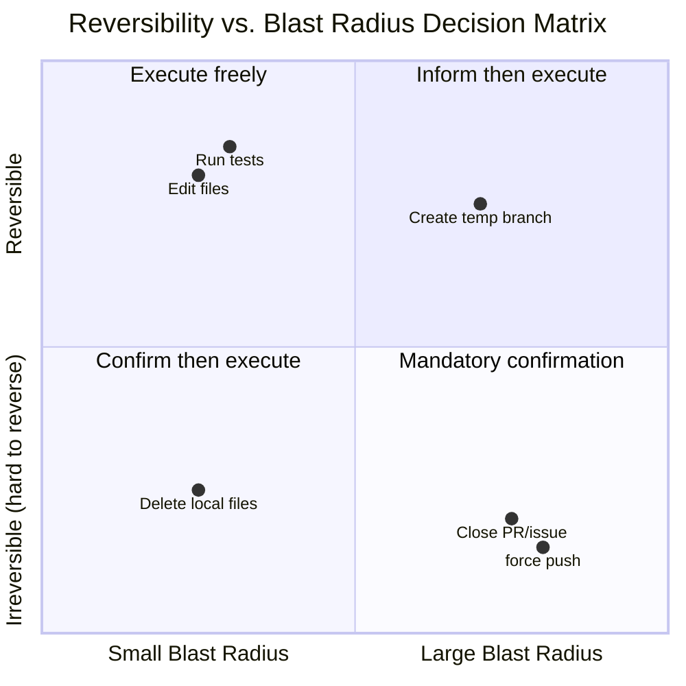

# Chapter 6: Steering Behavior Through Prompts

> Chapter 5는 System Prompt의 조립 아키텍처 — section 등록, 캐시 경계, 다중 소스 합성 — 를 해부했다. 그러나 아키텍처는 단지 골격일 뿐이며, Claude Code가 "숙련된 엔지니어처럼" 행동하게 만드는 진짜 요소는 그 골격에 붙은 근육이다: 정성껏 다듬어진 행동 directive다. 이 Chapter는 6개의 재사용 가능한 행동 steering 패턴을 추출하며, 각각에 대해 소스 코드 예시, 그것이 효과적인 이유의 원리, 그리고 자신의 prompt에 직접 채택할 수 있는 템플릿을 제시한다.

## 6.1 행동 Steering의 본질: 생성 확률 공간에 경계 설정 (The Nature of Behavior Steering: Setting Boundaries in the Generation Probability Space)

LLM의 출력은 확률 분포에 대한 샘플링 과정이다. System Prompt의 행동 directive는 본질적으로 이 확률 공간에 세워진 울타리다 — 원하는 행동의 확률을 높이고 원치 않는 행동을 억제한다. 그러나 그 울타리의 표현이 단단한 벽처럼 작용할지, 흐릿한 선으로 작용할지를 결정한다.

Claude Code의 System Prompt 소스 코드(`restored-src/src/constants/prompts.ts`와 `restored-src/src/tools/BashTool/prompt.ts`)를 읽어보면, Anthropic의 엔지니어들이 directive를 무작위로 쌓은 것이 아니라 암묵적인 패턴 언어를 형성했음을 발견할 수 있다. 이 패턴들은 "옳은 말을 해서" 효과적인 것이 아니라, 그 표현 구조가 모델의 attention 메커니즘과 instruction-following 특성과 일치하기 때문에 작동한다.

이 Chapter는 이 패턴들을 명시화하여 6개의 행동 steering 패턴으로 명명한다.

1. Minimalism Directive
2. Progressive Escalation
3. Reversibility Awareness
4. Tool Preference Steering
5. Agent Delegation Protocol
6. Numeric Anchoring

## 6.2 Pattern 1: Minimalism Directive

### 6.2.1 패턴 정의 (Pattern Definition)

**핵심 아이디어:** 모델의 "helpfulness" 경향을 실제 태스크 범위로 제한하기 위해 over-engineering을 명시적으로 금지한다.

LLM은 자연스럽게 "조금 더" 하려는 경향이 있다 — 추가 에러 핸들링 추가, 문서화 주석 보완, 추상화 레이어 도입. 이는 대화 시나리오에서는 미덕이지만 코드 생성에서는 재앙이다. Minimalism Directive는 구체적인 반례를 사용하여 "하지 말아야 할 것"이 "해야 할 것"보다 더 중요함을 모델에게 가르친다.

### 6.2.2 소스 코드 예시 (Source Code Examples)

**Example 1: 세 줄의 코드가 섣부른 추상화보다 낫다**

```
Don't create helpers, utilities, or abstractions for one-time operations.
Don't design for hypothetical future requirements. The right amount of
complexity is what the task actually requires — no speculative abstractions,
but no half-finished implementations either. Three similar lines of code
is better than a premature abstraction.
```

**Source Location:** `restored-src/src/constants/prompts.ts:203`

마지막 문장 — "Three similar lines of code is better than a premature abstraction" — 은 전체 Minimalism Directive에서 가장 빛나는 한 수다. 이것은 **구체적인 수치 임계값** — 세 줄 — 을 제공하여, "공통 함수로 추출해야 할까" 결정을 내릴 때 모델에게 명확한 기준을 준다. 이 anchor가 없다면 모델은 기본적으로 DRY(Don't Repeat Yourself)로 회귀하며, AI 보조 프로그래밍 맥락에서 DRY는 종종 over-abstraction으로 이어진다.

**Example 2: 요청받지 않은 기능을 추가하지 말 것**

```
Don't add features, refactor code, or make "improvements" beyond what was
asked. A bug fix doesn't need surrounding code cleaned up. A simple feature
doesn't need extra configurability. Don't add docstrings, comments, or type
annotations to code you didn't change. Only add comments where the logic
isn't self-evident.
```

**Source Location:** `restored-src/src/constants/prompts.ts:201`

이 directive의 구조에 주목하라: 먼저 일반 원칙("요청받지 않은 기능을 추가하지 말 것"), 그다음 세 가지 구체적 반례(bug fix는 주변 코드 정리 불필요, 단순 feature는 추가 configurability 불필요, 변경하지 않은 코드에는 주석 추가 금지). 이 "일반 규칙 + 반례" 구조는 매우 효과적이다. 모델이 instruction을 따를 때 추상 원칙을 구체 시나리오에 매핑해야 하는데, 반례는 이 매핑을 위한 anchoring point를 제공한다.

**Example 3: 일어날 수 없는 시나리오에 대한 방어 추가 금지 (ant-only)**

```
Don't add error handling, fallbacks, or validation for scenarios that can't
happen. Trust internal code and framework guarantees. Only validate at system
boundaries (user input, external APIs). Don't use feature flags or
backwards-compatibility shims when you can just change the code.
```

**Source Location:** `restored-src/src/constants/prompts.ts:202`

이 directive는 흔한 LLM 행동 패턴인 과도한 방어적 프로그래밍을 정면으로 공략한다. 모델은 training data에서 모든 가능한 에러를 처리할 것을 강조하는 "best practice" 글들을 대량으로 보아왔다. 그러나 실제 내부 코드에서는 많은 에러 경로가 결코 트리거되지 않는다. 이 directive는 "Trust internal code and framework guarantees"라는 문구를 통해 새로운 판단 프레임워크를 제공한다: 시스템 경계와 내부 호출을 구분하라.

### 6.2.3 왜 효과적인가 (Why It Works)

Minimalism Directive가 작동하는 것은 세 가지 메커니즘 때문이다.

1. **반례는 긍정 규칙보다 따르기 쉽다.** "Don't do X"는 "only do Y"보다 더 정확하다. X의 경계가 Y의 경계보다 명확하기 때문이다. 모델은 생성된 각 token을 "이것이 X를 하고 있는가"로 검사할 수 있다.
2. **구체적인 숫자는 기본 heuristic을 override한다.** "세 줄의 반복 코드"와 같은 수치 anchor는 모델의 내장 DRY heuristic을 override한다. 구체적 숫자가 없으면 모델은 training data에서 가장 흔한 패턴으로 회귀한다.
3. **시나리오 분류는 모호성을 줄인다.** "bug fix는 주변 코드 정리 불필요" 같은 directive는 "언제 조금 더 해야 하는가"라는 흐릿한 질문을 "현재 태스크가 bug fix인가 refactor인가"라는 명확한 분류 태스크로 전환한다.

### 6.2.4 재사용 가능한 템플릿 (Reusable Template)

```
[Minimalism Directive Template]

Don't add {features/refactoring/improvements} beyond the task scope.
{Task type A} doesn't need {common over-engineering behavior A}.
{Task type B} doesn't need {common over-engineering behavior B}.
{N} lines of repeated code is better than a premature abstraction.
Only {take extra action} when {clear boundary condition}.
```

## 6.3 Pattern 2: Progressive Escalation

### 6.3.1 패턴 정의 (Pattern Definition)

**핵심 아이디어:** "포기"와 "무한 루프" 사이의 중간 경로를 정의하여, 모델이 먼저 진단하고, 그다음 조정하고, 마지막으로 도움을 요청하도록 유도한다.

LLM은 실패에 직면했을 때 두 가지 극단적 경향이 있다: 즉시 포기하고 사용자에게 도움을 요청하거나, 정확히 동일한 작업을 끝없이 재시도하거나. Progressive Escalation 패턴은 명확한 3단계 프로토콜 — 진단, 조정, escalate — 을 정의하여 모델의 실패 응답을 합리적인 범위에 가둔다.

### 6.3.2 소스 코드 예시 (Source Code Examples)

**Example 1: 3단계 실패 처리**

```
If an approach fails, diagnose why before switching tactics — read the error,
check your assumptions, try a focused fix. Don't retry the identical action
blindly, but don't abandon a viable approach after a single failure either.
Escalate to the user with ask_user_question only when you're genuinely stuck
after investigation, not as a first response to friction.
```

**Source Location:** `restored-src/src/constants/prompts.ts:233`

이 directive는 한 문단에 완전한 실패 처리 프로토콜을 정의한다.

- **Stage 1 (Diagnose):** "read the error, check your assumptions" — 먼저 무슨 일이 일어났는지 이해한다
- **Stage 2 (Adjust):** "try a focused fix" — 진단을 기반으로 타겟팅된 수정을 한다
- **Stage 3 (Escalate):** "Escalate to the user... only when you're genuinely stuck" — 진짜 막다른 골목에서만 도움을 요청한다

핵심 설계는 두 개의 "don't" 사이의 긴장감에 있다: "Don't retry the identical action blindly"(무한 루프 금지)와 "don't abandon a viable approach after a single failure"(섣부른 포기 금지). 이 양면 제약은 모델을 두 극단 사이의 중간 경로를 찾도록 강제한다.

**Example 2: Git 작업에 대한 Diagnosis-First**

```
Before running destructive operations (e.g., git reset --hard, git push
--force, git checkout --), consider whether there is a safer alternative
that achieves the same goal. Only use destructive operations when they are
truly the best approach.
```

**Source Location:** `restored-src/src/tools/BashTool/prompt.ts:306`

이 directive는 고위험 작업을 실행하기 전에 "더 안전한 대안이 있는가" 평가를 요구한다. 이는 단순히 이런 작업들을 금지하는 것이 아니라, 선택을 하기 전에 추론 단계를 완료하도록 요구한다.

**Example 3: Sleep 명령의 진단적 대안**

```
Do not retry failing commands in a sleep loop — diagnose the root cause.
```

**Source Location:** `restored-src/src/tools/BashTool/prompt.ts:318`

이것은 Progressive Escalation 패턴의 가장 최소화된 형태다: 한 문장이 금지("sleep loop로 재시도하지 말 것")와 대안("근본 원인을 진단하라")을 동시에 포함한다. 흔한 LLM 행동 패턴을 겨냥한 것이다 — 명령이 실패하면 모델은 `sleep && retry`를 반복할 수 있는데, 이는 상호작용 환경에서 재앙이다.

### 6.3.3 왜 효과적인가 (Why It Works)

Progressive Escalation의 효과는 다음에서 온다.

1. **양면 제약이 긴장을 만든다.** "너무 빨리 포기하지 말 것"과 "무한 재시도하지 말 것"을 동시에 정의하는 것은 모델로 하여금 각 실패 후 명시적 추론 단계를 수행하도록 강제한다: "내가 맹목적으로 재시도하는가, 아니면 정보에 기반한 조정을 하는가?"
2. **단계 순서가 Chain-of-Thought에 매핑된다.** diagnose -> adjust -> escalate 시퀀스는 자연스럽게 모델의 사고 체인과 정렬된다. 모델은 이 프로토콜을 자신의 추론 체인 단계로 직접 인코딩할 수 있다.
3. **Escalation을 최후의 수단으로.** "사용자에게 물어보기"를 최종 옵션으로 설정하면 불필요한 상호작용 중단이 줄어들고 자율 완료율이 향상된다.

### 6.3.4 재사용 가능한 템플릿 (Reusable Template)

```
[Progressive Escalation Template]

When {operation} fails, first {diagnostic action} ({specific diagnostic steps}).
Don't blindly retry the same operation, but don't abandon a viable approach
after a single failure either.
Only {escalate action} when {escalation condition}, not as a first response
to friction.
```

## 6.4 Pattern 3: Reversibility Awareness

### 6.4.1 패턴 정의 (Pattern Definition)

**핵심 아이디어:** 작업을 reversibility와 blast radius로 분류하고, 고위험 작업에 대한 확인 프레임워크를 수립한다.

이는 Claude Code의 prompt engineering에서 가장 복잡하고 가장 신중하게 설계된 패턴이다. 단순히 "위험한 작업"을 나열하는 것이 아니라 완전한 위험 평가 프레임워크를 수립하여, 모델에게 "두 번 재고 한 번에 자르라(measure twice, cut once)"를 가르친다.

### 6.4.2 소스 코드 예시 (Source Code Examples)

**Example 1: Reversibility 분석 프레임워크**

```
Carefully consider the reversibility and blast radius of actions. Generally
you can freely take local, reversible actions like editing files or running
tests. But for actions that are hard to reverse, affect shared systems beyond
your local environment, or could otherwise be risky or destructive, check
with the user before proceeding.
```

**Source Location:** `restored-src/src/constants/prompts.ts:258`

이 directive는 두 가지 핵심 차원을 도입한다: **reversibility**(되돌릴 수 있음)와 **blast radius**(영향 범위). 이 두 차원은 2x2 의사결정 행렬을 형성한다.



**Figure 6-1: Reversibility vs. Blast Radius 의사결정 행렬.** Claude Code는 이 두 차원을 사용해 작업을 4개 범주로 분류한다. "자유롭게 실행"에서 "필수 확인"까지.

**Example 2: 고위험 작업의 Exhaustive List**

소스 코드는 확인이 필요한 4개 주요 작업 범주를 제공하며, 각각에 구체적 예시가 있다(`restored-src/src/constants/prompts.ts:261-264`).

| Risk Category | Original Text | Specific Examples |
|--------------|---------------|-------------------|
| Destructive operations | Destructive operations | 파일/branch 삭제, 데이터베이스 테이블 drop, 프로세스 종료, rm -rf, 커밋되지 않은 변경사항 덮어쓰기 |
| Hard-to-reverse operations | Hard-to-reverse operations | force push, git reset --hard, publish된 commit amend, dependency 제거/downgrade, CI/CD 파이프라인 수정 |
| Actions visible to others | Actions visible to others | 코드 push, PR/issue 생성/닫기/댓글, 메시지 전송(Slack/email/GitHub), 공유 인프라 수정 |
| Third-party uploads | Uploading content to third-party tools | diagram renderer, pastebin, gist에 업로드 (캐시되거나 indexed될 수 있음) |

**Example 3: Git Safety Protocol**

```
Git Safety Protocol:
- NEVER update the git config
- NEVER run destructive git commands (push --force, reset --hard, checkout .,
  restore ., clean -f, branch -D) unless the user explicitly requests these
  actions.
- NEVER skip hooks (--no-verify, --no-gpg-sign, etc) unless the user
  explicitly requests it
- NEVER run force push to main/master, warn the user if they request it
- CRITICAL: Always create NEW commits rather than amending, unless the user
  explicitly requests a git amend. When a pre-commit hook fails, the commit
  did NOT happen — so --amend would modify the PREVIOUS commit, which may
  result in destroying work or losing previous changes.
```

**Source Location:** `restored-src/src/tools/BashTool/prompt.ts:87-94`

Git Safety Protocol은 Reversibility Awareness 패턴의 가장 정제된 구현이다. 몇 가지 설계 포인트에 주목하라.

1. **NEVER는 대문자로** — "avoid"나 "try not to"가 아니라 절대 금지다. 대문자는 prompt에서 "attention weight 증가"와 유사한 기능을 한다.
2. **"unless the user explicitly requests"** — 각 NEVER 규칙에는 명시적 예외 조건이 따라붙어, 사용자가 명시적으로 요청할 때 모델이 거부하는 것을 막는다.
3. **CRITICAL 마커 + 인과적 설명** — amend vs. new commit에 관한 가장 미묘한 규칙에는 CRITICAL이 표시될 뿐만 아니라, 규칙이 존재하는 **이유**를 설명한다(hook이 실패하면 commit이 아직 일어나지 않은 것이며, amend는 이전 commit을 수정할 것). 인과적 설명은 모델이 문자 그대로 기계적으로 따르는 것이 아니라 규칙의 정신을 새로운 시나리오로 일반화할 수 있게 한다.

**Example 4: 일회성 권한은 영구 권한이 아니다**

```
A user approving an action (like a git push) once does NOT mean that they
approve it in all contexts, so unless actions are authorized in advance in
durable instructions like CLAUDE.md files, always confirm first.
Authorization stands for the scope specified, not beyond. Match the scope
of your actions to what was actually requested.
```

**Source Location:** `restored-src/src/constants/prompts.ts:258`

이 directive는 위험한 LLM 경향을 겨냥한다: 한 번의 권한에서 전체 권한으로 일반화하는 것. 모델이 context에서 사용자가 이전에 `git push`에 동의한 것을 보고, 이후 다른 시나리오에서 확인 없이 push를 실행할 수 있다. 이 규칙은 "scope specified, not beyond"라는 문구를 통해 정확한 권한 범위 개념을 수립한다.

### 6.4.3 왜 효과적인가 (Why It Works)

Reversibility Awareness의 효과는 다음에서 온다.

1. **차원 분석이 열거를 대체한다.** 모든 위험 작업을 나열하는(완전할 수 없다) 대신, "reversibility"와 "blast radius"라는 두 차원으로 모델이 자율적으로 평가하도록 가르친다. 구체적 예시 목록은 보완적 calibration 역할을 하며, 포괄적 커버리지가 아니다.
2. **NEVER + unless는 정확한 예외를 만든다.** 절대 금지 + 명시적 예외의 조합은 회색 지대에서 모델의 "창의적 해석"을 막는다.
3. **인과적 설명이 일반화를 촉진한다.** 규칙이 존재하는 "이유"를 설명(amend의 인과 체인처럼)하면 모델이 보지 못한 시나리오에서도 올바른 행동을 도출할 수 있다.
4. **"Measure twice, cut once"는 mnemonic 역할을 한다.** 이 영어 속담은 프레임워크 전체의 인지적 anchor 역할을 하며, 모델이 edge case에 직면했을 때 전체 위험 평가 프로토콜을 상기하도록 돕는다.

### 6.4.4 재사용 가능한 템플릿 (Reusable Template)

```
[Reversibility Awareness Template]

Before executing actions, evaluate their reversibility and blast radius.
You may freely execute {list of reversible local operations}.
For {irreversible/shared system} operations, confirm with the user before executing.

NEVER:
- {Dangerous operation 1}, unless the user explicitly requests
- {Dangerous operation 2}, unless the user explicitly requests
- [CRITICAL] {Most subtle dangerous operation}, because {causal explanation}

A user approving {operation} once does NOT mean approval in all contexts.
Authorization is limited to the scope specified.
```

## 6.5 Pattern 4: Tool Preference Steering

### 6.5.1 패턴 정의 (Pattern Definition)

**핵심 아이디어:** Tool 설명 텍스트를 통해 모델의 Tool 선택을 generic Bash 명령에서 specialized tool로 redirect한다.

Claude Code는 풍부한 specialized tool(Read, Edit, Write, Glob, Grep)을 제공하지만, 모델의 training data는 `cat`, `grep`, `sed`, `find` 등의 Unix 명령으로 가득 차 있다. 지침 없이는 모델은 자연스럽게 이런 명령을 Bash tool로 실행하려 한다. Tool Preference Steering 패턴은 tool 설명의 가장 이른 위치에 redirect 지침을 삽입하여 모델의 기본 tool 선택 경로를 가로챈다.

### 6.5.2 소스 코드 예시 (Source Code Examples)

**Example 1: Bash Tool 설명에 Front-loaded Interception**

```
IMPORTANT: Avoid using this tool to run find, grep, cat, head, tail, sed,
awk, or echo commands, unless explicitly instructed or after you have
verified that a dedicated tool cannot accomplish your task. Instead, use the
appropriate dedicated tool as this will provide a much better experience for
the user:

 - File search: Use Glob (NOT find or ls)
 - Content search: Use Grep (NOT grep or rg)
 - Read files: Use Read (NOT cat/head/tail)
 - Edit files: Use Edit (NOT sed/awk)
 - Write files: Use Write (NOT echo >/cat <<EOF)
 - Communication: Output text directly (NOT echo/printf)
```

**Source Location:** `restored-src/src/tools/BashTool/prompt.ts:280-291` (assembled by `getSimplePrompt()`)

이 directive의 설계에는 세 가지 층의 정교함이 있다.

1. **Positional priority.** 이 텍스트는 Bash tool 설명의 시작 부분, 기본 기능 설명 직후에 나타난다. 모델이 Bash tool 호출을 고려하기 시작할 때, 이 redirect directive가 만나는 첫 제약이다.
2. **NOT parenthetical comparison.** 각 매핑 규칙은 "무엇을 사용할 것"과 "무엇을 사용하지 말 것" 둘 다 나열한다. `Use Grep (NOT grep or rg)` 형식은 직접적인 이진 비교를 만들어 모델의 의사결정 주저를 줄인다.
3. **User experience justification.** "this will provide a much better experience for the user"는 무조건적인 명령을 내리는 대신 이 규칙을 따를 이유를 제공한다.

**Example 2: System Prompt의 Redundant Reinforcement**

```
Do NOT use the Bash to run commands when a relevant dedicated tool is
provided. Using dedicated tools allows the user to better understand and
review your work. This is CRITICAL to assisting the user:
  - To read files use Read instead of cat, head, tail, or sed
  - To edit files use Edit instead of sed or awk
  - To create files use Write instead of cat with heredoc or echo redirection
  - To search for files use Glob instead of find or ls
  - To search the content of files, use Grep instead of grep or rg
  - Reserve using the Bash exclusively for system commands and terminal
    operations that require shell execution.
```

**Source Location:** `restored-src/src/constants/prompts.ts:291-302`

이 내용이 Bash tool 설명의 매핑 테이블과 **거의 중복된다**는 점에 주목하라. 이는 실수가 아니라 의도적인 **redundant reinforcement**다. System Prompt와 tool 설명 두 위치에 같은 directive를 배치하면 모델의 attention이 어떤 경로를 취하든 제약을 만나게 된다.

**Example 3: Embedded Tool을 위한 조건부 적응**

```typescript
const embedded = hasEmbeddedSearchTools()

const toolPreferenceItems = [
  ...(embedded
    ? []
    : [
        `File search: Use ${GLOB_TOOL_NAME} (NOT find or ls)`,
        `Content search: Use ${GREP_TOOL_NAME} (NOT grep or rg)`,
      ]),
  `Read files: Use ${FILE_READ_TOOL_NAME} (NOT cat/head/tail)`,
  // ...
]
```

**Source Location:** `restored-src/src/tools/BashTool/prompt.ts:280-291`

Ant 내부 빌드(ant-native builds)가 shell alias를 통해 `find`와 `grep`을 embedded `bfs`와 `ugrep`으로 매핑할 때, standalone Glob/Grep tool로의 redirect는 불필요해진다. 소스 코드는 `hasEmbeddedSearchTools()` 조건을 통해 이 두 매핑을 건너뛴다. 이 조건부 적응은 prompt가 결코 자기모순적인 지침을 포함하지 않도록 보장한다.

### 6.5.3 왜 효과적인가 (Why It Works)

Tool Preference Steering의 효과는 다음에서 온다.

1. **가장 이른 지점에서 결정 경로를 가로챈다.** 모델은 tool을 선택할 때 tool 설명을 먼저 읽는다. Bash tool의 설명에 "이 tool을 X에 쓰지 말고 Y를 써라"를 삽입하는 것은 모델이 선택을 하기 전에 개입하는 것과 같다.
2. **이진 비교는 모호성을 제거한다.** `Use Grep (NOT grep or rg)` 형식은 open-ended 선택("어떤 tool로 검색할까")을 이진 판단("Grep tool 또는 grep 명령")으로 전환하여 결정 복잡도를 줄인다.
3. **Redundant reinforcement는 attention 사각지대를 커버한다.** 긴 context에서 모델의 attention은 감쇠한다. 같은 제약을 서로 다른 두 위치에 배치하면 제약이 "보일" 확률이 증가한다.

### 6.5.4 재사용 가능한 템플릿 (Reusable Template)

```
[Tool Preference Steering Template]

When {operation category} is needed, use {specialized tool name} (NOT {generic alternative commands}).
Using the specialized tool provides {user experience benefit}.

{Generic tool name} should only be used for {explicit list of legitimate uses}.
When unsure, default to the specialized tool and only fall back to {generic tool} when {fallback condition}.
```

## 6.6 Pattern 5: Agent Delegation Protocol

### 6.6.1 패턴 정의 (Pattern Definition)

**핵심 아이디어:** 다중 agent 협업을 위한 정확한 위임 규칙을 정의하여, 재귀적 spawn, context 오염, 결과 fabrication을 방지한다.

AI 시스템이 sub-agent를 spawn할 수 있을 때 새로운 failure mode가 등장한다: agent가 무한히 자기 자신을 재귀적으로 spawn할 수 있고, sub-agent의 중간 출력을 들여다볼 수 있으며(자신의 context를 오염시킴), sub-agent가 반환되기 전에 결과를 fabricate할 수 있다. Agent Delegation Protocol은 이런 failure mode를 정확한 규칙 집합으로 방지한다.

### 6.6.2 소스 코드 예시 (Source Code Examples)

**Example 1: Fork vs. Fresh Agent 선택 프레임워크**

```
Fork yourself (omit subagent_type) when the intermediate tool output isn't
worth keeping in your context. The criterion is qualitative — "will I need
this output again" — not task size.
- Research: fork open-ended questions. If research can be broken into
  independent questions, launch parallel forks in one message. A fork beats
  a fresh subagent for this — it inherits context and shares your cache.
- Implementation: prefer to fork implementation work that requires more than
  a couple of edits.
```

**Source Location:** `restored-src/src/tools/AgentTool/prompt.ts:83-88`

이 directive는 fork(context를 상속하는 분기)와 fresh agent(완전히 새로운 agent) 사이의 선택 기준을 수립한다. 핵심 통찰은 기준이 태스크 크기가 아니라 "나중에 이 출력을 다시 봐야 하는가"라는 점이다. 이 질적 기준은 다소 흐릿하지만, 아래의 두 구체적 시나리오(research와 implementation)와 결합되어 모델에게 충분한 anchoring을 제공한다.

**Example 2: "Don't Peek" — Context 위생 규칙**

```
Don't peek. The tool result includes an output_file path — do not Read or
tail it unless the user explicitly asks for a progress check. You get a
completion notification; trust it. Reading the transcript mid-flight pulls
the fork's tool noise into your context, which defeats the point of forking.
```

**Source Location:** `restored-src/src/tools/AgentTool/prompt.ts:91`

"Don't peek"은 Claude Code의 모든 prompt 중 가장 창의적인 표현 중 하나일 것이다. 두 개의 일상 단어로 복잡한 기술적 제약을 정확히 설명한다: **sub-agent의 중간 출력 파일을 읽지 말라**. 그 뒤의 설명이 이유를 제시한다 — 그렇게 하면 sub-agent의 tool noise가 main agent의 context로 끌려 들어와 forking의 목적(main context를 깨끗하게 유지)을 무너뜨린다.

이 규칙이 대응하는 엔지니어링 문제는: fork sub-agent의 결과는 main agent가 Read tool을 통해 읽을 수 있는 파일에 기록된다. Sub-agent가 완료되기 전에 main agent가 중간 결과를 읽으면, 그 반쯤 완성된 tool 호출 출력이 main agent의 context window에 들어가 귀중한 token budget을 낭비한다.

**Example 3: "Don't Race" — 결과 Fabrication 보호**

```
Don't race. After launching, you know nothing about what the fork found.
Never fabricate or predict fork results in any format — not as prose,
summary, or structured output. The notification arrives as a user-role
message in a later turn; it is never something you write yourself. If the
user asks a follow-up before the notification lands, tell them the fork is
still running — give status, not a guess.
```

**Source Location:** `restored-src/src/tools/AgentTool/prompt.ts:93`

"Don't race"는 미묘하지만 위험한 failure mode를 방지한다: main agent가 fork를 dispatch한 후 fork의 결과를 "예측"하고 성급하게 답을 생성할 수 있다. 이 행동은 사용자에게는 "smart anticipation"처럼 보일 수 있지만, 순수한 hallucination이다 — main agent는 fork가 무엇을 찾았는지 전혀 알지 못한다.

이 directive의 설계는 특히 엄격하다: "결과 fabrication"을 금지할 뿐만 아니라 가능한 모든 변형 형태를 명시적으로 금지한다 — "not as prose, summary, or structured output". 이런 exhaustive한 format 금지가 존재하는 것은 모델이 다른 출력 형태로 literal한 금지를 우회하려 할 수 있기 때문이다.

**Example 4: Fork Sub-Agent 정체성 Anchoring**

```
STOP. READ THIS FIRST.

You are a forked worker process. You are NOT the main agent.

RULES (non-negotiable):
1. Your system prompt says "default to forking." IGNORE IT — that's for the
   parent. You ARE the fork. Do NOT spawn sub-agents; execute directly.
2. Do NOT converse, ask questions, or suggest next steps
3. Do NOT editorialize or add meta-commentary
...
6. Do NOT emit text between tool calls. Use tools silently, then report
   once at the end.
```

**Source Location:** `restored-src/src/tools/AgentTool/forkSubagent.ts:172-194`

이는 위임 프로토콜에서 가장 극적인 조각이다. Fork sub-agent는 parent agent의 완전한 System Prompt를 상속하며, 여기에는 "default to forking" directive가 포함되어 있다. 개입이 없으면 sub-agent는 이 directive를 읽고 다시 fork를 시도한다 — 무한 재귀를 일으킨다.

해결책은 fork sub-agent의 메시지 시작 부분에 "identity override" directive를 삽입하는 것이다: 먼저 대문자 "STOP. READ THIS FIRST."로 attention을 잡고, 그다음 "You ARE the fork"를 명시적으로 선언하며, 마지막으로 "Your system prompt says 'default to forking.' IGNORE IT."를 직접 지적한다. 이 "모순된 지침의 존재를 인정하고 명시적으로 override하는" 기법은 모델이 특정 구절을 무시할 것이라는 단순한 기대보다 훨씬 신뢰할 수 있다.

### 6.6.3 왜 효과적인가 (Why It Works)

Agent Delegation Protocol의 효과는 다음에서 온다.

1. **의인화된 동사가 직관을 만든다.** "Don't peek"과 "Don't race"는 "sub-agent 출력 파일을 읽지 말 것"과 "알림을 받기 전에 결과를 생성하지 말 것"보다 기억하고 따르기 쉽다. 의인화는 추상 기술적 제약을 사회적 직관으로 바꾼다.
2. **Exhaustive format 금지.** "not as prose, summary, or structured output"는 모델이 취할 수 있는 잠재적 회피 경로를 차단한다.
3. **명시적 모순 해소.** Sub-agent가 parent agent의 "fork" directive를 볼 것임을 인정하고 그다음 명시적으로 override하는 것이 모델이 모순된 지침을 올바르게 처리할 것이라고 가정하는 것보다 더 신뢰할 수 있다.
4. **정체성 anchoring + 출력 형식 제약.** Fork sub-agent의 "STOP. READ THIS FIRST."와 엄격한 출력 형식(Scope: / Result: / Key files: / Files changed: / Issues:)의 결합은 sub-agent의 행동을 매우 좁은 채널에 가둔다.

### 6.6.4 재사용 가능한 템플릿 (Reusable Template)

```
[Agent Delegation Protocol Template]

## When to fork
Fork yourself when {intermediate output isn't worth keeping in context}.
The criterion is {qualitative criterion}, not {commonly misjudged criterion}.

## Post-fork behavior
- Don't peek: Do not read {sub-agent}'s intermediate output; wait for
  the completion notification.
  Reason: {specific consequences of context pollution}.
- Don't race: Before {sub-agent} returns, do not predict or fabricate its
  results in any form ({format list}).
  If the user asks a follow-up, reply with {status info}, not a guess.

## Fork sub-agent identity
You are a forked worker process, not the main agent.
{Directive in parent prompt that could cause recursion} does not apply to
you -- execute directly, do not delegate further.
```

## 6.7 Pattern 6: Numeric Anchoring

### 6.7.1 패턴 정의 (Pattern Definition)

**핵심 아이디어:** 모호한 질적 설명을 정확한 숫자로 교체하여, 모델에게 직접 측정 가능한 출력 자를 제공한다.

"더 간결하게", "짧게", "너무 장황하지 말 것" — 이런 질적 directive는 거의 제약력이 없다. "간결"에 대한 모델의 이해가 도메인과 스타일에 따라 다른 training data의 분포에 의존하기 때문이다. Numeric Anchoring은 구체적 숫자를 제공하여 주관적 판단을 측정 가능한 제약으로 전환한다.

### 6.7.2 소스 코드 예시 (Source Code Examples)

**Example 1: Tool 호출 사이의 단어 제한**

```
Length limits: keep text between tool calls to ≤25 words. Keep final
responses to ≤100 words unless the task requires more detail.
```

**Source Location:** `restored-src/src/constants/prompts.ts:534`

이 directive는 현재 Anthropic 내부 사용자(ant-only)에게만 활성화되어 있으며, 다음 주석이 달려 있다.

```typescript
// Numeric length anchors — research shows ~1.2% output token reduction vs
// qualitative "be concise". Ant-only to measure quality impact first.
```

**Source Location:** `restored-src/src/constants/prompts.ts:527-528`

1.2% output token 감소는 대단해 보이지 않을 수 있지만, Claude Code가 매일 처리하는 요청 볼륨을 고려하면 이 퍼센티지의 절대값이 상당한 비용 절감이 된다. 더 중요한 것은, 이 1.2%는 단지 "be concise"를 "≤25 words"로 교체하는 것만으로 달성되었다 — 코드 변경 없이, 순수한 prompt 최적화로.

두 수치 anchor의 서로 다른 설계에 주목하라.
- **≤25 words (tool 호출 사이)**: 이것은 hard 제약이다. Tool 호출 사이의 텍스트는 보통 불필요하기 때문이다 — 모델은 사용자에게 자신이 무엇을 하고 있는지 설명하지 말고 다음 tool을 바로 호출해야 한다.
- **≤100 words (최종 응답)**: 예외 조건("unless the task requires more detail")이 따라붙는다. 최종 응답 길이가 정말로 태스크 복잡도에 의존하기 때문이다.

**Example 2: Fork Sub-Agent의 보고서 길이 제한**

```
8. Keep your report under 500 words unless the directive specifies otherwise.
   Be factual and concise.
```

**Source Location:** `restored-src/src/tools/AgentTool/forkSubagent.ts:186`

Fork sub-agent에 대한 500-단어 제한은 명확한 엔지니어링 목표를 가진다: sub-agent의 보고서는 main agent의 context에 주입되며, 지나치게 긴 보고서는 main agent의 context window를 낭비한다. 500 단어는 대략 600-700 token에 해당하며, "충분한 정보 제공"과 "context 공간 절약" 사이의 균형점이다.

**Example 3: Commit Message 길이 가이드**

```
Draft a concise (1-2 sentences) commit message that focuses on the "why"
rather than the "what"
```

**Source Location:** `restored-src/src/tools/BashTool/prompt.ts:103`

"1-2 sentences"는 Numeric Anchoring의 또 다른 형태다 — 단어 수가 아니라 문장 수. 이 anchor는 "focuses on the 'why' rather than the 'what'"이라는 콘텐츠 가이드와 결합되어 길이와 품질을 동시에 제약한다.

### 6.7.3 Ant-Only 실험 결과 (Ant-Only Experiment Results)

Numeric Anchoring 패턴은 Claude Code에서 명시적으로 정량화된 효과 데이터가 있는 몇 안 되는 prompt 최적화 중 하나다.

| Metric | Qualitative ("be concise") | Numeric ("≤25 words") | Change |
|--------|---------------------------|----------------------|--------|
| Output token 소비 | Baseline | -1.2% | 감소 |
| 배포 범위 | 전체 | ant-only | 점진적 rollout |
| 코드 변경량 | N/A | 0 줄 | 순수 prompt |
| 품질 영향 | Baseline | 측정 예정 | 미지 |

**Table 6-1: Numeric Anchoring의 ant-only 실험 결과.** 배포 확대 전에 품질 영향을 측정하기 위해 현재는 내부 사용자에게만 활성화.

ant-only의 점진적 rollout 전략 자체도 주목할 만하다. 소스 코드의 조건 검사는 다음과 같다.

```typescript
...(process.env.USER_TYPE === 'ant'
  ? [
      systemPromptSection(
        'numeric_length_anchors',
        () => 'Length limits: keep text between tool calls to ≤25 words...',
      ),
    ]
  : []),
```

이 패턴은 Claude Code의 prompt 전반에 반복적으로 나타난다: 새로운 행동 directive는 먼저 내부 사용자에게 열리고, 데이터가 수집되며, 그다음에 외부 사용자로 rollout할지 결정된다. 이는 prompt engineering에서의 A/B testing 방법론이다.

### 6.7.4 왜 효과적인가 (Why It Works)

Numeric Anchoring의 효과는 다음에서 온다.

1. **주관적 해석을 제거한다.** "25 words"는 모호하지 않고, "concise"는 그렇다. 모델은 각 token을 생성한 후 세어서 임계값에 접근하는지 판단할 수 있다.
2. **Anchoring Effect.** 인지 심리학 연구는 인간이 수량 추정을 할 때 사전 숫자에 anchor된다는 것을 보여준다. LLM 행동도 유사하다 — prompt에 등장하는 숫자는 출력 길이의 참조점이 된다.
3. **Hard 제약 + soft 예외 조합.** "≤25 words"는 hard 제약이고, "unless the task requires more detail"은 soft 예외다. 이 조합은 모델이 기본적으로 수치 제한을 따르되 합리적인 상황에서는 돌파할 수 있게 한다.

### 6.7.5 재사용 가능한 템플릿 (Reusable Template)

```
[Numeric Anchoring Template]

Length limits:
- {Output type A}: keep to ≤{N} words/sentences/lines.
- {Output type B}: keep to ≤{M} words/sentences/lines, unless {exemption condition}.
Be factual and concise.
```

## 6.8 패턴 요약 (Pattern Summary)

다음 표는 이 Chapter에서 추출한 6개의 행동 steering 패턴을 요약하며, 각각에 대해 대표 소스 코드 인용과 직접 재사용 가능한 prompt 템플릿을 제공한다.

| # | Pattern Name | Representative Source Quote | Reusable Template |
|---|-------------|---------------------------|-------------------|
| 1 | **Minimalism Directive** | "Three similar lines of code is better than a premature abstraction." `prompts.ts:203` | Don't add {X} beyond task scope. {N} lines of repeated code is better than premature abstraction. Only {extra action} when {boundary condition}. |
| 2 | **Progressive Escalation** | "Don't retry the identical action blindly, but don't abandon a viable approach after a single failure either." `prompts.ts:233` | When {operation} fails, first {diagnose}. Don't retry blindly, but don't give up after one failure. Only {escalate} when {condition}. |
| 3 | **Reversibility Awareness** | "Carefully consider the reversibility and blast radius of actions... measure twice, cut once." `prompts.ts:258-266` | Evaluate the reversibility and blast radius of operations. Reversible local operations: execute freely; irreversible/shared operations: confirm first. NEVER {dangerous operation}, unless user explicitly requests. |
| 4 | **Tool Preference Steering** | "Use Grep (NOT grep or rg)" `BashTool/prompt.ts:285` | When {operation} is needed, use {specialized tool} (NOT {generic command}). Place mapping tables redundantly at two locations. |
| 5 | **Agent Delegation Protocol** | "Don't peek... Don't race..." `AgentTool/prompt.ts:91-93` | Don't peek at sub-agent intermediate output. Don't fabricate results in any form before they return. Fork sub-agents explicitly declare identity and override contradictory parent prompt instructions. |
| 6 | **Numeric Anchoring** | "keep text between tool calls to ≤25 words" `prompts.ts:534` | {Output type}: keep to ≤{N} words. Replace qualitative descriptions like "concise" with precise numbers. Hard constraint + soft exemption combination. |

**Table 6-2: 6개 행동 steering 패턴 요약.** 각 패턴은 명확한 적용 시나리오와 재사용 가능한 템플릿 구조를 가진다.

## 6.9 Cross-Pattern 설계 원칙 (Cross-Pattern Design Principles)

이 6개 패턴을 되돌아보면, 몇 가지 기저의 cross-pattern 설계 원칙이 드러난다.

**Principle 1: 부정 정의가 긍정 설명을 능가한다.** "Don't do X"는 "do Y"보다 모델이 따르기 쉽다. 금지의 경계가 허용의 경계보다 명확하기 때문이다. 6개 패턴 중 5개가 "Don't" / "NEVER" / "NOT"와 같은 부정 형태를 광범위하게 사용한다.

**Principle 2: 구체적 예시는 추상 규칙의 calibrator다.** 모든 추상 규칙("reversibility를 고려하라")에는 구체적 예시 목록("git reset --hard, push --force...")이 따라붙는다. 예시는 규칙의 대체물이 아니라 calibration point다 — 모델이 규칙의 적용 범위와 granularity를 이해하도록 돕는다.

**Principle 3: 인과적 설명이 일반화를 촉진한다.** 규칙에 "because..." 설명이 동반되면(amend vs. new commit의 인과 체인처럼), 모델은 보지 못한 시나리오에서 규칙의 정신을 도출할 수 있다. 순수 명령 규칙은 training 분포 내에서만 작동하지만, 인과적 설명은 규칙이 문자 그대로를 초월하게 한다.

**Principle 4: Redundancy는 의도적이다.** Tool Preference Steering은 같은 매핑 테이블을 두 위치에 배치한다. Reversibility Awareness는 Git safety 규칙을 System Prompt와 Bash tool 설명 모두에 정의한다. 이 redundancy는 태만이 아니라 attention decay에 대한 엔지니어링 대책이다.

**Principle 5: Gradual rollout은 prompt engineering의 일부다.** Numeric Anchoring의 ant-only 실험은 prompt 수정도 코드 변경처럼 A/B testing과 점진적 rollout이 필요함을 보여준다. `USER_TYPE === 'ant'` 조건 검사는 이 방법론의 코드 구현이다.

## 6.10 사용자가 할 수 있는 것 (What Users Can Do)

이 Chapter에서 추출한 6개 행동 steering 패턴을 바탕으로, 독자가 자신의 prompt에 직접 통합할 수 있는 실무 권장사항은 다음과 같다.

1. **"do Y"를 "don't do X"로 교체하라.** 기존 prompt를 검토하고 긍정 설명을 부정 제약으로 전환하라. "Generate concise code"는 "Don't add features beyond what was asked. A bug fix doesn't need surrounding code cleaned up."보다 덜 효과적이다. 구체적 반례는 추상적 긍정 목표보다 모델이 따르기 쉽다.

2. **실패 시나리오에 대한 3단계 프로토콜을 정의하라.** Agent가 실패할 수 있는 작업(API 호출, 명령 실행, 파일 작업)을 처리해야 한다면, prompt에 "diagnose -> adjust -> escalate" 경로를 명시적으로 정의하라. 두 극단을 동시에 금지하라: 맹목적 재시도와 한 번의 실패로 포기.

3. **형용사를 숫자로 교체하라.** "keep it concise"를 "≤25 words"나 "1-2 sentences"로 교체하라. Claude Code의 데이터는 이 단일 변경만으로 1.2% output token 감소를 달성했음을 보여준다. 자신의 시나리오에서 각 출력 타입에 대해 구체적 수량 제한을 설정하라.

4. **Tool 설명에 redirect 테이블을 삽입하라.** Tool set에 "universal tool"(Bash처럼)이 있다면, 그 설명의 가장 이른 위치에 "어느 시나리오에 어느 대안 tool을 써야 하는지"의 매핑 테이블을 배치하라. 동시에 specialized tool 설명에서 exclusivity를 선언하라. 양방향 closed loop는 단방향 제약보다 훨씬 효과적이다.

5. **고위험 작업을 위한 reversibility 평가 프레임워크를 구축하라.** 단순히 "위험한 작업"을 나열하지 말라(완전할 수 없다); 대신 "reversibility"와 "blast radius" 두 차원을 사용해 모델이 자율적으로 평가하도록 가르쳐라. NEVER + unless 정확한 예외 구조와 결합하여 모델에게 실행 가능한 의사결정 프레임워크를 제공하라.

6. **소규모 점진적 rollout으로 먼저 검증하라.** 새로운 행동 directive는 먼저 사용자 또는 시나리오의 작은 부분집합에 열려야 하며, 광범위하게 rollout하기 전에 효과 데이터를 수집해야 한다. Claude Code의 `USER_TYPE === 'ant'` 점진적 rollout 메커니즘은 참조할 만한 패턴이다 — prompt 수정도 A/B testing이 필요하다.

## 6.11 요약 (Summary)

이 Chapter는 Claude Code 소스 코드에서 6개의 명명된 행동 steering 패턴을 추출했다. 이 패턴들은 임의의 표현 선택이 아니라 실험적으로 검증된 엔지니어링 관행이다 — Minimalism Directive의 "세 줄의 코드" anchor부터 Numeric Anchoring의 1.2% token 감소까지, 각 패턴은 명확한 설계 의도와 측정 가능한 효과를 가진다.

이 패턴들의 공통 특성은 **정밀성(precision)**이다: 모호한 형용사를 구체적 숫자로 교체, 긍정 설명을 반례로 교체, 무조건적 명령을 인과적 설명으로 교체. 이 정밀성은 우연이 아니다 — 이는 근본적 진실을 반영한다: LLM이 instruction을 따르는 신뢰성은 그 instruction의 정밀성과 양의 상관관계를 가진다.

> 다음 Chapter는 runtime 행동 관찰과 디버깅으로 방향을 돌린다: 이 신중하게 설계된 prompt들이 실제 대화에서 예상치 못한 상황을 만났을 때, 시스템이 어떻게 감지하고, 기록하고, 대응하는지를 다룬다.

---

## Version Evolution: v2.1.91 변경사항

> 다음 분석은 v2.1.91 bundle signal 비교에 기반한다.

v2.1.91은 새로운 `tengu_rate_limit_lever_hint` 이벤트를 도입하여, 새로운 rate-limit steering 메커니즘을 시사한다 — 모델이 rate limit에 근접할 때, 시스템이 단순히 rate limit 해제를 기다리는 대신, prompt 레벨의 "lever hints"(tool 호출 빈도 줄이기 또는 더 가벼운 작업 사용 같은)를 통해 모델 행동을 steering한다.
