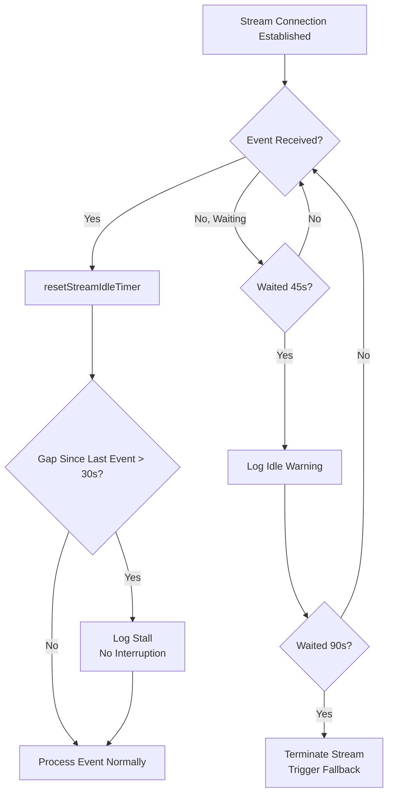

# Chapter 6b: API Communication Layer — Retry, Streaming, and Degradation Engineering

> `services/api/` 디렉터리는 SDK wrapper 레이어가 아니다 — Agent의 **Control Plane**이다. 모델 degradation, 캐시 보호, 파일 전송, Prompt Replay 디버깅 모두 이 레이어에서 일어난다. 이 Chapter는 그 중에서 가장 중요한 resilience 서브시스템 — retry, streaming, degradation — 에 초점을 맞춘다. 파일 전송 채널(Files API)은 이 Chapter 끝에서 다루고, Prompt Replay 디버깅 도구는 Chapter 29에서 분석한다.

## Why This Matters

Agent 시스템의 신뢰성은 모델이 얼마나 똑똑한지가 아니라, 최악의 네트워크 조건에서도 여전히 작동할 수 있는지에 달려 있다. 기차에서 Claude Code를 사용해 긴급 버그를 처리하는 개발자를 상상해 보라: WiFi가 끊겼다 이어지고, API가 가끔 529 overload 에러를 반환하며, 스트리밍 응답이 도중에 갑자기 끊긴다. 통신 레이어에 충분한 resilience 설계가 없다면, 이 개발자는 설명할 수 없는 crash를 보거나 수동으로 반복 재시도하면서 귀중한 context window 공간을 낭비한다.

Claude Code의 통신 레이어는 바로 이런 문제들을 해결한다. 단순한 "실패 시 재시도" wrapper가 아니라 다층 방어 시스템이다: exponential backoff는 avalanche 효과를 막고, 529 counter는 모델 degradation을 트리거하며, dual watchdog은 stream 중단을 감지하고, Fast Mode cache-aware retry는 비용을 보호하며, persistent mode는 unattended 시나리오를 지원한다. 이 메커니즘들이 함께 핵심 엔지니어링 철학을 구현한다: **통신 실패는 예외가 아니라 일상이며, 시스템은 모든 레이어에 contingency plan을 가져야 한다.**

똑같이 주목할 만한 것은 이 시스템의 observability 설계다. 모든 API 호출은 세 개의 telemetry 이벤트를 방출한다 — `tengu_api_query`(request 전송), `tengu_api_success`(성공 응답), `tengu_api_error`(실패 응답) — 여기에 25개의 에러 분류와 gateway fingerprint 감지가 결합되어, 모든 통신 실패를 추적 가능하고 진단 가능하게 만든다. 이것은 실제 production 트래픽에 의해 벼려진 시스템이며, 모든 코드 라인이 실제로 발생한 실패 시나리오에 매핑된다.

---

## Source Code Analysis

> **Interactive version**: [Click to view the retry and degradation animation](retry-viz.html) — 4개 시나리오의 Timeline 애니메이션(normal / 429 rate limit / 529 overload / Fast Mode degradation).

### 6b.1 Retry 전략: Exponential Backoff에서 Model Degradation까지 (Retry Strategy: From Exponential Backoff to Model Degradation)

Claude Code의 retry 시스템은 `withRetry.ts`에 구현되어 있다. 핵심은 `AsyncGenerator` 함수 `withRetry()`로, retry 대기 중 `yield`를 사용해 `SystemAPIErrorMessage`를 상위 레이어로 전달하여 UI가 retry 상태를 실시간으로 표시할 수 있게 한다.

#### 상수와 설정 (Constants and Configuration)

Retry 시스템의 동작은 신중하게 튜닝된 상수 집합에 의해 지배된다.

| Constant | Value | Purpose | Source Location |
|----------|-------|---------|-----------------|
| `DEFAULT_MAX_RETRIES` | 10 | Default retry budget | `withRetry.ts:52` |
| `MAX_529_RETRIES` | 3 | 연속 529 overload 후 모델 degradation 트리거 | `withRetry.ts:54` |
| `BASE_DELAY_MS` | 500 | Exponential backoff base (500ms x 2^(attempt-1)) | `withRetry.ts:55` |
| `PERSISTENT_MAX_BACKOFF_MS` | 5 minutes | persistent 모드에서의 최대 backoff cap | `withRetry.ts:96` |
| `PERSISTENT_RESET_CAP_MS` | 6 hours | persistent 모드에서의 절대 cap | `withRetry.ts:97` |
| `HEARTBEAT_INTERVAL_MS` | 30 seconds | Heartbeat 간격(컨테이너 idle 회수 방지) | `withRetry.ts:98` |
| `SHORT_RETRY_THRESHOLD_MS` | 20 seconds | Fast Mode short retry 임계값 | `withRetry.ts:800` |
| `DEFAULT_FAST_MODE_FALLBACK_HOLD_MS` | 30 minutes | Fast Mode cooldown 기간 | `withRetry.ts:799` |

10회 retry budget은 관대해 보일 수 있지만, exponential backoff(500ms -> 1s -> 2s -> 4s -> 8s -> 16s -> 32s x 4)와 결합하면 총 대기 시간은 약 2.5~3분이다. 실제 구현은 각 backoff 간격에 0~25%의 random jitter도 추가하여(`withRetry.ts:542-547`) 여러 client가 동시에 retry하여 Thundering Herd 효과를 일으키는 것을 막는다. 이는 신중히 calibrate된 설계다: 짧은 네트워크 단절을 처리하기에 충분한 retry지만, API가 정말로 사용 불가능할 때 사용자를 너무 오래 기다리게 하지 않을 만큼의 양이다.

#### Retry 결정: shouldRetry 함수 (Retry Decisions: The shouldRetry Function)

`shouldRetry()` 함수는 retry 시스템의 핵심 의사결정자이며, `withRetry.ts:696-787`에 정의된다. `APIError`를 받아 boolean을 반환한다. 모든 return path를 분석하면 세 가지 범주가 드러난다.

**Never retry:**

| Condition | Returns | Reason |
|-----------|---------|--------|
| Mock error (for testing) | `false` | `/mock-limits` 명령에서 오며, retry로 override되면 안 됨 |
| `x-should-retry: false` (non-ant user or non-5xx) | `false` | 서버가 명시적으로 retry 금지 표시 |
| 상태 코드 없음, connection error도 아님 | `false` | 에러 타입 판단 불가 |
| ClaudeAI subscriber의 429 (non-Enterprise) | `false` | Max/Pro 사용자 rate limit은 시간 단위; retry 무의미 |

**Always retry:**

| Condition | Returns | Reason |
|-----------|---------|--------|
| persistent 모드에서 429/529 | `true` | Unattended 시나리오는 무한 retry 필요 |
| CCR 모드에서 401/403 | `true` | 원격 환경에서의 인증은 인프라 관리; 짧은 실패는 회복 가능 |
| Context overflow error (400) | `true` | 에러 메시지 파싱하여 `max_tokens` 자동 조정 가능 (`withRetry.ts:726`) |
| 에러 메시지에 `overloaded_error` 포함 | `true` | SDK가 streaming 모드에서 529 상태 코드를 제대로 전달하지 못할 때가 있음 |
| `APIConnectionError` (connection error) | `true` | 네트워크 blip은 가장 흔한 일시적 에러 |
| 408 (request timeout) | `true` | 서버 측 timeout; retry로 대개 성공 |
| 409 (lock timeout) | `true` | 백엔드 리소스 경합; retry로 대개 성공 |
| 401 (authentication error) | `true` | API key 캐시 클리어 후 retry |
| 403 (OAuth token revoked) | `true` | 다른 프로세스가 토큰을 refresh함 |
| 5xx (server error) | `true` | 서버 측 에러는 대개 일시적 |

**Conditional retry:**

| Condition | Returns | Reason |
|-----------|---------|--------|
| `x-should-retry: true` 이고 ClaudeAI subscriber 아님, 또는 subscriber이지만 Enterprise | `true` | 서버가 retry 표시 + 사용자 타입이 지원 |
| 429 (non-ClaudeAI subscriber or Enterprise) | `true` | pay-per-use 사용자의 rate limit은 짧음 |

여기에 주목할 만한 설계 결정이 있다: ClaudeAI subscriber(Max/Pro)의 경우, `x-should-retry` 헤더가 `true`라 해도 429 에러는 retry되지 않는다. 이유는 소스 코드 주석에 명확하게 기술되어 있다.

```typescript
// restored-src/src/services/api/withRetry.ts:735-736
// For Max and Pro users, should-retry is true, but in several hours, so we shouldn't.
// Enterprise users can retry because they typically use PAYG instead of rate limits.
```

Max/Pro 사용자의 rate limit window는 시간 단위 — retry는 시간 낭비일 뿐이며, 사용자에게 직접 알리는 것이 낫다. 이는 일률적 retry 정책이 아니라, **사용자 시나리오 이해에 기반한 차별화된 결정**이다.

#### 3-Layer Error Classification Funnel

Claude Code의 에러 처리는 flat한 switch-case가 아니라 3-layer funnel 구조다.

```
classifyAPIError()  — 19+ specific types (for telemetry and diagnostics)
    ↓ mapping
categorizeRetryableAPIError()  — 4 SDK categories (for upper-layer error display)
    ↓ decision
shouldRetry()  — boolean (for the retry loop)
```

첫 번째 레이어인 `classifyAPIError()`(`errors.ts:965-1161`)는 에러를 25+개의 구체 타입으로 세분화한다. `aborted`, `api_timeout`, `repeated_529`, `capacity_off_switch`, `rate_limit`, `server_overload`, `prompt_too_long`, `pdf_too_large`, `pdf_password_protected`, `image_too_large`, `tool_use_mismatch`, `unexpected_tool_result`, `duplicate_tool_use_id`, `invalid_model`, `credit_balance_low`, `invalid_api_key`, `token_revoked`, `oauth_org_not_allowed`, `auth_error`, `bedrock_model_access`, `server_error`, `client_error`, `ssl_cert_error`, `connection_error`, `unknown` 등을 포함한다. 이 분류들은 `tengu_api_error` telemetry 이벤트의 `errorType` 필드에 바로 기록되어, production 이슈의 정밀한 분류가 가능하다.

두 번째 레이어인 `categorizeRetryableAPIError()`(`errors.ts:1163-1182`)는 이 fine-grained 타입들을 4개의 SDK 레벨 범주로 병합한다: `rate_limit`(429와 529), `authentication_failed`(401과 403), `server_error`(408+), `unknown`. 이 레이어는 상위 UI에 단순화된 에러 표시를 제공한다.

세 번째 레이어는 `shouldRetry()` 자신이며, 최종 boolean 결정을 내린다.

이 3-layer 설계의 이점은 진단 정보는 매우 상세할 수 있는 반면(25분류) 결정 로직은 간결하게 유지된다는 점이다(true/false). 두 관심사가 완전히 decouple된다.

#### 529 Overload의 특별한 처리 (Special Handling of 529 Overload)

529 에러는 Claude Code의 retry 시스템에서 특별한 위치를 차지한다. 529는 API 백엔드의 capacity가 부족하다는 의미 — 429(사용자 rate limit)와 달리, 이는 시스템 레벨의 overload다.

첫째, 모든 query source가 529에서 retry하는 것은 아니다. `FOREGROUND_529_RETRY_SOURCES`(`withRetry.ts:62-82`)는 foreground request(사용자가 능동적으로 결과를 기다리는 request)만 retry되는 allowlist를 정의한다.

```typescript
// restored-src/src/services/api/withRetry.ts:57-61
// Foreground query sources where the user IS blocking on the result — these
// retry on 529. Everything else (summaries, titles, suggestions, classifiers)
// bails immediately: during a capacity cascade each retry is 3-10× gateway
// amplification, and the user never sees those fail anyway.
```

이는 **시스템 레벨의 load shedding 전략**이다: 백엔드가 overload되었을 때 background 태스크(summary 생성, title 생성, suggestion 생성)는 retry queue에 합류하지 않고 즉시 포기한다. 각 retry는 overload된 백엔드에 부하를 3~10배 증폭시킨다 — 불필요한 retry를 줄이는 것이 cascading failure를 완화하는 핵심이다.

둘째, 3회 연속 529 에러는 모델 degradation을 트리거한다. 이 로직은 `withRetry.ts:327-364`에 있다.

```typescript
// restored-src/src/services/api/withRetry.ts:327-351
if (is529Error(error) &&
    (process.env.FALLBACK_FOR_ALL_PRIMARY_MODELS ||
     (!isClaudeAISubscriber() && isNonCustomOpusModel(options.model)))
) {
  consecutive529Errors++
  if (consecutive529Errors >= MAX_529_RETRIES) {
    if (options.fallbackModel) {
      logEvent('tengu_api_opus_fallback_triggered', {
        original_model: options.model,
        fallback_model: options.fallbackModel,
        provider: getAPIProviderForStatsig(),
      })
      throw new FallbackTriggeredError(
        options.model,
        options.fallbackModel,
      )
    }
    // ...
  }
}
```

`FallbackTriggeredError`(`withRetry.ts:160-168`)는 전용 error 클래스다. 일반 exception이 아니라 — 상위 Agent Loop에 캐치되었을 때 모델 전환(일반적으로 Opus에서 Sonnet으로)을 트리거하는 **control flow signal**이다. 제어 흐름에 exception을 사용하는 것은 많은 맥락에서 anti-pattern이지만 여기서는 정당화된다: degradation 이벤트가 Agent Loop에 도달하기 위해 여러 call stack 레이어를 통과해 전파되어야 하며, exception이 가장 자연스러운 상향 전파 메커니즘이기 때문이다.

똑같이 중요한 것은 `CannotRetryError`(`withRetry.ts:144-158`)이며, 이는 `retryContext`(현재 모델, thinking 설정, max_tokens override 등 포함)를 싣고 있어 상위 레이어가 실패를 어떻게 처리할지 결정하기에 충분한 context를 제공한다.

### 6b.2 Streaming: Dual Watchdog

Streaming 응답은 Claude Code 사용자 경험의 핵심이다 — 사용자는 텍스트가 점진적으로 나타나는 것을 보고, 긴 빈 페이지를 기다리지 않는다. 그러나 streaming 연결은 일반 HTTP request보다 훨씬 취약하다: TCP 연결이 중간 proxy에 의해 조용히 닫힐 수 있고, 서버가 생성 중에 hang이 걸릴 수 있으며, SDK의 timeout 메커니즘은 초기 연결만 커버하고 데이터 스트림 단계는 커버하지 않는다.

Claude Code는 `claude.ts`에서 두 겹의 watchdog으로 이 문제를 해결한다.

#### Idle Timeout Watchdog (Interrupting)

```typescript
// restored-src/src/services/api/claude.ts:1877-1878
const STREAM_IDLE_TIMEOUT_MS =
  parseInt(process.env.CLAUDE_STREAM_IDLE_TIMEOUT_MS || '', 10) || 90_000
const STREAM_IDLE_WARNING_MS = STREAM_IDLE_TIMEOUT_MS / 2
```

Idle watchdog은 고전적인 **two-phase alert** 패턴을 따른다.

1. **Warning phase** (45초): 45초 동안 streaming 이벤트(chunk)를 받지 못하면 warning log와 진단 이벤트 `cli_streaming_idle_warning`이 기록된다. 이 시점에서 스트림은 단지 느린 것일 수 있다 — 반드시 죽은 것은 아니다.
2. **Timeout phase** (90초): 90초 동안 어떠한 이벤트도 오지 않으면 스트림이 죽은 것으로 선언된다. `streamIdleAborted = true`를 설정하고, `performance.now()` snapshot을 기록(abort 전파 지연 측정용)하며, `tengu_streaming_idle_timeout` telemetry 이벤트를 전송한 다음, `releaseStreamResources()`를 호출하여 스트림을 강제 종료한다.

새 streaming 이벤트가 도착할 때마다 `resetStreamIdleTimer()`가 두 타이머를 리셋한다. 이는 스트림이 살아있는 한 — 느리더라도 — watchdog이 조기에 종료시키지 않도록 보장한다.

```typescript
// restored-src/src/services/api/claude.ts:1895-1928
function resetStreamIdleTimer(): void {
  clearStreamIdleTimers()
  if (!streamWatchdogEnabled) { return }
  streamIdleWarningTimer = setTimeout(/* warning */, STREAM_IDLE_WARNING_MS)
  streamIdleTimer = setTimeout(() => {
    streamIdleAborted = true
    streamWatchdogFiredAt = performance.now()
    // ... logging and telemetry
    releaseStreamResources()
  }, STREAM_IDLE_TIMEOUT_MS)
}
```

Watchdog은 `CLAUDE_ENABLE_STREAM_WATCHDOG` 환경 변수를 통해 명시적으로 활성화되어야 한다는 점에 주목하라. 이는 feature가 여전히 gradual rollout 단계임을 의미한다 — 모든 사용자에게 확장하기 전에 내부와 제한된 사용자로 먼저 검증한다.

#### Stall Detection (Logging Only)

```typescript
// restored-src/src/services/api/claude.ts:1936
const STALL_THRESHOLD_MS = 30_000 // 30 seconds
```

Stall detection은 Idle watchdog과는 다른 문제를 다룬다.

- **Idle** = "이벤트가 전혀 수신되지 않음"(연결이 이미 죽었을 수 있음)
- **Stall** = "이벤트는 수신되지만 그 사이 간격이 너무 큼"(연결은 살아있지만 서버가 느림)

Stall detection은 오직 **log**만 한다 — **중단시키지 않는다**. 두 streaming 이벤트 사이의 간격이 30초를 초과하면 `stallCount`와 `totalStallTime`을 증가시키고 `tengu_streaming_stall` telemetry 이벤트를 전송한다.

```typescript
// restored-src/src/services/api/claude.ts:1944-1965
if (lastEventTime !== null) {
  const timeSinceLastEvent = now - lastEventTime
  if (timeSinceLastEvent > STALL_THRESHOLD_MS) {
    stallCount++
    totalStallTime += timeSinceLastEvent
    logForDebugging(
      `Streaming stall detected: ${(timeSinceLastEvent / 1000).toFixed(1)}s gap between events (stall #${stallCount})`,
      { level: 'warn' },
    )
    logEvent('tengu_streaming_stall', { /* ... */ })
  }
}
lastEventTime = now
```

핵심 디테일: `lastEventTime`은 첫 chunk가 도착한 후에만 설정되어, TTFB(Time to First Token)를 stall로 오인하는 것을 피한다. TTFB는 정당하게 높을 수 있다(모델이 생각 중) — 그러나 일단 출력이 시작되면 이후 이벤트 간격은 안정적이어야 한다.

두 watchdog 레이어의 협업은 다음과 같이 설명할 수 있다.



#### Non-Streaming Fallback

Streaming 연결이 watchdog에 의해 중단되거나 다른 이유로 실패하면, Claude Code는 non-streaming request 모드로 fallback한다. 이 로직은 `claude.ts:2464-2569`에 있다.

Fallback 시 두 가지 핵심 정보가 기록된다.

1. **`fallback_cause`**: `'watchdog'`(watchdog timeout) 또는 `'other'`(기타 에러). 트리거 원인 구분에 사용된다.
2. **`initialConsecutive529Errors`**: Streaming 실패 자체가 529 에러였다면, 해당 카운트가 non-streaming retry loop로 전달된다. 이는 streaming에서 non-streaming으로 전환하는 동안 529 카운트가 리셋되지 않도록 보장한다.

```typescript
// restored-src/src/services/api/claude.ts:2559
initialConsecutive529Errors: is529Error(streamingError) ? 1 : 0,
```

Non-streaming fallback은 자체 timeout 설정을 가진다.

```typescript
// restored-src/src/services/api/claude.ts:807-811
function getNonstreamingFallbackTimeoutMs(): number {
  const override = parseInt(process.env.API_TIMEOUT_MS || '', 10)
  if (override) return override
  return isEnvTruthy(process.env.CLAUDE_CODE_REMOTE) ? 120_000 : 300_000
}
```

CCR(Claude Code Remote) 환경은 기본 2분, 로컬 환경은 기본 5분이다. CCR의 짧은 timeout은 remote 컨테이너가 약 5분의 idle reclamation 메커니즘을 가지기 때문이다 — 5분 hang은 컨테이너가 SIGKILL을 받게 하므로, 2분에 우아하게 timeout하는 것이 낫다.

주목할 점은 non-streaming fallback이 Feature Flag `tengu_disable_streaming_to_non_streaming_fallback`이나 환경 변수 `CLAUDE_CODE_DISABLE_NONSTREAMING_FALLBACK`으로 비활성화될 수 있다는 것이다. 이유는 소스 코드 주석에 명확히 설명되어 있다.

```typescript
// restored-src/src/services/api/claude.ts:2464-2468
// When the flag is enabled, skip the non-streaming fallback and let the
// error propagate to withRetry. The mid-stream fallback causes double tool
// execution when streaming tool execution is active: the partial stream
// starts a tool, then the non-streaming retry produces the same tool_use
// and runs it again. See inc-4258.
```

이 수정은 실제 production 인시던트(inc-4258)에서 태어났다: streaming 중에 이미 tool이 실행되기 시작했는데, 그다음 시스템이 non-streaming retry로 fallback하면 같은 tool이 두 번 실행된다. 이 "부분 완료 + 전체 retry = 중복 실행" 패턴은 모든 streaming 시스템의 고전적 함정이다.

### 6b.3 Fast Mode Cache-Aware Retry

Fast Mode는 Claude Code의 가속 모드로(자세한 내용은 Chapter 21 참조), 더 높은 throughput을 위해 별도의 모델 이름을 사용한다. Fast Mode 하의 retry 전략에는 독특한 고려사항이 있다: **Prompt Cache**.

Fast Mode가 429(rate limit) 또는 529(overload)를 만나면, retry 결정의 핵심은 `Retry-After` 헤더가 표시한 wait time에 있다(`withRetry.ts:267-305`).

```typescript
// restored-src/src/services/api/withRetry.ts:284-304
const retryAfterMs = getRetryAfterMs(error)
if (retryAfterMs !== null && retryAfterMs < SHORT_RETRY_THRESHOLD_MS) {
  // Short retry-after: wait and retry with fast mode still active
  // to preserve prompt cache (same model name on retry).
  await sleep(retryAfterMs, options.signal, { abortError })
  continue
}
// Long or unknown retry-after: enter cooldown (switches to standard
// speed model), with a minimum floor to avoid flip-flopping.
const cooldownMs = Math.max(
  retryAfterMs ?? DEFAULT_FAST_MODE_FALLBACK_HOLD_MS,
  MIN_COOLDOWN_MS,
)
const cooldownReason: CooldownReason = is529Error(error)
  ? 'overloaded'
  : 'rate_limit'
triggerFastModeCooldown(Date.now() + cooldownMs, cooldownReason)
```

이 설계 뒤의 비용 트레이드오프는 다음과 같다.

| Scenario | Wait Time | Strategy | Reason |
|----------|-----------|----------|--------|
| `Retry-After < 20s` | Brief | 제자리에서 대기, Fast Mode 유지 | 20초 내에는 캐시가 만료되지 않음; 캐시 보존이 다음 request의 token 비용을 크게 줄임 |
| `Retry-After >= 20s` 또는 unknown | Longer | 표준 모드로 전환, cooldown 진입 | 캐시가 만료되었을 수 있음; 가용성 복원을 위해 즉시 표준 모드로 전환하는 것이 나음 |

Cooldown floor는 10분(`MIN_COOLDOWN_MS`), 기본값은 30분(`DEFAULT_FAST_MODE_FALLBACK_HOLD_MS`)이다. Floor의 목적은 Fast Mode가 rate limit 경계에서 flip-flop하여 불안정한 사용자 경험을 만드는 것을 막는 것이다.

또한 429가 overage usage 불가 때문이라면 — 즉, 사용자의 구독이 overage를 지원하지 않으면 — Fast Mode가 일시적 cooldown이 아니라 **영구 비활성화**된다.

```typescript
// restored-src/src/services/api/withRetry.ts:275-281
const overageReason = error.headers?.get(
  'anthropic-ratelimit-unified-overage-disabled-reason',
)
if (overageReason !== null && overageReason !== undefined) {
  handleFastModeOverageRejection(overageReason)
  retryContext.fastMode = false
  continue
}
```

### 6b.4 Persistent Retry Mode

환경 변수 `CLAUDE_CODE_UNATTENDED_RETRY=1`을 설정하면 Claude Code의 persistent retry mode가 활성화된다. 이 모드는 unattended 시나리오(CI/CD, 배치 처리, Anthropic 내부 자동화)를 위해 설계되었으며, 핵심 동작은 **429/529에서 무한 retry**다.

Persistent mode의 세 가지 핵심 설계 측면.

**1. 무한 루프 + 독립 카운터**

일반 모드에서는 `attempt`가 1에서 `maxRetries + 1`까지 증가한 후 루프가 종료된다. Persistent mode는 루프 끝에서 `attempt` 값을 고정(clamp)하여 무한 루프를 달성한다.

```typescript
// restored-src/src/services/api/withRetry.ts:505-506
// Clamp so the for-loop never terminates. Backoff uses the separate
// persistentAttempt counter which keeps growing to the 5-min cap.
if (attempt >= maxRetries) attempt = maxRetries
```

`persistentAttempt`는 persistent mode에서만 증가하는 독립 카운터로, backoff 지연 계산에 사용된다. `maxRetries`에 의해 제한되지 않으므로, backoff 시간은 5분 cap에 도달할 때까지 계속 증가한다.

**2. Window-Level Rate Limit Awareness**

429 에러에 대해 persistent mode는 reset 타임스탬프를 위해 `anthropic-ratelimit-unified-reset` 헤더를 확인한다. 서버가 "5시간 후 reset"을 나타내면, 시스템은 5분마다 맹목적으로 polling하지 않고 reset 시간까지 바로 대기한다.

```typescript
// restored-src/src/services/api/withRetry.ts:436-447
if (persistent && error instanceof APIError && error.status === 429) {
  persistentAttempt++
  const resetDelay = getRateLimitResetDelayMs(error)
  delayMs =
    resetDelay ??
    Math.min(
      getRetryDelay(persistentAttempt, retryAfter, PERSISTENT_MAX_BACKOFF_MS),
      PERSISTENT_RESET_CAP_MS,
    )
}
```

**3. Heartbeat Keepalive**

이는 persistent mode에서 가장 영리한 설계다. Backoff 시간이 길 때(예: 5분), 시스템은 단일 `sleep(300000)`을 수행하지 않는다. 대신 대기를 여러 개의 30초 세그먼트로 분할하고, 각 세그먼트 후 `SystemAPIErrorMessage`를 yield한다.

```typescript
// restored-src/src/services/api/withRetry.ts:489-503
let remaining = delayMs
while (remaining > 0) {
  if (options.signal?.aborted) throw new APIUserAbortError()
  if (error instanceof APIError) {
    yield createSystemAPIErrorMessage(
      error,
      remaining,
      reportedAttempt,
      maxRetries,
    )
  }
  const chunk = Math.min(remaining, HEARTBEAT_INTERVAL_MS)
  await sleep(chunk, options.signal, { abortError })
  remaining -= chunk
}
```

Heartbeat 메커니즘은 두 가지 문제를 해결한다.

- **컨테이너 idle reclamation**: CCR 같은 원격 환경은 출력이 없는 장시간 실행 프로세스를 idle로 식별하고 회수한다. 30초 yield는 stdout에 활동을 생성하여 false termination을 막는다.
- **사용자 interrupt 반응성**: 각 30초 세그먼트 사이에 `signal.aborted`를 확인함으로써, 사용자는 긴 대기를 언제든 중단할 수 있다. 단일 `sleep(300s)`였다면 Ctrl-C가 sleep 완료를 기다려야 효력을 발휘했을 것이다.

소스의 TODO 주석이 이 설계의 stopgap 특성을 드러낸다.

```typescript
// restored-src/src/services/api/withRetry.ts:94-95
// TODO(ANT-344): the keep-alive via SystemAPIErrorMessage yields is a stopgap
// until there's a dedicated keep-alive channel.
```

### 6b.5 API Observability

Claude Code의 API observability 시스템은 `logging.ts`에 구현되어 있으며, 세 개의 telemetry 이벤트를 중심으로 구축된다.

#### The Three-Event Model

| Event | Trigger | Key Fields | Source Location |
|-------|---------|------------|-----------------|
| `tengu_api_query` | request 전송 시 | model, messagesLength, betas, querySource, thinkingType, effortValue, fastMode | `logging.ts:196` |
| `tengu_api_success` | 성공 응답 시 | model, inputTokens, outputTokens, cachedInputTokens, ttftMs, costUSD, gateway, didFallBackToNonStreaming | `logging.ts:463` |
| `tengu_api_error` | 실패 응답 시 | model, error, status, errorType (25 classifications), durationMs, attempt, gateway | `logging.ts:304` |

이 세 이벤트는 완전한 request funnel을 형성한다: query -> success/error. `requestId`로 correlate하면, dispatch에서 completion까지 request의 완전한 라이프사이클을 추적할 수 있다.

#### TTFB와 Cache Hit (TTFB and Cache Hits)

Success 이벤트에서 가장 중요한 performance metric은 `ttftMs`(Time to First Token)다 — request dispatch에서 첫 streaming chunk 도착까지의 시간. 이 metric은 직접적으로 다음을 반영한다.

- 네트워크 latency (client에서 API endpoint까지의 round-trip time)
- Queue 지연 (API 백엔드에서 request가 queue에 있는 시간)
- 모델 first-token 생성 시간 (prompt 길이와 모델 크기와 관련)

Cache 관련 필드(`cachedInputTokens`와 `uncachedInputTokens`, 즉 `cache_creation_input_tokens`)는 팀이 Prompt Cache 히트율을 모니터링하게 해주며, 이는 비용과 TTFB에 직접 영향을 미친다.

#### Gateway Fingerprint Detection

`logging.ts`에서 쉽게 간과되는 기능은 gateway 감지(`detectGateway()`, `logging.ts:107-139`)다. 이는 응답 헤더 prefix를 검사하여 request가 서드파티 AI gateway를 통과했는지 식별한다.

| Gateway | Header Prefix |
|---------|---------------|
| LiteLLM | `x-litellm-` |
| Helicone | `helicone-` |
| Portkey | `x-portkey-` |
| Cloudflare AI Gateway | `cf-aig-` |
| Kong | `x-kong-` |
| Braintrust | `x-bt-` |
| Databricks | 도메인 suffix로 감지 |

Gateway가 감지되면 `gateway` 필드가 success/error 이벤트에 포함된다. 이는 Anthropic 팀이 "특정 gateway 환경에서의 에러 패턴"을 진단할 수 있게 해준다 — 예를 들어 LiteLLM proxy를 통한 404 에러율이 비정상적으로 높다면, API 이슈가 아니라 proxy 설정 문제일 수 있다.

#### 에러 분류의 진단 가치 (Diagnostic Value of Error Classification)

Error 이벤트의 `errorType`은 `classifyAPIError()`의 25개 분류를 사용한다. 단순한 HTTP 상태 코드보다 더 정확한 진단 정보를 제공한다.

| Classification | Meaning | Diagnostic Value |
|----------------|---------|------------------|
| `repeated_529` | 연속 529가 임계값 초과 | 산발적 overload와 지속적 unavailability 구분 |
| `tool_use_mismatch` | Tool 호출/결과 불일치 | Context 관리의 버그를 의미 |
| `ssl_cert_error` | SSL 인증서 이슈 | 사용자에게 proxy 설정 확인 요청 |
| `token_revoked` | OAuth 토큰 취소 | 다중 인스턴스 토큰 경합을 의미 |
| `bedrock_model_access` | Bedrock 모델 접근 에러 | 사용자에게 IAM 권한 확인 요청 |

---

## Pattern Extraction

### Pattern 1: Finite Retry Budget + Independent Degradation Threshold

- **해결 문제**: 무한 retry는 사용자 대기와 비용 폭주를 일으킨다; 동시에 서로 다른 에러 타입은 서로 다른 인내 임계값을 필요로 한다
- **핵심 접근**: 전역 retry budget(10회)을 설정하면서 특정 에러(529 overload, 3회)에 대한 독립 sub-budget을 수립한다. Sub-budget 소진은 포기가 아니라 degradation을 트리거한다. 두 카운터는 서로 간섭 없이 독립적으로 작동한다
- **전제 조건**: 명확한 degradation 계획(fallback model)이 있어야 한다; degradation 자체는 main budget을 소비하지 않아야 한다
- **Source reference**: `restored-src/src/services/api/withRetry.ts:52-54` — `DEFAULT_MAX_RETRIES=10`, `MAX_529_RETRIES=3`

### Pattern 2: Dual Watchdog (Logging + Interrupting)

- **해결 문제**: Streaming 연결은 조용히 죽을 수 있다 — TCP keepalive는 애플리케이션 레이어의 silent hang을 커버할 수 없다
- **핵심 접근**: 두 레이어의 감지를 설정한다. Stall detection(30초)은 이벤트 간격이 너무 클 때 log와 telemetry만 방출하고 stream에 간섭하지 않는다 — 느림이 죽음을 의미하지 않기 때문이다. Idle watchdog(90초)은 이벤트가 전혀 없을 때 연결을 종료하고 fallback을 트리거한다 — 90초 비활성인 stream은 거의 확실히 죽었기 때문이다
- **전제 조건**: non-streaming fallback 경로가 있어야 한다; watchdog 임계값은 설정 가능해야 한다(다른 네트워크 환경은 다른 임계값 필요)
- **Source reference**: `restored-src/src/services/api/claude.ts:1936` — Stall detection, `restored-src/src/services/api/claude.ts:1877` — Idle watchdog

### Pattern 3: Cache-Aware Retry Decision

- **해결 문제**: Retry는 Prompt Cache 무효화를 일으킬 수 있고, 캐시 무효화는 더 높은 token 비용과 더 긴 TTFB를 의미한다
- **핵심 접근**: 예상 wait time에 기반한 차별화된 결정. 짧은 대기(<20초) -> 캐시 보존, 제자리 대기. 20초 내에는 캐시가 만료되지 않기 때문. 긴 대기(>=20초) -> 캐시 포기, 모드 전환. 대기의 시간 비용이 캐시 재구축 비용을 초과하기 때문
- **전제 조건**: API가 `Retry-After` 헤더를 제공해야 한다; 전환할 대체 모드가 있어야 한다
- **Source reference**: `restored-src/src/services/api/withRetry.ts:284-304`

### Pattern 4: Heartbeat Keepalive

- **해결 문제**: 긴 sleep 동안 프로세스는 출력을 생성하지 않으며, 호스트 환경에 의해 idle로 판단되어 회수될 수 있다
- **핵심 접근**: 단일 긴 sleep을 N개의 30초 세그먼트로 분할하고, 각 세그먼트 후 메시지를 yield하여 stream을 활성 상태로 유지한다. 각 세그먼트 사이에 interrupt signal도 확인하여 사용자가 언제든 취소할 수 있도록 보장한다
- **전제 조건**: 호출자가 `AsyncGenerator` 또는 대기 중 중간 결과를 생성할 수 있는 유사한 coroutine 구조여야 한다
- **Source reference**: `restored-src/src/services/api/withRetry.ts:489-503`

---

### 6b.5 파일 전송 채널: Files API (File Transfer Channel: Files API)

`services/api/` 디렉터리는 자주 간과되는 서브시스템도 포함한다 — `filesApi.ts`는 Anthropic Public Files API와의 파일 업로드/다운로드 기능을 구현한다. 이는 단순한 HTTP client가 아니라 세 가지 구별되는 시나리오를 서비스하는 파일 전송 채널이다.

| Scenario | Caller | Direction | Purpose |
|----------|--------|-----------|---------|
| 세션 시작 파일 attachment | `main.tsx` | Download | `--file=<id>:<path>` 파라미터로 지정된 파일 |
| CCR seed bundle 업로드 | `gitBundle.ts` | Upload | 원격 세션을 위한 codebase 패키지 전송 (Chapter 20c 참조) |
| BYOC 파일 persistence | `filePersistence.ts` | Upload | 각 turn 후 수정된 파일 업로드 |

`FilesApiConfig`의 설계는 중요한 제약을 드러낸다 — 파일 작업은 OAuth 세션 토큰(API key가 아닌)이 필요하다. 파일이 세션에 바인딩되기 때문이다.

```typescript
// restored-src/src/services/api/filesApi.ts:60-67
export type FilesApiConfig = {
  /** OAuth token for authentication (from session JWT) */
  oauthToken: string
  /** Base URL for the API (default: https://api.anthropic.com) */
  baseUrl?: string
  /** Session ID for creating session-specific directories */
  sessionId: string
}
```

파일 크기 제한은 500MB(`MAX_FILE_SIZE_BYTES`, line 82)다. 다운로드는 `withRetry.ts`의 generic retry를 재사용하지 않고 독립적인 retry 로직(exponential backoff, base 500ms로 3회)을 사용한다 — 파일 다운로드의 failure mode(파일 크기 초과, 디스크 공간 부족)는 API 호출의 것(429/529 overload)과 다르므로 독립적인 retry budget이 필요하기 때문이다.

Beta 헤더 `files-api-2025-04-14,oauth-2025-04-20`(line 27)은 이것이 여전히 진화 중인 API임을 의미한다 — `oauth-2025-04-20`은 public API 경로에서 Bearer OAuth 인증을 가능하게 한다.

---

## What You Can Do

1. **529와 모델 degradation의 관계를 이해하라.** 3회 연속 529 overload 에러 후, Claude Code는 자동으로 fallback 모델로 degrade된다(보통 Opus에서 Sonnet으로). 응답 품질이 갑자기 떨어지는 것을 본다면, 모델이 degrade된 것일 수 있다 — 터미널 출력에서 `tengu_api_opus_fallback_triggered` 이벤트를 확인하라. 이는 버그가 아니다; 시스템이 가용성을 보호하고 있는 것이다.

2. **Fast Mode의 캐시 window를 활용하라.** Fast Mode에서의 짧은 429 에러(Retry-After < 20초)는 캐시 무효화를 일으키지 않는다 — Claude Code는 캐시 보존을 위해 제자리에서 대기한다. 그러나 20초를 초과하는 대기는 최소 10분의 cooldown 기간을 트리거하며, 그동안 표준 속도로 전환된다. Fast Mode cooldown을 자주 본다면, request 빈도를 줄여야 할 수 있다.

3. **Persistent retry 모드 (v2.1.88, Anthropic 내부 빌드 전용).** `CLAUDE_CODE_UNATTENDED_RETRY=1`은 무한 retry(exponential backoff, 5분 cap)를 활성화하며, `anthropic-ratelimit-unified-reset` 헤더에 기반해 rate limit이 reset될 때까지 대기를 지원한다. 자체 Agent를 구축한다면, 이 "heartbeat keepalive + rate limit-aware waiting" 패턴을 채택할 가치가 있다.

4. **TTFB는 가장 중요한 latency metric이다.** `--verbose` 모드에서 Claude Code는 각 API 호출의 TTFB(Time to First Token)를 보고한다. 이 값이 비정상적으로 높다면(>5초), API 측 overload 또는 네트워크 이슈를 의미할 수 있다. `cachedInputTokens` 필드도 주시하라 — 일관되게 0이라면 Prompt Cache가 히트하지 않는 것이며, 모든 request에 전액을 지불하고 있는 것이다 (자세한 내용은 Chapter 13 참조).

5. **Streaming timeout 임계값을 커스터마이즈하라.** 네트워크 환경이 high latency를 가진다면(예: VPN 또는 위성 링크를 통한 API 접근), 기본 90초 Idle Timeout이 너무 공격적일 수 있다. `CLAUDE_STREAM_IDLE_TIMEOUT_MS` 환경 변수를 설정하여 timeout 임계값을 조정할 수 있다(`CLAUDE_ENABLE_STREAM_WATCHDOG=1`도 필요).

6. **`CLAUDE_CODE_MAX_RETRIES`를 통해 retry budget을 조정하라.** 기본값 10회 retry는 대부분의 시나리오에 맞지만, API provider가 일시적 에러를 자주 반환한다면 증가시킬 수 있고, 더 빠른 실패 피드백을 원한다면 3~5회로 줄일 수 있다.

---

## Version Evolution: v2.1.100 — Bedrock/Vertex Setup Wizard와 모델 업그레이드

> 다음 분석은 v2.1.100 bundle signal 비교에 기반하며, v2.1.88 소스 코드 추론과 결합된다.

### Interactive Cloud Platform Setup Wizard

v2.1.100은 AWS Bedrock과 Google Vertex AI를 위한 완전한 interactive setup wizard를 도입하여, v2.1.88에서 필요했던 수동 환경 변수 설정을 대체한다. Bedrock을 예로 들면(Vertex 흐름은 대칭적), 완전한 setup 라이프사이클은 3개 이벤트로 커버된다.

```text
tengu_bedrock_setup_started → tengu_bedrock_setup_complete / tengu_bedrock_setup_cancelled
tengu_vertex_setup_started → tengu_vertex_setup_complete / tengu_vertex_setup_cancelled
```

Setup wizard는 통합된 platform 선택 메뉴에서 시작된다 — 사용자는 Bedrock, Vertex, 또는 Microsoft Foundry를 선택할 수 있다(`oauth_platform_docs_opened`가 해당 문서 페이지를 연다). 완료 시 인증 방법(`auth_method`)이 telemetry에 기록된다.

### 자동 모델 업그레이드 감지 (Automatic Model Upgrade Detection)

v2.1.100에서 가장 흥미로운 추가사항은 **자동 모델 업그레이드 감지**다. Anthropic이 새로운 모델 버전을 출시할 때, 시스템은 사용자의 현재 설정이 업그레이드될 수 있는지 자동으로 감지한다.

```text
Detection flow:
  upgrade_check (check for available upgrades)
    → probe_result (probe whether new model is accessible in user's Bedrock/Vertex account)
      → upgrade_accepted / upgrade_declined (user decision)
        → upgrade_relaunch (restart after upgrade) / upgrade_save_failed (save failure)
```

Bundle에서 추출한 probing 로직은 우아한 설계를 드러낸다.

```javascript
// v2.1.100 bundle reverse engineering — Bedrock upgrade probing
// 1. Check unpinned model tiers
d("tengu_bedrock_default_check", { unpinned_tiers: String(q.length) });

// 2. For each unpinned tier, probe whether new model is accessible
let w = await Za8(O, Y.tier);  // Za8 = probeBedrockModel
d("tengu_bedrock_probe_result", {
  tier: Y.tier,
  model_id: O,
  accessible: String(w)
});
```

**핵심 설계 결정**:
- "unpinned" 모델 tier만 확인한다 — 사용자가 환경 변수로 모델 ID를 명시적으로 pin했다면 시스템은 업그레이드를 제안하지 않는다
- 거절된 업그레이드는 `bedrockDeclinedUpgrades` / `vertexDeclinedUpgrades`를 통해 사용자 설정에 persist되어, 반복 prompting을 막는다
- Default 모델이 접근 불가능할 때 `default_fallback`이 트리거된다 — 같은 tier의 대체 모델로 자동 전환한다

### Mantle Authentication Backend

v2.1.100은 다섯 번째 API 인증 백엔드로 `mantle`을 도입한다(firstParty, bedrock, vertex, foundry에 더해). `CLAUDE_CODE_USE_MANTLE` 환경 변수로 활성화되며, `CLAUDE_CODE_SKIP_MANTLE_AUTH`로 건너뛸 수 있다. Mantle은 `anthropic.` prefix가 붙은 모델 ID(예: `anthropic.claude-haiku-4-5`)를 사용하며, 이는 직접 API 호출과는 구별되는 Anthropic-hosted enterprise 인증 채널임을 시사한다.

### API Retry 강화 (API Retry Enhancement)

새로운 `tengu_api_retry_after_too_long` 이벤트는 v2.1.100이 과도한 Retry-After 헤더 값에 대한 특별 처리를 추가했음을 의미한다 — API가 합리적 임계값을 초과하는 retry 대기 시간을 반환할 때, 시스템은 대기를 포기하고 에러를 즉시 보고하여 사용자가 장기간의 무응답을 경험하지 않도록 선택할 수 있다.
