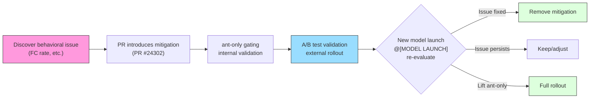

# Chapter 7: Model-Specific Tuning and A/B Testing

> Chapter 6은 System Prompt가 어떻게 모델에 전달되는 instruction 집합으로 조립되는지 탐구했다. 그러나 같은 prompt가 모든 모델에 맞는 것은 아니다 — 각 모델 세대는 고유한 행동 경향을 가지며, Anthropic 내부 사용자는 외부 사용자보다 먼저 새 모델을 테스트하고 검증해야 한다. 이 Chapter는 Claude Code가 `@[MODEL LAUNCH]` 주석 시스템, `USER_TYPE === 'ant'` gating, GrowthBook Feature Flag, Undercover 모드를 통해 모델별 prompt 튜닝, 내부 A/B testing, 안전한 public repository 기여를 어떻게 달성하는지 드러낸다.

## 7.1 Model Launch Checklist: `@[MODEL LAUNCH]` 주석

Claude Code의 코드베이스 곳곳에 특별한 주석 마커가 흩어져 있다.

```typescript
// @[MODEL LAUNCH]: Update the latest frontier model.
const FRONTIER_MODEL_NAME = 'Claude Opus 4.6'
```

**Source Reference:** `constants/prompts.ts:117-118`

이 `@[MODEL LAUNCH]` 주석들은 평범한 주석이 아니다. 이들은 **분산된 체크리스트(distributed checklist)**를 형성한다 — 새 모델이 출시 준비되면, 엔지니어는 단지 코드베이스에서 `@[MODEL LAUNCH]`를 글로벌 검색하여 업데이트해야 할 모든 위치를 찾는다. 이 설계는 release 프로세스 지식을 외부 문서에 의존하지 않고 코드 자체에 내장한다.

`prompts.ts`에서 `@[MODEL LAUNCH]`는 다음 핵심 업데이트 지점을 표시한다.

| Line | Content | Update Action |
|------|---------|---------------|
| 117 | `FRONTIER_MODEL_NAME` 상수 | 새 모델의 마켓 이름으로 업데이트 |
| 120 | `CLAUDE_4_5_OR_4_6_MODEL_IDS` 객체 | 각 tier의 모델 ID 업데이트 |
| 204 | Over-commenting mitigation directive | 새 모델이 여전히 이 mitigation이 필요한지 평가 |
| 210 | Thoroughness counterweight | ant-only gating 해제 여부 평가 |
| 224 | Assertiveness counterweight | ant-only gating 해제 여부 평가 |
| 237 | False claims mitigation directive | 새 모델의 FC rate 평가 |
| 712 | `getKnowledgeCutoff` 함수 | 새 모델의 knowledge cutoff 날짜 추가 |

`antModels.ts`에서는:

| Line | Content | Update Action |
|------|---------|---------------|
| 32 | `tengu_ant_model_override` | Feature Flag의 ant-only 모델 목록 업데이트 |
| 33 | `excluded-strings.txt` | 외부 빌드로 leak 방지를 위해 새 모델 codename 추가 |

이 패턴의 우아함은 그 **self-documenting** 특성에 있다: 주석 텍스트 자체가 작업 지침 역할을 한다. 예를 들어, line 204의 주석은 해제 조건을 명시적으로 기술한다: "remove or soften once the model stops over-commenting by default." 엔지니어는 외부 운영 매뉴얼을 참고할 필요가 없다 — 조건과 작업 모두 코드 옆에 작성되어 있다.

## 7.2 Capybara v8 Behavior Mitigation

각 모델 세대는 고유한 "personality flaws"를 가진다. Claude Code의 소스 코드는 Capybara v8(Claude 4.5/4.6 시리즈의 내부 codename 중 하나)의 네 가지 알려진 이슈와 각각에 대한 prompt 레벨 mitigation을 문서화한다.

### 7.2.1 Over-Commenting

**Problem:** Capybara v8은 코드에 과도한 불필요한 주석을 추가하는 경향이 있다.

**Mitigation (lines 204-209):**

```typescript
// @[MODEL LAUNCH]: Update comment writing for Capybara —
// remove or soften once the model stops over-commenting by default
...(process.env.USER_TYPE === 'ant'
  ? [
      `Default to writing no comments. Only add one when the WHY is
       non-obvious...`,
      `Don't explain WHAT the code does, since well-named identifiers
       already do that...`,
      `Don't remove existing comments unless you're removing the code
       they describe...`,
    ]
  : []),
```

**Source Reference:** `constants/prompts.ts:204-209`

이 directive들은 정제된 주석 철학을 형성한다: 기본적으로 주석을 작성하지 말라, "why"가 비자명할 때만 추가하라; 코드가 무엇을 하는지 설명하지 말라(식별자가 이미 그 역할을 한다); 이해하지 못하는 기존 주석을 제거하지 말라. 세 번째 directive의 미묘함에 주목하라 — 이는 모델의 over-commenting을 막으면서 가치 있는 기존 주석을 삭제하는 over-correction도 막는다.

### 7.2.2 False Claims

**Problem:** Capybara v8의 False Claims rate(FC rate)는 29~30%로, v4의 16.7%보다 상당히 높다.

**Mitigation (lines 237-241):**

```typescript
// @[MODEL LAUNCH]: False-claims mitigation for Capybara v8
// (29-30% FC rate vs v4's 16.7%)
...(process.env.USER_TYPE === 'ant'
  ? [
      `Report outcomes faithfully: if tests fail, say so with the
       relevant output; if you did not run a verification step, say
       that rather than implying it succeeded. Never claim "all tests
       pass" when output shows failures...`,
    ]
  : []),
```

**Source Reference:** `constants/prompts.ts:237-241`

이 mitigation directive의 설계는 대칭적 사고를 구현한다: 모델이 거짓 성공 보고를 하지 않도록 요구할 뿐만 아니라 과도한 self-doubt를 피할 것도 명시적으로 요구한다 — "when a check did pass or a task is complete, state it plainly -- do not hedge confirmed results with unnecessary disclaimers." 엔지니어들은 단순히 모델에게 "거짓말하지 말라"고 말하면 다른 극단으로 기울어, 모든 결과에 불필요한 disclaimer를 추가한다는 것을 발견했다. Mitigation의 목표는 **정확한 보고이지 방어적 보고가 아니다**.

### 7.2.3 Over-Assertiveness

**Problem:** Capybara v8은 자신의 판단을 제공하지 않고 사용자 지시를 단순히 실행하는 경향이 있다.

**Mitigation (lines 224-228):**

```typescript
// @[MODEL LAUNCH]: capy v8 assertiveness counterweight (PR #24302)
// — un-gate once validated on external via A/B
...(process.env.USER_TYPE === 'ant'
  ? [
      `If you notice the user's request is based on a misconception,
       or spot a bug adjacent to what they asked about, say so.
       You're a collaborator, not just an executor...`,
    ]
  : []),
```

**Source Reference:** `constants/prompts.ts:224-228`

주석의 "PR #24302"는 이 mitigation이 code review 프로세스를 통해 도입되었음을 의미하며, "un-gate once validated on external via A/B"는 완전한 release 전략을 드러낸다: 먼저 내부 사용자(ant)에서 검증한 후, 데이터를 수집하여 A/B testing을 통해 외부 사용자로 rollout한다.

### 7.2.4 Lack of Thoroughness

**Problem:** Capybara v8은 결과를 검증하지 않고 태스크 완료를 선언하는 경향이 있다.

**Mitigation (lines 210-211):**

```typescript
// @[MODEL LAUNCH]: capy v8 thoroughness counterweight (PR #24302)
// — un-gate once validated on external via A/B
`Before reporting a task complete, verify it actually works: run the
 test, execute the script, check the output. Minimum complexity means
 no gold-plating, not skipping the finish line.`,
```

**Source Reference:** `constants/prompts.ts:210-211`

이 directive의 마지막 문장은 특히 미묘하다: "If you can't verify (no test exists, can't run the code), say so explicitly rather than claiming success." 검증이 불가능한 상황이 있음을 인정하지만, 모든 것이 괜찮은 척 조용히 하는 대신 이를 명시적으로 인정할 것을 모델에게 요구한다.

### 7.2.5 Mitigation 라이프사이클 (Mitigation Lifecycle)

네 mitigation은 통일된 라이프사이클 패턴을 공유한다.



**Figure 7-1: 모델 mitigation의 완전한 라이프사이클.** 이슈 발견에서 mitigation 도입, 내부 검증과 A/B testing을 거쳐, 다음 `@[MODEL LAUNCH]`에서의 재평가까지.

## 7.3 `USER_TYPE === 'ant'` Gating: 내부 A/B Testing Staging Area

위의 네 mitigation은 모두 같은 조건으로 감싸져 있다.

```typescript
process.env.USER_TYPE === 'ant'
```

이 환경 변수는 runtime에 읽히지 않는다 — 이것은 **build-time 상수**다. 소스 코드 주석이 이 중요한 컴파일러 계약을 설명한다.

```
DCE: `process.env.USER_TYPE === 'ant'` is build-time --define.
It MUST be inlined at each callsite (not hoisted to a const) so the
bundler can constant-fold it to `false` in external builds and
eliminate the branch.
```

**Source Reference:** `constants/prompts.ts:617-619`

이 주석은 우아한 Dead Code Elimination(DCE) 메커니즘을 드러낸다.

1. **Build-time 교체**: 번들러의 `--define` 옵션이 컴파일 시 `process.env.USER_TYPE`을 문자열 리터럴로 교체한다.
2. **Constant folding**: 외부 빌드의 경우 `'external' === 'ant'`가 `false`로 folding된다.
3. **Branch 제거**: 조건이 `false`인 branch는 그 모든 문자열 콘텐츠를 포함하여 완전히 제거된다.
4. **Inline 요구사항**: 각 callsite가 `process.env.USER_TYPE === 'ant'`를 직접 작성해야 한다; 변수로 추출할 수 없다. 그렇지 않으면 번들러가 constant folding을 수행할 수 없다.

이는 **ant-only 코드가 외부 사용자 빌드 아티팩트에 물리적으로 존재하지 않음**을 의미한다. 이는 runtime permission check가 아니라 compile-time 코드 제거다. 외부 빌드를 디컴파일해도 Capybara 같은 내부 codename이나 mitigation의 구체적 표현을 드러내지 않을 것이다.

### 7.3.1 완전한 ant-only Gating Inventory

다음 표는 `USER_TYPE === 'ant'`로 gate된 `prompts.ts`의 모든 콘텐츠를 나열한다.

| Line Range | Feature Description | Gated Content | Lift Condition |
|-----------|---------------------|--------------|----------------|
| 136-139 | ant model override section | `getAntModelOverrideSection()` — System Prompt에 ant 전용 suffix 추가 | Feature Flag로 제어, 고정 조건 아님 |
| 205-209 | Over-commenting mitigation | 세 개의 주석 철학 directive | 새 모델이 기본적으로 over-comment하지 않음 |
| 210-211 | Thoroughness mitigation | 태스크 완료 검증 directive | A/B test 검증 후 외부 rollout |
| 225-228 | Assertiveness mitigation | Collaborator-not-executor directive | A/B test 검증 후 외부 rollout |
| 238-241 | False claims mitigation | 정확한 결과 보고 directive | 새 모델의 FC rate가 허용 수준으로 감소 |
| 243-246 | 내부 피드백 채널 | `/issue`와 `/share` 명령 권장, 내부 Slack 채널 전송 제안 | 내부 사용자 전용, 해제되지 않음 |
| 621 | Undercover 모델 설명 suppress | System Prompt에서 모델 이름과 ID suppress | Undercover 모드가 active할 때 |
| 660 | Undercover 간소화 모델 설명 suppress | 위와 동일, simplified prompt 버전 | Undercover 모드가 active할 때 |
| 694-702 | Undercover 모델 family 정보 suppress | 최신 모델 목록, Claude Code platform 정보, Fast mode 설명 suppress | Undercover 모드가 active할 때 |

**Table 7-1: `prompts.ts`의 완전한 ant-only gating inventory.** 각 gate는 명확한 해제 조건을 가지며, 내부 검증에서 외부 rollout까지의 점진적 release 파이프라인을 형성한다.

`getAntModelOverrideSection`(lines 136-139)은 특별한 주의를 받을 만하다.

```typescript
function getAntModelOverrideSection(): string | null {
  if (process.env.USER_TYPE !== 'ant') return null
  if (isUndercover()) return null
  return getAntModelOverrideConfig()?.defaultSystemPromptSuffix || null
}
```

이는 **이중 gating**을 가진다 — 사용자가 내부여야 할 뿐만 아니라 Undercover 모드에 있지도 않아야 한다. 이 설계는 내부 사용자조차 public repository에 기여할 때 내부 모델 설정을 leak하지 않도록 보장한다.

## 7.4 Undercover 모드: Public Repository에서의 Stealth (Undercover Mode: Stealth in Public Repositories)

Undercover 모드는 Claude Code의 가장 독특한 기능 중 하나다. 이는 매우 구체적인 문제를 해결한다: Anthropic 내부 엔지니어가 public/open-source repository에 기여할 때 Claude Code를 사용할 때, 내부 정보가 leak되어서는 안 된다.

### 7.4.1 활성화 로직 (Activation Logic)

```typescript
export function isUndercover(): boolean {
  if (process.env.USER_TYPE === 'ant') {
    if (isEnvTruthy(process.env.CLAUDE_CODE_UNDERCOVER)) return true
    return getRepoClassCached() !== 'internal'
  }
  return false
}
```

**Source Reference:** `utils/undercover.ts:28-37`

활성화 규칙은 세 가지 수준이 있다.

1. **강제 활성화**: `CLAUDE_CODE_UNDERCOVER=1` 환경 변수 설정은 내부 repository에서도 강제 활성화한다.
2. **자동 감지**: 현재 repository의 remote 주소가 내부 whitelist에 없으면 자동으로 활성화된다. `'external'`, `'none'`, `null`(check가 아직 실행되지 않음) 모두 "on"으로 resolve된다.
3. **강제 비활성화 불가**: 설계상 강제로 끄는 옵션이 없다. 소스 코드 주석이 설명한다: "This guards against model codename leaks — if we're not confident we're in an internal repo, we stay undercover."

이 "safe default is on" 설계 철학은 깊이 성찰할 가치가 있다 — public repository에서 leak의 위험을 감수하는 것보다 내부 repository에서 불필요하게 정보를 숨기는 것이 낫다.

### 7.4.2 Suppression 범위 (Suppression Scope)

Undercover 모드가 활성화되면 다음 suppression 작업이 실행된다.

```
┌─────────────────────────────────────────────────────────────────────┐
│                     Undercover Mode Workflow                         │
│                                                                     │
│  ┌─────────────────┐                                                │
│  │  isUndercover()  │──── false ────▶ Normal mode (show model info)  │
│  │    returns true  │                                                │
│  └────────┬────────┘                                                │
│           │ true                                                     │
│           ▼                                                          │
│  ┌─────────────────────────────────────────────────────────────────┐ │
│  │                    Suppression Layer 1: System Prompt            │ │
│  │                                                                 │ │
│  │  computeEnvInfo (L621):                                         │ │
│  │    modelDescription = ''  ← model name/ID fully cleared         │ │
│  │                                                                 │ │
│  │  computeSimpleEnvInfo (L660):                                   │ │
│  │    modelDescription = null  ← removed from env info             │ │
│  │                                                                 │ │
│  │  Model family list (L694-696):                                  │ │
│  │    null  ← Opus/Sonnet/Haiku ID list not shown                  │ │
│  │                                                                 │ │
│  │  Claude Code platform info (L697-699):                          │ │
│  │    null  ← CLI/desktop/Web/IDE info not shown                   │ │
│  │                                                                 │ │
│  │  Fast mode explanation (L700-702):                              │ │
│  │    null  ← explanation about using same model not shown         │ │
│  │                                                                 │ │
│  │  getAntModelOverrideSection (L138):                             │ │
│  │    return null  ← ant model override suffix not injected        │ │
│  └─────────────────────────────────────────────────────────────────┘ │
│           │                                                          │
│           ▼                                                          │
│  ┌─────────────────────────────────────────────────────────────────┐ │
│  │                    Suppression Layer 2: Attribution              │ │
│  │                                                                 │ │
│  │  getAttributionTexts():                                         │ │
│  │    return { commit: '', pr: '' }                                │ │
│  │    ← no Co-Authored-By line generated                           │ │
│  │    ← no AI tool attribution in PR descriptions                  │ │
│  └─────────────────────────────────────────────────────────────────┘ │
│           │                                                          │
│           ▼                                                          │
│  ┌─────────────────────────────────────────────────────────────────┐ │
│  │                    Suppression Layer 3: Behavioral Directives    │ │
│  │                                                                 │ │
│  │  getUndercoverInstructions():                                   │ │
│  │    Injects detailed anti-leak directives:                       │ │
│  │    - Prohibit internal model codenames (Capybara, Tengu, etc.)  │ │
│  │    - Prohibit unreleased model version numbers                  │ │
│  │    - Prohibit internal repo/project names                       │ │
│  │    - Prohibit internal tools, Slack channels, short links       │ │
│  │    - Prohibit "Claude Code" text or AI identity hints           │ │
│  │    - Prohibit Co-Authored-By attribution                        │ │
│  │    - Require commit messages written like a human developer     │ │
│  └─────────────────────────────────────────────────────────────────┘ │
└─────────────────────────────────────────────────────────────────────┘
```

**Figure 7-2: Undercover 모드의 3-layer suppression workflow.** System Prompt에서 attribution, 행동 directive까지, 완전한 정보 leak 방어를 형성한다.

소스 코드 주석(lines 612-615)이 suppression 범위가 왜 이렇게 넓은지 설명한다.

```
Undercover: keep ALL model names/IDs out of the system prompt so
nothing internal can leak into public commits/PRs. This includes the
public FRONTIER_MODEL_* constants — if those ever point at an
unannounced model, we don't want them in context. Go fully dark.
```

"Go fully dark" — public 상수(`FRONTIER_MODEL_NAME` 등)조차 suppress된다. 이 상수들이 아직 발표되지 않은 모델을 가리킬 수 있다면, 그 자체가 leak 소스가 되기 때문이다.

### 7.4.3 Undercover Instruction 예시 (Undercover Instruction Examples)

`getUndercoverInstructions()` 함수(`utils/undercover.ts:39-69`)는 상세한 anti-leak directive를 주입한다. 긍정과 부정 예시를 모두 사용하여 모델을 가르친다.

**Good commit messages:**
- "Fix race condition in file watcher initialization"
- "Add support for custom key bindings"

**Must never write:**
- "Fix bug found while testing with Claude Capybara"
- "1-shotted by claude-opus-4-6"
- "Generated with Claude Code"

이 병렬 긍정/부정 예시 교수 방식은 단순한 금지 목록보다 더 효과적이다 — 모델에게 "하지 말아야 할 것"을 알려줄 뿐만 아니라 "해야 할 것"도 보여준다.

### 7.4.4 자동 알림 메커니즘 (Auto-Notification Mechanism)

Undercover 모드가 처음 자동 활성화될 때, Claude Code는 일회성 설명 대화상자를 표시한다(`shouldShowUndercoverAutoNotice`, lines 80-88). Check 로직은 사용자가 반복적으로 방해받지 않도록 보장한다: 강제 활성화한 사용자(환경 변수로)는 알림을 보지 않고(그들은 이미 알고 있음), 이미 알림을 본 사용자는 다시 보지 않는다. 이 플래그는 전역 config의 `hasSeenUndercoverAutoNotice` 필드에 저장된다.

## 7.5 GrowthBook 통합: `tengu_*` Feature Flag 시스템

### 7.5.1 Architecture 개요

Claude Code는 GrowthBook을 Feature Flag와 실험 플랫폼으로 사용한다. 모든 Feature Flag는 `tengu_*` 명명 규칙을 따른다 — "tengu"는 Claude Code의 내부 codename이다.

GrowthBook client 초기화와 feature 값 검색은 신중히 설계된 multi-layer fallback 메커니즘을 따른다.

```
Priority (high to low):
  1. Environment variable override (CLAUDE_INTERNAL_FC_OVERRIDES) — ant-only
  2. Local config override (/config Gates panel)                  — ant-only
  3. In-memory remote evaluation values (remoteEvalFeatureValues)
  4. Disk cache (cachedGrowthBookFeatures)
  5. Default value (defaultValue parameter)
```

핵심 값 검색 함수는 `getFeatureValue_CACHED_MAY_BE_STALE`(`growthbook.ts:734-775`)이다. 이름이 명시하듯 이 함수가 반환하는 값은 **stale할 수 있다** — 메모리나 디스크 캐시에서 먼저 읽고, 네트워크 request를 대기하며 block하지 않는다. 이것은 의도적 설계 결정이다: 시작 critical path에서 stale하지만 이용 가능한 값이 네트워크를 기다리며 freeze된 UI보다 낫다.

```typescript
export function getFeatureValue_CACHED_MAY_BE_STALE<T>(
  feature: string,
  defaultValue: T,
): T {
  // 1. Environment variable override
  const overrides = getEnvOverrides()
  if (overrides && feature in overrides) return overrides[feature] as T
  // 2. Local config override
  const configOverrides = getConfigOverrides()
  if (configOverrides && feature in configOverrides)
    return configOverrides[feature] as T
  // 3. In-memory remote evaluation value
  if (remoteEvalFeatureValues.has(feature))
    return remoteEvalFeatureValues.get(feature) as T
  // 4. Disk cache
  const cached = getGlobalConfig().cachedGrowthBookFeatures?.[feature]
  return cached !== undefined ? (cached as T) : defaultValue
}
```

**Source Reference:** `services/analytics/growthbook.ts:734-775`

### 7.5.2 Remote Evaluation과 Local Cache 동기화

GrowthBook은 `remoteEval: true` 모드를 사용한다 — feature 값은 서버 측에서 pre-evaluate되며, client는 결과만 캐시하면 된다. `processRemoteEvalPayload` 함수(`growthbook.ts:327-394`)는 각 초기화와 주기적 refresh에서 실행되어, 서버가 반환한 pre-evaluated 값을 두 저장소에 기록한다.

1. **In-memory Map** (`remoteEvalFeatureValues`): 프로세스 라이프타임 동안 빠른 읽기를 위함.
2. **Disk cache** (`syncRemoteEvalToDisk`, lines 407-417): cross-process persistence를 위함.

Disk 캐시는 **merge가 아닌 full replacement** 전략을 사용한다 — 서버 측에서 삭제된 feature는 disk에서 제거된다. 이는 disk 캐시가 끊임없이 쌓이는 역사적 침전물이 아니라 항상 서버 상태의 완전한 snapshot임을 보장한다.

소스 코드 주석(lines 322-325)이 과거의 실패를 기록한다.

```
Without this running on refresh, remoteEvalFeatureValues freezes at
its init-time snapshot and getDynamicConfig_BLOCKS_ON_INIT returns
stale values for the entire process lifetime — which broke the
tengu_max_version_config kill switch for long-running sessions.
```

이 kill switch 실패는 왜 주기적 refresh가 critical한지를 보여준다 — 값이 초기화 시 한 번만 읽히면, 장시간 실행 세션은 긴급한 원격 설정 변경에 대응할 수 없다.

### 7.5.3 실험 Exposure 추적 (Experiment Exposure Tracking)

GrowthBook의 A/B testing 기능은 실험 exposure 추적에 의존한다. `logExposureForFeature` 함수(lines 296-314)는 feature 값이 접근될 때 exposure 이벤트를 기록하여, 이후 실험 분석에 사용된다. 핵심 설계:

- **Session 레벨 중복 제거**: `loggedExposures` Set은 각 feature가 세션당 최대 한 번만 기록되도록 보장하여, hot path(render 루프 등)에서의 빈번한 호출로 인한 중복 이벤트를 방지한다.
- **Deferred exposure**: Feature가 GrowthBook 초기화 완료 전에 접근되면, `pendingExposures` Set이 이 접근들을 저장하고, 초기화 완료 후 retroactive하게 기록한다.

### 7.5.4 알려진 `tengu_*` Feature Flag (Known `tengu_*` Feature Flags)

다음 `tengu_*` Feature Flag들이 코드베이스에서 식별될 수 있다.

| Flag Name | Purpose | Retrieval Method |
|-----------|---------|-----------------|
| `tengu_ant_model_override` | ant-only 모델 목록, default 모델, System Prompt suffix 설정 | `_CACHED_MAY_BE_STALE` |
| `tengu_1p_event_batch_config` | First-party 이벤트 배치 설정 | `onGrowthBookRefresh` |
| `tengu_event_sampling_config` | 이벤트 샘플링 설정 | `_CACHED_MAY_BE_STALE` |
| `tengu_log_datadog_events` | Datadog 이벤트 로깅 gate | `_CACHED_MAY_BE_STALE` |
| `tengu_max_version_config` | 최대 버전 kill switch | `_BLOCKS_ON_INIT` |
| `tengu_frond_boric` | Sink 마스터 스위치 (kill switch) | `_CACHED_MAY_BE_STALE` |
| `tengu_cobalt_frost` | Nova 3 음성 인식 gate | `_CACHED_MAY_BE_STALE` |

일부 Flag는 obfuscate된 이름을 사용한다는 점에 주목하라(예: `tengu_frond_boric`). 이는 보안 고려사항이다 — Flag 이름이 외부에 관찰되더라도 그 목적을 추론할 수 없다.

### 7.5.5 Environment Variable Override: Eval Harness 백도어 (The Eval Harness Backdoor)

`CLAUDE_INTERNAL_FC_OVERRIDES` 환경 변수(`growthbook.ts:161-192`)는 GrowthBook 서버에 연결 없이 Feature Flag 값을 override할 수 있게 한다. 이 메커니즘은 eval harness를 위해 특별히 설계되었다 — 자동화된 테스트는 결정론적 조건에서 실행되어야 하며 원격 서비스 상태에 의존할 수 없다.

```typescript
// Example: CLAUDE_INTERNAL_FC_OVERRIDES='{"my_feature": true}'
```

Override 우선순위가 가장 높고(disk 캐시와 remote evaluation 값 위), ant 빌드에서만 사용 가능하다. 이는 eval harness 결정성을 보장하면서 외부 사용자에게 영향을 주지 않는다.

## 7.6 `tengu_ant_model_override`: 모델 Hot-Switching

`tengu_ant_model_override`는 모든 `tengu_*` Flag 중 가장 복잡하다. GrowthBook 원격 설정을 통해 ant-only 모델의 완전한 목록을 설정하며, 새 버전 release 없이 runtime hot-switching을 지원한다.

### 7.6.1 설정 구조 (Configuration Structure)

```typescript
export type AntModelOverrideConfig = {
  defaultModel?: string               // Default model ID
  defaultModelEffortLevel?: EffortLevel // Default effort level
  defaultSystemPromptSuffix?: string   // Suffix appended to system prompt
  antModels?: AntModel[]              // Available model list
  switchCallout?: AntModelSwitchCalloutConfig // Switch callout configuration
}
```

**Source Reference:** `utils/model/antModels.ts:24-30`

각 `AntModel`은 alias(커맨드 라인 선택용), 모델 ID, display label, default effort level, context window 크기 등의 파라미터를 포함한다. `switchCallout`은 UI에서 사용자에게 모델 전환 제안을 표시할 수 있게 한다.

### 7.6.2 Resolution 흐름 (Resolution Flow)

`resolveAntModel`(`antModels.ts:51-64`)은 사용자 입력 모델 이름을 구체적 `AntModel` 설정으로 resolve한다.

```typescript
export function resolveAntModel(
  model: string | undefined,
): AntModel | undefined {
  if (process.env.USER_TYPE !== 'ant') return undefined
  if (model === undefined) return undefined
  const lower = model.toLowerCase()
  return getAntModels().find(
    m => m.alias === model || lower.includes(m.model.toLowerCase()),
  )
}
```

매칭 로직은 정확한 alias 매칭과 모델 ID 포함 매칭 둘 다 지원한다. 예를 들어, 사용자가 `--model capybara-fast`를 지정하면 alias 매칭이 해당 `AntModel`을 찾고, `--model claude-opus-4-6-capybara`를 지정하면 모델 ID 포함 매칭도 올바르게 resolve한다.

### 7.6.3 Cold Cache 시작 문제 (Cold Cache Startup Problem)

`main.tsx`의 주석(lines 2001-2014)은 까다로운 startup ordering 이슈를 문서화한다: ant 모델 alias는 `tengu_ant_model_override` Feature Flag를 통해 resolve되며, `_CACHED_MAY_BE_STALE`은 GrowthBook 초기화 완료 전에는 disk 캐시만 읽을 수 있다. Disk 캐시가 비어 있으면(cold cache), `resolveAntModel`이 `undefined`를 반환하여 모델 alias resolution이 실패한다.

해결책은 ant 사용자가 명시적 모델을 지정하고 disk 캐시가 비어 있음을 감지할 때 **GrowthBook 초기화 완료를 동기적으로 기다리는 것**이다.

```typescript
if ('external' === 'ant' && explicitModel && ...) {
  await initializeGrowthBook()
}
```

이것은 전체 코드베이스에서 GrowthBook 호출이 block하고 대기해야 하는 극히 드문 시나리오 중 하나다.

## 7.7 Knowledge Cutoff Date 매핑 (Knowledge Cutoff Date Mapping)

`getKnowledgeCutoff` 함수(`prompts.ts:712-730`)는 모델 ID에서 knowledge cutoff 날짜로의 매핑을 유지한다.

```typescript
function getKnowledgeCutoff(modelId: string): string | null {
  const canonical = getCanonicalName(modelId)
  if (canonical.includes('claude-sonnet-4-6'))      return 'August 2025'
  else if (canonical.includes('claude-opus-4-6'))    return 'May 2025'
  else if (canonical.includes('claude-opus-4-5'))    return 'May 2025'
  else if (canonical.includes('claude-haiku-4'))     return 'February 2025'
  else if (canonical.includes('claude-opus-4') ||
           canonical.includes('claude-sonnet-4'))    return 'January 2025'
  return null
}
```

**Source Reference:** `constants/prompts.ts:712-730`

이 함수는 정확한 매칭이 아닌 `includes`를 사용하여, 모델 ID suffix(날짜 태그 `-20251001` 등)에 robust하다. Cutoff 날짜는 System Prompt의 환경 정보 section(lines 635-638)에 주입되어, 모델에게 자신의 지식 경계를 알려준다.

```typescript
const knowledgeCutoffMessage = cutoff
  ? `\n\nAssistant knowledge cutoff is ${cutoff}.`
  : ''
```

Undercover 모드가 active할 때, 전체 환경 정보 section의 모델 관련 부분(knowledge cutoff 날짜 포함)이 suppress된다 — 하지만 knowledge cutoff 날짜 자체는 여전히 유지된다. 이는 내부 정보를 leak하지 않기 때문이다.

## 7.8 엔지니어링 통찰 (Engineering Insights)

### 3단계 점진적 Release Pipeline

Claude Code의 모델 튜닝은 명확한 3단계 release 파이프라인을 드러낸다.

1. **발견과 도입**: 모델 평가(예: 29~30% FC rate)를 통해 행동 이슈가 발견되고, PR을 통해 mitigation이 도입된다.
2. **내부 검증**: `USER_TYPE === 'ant'` gating을 통해 내부 사용자로 제한하고, 실제 사용 데이터를 수집한다.
3. **점진적 Rollout**: GrowthBook A/B testing을 통해 효과를 검증한 후, ant-only gating이 해제되고 모든 사용자에게 rollout된다.

### Runtime Check보다 Compile-Time 안전 (Compile-Time Safety Over Runtime Checks)

`USER_TYPE` build-time 교체 + Dead Code Elimination 메커니즘은 내부 코드가 외부 빌드에 **물리적으로 존재하지 않음**을 보장하며, 단지 "접근 불가능"한 것이 아니다. 이 compile-time 안전은 runtime permission check보다 강하다 — 코드가 없으면 공격 표면도 없다.

### Safe Default의 철학 (The Philosophy of Safe Defaults)

Undercover 모드의 "강제 비활성화 불가" 설계, `DANGEROUS_` 접두어의 API friction, "cold cache에서 block하고 대기"하는 startup 로직 모두 같은 철학을 구현한다: **보안과 편의성이 충돌할 때, 보안을 선택하라**. 이는 편집증이 아니다 — "내부 모델 정보 leak"과 "수백 밀리초 대기" 사이의 합리적 트레이드오프다.

### Control Plane으로서의 Feature Flag (Feature Flags as Control Plane)

`tengu_*` Feature Flag 시스템은 Claude Code를 단일 소프트웨어 제품에서 **원격 제어 가능한 플랫폼**으로 변환한다. GrowthBook을 통해 엔지니어는 새 버전 release 없이: default 모델을 전환하고, 이벤트 샘플링 비율을 조정하고, 실험적 feature를 enable/disable하며, 심지어 kill switch를 통해 문제 있는 feature를 긴급 중단할 수 있다. 이 "control plane / data plane 분리" 아키텍처는 SaaS 제품 성숙도의 표식이다.

## 7.9 사용자가 할 수 있는 것 (What Users Can Do)

이 Chapter의 모델별 튜닝과 A/B testing 시스템 분석을 바탕으로, 독자가 자신의 AI Agent 프로젝트에 적용할 수 있는 권장사항은 다음과 같다.

1. **코드에 분산 체크리스트를 내장하라.** 시스템이 모델 업그레이드 중 여러 위치를 업데이트해야 한다면(모델 이름, knowledge cutoff 날짜, 행동 mitigation 등), `@[MODEL LAUNCH]`-스타일 주석 마커를 채택하라. 업데이트 작업과 해제 조건을 주석 텍스트에 직접 작성하여, 외부 문서에 의존하는 대신 체크리스트가 코드와 공존하도록 하라.

2. **각 모델 세대에 대한 행동 mitigation 아카이브를 유지하라.** 새 모델의 행동 경향(예: over-commenting, false claims)을 발견했을 때, 코드 로직이 아닌 prompt 레벨 mitigation으로 수정하라. 각 mitigation의 도입 이유, FC rate 같은 정량화된 지표, 해제 조건을 문서화하라. 이 아카이브는 다음 모델 업그레이드에 귀중한 참조가 된다.

3. **내부 코드를 보호하기 위해 runtime check 대신 build-time 상수를 사용하라.** 제품이 내부와 외부 버전을 구분한다면, runtime `if` check에 의존해 내부 기능을 숨기지 말라. Claude Code의 `USER_TYPE` + bundler `--define` + Dead Code Elimination(DCE) 메커니즘을 참고하여 내부 코드가 외부 빌드에 물리적으로 존재하지 않도록 보장하라.

4. **Prompt 원격 제어를 위한 Feature Flag 시스템을 수립하라.** Prompt의 실험적 콘텐츠(새 행동 directive, 수치 anchor 등)를 하드코딩 대신 Feature Flag로 gate하라. 이를 통해 새 버전 release 없이 모델 행동을 조정하고, A/B test를 실행하며, 긴급 상황에서 kill switch로 변경을 rollback할 수 있다.

5. **편의가 아닌 안전을 기본으로 하라.** 보안과 편의 사이의 선택에서 Undercover 모드의 설계를 참고하라: 보안 모드는 기본 켜짐, 강제 비활성화 불가, miss보다 false-positive가 낫다. AI Agent의 경우 정보 leak의 비용은 가끔의 추가 제약 비용을 훨씬 초과한다.
