# Chapter 8: Tool Prompts as Micro-Harnesses

> Chapter 5는 System Prompt의 매크로 아키텍처 — section 등록, 캐시 계층화, 동적 조립 — 를 해부했다. 그러나 System Prompt는 "top-level 전략"에 불과하다. 각 Tool 호출의 micro 레벨에서는 병렬 harness 시스템이 작동한다: **tool prompt(tool description / tool prompt)**. 이들은 API request의 `tools` 배열의 `description` 필드로 주입되어, 모델이 각 Tool을 어떻게 사용하는지를 직접 형성한다. 이 Chapter는 Claude Code의 6개 핵심 Tool의 prompt 설계를 하나씩 해부하며, 그 안의 steering 전략과 재사용 가능한 패턴을 드러낸다.

## 8.1 Tool Prompt의 Harness 본질 (The Harness Nature of Tool Prompts)

Anthropic API에서 Tool의 `description` 필드는 "이 Tool이 무엇을 하는지 모델에게 알려주는" 것으로 포지셔닝된다. 그러나 Claude Code는 이 필드를 단순한 기능 설명에서 완전한 **행동 제약 프로토콜**로 확장한다. 각 Tool의 prompt는 사실상 micro-harness이며, 다음을 포함한다.

- **기능 설명 (Functional description)**: Tool이 무엇을 하는가
- **긍정 가이드 (Positive guidance)**: 어떻게 사용되어야 하는가
- **부정 금지 (Negative prohibitions)**: 어떻게 사용되어서는 안 되는가
- **조건 분기 (Conditional branches)**: 특정 시나리오에서 무엇을 할 것인가
- **형식 템플릿 (Format templates)**: 출력이 어떻게 보여야 하는가

이 설계 뒤의 핵심 통찰은: **각 Tool에 대한 모델의 행동 품질은 해당 Tool의 prompt 품질에 의해 직접 제약된다**는 것이다. System Prompt는 글로벌 persona를 설정하고, tool prompt는 로컬 행동을 형성한다. 이들이 함께 Claude Code의 "dual-layer harness architecture"를 형성한다.

기능 복잡도의 내림차순으로 6개 Tool을 분석해 보자.

---

## 8.2 BashTool: 가장 복잡한 Micro-Harness (BashTool: The Most Complex Micro-Harness)

BashTool은 Claude Code에서 prompt가 가장 길고 제약이 가장 밀집된 Tool이다. 그 prompt는 `getSimplePrompt()` 함수가 동적으로 생성하며, 수천 단어에 달할 수 있다.

**Source Location:** `tools/BashTool/prompt.ts:275-369`

### 8.2.1 Tool Preference Matrix: Specialized Tool로 트래픽 라우팅

Prompt의 첫 부분은 명시적 **tool preference matrix**를 수립한다.

```
IMPORTANT: Avoid using this tool to run find, grep, cat, head, tail,
sed, awk, or echo commands, unless explicitly instructed or after you
have verified that a dedicated tool cannot accomplish your task.
```

바로 이어 매핑 테이블이 따라온다(lines 281-291).

```typescript
const toolPreferenceItems = [
  `File search: Use ${GLOB_TOOL_NAME} (NOT find or ls)`,
  `Content search: Use ${GREP_TOOL_NAME} (NOT grep or rg)`,
  `Read files: Use ${FILE_READ_TOOL_NAME} (NOT cat/head/tail)`,
  `Edit files: Use ${FILE_EDIT_TOOL_NAME} (NOT sed/awk)`,
  `Write files: Use ${FILE_WRITE_TOOL_NAME} (NOT echo >/cat <<EOF)`,
  'Communication: Output text directly (NOT echo/printf)',
]
```

이 설계는 중요한 harness 패턴을 구현한다: **traffic steering**. Bash는 "universal tool"이다 — 이론상 모든 파일 읽기/쓰기, 검색, 편집 작업을 수행할 수 있다. 그러나 모델이 이 작업들을 Bash로 수행하게 하면 두 가지 문제가 발생한다.

1. **나쁜 사용자 경험**: Specialized tool(FileEditTool 등)은 구조화된 입력, 시각적 diff, permission check 등의 기능을 가진다; Bash 명령은 불투명한 문자열이다.
2. **Permission control 우회**: Specialized tool은 fine-grained permission 검증을 가진다; Bash 명령은 이런 check를 우회한다.

Lines 276-278의 조건 분기에 주목하라: 시스템이 embedded search tool(`hasEmbeddedSearchTools()`)을 감지하면 `find`와 `grep`은 금지 목록에서 제거된다. 이는 Anthropic 내부 빌드(ant-native builds)에 대한 적응이다. 내부 빌드는 `find`/`grep`을 embedded `bfs`/`ugrep`으로 alias하면서 standalone Glob/Grep tool을 제거한다.

**Reusable Pattern — "Universal Tool Demotion":** Tool set에 기능 커버리지가 극히 넓은 Tool이 있을 때, 그 prompt에 "어느 시나리오에 어느 대안 Tool을 사용해야 하는지" 명시적으로 나열하여 모델이 단일 Tool에 과도하게 의존하는 것을 막는다.

### 8.2.2 명령 실행 가이드라인: Timeout부터 Concurrency까지 (Command Execution Guidelines: From Timeouts to Concurrency)

Prompt의 두 번째 부분은 상세한 명령 실행 사양이다(lines 331-352). 다음을 다룬다.

- **디렉터리 검증**: "If your command will create new directories or files, first use this tool to run `ls` to verify the parent directory exists"
- **Path quoting**: "Always quote file paths that contain spaces with double quotes"
- **Working directory 유지**: "Try to maintain your current working directory throughout the session by using absolute paths"
- **Timeout 제어**: 기본 120,000ms(2분), 최대 600,000ms(10분)
- **Background 실행**: `run_in_background` 파라미터, 명시적 사용 조건과 함께

가장 정교한 것은 **multi-command concurrency guide**다(lines 297-303).

```typescript
const multipleCommandsSubitems = [
  `If the commands are independent and can run in parallel, make multiple
   ${BASH_TOOL_NAME} tool calls in a single message.`,
  `If the commands depend on each other and must run sequentially, use
   a single ${BASH_TOOL_NAME} call with '&&' to chain them together.`,
  "Use ';' only when you need to run commands sequentially but don't
   care if earlier commands fail.",
  'DO NOT use newlines to separate commands.',
]
```

이것은 단순한 "best practice advice"가 아니라 **concurrency decision tree**다: 독립 태스크는 parallel tool call 사용 -> 의존성은 `&&` 사용 -> 실패 허용은 `;` 사용 -> newline 금지. 각 규칙은 특정 failure mode에 대응한다.

### 8.2.3 Git Safety Protocol: Defense in Depth

Git 작업은 BashTool의 prompt에서 가장 중요한 보안 도메인이다. 완전한 Git Safety Protocol은 `getCommitAndPRInstructions()` 함수(lines 42-161)에 정의되며, 그 핵심 금지 목록(lines 88-95)은 **6-layer 방어**를 형성한다.

```
Git Safety Protocol:
- NEVER update the git config
- NEVER run destructive git commands (push --force, reset --hard,
  checkout ., restore ., clean -f, branch -D) unless the user
  explicitly requests these actions
- NEVER skip hooks (--no-verify, --no-gpg-sign, etc) unless the
  user explicitly requests it
- NEVER run force push to main/master, warn the user if they request it
- CRITICAL: Always create NEW commits rather than amending
- When staging files, prefer adding specific files by name rather
  than using "git add -A" or "git add ."
- NEVER commit changes unless the user explicitly asks you to
```

각 금지는 실제 데이터 손실 시나리오에 대응한다.

| Prohibition | Failure Scenario Defended Against |
|------------|----------------------------------|
| NEVER update git config | 모델이 사용자의 전역 Git 설정을 수정할 수 있음 |
| NEVER push --force | 원격 repository의 commit 히스토리 덮어쓰기 |
| NEVER skip hooks | 코드 품질 check, signature 검증 우회 |
| NEVER force push to main | 팀 공유 branch 파괴 |
| Always create NEW commits | Pre-commit hook 실패 후 amend는 이전 commit을 수정 |
| Prefer specific files | `git add .`는 .env, credential을 노출할 수 있음 |
| NEVER commit unless asked | Agent 과도한 자율성 방지 |

"CRITICAL" 마커는 가장 미묘한 시나리오를 위해 예약된다: pre-commit hook 실패 후의 `--amend` 함정. 이 규칙은 Git의 내부 메커니즘 이해를 필요로 한다 — hook 실패는 commit이 일어나지 않았음을 의미하며, 그 시점에서 `--amend`는 "현재 commit을 재시도"가 아니라 **이전에 존재하던 commit**을 수정한다.

Prompt에는 완전한 commit workflow 템플릿도 포함된다(lines 96-125). 번호 매겨진 단계로 어느 작업이 parallel로 실행될 수 있고 어느 작업이 sequential이어야 하는지 명시하며, HEREDOC 형식 commit 메시지 템플릿도 제공한다. 이는 **workflow scaffolding** 패턴이다 — 모델에게 "무엇을 할지"가 아니라 "어떤 순서로 할지"를 알려준다.

### 8.2.4 Inline JSON으로서의 Sandbox 설정 (Sandbox Configuration as Inline JSON)

Sandbox가 활성화되면, `getSimpleSandboxSection()` 함수(lines 172-273)는 완전한 sandbox 설정을 JSON으로 prompt에 인라인한다.

```typescript
const filesystemConfig = {
  read: {
    denyOnly: dedup(fsReadConfig.denyOnly),
    allowWithinDeny: dedup(fsReadConfig.allowWithinDeny),
  },
  write: {
    allowOnly: normalizeAllowOnly(fsWriteConfig.allowOnly),
    denyWithinAllow: dedup(fsWriteConfig.denyWithinAllow),
  },
}
```

**Source Reference:** `tools/BashTool/prompt.ts:195-203`

이는 깊이 성찰할 가치가 있는 설계 결정이다: **기계가 읽을 수 있는 보안 정책을 모델에 직접 노출**. 모델은 어느 경로에 접근 가능하고 어느 네트워크 host에 연결 가능한지 "이해"할 필요가 있어, 명령 생성 시 위반을 능동적으로 피할 수 있다. JSON 형식은 정밀성과 모호성 없음을 보장한다.

Lines 167-170의 `dedup` 함수와 lines 188-191의 `normalizeAllowOnly`에 주목하라: 전자는 중복 경로를 제거하고(`SandboxManager`가 multi-layer config를 merge할 때 deduplicate하지 않기 때문), 후자는 사용자별 임시 디렉터리 경로를 `$TMPDIR` placeholder로 교체한다. 이 두 최적화는 각각 ~150-200 token을 절약하고, cross-user prompt cache 일관성을 보장한다.

**Reusable Pattern — "Policy Transparency":** 보안 정책이 강제를 위해 모델의 협조를 필요로 할 때, 완전한 규칙 집합을 구조화된 형식(JSON/YAML)으로 prompt에 인라인하여 모델이 생성 중 자체 check를 할 수 있게 한다.

### 8.2.5 Sleep Anti-Pattern 억제 (Sleep Anti-Pattern Suppression)

Prompt는 `sleep` 남용을 억제하는 section을 할당한다(lines 310-327).

```typescript
const sleepSubitems = [
  'Do not sleep between commands that can run immediately — just run them.',
  'If your command is long running... use `run_in_background`.',
  'Do not retry failing commands in a sleep loop — diagnose the root cause.',
  'If waiting for a background task... do not poll.',
  'If you must sleep, keep the duration short (1-5 seconds)...',
]
```

이것은 전형적인 **anti-pattern suppression** 전략이다. LLM은 코드 생성 시나리오에서 비동기 대기를 처리하기 위해 `sleep` + polling을 사용하는 경향이 있다. 이것이 training data에서 가장 흔한 패턴이기 때문이다. Prompt는 대안을 하나씩 열거(background 실행, 이벤트 알림, 근본 원인 진단)하여 이 기본 행동을 "overwrite"한다.

---

## 8.3 FileEditTool: "Must Read Before Edit" 강제 (FileEditTool: The "Must Read Before Edit" Enforcement)

FileEditTool의 prompt는 BashTool의 것보다 훨씬 간결하지만, 모든 문장이 중요한 엔지니어링 제약을 지니고 있다.

**Source Location:** `tools/FileEditTool/prompt.ts:1-28`

### 8.3.1 Pre-Read 강제 (Pre-Read Enforcement)

Prompt의 첫 규칙(lines 4-6):

```typescript
function getPreReadInstruction(): string {
  return `You must use your \`${FILE_READ_TOOL_NAME}\` tool at least once
  in the conversation before editing. This tool will error if you
  attempt an edit without reading the file.`
}
```

이것은 "제안"이 아니라 **hard 제약**이다 — Tool의 runtime 구현이 대화 히스토리에서 해당 파일에 대한 Read 호출을 확인하고, 없으면 에러를 반환한다. Prompt의 설명은 모델에게 이 제약을 **미리 알려주어** 낭비되는 tool 호출을 피한다.

이 설계는 핵심 문제를 해결한다: **모델 hallucination**. 모델이 파일을 먼저 읽지 않고 편집을 시도하면, 파일 콘텐츠에 대한 가정이 완전히 틀릴 수 있다. 사전 읽기를 강제하면 편집 작업이 모델의 "기억"이나 "추측"이 아니라 실제 파일 상태에 기반하도록 보장한다.

**Reusable Pattern — "Precondition Enforcement":** Tool B의 정확성이 Tool A가 먼저 호출되는 것에 의존할 때, 이 의존성을 B의 prompt에 선언하고 B의 runtime에서 강제하라. 이중 보험 — prompt 레이어는 낭비된 호출을 방지하고, runtime 레이어는 잘못된 작업에 대한 백스톱이다.

### 8.3.2 최소 Unique old_string (Minimal Unique old_string)

`old_string` 파라미터에 대한 prompt의 요구사항(lines 20-27)은 미묘한 균형을 구현한다.

```
- The edit will FAIL if `old_string` is not unique in the file. Either
  provide a larger string with more surrounding context to make it unique
  or use `replace_all` to change every instance of `old_string`.
```

Anthropic 내부 사용자(`USER_TYPE === 'ant'`)를 위해 추가 최적화 힌트가 있다(lines 17-19).

```typescript
const minimalUniquenessHint =
  process.env.USER_TYPE === 'ant'
    ? `Use the smallest old_string that's clearly unique — usually 2-4
       adjacent lines is sufficient. Avoid including 10+ lines of context
       when less uniquely identifies the target.`
    : ''
```

이는 **token economics** 이슈를 드러낸다: FileEditTool을 사용할 때 모델은 교체할 원문을 `old_string` 파라미터에 제공해야 한다. 모델이 "uniqueness 보장"을 위해 큰 context 블록을 습관적으로 포함시키면, 각 편집 작업의 token 소비가 급증한다. "2-4 lines" 가이드는 모델이 uniqueness와 간결성 사이의 sweet spot을 찾도록 돕는다.

### 8.3.3 Indentation 보존과 Line Number Prefix (Indentation Preservation and Line Number Prefix)

Prompt에서 가장 쉽게 간과되지만 가장 중요한 기술적 디테일(lines 13-16, line 23):

```typescript
const prefixFormat = isCompactLinePrefixEnabled()
  ? 'line number + tab'
  : 'spaces + line number + arrow'

// In the description:
`When editing text from Read tool output, ensure you preserve the exact
indentation (tabs/spaces) as it appears AFTER the line number prefix.
The line number prefix format is: ${prefixFormat}. Everything after that
is the actual file content to match. Never include any part of the line
number prefix in the old_string or new_string.`
```

Read tool 출력은 line number prefix(예: `  42 → `)와 함께 온다. 모델은 편집 중 **이 prefix를 제거**하고 실제 파일 콘텐츠만 `old_string`으로 추출해야 한다. 이는 Read tool과 Edit tool 사이의 **interface contract**다 — prompt가 "interface 문서" 역할을 한다.

**Reusable Pattern — "Inter-Tool Interface Declaration":** 두 Tool의 output/input이 형식 변환 관계를 가질 때, 상류 Tool의 출력 형식을 하류 Tool의 prompt에 명시적으로 기술하여 모델의 형식 변환 에러를 방지하라.

---

## 8.4 FileReadTool: Resource-Aware 읽기 전략 (FileReadTool: Resource-Aware Reading Strategy)

FileReadTool의 prompt는 단순해 보이지만 신중히 설계된 리소스 관리 전략을 포함한다.

**Source Location:** `tools/FileReadTool/prompt.ts:1-49`

### 8.4.1 2000-Line Default Limit

```typescript
export const MAX_LINES_TO_READ = 2000

// In the prompt template:
`By default, it reads up to ${MAX_LINES_TO_READ} lines starting from
the beginning of the file`
```

**Source Reference:** `tools/FileReadTool/prompt.ts:10,37`

2000 lines는 신중하게 균형 잡힌 숫자다. Anthropic 모델은 200K token context window를 가지지만, context가 클수록 attention이 분산되고 reasoning 비용이 높아진다. 2000 lines는 대략 8000~16000 token(코드 밀도에 따라)에 해당하며, context window의 4~8%를 차지한다. 이 budget은 단일 파일 시나리오의 대부분을 커버하면서 multi-file 작업을 위한 여지를 남긴다.

### 8.4.2 offset/limit을 위한 점진적 가이드 (Progressive Guidance for offset/limit)

Prompt는 offset/limit 파라미터에 대해 두 표현 모드를 제공한다(lines 17-21).

```typescript
export const OFFSET_INSTRUCTION_DEFAULT =
  "You can optionally specify a line offset and limit (especially handy
   for long files), but it's recommended to read the whole file by not
   providing these parameters"

export const OFFSET_INSTRUCTION_TARGETED =
  'When you already know which part of the file you need, only read
   that part. This can be important for larger files.'
```

두 모드는 서로 다른 사용 단계를 서비스한다.

- **DEFAULT mode**는 full reading을 장려한다 — 모델이 처음 파일을 만나 글로벌 이해가 필요할 때 적합.
- **TARGETED mode**는 정밀 reading을 장려한다 — 모델이 이미 대상 위치를 알 때 token budget을 절약하는 데 적합.

어느 모드가 사용되는지는 runtime context에 따른다(`FileReadTool` 호출자가 결정). 그러나 prompt는 두 가지 "guidance tone"을 미리 정의하여, 모델이 서로 다른 시나리오에서 서로 다른 읽기 행동을 보이도록 한다.

### 8.4.3 Multimedia 기능 선언 (Multimedia Capability Declarations)

Prompt는 선언문 시리즈를 사용해 Read tool의 기능 경계를 확장한다(lines 40-48).

```
- This tool allows Claude Code to read images (eg PNG, JPG, etc).
  When reading an image file the contents are presented visually
  as Claude Code is a multimodal LLM.
- This tool can read PDF files (.pdf). For large PDFs (more than 10
  pages), you MUST provide the pages parameter to read specific page
  ranges. Maximum 20 pages per request.
- This tool can read Jupyter notebooks (.ipynb files) and returns all
  cells with their outputs.
```

PDF pagination 제한("more than 10 pages...MUST provide the pages parameter")은 **progressive resource limit**이다: 작은 파일은 직접 읽고, 큰 파일은 강제 pagination을 요구한다. 이것은 "모든 파일은 pagination되어야 함"과 "pagination 제한 없음" 둘 다보다 합리적이다 — 전자는 불필요한 tool call round를 추가하고, 후자는 한 번에 너무 많은 콘텐츠를 주입할 수 있다.

PDF 지원은 조건부라는 점에 주목하라(line 41): `isPDFSupported()`는 runtime 환경이 PDF 파싱을 지원하는지 확인한다. 지원하지 않을 때 전체 PDF 설명 section은 prompt에서 사라진다. 이는 "prompt가 runtime이 제공할 수 없는 기능을 약속"하는 흔한 함정을 피한다.

**Reusable Pattern — "Capability Declaration Aligned with Runtime":** Tool prompt의 기능 설명은 runtime 기능에 의해 동적으로 결정되어야 한다. 특정 환경에서 기능이 사용 불가능하다면 prompt에 언급하지 말라 — 그러면 모델이 존재하지 않는 기능을 반복 시도하여 혼란과 낭비를 일으킬 것이다.

---

## 8.5 GrepTool: "Always Use Grep, Never bash grep"

GrepTool의 prompt는 극도로 증류되었지만, 모든 라인이 hard 제약이다.

**Source Location:** `tools/GrepTool/prompt.ts:1-18`

### 8.5.1 Exclusivity 선언 (Exclusivity Declaration)

Prompt의 첫 사용 규칙(line 10):

```
ALWAYS use Grep for search tasks. NEVER invoke `grep` or `rg` as a
Bash command. The Grep tool has been optimized for correct permissions
and access.
```

이것은 BashTool의 tool preference matrix와 **양방향 coordination**으로 작동하는 설계다: BashTool은 "검색에 bash 사용 금지"라고 말하고, GrepTool은 "검색은 반드시 나를 사용해야 한다"고 말한다. 양쪽에서의 제약이 closed loop을 형성하여 모델이 "잘못된 경로를 택할" 확률을 최대한 줄인다.

"has been optimized for correct permissions and access"는 단순히 금지를 발하는 대신 이유를 제공한다. 이유가 중요하다 — GrepTool의 기반 호출은 같은 `ripgrep`이지만, permission check(`checkReadPermissionForTool`, `GrepTool.ts:233-239`), ignore 패턴 적용(`getFileReadIgnorePatterns`, `GrepTool.ts:413-427`), version control 디렉터리 제외(`VCS_DIRECTORIES_TO_EXCLUDE`, `GrepTool.ts:95-102`)를 감싼다. Bash로 `rg`를 직접 호출하면 이 안전 레이어들을 우회한다.

### 8.5.2 ripgrep Syntax 힌트 (ripgrep Syntax Hints)

Prompt는 세 가지 핵심 syntax 차이 노트를 제공한다(lines 11-16).

```
- Supports full regex syntax (e.g., "log.*Error", "function\s+\w+")
- Pattern syntax: Uses ripgrep (not grep) - literal braces need
  escaping (use `interface\{\}` to find `interface{}` in Go code)
- Multiline matching: By default patterns match within single lines only.
  For cross-line patterns like `struct \{[\s\S]*?field`, use
  `multiline: true`
```

첫 번째는 syntax family(ripgrep의 Rust regex)를 명확히 하고, 두 번째는 가장 흔한 함정(braces escape 필요 — GNU grep과 다름)을 제공하며, 세 번째는 multiline 파라미터의 사용 사례를 설명한다.

코드 구현을 보면 `multiline: true`는 ripgrep 파라미터 `-U --multiline-dotall`(`GrepTool.ts:341-343`)에 해당한다. Prompt는 기반 파라미터 디테일을 노출하는 대신 "use case + example"로 이 기능을 설명하기로 선택한다 — 모델은 `-U`가 무엇인지 알 필요가 없고, 언제 `multiline: true`를 설정할지만 알면 된다.

### 8.5.3 Output Mode와 head_limit (Output Modes and head_limit)

GrepTool의 input schema(`GrepTool.ts:33-89`)는 풍부한 파라미터를 정의하지만, prompt는 세 가지 output mode만 간단히 언급한다.

```
Output modes: "content" shows matching lines, "files_with_matches"
shows only file paths (default), "count" shows match counts
```

`head_limit` 파라미터 설계(`GrepTool.ts:81,107`)는 특별한 주의를 받을 만하다.

```typescript
const DEFAULT_HEAD_LIMIT = 250

// In schema description:
'Defaults to 250 when unspecified. Pass 0 for unlimited
(use sparingly — large result sets waste context).'
```

기본 250-result cap은 **context 보호 메커니즘**이다 — 주석이 설명하듯(lines 104-108), 무제한 content-mode 검색은 20KB tool 결과 persistence 임계값을 채울 수 있다. "use sparingly" 표현은 모델에게 부드러운 경고를 주며, `0`을 "unlimited" escape hatch로 하여 유연성을 보존한다.

**Reusable Pattern — "Safe Default + Escape Hatch":** 큰 출력을 생성할 수 있는 Tool의 경우, 보수적인 default 제한을 설정하되 제한을 해제하는 명시적 방법을 제공하라. Prompt에 그들의 존재와 적용 시나리오 둘 다 설명하라.

---

## 8.6 AgentTool: 동적 Agent 목록과 Fork 가이드 (AgentTool: Dynamic Agent List and Fork Guidance)

AgentTool은 6개 Tool 중 가장 복잡한 prompt 생성 로직을 가진다. Runtime 상태(사용 가능한 agent 정의, fork 활성화 여부, coordinator 모드, 구독 타입)에 따라 콘텐츠를 동적으로 구성해야 하기 때문이다.

**Source Location:** `tools/AgentTool/prompt.ts:1-287`

### 8.6.1 Inline vs. Attachment: Agent 목록의 두 주입 방법 (Inline vs. Attachment: Two Injection Methods for Agent Lists)

Prompt의 agent 목록은 두 방법으로 주입될 수 있다(lines 58-64, lines 196-199).

```typescript
export function shouldInjectAgentListInMessages(): boolean {
  if (isEnvTruthy(process.env.CLAUDE_CODE_AGENT_LIST_IN_MESSAGES)) return true
  if (isEnvDefinedFalsy(process.env.CLAUDE_CODE_AGENT_LIST_IN_MESSAGES))
    return false
  return getFeatureValue_CACHED_MAY_BE_STALE('tengu_agent_list_attach', false)
}
```

**Method 1 (inline):** Agent 목록이 tool description에 직접 내장된다.

```typescript
`Available agent types and the tools they have access to:
${effectiveAgents.map(agent => formatAgentLine(agent)).join('\n')}`
```

**Method 2 (attachment):** Tool description은 "Available agent types are listed in `<system-reminder>` messages in the conversation"라는 정적 텍스트만 포함하며, 실제 목록은 별도의 `agent_listing_delta` attachment message로 주입된다.

소스 코드 주석(lines 50-57)이 동기를 설명한다: **동적 agent 목록이 글로벌 `cache_creation` token의 약 10.2%를 차지한다**. MCP 서버가 비동기적으로 연결되거나, plugin이 reload되거나, permission 모드가 변할 때마다 agent 목록이 변하여, 목록을 포함하는 tool schema가 전체 무효화되고 값비싼 캐시 재구축을 트리거한다. 목록을 attachment message로 옮기면 tool description이 정적 텍스트가 되어 tool schema 레이어의 prompt cache를 보호한다.

각 agent의 설명 형식(lines 43-46):

```typescript
export function formatAgentLine(agent: AgentDefinition): string {
  const toolsDescription = getToolsDescription(agent)
  return `- ${agent.agentType}: ${agent.whenToUse} (Tools: ${toolsDescription})`
}
```

`getToolsDescription` 함수(lines 15-37)는 tool whitelist와 blacklist의 cross-filtering을 처리하여 궁극적으로 "All tools except Bash, Agent"나 "Read, Grep, Glob" 같은 설명을 생성한다. 이는 모델에게 각 agent 타입이 **어떤 tool을 사용할 수 있는지** 알려주어, 합리적인 delegation 결정이 가능하게 한다.

**Reusable Pattern — "Externalize Dynamic Content":** Tool prompt의 자주 변하는 부분이 큰 캐시 영향을 가질 때, 이를 tool `description`에서 message stream(attachment, system-reminder 등)으로 옮겨 tool description을 안정적으로 유지하라.

### 8.6.2 Fork Sub-Agent: Context 상속을 가진 Lightweight Delegation (Fork Sub-Agent: Lightweight Delegation with Context Inheritance)

`isForkSubagentEnabled()`가 true일 때, prompt는 "When to fork" section을 추가한다(lines 81-96). 모델이 두 delegation 모드 중 선택하도록 안내한다.

1. **Fork (`subagent_type` 생략)**: Parent agent의 완전한 대화 context를 상속, research와 implementation 태스크에 적합.
2. **Fresh agent (`subagent_type` 지정)**: 처음부터 시작, 완전한 context 전달 필요.

Fork 사용 가이드는 세 가지 핵심 규율을 포함한다.

```
Don't peek. The tool result includes an output_file path — do not
Read or tail it unless the user explicitly asks for a progress check.

Don't race. After launching, you know nothing about what the fork found.
Never fabricate or predict fork results in any format.

Writing a fork prompt. Since the fork inherits your context, the prompt
is a directive — what to do, not what the situation is.
```

"Don't peek"은 parent agent가 fork의 중간 출력을 읽는 것을 방지한다. 그러면 fork의 tool noise가 parent agent의 context로 끌려 들어와 forking의 목적을 무너뜨린다. "Don't race"는 parent agent가 결과가 반환되기 전에 fork의 결론을 "추측"하는 것을 방지한다 — 알려진 LLM 경향이다.

### 8.6.3 Prompt Writing Guide: Shallow Delegation 방지 (Prompt Writing Guide: Preventing Shallow Delegation)

Prompt에서 가장 독특한 부분은 "good agent prompt를 쓰는 방법"에 관한 section이다(lines 99-113).

```
Brief the agent like a smart colleague who just walked into the room —
it hasn't seen this conversation, doesn't know what you've tried,
doesn't understand why this task matters.

...

**Never delegate understanding.** Don't write "based on your findings,
fix the bug" or "based on the research, implement it." Those phrases
push synthesis onto the agent instead of doing it yourself.
```

"Never delegate understanding"은 심오한 메타인지적 제약이다. 이는 모델이 **synthesis와 판단이 필요한 thinking 작업**을 sub-agent에게 던지는 것을 방지한다 — sub-agent는 executor여야지 decision-maker가 아니다. 이 규칙은 "understanding"을 parent agent에 anchor하여, 지식이 delegation chain에서 손실되지 않도록 보장한다.

**Reusable Pattern — "Delegation Quality Assurance":** Tool이 태스크를 subsystem에 전달하는 것을 포함할 때, 태스크 설명의 완전성과 구체성을 prompt에서 제약하여 모델이 모호하고 불완전한 delegation instruction을 생성하는 것을 막는다.

---

## 8.7 SkillTool: Budget 제약과 3-Level Truncation (SkillTool: Budget Constraints and Three-Level Truncation)

SkillTool의 독특한 특성은 모델의 **행동**을 harness할 뿐만 아니라 자신의 prompt의 **볼륨**도 관리한다는 점이다.

**Source Location:** `tools/SkillTool/prompt.ts:1-242`

### 8.7.1 1% Context Window Budget

```typescript
export const SKILL_BUDGET_CONTEXT_PERCENT = 0.01
export const CHARS_PER_TOKEN = 4
export const DEFAULT_CHAR_BUDGET = 8_000 // Fallback: 1% of 200k * 4
```

**Source Reference:** `tools/SkillTool/prompt.ts:21-23`

Skill 목록의 총 character budget은 context window의 1%로 hard 제한된다. 200K token context window의 경우, 이는 200K * 4 chars/token * 1% = 8000 character다. 이 budget 제약은 skill discovery 기능이 모델의 작업 context를 잠식하지 않도록 보장한다 — skill 목록은 "directory"이지 "content"가 아니다. 모델은 skill을 호출할지 결정하기에 충분한 정보만 보면 되며, 실제 skill 콘텐츠는 호출 시 로드된다.

### 8.7.2 3-Level Truncation 전략 (Three-Level Truncation Strategy)

`formatCommandsWithinBudget` 함수(lines 70-171)는 점진적 truncation 전략을 구현한다.

**Level 1: Full retention.** 모든 skill의 완전한 설명이 budget에 맞으면 모든 것을 유지한다.

```typescript
if (fullTotal <= budget) {
  return fullEntries.map(e => e.full).join('\n')
}
```

**Level 2: Description trimming.** Budget을 초과하면 non-bundled skill 설명을 평균 가용 길이로 trim한다. Bundled skill은 항상 완전한 설명을 유지한다.

```typescript
const maxDescLen = Math.floor(availableForDescs / restCommands.length)
// ...
return `- ${cmd.name}: ${truncate(description, maxDescLen)}`
```

**Level 3: Name only.** Post-trim 평균 설명 길이가 20 character(`MIN_DESC_LENGTH`) 미만이면, non-bundled skill은 이름만 표시하도록 degrade된다.

```typescript
if (maxDescLen < MIN_DESC_LENGTH) {
  return commands
    .map((cmd, i) =>
      bundledIndices.has(i) ? fullEntries[i]!.full : `- ${cmd.name}`,
    )
    .join('\n')
}
```

이 3-level 전략의 우선순위 순서는: **bundled skill > non-bundled skill 설명 > non-bundled skill 이름**. Bundled skill은 Claude Code의 핵심 기능으로 결코 truncate되지 않는다. 서드파티 plugin skill은 필요에 따라 degrade되어, skill 생태계 규모에 관계없이 token 비용이 제어된다.

### 8.7.3 Single-Entry Hard Cap

총 budget을 넘어, 각 skill entry도 독립적인 hard cap을 가진다(line 29).

```typescript
export const MAX_LISTING_DESC_CHARS = 250
```

`getCommandDescription` 함수(lines 43-49)는 총 budget truncation 전에 각 entry를 250 character로 pre-truncate한다.

```typescript
function getCommandDescription(cmd: Command): string {
  const desc = cmd.whenToUse
    ? `${cmd.description} - ${cmd.whenToUse}`
    : cmd.description
  return desc.length > MAX_LISTING_DESC_CHARS
    ? desc.slice(0, MAX_LISTING_DESC_CHARS - 1) + '\u2026'
    : desc
}
```

주석이 근거를 설명한다: skill 목록은 **discovery** 목적이지 **usage** 목적이 아니다. 장황한 `whenToUse` 문자열은 skill 매칭률을 개선하지 않고 turn-1 `cache_creation` token을 낭비한다.

### 8.7.4 Invocation Protocol

SkillTool의 핵심 prompt(lines 173-196)는 비교적 짧지만 하나의 critical **blocking requirement**를 포함한다.

```
When a skill matches the user's request, this is a BLOCKING REQUIREMENT:
invoke the relevant Skill tool BEFORE generating any other response
about the task
```

"BLOCKING REQUIREMENT"는 Claude Code의 prompt 시스템에서 가장 강한 제약 표현 중 하나다. 이는 모델이 매칭되는 skill을 식별하자마자 **즉시 Skill tool을 호출**하고, 텍스트 응답을 먼저 생성하지 말 것을 요구한다. 이는 흔한 anti-pattern을 방지한다: 모델이 먼저 분석 텍스트를 출력하고 그다음 skill을 호출하는 것 — 이 텍스트는 종종 skill 이후에 로드되는 실제 instruction과 충돌한다.

또 다른 방어 규칙(line 194):

```typescript
`If you see a <${COMMAND_NAME_TAG}> tag in the current conversation turn,
the skill has ALREADY been loaded - follow the instructions directly
instead of calling this tool again`
```

이는 **중복 로딩**을 방지한다: Skill이 이미 `<command-name>` 태그를 통해 현재 turn에 주입되었다면, 모델은 SkillTool을 다시 호출하지 말고 skill instruction을 직접 실행해야 한다.

**Reusable Pattern — "Budget-Aware Directory Generation":** Tool이 동적으로 성장하는 목록(plugin, skill, API endpoint 등)을 모델에 제시해야 할 때, 목록에 고정 token budget을 할당하고 multi-level degradation 전략을 구현하라. 고가치 entry의 완전성을 우선 보존하고, 우선순위가 낮은 entry는 점진적으로 degrade한다.

---

## 8.8 6-Tool 비교 요약 (Six-Tool Comparative Summary)

다음 표는 6개 Tool의 prompt 설계를 5개 차원에 걸쳐 비교한다.

| Dimension | BashTool | FileEditTool | FileReadTool | GrepTool | AgentTool | SkillTool |
|-----------|----------|-------------|-------------|----------|-----------|-----------|
| **Prompt 길이** | 매우 김 (수천 단어, Git protocol 포함) | 짧음 (~30줄) | 중간 (~50줄) | 매우 짧음 (~18줄) | 김 (~280줄, 예시 포함) | 중간 (~200줄, truncation 로직 포함) |
| **생성 방법** | 동적 조립 (sandbox config, Git directive, embedded tool 감지) | Semi-dynamic (line prefix 형식, user type 조건) | Semi-dynamic (PDF 지원 조건, offset mode 전환) | 정적 템플릿 | 고도로 동적 (agent 목록, fork toggle, coordinator 모드, 구독 타입) | 동적 budget trimming (3-level truncation) |
| **핵심 steering 전략** | Traffic routing + safety protocol + workflow scaffolding | Precondition enforcement + interface contract | Resource-aware 점진적 제한 | Exclusivity 선언 + syntax 보정 | Delegation quality assurance + 캐시 보호 | Budget 제약 + 우선순위 degradation |
| **안전 메커니즘** | Git 6-layer 방어, sandbox JSON 인라인, anti-pattern suppression | Must-read-before-edit (runtime 강제) | Line 제한, PDF pagination 제한 | Permission check, VCS 디렉터리 제외, 결과 cap | Fork 규율 (Don't peek/race), delegation 품질 | BLOCKING REQUIREMENT, 중복 로딩 방지 |
| **재사용 가능한 패턴** | Universal tool demotion, policy transparency | Precondition enforcement, inter-tool interface declaration | Capability declaration aligned with runtime | Safe default + escape hatch | Externalize dynamic content, delegation quality assurance | Budget-aware directory generation |

```mermaid
block-beta
    columns 2
    block:behavior["Behavioral Constraint"]:1
        BT1["BashTool ← Safety Protocol"]
        ET1["EditTool ← Preconditions"]
        GT1["GrepTool ← Exclusivity"]
    end
    block:resource["Resource Management"]:1
        SK1["SkillTool ← Budget Truncation"]
        RT1["ReadTool ← Line/Page Limits"]
        GT2["GrepTool ← head_limit"]
    end
    block:collab["Collaboration Orchestration"]:1
        AT1["AgentTool ← Delegation Guide"]
        BT2["BashTool ← Concurrency Tree"]
        ET2["EditTool ← Interface Contract"]
    end
    block:cache["Cache Optimization"]:1
        AT2["AgentTool ← List Externalization"]
        BT3["BashTool ← $TMPDIR Normalization"]
        SK2["SkillTool ← Description Trimming"]
    end
```



**Figure 8-1: Tool prompt steering 패턴의 4-quadrant 분포.** 각 Tool은 일반적으로 여러 quadrant에 걸쳐 있다 — BashTool은 행동 제약, 협업 오케스트레이션, 캐시 최적화 특성을 동시에 보이며, GrepTool은 행동 제약과 리소스 관리를 결합한다.

## 8.9 Tool Prompt 설계를 위한 7개 원칙 (Seven Principles for Designing Tool Prompts)

6개 Tool의 분석에서 일반적인 tool prompt 설계 원칙 집합을 추출할 수 있다.

1. **양방향 closed loop (Bidirectional closed loop)**: Tool A가 특정 유형의 태스크를 처리해서는 안 될 때, A에서 "X를 하지 말고 B를 사용하라"를 말하고, B에서 "X를 하려면 반드시 나를 사용해야 한다"를 동시에 말하라. 단방향 제약은 loophole을 남긴다.

2. **금지 앞의 이유 (Reasons before prohibitions)**: 모든 "NEVER" 뒤에 "because"를 따르게 하라. 모델은 이유를 이해할 때 제약을 위반할 가능성이 낮다. GrepTool의 "has been optimized for correct permissions"는 맨 "NEVER use bash grep"보다 효과적이다.

3. **Runtime에 정렬된 기능 (Capabilities aligned with runtime)**: Prompt에 선언된 기능은 runtime이 보장해야 한다. FileReadTool의 PDF 지원은 `isPDFSupported()`에 기반해 조건부로 주입되지, 무조건적으로 선언되지 않는다.

4. **Safe default + escape hatch**: 큰 출력이나 side effect를 생성할 수 있는 모든 파라미터에 보수적 default를 설정하고, 명시적으로 해제하는 방법을 제공하라. GrepTool의 `head_limit=250`/`0`은 교과서적 사례다.

5. **Budget 인식 (Budget awareness)**: Tool prompt 자체가 token을 소비한다. SkillTool의 1% budget 제약과 3-level truncation은 극단적이지만 올바르다. BashTool의 `$TMPDIR` normalization과 `dedup`은 더 미묘한 최적화다.

6. **Precondition 선언 (Precondition declarations)**: 올바른 tool 사용이 특정 선행조건(파일 먼저 읽기, 디렉터리 먼저 check)에 의존한다면, prompt에 선언하고 runtime에서 강제하라. 이중 보험이 단일 레이어 방어보다 낫다.

7. **Delegation 품질 표준 (Delegation quality standards)**: Tool이 태스크를 subsystem에 전달하는 것을 포함할 때, 태스크 설명의 완전성과 구체성을 제약하라. AgentTool의 "Never delegate understanding"은 지식이 delegation chain에서 손실되는 것을 막는다.

---

## 8.10 사용자가 할 수 있는 것 (What Users Can Do)

이 Chapter의 6개 tool prompt 분석을 바탕으로, 독자가 자신의 tool prompt를 설계할 때 직접 적용할 수 있는 권장사항은 다음과 같다.

1. **"Universal tool"을 위한 traffic routing table을 구축하라.** Tool set에 극히 넓은 기능 커버리지를 가진 Tool(Bash, generic API caller 등)이 있다면, 그 description의 맨 앞에 "시나리오 -> specialized tool" 매핑 테이블을 배치하라. 동시에 각 specialized tool에서 exclusivity를 선언하라. 이 양방향 closed loop가 모델이 단일 Tool에 과도하게 의존하는 것을 방지하는 가장 효과적인 수단이다.

2. **Tool 간 precondition을 강제하라.** Tool B의 정확성이 Tool A가 먼저 호출되는 것에 의존할 때("must read before edit" 같은), 이 의존성을 B의 prompt에 선언하고 B의 runtime에서 코드로 강제하라. Prompt 레이어는 낭비된 호출을 방지하고, runtime 레이어는 잘못된 작업에 대한 백스톱이다 — 이중 방어가 단일 레이어보다 낫다.

3. **보안 정책을 JSON으로 prompt에 인라인하라.** 모델이 자신의 permission 경계(접근 가능 경로, 연결 가능 host 등)를 "이해"할 필요가 있다면, 완전한 정책 규칙 집합을 구조화된 형식으로 prompt에 주입하라. 이는 runtime 거부 후 재시도에 의존하는 대신 모델이 생성 중 자체 check를 할 수 있게 한다.

4. **High-output tool에 보수적 default를 설정하라.** 큰 출력(검색 결과 수, 파일 라인 수, PDF 페이지 수)을 생성할 수 있는 모든 tool 파라미터에 보수적 default 제한을 설정하라. 동시에 명시적 "제한 해제" 옵션(`head_limit=0` 같은)을 제공하고, prompt에 "use sparingly"를 적어 두라.

5. **Tool 설명 자체의 token 비용을 제어하라.** SkillTool의 1% context window budget과 3-level truncation 전략을 참고하라. Tool set이 성장하면서 tool 설명의 총 token overhead도 성장한다. Tool 설명에 고정 budget을 할당하고, 핵심 tool 완전성을 우선 보존하며, edge tool은 점진적으로 degrade한다.

6. **동적 조건을 사용해 기능 선언을 제어하라.** Runtime이 항상 제공할 수 없는 기능을 prompt에 선언하지 말라. FileReadTool의 `isPDFSupported()` 조건 check를 참고하라 — PDF 파싱을 사용할 수 없다면 prompt에서 PDF 지원을 언급하지 말라. Runtime이 제공할 수 없는 것을 약속하는 prompt는 모델이 반복 시도하고 실패하여 context window를 낭비하게 한다.

## 8.11 요약 (Summary)

Tool prompt는 Claude Code의 harness 시스템에서 가장 "grounded"된 레이어다. System Prompt는 persona를 설정하고, tool prompt는 action을 형성한다. 6개 Tool의 prompt 설계는 핵심 원칙을 드러낸다: **훌륭한 tool prompt는 기능 문서가 아니라 행동 계약이다**. 단지 모델에게 "이 Tool이 무엇을 할 수 있는지"뿐만 아니라 "어떤 조건에서 이 Tool을 사용할지", "어떻게 안전하게 사용할지", "언제 다른 Tool을 사용할지"도 알려준다.

다음 Chapter는 개별 Tool의 micro 레벨 harness에서 Tool 협업의 macro 레벨 오케스트레이션으로 상승한다 — permission 시스템, 상태 전달, concurrency 제어를 통해 Tool들이 어떻게 전체로 coordinate되는지 탐구한다.
