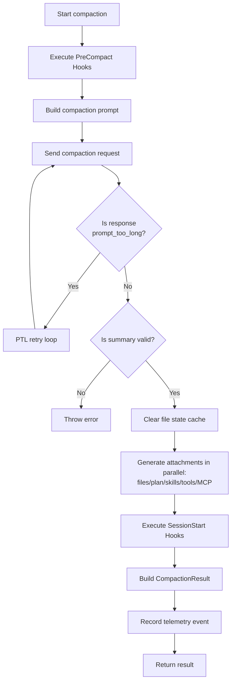
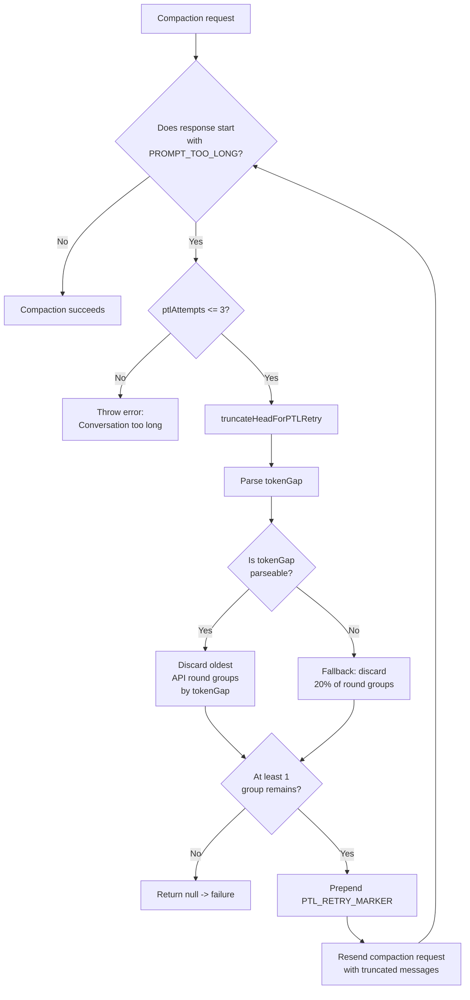
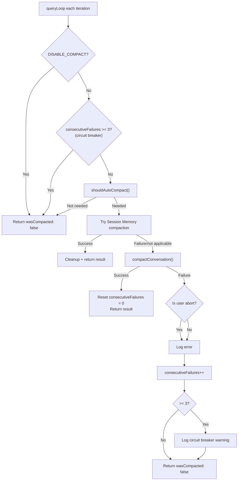

# Chapter 9: Auto-Compaction — Context가 압축되는 시점과 방법 (Auto-Compaction — When and How Context Gets Compressed)

> *"최고의 압축은 사용자가 전혀 눈치채지 못하는 압축이다."*

Claude Code를 오래 사용한 사람이라면 이런 순간을 경험한 적이 있을 것이다: 복잡한 모듈을 점진적으로 리팩터링하고 있는데, 갑자기 모델의 응답이 "건망증"에 걸린 것처럼 느껴진다 — 5분 전에 명시적으로 보존하라고 요청한 interface signature를 잊어버리거나, 이미 거절한 접근 방식을 다시 제안하는 것이다. 모델이 멍청해진 것이 아니다 — **context window가 가득 차서 auto-compaction이 방금 실행된 것이다**.

Compaction은 Claude Code의 context 관리 핵심 메커니즘이다. 이것은 어떤 시점에서, 어떤 방식으로 대화 기록이 요약으로 압축되는지를 결정한다. 이 메커니즘을 이해하면 언제 trigger되는지 예측하고, 무엇이 보존되는지 제어하며, "잘못되었을 때" 무엇을 해야 하는지 알 수 있다.

이 Chapter는 소스 코드 수준에서 auto-compaction을 세 단계에 걸쳐 완전히 해부한다: **threshold 결정** (언제 trigger되는가), **요약 생성** (어떻게 압축하는가), **실패 복구** (실패하면 어떻게 되는가).

---

## 9.1 Threshold 계산: Auto-Compaction이 Trigger되는 시점 (Threshold Calculation: When Auto-Compaction Triggers)

### 9.1.1 핵심 공식 (The Core Formula)

Auto-compaction의 trigger 조건은 간단한 부등식으로 표현할 수 있다:

```
current token count >= autoCompactThreshold
```

`autoCompactThreshold`를 계산하려면 세 개의 상수와 두 단계의 뺄셈이 필요하다. 소스 코드에서 단계별로 도출해 보자.

**Layer 1: Effective Context Window**

```typescript
// services/compact/autoCompact.ts:30
const MAX_OUTPUT_TOKENS_FOR_SUMMARY = 20_000

// services/compact/autoCompact.ts:33-48
export function getEffectiveContextWindowSize(model: string): number {
  const reservedTokensForSummary = Math.min(
    getMaxOutputTokensForModel(model),
    MAX_OUTPUT_TOKENS_FOR_SUMMARY,
  )
  let contextWindow = getContextWindowForModel(model, getSdkBetas())

  const autoCompactWindow = process.env.CLAUDE_CODE_AUTO_COMPACT_WINDOW
  if (autoCompactWindow) {
    const parsed = parseInt(autoCompactWindow, 10)
    if (!isNaN(parsed) && parsed > 0) {
      contextWindow = Math.min(contextWindow, parsed)
    }
  }

  return contextWindow - reservedTokensForSummary
}
```

여기서의 로직은: 모델의 원시 context window에서 "compaction 출력 예약분"을 빼는 것이다. `MAX_OUTPUT_TOKENS_FOR_SUMMARY = 20_000`은 실제 p99.99 compaction 출력 통계에서 나온 값이다 — 99.99%의 compaction 요약이 17,387 token 이내에 수렴하며, 20K는 안전 마진을 포함한 상한이다.

`Math.min(getMaxOutputTokensForModel(model), MAX_OUTPUT_TOKENS_FOR_SUMMARY)` 연산에 주목하라: 모델의 최대 출력 한도 자체가 20K 미만인 경우(예: 특정 Bedrock 구성), 모델 자체의 한도가 대신 사용된다.

**Layer 2: Auto-Compaction Buffer**

```typescript
// services/compact/autoCompact.ts:62
export const AUTOCOMPACT_BUFFER_TOKENS = 13_000

// services/compact/autoCompact.ts:72-91
export function getAutoCompactThreshold(model: string): number {
  const effectiveContextWindow = getEffectiveContextWindowSize(model)
  const autocompactThreshold =
    effectiveContextWindow - AUTOCOMPACT_BUFFER_TOKENS

  const envPercent = process.env.CLAUDE_AUTOCOMPACT_PCT_OVERRIDE
  if (envPercent) {
    const parsed = parseFloat(envPercent)
    if (!isNaN(parsed) && parsed > 0 && parsed <= 100) {
      const percentageThreshold = Math.floor(
        effectiveContextWindow * (parsed / 100),
      )
      return Math.min(percentageThreshold, autocompactThreshold)
    }
  }

  return autocompactThreshold
}
```

`AUTOCOMPACT_BUFFER_TOKENS = 13_000`은 추가 안전 버퍼다 — threshold trigger와 실제 compaction 실행 사이에, 현재 turn이 생성할 수 있는 추가 token(tool call 결과, system message 등)을 위한 여유 공간을 확보한다.

### 9.1.2 Threshold 계산 테이블 (Threshold Calculation Table)

Claude Sonnet 4 (200K context window)를 예시로 사용한다:

| 계산 단계 | 공식 | 값 |
|---------|------|------|
| 원시 context window | `contextWindow` | 200,000 |
| Compaction 출력 예약분 | `MAX_OUTPUT_TOKENS_FOR_SUMMARY` | 20,000 |
| Effective context window | `contextWindow - 20,000` | 180,000 |
| Auto-compaction buffer | `AUTOCOMPACT_BUFFER_TOKENS` | 13,000 |
| **Auto-compaction threshold** | **`effectiveWindow - 13,000`** | **167,000** |
| Warning threshold | `autoCompactThreshold - 20,000` | 147,000 |
| Error threshold | `autoCompactThreshold - 20,000` | 147,000 |
| Blocking hard limit | `effectiveWindow - 3,000` | 177,000 |

> **Interactive version**: [Token Dashboard 애니메이션 보기](compaction-viz.html) — 200K window가 점진적으로 채워지고, compaction이 trigger되며, 오래된 메시지가 요약으로 대체되는 과정을 시청할 수 있다.

좀 더 시각적으로 표현하면:

```
|<------------ 200K context window ------------>|
|<---- 167K usable ---->|<- 13K buffer ->|<- 20K compaction output reservation ->|
                        ^                ^
                 Auto-compaction    Effective window
                  trigger point       boundary
```

이는 기본 구성에서 auto-compaction이 context window의 약 **83.5%**를 소비했을 때 trigger됨을 의미한다.

### 9.1.3 환경 변수 Override (Environment Variable Overrides)

Claude Code는 사용자(또는 테스트 환경)가 기본 threshold를 override할 수 있는 두 가지 환경 변수를 제공한다:

**`CLAUDE_CODE_AUTO_COMPACT_WINDOW`** — Context window 크기 override

```typescript
// services/compact/autoCompact.ts:40-46
const autoCompactWindow = process.env.CLAUDE_CODE_AUTO_COMPACT_WINDOW
if (autoCompactWindow) {
  const parsed = parseInt(autoCompactWindow, 10)
  if (!isNaN(parsed) && parsed > 0) {
    contextWindow = Math.min(contextWindow, parsed)
  }
}
```

이 변수는 `Math.min(실제 window, 설정된 값)`을 취한다 — window를 **축소**만 할 수 있고, 확장은 할 수 없다. 일반적인 사용 사례: CI 환경에서 더 작은 window 값을 설정하여 안정성 테스트를 위해 더 빈번한 compaction trigger를 강제하는 것이다.

**`CLAUDE_AUTOCOMPACT_PCT_OVERRIDE`** — 백분율로 threshold override

```typescript
// services/compact/autoCompact.ts:79-87
const envPercent = process.env.CLAUDE_AUTOCOMPACT_PCT_OVERRIDE
if (envPercent) {
  const parsed = parseFloat(envPercent)
  if (!isNaN(parsed) && parsed > 0 && parsed <= 100) {
    const percentageThreshold = Math.floor(
      effectiveContextWindow * (parsed / 100),
    )
    return Math.min(percentageThreshold, autocompactThreshold)
  }
}
```

예를 들어, `CLAUDE_AUTOCOMPACT_PCT_OVERRIDE=50`을 설정하면 threshold가 effective window의 50%(90,000 token)가 되지만, 역시 `Math.min`을 사용한다 — 이 override는 기본 threshold보다 *높을 수 없으며*, compaction을 더 일찍 trigger하게만 할 수 있다.

### 9.1.4 전체 결정 흐름 (Complete Determination Flow)

`shouldAutoCompact()` 함수(`autoCompact.ts:160-239`)는 token 수를 비교하기 전에 일련의 guard 조건을 갖는다:

```
shouldAutoCompact(messages, model, querySource)
  |
  +- querySource is 'session_memory' or 'compact'? -> false (재귀 방지)
  +- querySource is 'marble_origami' (ctx-agent)? -> false (공유 상태 오염 방지)
  +- isAutoCompactEnabled() returns false? -> false
  |   +- DISABLE_COMPACT env var is truthy? -> false
  |   +- DISABLE_AUTO_COMPACT env var is truthy? -> false
  |   +- User config autoCompactEnabled = false? -> false
  +- REACTIVE_COMPACT experiment mode active? -> false (reactive compact에 양보)
  +- Context Collapse active? -> false (collapse가 자체 context 관리를 소유)
  |
  +- tokenCount >= autoCompactThreshold? -> true/false
```

Context Collapse에 대한 상세 소스 주석(`autoCompact.ts:199-222`)에 주목하라: autocompact는 effective window의 약 93%에서 trigger되는 반면, Context Collapse는 90%에서 commit을 시작하고 95%에서 block한다 — 둘이 동시에 실행되면 autocompact가 "선수를 쳐서" Collapse가 저장하려고 준비 중인 세밀한 context를 파괴할 것이다. 따라서 Collapse가 활성화되면 proactive autocompact는 비활성화되고, 413 에러에 대한 fallback으로 reactive compact만 유지된다.

---

## 9.2 Circuit Breaker: 연속 실패 보호 (Consecutive Failure Protection)

### 9.2.1 문제 배경 (Problem Background)

이상적인 경우, compaction 후 context가 크게 줄어들어 다음 turn에서 다시 trigger되지 않는다. 그러나 실제로는 "복구 불가능한" 시나리오가 존재한다: context에 압축 불가능한 대량의 system message, 첨부 파일, 또는 인코딩된 데이터가 포함되어 있어 compaction 후 결과가 여전히 threshold를 초과하고, 다음 turn에서 즉시 재trigger되어 무한 루프를 형성하는 것이다.

소스 주석은 실제 대규모 데이터 포인트를 기록하고 있다(`autoCompact.ts:68-69`):

> BQ 2026-03-10: 1,279 sessions had 50+ consecutive failures (up to 3,272) in a single session, wasting ~250K API calls/day globally.

**1,279개의 세션이 연속 실패를 경험했으며, 한 세션은 3,272번의 실패에 도달했다.** 이로 인해 전 세계적으로 매일 약 250,000건의 API 호출이 낭비되었다. 이것은 edge case가 아니다 — 이것은 강력한 보호가 필요한 시스템적 문제다.

### 9.2.2 Circuit Breaker 구현 (Circuit Breaker Implementation)

```typescript
// services/compact/autoCompact.ts:70
const MAX_CONSECUTIVE_AUTOCOMPACT_FAILURES = 3
```

Circuit breaker 로직은 극도로 간결하다 — 전체 메커니즘이 20줄 미만의 코드다:

```typescript
// services/compact/autoCompact.ts:257-265
if (
  tracking?.consecutiveFailures !== undefined &&
  tracking.consecutiveFailures >= MAX_CONSECUTIVE_AUTOCOMPACT_FAILURES
) {
  return { wasCompacted: false }
}
```

상태 추적은 `AutoCompactTrackingState` 타입을 통해 `queryLoop` iteration 간에 전달된다:

```typescript
// services/compact/autoCompact.ts:51-60
export type AutoCompactTrackingState = {
  compacted: boolean
  turnCounter: number
  turnId: string
  consecutiveFailures?: number  // Circuit breaker counter
}
```

- **성공 시** (`autoCompact.ts:332`): `consecutiveFailures`가 0으로 리셋된다
- **실패 시** (`autoCompact.ts:341-349`): 카운터가 증가하며; 3에 도달하면 경고가 로깅되고 더 이상 시도하지 않는다
- **trip 후**: 해당 세션의 모든 후속 autocompact 요청은 즉시 `{ wasCompacted: false }`를 반환한다

이 설계는 중요한 원칙을 구현한다: **실패가 확실한 재시도에 API 예산을 낭비하는 것보다, 사용자가 수동으로 `/compact`를 실행하게 하는 것이 낫다**. Circuit breaker는 자동 compaction만 차단한다 — 사용자는 여전히 `/compact` 명령어를 통해 수동으로 trigger할 수 있다.

---

## 9.3 Compaction Prompt 해부: 9-Section Template (Compaction Prompt Dissection: The 9-Section Template)

Threshold가 trigger되면, Claude Code는 전체 대화를 구조화된 요약으로 압축해 달라는 특별한 prompt를 모델에 보내야 한다. 이 prompt의 설계는 compaction 품질에 결정적이다 — 요약에서 무엇이 보존되고 무엇이 손실되는지를 직접적으로 결정한다.

### 9.3.1 세 가지 Prompt 변형 (Three Prompt Variants)

소스 코드는 세 가지 compaction prompt 변형을 정의하며, 각각 다른 compaction 시나리오에 대응한다:

| 변형 | 상수명 | 사용 사례 | 요약 범위 |
|------|--------|---------|---------|
| **BASE** | `BASE_COMPACT_PROMPT` | 전체 compaction (수동 `/compact` 또는 첫 auto-compaction) | 전체 대화 |
| **PARTIAL** | `PARTIAL_COMPACT_PROMPT` | 부분 compaction (초기 context 보존, 새 메시지만 압축) | 최근 메시지 (보존 경계 이후) |
| **PARTIAL_UP_TO** | `PARTIAL_COMPACT_UP_TO_PROMPT` | Prefix compaction (cache hit 최적화 경로) | 요약 이전의 대화 부분 |

세 변형의 핵심 차이는 **"요약의 시야 범위"**에 있다:

- **BASE**는 모델에게 말한다: "당신의 임무는 **지금까지의 대화** 전체에 대한 상세한 요약을 만드는 것이다" — 모든 것을 요약
- **PARTIAL**은 모델에게 말한다: "당신의 임무는 대화의 **최근 부분** — 이전에 유지된 context 이후에 오는 메시지들 — 에 대한 상세한 요약을 만드는 것이다" — 새로운 부분만 요약
- **PARTIAL_UP_TO**는 모델에게 말한다: "이 요약은 계속되는 세션의 시작 부분에 배치될 것이다; **이 context를 기반으로 하는 새로운 메시지들이 요약 뒤에 이어질 것이다**" — prefix를 요약하고, 후속 메시지에 대한 context를 제공

### 9.3.2 Template 구조 분석 (Template Structure Analysis)

`BASE_COMPACT_PROMPT`를 예로 들면(`prompt.ts:61-143`), 전체 prompt는 9개의 구조화된 section으로 구성된다. 아래는 각 section의 설계 의도를 분석한 것이다:

| Section | 제목 | 설계 의도 | 핵심 지침 |
|------|------|---------|---------|
| 1 | Primary Request and Intent | 사용자의 **명시적 요청**을 포착하여, compaction 후 "주제 이탈"을 방지 | "사용자의 모든 명시적 요청과 의도를 상세히 포착하라" |
| 2 | Key Technical Concepts | 기술적 결정을 위한 **contextual anchor**를 보존 | 논의된 모든 기술, 프레임워크, 개념을 나열 |
| 3 | Files and Code Sections | 정확한 **파일 및 코드** context를 보존 | "적용 가능한 경우 전체 코드 스니펫을 포함하라" — 요약이 아닌 전체 코드 스니펫임에 주목 |
| 4 | Errors and fixes | 실수 반복을 방지하기 위한 **디버깅 이력** 보존 | "사용자의 구체적 피드백에 특별히 주의하라" |
| 5 | Problem Solving | 결과뿐 아니라 **문제 해결 과정**을 보존 | "해결된 문제와 진행 중인 문제 해결 노력을 문서화하라" |
| 6 | All user messages | **모든 사용자 메시지**(tool-result 제외)를 보존 | "tool result가 아닌 모든 사용자 메시지를 나열하라" — ALL이 대문자로 강조됨 |
| 7 | Pending Tasks | **미완료 작업 목록**을 보존 | 명시적으로 요청된 작업만 나열 |
| 8 | Current Work | **현재 작업의 정확한 상태**를 보존 | "이 요약 요청 직전에 작업 중이던 것을 정확히 상세히 기술하라" |
| 9 | Optional Next Step | **다음 단계**를 보존 (guard 조건 포함) | "이 단계가 사용자의 가장 최근 명시적 요청과 직접적으로 일치하는지 확인하라" |

### 9.3.3 `<analysis>` Draft Block: 숨겨진 품질 보증 메커니즘 (A Hidden Quality Assurance Mechanism)

9-section 요약 전에, template은 모델이 먼저 `<analysis>` 블록을 생성하도록 요구한다:

```typescript
// prompt.ts:31-44
const DETAILED_ANALYSIS_INSTRUCTION_BASE = `Before providing your final summary,
wrap your analysis in <analysis> tags to organize your thoughts and ensure
you've covered all necessary points. In your analysis process:

1. Chronologically analyze each message and section of the conversation.
   For each section thoroughly identify:
   - The user's explicit requests and intents
   - Your approach to addressing the user's requests
   - Key decisions, technical concepts and code patterns
   - Specific details like:
     - file names
     - full code snippets
     - function signatures
     - file edits
   - Errors that you ran into and how you fixed them
   - Pay special attention to specific user feedback...
2. Double-check for technical accuracy and completeness...`
```

이 `<analysis>` 블록은 **초안 작성 스크래치패드**다 — 모델이 최종 요약을 생성하기 전에 전체 대화를 시간순으로 순회한다. 핵심 문구는 "**Chronologically analyze each message**"로, 모델이 이리저리 뛰어다니지 않고 순차적으로 처리하도록 강제하여 누락을 줄인다.

그러나 이 draft 블록은 **최종 context에 나타나지 않는다**. `formatCompactSummary()` 함수(`prompt.ts:311-335`)가 이를 완전히 제거한다:

```typescript
// prompt.ts:316-319
formattedSummary = formattedSummary.replace(
  /<analysis>[\s\S]*?<\/analysis>/,
  '',
)
```

이것은 chain-of-thought의 영리한 활용이다: `<analysis>` 블록을 이용하여 요약 품질을 향상시키되, compaction 후 context 공간을 소비하지 않게 한다. Draft 블록의 token은 compaction API 호출의 출력에서만 생성되며, 후속 대화의 context 부담이 되지 않는다.

### 9.3.4 NO_TOOLS_PREAMBLE: Tool 호출 방지 (Preventing Tool Calls)

세 변형 모두 맨 앞에 강력한 "no tool calls" preamble을 주입한다:

```typescript
// prompt.ts:19-26
const NO_TOOLS_PREAMBLE = `CRITICAL: Respond with TEXT ONLY. Do NOT call any tools.

- Do NOT use Read, Bash, Grep, Glob, Edit, Write, or ANY other tool.
- You already have all the context you need in the conversation above.
- Tool calls will be REJECTED and will waste your only turn — you will fail the task.
- Your entire response must be plain text: an <analysis> block followed by a <summary> block.
`
```

그리고 끝에도 매칭되는 trailer가 있다(`prompt.ts:269-272`):

```typescript
const NO_TOOLS_TRAILER =
  '\n\nREMINDER: Do NOT call any tools. Respond with plain text only — ' +
  'an <analysis> block followed by a <summary> block. ' +
  'Tool calls will be rejected and you will fail the task.'
```

소스 주석은 이렇게 "공격적인" 금지가 필요한 이유를 설명한다(`prompt.ts:12-18`): compaction 요청은 `maxTurns: 1`(응답 turn 하나만 허용)로 실행된다. 모델이 이 turn에서 tool 호출을 시도하면, tool 호출이 거부되어 **텍스트 출력이 없게** 된다 — 전체 compaction이 실패하고 streaming fallback 경로로 넘어간다. Sonnet 4.6에서 이 문제는 2.79%의 비율로 발생한다. 시작과 끝의 이중 금지가 이 문제를 무시할 수 있는 수준으로 줄인다.

### 9.3.5 PARTIAL 변형 차이 (PARTIAL Variant Differences)

`PARTIAL_COMPACT_PROMPT`와 `BASE_COMPACT_PROMPT`의 주요 차이는:

1. **범위 제한**: "요약을 **최근 메시지에서만** 논의되고, 학습되고, 달성된 것에 집중하라"
2. **분석 지침**: `DETAILED_ANALYSIS_INSTRUCTION_PARTIAL`이 BASE 버전의 "**대화**의 각 메시지와 section을 시간순으로 분석하라"를 "**최근 메시지**를 시간순으로 분석하라"로 대체

`PARTIAL_COMPACT_UP_TO_PROMPT`는 더 독특하다 — section 8이 "Current Work"에서 "**Work Completed**"로 바뀌고, section 9가 "Optional Next Step"에서 "**Context for Continuing Work**"로 바뀐다. 이는 UP_TO 모드에서 모델이 대화의 전반부만 보기 때문이다(후반부는 보존된 메시지로 그대로 추가된다). 따라서 요약은 다음 단계를 계획하는 것이 아니라 "계속"을 위한 context를 제공해야 한다.

---

## 9.4 Compaction 실행 흐름 (Compaction Execution Flow)

### 9.4.1 `compactConversation()` 메인 흐름 (Main Flow)

`compactConversation()` 함수(`compact.ts:387-704`)는 compaction의 핵심 오케스트레이터다. 메인 흐름은 다음과 같이 요약할 수 있다:



주목할 만한 세부 사항들:

**사전 클리어 및 사후 복원** (`compact.ts:518-561`): Compaction 완료 후, 코드는 먼저 `readFileState` 캐시와 `loadedNestedMemoryPaths`를 클리어한 다음, `createPostCompactFileAttachments()`를 통해 가장 중요한 파일 context를 복원한다. 이것은 "잊은 뒤 다시 떠올리기" 전략이다 — 모든 파일 내용을 요약에 보존하는 것(신뢰성 낮음) 대신, compaction 후 가장 중요한 파일을 다시 읽는 것(높은 결정성)이다. 파일 복원 예산: 최대 5개 파일, 총 50,000 token, 파일당 한도 5,000 token.

**Attachment 재주입** (`compact.ts:566-585`): Compaction은 이전의 delta attachment(deferred tool 선언, agent 목록, MCP 지침)를 소비했다. 코드는 compaction 후 "빈 메시지 기록"을 baseline으로 사용하여 이러한 attachment를 재생성하며, 모델이 compaction 후 첫 turn에서 완전한 tool 및 instruction context를 갖도록 보장한다.

### 9.4.2 Compaction 후 메시지 구조 (Post-Compaction Message Structure)

Compaction이 생성한 `CompactionResult`는 `buildPostCompactMessages()`(`compact.ts:330-338`)를 통해 최종 메시지 배열로 조립된다:

```
[boundaryMarker, ...summaryMessages, ...messagesToKeep, ...attachments, ...hookResults]
```

여기서:
- `boundaryMarker`: Compaction이 발생한 위치를 표시하는 `SystemCompactBoundaryMessage`
- `summaryMessages`: `getCompactUserSummaryMessage()`가 생성한 preamble을 포함하는 user message 형식의 요약 ("This session is being continued from a previous conversation that ran out of context")
- `messagesToKeep`: Partial compaction 중 보존된 최근 메시지
- `attachments`: 파일, plan, skill, tool 및 기타 attachment
- `hookResults`: SessionStart hook의 결과

---

## 9.5 PTL Retry: Compaction 자체가 너무 길 때 (When Compaction Itself Is Too Long)

### 9.5.1 문제 시나리오 (Problem Scenario)

이것은 "재귀적" 딜레마다: 대화가 너무 길어서 compaction이 필요한데, **compaction 요청 자체**가 API의 입력 한도(prompt_too_long)를 초과한다. 극도로 긴 세션(예: 190K+ token을 소비한 세션)에서는 전체 대화 기록을 compaction 모델에 보내면 compaction 요청의 입력 token이 context window에 도달하거나 초과할 수 있다.

### 9.5.2 재시도 메커니즘 (Retry Mechanism)

`truncateHeadForPTLRetry()` 함수(`compact.ts:243-291`)는 "가장 오래된 콘텐츠 버리기" 재시도 전략을 구현한다:



핵심 로직은 세 단계로 구성된다:

**Step 1: API round별 그룹화**

```typescript
// compact.ts:257
const groups = groupMessagesByApiRound(input)
```

`groupMessagesByApiRound()`(`grouping.ts:22-60`)는 메시지를 API round 경계별로 그룹화한다 — 새 assistant message ID가 나타날 때마다 새 그룹이 시작된다. 이는 버리기 연산이 tool_use와 해당 tool_result를 분리하지 않도록 보장한다.

**Step 2: 버리기 수량 계산**

```typescript
// compact.ts:260-272
const tokenGap = getPromptTooLongTokenGap(ptlResponse)
let dropCount: number
if (tokenGap !== undefined) {
  let acc = 0
  dropCount = 0
  for (const g of groups) {
    acc += roughTokenCountEstimationForMessages(g)
    dropCount++
    if (acc >= tokenGap) break
  }
} else {
  dropCount = Math.max(1, Math.floor(groups.length * 0.2))
}
```

API의 prompt_too_long 응답에 구체적인 token gap이 포함되어 있으면, 코드는 가장 오래된 그룹부터 정확히 누적하여 이 gap을 충당한다. Gap을 파싱할 수 없는 경우(일부 Vertex/Bedrock 에러 형식이 다름), **그룹의 20%를 버리는** 것으로 fallback한다 — 보수적이지만 효과적인 heuristic이다.

**Step 3: 메시지 시퀀스 수정**

```typescript
// compact.ts:278-291
const sliced = groups.slice(dropCount).flat()
if (sliced[0]?.type === 'assistant') {
  return [
    createUserMessage({ content: PTL_RETRY_MARKER, isMeta: true }),
    ...sliced,
  ]
}
return sliced
```

가장 오래된 그룹을 버린 후, 남은 메시지의 첫 항목이 assistant 메시지일 수 있다(원래 대화의 user preamble이 그룹 0에 있었고 그것이 버려졌기 때문). API는 첫 메시지가 user role이어야 하므로, 코드는 합성 user marker 메시지 `PTL_RETRY_MARKER`를 삽입한다.

### 9.5.3 Marker 누적 방지 (Preventing Marker Accumulation)

`truncateHeadForPTLRetry()` 시작 부분의 미묘한 처리에 주목하라(`compact.ts:250-255`):

```typescript
const input =
  messages[0]?.type === 'user' &&
  messages[0].isMeta &&
  messages[0].message.content === PTL_RETRY_MARKER
    ? messages.slice(1)
    : messages
```

그룹화 전에, 시퀀스의 첫 메시지가 이전 재시도에서 삽입된 `PTL_RETRY_MARKER`라면, 코드는 먼저 이를 제거한다. 그렇지 않으면 이 marker가 그룹 0에 포함되고, 20% fallback 전략이 "이 marker만 버릴" 수 있다 — 진전이 제로이고, 두 번째 재시도가 무한 루프에 들어간다.

### 9.5.4 재시도 한도 및 Cache Passthrough (Retry Limit and Cache Passthrough)

```typescript
// compact.ts:227
const MAX_PTL_RETRIES = 3
```

최대 3회 재시도. 각 재시도는 메시지를 잘라낼 뿐만 아니라 `cacheSafeParams`(`compact.ts:487-490`)도 업데이트하여 forked-agent 경로에서도 잘린 메시지를 사용하도록 보장한다:

```typescript
retryCacheSafeParams = {
  ...retryCacheSafeParams,
  forkContextMessages: truncated,
}
```

3회 재시도 모두 실패하면 `ERROR_MESSAGE_PROMPT_TOO_LONG`을 throw하고, 사용자는 "Conversation too long. Press esc twice to go up a few messages and try again."이라는 메시지를 보게 된다.

---

## 9.6 `autoCompactIfNeeded()`의 전체 오케스트레이션 (Complete Orchestration)

위의 모든 메커니즘을 체이닝하면, `autoCompactIfNeeded()`(`autoCompact.ts:241-351`)는 `queryLoop`이 각 iteration마다 호출하는 entry point다. 전체 흐름:



흥미로운 우선순위에 주목하라: 코드는 먼저 **Session Memory compaction**(`autoCompact.ts:287-310`)을 시도하고, Session Memory가 사용 불가능하거나 충분한 공간을 확보할 수 없을 때만 전통적인 `compactConversation()`으로 fallback한다. Session Memory compaction은 더 세밀한 전략(전체 요약이 아닌 메시지 pruning)으로, 이후 Chapter에서 자세히 다룰 것이다.

---

## 9.7 사용자가 할 수 있는 것 (What Users Can Do)

Auto-compaction의 내부 메커니즘을 이해했으니, 사용자로서 취할 수 있는 구체적인 조치를 알아보자:

### 9.7.1 Compaction 타이밍 관찰 (Observe Compaction Timing)

긴 세션 중 잠깐 "compacting..." 상태 표시가 보이면, auto-compaction이 진행 중이다. Threshold 공식에 따르면, 200K context window에서 이것은 약 167K token(약 83.5% 사용)에서 발생한다.

### 9.7.2 수동으로 미리 Compact하기 (Manually Compact Ahead of Time)

Auto-compaction이 trigger되기를 기다리지 마라. 한 하위 작업을 마치고 다음을 시작하기 전에, 선제적으로 `/compact`를 실행하라. 수동 compaction은 커스텀 지침을 전달할 수 있다:

```
/compact Focus on preserving file modification history and error fix records, keep code snippets complete
```

이러한 커스텀 지침은 compaction prompt의 끝에 추가되어, 요약 내용에 직접적으로 영향을 미친다.

### 9.7.3 CLAUDE.md의 Compaction Instructions 활용 (Leverage Compaction Instructions in CLAUDE.md)

프로젝트의 `CLAUDE.md`에 compaction instructions section을 추가할 수 있으며, 이는 매번 compaction 시 자동으로 주입된다:

```markdown
## Compact Instructions
When summarizing the conversation focus on typescript code changes
and also remember the mistakes you made and how you fixed them.
```

### 9.7.4 환경 변수로 Threshold 조정 (Adjust Thresholds with Environment Variables)

Auto-compaction이 너무 일찍 trigger된다고 느끼거나(불필요한 context 손실) 너무 늦게 trigger된다고 느끼면(빈번한 prompt_too_long 에러), 환경 변수로 미세 조정할 수 있다:

```bash
# 70%에서 compaction trigger (더 보수적, PTL 에러 감소)
export CLAUDE_AUTOCOMPACT_PCT_OVERRIDE=70

# 또는 "가시적 window"를 100K로 직접 제한 (느린 네트워크/제한된 예산용)
export CLAUDE_CODE_AUTO_COMPACT_WINDOW=100000
```

### 9.7.5 Auto-Compaction 비활성화 (권장하지 않음) (Disable Auto-Compaction (Not Recommended))

```bash
# Auto-compaction만 비활성화, 수동 /compact은 유지
export DISABLE_AUTO_COMPACT=1

# 모든 compaction 완전 비활성화 (수동 포함)
export DISABLE_COMPACT=1
```

완전 비활성화는 context를 수동으로 관리해야 함을 의미한다. 그렇지 않으면 context window가 소진되었을 때 복구 불가능한 prompt_too_long 에러를 만나게 된다.

### 9.7.6 Compaction 후 "건망증" 이해하기 (Understanding Post-Compaction "Forgetting")

Compaction 후 모델이 "잊는" 것은 전적으로 9-section 요약 template이 다루는 범위에 달려 있다. 가장 쉽게 손실되는 정보 유형:

1. **정확한 코드 diff**: Template이 "전체 코드 스니펫"을 요청하지만, 극도로 긴 diff 목록은 잘린다
2. **거절된 접근 방식의 구체적 이유**: Template은 "무엇을 했는지"에 초점을 맞추며, "왜 하지 않았는지"에 대한 커버리지는 약하다
3. **대화 초기의 미묘한 선호사항**: 시작 부분에서 "lodash를 사용하지 마라"고 한 번 언급했다면, 여러 번의 compaction 후 이것은 사라질 수 있다

완화 전략: 중요한 제약 사항을 `CLAUDE.md`에 작성하거나(compaction의 영향을 받지 않음), compaction instructions에 보존할 정보를 명시적으로 나열하라.

### 9.7.7 Circuit Breaker Trip 후 복구 (Recovery After Circuit Breaker Trips)

모델이 더 이상 auto-compact하지 않는 것을 발견하면(3회 연속 실패 후 circuit breaker가 trip됨), 다음을 할 수 있다:

1. 수동으로 `/compact`를 실행하여 compaction을 시도
2. 여전히 실패하면, 새 세션을 시작 — 일부 경우 context가 복구 불가능하다

---

## 9.8 요약 (Summary)

Auto-compaction은 Claude Code의 가장 중요한 context 관리 메커니즘 중 하나이며, 그 설계는 몇 가지 중요한 엔지니어링 원칙을 반영한다:

1. **다층 버퍼링**: 20K 출력 예약 + 13K buffer + 3K blocking hard limit — 세 겹의 방어선이 어떤 race condition에서도 시스템이 overflow되지 않도록 보장한다
2. **점진적 degradation**: Session Memory compaction -> 전통적 compaction -> PTL retry -> circuit breaker — 각 레이어가 상위 레이어의 fallback이다
3. **관찰 가능성(Observability)**: `tengu_compact`, `tengu_compact_failed`, `tengu_compact_ptl_retry` — 세 개의 telemetry event가 성공, 실패, 재시도 경로를 커버한다
4. **사용자 제어 가능성**: 환경 변수 override, 커스텀 compaction instructions, 수동 `/compact` 명령어 — 고급 사용자에게 충분한 제어를 부여한다

다음 Chapter는 compaction 후 파일 상태 보존 메커니즘을 탐구한다 — compaction은 대화 기록을 "잊을" 수 있지만, 편집 중인 파일을 "잊어서는" 안 된다.

---

## Version Evolution: v2.1.91 Changes

> 다음 분석은 v2.1.91 bundle signal 비교에 기반하며, v2.1.88 소스 코드 추론과 결합되었다.

### File State Staleness Detection

v2.1.91의 `sdk-tools.d.ts`에 새로운 `staleReadFileStateHint` 필드가 추가되었다:

```typescript
staleReadFileStateHint?: string;
// Model-facing note listing readFileState entries whose mtime bumped
// during this command (set when WRITE_COMMAND_MARKERS matches)
```

이는 tool 실행 중 Bash 명령어가 이전에 읽은 파일을 수정하면, 시스템이 tool result에 staleness hint를 첨부하여 모델에게 "이전에 읽은 파일 A가 수정되었다"고 알려준다는 것을 의미한다. 이는 이 Chapter에서 설명한 compaction 후 파일 상태 보존 메커니즘을 보완한다 — compaction은 "장기 기억"을, staleness hint는 "단일 turn 즉시성"을 다룬다.

---

## Version Evolution: v2.1.100 Changes

> 다음 분석은 v2.1.100 bundle signal 비교에 기반하며, v2.1.88 소스 코드 추론과 결합되었다.

### Cold Compact: Feature Flag 제어하의 지연 전략 (Deferred Strategy with Feature Flag Control)

v2.1.100의 `tengu_cold_compact` event는 cold compact가 실험에서 제어된 배포로 전환되었음을 나타낸다. Bundle에서 추출한 trigger 로직:

```javascript
// v2.1.100 bundle reverse engineering
let M = GPY() && S8("tengu_cold_compact", !1);
// GPY() — Feature Flag gate (server-side control switch)
// S8("tengu_cold_compact", false) — GrowthBook config, default off
try {
  let P = await QS6(q, K, _, !0, void 0, !0, J, M);
  // M passed as 8th parameter to the core compaction function
```

Cold compact와 hot compact의 구분:

| 차원 | Hot Compact (auto compact) | Cold Compact |
|-----------|--------------------------|-------------|
| Trigger 타이밍 | Context가 거의 가득 찰 때 긴급하게 | 더 적절한 시점으로 지연 |
| 긴급도 | 높음 — 실행하지 않으면 API 호출 실패 | 낮음 — 사용자 확인이나 더 나은 breakpoint를 기다릴 수 있음 |
| v2.1.88 대응 | `autoCompact.ts:72-91` threshold 계산 | 존재하지 않음 |
| Feature Flag | 항상 활성화 | `tengu_cold_compact`에 의해 제어 |

### Rapid Refill Circuit Breaker

`tengu_auto_compact_rapid_refill_breaker` event는 compaction 시스템의 edge case를 다룬다: compaction이 방금 완료되고 사용자가 즉시 고밀도 입력을 재개하여 context가 빠르게 다시 채워지면, 시스템이 "compact → 재충전 → 다시 compact" death loop에 빠질 수 있다. Circuit breaker는 `consecutiveRapidRefills` 카운터를 통해 연속적인 급속 재충전을 추적한다: 이전 compact 후 3 turn 이내에 context가 compact threshold까지 다시 채워지면 카운터가 증가하며; 3회 연속 급속 재충전이 breaker를 trip시켜 compaction을 중단하고 사용자에게 "Autocompact is thrashing"을 표시한다 — 시스템 안정성을 위해 한 번의 compaction 기회를 희생하는 것이다.

### 사용자가 Trigger할 수 있는 `/compact` 명령어 (User-Triggerable `/compact` Command)

v2.1.100은 `tengu_autocompact_command`와 `tengu_autocompact_dialog_opened` event를 추가하여, 사용자가 `/compact` 명령어를 통해 compaction을 trigger하고 확인 dialog를 통해 진행 여부를 결정할 수 있음을 나타낸다. 이는 compaction이 완전히 시스템 자동화되었던 v2.1.88 모델을 변경한다 — 사용자가 context 관리에 대한 능동적 제어를 갖게 된다.

### MAX_CONTEXT_TOKENS Override

새로운 `CLAUDE_CODE_MAX_CONTEXT_TOKENS` 환경 변수는 사용자가 최대 context token 수를 override할 수 있게 한다. Bundle reverse engineering에서:

```javascript
// v2.1.100 bundle reverse engineering
if (B6(process.env.DISABLE_COMPACT) && process.env.CLAUDE_CODE_MAX_CONTEXT_TOKENS) {
  let _ = parseInt(process.env.CLAUDE_CODE_MAX_CONTEXT_TOKENS, 10);
  if (!isNaN(_) && _ > 0) // Override context window size
```

이 override는 `DISABLE_COMPACT`도 활성화되어 있을 때만 적용된다는 점에 주목하라 — 설계 의도는 auto-compaction이 비활성화되었을 때 고급 사용자가 context budget을 수동으로 제어하게 하는 것이지, compaction 안전 threshold를 우회하는 것이 아니다.
