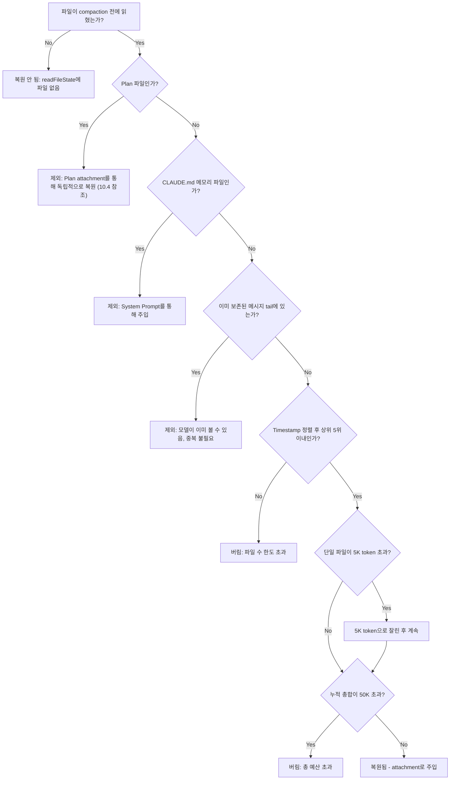
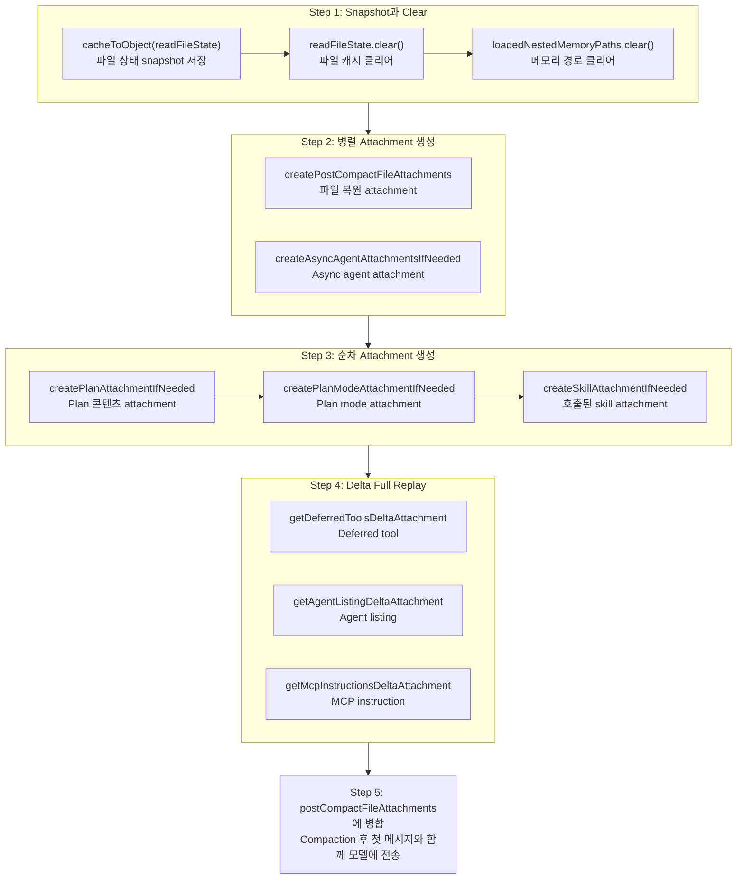

# Chapter 10: Compaction 후 파일 상태 보존 (Post-Compaction File State Preservation)

> *"복원 없는 압축은 추가 단계가 달린 데이터 손실일 뿐이다."*

Chapter 9는 **compaction이 언제 trigger되는지**와 **요약이 어떻게 생성되는지**를 다루었다. 그러나 compaction 이야기는 요약 생성 후에 끝나지 않는다. 긴 대화가 하나의 요약 메시지로 압축되면, 모델은 모든 원래 context를 잃는다 — 방금 읽은 파일이 무엇인지 더 이상 모르고, 실행 중이던 plan을 기억하지 못하며, 어떤 tool이 사용 가능한지조차 모른다. Compaction 후 첫 turn에서 모델이 "방금" 읽은 파일을 계속 편집하라고 요청받았는데, 모델이 멍하게 다시 `Read`한다면, 이는 token을 낭비할 뿐만 아니라 사용자의 workflow를 중단시킨다.

이 Chapter의 주제는 **compaction 후 상태 복원**이다 — Claude Code가 compaction 완료 후, 모델이 "필요하지만 잃어버린" 핵심 context를 신중하게 설계된 일련의 attachment를 통해 대화 흐름에 다시 주입하는 방법이다. 다섯 가지 복원 차원을 하나씩 해부한다: 파일 상태, skill 콘텐츠, plan 상태, delta tool 선언, 그리고 의도적으로 복원하지 않는 콘텐츠.

---

## 10.1 Compaction 전 Snapshot: 클리어 전에 저장하기 (Pre-Compaction Snapshot: Save Before Clearing)

Compaction 복원의 첫 단계는 compaction 후에 무엇을 하느냐가 아니라, **compaction 전에 현장을 저장하는 것**이다.

### 10.1.1 `cacheToObject` + `clear`: Snapshot-Clear 패턴 (The Snapshot-Clear Pattern)

```typescript
// services/compact/compact.ts:517-522
// Store the current file state before clearing
const preCompactReadFileState = cacheToObject(context.readFileState)

// Clear the cache
context.readFileState.clear()
context.loadedNestedMemoryPaths?.clear()
```

이 세 줄은 고전적인 **snapshot-clear** 패턴을 구현한다:

1. **Snapshot**: `cacheToObject(context.readFileState)`는 메모리 내 `FileStateCache`(Map 구조)를 plain `Record<string, { content: string; timestamp: number }>` 객체로 직렬화한다. 이 객체는 compaction 전에 모델이 읽은 모든 파일 — 파일명, 내용, 마지막 읽기 timestamp — 을 기록한다.

2. **Clear**: `context.readFileState.clear()`는 파일 상태 캐시를 클리어하고, `context.loadedNestedMemoryPaths?.clear()`는 로드된 중첩 메모리 경로를 클리어한다.

왜 먼저 클리어하는가? Compaction은 대화 기록을 하나의 요약 메시지로 대체하기 때문이다. 모델의 관점에서, 모델은 곧 어떤 파일도 읽은 적이 없는 것처럼 "잊게" 된다. 캐시를 클리어하지 않으면, 시스템은 모델이 여전히 이 파일들의 내용을 "알고 있다"고 잘못 믿게 되어, 후속 파일 중복 제거 로직이 오작동한다. 클리어 후, 시스템은 깨끗한 상태에 진입한 다음 가장 중요한 파일을 선택적으로 복원한다 — 모든 것을 복원하는 것이 아니라.

### 10.1.2 모든 것을 복원하지 않는 이유 (Why Not Restore Everything?)

이 질문은 compaction 복원의 핵심 설계 철학에 닿는다. 긴 세션 동안, 모델은 수십 개 또는 수백 개의 파일을 읽었을 수 있다. 이 모든 것을 compaction 후에 다시 주입하면, 터무니없는 순환이 만들어진다: **compaction이 막 확보한 token 공간이 복원된 파일 내용으로 즉시 채워지는 것이다**.

따라서 복원 전략은 근본적으로 **예산 배분 문제**다 — 제한된 token 예산 내에서 가장 가치 있는 상태를 선택적으로 복원하는 것이다.

---

## 10.2 파일 복원: 가장 최근 5개 파일, 파일당 5K, 총 50K 예산 (File Restoration: Most Recent 5 Files, 5K Per File, 50K Total Budget)

### 10.2.1 5개 상수 예산 프레임워크 (The Five-Constant Budget Framework)

```typescript
// services/compact/compact.ts:122-130
export const POST_COMPACT_MAX_FILES_TO_RESTORE = 5
export const POST_COMPACT_TOKEN_BUDGET = 50_000
export const POST_COMPACT_MAX_TOKENS_PER_FILE = 5_000
export const POST_COMPACT_MAX_TOKENS_PER_SKILL = 5_000
export const POST_COMPACT_SKILLS_TOKEN_BUDGET = 25_000
```

이 다섯 개의 상수가 compaction 후 복원의 전체 예산 프레임워크를 형성한다. 아래 표는 할당 로직을 보여준다:

**표 10-1: Compaction 후 Token 예산 할당**

| 예산 카테고리 | 상수명 | 한도 | 의미 |
|---------|--------|------|------|
| 파일 수 한도 | `POST_COMPACT_MAX_FILES_TO_RESTORE` | 5 | 가장 최근에 읽은 최대 5개 파일만 복원 |
| 파일당 token 한도 | `POST_COMPACT_MAX_TOKENS_PER_FILE` | 5,000 | 각 파일이 최대 5K token을 차지 |
| 파일 복원 총 예산 | `POST_COMPACT_TOKEN_BUDGET` | 50,000 | 복원된 모든 파일의 총 token이 50K를 초과할 수 없음 |
| Skill당 token 한도 | `POST_COMPACT_MAX_TOKENS_PER_SKILL` | 5,000 | 각 skill 파일이 5K token으로 잘림 |
| Skill 복원 총 예산 | `POST_COMPACT_SKILLS_TOKEN_BUDGET` | 25,000 | 모든 skill의 총 token이 25K를 초과할 수 없음 |

200K context window를 예로 들면, compaction 후 요약은 약 10K-20K token을 차지한다. 파일 복원은 최대 50K, skill 복원은 최대 25K를 소비하여 총 약 75K-95K가 된다 — 후속 대화를 위해 여전히 100K+ 공간이 남는다. 이것은 신중하게 고려된 균형이다: **모델이 작업을 매끄럽게 계속할 수 있을 만큼 충분한 context를 복원하되, compaction이 무의미해지지 않을 정도로만**.

### 10.2.2 복원 로직 상세 (Restoration Logic in Detail)

```typescript
// services/compact/compact.ts:1415-1464
export async function createPostCompactFileAttachments(
  readFileState: Record<string, { content: string; timestamp: number }>,
  toolUseContext: ToolUseContext,
  maxFiles: number,
  preservedMessages: Message[] = [],
): Promise<AttachmentMessage[]> {
  const preservedReadPaths = collectReadToolFilePaths(preservedMessages)
  const recentFiles = Object.entries(readFileState)
    .map(([filename, state]) => ({ filename, ...state }))
    .filter(
      file =>
        !shouldExcludeFromPostCompactRestore(
          file.filename,
          toolUseContext.agentId,
        ) && !preservedReadPaths.has(expandPath(file.filename)),
    )
    .sort((a, b) => b.timestamp - a.timestamp)
    .slice(0, maxFiles)
  // ...
}
```

이 함수의 로직은 네 단계로 나뉜다:

**Step 1: 복원이 필요 없는 파일 제외**. `shouldExcludeFromPostCompactRestore`(lines 1674-1705)는 두 유형의 파일을 제외한다:
- **Plan 파일** — 독립적인 복원 채널이 있다(Section 10.4 참조)
- **CLAUDE.md 메모리 파일** — System Prompt를 통해 주입되므로 파일 복원 채널로 중복할 필요가 없다

추가로, 파일 경로가 이미 보존된 메시지 tail(`preservedReadPaths`)에 나타나면, 중복 복원이 필요 없다 — 모델이 이미 context에서 볼 수 있다.

**Step 2: Timestamp 기준 정렬**. `.sort((a, b) => b.timestamp - a.timestamp)`는 파일을 마지막 읽기 시간 기준 내림차순으로 정렬한다. 가장 최근에 읽은 파일이 모델이 다음에 작업해야 할 파일일 가능성이 가장 높다.

**Step 3: 상위 N개 선택**. `.slice(0, maxFiles)`는 가장 최근 5개 파일을 가져온다. 이 잘라내기는 제외 필터링 후에 발생한다는 점에 주목하라 — 20개 파일 중 3개가 제외되면, 17개 파일만 정렬에 참여하고 그 중 상위 5개가 선택된다.

**Step 4: 병렬로 attachment 생성**. 선택된 파일에 대해, `generateFileAttachment`가 병렬로 파일 내용을 다시 읽으며, 각 파일은 `POST_COMPACT_MAX_TOKENS_PER_FILE`(5K token) 한도가 적용된다. 여기서 중요한 세부 사항: 복원은 snapshot의 캐시된 내용이 아닌 **디스크의 현재 내용**을 읽는다. Compaction 중에 파일이 외부에서 수정되었다면(예: 사용자가 에디터에서 수동으로 편집), 복원된 내용은 수정된 버전이다.

**Step 5: 예산 제어**. 파일 attachment 생성 후, 한 번 더 예산 게이트가 있다:

```typescript
// services/compact/compact.ts:1452-1463
let usedTokens = 0
return results.filter((result): result is AttachmentMessage => {
  if (result === null) {
    return false
  }
  const attachmentTokens = roughTokenCountEstimation(jsonStringify(result))
  if (usedTokens + attachmentTokens <= POST_COMPACT_TOKEN_BUDGET) {
    usedTokens += attachmentTokens
    return true
  }
  return false
})
```

5개 파일만 있더라도, 모두 큰 파일(각각 5K token에 근접)이면 총합이 50K 예산을 초과할 수 있다. 이 필터가 최종 게이트키퍼 역할을 한다 — 순서대로 각 파일의 token 수를 누적하고, 총합이 `POST_COMPACT_TOKEN_BUDGET`(50K)을 초과하면 나머지 파일을 버린다.

### 10.2.3 "보존 vs. 버림" 결정 트리 ("Preserve vs. Discard" Decision Tree)

다음 결정 트리는 각 파일이 compaction 후 복원될지 여부를 결정하는 전체 로직을 설명한다:



이 결정 트리는 중요한 설계를 드러낸다: **복원은 단순한 "가장 최근 N개" 알고리즘이 아니라, 다층 필터링 파이프라인이다**. 제외 규칙, 수량 한도, 파일당 잘라내기, 총 예산 상한 — 네 겹의 보호가 복원된 콘텐츠가 가치 있으면서도 지나치게 부풀려지지 않도록 보장한다.

---

## 10.3 Skill 재주입: invokedSkills의 선택적 복원 (Skill Re-injection: Selective Restoration of invokedSkills)

### 10.3.1 Skill에 독립적 복원이 필요한 이유 (Why Skills Need Independent Restoration)

Skill은 Claude Code의 확장성 시스템이다. 사용자가 세션 중 skill을 호출하면(예: `code-review`나 `commit`), skill의 instructions이 대화에 주입된다. Compaction 후, 이 instructions은 나머지 context와 함께 사라진다. 그러나 skill은 종종 중요한 행동 제약을 포함한다 — "커밋 전에 반드시 테스트를 실행하라" 또는 "코드 리뷰 시 보안 이슈에 집중하라" 같은 것이다. 이것이 복원되지 않으면, 모델이 compaction 후 이러한 제약을 위반할 수 있다.

### 10.3.2 Skill 복원 메커니즘 (Skill Restoration Mechanism)

```typescript
// services/compact/compact.ts:1494-1534
export function createSkillAttachmentIfNeeded(
  agentId?: string,
): AttachmentMessage | null {
  const invokedSkills = getInvokedSkillsForAgent(agentId)

  if (invokedSkills.size === 0) {
    return null
  }

  // Sorted most-recent-first so budget pressure drops the least-relevant skills.
  let usedTokens = 0
  const skills = Array.from(invokedSkills.values())
    .sort((a, b) => b.invokedAt - a.invokedAt)
    .map(skill => ({
      name: skill.skillName,
      path: skill.skillPath,
      content: truncateToTokens(
        skill.content,
        POST_COMPACT_MAX_TOKENS_PER_SKILL,
      ),
    }))
    .filter(skill => {
      const tokens = roughTokenCountEstimation(skill.content)
      if (usedTokens + tokens > POST_COMPACT_SKILLS_TOKEN_BUDGET) {
        return false
      }
      usedTokens += tokens
      return true
    })

  if (skills.length === 0) {
    return null
  }

  return createAttachmentMessage({
    type: 'invoked_skills',
    skills,
  })
}
```

Skill 복원 전략은 파일 복원과 매우 유사하지만, 두 가지 핵심 차이가 있다:

**차이 1: 버리기가 아닌 잘라내기**. 소스 주석(lines 125-128)이 설계 의도를 설명한다:

> Skills can be large (verify=18.7KB, claude-api=20.1KB). Previously re-injected unbounded on every compact -> 5-10K tok/compact. Per-skill truncation beats dropping -- instructions at the top of a skill file are usually the critical part.

Skill 파일은 클 수 있지만(`verify` skill은 18.7KB, `claude-api`는 20.1KB), **skill 파일의 시작 부분에 있는 instructions이 보통 가장 중요한 부분**이다. `truncateToTokens` 함수는 각 skill을 5K token으로 잘라서, 상단의 instructions을 보존하고 하단의 상세 참조 콘텐츠를 버린다. 이는 이진적인 "전부 유지 또는 전부 버리기" 전략보다 더 세밀하다.

**차이 2: Agent별 격리**. `getInvokedSkillsForAgent(agentId)`는 현재 agent에 속하는 skill만 반환한다. 이는 메인 세션의 skill이 sub-agent의 context로 누출되거나 그 반대 상황을 방지한다.

### 10.3.3 예산 산술 (Budget Arithmetic)

25K 총 예산으로 몇 개의 skill을 복원할 수 있을까? Skill당 5K token이면, 이론적으로 최대 5개의 skill이다. 소스 주석도 이를 확인한다: "Budget sized to hold ~5 skills at the per-skill cap."

그러나 실제로 많은 skill이 잘라내기 후 5K token 미만이므로, 25K 예산은 일반적으로 세션에서 호출된 모든 skill을 커버한다. 사용자가 단일 긴 세션에서 다수의 큰 skill을 호출하는 경우에만 예산이 병목이 된다 — 이 경우 가장 오래된 skill이 먼저 버려진다.

---

## 10.4 의도적으로 복원하지 않는 콘텐츠: sentSkillNames (Content Deliberately Not Restored)

클리어된 모든 상태가 복원될 필요는 없다. 소스 코드에서 가장 흥미로운 설계 결정 중 하나는:

```typescript
// services/compact/compact.ts:524-529
// Intentionally NOT resetting sentSkillNames: re-injecting the full
// skill_listing (~4K tokens) post-compact is pure cache_creation with
// marginal benefit. The model still has SkillTool in its schema and
// invoked_skills attachment (below) preserves used-skill content. Ants
// with EXPERIMENTAL_SKILL_SEARCH already skip re-injection via the
// early-return in getSkillListingAttachments.
```

`sentSkillNames`는 어떤 skill name listing이 이미 모델에 전송되었는지를 기록하는 모듈 수준의 `Map<string, Set<string>>`이다. Compaction 후 이것이 리셋되면, 시스템은 다음 요청에서 전체 skill listing attachment를 다시 주입할 것이다 — 약 4K token.

그러나 코드는 **의도적으로 리셋하지 않는다**. 이유는:
1. **비용 비대칭성**: 4K token의 skill listing은 전적으로 `cache_creation` token(캐시에 새로 기록해야 하는 새 콘텐츠)이 될 것이지만, 이점은 미미하다 — 모델은 `SkillTool` schema를 통해 여전히 skill tool의 존재를 알 수 있다.
2. **이미 호출된 skill은 이미 복원됨**: 이전 section의 `invoked_skills` attachment가 실제로 사용된 skill의 콘텐츠를 이미 복원하므로, 모델이 전체 name listing을 다시 볼 필요가 없다.
3. **실험적 skill 검색**: `EXPERIMENTAL_SKILL_SEARCH`가 활성화된 환경에서는 이미 skill listing 주입을 건너뛴다.

이것은 교과서적인 **token 절약 엔지니어링 결정**이다 — "복원 완전성"보다 "token 비용"을 선택하는 것이다. 4K token은 작아 보일 수 있지만, 각 compaction마다 누적된다. 자주 compact하는 긴 세션에서 이것은 상당한 절감을 나타낸다.

---

## 10.5 Plan 및 PlanMode Attachment 보존 (Plan and PlanMode Attachment Preservation)

Claude Code의 plan mode는 모델이 어떤 작업을 실행하기 전에 상세한 plan을 생성할 수 있게 한다. Compaction 후, plan 상태는 완전히 보존되어야 한다; 그렇지 않으면 모델이 실행 중이던 plan을 "잊을" 것이다.

### 10.5.1 Plan Attachment

```typescript
// services/compact/compact.ts:545-548
const planAttachment = createPlanAttachmentIfNeeded(context.agentId)
if (planAttachment) {
  postCompactFileAttachments.push(planAttachment)
}
```

`createPlanAttachmentIfNeeded`(lines 1470-1486)는 현재 agent에 활성 plan 파일이 있는지 확인한다. 있다면, plan 콘텐츠가 `plan_file_reference` 타입 attachment로 주입된다. Plan 파일은 `shouldExcludeFromPostCompactRestore`에 의해 파일 복원에서 명시적으로 제외된다는 점에 주목하라 — 정확히 이 독립적인 복원 채널이 있기 때문이며, 같은 파일이 두 번 복원되어 예산을 낭비하는 것을 방지한다.

### 10.5.2 PlanMode Attachment

```typescript
// services/compact/compact.ts:552-555
const planModeAttachment = await createPlanModeAttachmentIfNeeded(context)
if (planModeAttachment) {
  postCompactFileAttachments.push(planModeAttachment)
}
```

Plan attachment는 **plan 콘텐츠**를 복원하고, PlanMode attachment는 **모드 상태**를 복원한다. `createPlanModeAttachmentIfNeeded`(lines 1542-1560)는 사용자가 현재 plan mode에 있는지(`mode === 'plan'`) 확인한다. 그렇다면, `reminderType: 'full'` 플래그를 포함하는 `plan_mode` 타입 attachment를 주입한다 — 모델이 compaction 후 일반 실행 모드로 되돌아가지 않고 plan mode에서 계속 작업하도록 보장한다.

이 두 attachment는 협력적으로 작동한다: Plan attachment는 모델에게 "당신은 이 plan을 실행하고 있다"고 말하고, PlanMode attachment는 모델에게 "당신은 plan mode에서 계속 작업해야 한다"고 말한다. 어느 하나라도 빠지면 행동 편차가 발생한다.

---

## 10.6 Delta Attachment: Tool과 Instruction 재공지 (Re-announcing Tools and Instructions)

Compaction은 파일 상태만 클리어하는 것이 아니다 — 이전의 모든 delta attachment도 클리어한다. Delta attachment는 대화 중 시스템이 모델에 점진적으로 알리는 "증분 정보"다 — 새로 등록된 deferred tool, 새로 발견된 agent, 새로 로드된 MCP instruction. Compaction 후, 이 정보는 오래된 메시지와 함께 사라진다.

### 10.6.1 세 가지 Delta 타입의 Full Replay (Full Replay of Three Delta Types)

```typescript
// services/compact/compact.ts:563-585
// Compaction ate prior delta attachments. Re-announce from the current
// state so the model has tool/instruction context on the first
// post-compact turn. Empty message history -> diff against nothing ->
// announces the full set.
for (const att of getDeferredToolsDeltaAttachment(
  context.options.tools,
  context.options.mainLoopModel,
  [],
  { callSite: 'compact_full' },
)) {
  postCompactFileAttachments.push(createAttachmentMessage(att))
}
for (const att of getAgentListingDeltaAttachment(context, [])) {
  postCompactFileAttachments.push(createAttachmentMessage(att))
}
for (const att of getMcpInstructionsDeltaAttachment(
  context.options.mcpClients,
  context.options.tools,
  context.options.mainLoopModel,
  [],
)) {
  postCompactFileAttachments.push(createAttachmentMessage(att))
}
```

소스 주석이 이 코드의 영리한 설계를 드러낸다: **빈 배열 `[]`을 메시지 기록으로 전달하는 것**.

정상적인 대화 turn에서, delta attachment 함수는 현재 상태를 메시지 기록에 이미 나타난 것과 비교하여 "delta"만 전송한다. 그러나 compaction 후에는 비교할 메시지 기록이 없다 — 빈 배열을 전달하면 diff baseline이 비어 있으므로, 함수가 **완전한** tool 및 instruction 선언을 생성한다.

세 가지 delta attachment 타입과 그 목적:

| Delta 타입 | 함수 | 복원되는 콘텐츠 |
|-----------|------|---------|
| Deferred tool | `getDeferredToolsDeltaAttachment` | 아직 전체 schema가 로드되지 않은 tool 목록, 모델이 `ToolSearch`를 통해 요청 시 가져올 수 있음을 알림 |
| Agent listing | `getAgentListingDeltaAttachment` | 사용 가능한 sub-agent 목록, 모델이 작업을 위임할 수 있음을 알림 |
| MCP instruction | `getMcpInstructionsDeltaAttachment` | MCP 서버가 제공하는 instruction과 제약, 모델이 외부 서비스 사용 규칙을 따르도록 보장 |

`callSite: 'compact_full'` 태그는 telemetry 분석에 사용되며, 정상적인 증분 선언과 compaction 후 full replay를 구분한다.

### 10.6.2 Async Agent Attachment

```typescript
// services/compact/compact.ts:532-539
const [fileAttachments, asyncAgentAttachments] = await Promise.all([
  createPostCompactFileAttachments(
    preCompactReadFileState,
    context,
    POST_COMPACT_MAX_FILES_TO_RESTORE,
  ),
  createAsyncAgentAttachmentsIfNeeded(context),
])
```

`createAsyncAgentAttachmentsIfNeeded`(lines 1568-1599)는 백그라운드에서 실행 중이거나 결과가 아직 회수되지 않은 완료된 agent가 있는지 확인한다. 있다면, 각 agent에 대해 agent의 설명, 상태, 진행 요약을 포함하는 `task_status` 타입 attachment를 생성한다. 이는 모델이 compaction 후 백그라운드 작업을 "잊고" 동일한 작업을 중복으로 실행하는 것을 방지한다.

파일 복원과 async agent attachment 생성이 **병렬로** 실행된다(`Promise.all`)는 점에 주목하라 — 둘은 독립적이므로 순차적으로 기다릴 이유가 없는 성능 최적화다.

---

## 10.7 전체 복원 오케스트레이션 (The Complete Restoration Orchestration)

이제 모든 복원 단계를 합쳐서 compaction 후 상태 복원의 전체 오케스트레이션을 보자(`compact.ts` lines 517-585):



이 오케스트레이션의 핵심 특성은 **계층적이고 선택적**이라는 것이다. 모든 상태가 복원되는 것이 아니며, 복원 방법도 다르다 — 파일은 디스크에서 다시 읽어 복원되고, skill은 잘린 재주입을 통해 복원되며, plan은 전용 attachment를 통해 복원되고, tool 선언은 delta replay를 통해 복원된다. 각 유형의 상태에 가장 적합한 복원 채널이 있다.

---

## 10.8 사용자가 할 수 있는 것 (What Users Can Do)

Compaction 후 복원 메커니즘을 이해하면, 다음 전략을 채택하여 긴 세션 경험을 최적화할 수 있다:

### 10.8.1 파일 읽기를 집중하라 (Keep File Reads Focused)

Compaction 후 가장 최근에 읽은 5개 파일만 복원된다. 한 대화에서 모델이 20개 파일을 읽게 했다면, 마지막 5개만 자동으로 복원된다. 이는 대화 전반부에서 모델이 읽게 한 "참조 파일" — 테스트 케이스, 타입 정의, 설정 파일 — 이 compaction 후 모두 손실될 가능성이 높다는 것을 의미한다.

**전략**: 복잡한 작업을 실행할 때, 먼저 "관련 파일을 모두 읽는" 것보다 모델이 **다음에 편집해야 하는 파일**을 우선적으로 읽게 하라. 마지막에 읽은 파일이 compaction 후 보존될 가능성이 가장 높다. 작업에 중요하지만 한동안 읽지 않은 파일이 있다면, compaction이 다가오고 있다고 느낄 때(예: 대화가 30+ turn을 넘겼을 때) 모델이 다시 읽도록 하여 timestamp를 갱신하는 것을 고려하라.

### 10.8.2 대용량 파일의 잘라내기 기대치 (Truncation Expectations for Large Files)

각 파일 복원은 5K token(언어에 따라 약 2,000-2,500줄의 코드)으로 제한된다. 매우 큰 파일을 편집하고 있다면, compaction 후 모델은 파일의 시작 부분만 볼 수 있다.

**전략**: Compaction이 발생할 수 있는 시점(대화가 매우 길어졌다고 느낄 때)에서, 모델이 대용량 파일의 특정 영역에 집중하도록 명시적으로 상기시켜라. 또는 더 좋은 방법으로, 핵심 제약 사항을 `CLAUDE.md`에 작성하라 — 이것은 compaction의 영향을 절대 받지 않는다.

### 10.8.3 Compaction 후 Skill 행동 변화 (Post-Compaction Skill Behavior Changes)

Skill이 5K token으로 잘린 후, 파일 하단의 참조 콘텐츠가 손실될 수 있다. Compaction 후 skill의 행동이 변했다면, 이것은 잘라내기 때문일 수 있다.

**전략**: 가장 중요한 skill instruction을 skill 파일의 **시작 부분**에 배치하라, 끝이 아니라. Claude Code의 잘라내기 전략은 head를 보존한다 — skill 파일은 "중요한 instruction이 먼저, 보충 참조가 나중에"로 구조화되어야 한다.

### 10.8.4 Plan Mode를 사용하여 Compaction에서 살아남기 (Using Plan Mode to Survive Compaction)

다단계 작업을 실행하고 있다면, plan mode를 사용하면 compaction 후에도 plan이 완전히 보존된다. Plan attachment는 50K 파일 예산의 적용을 받지 않는다 — 독립적인 복원 채널이 있다.

**전략**: Compaction 경계를 넘길 수 있는 복잡한 작업에는, 모델이 먼저 plan을 생성하게 한 다음(`/plan`), 단계별로 실행하라. 실행 중간에 compaction이 발생해도, 모델이 plan context를 복원하고 작업을 계속할 수 있다.

### 10.8.5 "Compaction 후 건망증" 패턴 주시 (Watch for "Post-Compaction Amnesia" Patterns)

Compaction 후 모델이 갑자기:
- "방금" 읽은 파일을 다시 읽는다 — 이 파일은 6위 이하로 순위가 매겨져 복원되지 않았을 수 있다
- 백그라운드 agent를 잊었다 — agent가 `retrieved`나 `pending`으로 표시되었는지 확인하라
- MCP tool의 제약을 더 이상 따르지 않는다 — delta replay가 보통 이를 커버하지만, edge case에서 간격이 있을 수 있다
- 이전에 거절된 접근 방식을 다시 제안한다 — 요약은 "무엇을 했는지"를 보존하는 경향이 있지 "무엇이 거절되었는지"를 보존하지 않는다

이것들은 모두 정상적인 엔지니어링 trade-off다. 예산은 제한되어 있으며, 100% 복원은 가능하지도 필요하지도 않다. 어떤 정보가 compaction에서 "살아남고" 어떤 것이 손실되는지를 이해하는 것이 긴 세션을 다루는 핵심 기술이다.

### 10.8.6 다중 Compaction의 누적 효과 (Cumulative Effects of Multiple Compactions)

극도로 긴 세션은 여러 번의 compaction을 겪을 수 있다. 각 compaction은:
- 모든 파일 상태 캐시를 클리어하고 재구축한다 (최대 5개 파일)
- Skill 콘텐츠를 재잘라내기한다 (매번 원본 콘텐츠에서, "잘라내기의 잘라내기"는 없음)
- Delta attachment를 재생성한다 (full replay)

그러나 요약은 **비가역적**이다. 두 번째 compaction의 요약은 "첫 번째 요약 + 후속 대화"에서 생성되며, 정보 밀도가 매 pass마다 감소한다. 세네 번의 compaction 후에는 대화 초반의 세부 사항을 보존하는 것이 사실상 불가능하다.

**전략**: 예상되는 초장시간 작업에는, 핵심 중간 마일스톤에서 선제적으로 `/compact`를 사용하고 보존할 중요한 정보를 명시적으로 나열하는 커스텀 지침을 전달하라. 시스템이 자동으로 compact할 때까지 기다리지 마라 — 그 시점에서는 요약의 초점을 제어할 수 없다.

---

## 10.9 요약 (Summary)

Compaction 후 상태 복원은 Claude Code가 "정보 완전성"과 "token 경제성" 사이에서 취하는 세밀한 균형을 반영한다:

1. **Snapshot-clear 패턴**: 클리어 전에 현장을 저장하여, 복원에 근거가 있고 캐시 상태가 일관되도록 보장
2. **계층적 예산**: 파일 복원에 50K, skill 복원에 25K, 독립적인 plan 채널 — 서로 다른 유형의 상태에 서로 다른 복원 예산과 전략이 있다
3. **선택적 복원**: Timestamp 정렬 + 제외 규칙 + 예산 제어 — 세 겹의 필터링 레이어가 가장 가치 있는 콘텐츠만 복원되도록 보장
4. **의도적 비복원**: `sentSkillNames`의 보존은 직관에 반하지만 올바른 결정이다 — 4K token의 skill listing 주입 비용이 이점을 초과한다
5. **Delta full replay**: 빈 메시지 기록을 전달하여 full replay를 trigger하는 것은 기존 증분 메커니즘의 영리한 재사용이다

핵심 통찰: Compaction은 "잊는 것"이 아니라 "선택적으로 기억하는 것"이다. 이 선택의 로직을 이해하면 모델이 compaction 후 무엇을 기억하고 무엇을 잊을지 예측할 수 있으며, 그에 따라 workflow를 조정할 수 있다.

---

## Version Evolution: v2.1.91 Changes

> 다음 분석은 v2.1.91 bundle signal 비교에 기반하며, v2.1.88 소스 코드 추론과 결합되었다.

### staleReadFileStateHint와 File State Tracking

v2.1.91은 tool result metadata에 새로운 `staleReadFileStateHint` 필드를 추가한다. Tool 실행(예: Bash 명령어)이 이전에 읽은 파일의 mtime을 변경시키면, 시스템은 모델에 staleness hint를 전송한다. 이는 이 Chapter에서 설명한 파일 상태 추적 시스템을 확장한다 — "compaction 후 파일 context 복원"에서 "단일 turn 내 파일 변경 감지"로.

v2.1.88에서 `readFileState` 캐시(`cli/print.ts:1147-1177`)는 이미 소스 코드에 존재했다; v2.1.91은 이를 모델이 인지할 수 있는 출력 필드로 노출시킨다.

---

## Version Evolution: v2.1.100 Changes

> 다음 분석은 v2.1.100 bundle signal 비교에 기반하며, v2.1.88 소스 코드 추론과 결합되었다.

### Tool Result Dedup

v2.1.100은 tool result 중복 제거 메커니즘(`tengu_tool_result_dedup`)을 도입한다 — context 예산에 대한 상당한 최적화다. 모델이 동일한 콘텐츠를 반환하는 연속적인 tool 호출을 할 때(예: 같은 파일을 여러 번 읽기), 시스템은 더 이상 전체 결과를 반복적으로 주입하지 않고, 짧은 참조 ID로 대체한다:

```javascript
// v2.1.100 bundle reverse engineering — replacement on dedup hit
let H = `<identical to result [r${j}] from your ${$.toolName} call earlier — refer to that output>`;
d("tengu_tool_result_dedup", {
  hit: true,
  toolName: OK(K),
  originalBytes: A,
  savedBytes: A - H.length  // Track bytes saved
});
return { ...q, content: H };

// On dedup miss — register new result
r += 1;
let j = `r${_.counter}`;   // Short ID: r1, r2, r3...
_.seen.set(w, { shortId: j, toolName: K });
```

**작동 방식**: 시스템은 tool result 콘텐츠의 djb2 hash를 키로 하는 `seen` Map을 유지하며, short ID와 tool name을 저장한다. Dedup은 256 byte에서 50,000 byte 사이의 string result에만 적용된다 — 너무 짧으면 중복 제거할 가치가 없고, 너무 길면 이미 잘렸을 수 있다. 첫 번째 발생은 `[result-id: rN]` 태그가 추가된 채 정상적으로 주입되고; 후속 동일 결과는 `<identical to result [rN]...>` 참조로 대체된다.

**Context 예산 영향**: Dedup은 대화 기록의 token 소비를 직접적으로 줄인다. 일반적인 파일 읽기 결과는 수천 token일 수 있다; 참조로 대체하면 약 20 token만 소비된다. `savedBytes` 필드가 정확한 절감량 추적을 제공하여, context 관리 관찰 가능성에 새로운 차원을 추가한다(Chapter 29 참조).

이것은 이 Chapter에서 설명한 compaction 후 파일 복원 메커니즘을 보완한다: compaction 후 "가장 최근 5개 파일" 복원은 모델이 무엇을 편집하고 있었는지 알도록 보장하고, dedup은 compaction threshold에 도달하기 전에 중복 콘텐츠가 불필요하게 context 예산을 소비하지 않도록 보장한다.

### sdk-tools.d.ts Changes

v2.1.100은 tool 타입 정의에 두 가지 사소한 조정을 한다:

1. **`originalFile: string` → `string | null`**: Edit tool의 `originalFile` 필드가 nullable로 완화되어, 새 파일 생성을 지원한다(참조할 원본 파일이 없음)
2. **`toolStats` 통계 필드**: 비용 분석 및 행동 insight를 위한 새로운 7차원 세션 수준 tool 사용 통계(전체 필드 정의 및 Dream 시스템 상관 분석은 Chapter 24에서)
