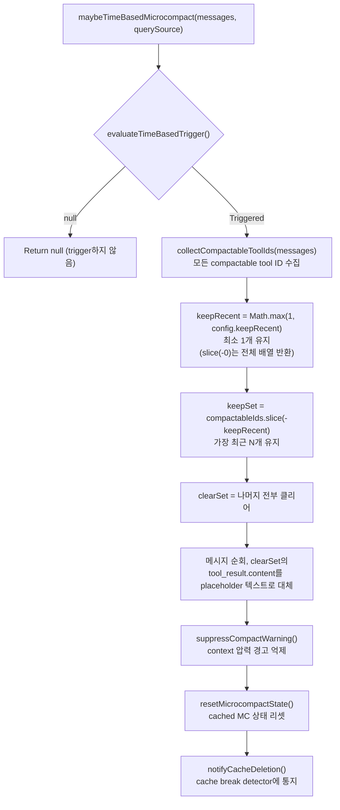
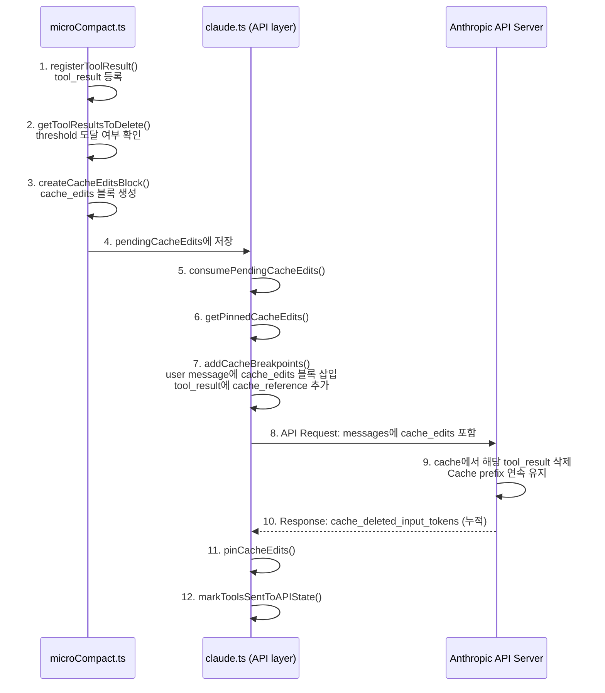

# Chapter 11: Micro-Compaction — 정밀한 Context Pruning (Micro-Compaction — Precise Context Pruning)

> *"가장 저렴한 token은 애초에 보내지 않는 token이다."*

이전 Chapter(Chapter 9)에서 우리는 auto-compaction을 철저히 분석했다 — context가 window 한계에 근접하면, Claude Code가 전체 대화를 구조화된 요약으로 압축한다. 이것은 "핵 옵션"이다: 효과적이지만 비용이 크다. 대화의 원래 세부 사항을 잃으며, 요약을 생성하기 위한 완전한 LLM 호출이 필요하다.

이 Chapter의 주인공은 **micro-compaction**이다 — 경량 context pruning 전략. 요약을 생성하지 않고, LLM을 호출하지 않으며, 대신 오래된 tool call 결과를 직접 **클리어하거나 삭제**한다. 3분 전의 200줄짜리 `grep` 출력, 30분 전에 `cat`한 설정 파일, 1시간 전의 Bash 명령어 로그 — 이 정보는 모델의 현재 추론 작업에 대해 "오래된 것"이다. Micro-compaction의 핵심 철학은: **이 오래된 콘텐츠가 귀중한 context 공간을 차지하게 두는 것보다, 적절한 시점에 정밀하게 제거하는 것이 낫다**.

Claude Code는 세 가지 micro-compaction 메커니즘을 구현하며, trigger 조건, 실행 방식, cache 영향에서 근본적으로 다르다:

| 차원 | Time-Based Micro-Compaction | Cached Micro-Compaction (cache_edits) | API Context Management |
|------|-----------------|-------------------------|----------------------|
| **Trigger** | 마지막 assistant 메시지 이후 시간 gap이 threshold 초과 | Compactable tool 수가 threshold 초과 | API 측 input_tokens가 threshold 초과 |
| **실행 위치** | Client 측 (메시지 내용 수정) | Server 측 (cache_edits directive) | Server 측 (context_management strategy) |
| **Cache 영향** | Cache prefix를 깨뜨림 (예상된 동작, cache가 이미 만료되었으므로) | Cache prefix를 유지 | API 레이어에서 관리 |
| **수정 방식** | tool_result.content를 placeholder 텍스트로 대체 | cache_edits delete directive 전송 | 선언적 전략, API가 자동 실행 |
| **적용 조건** | 오랜 유휴 후 세션 재개 | 활성 세션 중 점진적 pruning | 모든 세션 (ant users, thinking 모델) |
| **Source entry point** | `maybeTimeBasedMicrocompact()` | `cachedMicrocompactPath()` | `getAPIContextManagement()` |
| **Feature gate** | `tengu_slate_heron` (GrowthBook) | `CACHED_MICROCOMPACT` (build) | 환경 변수 토글 |

이 세 메커니즘 간의 우선순위 관계도 명확하다: time-based trigger가 먼저 실행되고 short-circuit하며, cached micro-compaction이 다음이고, API Context Management는 항상 존재하는 독립적인 선언적 레이어로 존재한다.

---

> **Interactive version**: [Micro-compaction 애니메이션 보기](microcompact-viz.html) — 메시지를 하나씩 평가한다: 핵심 결론 보존, 중복 세부 사항 pruning, 오래된 콘텐츠 제거.

## 11.1 Time-Based Micro-Compaction: Cache 만료 후 일괄 정리 (Batch Cleanup After Cache Expiry)

### 11.1.1 설계 직관 (Design Intuition)

이런 시나리오를 상상해 보라: 오전 10시에 Claude Code로 복잡한 리팩터링을 완료하고, 점심을 먹으러 간다. 오후 1시에 돌아와 작업을 계속한다 — 3시간의 gap.

그 3시간 동안 무슨 일이 일어났는가? **서버 측 prompt cache가 만료되었다.** Anthropic의 prompt cache는 두 가지 TTL tier가 있다: 5분(표준)과 1시간(확장). 어떤 tier든 3시간 후에는 둘 다 만료된다. 이는 다음 API 호출이 **전체 대화 기록**을 cache에 재기록한다는 것을 의미한다 — 모든 token이 cache creation으로 재청구된다.

따라서 time-based micro-compaction의 로직은 매우 자연스럽다: **cache가 만료되어 전체 prefix를 어차피 재기록해야 하므로, 먼저 불필요한 오래된 콘텐츠를 정리하여 재기록을 더 작고 저렴하게 만드는 것이다**.

### 11.1.2 설정 파라미터 (Configuration Parameters)

설정은 GrowthBook feature flag `tengu_slate_heron`을 통해 전달되며, `TimeBasedMCConfig` 타입이다:

```typescript
// services/compact/timeBasedMCConfig.ts:18-28
export type TimeBasedMCConfig = {
  /** Master switch. When false, time-based microcompact is a no-op. */
  enabled: boolean
  /** Trigger when (now - last assistant timestamp) exceeds this many minutes. */
  gapThresholdMinutes: number
  /** Keep this many most-recent compactable tool results. */
  keepRecent: number
}

const TIME_BASED_MC_CONFIG_DEFAULTS: TimeBasedMCConfig = {
  enabled: false,
  gapThresholdMinutes: 60,
  keepRecent: 5,
}
```

세 파라미터 각각에 근거가 있다:

- **`enabled`** 기본값은 off — 점진적 롤아웃 기능으로, GrowthBook을 통해 점진적으로 활성화된다
- **`gapThresholdMinutes: 60`**은 서버의 1시간 cache TTL에 맞춘다 — "안전한 선택"이다. 소스 주석(line 23)이 명시적으로 말한다: "서버의 1시간 cache TTL은 모든 사용자에 대해 만료가 보장되므로, 발생하지 않았을 miss를 강제하지 않는다"
- **`keepRecent: 5`**는 가장 최근 5개의 tool result를 유지하여, 모델에 최소한의 작업 context를 제공한다

### 11.1.3 Trigger 판정 (Trigger Determination)

`evaluateTimeBasedTrigger()` 함수(`microCompact.ts:422-444`)는 부작용이 없는 순수 판정 함수다:

```typescript
// microCompact.ts:422-444
export function evaluateTimeBasedTrigger(
  messages: Message[],
  querySource: QuerySource | undefined,
): { gapMinutes: number; config: TimeBasedMCConfig } | null {
  const config = getTimeBasedMCConfig()
  if (!config.enabled || !querySource || !isMainThreadSource(querySource)) {
    return null
  }
  const lastAssistant = messages.findLast(m => m.type === 'assistant')
  if (!lastAssistant) {
    return null
  }
  const gapMinutes =
    (Date.now() - new Date(lastAssistant.timestamp).getTime()) / 60_000
  if (!Number.isFinite(gapMinutes) || gapMinutes < config.gapThresholdMinutes) {
    return null
  }
  return { gapMinutes, config }
}
```

Line 428의 guard 조건에 주목하라: `!querySource`가 즉시 null을 반환한다. 이것은 cached micro-compaction의 동작과 다르다 — `isMainThreadSource()`(lines 249-251)는 `undefined`를 메인 스레드로 취급하지만(cached MC 하위 호환성을 위해), time-based triggering은 **명시적으로** querySource가 존재할 것을 요구한다. 소스 주석(lines 429-431)이 설명한다: `/context`, `/compact` 및 기타 분석 호출은 source 없이 `microcompactMessages()`를 호출하며, 이들이 time-based 정리를 trigger해서는 안 된다.

### 11.1.4 실행 로직 (Execution Logic)

Trigger 조건이 충족되면, `maybeTimeBasedMicrocompact()`는 다음 단계를 실행한다:



핵심 구현 세부 사항은 `microCompact.ts:470-492`에 있다 — 메시지 수정은 immutable 스타일을 사용한다:

```typescript
// microCompact.ts:470-492
let tokensSaved = 0
const result: Message[] = messages.map(message => {
  if (message.type !== 'user' || !Array.isArray(message.message.content)) {
    return message
  }
  let touched = false
  const newContent = message.message.content.map(block => {
    if (
      block.type === 'tool_result' &&
      clearSet.has(block.tool_use_id) &&
      block.content !== TIME_BASED_MC_CLEARED_MESSAGE
    ) {
      tokensSaved += calculateToolResultTokens(block)
      touched = true
      return { ...block, content: TIME_BASED_MC_CLEARED_MESSAGE }
    }
    return block
  })
  if (!touched) return message
  return {
    ...message,
    message: { ...message.message, content: newContent },
  }
})
```

Line 479의 guard에 주목하라: `block.content !== TIME_BASED_MC_CLEARED_MESSAGE` — 이미 클리어된 콘텐츠에 대해 `tokensSaved`를 이중 계산하는 것을 방지한다. 이것은 멱등성 보장이다: 여러 번 실행해도 tokensSaved 통계가 변경되지 않는다.

### 11.1.5 부작용 체인 (Side Effect Chain)

Time-based trigger 실행이 완료되면, 세 가지 중요한 부작용이 발생한다:

1. **`suppressCompactWarning()`** (line 511): Micro-compaction이 context 공간을 확보했으므로, 사용자에게 보이는 "context가 곧 가득 찹니다" 경고를 억제
2. **`resetMicrocompactState()`** (line 517): Cached MC의 tool 등록 상태를 클리어 — 메시지 내용을 수정하고 서버 cache를 깨뜨렸으므로, cached MC의 모든 이전 상태(어떤 tool이 등록되고 삭제되었는지)가 무효화된다
3. **`notifyCacheDeletion(querySource)`** (line 526): `promptCacheBreakDetection` 모듈에 다음 API 응답의 cache_read_tokens가 떨어질 것임을 통지 — 이것은 예상된 동작이며, cache break 버그가 아니다

세 번째 부작용이 특히 미묘하다. 소스 주석(lines 520-522)이 `notifyCompaction` 대신 `notifyCacheDeletion`을 사용하는 이유를 설명한다: "notifyCacheDeletion (not notifyCompaction) because it's already imported here and achieves the same false-positive suppression — adding the second symbol to the import was flagged by the circular-deps check." 이것은 순환 의존성 제약하의 실용적 선택이다: 두 함수 모두 동일한 효과(둘 다 false positive 방지)를 갖지만, 추가 symbol을 import하면 순환 의존성 검출기를 trigger한다.

---

## 11.2 Cached Micro-Compaction: Cache를 깨뜨리지 않는 정밀 수술 (Precise Surgery Without Breaking the Cache)

### 11.2.1 핵심 과제 (The Core Challenge)

Time-based micro-compaction에는 근본적인 한계가 있다: **메시지 내용을 수정해야** 하므로 **cache prefix가 변경**되고, 다음 API 호출에서 전체 cache creation 비용이 발생한다. Cache가 이미 만료되었을 때는 이것이 상관없다(어차피 재기록된다). 그러나 활성 세션 중에는 이것이 용납될 수 없다 — 방금 누적한 cache prefix가 수만 token의 cache creation 비용을 나타낼 수 있다.

Cached micro-compaction은 Anthropic의 API `cache_edits` 기능을 통해 이 문제를 해결한다: **로컬 메시지 내용을 수정하지 않고**, 대신 "지정된 tool result를 서버 측 cache에서 삭제하라"는 directive를 API에 전송한다. 서버가 cache prefix 내에서 이 콘텐츠를 제자리에서 제거하여, prefix 연속성을 유지한다 — 다음 요청이 여전히 기존 cache에 hit할 수 있다.

### 11.2.2 cache_edits의 작동 방식 (How cache_edits Works)

다음 시퀀스 다이어그램은 cached micro-compaction의 전체 lifecycle을 보여준다:



이 흐름을 단계별로 해부해 보자.

### 11.2.3 Tool 등록 및 Threshold 판정 (Tool Registration and Threshold Determination)

`cachedMicrocompactPath()` 함수(`microCompact.ts:305-399`)는 먼저 모든 메시지를 스캔하여 compactable tool result를 등록한다:

```typescript
// microCompact.ts:313-329
const compactableToolIds = new Set(collectCompactableToolIds(messages))
// Second pass: register tool results grouped by user message
for (const message of messages) {
  if (message.type === 'user' && Array.isArray(message.message.content)) {
    const groupIds: string[] = []
    for (const block of message.message.content) {
      if (
        block.type === 'tool_result' &&
        compactableToolIds.has(block.tool_use_id) &&
        !state.registeredTools.has(block.tool_use_id)
      ) {
        mod.registerToolResult(state, block.tool_use_id)
        groupIds.push(block.tool_use_id)
      }
    }
    mod.registerToolMessage(state, groupIds)
  }
}
```

등록은 두 단계로 이루어진다: `collectCompactableToolIds()`가 먼저 assistant 메시지에서 compactable tool set에 속하는 모든 `tool_use` ID를 수집한 다음, user 메시지에서 해당 `tool_result` 항목을 찾아 메시지별로 그룹화하여 등록한다. 그룹화가 필요한 이유는 cache_edits 삭제 단위가 개별 tool_result이지만, trigger 판정은 총 tool 수에 기반하기 때문이다.

등록 후, `mod.getToolResultsToDelete(state)`를 호출하여 삭제할 tool 목록을 얻는다. 이 함수의 로직은 GrowthBook에서 설정된 `triggerThreshold`와 `keepRecent`에 의해 제어된다 — 총 등록 tool 수가 `triggerThreshold`를 초과하면, 가장 최근 `keepRecent`를 유지하고 나머지를 삭제 대상으로 표시한다.

### 11.2.4 cache_edits 블록 Lifecycle (cache_edits Block Lifecycle)

삭제할 tool이 있으면, 코드는 `CacheEditsBlock`을 생성하고 모듈 수준 변수 `pendingCacheEdits`에 저장한다:

```typescript
// microCompact.ts:334-339
const toolsToDelete = mod.getToolResultsToDelete(state)

if (toolsToDelete.length > 0) {
  const cacheEdits = mod.createCacheEditsBlock(state, toolsToDelete)
  if (cacheEdits) {
    pendingCacheEdits = cacheEdits
  }
```

이 `pendingCacheEdits` 변수의 소비자는 API 레이어의 `claude.ts`다. API request 파라미터를 구성하기 전(line 1531), 코드는 `consumePendingCacheEdits()`를 호출하여 대기 중인 edit directive를 한 번에 가져온다:

```typescript
// claude.ts:1531-1532
const consumedCacheEdits = cachedMCEnabled ? consumePendingCacheEdits() : null
const consumedPinnedEdits = cachedMCEnabled ? getPinnedCacheEdits() : []
```

`consumePendingCacheEdits()`의 설계는 **단일 소비**(single-consumption)다(`microCompact.ts:88-94`): 호출된 후 즉시 `pendingCacheEdits`를 클리어한다. 소스 주석(lines 1528-1530)이 왜 소비가 `paramsFromContext` 내부에서 일어날 수 없는지 설명한다: "paramsFromContext is called multiple times (logging, retries), so consuming inside it would cause the first call to steal edits from subsequent calls."

### 11.2.5 API Request에 cache_edits 삽입 (Inserting cache_edits into the API Request)

`addCacheBreakpoints()` 함수(`claude.ts:3063-3162`)가 cache_edits directive를 메시지 배열에 엮어 넣는 역할을 한다. 핵심 로직은 세 단계다:

**Step 1: Pinned edit 재삽입** (lines 3128-3139)

```typescript
// claude.ts:3128-3139
for (const pinned of pinnedEdits ?? []) {
  const msg = result[pinned.userMessageIndex]
  if (msg && msg.role === 'user') {
    if (!Array.isArray(msg.content)) {
      msg.content = [{ type: 'text', text: msg.content as string }]
    }
    const dedupedBlock = deduplicateEdits(pinned.block)
    if (dedupedBlock.edits.length > 0) {
      insertBlockAfterToolResults(msg.content, dedupedBlock)
    }
  }
}
```

각 API 호출마다, 이전에 전송된 cache_edits는 **동일한 위치**에 재전송되어야 한다 — 서버가 cache prefix를 올바르게 재구성하기 위해 완전하고 일관된 edit 기록을 봐야 하기 때문이다. 이것이 `pinnedEdits`의 목적이다.

**Step 2: 새 edit 삽입** (lines 3142-3162)

새 cache_edits 블록은 **마지막 user 메시지**에 삽입된 다음, `pinCacheEdits(i, newCacheEdits)`를 통해 위치 인덱스가 고정되어, 후속 호출이 동일한 위치에서 재전송하도록 보장한다.

**Step 3: 중복 제거**

`deduplicateEdits()` helper 함수(lines 3116-3125)는 `seenDeleteRefs` Set을 사용하여 동일한 `cache_reference`가 여러 블록에 나타나지 않도록 한다. 이는 동일한 tool result가 다른 turn에서 삭제 표시되는 edge case를 방지한다.

### 11.2.6 cache_edits 데이터 구조 (cache_edits Data Structure)

API 레이어에서 cache_edits 블록 타입 정의(`claude.ts:3052-3055`)는 꽤 간결하다:

```typescript
type CachedMCEditsBlock = {
  type: 'cache_edits'
  edits: { type: 'delete'; cache_reference: string }[]
}
```

각 edit는 `cache_reference`를 가리키는 `delete` 연산이다 — 서버가 각 `tool_result`에 할당하는 고유 식별자. Client는 이전 API 응답에서 이 참조를 얻은 다음, 후속 요청에서 참조하여 어떤 콘텐츠를 삭제할지 지정한다.

### 11.2.7 Baseline 및 Delta Tracking (Baseline and Delta Tracking)

`cachedMicrocompactPath()`는 결과를 반환할 때 `baselineCacheDeletedTokens` 값을 기록한다(lines 374-383):

```typescript
// microCompact.ts:374-383
const lastAsst = messages.findLast(m => m.type === 'assistant')
const baseline =
  lastAsst?.type === 'assistant'
    ? ((
        lastAsst.message.usage as unknown as Record<
          string,
          number | undefined
        >
      )?.cache_deleted_input_tokens ?? 0)
    : 0
```

API가 반환하는 `cache_deleted_input_tokens`는 **누적 값**이다 — 현재 세션의 모든 cache_edits 연산으로 삭제된 총 token을 포함한다. 현재 연산의 실제 delta를 계산하려면, 연산 전 baseline을 기록한 다음 API 응답의 새 누적 값에서 빼야 한다. 이 설계는 client 측의 부정확한 token 추정을 피한다.

### 11.2.8 Time-Based Trigger와의 상호 배제 (Mutual Exclusion with Time-Based Trigger)

Entry 함수 `microcompactMessages()`(lines 253-293)가 엄격한 우선순위를 정의한다:

```typescript
// microCompact.ts:267-270
const timeBasedResult = maybeTimeBasedMicrocompact(messages, querySource)
if (timeBasedResult) {
  return timeBasedResult
}
```

Time-based trigger가 먼저 실행되고 short-circuit한다. 소스 주석(lines 261-266)이 이유를 설명한다: "마지막 assistant 메시지 이후 gap이 threshold를 초과하면, 서버 cache가 만료되었고 전체 prefix가 어차피 재기록될 것이다 — 그러니 지금 오래된 tool result의 content를 클리어하라 ... Cached MC(cache-editing)는 이것이 발동할 때 건너뛴다: editing은 warm cache를 가정하는데, 우리는 방금 cold임을 확인했다."

이것은 우아한 상호 배제 설계다:

- **Warm cache**: cache_edits를 사용하여 cache를 깨뜨리지 않고 콘텐츠를 삭제
- **Cold cache**: time-based trigger를 사용하여 콘텐츠를 직접 수정, cache가 이미 만료되었으므로

두 메커니즘은 절대 동시에 실행되지 않는다.

---

## 11.3 API Context Management: 선언적 Context 관리 (Declarative Context Management)

### 11.3.1 명령적에서 선언적으로 (From Imperative to Declarative)

이전의 두 micro-compaction 메커니즘은 둘 다 **명령적(imperative)**이다 — client가 어떤 tool을 삭제할지, 언제, 어떻게 할지를 결정한다. API Context Management는 **선언적(declarative)**이다: client는 "context가 X token을 초과하면, Y 타입의 콘텐츠를 클리어하고, 가장 최근 Z개를 유지하라"고만 기술하면, API 서버가 자동으로 실행한다.

이 로직은 `apiMicrocompact.ts`에 위치한다. `getAPIContextManagement()` 함수가 API request와 함께 전송되는 `ContextManagementConfig` 객체를 구성한다:

```typescript
// apiMicrocompact.ts:59-62
export type ContextManagementConfig = {
  edits: ContextEditStrategy[]
}
```

### 11.3.2 두 가지 Strategy 타입 (Two Strategy Types)

`ContextEditStrategy` union 타입은 서버가 실행할 수 있는 두 가지 edit strategy를 정의한다:

**Strategy 1: `clear_tool_uses_20250919`**

```typescript
// apiMicrocompact.ts:36-53
| {
    type: 'clear_tool_uses_20250919'
    trigger?: {
      type: 'input_tokens'
      value: number        // 입력 token이 이 값을 초과하면 trigger
    }
    keep?: {
      type: 'tool_uses'
      value: number        // 가장 최근 N개 tool use를 유지
    }
    clear_tool_inputs?: boolean | string[]  // 어떤 tool의 입력을 클리어할지
    exclude_tools?: string[]                // 어떤 tool을 제외할지
    clear_at_least?: {
      type: 'input_tokens'
      value: number        // 최소 이만큼의 token을 클리어
    }
  }
```

**Strategy 2: `clear_thinking_20251015`**

```typescript
// apiMicrocompact.ts:54-56
| {
    type: 'clear_thinking_20251015'
    keep: { type: 'thinking_turns'; value: number } | 'all'
  }
```

이 strategy는 thinking 블록을 특별히 처리한다 — extended thinking 모델(예: thinking이 활성화된 Claude Sonnet 4)은 대량의 thinking process를 생성하며, 이것의 후속 turn에서의 가치는 빠르게 감소한다.

### 11.3.3 Strategy 조합 로직 (Strategy Composition Logic)

`getAPIContextManagement()`는 런타임 조건에 따라 여러 strategy를 조합한다:

```typescript
// apiMicrocompact.ts:64-88
export function getAPIContextManagement(options?: {
  hasThinking?: boolean
  isRedactThinkingActive?: boolean
  clearAllThinking?: boolean
}): ContextManagementConfig | undefined {
  const {
    hasThinking = false,
    isRedactThinkingActive = false,
    clearAllThinking = false,
  } = options ?? {}

  const strategies: ContextEditStrategy[] = []

  // Strategy 1: thinking management
  if (hasThinking && !isRedactThinkingActive) {
    strategies.push({
      type: 'clear_thinking_20251015',
      keep: clearAllThinking
        ? { type: 'thinking_turns', value: 1 }
        : 'all',
    })
  }
  // ...
}
```

Thinking strategy의 세 가지 분기:

| 조건 | 동작 | 이유 |
|------|------|------|
| `hasThinking && !isRedactThinkingActive && !clearAllThinking` | `keep: 'all'` | 모든 thinking 유지 (정상 작업 상태) |
| `hasThinking && !isRedactThinkingActive && clearAllThinking` | `keep: { type: 'thinking_turns', value: 1 }` | 마지막 1 turn의 thinking만 유지 (유휴 > 1시간 = cache 만료) |
| `isRedactThinkingActive` | Strategy 추가하지 않음 | Redacted thinking 블록은 모델이 볼 수 있는 콘텐츠가 없어, 관리 불필요 |

`clearAllThinking`이 value를 0이 아닌 1로 설정하는 것에 주목하라 — 소스 주석(line 81)이 설명한다: "API schema는 value >= 1을 요구하며, edit를 생략하면 모델 정책 기본값(종종 'all')으로 fallback하여, 클리어하지 않게 된다."

### 11.3.4 Tool 클리어의 두 가지 모드 (Two Modes of Tool Clearing)

`clear_tool_uses_20250919` strategy 내에서, tool 클리어는 두 가지 보완적 모드를 갖는다:

**Mode 1: Tool result 클리어 (`clear_tool_inputs`)**

```typescript
// apiMicrocompact.ts:104-124
if (useClearToolResults) {
  const strategy: ContextEditStrategy = {
    type: 'clear_tool_uses_20250919',
    trigger: { type: 'input_tokens', value: triggerThreshold },
    clear_at_least: {
      type: 'input_tokens',
      value: triggerThreshold - keepTarget,
    },
    clear_tool_inputs: TOOLS_CLEARABLE_RESULTS,
  }
  strategies.push(strategy)
}
```

`TOOLS_CLEARABLE_RESULTS`(lines 19-26)는 **출력이 크지만 일회용인** tool을 포함한다: Shell 명령어, Glob, Grep, FileRead, WebFetch, WebSearch. 이러한 tool의 결과는 일반적으로 검색 출력이나 파일 내용이다 — 모델이 이미 처리했으며, 클리어해도 후속 추론에 영향을 미치지 않는다.

**Mode 2: Tool use 클리어 (`exclude_tools`)**

```typescript
// apiMicrocompact.ts:128-149
if (useClearToolUses) {
  const strategy: ContextEditStrategy = {
    type: 'clear_tool_uses_20250919',
    trigger: { type: 'input_tokens', value: triggerThreshold },
    clear_at_least: {
      type: 'input_tokens',
      value: triggerThreshold - keepTarget,
    },
    exclude_tools: TOOLS_CLEARABLE_USES,
  }
  strategies.push(strategy)
}
```

`TOOLS_CLEARABLE_USES`(lines 28-32)는 FileEdit, FileWrite, NotebookEdit — **입력**(즉, 모델이 보내는 편집 지침)이 일반적으로 출력보다 큰 tool을 포함한다. `exclude_tools`의 의미론은 "이 tool을 제외한 모든 tool use를 클리어"로, API 측에서 더 공격적으로 정리할 수 있게 한다.

두 모드의 기본 파라미터는 동일하다: `triggerThreshold = 180,000` (auto-compaction warning threshold와 거의 같음), `keepTarget = 40,000` (마지막 40K token 유지), `clear_at_least = triggerThreshold - keepTarget = 140,000` (최소 140K token 확보). 이 값들은 `API_MAX_INPUT_TOKENS`와 `API_TARGET_INPUT_TOKENS` 환경 변수로 override할 수 있다.

---

## 11.4 Compactable Tool Set 인벤토리 (Compactable Tool Set Inventory)

세 micro-compaction 메커니즘은 각각 다른 compactable tool set을 정의한다. 이 차이를 이해하는 것이 어떤 tool result가 클리어될지 예측하는 데 중요하다.

### 11.4.1 `COMPACTABLE_TOOLS` (Time-Based + Cached Micro-Compaction 공유)

```typescript
// microCompact.ts:41-50
const COMPACTABLE_TOOLS = new Set<string>([
  FILE_READ_TOOL_NAME,      // Read
  ...SHELL_TOOL_NAMES,       // Bash (multiple shell variants)
  GREP_TOOL_NAME,            // Grep
  GLOB_TOOL_NAME,            // Glob
  WEB_SEARCH_TOOL_NAME,      // WebSearch
  WEB_FETCH_TOOL_NAME,       // WebFetch
  FILE_EDIT_TOOL_NAME,       // Edit
  FILE_WRITE_TOOL_NAME,      // Write
])
```

### 11.4.2 `TOOLS_CLEARABLE_RESULTS` (API clear_tool_inputs)

```typescript
// apiMicrocompact.ts:19-26
const TOOLS_CLEARABLE_RESULTS = [
  ...SHELL_TOOL_NAMES,
  GLOB_TOOL_NAME,
  GREP_TOOL_NAME,
  FILE_READ_TOOL_NAME,
  WEB_FETCH_TOOL_NAME,
  WEB_SEARCH_TOOL_NAME,
]
```

### 11.4.3 `TOOLS_CLEARABLE_USES` (API exclude_tools)

```typescript
// apiMicrocompact.ts:28-32
const TOOLS_CLEARABLE_USES = [
  FILE_EDIT_TOOL_NAME,       // Edit
  FILE_WRITE_TOOL_NAME,      // Write
  NOTEBOOK_EDIT_TOOL_NAME,   // NotebookEdit
]
```

핵심 차이:

| Tool | COMPACTABLE_TOOLS | CLEARABLE_RESULTS | CLEARABLE_USES |
|------|:-:|:-:|:-:|
| Shell (Bash) | yes | yes | -- |
| Grep | yes | yes | -- |
| Glob | yes | yes | -- |
| FileRead (Read) | yes | yes | -- |
| WebSearch | yes | yes | -- |
| WebFetch | yes | yes | -- |
| FileEdit (Edit) | yes | -- | yes |
| FileWrite (Write) | yes | -- | yes |
| NotebookEdit | -- | -- | yes |

NotebookEdit는 API의 `TOOLS_CLEARABLE_USES`에만 나타난다 — client 측 micro-compaction은 이를 처리하지 않는다. FileEdit과 FileWrite는 client 측에서 **result**(tool_result)를 클리어하지만, API 모드에서는 `clear_tool_inputs`에서 제외되고 `exclude_tools`에서 대신 처리된다. 이 계층적 설계는 client와 server가 각각 가장 적합한 부분을 처리하게 한다.

---

## 11.5 Cache Break Detection과의 협조 (Coordinating with Cache Break Detection)

### 11.5.1 문제: Micro-Compaction이 False Positive를 Trigger한다 (The Problem: Micro-Compaction Triggers False Positives)

`promptCacheBreakDetection.ts` 모듈은 API 응답의 `cache_read_tokens`를 지속적으로 모니터링한다. 이 값이 마지막 요청 대비 5% 이상 떨어지고 절대 감소가 2,000 token을 초과하면, "cache break"를 보고한다 — 이는 일반적으로 어떤 변경(system prompt 수정, tool 목록 변경)이 cache prefix를 무효화했음을 의미한다.

그러나 micro-compaction은 **의도적으로** 캐시된 콘텐츠를 줄인다. 협조 없이는, 모든 micro-compaction이 false positive를 trigger할 것이다. Claude Code는 두 개의 통지 함수로 이를 해결한다:

### 11.5.2 `notifyCacheDeletion()`

```typescript
// promptCacheBreakDetection.ts:673-682
export function notifyCacheDeletion(
  querySource: QuerySource,
  agentId?: AgentId,
): void {
  const key = getTrackingKey(querySource, agentId)
  const state = key ? previousStateBySource.get(key) : undefined
  if (state) {
    state.cacheDeletionsPending = true
  }
}
```

**호출 시점**: Cached micro-compaction이 cache_edits를 전송한 후(`microCompact.ts:366`), time-based trigger가 메시지 내용을 수정한 후(`microCompact.ts:526`).

**효과**: `cacheDeletionsPending = true`를 설정한다. 다음 API 응답이 도착하면, `checkResponseForCacheBreak()`(lines 472-481)가 이 플래그를 보고 break detection을 완전히 건너뛴다:

```typescript
// promptCacheBreakDetection.ts:472-481
if (state.cacheDeletionsPending) {
  state.cacheDeletionsPending = false
  logForDebugging(
    `[PROMPT CACHE] cache deletion applied, cache read: ${prevCacheRead}
     -> ${cacheReadTokens} (expected drop)`,
  )
  state.pendingChanges = null
  return
}
```

### 11.5.3 `notifyCompaction()`

```typescript
// promptCacheBreakDetection.ts:689-698
export function notifyCompaction(
  querySource: QuerySource,
  agentId?: AgentId,
): void {
  const key = getTrackingKey(querySource, agentId)
  const state = key ? previousStateBySource.get(key) : undefined
  if (state) {
    state.prevCacheReadTokens = null
  }
}
```

**호출 시점**: Full compaction(`compact.ts:699`)과 auto-compaction(`autoCompact.ts:303`)이 완료된 후.

**효과**: `prevCacheReadTokens`를 null로 리셋하여, 다음 API 응답에서 비교할 "이전 값"이 없게 한다 — detector는 이를 "첫 호출"로 취급하여 break를 보고하지 않는다.

**두 함수의 차이**:

| 함수 | 리셋 방식 | 적용 시나리오 |
|------|---------|---------|
| `notifyCacheDeletion` | `cacheDeletionsPending = true` 표시, 다음 detection 건너뛰되 baseline 보존 | Micro-compaction (부분 삭제, baseline이 여전히 참조 가치 있음) |
| `notifyCompaction` | `prevCacheReadTokens`를 null로 설정, baseline 완전 리셋 | Full compaction (메시지 구조가 완전히 변경, 이전 baseline이 무의미) |

---

## 11.6 Sub-Agent 격리 (Sub-Agent Isolation)

Micro-compaction 시스템이 처리해야 하는 중요한 시나리오는 **sub-agent**다. Claude Code의 메인 스레드는 여러 sub-agent(session_memory, prompt_suggestion 등)를 fork할 수 있으며, 각각 독립적인 대화 기록을 갖는다.

`cachedMicrocompactPath`는 메인 스레드에서만 실행된다(`microCompact.ts:275-285`):

```typescript
// microCompact.ts:275-285
if (feature('CACHED_MICROCOMPACT')) {
  const mod = await getCachedMCModule()
  const model = toolUseContext?.options.mainLoopModel ?? getMainLoopModel()
  if (
    mod.isCachedMicrocompactEnabled() &&
    mod.isModelSupportedForCacheEditing(model) &&
    isMainThreadSource(querySource)
  ) {
    return await cachedMicrocompactPath(messages, querySource)
  }
}
```

소스 주석(lines 272-276)이 이유를 설명한다: "Only run cached MC for the main thread to prevent forked agents from registering their tool_results in the global cachedMCState, which would cause the main thread to try deleting tools that don't exist in its own conversation."

`cachedMCState`는 모듈 수준 전역 변수다. Sub-agent가 자신의 tool ID를 등록하면, 메인 스레드가 다음 실행에서 그 ID를 삭제하려 시도할 것이다 — 그러나 이들은 메인 스레드의 메시지에 존재하지 않아, 유효하지 않은 cache_edits directive를 초래한다. `isMainThreadSource(querySource)` guard가 sub-agent를 cached micro-compaction에서 완전히 배제한다.

`isMainThreadSource()`의 구현(lines 249-251)은 정확 매칭 대신 prefix 매칭을 사용한다:

```typescript
// microCompact.ts:249-251
function isMainThreadSource(querySource: QuerySource | undefined): boolean {
  return !querySource || querySource.startsWith('repl_main_thread')
}
```

이는 `promptCategory.ts`가 querySource를 `'repl_main_thread:outputStyle:<style>'`로 설정하기 때문이다 — 엄격한 `=== 'repl_main_thread'` 검사를 사용하면, 기본이 아닌 output style을 가진 사용자가 cached micro-compaction에서 조용히 배제될 것이다. 소스 주석(lines 246-248)이 이전의 정확 매칭을 "잠재적 버그"로 표시한다.

---

## 11.7 사용자가 할 수 있는 것 (What Users Can Do)

세 가지 micro-compaction 메커니즘을 이해하면, 다음 전략을 채택하여 일상적인 경험을 최적화할 수 있다:

### 11.7.1 "Tool Result가 사라지는" 이유 이해 (Understanding Why "Tool Results Disappear")

대화 후반에 모델이 이전 `grep`이나 `cat` 결과를 "잊는" 것을 발견하면, 이것은 모델 hallucination이 아니라 micro-compaction이 능동적으로 오래된 tool result를 클리어한 것일 가능성이 높다. 클리어된 tool result는 `[Old tool result content cleared]` placeholder 텍스트로 대체된다. 모델이 검색 결과를 다시 참조해야 한다면, 단순히 검색을 다시 실행하도록 요청하라 — 이것이 모델이 클리어된 콘텐츠를 "떠올리게" 하려는 것보다 더 신뢰성 있다.

### 11.7.2 오랜 부재 후 기대치 관리 (Expectation Management After Long Breaks)

1시간 이상 자리를 비우고 돌아와 대화를 계속하면, time-based micro-compaction이 대부분의 오래된 tool result를 클리어했을 수 있다(가장 최근 5개만 유지). 이것은 의도된 동작이다 — 서버 cache가 만료되었으므로, 오래된 콘텐츠를 클리어하면 다음 API 호출의 cache creation 비용을 크게 줄일 수 있다. 돌아와서 모델이 핵심 파일을 다시 읽게 하는 것은 정상적이고 효율적인 동작이다.

### 11.7.3 CLAUDE.md를 사용하여 핵심 Context 보존 (Using CLAUDE.md to Preserve Key Context)

Micro-compaction은 tool call result만 클리어한다 — System Prompt를 통해 주입된 `CLAUDE.md` 콘텐츠에는 영향을 미치지 않는다. 특정 정보(예: 프로젝트 관례, 아키텍처 결정, 핵심 파일 경로)가 전체 세션에 걸쳐 유효해야 한다면, `CLAUDE.md`에 작성하는 것이 가장 신뢰할 수 있는 접근 방식이다 — 어떤 compaction이나 micro-compaction 메커니즘의 영향도 받지 않는다.

### 11.7.4 병렬 Tool 호출의 비용 인식 (Cost Awareness for Parallel Tool Calls)

모델이 동시에 여러 검색이나 읽기 작업을 시작하면, 이 결과의 총합 크기는 메시지당 200K character 예산에 의해 제한된다. 일부 병렬 tool의 결과가 디스크에 persist되는 것을 관찰하면(모델이 "Output too large, saved to file"이라고 표시할 것이다), 이는 예산 메커니즘이 context 비대를 방지하는 것이다. 더 정확한 검색 기준으로 개별 tool 출력 크기를 줄일 수 있다.

### 11.7.5 Non-Compactable Tool 인식 (Awareness of Non-Compactable Tools)

모든 tool result가 micro-compaction에 의해 클리어되는 것은 아니다. `FileEdit`, `FileWrite` 및 기타 쓰기 유형 tool의 **result**는 client 측 micro-compaction에서 클리어 가능하지만, `ToolSearch`, `SendMessage` 등의 tool은 compactable set에 포함되지 않는다. 어떤 tool result가 클리어될지 아는 것(Section 11.4의 비교 표 참조)은 긴 세션에서 모델의 행동 변화를 이해하는 데 도움이 된다.

---

## 11.8 설계 패턴 요약 (Design Pattern Summary)

Micro-compaction 시스템은 연구할 만한 여러 엔지니어링 패턴을 보여준다:

**계층적 degradation**: 세 메커니즘이 계층 구조를 형성한다 — API Context Management가 항상 존재하는 선언적 baseline 역할을 하고; cached micro-compaction은 cache_edits를 지원하는 환경에서 정밀 수술을 제공하며; time-based trigger는 cache 만료 후의 fallback 역할을 한다. 각 레이어는 명확한 전제 조건과 degradation 경로를 갖는다.

**부작용 협조**: Micro-compaction은 고립된 연산이 아니다 — cache break detector에 통지해야 하고(false positive 방지), 관련 상태를 리셋해야 하며(dirty data 방지), 사용자 경고를 억제해야 한다(혼란 방지). 이 세 가지 부작용은 event 시스템이 아닌 명시적 함수 호출(`notifyCacheDeletion`, `resetMicrocompactState`, `suppressCompactWarning`)을 통해 협조되며, 인과 관계 체인의 추적 가능성을 유지한다.

**단일 소비 의미론**: `consumePendingCacheEdits()`는 데이터를 반환한 후 즉시 클리어한다 — API retry 시나리오에서 중복 소비를 방지한다. 이 패턴은 모듈 간에 일회성 상태를 전달해야 할 때 매우 실용적이다.

**Immutable 메시지 수정**: Time-based trigger 경로는 제자리 수정 대신 `map` + spread 연산자를 사용하여 새 메시지 배열을 생성한다. 이는 micro-compaction 로직에 버그가 있어도 원래 메시지가 오염되지 않도록 보장한다. Cached micro-compaction은 더 나아간다 — 로컬 메시지 수정을 **완전히 회피**하며, 모든 수정은 서버 측에서 일어난다.

**순환 의존성 회피**: `notifyCacheDeletion`이 `notifyCompaction` 대신 재사용되는 것은 오로지 후자를 import하면 순환 의존성 검출기를 trigger하기 때문이다. 이런 종류의 실용적 타협은 대규모 코드베이스에서 흔하다 — 완벽한 모듈 경계가 빌드 시스템 제약에 양보하는 것이다. 소스 주석이 이 trade-off를 숨기려 하지 않고 솔직하게 문서화한다.

---

## Version Evolution: v2.1.91 Changes

> 다음 분석은 v2.1.91 bundle signal 비교에 기반한다.

### Cold Compact

v2.1.91은 `tengu_cold_compact` event를 도입하여, 기존의 "hot compact"(긴급, context가 거의 차면 자동 trigger)와 함께 새로운 "cold compact" 전략을 제안한다:

| 비교 | Hot Compact (v2.1.88) | Cold Compact (v2.1.91 추론) |
|---------|------------------|---------------------|
| Trigger 타이밍 | Context가 blocking threshold에 도달 | Context가 가득 차 가고 있지만 아직 blocking은 아님 |
| 긴급도 | 높음 — compact하지 않으면 계속할 수 없음 | 낮음 — 다음 turn으로 지연 가능 |
| 사용자 인지 | 조용히 실행 | dialog 확인이 있을 수 있음 |

### Compaction Dialog

새로운 `tengu_autocompact_dialog_opened` event는 v2.1.91이 compaction 확인 UI를 도입함을 나타낸다 — 사용자가 compaction 발생 전에 알림을 보고 진행 여부를 선택할 수 있다. 이는 v2.1.88의 완전히 무음 compaction과 대비되어, compaction 연산의 투명성을 향상시킨다.

### Rapid Refill Circuit Breaker

`tengu_auto_compact_rapid_refill_breaker`는 edge case를 다룬다: compaction 후 대량의 tool result가 빠르게 context를 다시 채우면(예: 여러 큰 파일 읽기), 시스템이 "compact -> 재충전 -> 다시 compact" 루프에 빠질 수 있다. 이 circuit breaker는 rapid refill 패턴을 감지하면 루프를 중단하여, 무의미한 API 오버헤드를 피한다.

### Manual Compaction Tracking

`tengu_autocompact_command`는 사용자가 시작한 `/compact` 명령어와 시스템이 trigger한 auto-compaction을 구분하여, telemetry 데이터가 사용자 의도와 시스템 동작을 정확히 반영할 수 있게 한다.
