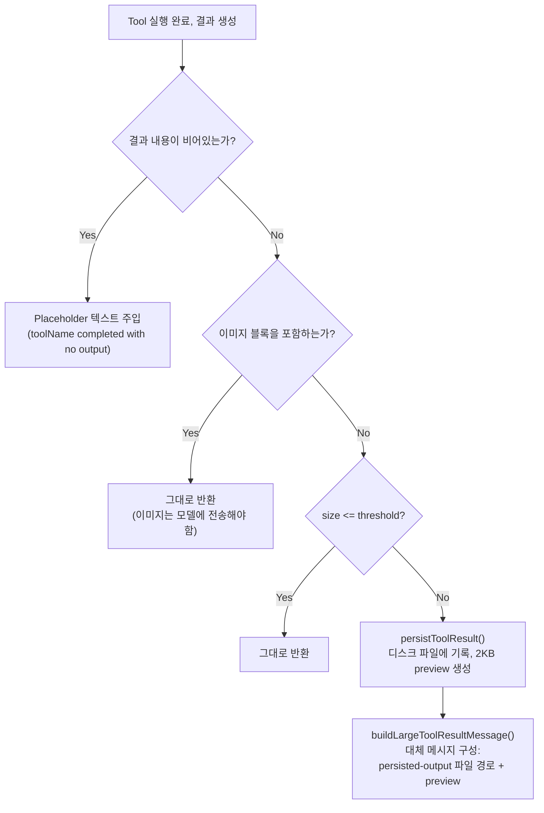
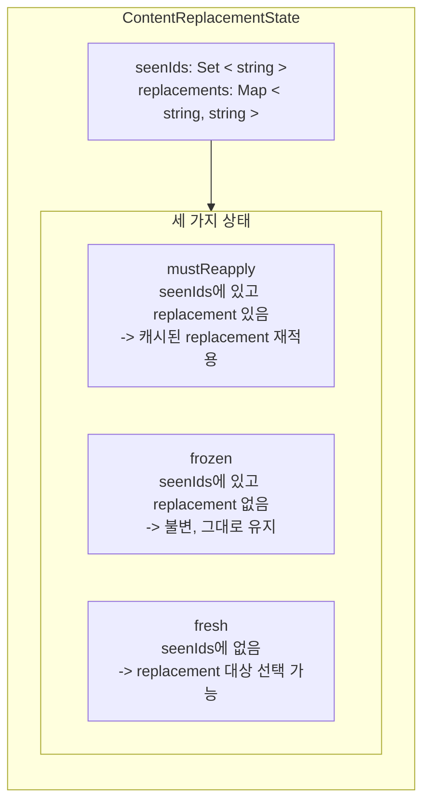
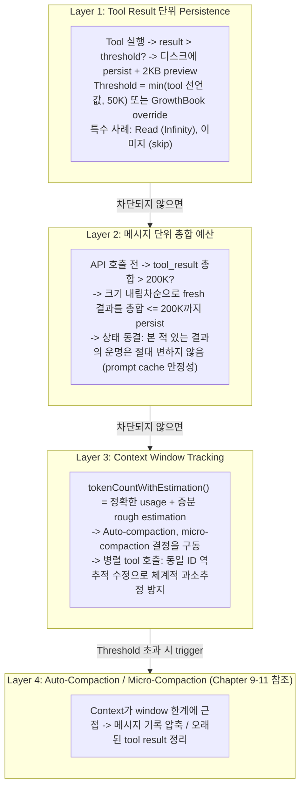

# Chapter 12: Token Budgeting Strategies

## 이것이 중요한 이유 (Why This Matters)

Chapter 9-11에서 우리는 Claude Code가 context window가 "가득 찬" 후 어떻게 압축하고 pruning하는지를 분석했다. 그러나 더 근본적인 질문이 있다: **콘텐츠가 context window에 들어가기 전에, 그 크기를 어떻게 제어하는가?**

단일 `grep`이 80KB의 검색 결과를 반환하고, 단일 `cat`이 200KB 로그 파일을 읽고, 다섯 개의 병렬 tool 호출이 각각 50KB를 반환한다 — 이것들은 실제 시나리오다. 제어 없이는, 단일 tool 결과가 context window의 4분의 1을 소비할 수 있고, 한 세트의 병렬 tool 호출이 context를 compaction threshold까지 곧바로 밀어올릴 수 있다.

Token budgeting strategy는 Claude Code의 context 관리 "입구 게이트"다. 세 가지 수준에서 작동한다:

1. **Tool result 단위 수준**: Threshold를 초과하는 결과는 디스크에 persist되며, 모델에는 preview만 표시
2. **메시지 단위 수준**: 한 라운드의 병렬 tool 호출의 총 결과가 200K character를 초과할 수 없음
3. **Token counting 수준**: Context window 사용량이 canonical API 또는 rough estimation으로 추적

이 Chapter는 이 세 가지 수준의 구현을 깊이 파고들며, 관련된 엔지니어링 trade-off — 특히 병렬 tool 호출 시나리오의 token counting 함정 — 를 드러낸다.

---

## 12.1 Tool Result Persistence: 50K Character 입구 게이트 (The 50K Character Entry Gate)

### 핵심 상수 (Core Constants)

Tool result 크기 제어는 `constants/toolLimits.ts`에 정의된 두 핵심 상수를 중심으로 한다:

```typescript
// constants/toolLimits.ts:13
export const DEFAULT_MAX_RESULT_SIZE_CHARS = 50_000

// constants/toolLimits.ts:49
export const MAX_TOOL_RESULTS_PER_MESSAGE_CHARS = 200_000
```

첫 번째 상수는 **단일 tool 결과**의 전역 상한이다 — tool의 출력이 50,000 character를 초과하면, 전체 내용이 디스크 파일에 기록되고, 모델은 파일 경로와 2,000 byte preview를 포함하는 대체 메시지만 받는다. 두 번째 상수는 **단일 메시지** 내 모든 tool 결과의 총합 상한으로, 병렬 tool 호출의 누적 효과를 방어하도록 설계되었다.

이 두 상수의 관계에 주목할 가치가 있다: 200K / 50K = 4, 즉 네 개의 tool이 각각 tool당 상한에 도달해도 단일 메시지 내에서 여전히 안전하다는 의미다. 그러나 다섯 개 이상의 병렬 tool이 동시에 상한에 가까운 결과를 반환하면, 메시지 수준 예산 집행이 작동한다.

### Persistence Threshold 계산 (Persistence Threshold Calculation)

Tool당 persistence threshold는 단순히 50K와 같지 않다 — 다층 결정이다:

```typescript
// utils/toolResultStorage.ts:55-78
export function getPersistenceThreshold(
  toolName: string,
  declaredMaxResultSizeChars: number,
): number {
  // Infinity = hard opt-out
  if (!Number.isFinite(declaredMaxResultSizeChars)) {
    return declaredMaxResultSizeChars
  }
  const overrides = getFeatureValue_CACHED_MAY_BE_STALE<Record<
    string, number
  > | null>(PERSIST_THRESHOLD_OVERRIDE_FLAG, {})
  const override = overrides?.[toolName]
  if (
    typeof override === 'number' &&
    Number.isFinite(override) &&
    override > 0
  ) {
    return override
  }
  return Math.min(declaredMaxResultSizeChars, DEFAULT_MAX_RESULT_SIZE_CHARS)
}
```

이 함수의 결정 로직은 우선순위 체인을 형성한다:

| 우선순위 | 조건 | 결과 |
|--------|------|------|
| 1 (최고) | Tool이 `maxResultSizeChars: Infinity`를 선언 | 절대 persist하지 않음 (Read tool이 이 메커니즘 사용) |
| 2 | GrowthBook 플래그 `tengu_satin_quoll`에 이 tool에 대한 override 있음 | 원격 override 값 사용 |
| 3 | Tool이 커스텀 `maxResultSizeChars`를 선언 | `Math.min(선언된 값, 50_000)` |
| 4 (기본) | 특별한 선언 없음 | 50,000 character |

**표 12-1: Tool별 Persistence Threshold 우선순위 체인**

첫 번째 우선순위가 특히 흥미롭다: Read tool은 `maxResultSizeChars`를 `Infinity`로 설정하여, **절대** persist되지 않는다. 소스 주석(lines 59-61)이 이유를 설명한다 — Read tool의 출력이 파일에 persist되면, 모델이 그 파일을 읽기 위해 Read를 다시 호출해야 하여 루프가 생긴다. Read tool은 자체 `maxTokens` 파라미터를 통해 출력 크기를 제어하며, 일반 persistence 메커니즘에 의존하지 않는다.

### Persistence 흐름 (Persistence Flow)

Tool 결과가 threshold를 초과하면, `maybePersistLargeToolResult` 함수가 다음 흐름을 실행한다:



**그림 12-1: Tool Result Persistence 결정 흐름**

주목할 만한 두 가지 구현 세부 사항:

**빈 결과 처리** (lines 280-295): 빈 `tool_result` 내용은 특정 모델(주석에서 "capybara"를 언급)이 대화 turn 경계를 잘못 식별하여, 출력을 잘못 종료하게 만든다. 이는 서버 측 renderer가 `tool_result` 뒤에 `\n\nAssistant:` 마커를 삽입하지 않고, 빈 내용이 `\n\nHuman:` stop sequence 패턴과 일치하기 때문이다. 해결책은 간략한 placeholder 문자열 `(toolName completed with no output)`을 주입하는 것이다.

**파일 쓰기 멱등성** (lines 161-172): `persistToolResult`는 `flag: 'wx'`로 파일을 쓴다, 즉 파일이 이미 존재하면 `EEXIST` 에러를 throw한다 — 함수는 이 에러를 catch하고 무시한다. 이 설계는 microcompact가 원래 메시지를 replay할 때의 중복 persistence 문제를 처리한다: `tool_use_id`는 호출마다 고유하고, 동일 ID에 대한 내용은 결정론적이므로, 기존 파일을 건너뛰는 것이 안전하다.

### Persistence 후 메시지 형식 (Post-Persistence Message Format)

Persistence 후, 모델이 실제로 보는 메시지는 다음과 같다:

```xml
<persisted-output>
Output too large (82.3 KB). Full output saved to:
  /path/to/session/tool-results/toolu_01XYZ.txt

Preview (first 2.0 KB):
[첫 2000 byte의 내용, 줄바꿈 경계에서 잘림]
...
</persisted-output>
```

Preview 생성 로직(lines 339-356)은 줄 중간에서 자르지 않도록 줄바꿈 경계에서 잘라내려 시도한다. 마지막 줄바꿈 위치가 한도의 50% 이전이면(한 줄만 있거나 줄이 매우 길다는 의미), 정확한 byte 한도로 fallback한다.

---

## 12.2 메시지 단위 예산: 200K 총합 상한 (Per-Message Budget: The 200K Aggregate Ceiling)

### 메시지 수준 예산이 필요한 이유 (Why Message-Level Budget Is Needed)

Tool당 50K 상한은 병렬 tool 호출 시나리오에 불충분하다. 이런 상황을 고려하라: 모델이 동시에 10개의 `Grep` 호출을 시작하여 서로 다른 키워드를 검색하고, 각각 40K character를 반환한다 — 개별적으로는 모두 50K threshold 이하이지만, 총 400K character가 하나의 user 메시지로 API에 전송된다. 이것은 즉시 context window의 큰 부분을 소비하고 불필요한 compaction을 trigger할 수 있다.

`MAX_TOOL_RESULTS_PER_MESSAGE_CHARS = 200_000`(line 49)이 이 시나리오를 위해 설계된 총합 예산이다. 주석(lines 40-48)이 핵심 설계 원칙을 명확히 말한다: **메시지는 독립적으로 평가된다** — 한 라운드에서 150K의 결과와 다른 라운드에서 150K의 결과는 각각 예산 내이며 서로 영향을 미치지 않는다.

### 메시지 그룹화 복잡성 (Message Grouping Complexity)

병렬 tool 호출은 Claude Code의 내부 메시지 형식에서 사소하지 않게 표현된다. 모델이 여러 병렬 tool 호출을 시작하면, streaming handler가 각 `content_block_stop` event에 대해 **별도의** AssistantMessage 레코드를 생성한 다음, 각 `tool_result`가 독립적인 user 메시지로 따라온다. 따라서 내부 메시지 배열은 다음과 같다:

```
[..., assistant(id=A), user(result_1), assistant(id=A), user(result_2), ...]
```

여러 assistant 레코드가 **동일한 `message.id`를 공유**한다는 점에 주목하라. 그러나 API에 전송하기 전에, `normalizeMessagesForAPI`가 연속적인 user 메시지를 하나로 병합한다. 메시지 수준 예산은 분산된 내부 표현이 아닌, API가 보는 그룹화에 따라 작동해야 한다.

`collectCandidatesByMessage` 함수(lines 600-638)가 이 그룹화 로직을 구현한다. "assistant 메시지 경계"로 메시지를 그룹화한다 — **이전에 보지 못한** assistant `message.id`만 새 그룹 경계를 생성한다:

```typescript
// utils/toolResultStorage.ts:624-635
const seenAsstIds = new Set<string>()
for (const message of messages) {
  if (message.type === 'user') {
    current.push(...collectCandidatesFromMessage(message))
  } else if (message.type === 'assistant') {
    if (!seenAsstIds.has(message.message.id)) {
      flush()
      seenAsstIds.add(message.message.id)
    }
  }
}
```

여기에 미묘한 edge case가 있다: 병렬 tool 실행이 abort를 만나면, `agent_progress` 메시지가 tool_result 메시지 사이에 삽입될 수 있다. Progress 메시지에서 그룹 경계가 생성되면, 해당 tool_result가 다른 하위 예산 그룹으로 분리되어 총합 예산 검사를 우회할 것이다 — 그러나 `normalizeMessagesForAPI`는 이들을 wire에서 하나의 over-budget 메시지로 병합할 것이다. 코드는 assistant 메시지에서만 그룹을 생성하여(progress, attachment 및 기타 타입 무시) 이를 방지한다.

### 예산 집행 및 상태 동결 (Budget Enforcement and State Freezing)

메시지 수준 예산 집행의 핵심 메커니즘은 `enforceToolResultBudget` 함수(lines 769-908)다. 그 설계는 핵심 제약을 중심으로 한다: **prompt cache 안정성**. 모델이 tool 결과를 본 적이 있으면(전체 내용이든 대체 preview든), 이 결정은 모든 후속 API 호출에서 일관되게 유지되어야 한다. 그렇지 않으면 prefix 변경이 prompt cache를 무효화한다.

이것이 "삼중 상태 분할(tri-state partition)" 메커니즘으로 이어진다:



**그림 12-2: Tool Result 삼중 상태 분할 및 상태 전이**

각 API 호출 전의 실행 흐름:

1. **각 메시지 그룹에 대해**, 후보 tool_result를 위의 세 상태로 분할
2. **mustReapply**: Map에서 이전에 캐시된 대체 문자열을 가져와 동일하게 재적용 — zero I/O, byte 수준 일관성
3. **frozen**: 이전에 본 적 있지만 대체되지 않은 결과 — 더 이상 대체할 수 없음(그렇게 하면 prompt cache prefix가 깨짐)
4. **fresh**: 이번 turn의 새 결과 — 총합 예산 확인; 예산 초과 시 크기 내림차순으로 가장 큰 결과를 persistence 대상으로 선택

어떤 fresh 결과를 대체할지 선택하는 로직은 `selectFreshToReplace`(lines 675-692)에 있다: 크기 내림차순 정렬 후, 남은 총합(frozen + 선택되지 않은 fresh)이 예산 한도 아래로 떨어질 때까지 하나씩 선택한다. Frozen 결과만으로 예산을 초과하면, 초과를 수용한다 — microcompact가 결국 정리할 것이다.

### 상태 표시 타이밍 (State Marking Timing)

코드에 신중하게 설계된 타이밍 제약이 있다(lines 833-842). Persistence 대상으로 선택되지 않은 후보는 **즉시 동기적으로** seen으로 표시되며(`seenIds`에 추가), persistence 대상으로 선택된 후보는 `await persistToolResult()`가 완료된 후에만 표시된다 — `seenIds.has(id)`와 `replacements.has(id)` 사이의 일관성을 보장한다. 주석이 설명한다: ID가 `seenIds`에 있지만 `replacements`에 없으면, frozen(대체 불가)으로 분류되어 전체 내용이 전송된다; 한편 메인 스레드가 preview를 전송 중일 수 있다 — 불일치가 prompt cache 무효화를 초래할 것이다.

---

## 12.3 Token Counting: Canonical vs. Rough Estimation

### 두 가지 Counting 메커니즘 (Two Counting Mechanisms)

Claude Code는 서로 다른 시나리오를 위한 두 가지 token counting 메커니즘을 유지한다:

| 특성 | Canonical Count (API usage) | Rough Estimation |
|------|----------------------|---------|
| 데이터 소스 | API 응답의 `usage` 필드 | Character 길이 / bytes-per-token 팩터 |
| 정확도 | 정확 | 편차 최대 +/-50% |
| 가용성 | API 호출 완료 후 | 언제든 |
| 사용 사례 | Threshold 결정, 예산 계산, 과금 | API 호출 사이의 gap 채우기 |

**표 12-2: 두 Token Counting 메커니즘 비교**

### Canonical Count: API Usage에서 Context 크기로 (From API Usage to Context Size)

API 응답의 `usage` 객체는 여러 필드를 포함한다. `getTokenCountFromUsage` 함수(`utils/tokens.ts:46-53`)가 이를 전체 context window 크기로 결합한다:

```typescript
// utils/tokens.ts:46-53
export function getTokenCountFromUsage(usage: Usage): number {
  return (
    usage.input_tokens +
    (usage.cache_creation_input_tokens ?? 0) +
    (usage.cache_read_input_tokens ?? 0) +
    usage.output_tokens
  )
}
```

이 계산은 네 가지 구성 요소를 포함한다: `input_tokens`(이 요청의 비캐시 입력), `cache_creation_input_tokens`(cache에 새로 기록된 token), `cache_read_input_tokens`(cache에서 읽은 token), `output_tokens`(모델 생성 출력). Cache 관련 필드는 선택적이다(`?? 0`), 모든 API 공급자가 반환하지는 않기 때문이다.

### Rough Estimation: 4 Bytes/Token 규칙 (The 4 Bytes/Token Rule)

API usage를 사용할 수 없을 때 — 예를 들어, 두 API 호출 사이에 새 메시지가 추가될 때 — Claude Code는 character 길이를 경험적 팩터로 나누어 token 수를 추정한다. 핵심 추정 함수는 `services/tokenEstimation.ts:203-208`에 있다:

```typescript
// services/tokenEstimation.ts:203-208
export function roughTokenCountEstimation(
  content: string,
  bytesPerToken: number = 4,
): number {
  return Math.round(content.length / bytesPerToken)
}
```

4 bytes/token 기본값은 보수적 추정이다. Claude의 tokenizer는 영어 텍스트에 대해 실제 비율이 대략 3.5-4.5이며, 4가 경험적 중앙값이다. 그러나 실제 비율은 콘텐츠 유형에 따라 상당히 다르다:

| 콘텐츠 유형 | Bytes/Token 팩터 | 출처 |
|----------|----------------|------|
| Plain text (영어, 코드) | 4 | 기본값 (`tokenEstimation.ts:204`) |
| JSON / JSONL / JSONC | 2 | `bytesPerTokenForFileType` (`tokenEstimation.ts:216-224`) |
| 이미지 (image block) | 고정 2,000 token | `roughTokenCountEstimationForBlock` (lines 400-412) |
| PDF 문서 (document block) | 고정 2,000 token | 위와 동일 |

**표 12-3: 파일 유형 인식 Token 추정 규칙 요약**

JSON 파일이 4 대신 2를 사용하는 이유는 주석(lines 213-215)에서 명확히 설명한다: **밀집 JSON은 많은 단일 문자 token을 포함한다**(`{`, `}`, `:`, `,`, `"`), 이는 각 token이 평균적으로 약 2 byte에 해당함을 의미한다. 여전히 4를 사용하면, 100KB JSON 파일이 25K token으로 추정될 것이고, 실제로는 50K에 더 가깝다 — 이 과소추정이 초과 크기 tool 결과가 persistence를 빠져나와 조용히 context에 들어가게 할 수 있다.

`bytesPerTokenForFileType`(lines 215-224)은 파일 확장자에 따라 다른 팩터를 반환한다:

```typescript
// services/tokenEstimation.ts:215-224
export function bytesPerTokenForFileType(fileExtension: string): number {
  switch (fileExtension) {
    case 'json':
    case 'jsonl':
    case 'jsonc':
      return 2
    default:
      return 4
  }
}
```

### 이미지와 문서의 고정 추정 (Fixed Estimation for Images and Documents)

이미지와 PDF 문서는 특수한 경우다. API의 이미지에 대한 실제 token 과금은 `(width x height) / 750`이며, 이미지는 최대 2000x2000 pixel로 스케일링된다(약 5,333 token). 그러나 rough estimation에서 Claude Code는 균일하게 **고정 2,000 token**을 사용한다(lines 400-412).

여기에 중요한 엔지니어링 고려 사항이 있다: 이미지나 PDF의 `source.data`(base64 인코딩)가 일반 JSON 직렬화 경로에 입력되면, 1MB PDF가 약 1.33M base64 character를 생성하여, 4 bytes/token에서 약 325K token으로 추정될 것이다 — API의 실제 과금인 ~2,000 token을 훨씬 초과한다. 따라서 코드는 일반 추정 전에 `block.type === 'image' || block.type === 'document'`를 명시적으로 확인하고 고정 값을 조기 반환하여, 치명적인 과대추정을 방지한다.

---

## 12.4 병렬 Tool 호출의 Token Counting 함정 (The Token Counting Pitfall of Parallel Tool Calls)

### 메시지 인터리빙 문제 (The Message Interleaving Problem)

병렬 tool 호출은 미묘하지만 심각한 token counting 문제를 도입한다. `tokenCountWithEstimation` — Claude Code의 threshold 결정을 위한 **canonical 함수** — 이 이 문제에 대한 상세 분석을 구현에 포함하고 있다(`utils/tokens.ts:226-261`).

근본 원인은 메시지 배열의 인터리빙된 구조에 있다. 모델이 두 개의 병렬 tool 호출을 시작하면, 내부 메시지 배열은 다음 형태를 취한다:

```
Index:  ... i-3       i-2         i-1          i
Message:... asst(A)   user(tr_1)  asst(A)      user(tr_2)
             ^ usage              ^ same usage
```

두 assistant 레코드는 **동일한 `message.id`와 동일한 `usage`를 공유**한다(동일한 API 응답의 서로 다른 content block에서 오기 때문이다). 단순히 끝에서부터 `usage`가 있는 마지막 assistant 메시지를 찾으면(index i-1), 그 뒤의 메시지만 추정하게 되어(index i의 `user(tr_2)`만), index i-2의 `user(tr_1)`을 **놓치게** 된다.

그러나 다음 API 요청에서는 `user(tr_1)`과 `user(tr_2)` **모두** 입력에 나타난다. 이는 `tokenCountWithEstimation`이 체계적으로 context 크기를 과소추정한다는 것을 의미한다.

```
             실제로 context에 있는 내용
    +--------------------------------------+
    | asst(A) user(tr_1) asst(A) user(tr_2)|
    +--------------------------------------+
              ^                   ^
              놓침!                 이것만 추정됨

             수정된 추정 범위
    +--------------------------------------+
    | asst(A) user(tr_1) asst(A) user(tr_2)|
    +--------------------------------------+
    ^ 동일 ID의 첫 assistant로 역추적 ^
    여기서부터 모든 후속 메시지를 추정
```

**그림 12-3: 병렬 Tool 호출에 대한 Token Count 역추적 수정**

### 동일 ID 역추적 수정 (Same-ID Backtracking Correction)

`tokenCountWithEstimation`의 해결책은, usage가 있는 마지막 assistant 레코드를 찾은 후, 동일한 `message.id`를 공유하는 첫 번째 assistant 레코드로 **역추적**하는 것이다:

```typescript
// utils/tokens.ts:235-250
const responseId = getAssistantMessageId(message)
if (responseId) {
  let j = i - 1
  while (j >= 0) {
    const prior = messages[j]
    const priorId = prior ? getAssistantMessageId(prior) : undefined
    if (priorId === responseId) {
      i = j  // 더 이전의 동일 ID 레코드로 앵커 이동
    } else if (priorId !== undefined) {
      break  // 다른 API 응답에 도달, 역추적 중단
    }
    j--
  }
}
```

역추적 로직에서 세 가지 경우에 주목하라:

1. `priorId === responseId`: 동일 API 응답의 더 이전 fragment — 앵커를 여기로 이동
2. `priorId !== undefined` (그리고 다른 ID): 다른 API 응답에 도달 — 역추적 중단
3. `priorId === undefined`: user/tool_result/attachment 메시지 — fragment 사이에 인터리빙된 tool result일 수 있음, 역추적 계속

역추적 완료 후, 앵커 이후의 모든 메시지(인터리빙된 모든 tool_result 포함)가 rough estimation에 포함된다:

```typescript
// utils/tokens.ts:253-256
return (
  getTokenCountFromUsage(usage) +
  roughTokenCountEstimationForMessages(messages.slice(i + 1))
)
```

최종 context 크기 = 마지막 API 응답의 정확한 usage + 이후 추가된 모든 메시지의 rough estimation. 이 "정확한 baseline + 증분 추정" 하이브리드 접근 방식이 정밀도와 성능의 균형을 맞춘다.

### 함수 사용 시 주의사항 (When Not to Use Which Function)

소스 주석(lines 118-121, lines 207-212)이 함수 선택의 중요성을 반복적으로 강조한다:

- **`tokenCountWithEstimation`**: **canonical 함수**, 모든 threshold 비교에 사용 (auto-compaction triggering, session memory 초기화 등)
- **`tokenCountFromLastAPIResponse`**: 마지막 API 호출의 정확한 token 총합만 반환하며, 새로 추가된 메시지의 추정을 제외 — threshold 결정에 부적합
- **`messageTokenCountFromLastAPIResponse`**: `output_tokens`만 반환 — 모델이 단일 응답에서 생성한 token 수를 측정하는 데만 사용, context window 사용량을 반영하지 않음

이 함수들을 잘못 사용하면 실제 결과가 발생한다: `messageTokenCountFromLastAPIResponse`를 compaction 필요 여부 결정에 사용하면, 반환 값이 수천에 불과할 수 있고(하나의 assistant 응답의 출력), 실제 context는 이미 180K를 넘었을 수 있다 — compaction이 절대 trigger되지 않아, 궁극적으로 window 한도를 초과하는 API 호출 실패를 초래한다.

---

## 12.5 보조 Counting: API Token Counting과 Haiku Fallback (Auxiliary Counting: API Token Counting and Haiku Fallback)

### countTokens API

Rough estimation 외에, Claude Code는 API를 통해 정확한 token 수를 얻을 수도 있다. `countMessagesTokensWithAPI`(`services/tokenEstimation.ts:140-201`)가 `anthropic.beta.messages.countTokens` endpoint를 호출하여, 완전한 메시지 목록과 tool 정의를 전달해 정확한 `input_tokens` 값을 얻는다.

이 API는 정확한 수가 필요한 시나리오(예: tool 정의 token 오버헤드 평가)에 사용되지만, latency 오버헤드가 있다 — 추가 HTTP round-trip이 필요하다. 따라서 일상적인 threshold 결정은 `tokenCountWithEstimation`의 하이브리드 접근 방식을 사용하며, API counting은 특정 시나리오에 예약된다.

### Haiku Fallback

`countTokens` API를 사용할 수 없을 때(예: 특정 Bedrock 구성), `countTokensViaHaikuFallback`(lines 251-325)이 영리한 대안을 사용한다: Haiku(소형 모델)에 `max_tokens: 1` 요청을 보내, 반환된 `usage`를 사용하여 정확한 input token 수를 얻는다. 비용은 소형 모델 API 호출 하나이지만, 정밀도를 달성한다.

함수는 fallback 모델을 선택할 때 여러 플랫폼 제약을 고려한다:

- **Vertex global region**: Haiku를 사용할 수 없어, Sonnet으로 fallback
- **Bedrock + thinking block**: Haiku 3.5가 thinking을 지원하지 않아, Sonnet으로 fallback
- **기타 경우**: Haiku 사용 (최저 비용)

---

## 12.6 End-to-End Token Budget 시스템 (End-to-End Token Budget System)

위의 모든 메커니즘을 결합하면, Claude Code의 token budget은 다층 방어 시스템을 형성한다:



**그림 12-4: 4층 Token Budget 방어 시스템**

각 레이어는 명확한 책임 경계와 실패 시 degradation 경로를 갖는다:

- Layer 1 실패 (디스크 persistence 에러) -> 전체 결과가 그대로 반환, Layer 2와 4가 잡는다
- Layer 2의 frozen 결과를 대체할 수 없음 -> 초과를 수용, Layer 4의 microcompact가 결국 정리
- Layer 3의 rough estimation이 부정확 -> Compaction이 너무 일찍 또는 너무 늦게 trigger될 수 있지만, 데이터 손실은 발생하지 않음

### GrowthBook 동적 파라미터 튜닝 (GrowthBook Dynamic Parameter Tuning)

두 핵심 threshold를 새 버전 릴리스 없이 GrowthBook feature flag를 통해 런타임에 조정할 수 있다:

- **`tengu_satin_quoll`**: Tool별 persistence threshold override map
- **`tengu_hawthorn_window`**: 메시지 단위 총합 예산 전역 override

`getPerMessageBudgetLimit`(lines 421-434)는 override 값에 대한 방어적 코딩을 보여준다 — GrowthBook이 반환한 값에 대해 `typeof`, `isFinite`, `> 0` 삼중 검사를 수행한다. cache 레이어가 `null`, `NaN`, 또는 string 타입 값을 누출할 수 있기 때문이다.

---

## 12.7 사용자가 할 수 있는 것 (What Users Can Do)

### 12.7.1 Tool 출력 크기 제어 (Control Tool Output Size)

`grep`이나 `bash` 명령어가 큰 출력(50K character 초과)을 반환하면, 결과가 디스크에 persist되고 모델은 첫 2KB preview만 볼 수 있다. 이 정보 손실을 피하려면, 더 정확한 검색 기준을 사용하라 — 예를 들어, 전문 검색 대신 `grep -l`(파일명만 나열)을 사용하거나, `head -n 100`으로 명령어 출력을 제한하라. 이렇게 하면 모델이 잘린 preview가 아닌 완전한 결과를 본다.

### 12.7.2 병렬 Tool 호출 누적 주시 (Watch for Parallel Tool Call Accumulation)

모델이 동시에 여러 검색을 시작하면, 모든 결과의 총합 크기가 200K character로 제한된다. "이 10개 키워드를 한 번에 검색하라"고 요청하면, 일부 결과가 예산 초과로 persist될 수 있다. 대규모 검색을 여러 작은 라운드로 나누거나, 모델이 점진적으로 검색하게 하여 각 라운드의 결과를 예산 내에 유지하는 것을 고려하라.

### 12.7.3 JSON 파일의 특별 고려 (Special Considerations for JSON Files)

JSON 파일은 일반 코드의 2배의 token 밀도를 갖는다(token당 약 2 byte vs. 4 byte). 이는 100KB JSON 파일이 실제로 약 50K token을 소비하는 반면, 동일한 크기의 TypeScript 파일은 약 25K token만 소비한다는 것을 의미한다. 모델이 큰 JSON 설정이나 데이터 파일을 읽게 할 때, 이들이 context window에 더 큰 압력을 가한다는 점에 유의하라.

### 12.7.4 Read Tool의 특수 지위 활용 (Leverage the Read Tool's Special Status)

Read tool의 출력은 절대 디스크에 persist되지 않는다 — 자체 `maxTokens` 파라미터를 통해 크기를 제어한다. 이는 Read를 통해 읽은 파일 내용이 항상 모델에 직접 제시되며, 절대 2KB preview로 잘리지 않는다는 것을 의미한다. 모델이 파일의 완전한 내용을 보게 하려면, `cat` 명령어보다 Read를 사용하는 것이 더 신뢰할 수 있다.

### 12.7.5 Rough Estimation 편차 인식 (Be Aware of Rough Estimation Deviation)

API 호출 사이에, Claude Code는 rough estimation(character 수 / 4)을 사용하여 context 크기를 추적하며, 편차가 최대 +/-50%일 수 있다. 이는 auto-compaction trigger 타이밍이 예상보다 빠르거나 느릴 수 있음을 의미한다. 예상치 못한 시점에 compaction이 발생하는 것을 관찰하면, 이것은 일반적으로 추정 편차로 인한 정상적인 동작이지 버그가 아니다.

---

## 12.8 설계 통찰 (Design Insights)

### 보수적 vs. 공격적 추정 (Conservative vs. Aggressive Estimation)

Token budget 시스템 전반에 걸쳐 반복되는 설계 trade-off는: **token 수를 과소추정하는 것보다 과대추정하는 것이 낫다**.

- JSON은 4 대신 2 bytes/token을 사용한다, 과소추정이 초과 크기 결과를 persistence를 빠져나가게 할 것이기 때문
- 이미지는 base64 길이 추정 대신 고정 2,000 token을 사용한다, 후자가 치명적 과대추정을 초래할 것이기 때문(context가 실제로는 "가득 차지" 않았는데 "가득 찬" 것으로 보임)
- 병렬 tool 호출 역추적 수정이 존재하는 이유는 tool_result를 놓치면 체계적 과소추정을 초래하기 때문

이 선택들은 원칙을 반영한다: **token budget은 안전 메커니즘이지, 최적화 메커니즘이 아니다**. 과대추정의 비용은 compaction을 조기에 trigger하는 것(사소한 성능 손실)이고; 과소추정의 비용은 context window overflow(API 호출 실패)다.

### Prompt Cache가 예산 설계에 미치는 깊은 영향 (Prompt Cache's Deep Impact on Budget Design)

메시지 수준 예산의 복잡성 대부분 — 삼중 상태 분할, 상태 동결, byte 수준 일관적 재적용 — 은 단일 외부 제약에서 비롯된다: prompt cache는 prefix 안정성을 요구한다. Prompt cache가 없다면, 모든 API 호출에서 모든 tool 결과의 persistence 여부를 자유롭게 재평가할 수 있을 것이다. 그러나 prompt cache의 존재는 모델이 tool 결과의 전체 내용을 한 번 "본" 후, 후속 호출에서도 계속 전체 내용을 전송해야 함을 의미한다(그렇지 않으면 prefix 변경이 cache를 무효화).

이 제약은 stateless 함수("크기 확인, 초과하면 대체")일 수 있었던 것을 **stateful 상태 머신**(`ContentReplacementState`)으로 변환하며, 상태가 세션 재개에 걸쳐 생존해야 한다 — 이것이 `ContentReplacementRecord`가 transcript에 persist되는 이유다.

이것은 교과서적 예시다: **AI Agent 시스템에서, 성능 최적화(prompt cache)가 기능 설계(예산 집행)를 소급적으로 제약하여, 예상치 못한 아키텍처 coupling을 생성할 수 있다**.

---

## Version Evolution: v2.1.91 Changes

> 다음 분석은 v2.1.91 bundle signal 비교에 기반한다.

v2.1.91은 `tengu_memory_toggled`와 `tengu_extract_memories_skipped_no_prose` event를 추가한다. 전자는 memory 기능 토글 상태를 추적하고; 후자는 메시지에 prose 콘텐츠가 없을 때 memory 추출이 건너뛰어짐을 나타낸다 — 순수 코드/tool-result 메시지에 대해 무의미한 memory 추출을 수행하지 않는 예산 인식 최적화다.
