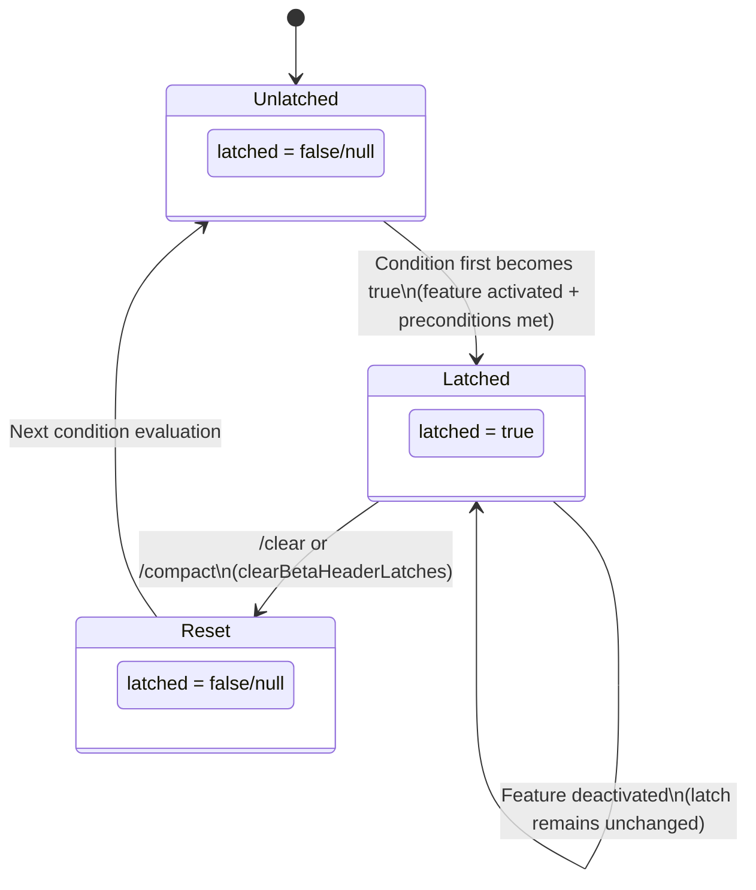

# Chapter 13: Cache Architecture와 Breakpoint 설계 (Cache Architecture and Breakpoint Design)

## 왜 중요한가 (Why This Matters)

Chapter 12에서 token budget 전략이 context window에 들어가는 콘텐츠의 크기를 어떻게 제어하는지 논의했다. 하지만 더 교묘한 비용 문제가 있다: **context window 내 콘텐츠가 완전히 동일하더라도, 매 API 호출마다 system prompt와 tool 정의에 대한 비용이 여전히 발생한다.**

일반적인 Claude Code 세션에서 system prompt는 약 11,000 token이며, 40개 이상의 tool에 대한 schema 정의가 추가로 ~20,000 token을 차지한다 — 이 "고정 오버헤드"만으로 호출당 30,000 token 이상이 소모된다. 50턴 세션에서 이는 1,500,000 token이 반복적으로 처리됨을 의미한다. Anthropic의 가격 정책에서 이는 무시할 수 없는 비용이다.

Anthropic의 Prompt Caching 메커니즘은 정확히 이 문제를 해결하기 위해 설계되었다: API 요청의 prefix가 이전 요청과 일치하면, 서버가 캐시된 KV 상태를 재사용하여 캐시된 부분의 비용을 90% 절감할 수 있다. 하지만 cache hit에는 엄격한 요건이 있다 — prefix가 **byte 단위로 정확히** 일치해야 한다. 단 한 글자만 달라져도 cache miss가 발생하며, 이를 "cache break"라 한다.

Claude Code는 이 제약 조건을 중심으로 정교한 cache architecture를 구축하며, 세 가지 cache scope level, 두 가지 TTL tier, 그리고 cache break를 방지하는 일련의 "latching" 메커니즘을 갖추고 있다. 이 Chapter에서는 이 architecture의 설계와 구현을 깊이 있게 다룬다.

---

## 13.1 Anthropic API Prompt Caching 기초 (Anthropic API Prompt Caching Fundamentals)

### Prefix Matching 모델 (Prefix Matching Model)

Anthropic의 prompt caching은 **prefix matching** 원리에 기반한다. 서버는 API 요청을 직렬화된 byte stream으로 취급하여, 처음부터 byte 단위로 비교한다. 불일치가 발견되면 해당 지점에서 cache가 "break"된다 — 그 이전 부분은 재사용할 수 있고, 그 이후 부분은 재계산해야 한다.

이는 cache의 효과가 전적으로 요청 prefix의 **안정성**에 달려 있음을 의미한다. API 요청의 직렬화 순서는 대략 다음과 같다:

```
[System Prompt] → [Tool Definitions] → [Message History]
```

system prompt와 tool 정의가 시퀀스의 앞부분에 위치한다 — 이들에 대한 변경은 전체 cache를 무효화한다. message history는 끝에 추가되므로, 새 메시지는 증분 부분에 대해서만 비용이 발생한다.

### cache_control 마커 (cache_control Markers)

caching을 활성화하려면 API 요청의 content block에 `cache_control` 마커를 추가한다:

```typescript
// Basic form of cache_control
{
  type: 'ephemeral'
}

// Extended form (1P exclusive)
{
  type: 'ephemeral',
  scope: 'global' | 'org',   // Cache scope
  ttl: '5m' | '1h'           // Cache time-to-live
}
```

`type: 'ephemeral'`은 유일하게 지원되는 cache 타입으로, 임시 cache breakpoint를 나타낸다. Claude Code는 `utils/api.ts` (lines 68–78)에서 전체 `cache_control` 옵션을 포함하는 확장 tool schema 타입을 정의한다:

```typescript
// utils/api.ts:68-78
type BetaToolWithExtras = BetaTool & {
  strict?: boolean
  defer_loading?: boolean
  cache_control?: {
    type: 'ephemeral'
    scope?: 'global' | 'org'
    ttl?: '5m' | '1h'
  }
  eager_input_streaming?: boolean
}
```

### Cache Breakpoint 배치 (Cache Breakpoint Placement)

Claude Code는 요청에 cache breakpoint를 신중하게 배치하며, `getCacheControl()` 함수(`services/api/claude.ts`, lines 358–374)를 통해 통합된 `cache_control` 객체를 생성한다:

```typescript
// services/api/claude.ts:358-374
export function getCacheControl({
  scope,
  querySource,
}: {
  scope?: CacheScope
  querySource?: QuerySource
} = {}): {
  type: 'ephemeral'
  ttl?: '1h'
  scope?: CacheScope
} {
  return {
    type: 'ephemeral',
    ...(should1hCacheTTL(querySource) && { ttl: '1h' }),
    ...(scope === 'global' && { scope }),
  }
}
```

이 함수는 단순해 보이지만, 모든 조건 분기에는 신중하게 고려된 caching 전략이 담겨 있다.

---

## 13.2 세 가지 Cache Scope Level (Three Cache Scope Levels)

Claude Code는 세 가지 cache scope를 사용하며, 각각 서로 다른 재사용 단위(granularity)에 대응한다. 이 scope들은 `splitSysPromptPrefix()` 함수(`utils/api.ts`, lines 321–435)를 통해 system prompt의 각 부분에 할당된다.

### Scope 정의 (Scope Definitions)

| Cache Scope | 식별자 | 재사용 단위 | 적용 대상 콘텐츠 | TTL |
|-------------|--------|------------|-----------------|-----|
| **Global Cache** | `'global'` | 조직 간, 사용자 간 공유 | 모든 Claude Code 인스턴스에서 공유되는 정적 prompt | 5분 (기본값) |
| **Organization Cache** | `'org'` | 동일 조직 내 사용자 간 공유 | 조직별이지만 사용자에 무관한 콘텐츠 | 5분 / 1시간 |
| **No Cache** | `null` | cache_control 미설정 | 고빈도 변경 콘텐츠 | N/A |

**Table 13-1: 세 가지 Cache Scope Level 비교**

> **Interactive 버전**: [cache hit 애니메이션 보기](cache-viz.html) — API 요청 cache matching 과정을 단계별로 보여주며, 3가지 시나리오 전환(첫 호출 / 동일 사용자 / 다른 사용자)을 지원하고, 실시간 hit rate와 비용 절감 계산을 제공한다.

### Global Cache Scope (global)

Global caching은 가장 공격적인 최적화다 — `global`로 표시된 콘텐츠는 모든 Claude Code 사용자 간에 KV cache를 공유할 수 있다. 이는 User A가 요청을 시작하고 system prompt의 정적 부분을 캐시하면, User B의 다음 요청이 해당 cache를 직접 hit할 수 있음을 의미한다.

Global caching의 적격 기준은 매우 엄격하다: 콘텐츠는 **완전히 불변**이어야 하며, 사용자별, 조직별, 심지어 시간별 정보도 포함할 수 없다. Claude Code는 "dynamic boundary marker"(`SYSTEM_PROMPT_DYNAMIC_BOUNDARY`)를 사용하여 system prompt를 정적 부분과 동적 부분으로 분리한다:

```typescript
// utils/api.ts:362-404 (simplified)
if (useGlobalCacheFeature) {
  const boundaryIndex = systemPrompt.findIndex(
    s => s === SYSTEM_PROMPT_DYNAMIC_BOUNDARY,
  )
  if (boundaryIndex !== -1) {
    // Content before the boundary → cacheScope: 'global'
    // Content after the boundary → cacheScope: null
    for (let i = 0; i < systemPrompt.length; i++) {
      if (i < boundaryIndex) {
        staticBlocks.push(block)
      } else {
        dynamicBlocks.push(block)
      }
    }
    // ...
    if (staticJoined)
      result.push({ text: staticJoined, cacheScope: 'global' })
    if (dynamicJoined)
      result.push({ text: dynamicJoined, cacheScope: null })
  }
}
```

boundary 이후의 동적 콘텐츠는 `cacheScope: null`로 표시된다는 점에 주목하라 — `org` level caching조차 사용하지 않는다. 동적 콘텐츠의 변경 빈도가 너무 높아 cache hit rate가 극히 낮을 것이며, cache breakpoint를 표시하는 것은 API 요청에 복잡성만 추가할 뿐이기 때문이다.

### Organization Cache Scope (org)

Global caching을 사용할 수 없는 경우(예: global cache 기능이 활성화되지 않았거나, 콘텐츠에 조직별 정보가 포함된 경우), Claude Code는 `org` level로 fallback한다:

```typescript
// utils/api.ts:411-435 (default mode)
let attributionHeader: string | undefined
let systemPromptPrefix: string | undefined
const rest: string[] = []

for (const block of systemPrompt) {
  if (block.startsWith('x-anthropic-billing-header')) {
    attributionHeader = block
  } else if (CLI_SYSPROMPT_PREFIXES.has(block)) {
    systemPromptPrefix = block
  } else {
    rest.push(block)
  }
}

const result: SystemPromptBlock[] = []
if (attributionHeader)
  result.push({ text: attributionHeader, cacheScope: null })
if (systemPromptPrefix)
  result.push({ text: systemPromptPrefix, cacheScope: 'org' })
const restJoined = rest.join('\n\n')
if (restJoined)
  result.push({ text: restJoined, cacheScope: 'org' })
```

여기서의 chunking 전략은 중요한 세부 사항을 드러낸다: **billing attribution header**(`x-anthropic-billing-header`)는 `null`로 표시되어 caching에서 제외된다. attribution header에는 사용자 식별 정보가 포함되어 `org` level에서도 공유할 수 없기 때문이다. CLI system prompt prefix(`CLI_SYSPROMPT_PREFIXES`)와 나머지 system prompt 콘텐츠는 모두 `org`로 표시되어 동일 조직 내에서 공유된다.

### MCP Tool에 대한 특수 처리 (Special Handling for MCP Tools)

사용자가 MCP tool을 구성하면, global caching 전략이 변경된다. MCP tool 정의는 외부 서버에서 제공되며 그 내용을 예측할 수 없기 때문에, 이를 global cache에 포함하면 hit rate가 떨어진다. Claude Code는 `skipGlobalCacheForSystemPrompt` 플래그를 통해 이를 처리한다:

```typescript
// utils/api.ts:326-360
if (useGlobalCacheFeature && options?.skipGlobalCacheForSystemPrompt) {
  logEvent('tengu_sysprompt_using_tool_based_cache', {
    promptBlockCount: systemPrompt.length,
  })
  // All content downgraded to org scope, skipping boundary markers
  // ...
}
```

이 다운그레이드는 보수적이지만 합리적이다 — 잦은 global cache miss의 위험을 감수하기보다, 더 안정적인 `org` level hit rate로 fallback하는 것이다.

---

## 13.3 Cache TTL Tier (Cache TTL Tiers)

### 기본 5분 vs 1시간 (Default 5 Minutes vs 1 Hour)

Anthropic의 prompt caching은 기본 TTL이 5분이다. 이는 사용자가 5분 이내에 새 API 요청을 시작하지 않으면 cache가 만료됨을 의미한다. 활발한 코딩 세션에서는 5분이 보통 충분하다. 하지만 깊은 사고나 문서 검토가 필요한 시나리오에서는 5분이 부족할 수 있다.

Claude Code는 TTL을 1시간으로 업그레이드하는 것을 지원하며, 이는 `should1hCacheTTL()` 함수(`services/api/claude.ts`, lines 393–434)에 의해 결정된다:

```typescript
// services/api/claude.ts:393-434
function should1hCacheTTL(querySource?: QuerySource): boolean {
  // 3P Bedrock users opt-in via environment variable
  if (
    getAPIProvider() === 'bedrock' &&
    isEnvTruthy(process.env.ENABLE_PROMPT_CACHING_1H_BEDROCK)
  ) {
    return true
  }

  // Latched eligibility check — prevents mid-session overage flips from changing TTL
  let userEligible = getPromptCache1hEligible()
  if (userEligible === null) {
    userEligible =
      process.env.USER_TYPE === 'ant' ||
      (isClaudeAISubscriber() && !currentLimits.isUsingOverage)
    setPromptCache1hEligible(userEligible)
  }
  if (!userEligible) return false

  // Cache allowlist — also latched to maintain session stability
  let allowlist = getPromptCache1hAllowlist()
  if (allowlist === null) {
    const config = getFeatureValue_CACHED_MAY_BE_STALE(
      'tengu_prompt_cache_1h_config', {}
    )
    allowlist = config.allowlist ?? []
    setPromptCache1hAllowlist(allowlist)
  }

  return (
    querySource !== undefined &&
    allowlist.some(pattern =>
      pattern.endsWith('*')
        ? querySource.startsWith(pattern.slice(0, -1))
        : querySource === pattern,
    )
  )
}
```

### 적격성 검사의 Latching 메커니즘 (The Latching Mechanism for Eligibility Checks)

`should1hCacheTTL()`에서 가장 핵심적인 설계는 **latching**이다. 첫 번째 호출 시, 함수는 사용자가 1시간 TTL에 적격한지 평가한 후, 그 결과를 전역 `STATE`(`bootstrap/state.ts`)에 저장한다:

```typescript
// bootstrap/state.ts:1700-1706
export function getPromptCache1hEligible(): boolean | null {
  return STATE.promptCache1hEligible
}

export function setPromptCache1hEligible(eligible: boolean | null): void {
  STATE.promptCache1hEligible = eligible
}
```

latching이 왜 필요한가? 다음 시나리오를 생각해 보라:

1. 세션 시작 시, 사용자가 구독 할당량 이내여서(`isUsingOverage === false`) 1시간 TTL을 받음
2. 30번째 턴에서 사용자가 할당량을 초과함(`isUsingOverage === true`)
3. TTL이 1시간에서 5분으로 떨어지면, `cache_control` 객체의 직렬화가 변경됨
4. 이 변경으로 API 요청 prefix가 더 이상 일치하지 않게 됨 — **cache break**

한 번의 overage 상태 전환으로 ~20,000 token의 system prompt 및 tool 정의 cache가 무효화되는 것은 명백히 수용할 수 없다. latching 메커니즘은 세션 시작 시 TTL tier가 결정되면 세션 전체에 걸쳐 일정하게 유지되도록 보장한다.

동일한 latching 로직이 GrowthBook allowlist 설정에도 적용된다 — 세션 중 GrowthBook disk cache 업데이트가 TTL 동작 변경을 유발하는 것을 방지한다.

### TTL Tier 결정 테이블 (TTL Tier Decision Table)

| 조건 | TTL | 비고 |
|------|-----|------|
| 3P Bedrock + `ENABLE_PROMPT_CACHING_1H_BEDROCK=1` | 1시간 | Bedrock 사용자는 자체 billing 관리 |
| Anthropic 직원 (`USER_TYPE=ant`) | 1시간 | 내부 사용자 |
| Claude AI 구독자 + 할당량 미초과 | 1시간 | GrowthBook allowlist 통과 필요 |
| 그 외 모든 사용자 | 5분 | 기본값 |

**Table 13-2: Cache TTL 결정 매트릭스**

---

## 13.4 Beta Header Latching 메커니즘 (Beta Header Latching Mechanism)

### 문제: 동적 Header가 유발하는 Cache Busting (The Problem: Dynamic Headers Causing Cache Busting)

Anthropic API 요청에는 클라이언트가 사용하는 실험적 기능을 식별하는 "beta header" 세트가 포함된다. 이 header들은 서버 측 cache key의 일부다 — header를 추가하거나 제거하면 cache key가 변경되어 cache break가 발생한다.

Claude Code에는 세션 도중 동적으로 활성화/비활성화될 수 있는 여러 기능이 있다:

- **AFK Mode** (Auto Mode): 사용자가 자리를 비웠을 때 자동으로 작업을 실행
- **Fast Mode**: 더 빠르지만 잠재적으로 더 비싼 모델을 사용
- **Cache Editing** (Cached Microcompact): cache 내에서 증분 편집을 수행

이 기능들 중 하나가 상태를 변경할 때마다, 대응하는 beta header가 추가되거나 제거되어 cache break를 유발한다. 코드 주석(`services/api/claude.ts`, lines 1405–1410)이 이 문제를 명시적으로 기술한다:

```typescript
// services/api/claude.ts:1405-1410
// Sticky-on latches for dynamic beta headers. Each header, once first
// sent, keeps being sent for the rest of the session so mid-session
// toggles don't change the server-side cache key and bust ~50-70K tokens.
// Latches are cleared on /clear and /compact via clearBetaHeaderLatches().
// Per-call gates (isAgenticQuery, querySource===repl_main_thread) stay
// per-call so non-agentic queries keep their own stable header set.
```

### Latching 구현 (Latching Implementation)

Claude Code의 해결책은 "sticky-on" latching이다 — 한 번이라도 세션에서 beta header가 전송되면, 이를 트리거한 기능이 비활성화되더라도 세션이 끝날 때까지 계속 전송된다.

다음은 세 가지 beta header의 latching 코드다(`services/api/claude.ts`, lines 1412–1442):

**AFK Mode Header:**

```typescript
// services/api/claude.ts:1412-1423
let afkHeaderLatched = getAfkModeHeaderLatched() === true
if (feature('TRANSCRIPT_CLASSIFIER')) {
  if (
    !afkHeaderLatched &&
    isAgenticQuery &&
    shouldIncludeFirstPartyOnlyBetas() &&
    (autoModeStateModule?.isAutoModeActive() ?? false)
  ) {
    afkHeaderLatched = true
    setAfkModeHeaderLatched(true)
  }
}
```

**Fast Mode Header:**

```typescript
// services/api/claude.ts:1425-1429
let fastModeHeaderLatched = getFastModeHeaderLatched() === true
if (!fastModeHeaderLatched && isFastMode) {
  fastModeHeaderLatched = true
  setFastModeHeaderLatched(true)
}
```

**Cache Editing Header:**

```typescript
// services/api/claude.ts:1431-1442
let cacheEditingHeaderLatched = getCacheEditingHeaderLatched() === true
if (feature('CACHED_MICROCOMPACT')) {
  if (
    !cacheEditingHeaderLatched &&
    cachedMCEnabled &&
    getAPIProvider() === 'firstParty' &&
    options.querySource === 'repl_main_thread'
  ) {
    cacheEditingHeaderLatched = true
    setCacheEditingHeaderLatched(true)
  }
}
```

### Latching 상태 다이어그램 (Latching State Diagram)

세 가지 beta header 모두 동일한 상태 전이 패턴을 따른다:



**Figure 13-1: Beta Header Latching 상태 다이어그램**

핵심 속성:

1. **단방향 latching**: false에서 true로의 전환은 (현재 세션 내에서) 비가역적이다
2. **조건부 트리거**: 각 header는 고유한 전제 조건 세트를 가진다
3. **세션 한정**: `/clear`와 `/compact` 명령만이 latch 상태를 초기화한다
4. **쿼리 격리**: `isAgenticQuery`와 `querySource` 같은 조건은 호출별로 평가되어, 비-agentic 쿼리가 자체적으로 안정적인 header set을 유지하도록 보장한다

### Latching 요약 테이블 (Latching Summary Table)

| Beta Header | Latch 변수 | 전제 조건 | 초기화 트리거 |
|-------------|-----------|----------|-------------|
| AFK Mode | `afkModeHeaderLatched` | `TRANSCRIPT_CLASSIFIER` 활성화 + agentic query + 1P only + auto mode 활성 | `/clear`, `/compact` |
| Fast Mode | `fastModeHeaderLatched` | Fast mode 가용 + cooldown 없음 + 모델 지원 + 요청에서 활성화 | `/clear`, `/compact` |
| Cache Editing | `cacheEditingHeaderLatched` | `CACHED_MICROCOMPACT` 활성화 + cachedMC 가용 + 1P + main thread | `/clear`, `/compact` |

**Table 13-3: Beta Header Latching 상세**

---

## 13.5 Thinking Clear Latching

Beta header latching 외에도 특수한 latching 메커니즘이 하나 더 있다 — `thinkingClearLatched`(`services/api/claude.ts`, lines 1446–1456):

```typescript
// services/api/claude.ts:1446-1456
let thinkingClearLatched = getThinkingClearLatched() === true
if (!thinkingClearLatched && isAgenticQuery) {
  const lastCompletion = getLastApiCompletionTimestamp()
  if (
    lastCompletion !== null &&
    Date.now() - lastCompletion > CACHE_TTL_1HOUR_MS
  ) {
    thinkingClearLatched = true
    setThinkingClearLatched(true)
  }
}
```

이 latch는 마지막 API 완료 이후 1시간 이상 경과(`CACHE_TTL_1HOUR_MS = 60 * 60 * 1000`)했을 때 트리거된다. 이 시점에서는 1시간 TTL을 사용하더라도 cache가 이미 만료된 상태다. Thinking Clear는 이 신호를 활용하여 thinking block 처리를 최적화한다 — cache가 이미 무효화되었으므로, 축적된 thinking 콘텐츠를 정리하여 이후 요청의 token 소비를 줄일 수 있다.

---

## 13.6 Cache Architecture 개요 (Cache Architecture Overview)

위의 모든 메커니즘을 결합하면, Claude Code의 cache architecture를 다음과 같은 계층으로 요약할 수 있다:

```
┌──────────────────────────────────────────────────────────┐
│                   API Request Construction                │
│                                                          │
│  ┌── System Prompt ──┐   ┌── Tool Defs ──┐   ┌── Msgs ─┐│
│  │                   │   │               │   │         ││
│  │ [attribution]     │   │ [tool 1]      │   │ [msg 1] ││
│  │  scope: null      │   │  scope: org   │   │         ││
│  │                   │   │               │   │ [msg 2] ││
│  │ [prefix]          │   │ [tool 2]      │   │         ││
│  │  scope: org/null  │   │  scope: org   │   │ [msg N] ││
│  │                   │   │               │   │         ││
│  │ [static]          │   │ [tool N]      │   │         ││
│  │  scope: global    │   │  scope: org   │   │         ││
│  │                   │   │               │   │         ││
│  │ [dynamic]         │   │               │   │         ││
│  │  scope: null      │   │               │   │         ││
│  └───────────────────┘   └───────────────┘   └─────────┘│
│                                                          │
│  ────────── Prefix matching direction ──────────────→    │
│                                                          │
├──────────────────────────────────────────────────────────┤
│                     TTL Decision Layer                    │
│                                                          │
│  should1hCacheTTL() → latch → session stability          │
│                                                          │
├──────────────────────────────────────────────────────────┤
│                 Beta Header Latching Layer                │
│                                                          │
│  afkMode / fastMode / cacheEditing → sticky-on           │
│                                                          │
├──────────────────────────────────────────────────────────┤
│                 Cache Break Detection Layer               │
│  (see Chapter 14)                                        │
└──────────────────────────────────────────────────────────┘
```

**Figure 13-2: Claude Code Cache Architecture 개요**

---

## 13.7 설계 인사이트 (Design Insights)

### Latching은 Cache 안정성의 핵심 패턴이다 (Latching Is the Core Pattern for Cache Stability)

Claude Code는 caching 코드 전반에서 동일한 패턴을 반복적으로 사용한다: **한 번 평가 → latch → 세션 안정성**. 이 패턴은 다음에서 나타난다:

- TTL 적격성 검사 (`should1hCacheTTL`)
- TTL allowlist 설정
- Beta header 전송 상태
- Thinking clear 트리거

모든 latch는 동일한 목적을 수행한다: 세션 중 상태 변경이 직렬화된 API 요청을 변경하는 것을 방지하여, cache prefix의 무결성을 보호하는 것이다.

### Cache Scope는 비용 대 Hit Rate의 Trade-off다 (Cache Scopes Are a Cost-vs-Hit-Rate Trade-off)

세 가지 cache scope level은 명확한 엔지니어링 trade-off를 구현한다:

- **global** scope는 가장 높은 hit rate를 가지지만(모든 사용자 간 공유), 절대적으로 정적인 콘텐츠를 요구한다
- **org** scope는 적당한 hit rate를 가지며, 조직 수준의 차이를 허용한다
- **null**은 cache marking을 건너뛰어, 요청 복잡성만 추가할 비효과적인 caching 시도를 방지한다

Claude Code의 전략은 "가능하면 global, 아니면 org, 둘 다 안 되면 포기"이다 — 획일적 접근보다 더 세분화되고 효과적이다.

### MCP Tool은 Cache의 최대 적이다 (MCP Tools Are the Cache's Worst Enemy)

MCP tool의 도입은 caching에 심각한 도전을 제시한다. MCP 서버는 세션 도중 연결되거나 연결 해제될 수 있으며, tool 정의가 언제든 변경될 수 있다. MCP tool이 감지되면, system prompt의 global cache가 org level로 다운그레이드되고(`skipGlobalCacheForSystemPrompt`), tool caching 전략이 system prompt 내장 방식에서 독립적인 `tool_based` 전략으로 전환된다. 이러한 degradation 조치는 Chapter 15의 cache 최적화 패턴에서 더 자세히 다룬다.

---

## 사용자가 할 수 있는 것 (What Users Can Do)

이 Chapter에서 분석한 cache architecture를 바탕으로, cache 친화적인 시스템을 구축하기 위한 실용적 가이드라인을 제시한다:

1. **Prefix matching 의미론을 이해하라**: Anthropic의 caching은 엄격한 prefix matching을 사용한다. API 요청을 구성할 때, 가장 안정적이고 변경 가능성이 낮은 콘텐츠를 항상 앞에(정적 system prompt), 동적 콘텐츠(사용자 메시지, 첨부 파일)를 뒤에 배치하라.

2. **System prompt에 맞는 cache scope를 설계하라**: 애플리케이션이 다수의 사용자를 서비스한다면, 어떤 prompt 콘텐츠가 전역적으로 공유되는지(`global` scope에 적합), 어떤 것이 조직 수준인지(`org` scope에 적합), 어떤 것이 완전히 동적인지(`cache_control`을 표시하지 말 것)를 식별하라. 획일적인 caching 전략은 hit rate를 낭비한다.

3. **Latching 패턴을 사용하여 cache key 안정성을 보호하라**: 세션 도중 변경될 수 있는 모든 설정(feature flag, 사용자 할당량 상태, 기능 토글) — 이것이 직렬화된 API 요청에 영향을 미친다면 — 세션 시작 시 latch해야 한다. latching의 핵심 원칙: 약간 오래된 값을 사용하는 것이 세션 도중 cache key가 변경되는 것보다 낫다.

4. **MCP tool이 caching에 미치는 영향에 주의하라**: 애플리케이션이 외부 tool(MCP 또는 유사)을 통합한다면, 그 동적 특성이 cache hit rate를 크게 감소시킨다. 외부 tool 정의를 핵심 tool과 별도로 처리하거나, 외부 tool이 감지되면 caching 전략을 다운그레이드하는 것을 고려하라.

5. **`cache_read_input_tokens`를 모니터링하라**: 이것은 cache 상태의 유일하게 신뢰할 수 있는 지표다. 기준선을 설정한 후, 유의미한 하락이 있으면 조사할 가치가 있다. Cache break 감지 시스템에 대해서는 Chapter 14를 참고하라.

### Claude Code 사용자를 위한 조언 (Advice for Claude Code Users)

1. **System prompt를 안정적으로 유지하라.** CLAUDE.md를 수정할 때마다 cache prefix가 무효화될 수 있다. CLAUDE.md를 자주 편집한다면, 실험적 지시사항을 파일에 저장하기보다 세션 수준(`/memory` 또는 대화 내 지시)에 배치하는 것을 고려하라.
2. **모델 전환을 자주 하지 마라.** 모델을 전환하면 cache prefix가 완전히 무효화된다 — Opus와 Sonnet은 서로 다른 system prompt를 가지며, 전환 후 모든 caching이 처음부터 시작된다. 강력한 모델이 필요한 작업에는 Opus를, 가벼운 작업에는 Sonnet을 집중적으로 사용하라.
3. **`/compact` 사용 시점을 잘 맞춰라.** 수동 compaction 후, CC가 cache prefix를 재구축한다. 많은 tool 호출(예: 일괄 파일 수정)을 할 예정이라면, 먼저 compact하면 더 긴 유효 cache 기간을 확보할 수 있다.
4. **Cache hit 지표를 확인하라.** `--verbose` 모드에서 CC는 `cache_read_input_tokens`를 보고한다 — 이 수치가 0에 가깝고 `input_tokens`가 높다면, cache가 자주 무효화되고 있다는 뜻이므로 원인을 조사해야 한다.

---

## 요약 (Summary)

이 Chapter에서는 Claude Code의 prompt cache architecture를 해부했다:

1. **Prefix matching 모델**은 API 요청 prefix의 byte 단위 안정성을 요구한다; 어떤 변경이든 cache break를 유발한다
2. **세 가지 cache scope level**(global/org/null)은 hit rate와 유연성 사이에서 세분화된 trade-off를 만든다
3. **TTL tier**(5분 / 1시간)는 latching 메커니즘을 통해 세션 내 안정성을 보장한다
4. **Beta header latching**은 sticky-on 패턴을 사용하여 기능 토글이 cache key를 변경하는 것을 방지한다

이 메커니즘들이 함께 cache의 "보호 계층"을 형성한다. 하지만 보호만으로는 충분하지 않다 — cache break가 실제로 발생했을 때, 시스템은 그 원인을 감지하고 진단할 수 있어야 한다. Chapter 14에서는 cache break 감지 시스템의 2단계 architecture를 깊이 다룬다.
