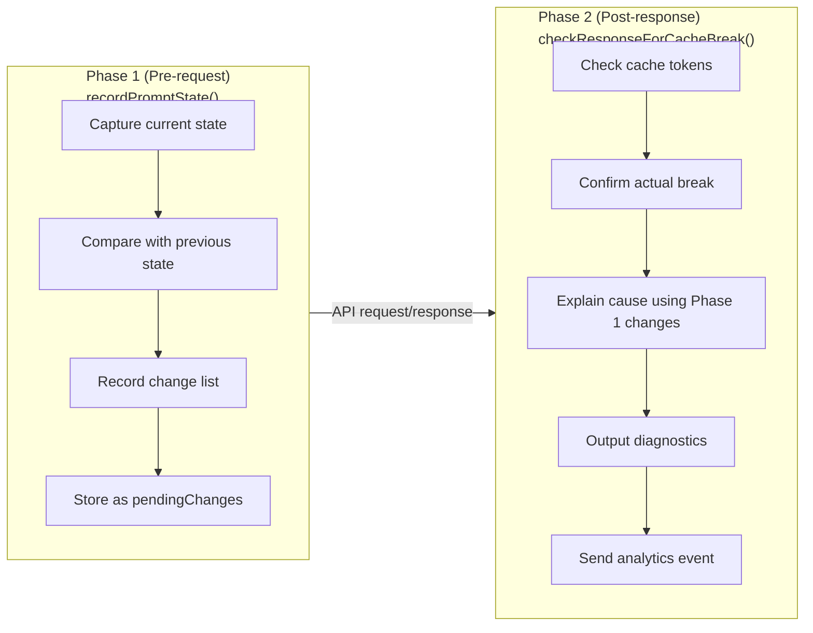

# Chapter 14: Cache Break 감지 시스템 (Cache Break Detection System)

## 이것이 중요한 이유 (Why This Matters)

Chapter 13에서 Claude Code가 latching 메커니즘과 신중하게 설계된 cache scope를 사용하여 cache break를 **방지**하는 방법을 살펴보았다. 그러나 이러한 보호 장치에도 불구하고 cache break는 여전히 발생한다 — MCP server 재연결로 인한 tool 정의 변경, 새로운 첨부 파일로 인한 system prompt 증가, model 전환, effort 조정, 심지어 GrowthBook 원격 설정 업데이트까지 모두 API 요청 prefix를 변경할 수 있다.

더 까다로운 점은 cache break가 "조용하다(silent)"는 것이다. API 응답의 `cache_read_input_tokens`가 떨어지지만, 그 이유를 알려주는 오류 메시지는 없다. 개발자는 비용이 올라가고 latency가 증가하는 것만 알아챌 뿐, 근본 원인을 알 수 없다.

Claude Code는 이 문제를 해결하기 위해 2단계 cache break 감지 시스템을 구축했다. 전체 시스템은 `services/api/promptCacheBreakDetection.ts` (728줄)에 구현되어 있으며, Claude Code에서 기능이 아닌 순수하게 **관측가능성(observability)**에만 전념하는 몇 안 되는 하위 시스템 중 하나다.

---

## 14.1 2단계 감지 아키텍처 (Two-Phase Detection Architecture)

### 설계 근거 (Design Rationale)

Cache break 감지는 타이밍 문제에 직면한다:

1. **변경은 요청이 전송되기 전에 발생한다**: system prompt 변경, tool 추가/제거, beta header 전환
2. **break 확인은 응답이 반환된 후에야 가능하다**: `cache_read_input_tokens`의 하락을 관찰해야만 cache가 실제로 무효화되었는지 확인할 수 있다

Phase 2만으로는 불충분하다 — token 하락이 감지되었을 때는 이미 요청이 전송되었고 이전 상태가 소실되어 원인을 추적할 수 없다. Phase 1만으로도 불충분하다 — 많은 클라이언트 측 변경이 반드시 서버 측 cache break를 유발하지는 않는다 (예: 서버가 해당 prefix를 아직 캐시하지 않았을 수 있다).

Claude Code의 해결책은 감지를 두 단계로 분리한다:



**Figure 14-1: 2단계 감지 시퀀스 다이어그램**

### 호출 지점 (Call Sites)

두 단계는 `services/api/claude.ts`에서 호출된다:

**Phase 1**은 API 요청 구성 중에 호출된다 (lines 1460-1486):

```typescript
// services/api/claude.ts:1460-1486
if (feature('PROMPT_CACHE_BREAK_DETECTION')) {
  const toolsForCacheDetection = allTools.filter(
    t => !('defer_loading' in t && t.defer_loading),
  )
  recordPromptState({
    system,
    toolSchemas: toolsForCacheDetection,
    querySource: options.querySource,
    model: options.model,
    agentId: options.agentId,
    fastMode: fastModeHeaderLatched,
    globalCacheStrategy,
    betas,
    autoModeActive: afkHeaderLatched,
    isUsingOverage: currentLimits.isUsingOverage ?? false,
    cachedMCEnabled: cacheEditingHeaderLatched,
    effortValue: effort,
    extraBodyParams: getExtraBodyParams(),
  })
}
```

두 가지 핵심 설계 결정에 주목하라:

1. **defer_loading tool 제외**: API는 자동으로 deferred tool을 제거한다 — 이들은 실제 cache key에 영향을 미치지 않는다. 이들을 포함하면 tool이 발견되거나 MCP server가 재연결될 때 false positive가 발생할 수 있다.
2. **latched 값 전달**: `fastModeHeaderLatched`, `afkHeaderLatched`, `cacheEditingHeaderLatched`는 실시간 상태가 아닌 latched 값이다. cache key는 사용자의 현재 설정이 아닌 실제로 전송된 header에 의해 결정되기 때문이다.

**Phase 2**는 API 응답 처리가 완료된 후 호출되며, 응답에서 cache token 통계를 수신한다.

---

## 14.2 PreviousState: 전체 상태 스냅샷 (Full State Snapshot)

Phase 1의 핵심은 `PreviousState` 타입으로 — 서버 측 cache key에 영향을 줄 수 있는 모든 클라이언트 측 상태를 캡처한다.

### 필드 목록 (Field Inventory)

`PreviousState`는 `promptCacheBreakDetection.ts` (lines 28-69)에 정의되어 있으며, 15개 이상의 필드를 포함한다:

| 필드 | 타입 | 용도 | 변경 원인 |
|------|------|------|-----------|
| `systemHash` | `number` | system prompt 콘텐츠 hash (cache_control 제외) | Prompt 콘텐츠 변경 |
| `toolsHash` | `number` | 집계된 tool schema hash (cache_control 제외) | Tool 추가/제거 또는 정의 변경 |
| `cacheControlHash` | `number` | system block의 cache_control hash | Scope 또는 TTL 전환 |
| `toolNames` | `string[]` | tool 이름 목록 | Tool 추가/제거 |
| `perToolHashes` | `Record<string, number>` | 개별 tool당 hash | 단일 tool schema 변경 |
| `systemCharCount` | `number` | system prompt 총 문자 수 | 콘텐츠 추가/제거 |
| `model` | `string` | 현재 model 식별자 | Model 전환 |
| `fastMode` | `boolean` | Fast Mode 상태 (latch 후) | Fast Mode 활성화 |
| `globalCacheStrategy` | `string` | cache strategy 유형 | MCP tool 발견/제거 |
| `betas` | `string[]` | 정렬된 beta header 목록 | Beta header 변경 |
| `autoModeActive` | `boolean` | AFK Mode 상태 (latch 후) | Auto Mode 활성화 |
| `isUsingOverage` | `boolean` | 초과 사용 상태 (latch 후) | Quota 상태 변경 |
| `cachedMCEnabled` | `boolean` | cache editing 상태 (latch 후) | Cached MC 활성화 |
| `effortValue` | `string` | 해석된(resolved) effort 값 | Effort 설정 변경 |
| `extraBodyHash` | `number` | 추가 요청 body 파라미터 hash | CLAUDE_CODE_EXTRA_BODY 변경 |
| `callCount` | `number` | 현재 tracking key의 호출 횟수 | 자동 증가 |
| `pendingChanges` | `PendingChanges \| null` | Phase 1이 감지한 변경 사항 | Phase 1 비교 결과 |
| `prevCacheReadTokens` | `number \| null` | 마지막 응답의 cache read token | Phase 2 업데이트 |
| `cacheDeletionsPending` | `boolean` | cache_edits 삭제가 확인 대기 중인지 여부 | Cached MC 삭제 연산 |
| `buildDiffableContent` | `() => string` | 지연 계산되는 diff 가능 콘텐츠 | 디버그 출력에 사용 |

**Table 14-1: 전체 PreviousState 필드 목록**

### Hashing 전략 (Hashing Strategy)

`PreviousState`는 서로 다른 감지 세밀도(granularity)를 위해 여러 hash 필드를 포함한다:

```typescript
// promptCacheBreakDetection.ts:170-179
function computeHash(data: unknown): number {
  const str = jsonStringify(data)
  if (typeof Bun !== 'undefined') {
    const hash = Bun.hash(str)
    return typeof hash === 'bigint' ? Number(hash & 0xffffffffn) : hash
  }
  return djb2Hash(str)
}
```

**systemHash와 cacheControlHash의 분리**는 특별한 주의를 기울일 만하다:

```typescript
// promptCacheBreakDetection.ts:274-281
const systemHash = computeHash(strippedSystem)  // excluding cache_control
const cacheControlHash = computeHash(           // cache_control only
  system.map(b => ('cache_control' in b ? b.cache_control : null)),
)
```

`systemHash`는 `stripCacheControl()`로 `cache_control` 마커를 제거한 후의 system prompt 콘텐츠를 hash한다. `cacheControlHash`는 `cache_control` 마커만을 hash한다. 왜 분리하는가? cache scope 전환(global에서 org으로)이나 TTL 전환(1시간에서 5분으로)은 prompt 텍스트 콘텐츠를 변경하지 않기 때문이다 — `systemHash`만 보면 이러한 전환을 놓치게 된다. 분리 후에는 `cacheControlChanged`가 이런 종류의 변경을 독립적으로 포착할 수 있다.

**perToolHashes의 on-demand 계산**도 성능 최적화다:

```typescript
// promptCacheBreakDetection.ts:285-286
const computeToolHashes = () =>
  computePerToolHashes(strippedTools, toolNames)
```

`perToolHashes`는 집계된 tool schema hash가 변경되었을 때 정확히 어떤 tool이 변경되었는지 pinpoint하는 데 사용되는 tool별 hash 테이블이다. 그러나 tool별 hash 계산은 비용이 크기 때문에(N번의 `jsonStringify` 호출) `toolsHash`가 변경될 때만 트리거된다. 주석(line 37)은 BigQuery 데이터를 인용한다: **tool schema 변경의 77%는 tool 추가/제거가 아닌 단일 tool의 description 변경이다**. `perToolHashes`는 정확히 그 77%를 진단하기 위해 설계되었다.

### Tracking Key와 격리 전략 (Tracking Key and Isolation Strategy)

각 query source는 독립적인 `PreviousState`를 유지하며, Map에 저장된다:

```typescript
// promptCacheBreakDetection.ts:101-107
const previousStateBySource = new Map<string, PreviousState>()

const MAX_TRACKED_SOURCES = 10

const TRACKED_SOURCE_PREFIXES = [
  'repl_main_thread',
  'sdk',
  'agent:custom',
  'agent:default',
  'agent:builtin',
]
```

Tracking key는 `getTrackingKey()` 함수(lines 149-158)에 의해 계산된다:

```typescript
// promptCacheBreakDetection.ts:149-158
function getTrackingKey(
  querySource: QuerySource,
  agentId?: AgentId,
): string | null {
  if (querySource === 'compact') return 'repl_main_thread'
  for (const prefix of TRACKED_SOURCE_PREFIXES) {
    if (querySource.startsWith(prefix)) return agentId || querySource
  }
  return null
}
```

몇 가지 중요한 설계 결정이 있다:

1. **compact는 메인 스레드의 tracking 상태를 공유한다**: Compaction은 동일한 `cacheSafeParams`를 사용하고 cache key를 공유하므로, 감지 상태도 공유해야 한다
2. **Sub-agent는 agentId로 격리된다**: 동일한 유형의 여러 동시 agent 인스턴스 간 false positive를 방지한다
3. **추적되지 않는 query source**는 `null`을 반환한다: `speculation`, `session_memory`, `prompt_suggestion` 및 기타 단기 agent는 1-3턴만 실행되며 전후 비교 가치가 없다
4. **Map 용량 제한**: `MAX_TRACKED_SOURCES = 10`으로, 많은 sub-agent agentId로 인한 무한 메모리 증가를 방지한다

---

## 14.3 Phase 1: recordPromptState() 심층 분석 (Deep Dive)

### 첫 번째 호출: Baseline 설정 (First Call: Establishing the Baseline)

`recordPromptState()`의 첫 번째 호출 시에는 비교할 이전 상태가 없다. 함수는 두 가지만 수행한다:

1. Map 용량을 확인하고, 한도에 도달하면 가장 오래된 항목을 제거한다
2. `pendingChanges`를 `null`로 설정한 초기 `PreviousState` 스냅샷을 생성한다

```typescript
// promptCacheBreakDetection.ts:298-328
if (!prev) {
  while (previousStateBySource.size >= MAX_TRACKED_SOURCES) {
    const oldest = previousStateBySource.keys().next().value
    if (oldest !== undefined) previousStateBySource.delete(oldest)
  }

  previousStateBySource.set(key, {
    systemHash,
    toolsHash,
    cacheControlHash,
    toolNames,
    // ... all initial values
    callCount: 1,
    pendingChanges: null,
    prevCacheReadTokens: null,
    cacheDeletionsPending: false,
    buildDiffableContent: lazyDiffableContent,
    perToolHashes: computeToolHashes(),
  })
  return
}
```

### 후속 호출: 변경 감지 (Subsequent Calls: Change Detection)

후속 호출 시 함수는 각 필드를 이전 상태와 비교한다:

```typescript
// promptCacheBreakDetection.ts:332-346
const systemPromptChanged = systemHash !== prev.systemHash
const toolSchemasChanged = toolsHash !== prev.toolsHash
const modelChanged = model !== prev.model
const fastModeChanged = isFastMode !== prev.fastMode
const cacheControlChanged = cacheControlHash !== prev.cacheControlHash
const globalCacheStrategyChanged =
  globalCacheStrategy !== prev.globalCacheStrategy
const betasChanged =
  sortedBetas.length !== prev.betas.length ||
  sortedBetas.some((b, i) => b !== prev.betas[i])
const autoModeChanged = autoModeActive !== prev.autoModeActive
const overageChanged = isUsingOverage !== prev.isUsingOverage
const cachedMCChanged = cachedMCEnabled !== prev.cachedMCEnabled
const effortChanged = effortStr !== prev.effortValue
const extraBodyChanged = extraBodyHash !== prev.extraBodyHash
```

어떤 필드라도 변경되었으면, 함수는 `PendingChanges` 객체를 구성한다:

```typescript
// promptCacheBreakDetection.ts:71-99
type PendingChanges = {
  systemPromptChanged: boolean
  toolSchemasChanged: boolean
  modelChanged: boolean
  fastModeChanged: boolean
  cacheControlChanged: boolean
  globalCacheStrategyChanged: boolean
  betasChanged: boolean
  autoModeChanged: boolean
  overageChanged: boolean
  cachedMCChanged: boolean
  effortChanged: boolean
  extraBodyChanged: boolean
  addedToolCount: number
  removedToolCount: number
  systemCharDelta: number
  addedTools: string[]
  removedTools: string[]
  changedToolSchemas: string[]
  previousModel: string
  newModel: string
  prevGlobalCacheStrategy: string
  newGlobalCacheStrategy: string
  addedBetas: string[]
  removedBetas: string[]
  prevEffortValue: string
  newEffortValue: string
  buildPrevDiffableContent: () => string
}
```

`PendingChanges`는 무언가가 변경**되었는지**(boolean flag)뿐만 아니라 **어떻게** 변경되었는지도 기록한다 (어떤 tool이 추가/제거되었는지, 추가/제거된 beta header 목록, 문자 수 변화량 등). 이러한 세부 사항은 Phase 2의 break 설명에 매우 중요하다.

### Tool 변경의 정밀한 귀인 (Precise Attribution of Tool Changes)

`toolSchemasChanged`가 true일 때, 시스템은 구체적으로 어떤 tool이 변경되었는지 추가 분석한다:

```typescript
// promptCacheBreakDetection.ts:366-378
if (toolSchemasChanged) {
  const newHashes = computeToolHashes()
  for (const name of toolNames) {
    if (!prevToolSet.has(name)) continue
    if (newHashes[name] !== prev.perToolHashes[name]) {
      changedToolSchemas.push(name)
    }
  }
  prev.perToolHashes = newHashes
}
```

이 코드는 tool 변경을 세 가지 유형으로 분류한다:
- **추가된 tool**: 새 목록에 있지만 이전 목록에 없는 것 (`addedTools`)
- **제거된 tool**: 이전 목록에 있지만 새 목록에 없는 것 (`removedTools`)
- **Schema 변경**: tool은 여전히 존재하지만 schema hash가 다른 것 (`changedToolSchemas`)

세 번째 범주가 가장 흔하다 — AgentTool과 SkillTool의 description은 세션 상태에 따라 변하는 동적 agent 목록과 command 목록을 내장하고 있다.

---

## 14.4 Phase 2: checkResponseForCacheBreak() 심층 분석 (Deep Dive)

### Break 판정 기준 (Break Determination Criteria)

Phase 2는 API 응답이 반환된 후 호출된다. 핵심 로직은 cache가 실제로 무효화되었는지 판정한다:

```typescript
// promptCacheBreakDetection.ts:485-493
const tokenDrop = prevCacheRead - cacheReadTokens
if (
  cacheReadTokens >= prevCacheRead * 0.95 ||
  tokenDrop < MIN_CACHE_MISS_TOKENS
) {
  state.pendingChanges = null
  return
}
```

판정에는 이중 임계값(dual threshold)을 사용한다:

1. **상대 임계값**: cache read token이 5% 이상 하락 (`< prevCacheRead * 0.95`)
2. **절대 임계값**: 하락량이 2,000 token 초과 (`MIN_CACHE_MISS_TOKENS = 2_000`)

두 조건이 **동시에** 충족되어야 break 경보가 발생한다. 이는 두 가지 유형의 false positive를 방지한다:

- 소규모 변동: cache token 수의 자연적인 변동(수백 token)은 경보를 트리거하지 않는다
- 비율 증폭: baseline이 작을 때(예: 1,000 token), 5% 변동은 50 token에 불과하다 — 경보할 가치가 없다

### 특수 케이스: Cache 삭제 (Special Case: Cache Deletion)

Cache editing (Cached Microcompact)은 `cache_edits`를 통해 cache에서 콘텐츠 블록을 능동적으로 삭제할 수 있다. 이는 합법적으로 `cache_read_input_tokens`를 하락시킨다 — 이는 예상된 동작이며 break 경보를 트리거해서는 안 된다:

```typescript
// promptCacheBreakDetection.ts:473-481
if (state.cacheDeletionsPending) {
  state.cacheDeletionsPending = false
  logForDebugging(
    `[PROMPT CACHE] cache deletion applied, cache read: ` +
    `${prevCacheRead} → ${cacheReadTokens} (expected drop)`,
  )
  state.pendingChanges = null
  return
}
```

`cacheDeletionsPending` flag는 `notifyCacheDeletion()` 함수(lines 673-682)를 통해 설정되며, cache editing 모듈이 삭제 연산을 전송할 때 호출된다.

### 특수 케이스: Compaction

Compaction 연산(`/compact`)은 메시지 수를 크게 줄여 cache read token이 자연적으로 하락하게 만든다. `notifyCompaction()` 함수(lines 689-698)는 `prevCacheReadTokens`를 `null`로 리셋하여 이를 처리한다 — 다음 호출은 비교 없는 "첫 번째 호출"로 취급된다:

```typescript
// promptCacheBreakDetection.ts:689-698
export function notifyCompaction(
  querySource: QuerySource,
  agentId?: AgentId,
): void {
  const key = getTrackingKey(querySource, agentId)
  const state = key ? previousStateBySource.get(key) : undefined
  if (state) {
    state.prevCacheReadTokens = null
  }
}
```

---

## 14.5 Break 설명 엔진 (Break Explanation Engine)

Cache break가 확인되면, 시스템은 Phase 1에서 수집한 `PendingChanges`를 사용하여 사람이 읽을 수 있는 설명을 구성한다. 설명 엔진은 `checkResponseForCacheBreak()`의 lines 495-588에 위치한다:

### 클라이언트 측 귀인 (Client-Side Attribution)

`PendingChanges`의 어떤 변경 flag라도 true이면, 시스템은 해당하는 설명 텍스트를 생성한다:

```typescript
// promptCacheBreakDetection.ts:496-563 (simplified)
const parts: string[] = []
if (changes) {
  if (changes.modelChanged) {
    parts.push(`model changed (${changes.previousModel} → ${changes.newModel})`)
  }
  if (changes.systemPromptChanged) {
    const charInfo = charDelta > 0 ? ` (+${charDelta} chars)` : ` (${charDelta} chars)`
    parts.push(`system prompt changed${charInfo}`)
  }
  if (changes.toolSchemasChanged) {
    const toolDiff = changes.addedToolCount > 0 || changes.removedToolCount > 0
      ? ` (+${changes.addedToolCount}/-${changes.removedToolCount} tools)`
      : ' (tool prompt/schema changed, same tool set)'
    parts.push(`tools changed${toolDiff}`)
  }
  if (changes.betasChanged) {
    const added = changes.addedBetas.length ? `+${changes.addedBetas.join(',')}` : ''
    const removed = changes.removedBetas.length ? `-${changes.removedBetas.join(',')}` : ''
    parts.push(`betas changed (${[added, removed].filter(Boolean).join(' ')})`)
  }
  // ... similar explanation logic for other fields
}
```

설명 엔진의 설계 원칙은 **추상적인 것보다 구체적인 것**이다: 단순히 "cache가 깨졌다"고 말하는 대신, 어떤 필드가 얼마나 변경되었는지 정확하게 나열한다.

### cacheControl 변경의 독립적 보고 로직 (Independent Reporting Logic for cacheControl Changes)

설명 엔진에서 `cacheControlChanged`는 특수한 보고 조건을 가진다:

```typescript
// promptCacheBreakDetection.ts:528-535
if (
  changes.cacheControlChanged &&
  !changes.globalCacheStrategyChanged &&
  !changes.systemPromptChanged
) {
  parts.push('cache_control changed (scope or TTL)')
}
```

`cacheControlChanged`는 global cache strategy도 system prompt도 변경되지 않았을 때만 독립적으로 보고된다. 이유: global cache strategy가 변경되면(예: `tool_based`에서 `system_prompt`로 전환), `cache_control` 변경은 단지 strategy 변경의 **결과**일 뿐이며 중복 보고가 필요 없다. 마찬가지로, system prompt가 변경되었으면, `cache_control`은 새로운 콘텐츠 블록이 cache 마커를 재구성했기 때문에만 변경되었을 수 있다.

### TTL 만료 감지 (TTL Expiry Detection)

클라이언트 측 변경이 감지되지 않으면(`parts.length === 0`), 시스템은 TTL 만료가 cache 무효화를 유발했는지 확인한다:

```typescript
// promptCacheBreakDetection.ts:566-588
const lastAssistantMsgOver5minAgo =
  timeSinceLastAssistantMsg !== null &&
  timeSinceLastAssistantMsg > CACHE_TTL_5MIN_MS
const lastAssistantMsgOver1hAgo =
  timeSinceLastAssistantMsg !== null &&
  timeSinceLastAssistantMsg > CACHE_TTL_1HOUR_MS

let reason: string
if (parts.length > 0) {
  reason = parts.join(', ')
} else if (lastAssistantMsgOver1hAgo) {
  reason = 'possible 1h TTL expiry (prompt unchanged)'
} else if (lastAssistantMsgOver5minAgo) {
  reason = 'possible 5min TTL expiry (prompt unchanged)'
} else if (timeSinceLastAssistantMsg !== null) {
  reason = 'likely server-side (prompt unchanged, <5min gap)'
} else {
  reason = 'unknown cause'
}
```

TTL 만료 감지는 메시지 히스토리에서 가장 최근 assistant 메시지의 타임스탬프를 찾아 시간 간격을 계산한다. 두 TTL 상수는 파일 상단(lines 125-126)에 정의되어 있다:

```typescript
// promptCacheBreakDetection.ts:125-126
const CACHE_TTL_5MIN_MS = 5 * 60 * 1000
export const CACHE_TTL_1HOUR_MS = 60 * 60 * 1000
```

### 서버 측 귀인: "Break의 90%는 서버 측" (Server-Side Attribution: "90% of Breaks Are Server-Side")

가장 중요한 주석은 lines 573-576에 있다:

```typescript
// promptCacheBreakDetection.ts:573-576
// Post PR #19823 BQ analysis:
// when all client-side flags are false and the gap is under TTL, ~90% of breaks
// are server-side routing/eviction or billed/inference disagreement. Label
// accordingly instead of implying a CC bug hunt.
```

이 주석은 BigQuery 데이터 분석 결론을 참조한다: **클라이언트 측 변경이 감지되지 않고 시간 간격이 TTL 이내일 때, cache break의 약 90%는 서버 측에 기인한다**. 구체적인 원인은 다음과 같다:

1. **서버 측 라우팅 변경**: 요청이 cache가 없는 다른 서버 인스턴스로 라우팅되었다
2. **서버 측 cache 퇴거(eviction)**: 고부하 시 서버가 저우선순위 cache 항목을 능동적으로 퇴거시킨다
3. **과금/추론 불일치**: 추론은 실제로 cache를 사용했지만, 과금 시스템이 다른 token 수를 보고했다

이 발견은 break 설명 문구를 변경시켰다 — "Claude Code에 버그가 있다"는 암시에서 명시적으로 "서버 측일 가능성이 높다"로 라벨링하여, 개발자가 존재하지 않는 클라이언트 측 이슈를 찾느라 시간을 낭비하는 것을 방지했다.

---

## 14.6 진단 출력 (Diagnostic Output)

Break 감지의 최종 출력은 두 부분으로 구성된다:

### Analytics Event

`tengu_prompt_cache_break` 이벤트는 fleet 전체 분석을 위해 BigQuery로 전송된다:

```typescript
// promptCacheBreakDetection.ts:590-644
logEvent('tengu_prompt_cache_break', {
  systemPromptChanged: changes?.systemPromptChanged ?? false,
  toolSchemasChanged: changes?.toolSchemasChanged ?? false,
  modelChanged: changes?.modelChanged ?? false,
  // ... all change flags
  addedTools: (changes?.addedTools ?? []).map(sanitizeToolName).join(','),
  removedTools: (changes?.removedTools ?? []).map(sanitizeToolName).join(','),
  changedToolSchemas: (changes?.changedToolSchemas ?? []).map(sanitizeToolName).join(','),
  addedBetas: (changes?.addedBetas ?? []).join(','),
  removedBetas: (changes?.removedBetas ?? []).join(','),
  callNumber: state.callCount,
  prevCacheReadTokens: prevCacheRead,
  cacheReadTokens,
  cacheCreationTokens,
  timeSinceLastAssistantMsg: timeSinceLastAssistantMsg ?? -1,
  lastAssistantMsgOver5minAgo,
  lastAssistantMsgOver1hAgo,
  requestId: requestId ?? '',
})
```

Analytics 이벤트는 변경 flag의 전체 집합, token 통계, 시간 간격, 요청 ID를 기록하여, 후속 BigQuery 분석이 다양한 차원(변경 유형별, 시간 구간별, query source별 등)으로 슬라이싱할 수 있게 한다.

### Debug Diff 파일과 로그 (Debug Diff File and Logs)

클라이언트 측 변경이 감지되면, 시스템은 전후 상태의 행별 차이를 보여주는 diff 파일을 생성한다:

```typescript
// promptCacheBreakDetection.ts:648-660
let diffPath: string | undefined
if (changes?.buildPrevDiffableContent) {
  diffPath = await writeCacheBreakDiff(
    changes.buildPrevDiffableContent(),
    state.buildDiffableContent(),
  )
}

const summary = `[PROMPT CACHE BREAK] ${reason} ` +
  `[source=${querySource}, call #${state.callCount}, ` +
  `cache read: ${prevCacheRead} → ${cacheReadTokens}, ` +
  `creation: ${cacheCreationTokens}${diffSuffix}]`

logForDebugging(summary, { level: 'warn' })
```

Diff 파일은 `writeCacheBreakDiff()` (lines 708-727)에 의해 생성되며, `createPatch` 라이브러리를 사용하여 표준 unified diff 형식을 만들고 임시 디렉터리에 저장한다. 파일명에는 충돌 방지를 위한 랜덤 접미사가 포함된다.

### Tool 이름 정제 (Tool Name Sanitization)

Break 감지 시스템은 analytics 이벤트에 변경된 tool 이름을 보고해야 한다. 그러나 MCP tool 이름은 사용자가 설정한 것이며 파일 경로나 기타 민감한 정보를 포함할 수 있다. `sanitizeToolName()` 함수(lines 183-185)가 이를 처리한다:

```typescript
// promptCacheBreakDetection.ts:183-185
function sanitizeToolName(name: string): string {
  return name.startsWith('mcp__') ? 'mcp' : name
}
```

`mcp__`로 시작하는 모든 tool 이름은 일괄적으로 `'mcp'`로 대체되고, 내장 tool 이름은 고정된 어휘이므로 analytics에 안전하게 포함될 수 있다.

---

## 14.7 전체 감지 흐름 (Complete Detection Flow)

두 단계를 결합하면, 전체 cache break 감지 흐름은 다음과 같다:

```
사용자가 새 쿼리 입력
     │
     ▼
┌──────────────────────────────────┐
│ API 요청 구성                     │
│ (system prompt + tools + msgs)   │
└────────────────┬─────────────────┘
                 │
                 ▼
┌──────────────────────────────────┐
│ recordPromptState()  [Phase 1]   │
│                                  │
│ ① 모든 hash 계산                 │
│ ② previousState 조회             │
│ ③ prev 없음 → 초기 스냅샷 생성   │
│ ④ prev 있음 → 필드별 비교        │
│ ⑤ 변경 발견 → PendingChanges     │
│    생성                           │
│ ⑥ previousState 업데이트         │
└────────────────┬─────────────────┘
                 │
                 ▼
         [API 요청 전송]
                 │
                 ▼
         [API 응답 수신]
                 │
                 ▼
┌──────────────────────────────────┐
│ checkResponseForCacheBreak()     │
│ [Phase 2]                        │
│                                  │
│ ① previousState 조회             │
│ ② haiku model 제외               │
│ ③ cacheDeletionsPending 확인     │
│ ④ token 하락량 계산              │
│ ⑤ 이중 임계값 적용               │
│   (> 5% AND > 2,000 tokens)     │
│ ⑥ break 없음 → pending 제거,    │
│   반환                            │
│ ⑦ break 확인 → 설명 구성         │
│   - 클라이언트 변경 → 목록화     │
│   - 변경 없음 + TTL 초과 →      │
│     TTL 만료                      │
│   - 변경 없음 + TTL 이내 →      │
│     서버 측                       │
│ ⑧ analytics 이벤트 전송          │
│ ⑨ diff 파일 작성                 │
│ ⑩ 디버그 로그 출력               │
└──────────────────────────────────┘
```

**Figure 14-2: 전체 Cache Break 감지 흐름**

---

## 14.8 제외 Model과 정리 메커니즘 (Excluded Models and Cleanup Mechanisms)

### 제외 Model (Excluded Models)

모든 model이 cache break 감지에 적합한 것은 아니다:

```typescript
// promptCacheBreakDetection.ts:129-131
function isExcludedModel(model: string): boolean {
  return model.includes('haiku')
}
```

Haiku model은 캐싱 동작이 다르기 때문에 감지에서 제외된다. 이는 model 차이로 인한 false positive를 방지한다.

### 정리 메커니즘 (Cleanup Mechanisms)

시스템은 다양한 시나리오를 위해 세 가지 정리 함수를 제공한다:

```typescript
// promptCacheBreakDetection.ts:700-706
// Clean up tracking state when an agent ends
export function cleanupAgentTracking(agentId: AgentId): void {
  previousStateBySource.delete(agentId)
}

// Full reset (/clear command)
export function resetPromptCacheBreakDetection(): void {
  previousStateBySource.clear()
}
```

`cleanupAgentTracking`은 sub-agent가 종료될 때 호출되어, 해당 `PreviousState`가 차지하던 메모리를 해제한다. `resetPromptCacheBreakDetection`은 사용자가 `/clear`를 실행할 때 호출되어, 모든 tracking 상태를 초기화한다.

---

## 14.9 설계 통찰 (Design Insights)

### 2단계는 유일하게 올바른 아키텍처다 (Two Phases Is the Only Correct Architecture)

Cache break 감지의 2단계 아키텍처는 설계 선택이 아니라 — 문제의 타이밍 제약이 결정한 유일하게 올바른 해결책이다. 그 논리: 원래 상태는 요청이 전송되기 전에만 존재하고, break 확인은 응답이 반환된 후에만 가능하다. 단일 단계에서 두 가지를 모두 수행하려는 시도는 중요한 정보를 잃게 된다.

### "90% 서버 측"이 엔지니어링 결정을 바꿨다 ("90% Server-Side" Changed Engineering Decisions)

대부분의 cache break가 서버 측이라는 사실을 발견한 후, Claude Code 팀은 최적화 초점을 "모든 클라이언트 측 변경 제거"에서 "클라이언트 측 변경을 통제 가능하게 만들기"로 전환했다. 이것이 Chapter 13의 latching 메커니즘이 그토록 중요한 이유를 설명한다 — 100%의 cache break를 제거할 필요는 없고, 클라이언트가 제어할 수 있는 10%가 더 이상 문제를 일으키지 않도록 보장하기만 하면 된다.

### 최적화 전에 관측가능성 (Observability Before Optimization)

전체 cache break 감지 시스템은 어떠한 cache 최적화도 수행하지 않는다 — 순수하게 관측가능성(observability) 인프라다. 그러나 이 관측가능성이 있어야 Chapter 15의 최적화 패턴이 가능해진다: 정밀한 break 감지 없이는 최적화의 효과를 정량화할 수 없고, 새로운 최적화 기회를 발견할 수도 없다. BigQuery의 `tengu_prompt_cache_break` 이벤트 데이터는 여러 최적화 패턴의 발견과 검증을 직접적으로 이끌었다.

---

## 사용자가 할 수 있는 것 (What Users Can Do)

이 Chapter에서 분석한 cache break 감지 메커니즘을 바탕으로, cache break를 모니터링하고 진단하기 위한 실질적 가이드라인을 제시한다:

1. **애플리케이션의 cache baseline을 설정하라**: 정상 세션에서 `cache_read_input_tokens`의 일반적인 값을 기록하라. baseline 없이는 하락이 이상 현상인지 판단할 수 없다. Claude Code는 노이즈를 필터링하기 위해 이중 임계값(>5% AND >2,000 tokens)을 사용한다 — 사용자도 자신의 시나리오에 맞는 합리적인 임계값을 설정해야 한다.

2. **클라이언트 측 변경과 서버 측 원인을 구분하라**: Cache hit rate 하락을 관찰할 때, 먼저 클라이언트가 변경되었는지 확인하라 (system prompt, tool 정의, beta header 등). 클라이언트가 변경되지 않았고 시간 간격이 TTL 이내라면, 서버 측 라우팅이나 eviction일 가능성이 가장 높다 — 존재하지 않는 클라이언트 측 버그를 찾느라 시간을 낭비하지 마라.

3. **요청의 상태 스냅샷 메커니즘을 구축하라**: Cache break를 진단해야 한다면, 각 요청 전에 핵심 상태를 기록하라 (system prompt hash, tool schema hash, 요청 header 목록). 요청 전에 상태를 캡처해야만 응답 후에 변경 원인을 추적할 수 있다.

4. **TTL 만료가 흔한 정당한 원인임을 주의하라**: 사용자 요청 사이에 긴 일시 중지가 있으면 (TTL 등급에 따라 5분 또는 1시간 이상), 자연적인 cache 만료는 정상이며 특별한 처리가 필요 없다.

5. **Tool 변경에 대해 세밀한 귀인을 수행하라**: 애플리케이션이 동적 tool 세트(MCP 등)를 사용한다면, tool schema 변경이 감지될 때 tool 추가/제거와 단일 tool schema 변경을 추가로 구분하라. 후자가 더 흔하며 (Claude Code 데이터는 tool 변경의 77%가 이 범주에 속한다고 보여준다) session-level caching으로 더 쉽게 해결할 수 있다.

### Claude Code 사용자를 위한 조언 (Advice for Claude Code Users)

1. **Cache break 관측가능성 신호를 이해하라.** `tengu_prompt_cache_break` 이벤트는 모든 cache break를 기록한다 — 자신만의 agent를 구축하고 있다면, 유사한 break 감지를 구현하면 cache 무효화 원인을 빠르게 파악하는 데 도움이 된다.
2. **System prompt에 타임스탬프를 넣지 마라.** CC는 날짜 문자열을 "memoize"하여 (하루에 한 번만 변경) 날짜 변경으로 인한 cache prefix 무효화를 정확히 방지한다. 사용자의 agent도 캐시된 영역 내에 자주 변하는 콘텐츠를 배치하는 것을 피해야 한다.
3. **동적 콘텐츠를 캐시된 세그먼트 바깥에 배치하라.** CC는 `SYSTEM_PROMPT_DYNAMIC_BOUNDARY`를 사용하여 안정적인 콘텐츠와 동적 콘텐츠를 분리한다 — 안정적인 부분은 캐시 가능하고, 동적 부분은 매번 재계산된다. System prompt를 설계할 때, "constitutional rule"을 먼저, "runtime state"를 마지막에 배치하라.

---

## 요약 (Summary)

이 Chapter에서는 Claude Code의 cache break 감지 시스템을 심층 분석했다:

1. **2단계 아키텍처**: `recordPromptState()`는 요청 전에 상태를 캡처하고 변경을 감지한다; `checkResponseForCacheBreak()`는 응답 후에 break를 확인하고 진단을 생성한다
2. **15개 이상의 필드를 가진 PreviousState**: 서버 측 cache key에 영향을 줄 수 있는 모든 클라이언트 측 상태를 커버한다
3. **Break 설명 엔진**: 클라이언트 측 변경, TTL 만료, 서버 측 원인을 구분하여 정밀한 귀인을 제공한다
4. **데이터 기반 통찰**: "break의 90%가 서버 측"이라는 발견이 전체 cache 최적화 전략을 변경시켰다

다음 Chapter에서는 능동적 최적화로 전환한다 — Claude Code가 7개 이상의 명명된 cache 최적화 패턴을 통해 cache break를 소스에서 줄이는 방법을 다룬다.
