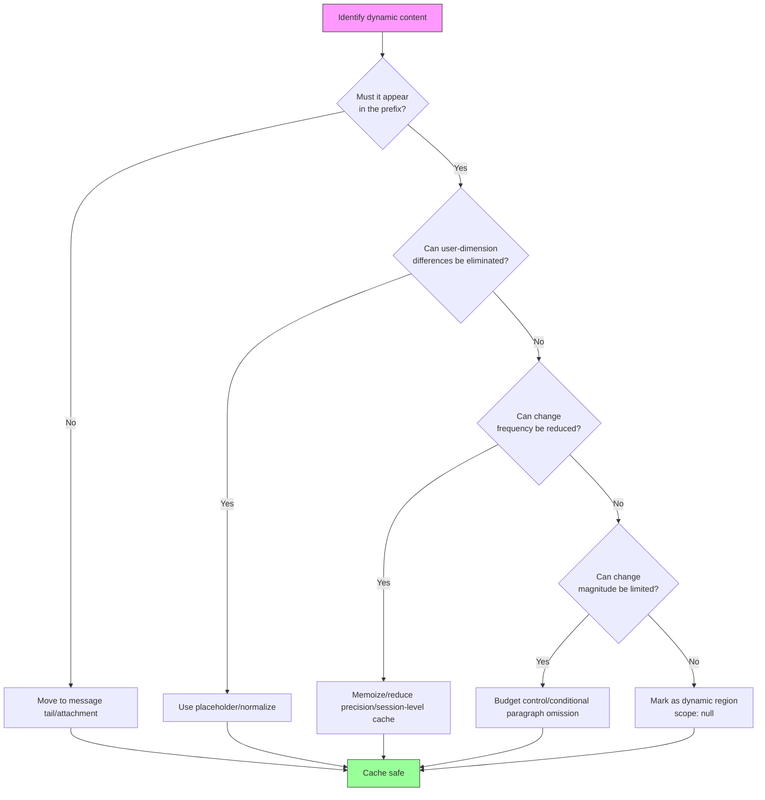

# Chapter 15: Cache 최적화 패턴 (Cache Optimization Patterns)

## 이 Chapter가 중요한 이유 (Why This Matters)

Chapter 13에서는 cache 아키텍처의 방어 계층을 분석했고, Chapter 14에서는 cache break 탐지 역량을 구축했다. 이번 Chapter에서는 **공격**으로 전환한다 — Claude Code가 일련의 명명된 최적화 패턴을 통해 cache break을 원천적으로 제거하거나 줄이는 방법을 다룬다.

이 최적화 패턴들은 한꺼번에 설계된 것이 아니다. 각 패턴은 Chapter 14에서 소개한 cache break 탐지 시스템이 BigQuery를 통해 수집한 실제 데이터에서 비롯되었다. `tengu_prompt_cache_break` 이벤트가 특정 break 원인이 반복적으로 발생함을 드러내면, 엔지니어링 팀이 이를 제거하기 위한 맞춤형 최적화 패턴을 설계했다.

이 Chapter에서는 간단한 date memoization부터 복잡한 tool schema caching까지 7개 이상의 명명된 cache 최적화 패턴을 소개한다. 각 패턴은 동일한 프레임워크를 따른다: **변경 원인을 식별하고, 변경의 본질을 이해하며, 동적인 것을 정적으로 바꾼다**.

---

## 패턴 요약 (Pattern Summary)

각 패턴을 상세히 살펴보기 전에, 전체 조감도는 다음과 같다:

| # | 패턴 이름 | 변경 원인 | 최적화 전략 | 핵심 파일 | 영향 범위 |
|---|----------|----------|------------|----------|----------|
| 1 | Date Memoization | 자정에 날짜 변경 | `memoize(getLocalISODate)` | `constants/common.ts` | System prompt |
| 2 | Monthly Granularity | 매일 날짜 변경 | 전체 날짜 대신 "Month YYYY" 사용 | `constants/common.ts` | Tool prompt |
| 3 | Agent List as Attachment | Agent 목록이 동적으로 변경 | tool description에서 message attachment로 이동 | `tools/AgentTool/prompt.ts` | Tool schema (10.2% cache_creation) |
| 4 | Skill List Budget | Skill 수 증가 | context window의 1%로 제한 | `tools/SkillTool/prompt.ts` | Tool schema |
| 5 | $TMPDIR Placeholder | 사용자 UID가 경로에 포함 | `$TMPDIR`로 대체 | `tools/BashTool/prompt.ts` | Tool prompt / global cache |
| 6 | Conditional Paragraph Omission | Feature flag가 prompt 변경 | 추가하는 대신 조건부 생략 | 다양한 system prompt | System prompt prefix |
| 7 | Tool Schema Cache | GrowthBook 전환 / 동적 콘텐츠 | session 수준 Map cache | `utils/toolSchemaCache.ts` | 모든 tool schema |

**Table 15-1: 7개 이상의 Cache 최적화 패턴 요약**

---

## 15.1 패턴 1: Date Memoization — getSessionStartDate() (Pattern One: Date Memoization — getSessionStartDate())

### 문제 (The Problem)

Claude Code의 system prompt에는 모델이 시간적 맥락을 이해할 수 있도록 현재 날짜(`currentDate`)가 포함된다. 날짜는 `getLocalISODate()` 함수를 통해 얻는다:

```typescript
// constants/common.ts:4-15
export function getLocalISODate(): string {
  if (process.env.CLAUDE_CODE_OVERRIDE_DATE) {
    return process.env.CLAUDE_CODE_OVERRIDE_DATE
  }

  const now = new Date()
  const year = now.getFullYear()
  const month = String(now.getMonth() + 1).padStart(2, '0')
  const day = String(now.getDate()).padStart(2, '0')
  return `${year}-${month}-${day}`
}
```

문제는 **자정 교차(midnight crossover)**에 있다: 사용자가 23:59에 요청을 보내면 system prompt에 `2026-04-01`이 들어가고, 다음 요청을 00:01에 보내면 날짜가 `2026-04-02`로 바뀐다. 이 한 글자 변경만으로도 전체 system prompt prefix cache가 무효화되기에 충분하다 — 약 11,000개의 token을 다시 계산해야 한다.

### 해결책 (The Solution)

```typescript
// constants/common.ts:24
export const getSessionStartDate = memoize(getLocalISODate)
```

`getSessionStartDate`는 `getLocalISODate`를 lodash의 `memoize`로 감싼다 — 이 함수는 첫 번째 호출 시 날짜를 캡처하고, 실제 날짜가 변경되었는지와 관계없이 이후 항상 동일한 값을 반환한다.

소스 주석(lines 17–23)은 이 trade-off를 상세히 설명한다:

```typescript
// constants/common.ts:17-23
// Memoized for prompt-cache stability — captures the date once at session start.
// The main interactive path gets this behavior via memoize(getUserContext) in
// context.ts; simple mode (--bare) calls getSystemPrompt per-request and needs
// an explicit memoized date to avoid busting the cached prefix at midnight.
// When midnight rolls over, getDateChangeAttachments appends the new date at
// the tail (though simple mode disables attachments, so the trade-off there is:
// stale date after midnight vs. ~entire-conversation cache bust — stale wins).
```

### 설계 Trade-off (Design Trade-off)

Trade-off는 명확하다: **오래된 날짜 vs 전체 cache 무효화**. 오래된 날짜를 선택한 근거는 다음과 같다:

1. 날짜 정보는 대부분의 프로그래밍 작업에서 중요하지 않다
2. 자정이 실제로 넘어가면, `getDateChangeAttachments`가 message 끝에 새 날짜를 추가한다 — 이는 prefix cache에 영향을 주지 않는다
3. Simple mode(`--bare`)는 attachment 메커니즘을 비활성화하므로, memoization이 소스 수준에서 이루어져야 한다

### 영향 (Impact)

이 한 줄짜리 최적화는 하루에 한 번 발생하는 전체 prefix cache 무효화를 제거한다. 자정을 넘겨 작업하는 사용자에게 이는 약 11,000개 token의 cache_creation 비용을 절약한다.

---

## 15.2 패턴 2: Monthly Granularity — getLocalMonthYear() (Pattern Two: Monthly Granularity — getLocalMonthYear())

### 문제 (The Problem)

Date memoization은 system prompt의 자정 교차 문제를 해결하지만, tool prompt에도 시간 정보가 필요하다. tool prompt가 전체 날짜(`YYYY-MM-DD`)를 사용하면, 매일 자정마다 해당 날짜를 포함하는 tool의 schema cache가 무효화된다. Tool schema는 API 요청의 앞쪽에 위치하므로, 이들의 변경은 system prompt 변경보다 더 파괴적이다.

### 해결책 (The Solution)

```typescript
// constants/common.ts:28-33
export function getLocalMonthYear(): string {
  const date = process.env.CLAUDE_CODE_OVERRIDE_DATE
    ? new Date(process.env.CLAUDE_CODE_OVERRIDE_DATE)
    : new Date()
  return date.toLocaleString('en-US', { month: 'long', year: 'numeric' })
}
```

`getLocalMonthYear()`는 전체 날짜 대신 "Month YYYY" 형식(예: "April 2026")을 반환한다. **변경 빈도가 매일에서 매월로 줄어든다.**

주석(line 27)은 설계 의도를 설명한다:

```
// Returns "Month YYYY" (e.g. "February 2026") in the user's local timezone.
// Changes monthly, not daily — used in tool prompts to minimize cache busting.
```

### 두 가지 시간 정밀도의 분리 (Division of Two Time Precisions)

| 사용 맥락 | 함수 | 정밀도 | 변경 빈도 | 위치 |
|----------|------|--------|----------|------|
| System prompt | `getSessionStartDate()` | 일 | session당 1회 | System prompt |
| Tool prompt | `getLocalMonthYear()` | 월 | 월 1회 | Tool schema |

이 분리는 근본적인 원칙을 반영한다: **API 요청의 앞쪽에 가까울수록 콘텐츠의 변경 빈도가 낮아야 한다**.

---

## 15.3 패턴 3: Agent 목록을 Tool Description에서 Message Attachment로 이동 (Pattern Three: Agent List Moved from Tool Description to Message Attachment)

### 문제 (The Problem)

AgentTool의 tool description에는 사용 가능한 agent 목록 — 각 agent의 이름, 타입, 설명 — 이 포함되어 있었다. 이 목록은 동적이다: MCP server의 비동기 연결이 새 agent를 가져오고, `/reload-plugins`가 plugin 목록을 갱신하며, permission mode 변경이 사용 가능한 agent 집합을 바꾼다.

목록이 변경될 때마다 AgentTool의 tool schema가 변경되어 전체 tool schema 배열의 cache가 무효화된다. Tool schema는 API 요청에서 system prompt 뒤에 위치한다 — 이들의 변경은 자체 cache뿐만 아니라 모든 downstream message cache도 무효화한다.

소스 주석(`tools/AgentTool/prompt.ts`, lines 50–57)은 이 문제의 심각성을 정량화한다:

```typescript
// tools/AgentTool/prompt.ts:50-57
// The dynamic agent list was ~10.2% of fleet cache_creation tokens: MCP async
// connect, /reload-plugins, or permission-mode changes mutate the list →
// description changes → full tool-schema cache bust.
```

**전체 cache_creation token의 10.2%가 이 문제에 기인했다.**

### 해결책 (The Solution)

```typescript
// tools/AgentTool/prompt.ts:59-64
export function shouldInjectAgentListInMessages(): boolean {
  if (isEnvTruthy(process.env.CLAUDE_CODE_AGENT_LIST_IN_MESSAGES)) return true
  if (isEnvDefinedFalsy(process.env.CLAUDE_CODE_AGENT_LIST_IN_MESSAGES))
    return false
  return getFeatureValue_CACHED_MAY_BE_STALE('tengu_agent_list_attach', false)
}
```

해결책은 동적 agent 목록을 AgentTool의 tool description에서 빼내어 message attachment를 통해 주입하는 것이다. Tool description은 AgentTool의 일반적인 기능만을 설명하는 정적 텍스트가 되고, 사용 가능한 agent 목록은 user message에 `agent_listing_delta` attachment로 추가된다.

이 마이그레이션의 핵심 통찰: **attachment는 message 끝에 추가되며 prefix cache에 영향을 주지 않는다**. Agent 목록 변경은 새 message에만 token 비용을 추가할 뿐, 캐시된 tool schema를 무효화하지 않는다.

### 영향 (Impact)

cache_creation token의 10.2%를 제거했다 — 모든 최적화 패턴 중 단일 최대 개선이다. 점진적 rollout을 위해 GrowthBook feature flag `tengu_agent_list_attach`로 제어되며, 수동 override를 위한 환경 변수 `CLAUDE_CODE_AGENT_LIST_IN_MESSAGES`도 유지된다.

---

## 15.4 패턴 4: Skill List Budget (1% Context Window) (Pattern Four: Skill List Budget)

### 문제 (The Problem)

SkillTool은 AgentTool과 마찬가지로 tool description에 사용 가능한 skill 목록을 포함한다. Skill 생태계가 성장하면서(built-in skill + project skill + plugin skill), 목록이 매우 길어질 수 있다. 더 중요한 것은, skill 로딩이 동적이라는 점이다 — 프로젝트마다 `.claude/` 설정이 다르고, plugin은 session 중간에 로드되거나 언로드될 수 있다.

### 해결책 (The Solution)

```typescript
// tools/SkillTool/prompt.ts:20-23
// Skill listing gets 1% of the context window (in characters)
export const SKILL_BUDGET_CONTEXT_PERCENT = 0.01
export const CHARS_PER_TOKEN = 4
export const DEFAULT_CHAR_BUDGET = 8_000 // Fallback: 1% of 200k × 4
```

SkillTool은 skill 목록에 엄격한 budget 제한을 부과한다: **전체 목록 크기가 context window의 1%를 초과할 수 없다**. 200K context window의 경우, 이는 약 8,000자에 해당한다.

Budget 계산 함수(lines 31–41):

```typescript
// tools/SkillTool/prompt.ts:31-41
export function getCharBudget(contextWindowTokens?: number): number {
  if (Number(process.env.SLASH_COMMAND_TOOL_CHAR_BUDGET)) {
    return Number(process.env.SLASH_COMMAND_TOOL_CHAR_BUDGET)
  }
  if (contextWindowTokens) {
    return Math.floor(
      contextWindowTokens * CHARS_PER_TOKEN * SKILL_BUDGET_CONTEXT_PERCENT,
    )
  }
  return DEFAULT_CHAR_BUDGET
}
```

또한, 각 skill 항목의 설명은 잘린다:

```typescript
// tools/SkillTool/prompt.ts:29
export const MAX_LISTING_DESC_CHARS = 250
```

주석(lines 25–28)은 설계 논리를 설명한다:

```
// Per-entry hard cap. The listing is for discovery only — the Skill tool loads
// full content on invoke, so verbose whenToUse strings waste turn-1 cache_creation
// tokens without improving match rate.
```

### Cache 최적화의 본질 (The Essence of the Cache Optimization)

1% budget 제어는 두 가지 방식으로 cache 최적화를 달성한다:

1. **Tool description 크기 제한**: 짧은 description은 정확히 일치해야 할 바이트 수가 적다는 의미다
2. **Budget trimming이 변동을 줄인다**: 새 skill이 로드되어도 budget이 이미 가득 차 있으면 목록에 포함되지 않는다 — 목록이 변경되지 않으므로 cache도 깨지지 않는다

이는 "budget이 곧 안정성" 패턴이다: 동적 콘텐츠의 최대 크기를 제한함으로써 간접적으로 cache key 변경의 규모를 제어한다.

---

## 15.5 패턴 5: $TMPDIR Placeholder (Pattern Five: $TMPDIR Placeholder)

### 문제 (The Problem)

BashTool의 prompt는 모델에게 쓸 수 있는 임시 디렉토리 경로를 알려줘야 한다. Claude Code는 `getClaudeTempDir()`를 사용하여 이 경로를 얻는데, 일반적으로 `/private/tmp/claude-{UID}/` 형식이며, `{UID}`는 사용자의 시스템 UID다.

문제는 사용자마다 UID가 다르기 때문에 경로 문자열이 다르다는 것이다. 이 경로가 tool prompt에 포함되면, **사용자 간 global cache hit**가 불가능해진다. User A의 `/private/tmp/claude-1001/`과 User B의 `/private/tmp/claude-1002/`는 서로 다른 바이트 시퀀스로, global cache scope 내에서도 공유할 수 없다.

### 해결책 (The Solution)

```typescript
// tools/BashTool/prompt.ts:186-190
// Replace the per-UID temp dir literal (e.g. /private/tmp/claude-1001/) with
// "$TMPDIR" so the prompt is identical across users — avoids busting the
// cross-user global prompt cache. The sandbox already sets $TMPDIR at runtime.
const claudeTempDir = getClaudeTempDir()
const normalizeAllowOnly = (paths: string[]): string[] =>
  [...new Set(paths)].map(p => (p === claudeTempDir ? '$TMPDIR' : p))
```

해결책은 우아하고 간결하다: 사용자별 임시 디렉토리 경로를 `$TMPDIR` placeholder로 대체한다. Claude Code의 sandbox 환경이 이미 `$TMPDIR`을 올바른 디렉토리로 설정하므로, 모델이 `$TMPDIR`을 사용하여 임시 디렉토리를 참조하는 것은 절대 경로를 사용하는 것과 동일하게 작동한다.

Prompt는 또한 모델에게 명시적으로 `$TMPDIR` 사용을 지시한다:

```typescript
// tools/BashTool/prompt.ts:258-260
'For temporary files, always use the `$TMPDIR` environment variable. ' +
'TMPDIR is automatically set to the correct sandbox-writable directory ' +
'in sandbox mode. Do NOT use `/tmp` directly - use `$TMPDIR` instead.',
```

### 영향 (Impact)

이 최적화는 BashTool의 prompt를 모든 사용자에 대해 **바이트 단위로 동일하게** 만들어, global cache scope의 prefix 공유를 가능하게 한다. 가장 빈번하게 사용되는 tool인 BashTool의 schema에서 global cache hit가 이루어지면 상당한 비용 절감을 의미한다.

---

## 15.6 패턴 6: 조건부 문단 생략 (Pattern Six: Conditional Paragraph Omission)

### 문제 (The Problem)

System prompt에는 특정 조건에서만 나타나는 문단이 포함된다: feature flag가 활성화되면 설명이 추가되고, 특정 기능이 사용 가능하면 안내가 삽입된다. 이러한 조건이 session 도중에 전환되면(예: GrowthBook의 원격 설정이 업데이트되면), 문단의 출현/소멸이 system prompt 콘텐츠를 변경하여 cache break을 일으킨다.

### 해결책 (The Solution)

조건부 문단 생략 패턴의 핵심 원칙은: **말했다가 제거하는 것보다 아예 말하지 않는 것이 낫다**. 구체적인 구현 방식은 다음과 같다:

1. **조건부 문단을 정적 텍스트로 대체**: 설명이 모델 행동에 미치는 영향이 미미하면, 조건부 로직을 피하고 항상 포함하거나(또는 항상 제외하거나) 한다
2. **조건부 콘텐츠를 dynamic boundary 이후로 이동**: 조건부 포함이 필요하다면, global caching에 참여하지 않는 `SYSTEM_PROMPT_DYNAMIC_BOUNDARY` 이후에 배치한다(Chapter 13 참조)
3. **인라인 조건 대신 attachment 메커니즘 사용**: 패턴 3의 agent 목록과 유사하게, 조건부 콘텐츠를 message 끝에 attachment로 추가한다

이 패턴은 단일 구현 위치가 없다 — system prompt와 tool prompt 구성 전반에 스며드는 설계 원칙이다. 그 본질은 API 요청 prefix의 system prompt 블록이 session 생명주기 전체에 걸쳐 **단조적 안정성(monotonic stability)**을 유지하도록 보장하는 것이다: 콘텐츠가 항상 존재하거나 항상 존재하지 않으며, 외부 조건 전환에 의해 출현/소멸하지 않는다.

---

## 15.7 패턴 7: Tool Schema Cache — getToolSchemaCache() (Pattern Seven: Tool Schema Cache — getToolSchemaCache())

### 문제 (The Problem)

Tool schema 직렬화(`toolToAPISchema()`)는 여러 런타임 결정을 수반하는 복잡한 과정이다:

1. **GrowthBook feature flag**: `tengu_tool_pear`(strict mode), `tengu_fgts`(fine-grained tool streaming) 등의 flag가 schema의 선택적 필드를 제어한다
2. **tool.prompt()의 동적 출력**: 일부 tool의 description 텍스트에는 런타임 정보가 포함된다
3. **MCP tool schema**: 외부 서버가 제공하는 schema는 session 도중에 변경될 수 있다

모든 API 요청마다 tool schema를 재계산한다는 것은: GrowthBook이 session 도중에 cache를 갱신하고(언제든 일어날 수 있다), flag 값이 `true`에서 `false`로 전환되면 tool schema 직렬화 결과가 바뀐다는 의미다 — cache break.

### 해결책 (The Solution)

```typescript
// utils/toolSchemaCache.ts:1-27
// Session-scoped cache of rendered tool schemas. Tool schemas render at server
// position 2 (before system prompt), so any byte-level change busts the entire
// ~11K-token tool block AND everything downstream. GrowthBook gate flips
// (tengu_tool_pear, tengu_fgts), MCP reconnects, or dynamic content in
// tool.prompt() drift all cause this churn. Memoizing per-session locks the schema
// bytes at first render — mid-session GB refreshes no longer bust the cache.

type CachedSchema = BetaTool & {
  strict?: boolean
  eager_input_streaming?: boolean
}

const TOOL_SCHEMA_CACHE = new Map<string, CachedSchema>()

export function getToolSchemaCache(): Map<string, CachedSchema> {
  return TOOL_SCHEMA_CACHE
}

export function clearToolSchemaCache(): void {
  TOOL_SCHEMA_CACHE.clear()
}
```

`TOOL_SCHEMA_CACHE`는 tool 이름(또는 `inputJSONSchema`를 포함하는 복합 key)을 키로 하는 모듈 수준 Map으로, 완전히 직렬화된 schema를 캐시한다. 첫 번째 요청에서 tool의 schema가 렌더링되어 캐시되면, 이후 요청은 `tool.prompt()`를 호출하거나 GrowthBook flag를 재평가하지 않고 캐시된 값을 직접 재사용한다.

### Cache Key 설계 (Cache Key Design)

Cache key 설계에는 미묘하지만 중요한 고려사항이 있다(`utils/api.ts`, lines 147–149):

```typescript
// utils/api.ts:147-149
const cacheKey =
  'inputJSONSchema' in tool && tool.inputJSONSchema
    ? `${tool.name}:${jsonStringify(tool.inputJSONSchema)}`
    : tool.name
```

대부분의 tool은 이름을 key로 사용한다 — 각 tool 이름은 고유하며 schema는 session 내에서 변경되지 않는다. 그러나 `StructuredOutput`은 특수한 경우다: 이름은 항상 `'StructuredOutput'`이지만, 서로 다른 workflow 호출이 서로 다른 `inputJSONSchema`를 전달한다. 이름만 key로 사용하면, 첫 번째 호출에서 캐시된 schema가 이후의 다른 workflow에서 잘못 재사용된다.

소스 주석은 이 버그의 심각성을 기록한다:

```
// StructuredOutput instances share the name 'StructuredOutput' but carry
// different schemas per workflow call — name-only keying returned a stale
// schema (5.4% → 51% err rate, see PR#25424).
```

**오류율이 5.4%에서 51%로 급등했다** — 이는 미묘한 cache 일관성 문제가 아니라 심각한 기능적 버그다. `inputJSONSchema`를 cache key에 포함시킴으로써 해결되었다.

### 생명주기 (Lifecycle)

`TOOL_SCHEMA_CACHE`의 생명주기는 session에 바인딩된다:

- **생성**: 첫 번째 `toolToAPISchema()` 호출 시 tool별로 채워진다
- **읽기**: 이후 모든 API 요청에서 재사용된다
- **초기화**: 사용자 logout 시(`auth.ts` 경유) `clearToolSchemaCache()`가 호출되어, 새 session이 이전 session의 오래된 schema를 재사용하지 않도록 보장한다

`clearToolSchemaCache`는 `utils/api.ts`가 아닌 `utils/toolSchemaCache.ts`라는 독립적인 leaf 모듈에 배치된다는 점에 주목하라. 주석이 그 이유를 설명한다:

```
// Lives in a leaf module so auth.ts can clear it without importing api.ts
// (which would create a cycle via plans→settings→file→growthbook→config→
// bridgeEnabled→auth).
```

겉보기에 단순한 cache Map도 순환 의존성을 피하기 위해 신중한 모듈 분리가 필요하다 — 대규모 TypeScript 프로젝트에서 흔히 겪는 과제다.

---

## 15.8 이 패턴들의 공통 본질 (The Common Essence of These Patterns)

7개 패턴 전체를 되돌아보면, 다음 다이어그램은 이들이 공유하는 최적화 의사결정 흐름을 보여준다:



**Figure 15-1: Cache 최적화 패턴 의사결정 흐름**

몇 가지 공통 원칙을 추출할 수 있다:

### 원칙 1: 동적 콘텐츠를 요청 끝쪽으로 밀어내기 (Principle One: Push Dynamic Content Toward the Request Tail)

API 요청의 prefix matching 모델은 다음을 의미한다: **콘텐츠가 앞에 있을수록 변경의 파괴력이 크다**. 따라서:

- Date memoization(패턴 1)은 system prompt의 날짜를 고정한다
- Agent list as attachment(패턴 3)은 동적 목록을 tool schema(앞쪽)에서 message attachment(끝쪽)로 이동한다
- Conditional paragraph omission(패턴 6)은 prefix 콘텐츠가 흔들리지 않도록 보장한다

### 원칙 2: 변경 빈도 줄이기 (Principle Two: Reduce Change Frequency)

콘텐츠가 반드시 prefix에 있어야 할 때, 변경 빈도를 줄이는 것이 차선책이다:

- Monthly granularity(패턴 2)는 날짜 변경을 매일에서 매월로 줄인다
- Skill list budget(패턴 4)는 budget trimming을 통해 목록 변경을 줄인다
- Tool schema cache(패턴 7)는 변경 빈도를 요청별에서 session별로 줄인다

### 원칙 3: 사용자 차원의 차이 제거 (Principle Three: Eliminate User-Dimension Differences)

Global caching의 전제 조건은 모든 사용자가 동일한 prefix를 보는 것이다:

- $TMPDIR placeholder(패턴 5)는 사용자 UID로 인한 경로 차이를 제거한다
- Date memoization도 간접적으로 이 역할을 한다 — 서로 다른 시간대의 사용자는 같은 순간에 다른 날짜를 가질 수 있다

### 원칙 4: 먼저 측정하고, 그다음 최적화하기 (Principle Four: Measure First, Optimize Second)

모든 패턴의 발견은 Chapter 14의 cache break 탐지 시스템에 의존한다:

- cache_creation token의 10.2%가 agent 목록에 기인 — 이 수치는 BigQuery 분석에서 나왔다
- Tool 변경의 77%가 단일 tool schema 변경 — 이것이 tool schema cache 설계를 이끌었다
- GrowthBook flag 전환이 break 원인으로 파악 — 이것이 session 수준 caching 도입을 이끌었다

관측성(observability) 인프라 없이는 이 패턴들이 발견되지 못했을 것이다.

---

## 사용자가 할 수 있는 것 (What Users Can Do)

이 패턴들은 Claude Code 너머에도 적용된다 — Anthropic API(또는 유사한 prefix caching 메커니즘)를 사용하는 모든 애플리케이션이 이로부터 배울 수 있다.

### API 호출자를 위한 조언 (Advice for API Callers)

1. **System prompt를 감사하라**: 그 안에 있는 동적 콘텐츠(날짜, 사용자 이름, 설정 값)를 식별하고, system prompt 끝이나 message로 밀어내라
2. **Tool schema를 고정하라**: Tool 정의는 session 내에서 일정하게 유지되어야 한다. Tool 목록을 동적으로 변경해야 한다면, message attachment 사용을 고려하라
3. **cache_read_input_tokens를 모니터링하라**: 이것이 caching이 제대로 작동하는지의 유일한 지표다. session 도중 예상치 못하게 떨어지면, cache break이 발생한 것이다
4. **Prefix 순서를 이해하라**: `cache_control` breakpoint 이전의 콘텐츠 변경은 해당 breakpoint의 cache를 무효화한다. 요청을 구성할 때 가장 안정적인 콘텐츠를 먼저 배치하라

### 흔한 함정 (Common Pitfalls)

| 함정 | 원인 | 해결책 |
|------|------|--------|
| System prompt에 timestamp 포함 | 매 요청마다 변경 | Session 수준 memoization 사용 |
| 동적 tool 목록 | MCP 연결/해제가 목록 변경 | Attachment 메커니즘 또는 defer_loading |
| 사용자별 경로 | 사용자가 다르면 바이트가 다름 | 환경 변수 placeholder |
| Feature flag가 schema에 직접 영향 | 원격 설정 갱신 | Session 수준 cache |
| 빈번한 모델 전환 | 모델이 cache key의 일부 | 모델 선택을 최대한 안정적으로 유지 |

### Claude Code 사용자를 위한 조언 (Advice for Claude Code Users)

1. **1시간 cache window를 활용하라.** CC의 prompt cache TTL은 1시간이다 — 1시간 내에 연속으로 작업하면, 이후 요청은 점점 높은 cache hit rate를 누린다. 긴 휴식 후에 cache가 유효하리라 기대하지 마라.
2. **자주 새 session을 만들기보다 session을 재사용하라.** 새 session = 새 cache prefix = 0 hit. `--resume`으로 기존 session을 복원하는 것이 새 session을 만드는 것보다 비용 효율적이다.
3. **`cache_creation_input_tokens` vs `cache_read_input_tokens`를 모니터링하라.** 전자는 caching에 지불하는 "학습 비용"이고, 후자는 "수익"이다. 건강한 session은 처음 몇 turn에서 creation이 높고, 이후 read가 지배적이어야 한다.
4. **Agent를 구축한다면, cache edit pinning을 구현하라.** CC의 `pinCacheEdits()` / `consumePendingCacheEdits()` 패턴은 cache prefix를 깨지 않으면서 message 콘텐츠를 수정할 수 있게 해준다 — 차용할 가치가 있는 고급 최적화다.

---

## 요약 (Summary)

이 Chapter에서는 Claude Code의 7가지 cache 최적화 패턴을 소개했다:

1. **Date memoization**: `memoize(getLocalISODate)`로 자정 cache 무효화를 제거한다
2. **Monthly granularity**: `getLocalMonthYear()`로 tool prompt의 날짜 변경 빈도를 매일에서 매월로 줄인다
3. **Agent list as attachment**: cache_creation token의 10.2%를 제거했다
4. **Skill list budget**: context window 1%의 엄격한 budget으로 목록 크기와 변동을 제어한다
5. **$TMPDIR placeholder**: 사용자 차원의 차이를 제거하여 global cache를 가능하게 한다
6. **Conditional paragraph omission**: Feature toggle로 인해 prefix 콘텐츠가 흔들리지 않도록 보장한다
7. **Tool schema cache**: Session 수준 Map으로 GrowthBook 전환과 동적 콘텐츠를 격리한다

이 패턴들은 함께 핵심 통찰을 구현한다: **cache 최적화는 고립된 관심사가 아니라, 시스템에서 동적 콘텐츠를 생성하는 모든 지점에 스며드는 것이다**. 날짜 형식에서 경로 문자열까지, tool description에서 feature flag까지 — 어떤 "겉보기에 중요하지 않은" 변경도 수만 개의 캐시된 token을 무효화할 수 있다. Claude Code의 접근 방식은 cache 안정성을 first-class citizen으로 취급하며, 동적 콘텐츠가 생성되는 모든 지점에서 명시적으로 cache 친화적 설계 결정을 내린다.

이로써 Part 4 "Prompt Caching"이 마무리된다. Chapter 13은 cache 아키텍처의 방어 계층(scope, TTL, latching)을 구축했고, Chapter 14는 탐지 역량(2단계 탐지, 설명 엔진)을 구축했으며, Chapter 15는 공격적 조치(7개 이상의 최적화 패턴)를 시연했다. 세 Chapter가 함께 완전한 cache 엔지니어링 시스템을 형성한다: **방어, 탐지, 최적화**.

다음 Part는 안전 및 권한 시스템으로 전환한다 — 체계적인 엔지니어링 사고가 필요한 또 다른 영역이다. Chapter 16을 참조하라.
