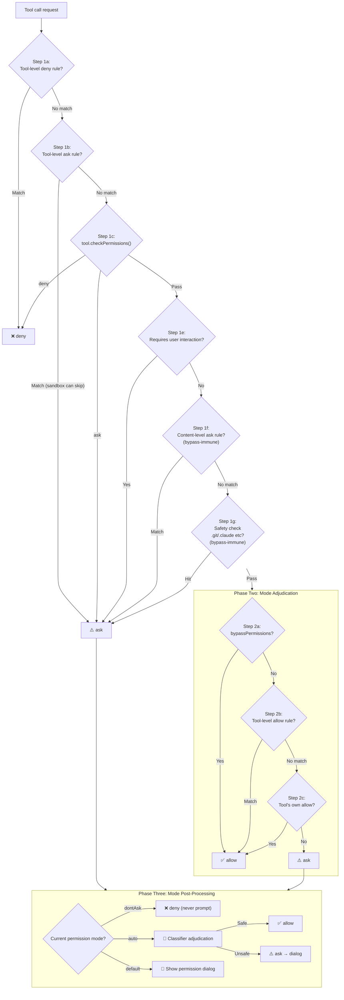

# Chapter 16: Permission System

> **Positioning**: 이 Chapter는 Claude Code의 6개 permission mode, 3-layer rule matching 메커니즘, 완전한 validation-permission-classification 파이프라인을 분석한다. 사전 지식: Chapter 4 (startup flow). 대상 독자: CC의 6개 permission mode와 3-stage permission 파이프라인을 이해하고 싶은 독자, 또는 자신의 Agent를 위한 permission 모델을 설계해야 하는 개발자.

## Why This Matters

임의의 shell 명령을 실행하고 사용자 코드베이스의 어떤 파일이든 읽고 쓸 수 있는 AI Agent — 그 permission 시스템의 설계 품질이 사용자 신뢰의 상한을 직접 결정한다. 지나치게 관대하면 사용자가 보안 위험을 직면한다 — 악의적인 prompt injection이 `rm -rf /`를 트리거하거나 SSH 키를 훔칠 수 있다; 지나치게 제한적이면 모든 작업이 확인 대화상자를 띄워, AI 코딩 어시스턴트를 "계속 사람이 클릭해야 하는 자동화 도구"로 격하시킨다.

Claude Code의 permission 시스템은 이 두 극단 사이에서 균형을 찾으려 시도한다: 6개 permission mode, 3-layer rule matching 메커니즘, 완전한 validation-permission-classification 파이프라인을 통해, "안전한 작업은 자동으로 통과, 위험한 작업은 수동 확인 필요, 모호한 경우는 AI classifier가 판정"하는 계층 제어를 달성한다.

이 Chapter는 이 permission 시스템의 설계와 구현을 철저히 해부한다.

---

## 16.1 6개 Permission Mode (Six Permission Modes)

Permission Mode는 전체 시스템의 최상위 제어 스위치다. 사용자는 Shift+Tab으로 mode를 순환하거나 `--permission-mode` CLI 인자로 하나를 지정한다. 모든 mode는 `types/permissions.ts`에 정의된다.

```typescript
// types/permissions.ts:16-22
export const EXTERNAL_PERMISSION_MODES = [
  'acceptEdits',
  'bypassPermissions',
  'default',
  'dontAsk',
  'plan',
] as const
```

내부적으로는 두 개의 비공개 mode가 추가로 있다 — `auto`와 `bubble` — 완전한 type union을 형성한다.

```typescript
// types/permissions.ts:28-29
export type InternalPermissionMode = ExternalPermissionMode | 'auto' | 'bubble'
export type PermissionMode = InternalPermissionMode
```

다음은 각 mode의 행동 설명이다.

| Mode | Symbol | Behavior | Typical Scenario |
|------|--------|----------|------------------|
| `default` | (none) | 모든 tool 호출은 사용자 확인 필요 | 첫 사용, 고보안 환경 |
| `acceptEdits` | `>>` | Working directory 내 파일 편집은 자동 통과; shell 명령은 여전히 확인 필요 | 일상 코딩 보조 |
| `plan` | `⏸` | AI는 읽기와 검색만 가능; 쓰기 작업 실행 없음 | 코드 리뷰, 아키텍처 계획 |
| `bypassPermissions` | `>>` | 모든 permission check를 건너뜀 (safety check 제외) | 신뢰 환경의 배치 작업 |
| `dontAsk` | `>>` | 모든 `ask` 결정을 `deny`로 변환; 확인 prompt 없음 | 자동화된 CI/CD 파이프라인 |
| `auto` | `>>` | AI classifier가 자동으로 판정; 내부 전용 | Anthropic 내부 개발 |

각 mode는 해당하는 설정 객체를 가지며(`PermissionMode.ts:42-91`) title, 약어, 기호, 컬러 키를 포함한다. 특히 `auto` mode는 `feature('TRANSCRIPT_CLASSIFIER')` compile-time feature gate를 통해 등록된다 — 외부 빌드에서는 Bun의 dead code elimination으로 이 코드가 완전히 제거된다.

### Mode 전환 순환 로직 (Mode Switching Cycle Logic)

`getNextPermissionMode`(`getNextPermissionMode.ts:34-79`)는 Shift+Tab 순환 순서를 정의한다.

```
External users: default → acceptEdits → plan → [bypassPermissions] → default
Internal users: default → [bypassPermissions] → [auto] → default
```

내부 사용자는 `acceptEdits`와 `plan`을 건너뛴다. `auto` mode가 둘의 기능을 대체하기 때문이다. `bypassPermissions`는 `isBypassPermissionsModeAvailable` flag가 `true`일 때만 순환에 나타난다. `auto` mode는 feature gate와 runtime availability check 둘 다 필요하다.

```typescript
// getNextPermissionMode.ts:17-29
function canCycleToAuto(ctx: ToolPermissionContext): boolean {
  if (feature('TRANSCRIPT_CLASSIFIER')) {
    const gateEnabled = isAutoModeGateEnabled()
    const can = !!ctx.isAutoModeAvailable && gateEnabled
    // ...
    return can
  }
  return false
}
```

### Mode 전환의 Side Effect (Side Effects of Mode Transitions)

Mode 전환은 단순히 enum 값을 변경하는 것이 아니다 — `transitionPermissionMode`(`permissionSetup.ts:597-646`)는 전환 side effect를 처리한다.

1. **Plan mode 진입**: `prepareContextForPlanMode`를 호출하여 현재 mode를 `prePlanMode`에 저장
2. **Auto mode 진입**: `stripDangerousPermissionsForAutoMode`를 호출하여 위험한 allow rule을 제거 (아래 자세히)
3. **Auto mode 종료**: `restoreDangerousPermissions`를 호출하여 제거된 rule을 복원
4. **Plan mode 종료**: `hasExitedPlanMode` 상태 플래그 설정

---

## 16.2 Permission Rule 시스템 (Permission Rule System)

Permission mode는 coarse-grained 스위치다; permission rule은 fine-grained 제어를 제공한다. Rule은 세 부분으로 구성된다.

```typescript
// types/permissions.ts:75-79
export type PermissionRule = {
  source: PermissionRuleSource
  ruleBehavior: PermissionBehavior    // 'allow' | 'deny' | 'ask'
  ruleValue: PermissionRuleValue
}
```

`PermissionRuleValue`는 대상 tool과 옵셔널 content qualifier를 명시한다.

```typescript
// types/permissions.ts:67-70
export type PermissionRuleValue = {
  toolName: string
  ruleContent?: string    // e.g., "npm install", "git:*"
}
```

### Rule 소스 계층 (Rule Source Hierarchy)

Rule은 8개 소스를 가지며(`types/permissions.ts:54-62`), 우선순위 내림차순이다.

| Source | Location | Sharing |
|--------|----------|---------|
| `policySettings` | 엔터프라이즈 관리 정책 | 모든 사용자에 푸시 |
| `projectSettings` | `.claude/settings.json` | git commit됨, 팀 공유 |
| `localSettings` | `.claude/settings.local.json` | Gitignore, 로컬 전용 |
| `userSettings` | `~/.claude/settings.json` | 사용자 글로벌 |
| `flagSettings` | `--settings` CLI 인자 | Runtime |
| `cliArg` | `--allowed-tools` 등 CLI 인자 | Runtime |
| `command` | 커맨드 라인 서브커맨드 context | Runtime |
| `session` | 세션 내 임시 rule | 현재 세션만 |

### Rule 문자열 형식과 파싱 (Rule String Format and Parsing)

Rule은 설정 파일에 문자열로 저장되며, `ToolName` 또는 `ToolName(content)` 형식이다. 파싱은 `permissionRuleParser.ts`의 `permissionRuleValueFromString` 함수(lines 93-133)가 처리하며, escape된 parentheses를 다룬다 — rule content 자체가 parentheses를 포함할 수 있기 때문이다(예: `python -c "print(1)"`).

특수 케이스: `Bash()`와 `Bash(*)` 둘 다 tool-level rule(content qualifier 없음)로 처리되며, `Bash`와 동등하다.

---

## 16.3 3개 Rule Matching Mode (Three Rule Matching Modes)

Shell 명령 permission rule은 세 가지 matching mode를 지원하며, `shellRuleMatching.ts`의 `parsePermissionRule` 함수(lines 159-184)가 discriminated union 타입으로 파싱한다.

```typescript
// shellRuleMatching.ts:25-38
export type ShellPermissionRule =
  | { type: 'exact'; command: string }
  | { type: 'prefix'; prefix: string }
  | { type: 'wildcard'; pattern: string }
```

### Exact Matching

Wildcard가 없는 rule은 정확한 명령 매치를 요구한다.

| Rule | Matches | Does Not Match |
|------|---------|----------------|
| `npm install` | `npm install` | `npm install lodash` |
| `git status` | `git status` | `git status --short` |

### Prefix Matching (Legacy `:*` Syntax)

`:*`로 끝나는 rule은 prefix matching을 사용한다 — 하위 호환을 위한 legacy syntax다.

| Rule | Matches | Does Not Match |
|------|---------|----------------|
| `npm:*` | `npm install`, `npm run build`, `npm test` | `npx create-react-app` |
| `git:*` | `git add .`, `git commit -m "msg"` | `gitk` |

Prefix 추출은 `permissionRuleExtractPrefix`(lines 43-48)가 수행한다: 정규식 `/^(.+):\*$/`가 `:*` 앞의 모든 것을 prefix로 캡처한다.

### Wildcard Matching

Escape되지 않은 `*`를 포함하는 rule(후행 `:*` 제외)은 wildcard matching을 사용한다. `matchWildcardPattern`(lines 90-154)은 패턴을 정규식으로 변환한다.

| Rule | Matches | Does Not Match |
|------|---------|----------------|
| `git add *` | `git add .`, `git add src/main.ts`, 단독 `git add` | `git commit` |
| `docker build -t *` | `docker build -t myapp` | `docker run myapp` |
| `echo \*` | `echo *` (literal asterisk) | `echo hello` |

Wildcard matching에는 신중히 설계된 동작이 있다: 패턴이 ` *`(공백 + wildcard)로 끝나고 전체 패턴이 escape되지 않은 `*`를 하나만 포함하면, 후행 공백과 인자가 옵셔널이 된다. 이는 `git *`가 `git add`와 단독 `git` 둘 다 매치함을 의미한다(lines 142-145). 이는 wildcard 의미론을 `git:*` 같은 prefix rule과 일관되게 유지한다.

Escape 메커니즘은 null-byte sentinel placeholder를 사용하여(lines 14-17) 정규식 변환 중 `\*`(literal asterisk)와 `*`(wildcard) 사이의 혼동을 방지한다.

```typescript
// shellRuleMatching.ts:14-17
const ESCAPED_STAR_PLACEHOLDER = '\x00ESCAPED_STAR\x00'
const ESCAPED_BACKSLASH_PLACEHOLDER = '\x00ESCAPED_BACKSLASH\x00'
```

---

## 16.4 Validation-Permission-Classification 파이프라인 (Validation-Permission-Classification Pipeline)

> **Interactive version**: [Click to view the permission decision tree animation](permission-viz.html) — 다양한 tool 호출 시나리오(Read file / Bash rm / Edit / Write .env)를 선택하고 request가 3-stage 파이프라인을 어떻게 흐르는지 지켜보라.

AI 모델이 tool 호출을 시작할 때, request는 3-stage 파이프라인을 통과하여 실행 여부가 결정된다. 핵심 진입점은 `hasPermissionsToUseTool`(`permissions.ts:473`)이며, 이는 내부 함수 `hasPermissionsToUseToolInner`를 호출하여 처음 두 단계를 실행한 후, 외부 레이어에서 세 번째 단계의 classifier 로직을 처리한다.



### Phase One: Rule Validation

이것은 가장 방어적인 단계다; 모든 exit path가 mode adjudication보다 우선한다. 핵심 단계:

**Steps 1a-1b**(`permissions.ts:1169-1206`)는 tool-level deny와 ask rule을 확인한다. `Bash`가 전체로 deny되면 어떤 Bash 명령도 거부된다. Tool-level ask rule에는 하나의 예외가 있다: sandbox가 활성화되고 `autoAllowBashIfSandboxed`가 켜졌을 때, sandbox된 명령은 ask rule을 건너뛸 수 있다.

**Step 1c**(`permissions.ts:1214-1223`)는 tool의 자체 `checkPermissions()` 메서드를 호출한다. 각 tool 타입(Bash, FileEdit, PowerShell 등)은 자체 permission 확인 로직을 구현한다. 예를 들어 Bash tool은 명령을 파싱하고, 서브커맨드를 확인하며, allow/deny rule을 매치한다.

**Step 1f**(`permissions.ts:1244-1250`)는 중요한 설계다: content-level ask rule(`Bash(npm publish:*)` 같은)은 `bypassPermissions` mode에서도 prompt해야 한다. 사용자가 명시적으로 설정한 ask rule은 명확한 보안 의도 — "publish 전 확인하고 싶다" — 를 나타내기 때문이다.

**Step 1g**(`permissions.ts:1255-1258`)도 똑같이 bypass 불변이다: `.git/`, `.claude/`, `.vscode/`, shell 설정 파일(`.bashrc`, `.zshrc` 등)에 대한 쓰기 작업은 항상 확인이 필요하다.

### Phase Two: Mode Adjudication

Tool 호출이 Phase One을 deny되지 않고 강제 ask되지 않고 통과하면, mode adjudication에 진입한다. `bypassPermissions` mode는 이 시점에서 바로 allow한다. 다른 mode에서는 allow rule과 tool 자체의 allow 결정이 확인된다.

### Phase Three: Mode Post-Processing

이것은 permission 결정 파이프라인의 최종 gate다. `dontAsk` mode는 모든 ask 결정을 deny로 변환하며, 비대화형 환경에 적합하다(`permissions.ts:505-517`). `auto` mode는 AI classifier를 실행하여 판정한다 — 전체 permission 시스템에서 가장 복잡한 경로다 (아래 자세히).

---

## 16.5 `isDangerousBashPermission()`: Classifier의 안전 경계 보호 (Protecting the Classifier's Safety Boundary)

사용자가 다른 mode에서 `auto` mode로 전환하면, 시스템은 `stripDangerousPermissionsForAutoMode`를 호출하여 특정 allow rule을 일시적으로 제거한다. 제거된 rule은 삭제되지 않고 `strippedDangerousRules` 필드에 저장되며, auto mode를 떠날 때 복원된다.

Rule이 "위험"한지 판단하는 핵심 함수는 `isDangerousBashPermission`(`permissionSetup.ts:94-147`)이다.

```typescript
// permissionSetup.ts:94-107
export function isDangerousBashPermission(
  toolName: string,
  ruleContent: string | undefined,
): boolean {
  if (toolName !== BASH_TOOL_NAME) { return false }
  if (ruleContent === undefined || ruleContent === '') { return true }
  const content = ruleContent.trim().toLowerCase()
  if (content === '*') { return true }
  // ...check DANGEROUS_BASH_PATTERNS
}
```

위험한 rule 패턴은 다섯 가지 형태를 포함한다.

1. **Tool-level allow**: `Bash` (ruleContent 없음) 또는 `Bash(*)` — 모든 명령 허용
2. **단독 wildcard**: `Bash(*)` — tool-level allow와 동등
3. **Interpreter prefix**: `Bash(python:*)` — 임의의 Python 코드 실행 허용
4. **Interpreter wildcard**: `Bash(python *)` — 위와 동일
5. **Flag wildcard가 있는 interpreter**: `Bash(python -*)` — `python -c 'arbitrary code'` 허용

위험한 명령 prefix는 `dangerousPatterns.ts:44-80`에 정의된다.

```typescript
// dangerousPatterns.ts:44-80
export const DANGEROUS_BASH_PATTERNS: readonly string[] = [
  ...CROSS_PLATFORM_CODE_EXEC,  // python, node, ruby, perl, ssh, etc.
  'zsh', 'fish', 'eval', 'exec', 'env', 'xargs', 'sudo',
  // Additional Anthropic-internal patterns...
]
```

Cross-platform 코드 실행 진입점(`CROSS_PLATFORM_CODE_EXEC`, lines 18-42)은 모든 주요 script interpreter(python/node/ruby/perl/php/lua), package runner(npx/bunx/npm run), shell(bash/sh), 원격 명령 실행 tool(ssh)을 커버한다.

내부 사용자는 추가로 `gh`, `curl`, `wget`, `git`, `kubectl`, `aws` 등을 포함한다 — 이들은 `process.env.USER_TYPE === 'ant'` gate로 외부 빌드에서 제외된다.

PowerShell은 해당하는 `isDangerousPowerShellPermission`(`permissionSetup.ts:157-233`)을 가지며, PowerShell 특유의 위험한 명령을 추가로 감지한다: `Invoke-Expression`, `Start-Process`, `Add-Type`, `New-Object` 등, 그리고 `.exe` suffix 변형(`python.exe`, `npm.exe`)을 처리한다.

---

## 16.6 Path Permission 검증과 UNC 보호 (Path Permission Validation and UNC Protection)

파일 작업 permission 검증은 `pathValidation.ts`의 `validatePath` 함수(lines 373-485)가 실행한다. 이는 다단계 보안 파이프라인이다.

### Path 검증 파이프라인 (Path Validation Pipeline)

```
Input path
  │
  ├─ 1. Strip quotes, expand ~ ──→ cleanPath
  ├─ 2. UNC path detection ──→ Reject if matched
  ├─ 3. Dangerous tilde variant detection (~root, ~+, ~-) ──→ Reject if matched
  ├─ 4. Shell expansion syntax detection ($VAR, %VAR%) ──→ Reject if matched
  ├─ 5. Glob pattern detection ──→ Reject for writes; validate base directory for reads
  ├─ 6. Resolve to absolute path + symlink resolution
  └─ 7. isPathAllowed() multi-step check
```

### UNC Path NTLM Leak 보호 (UNC Path NTLM Leak Protection)

Windows에서 애플리케이션이 UNC path(예: `\\attacker-server\share\file`)에 접근할 때, 운영체제는 자동으로 인증을 위해 NTLM 인증 credential을 보낸다. 공격자는 이 메커니즘을 악용할 수 있다: prompt injection을 통해 AI가 악의적 서버를 가리키는 UNC path를 읽거나 쓰게 만들어, 사용자의 NTLM hash를 훔친다.

`containsVulnerableUncPath`(`shell/readOnlyCommandValidation.ts:1562`)는 세 가지 UNC path 변형을 감지한다.

```typescript
// readOnlyCommandValidation.ts:1562-1596
export function containsVulnerableUncPath(pathOrCommand: string): boolean {
  if (getPlatform() !== 'windows') { return false }

  // 1. Backslash UNC: \\server\share
  const backslashUncPattern = /\\\\[^\s\\/]+(?:@(?:\d+|ssl))?(?:[\\/]|$|\s)/i

  // 2. Forward-slash UNC: //server/share (excluding :// in URLs)
  const forwardSlashUncPattern = /(?<!:)\/\/[^\s\\/]+(?:@(?:\d+|ssl))?(?:[\\/]|$|\s)/i

  // 3. Mixed separators: /\\server (Cygwin/bash environments)
  // ...
}
```

두 번째 정규식이 `(?<!:)` negative lookbehind를 사용하여 `https://` 같은 URL을 제외한다는 점에 주목하라 — 정당한 double-slash 사용 사례. Hostname 패턴 `[^\s\\/]+`는 character whitelist 대신 exclusion set을 사용하여 Unicode homoglyph 공격을 잡는다(예: Cyrillic 'а'를 Latin 'a' 대신 치환).

### TOCTOU 보호 (TOCTOU Protection)

Path 검증은 여러 TOCTOU(Time-of-Check-to-Time-of-Use) 공격도 방어한다.

- **위험한 tilde 변형**(lines 401-411): `~root`는 검증 중 `/cwd/~root/...`로 상대 경로로 resolve되지만, 실행 시점에 Shell이 `/var/root/...`로 확장한다
- **Shell 변수 확장**(lines 423-436): `$HOME/.ssh/id_rsa`는 검증 중 literal 문자열이지만, 실행 시점에 Shell이 실제 경로로 확장한다
- **Zsh equals 확장**(동일): `=rg`은 Zsh에서 `/usr/bin/rg`로 확장된다

이 모든 경우는 특정 문자(`$`, `%`, `=`)를 포함하는 경로를 거부하고 사용자의 수동 확인을 요구함으로써 방어된다.

### `isPathAllowed()` 다단계 Check (`isPathAllowed()` Multi-Step Check)

Path sanitization 후, `isPathAllowed`(`pathValidation.ts:141-263`)는 최종 permission 판정을 수행한다.

1. **Deny rule 우선**: 매치하는 deny rule은 즉시 거부
2. **내부 편집 가능 경로**: plan 파일, scratchpad, agent memory, `~/.claude/` 하위의 다른 내부 경로는 편집에 자동 allow
3. **안전 check**: 위험한 디렉터리(`.git/`, `.claude/`)와 shell 설정 파일에 대한 쓰기 작업은 확인 플래그
4. **Working directory check**: 경로가 허용된 working directory 내에 있을 때, `read` 작업은 자동 통과; `write` 작업은 `acceptEdits` mode 필요
5. **Sandbox 쓰기 whitelist**: Sandbox가 활성화되면 설정된 쓰기 가능 디렉터리는 자동 allow
6. **Allow rule**: 매치하는 allow rule은 permission 부여

---

## 16.7 Auto Mode의 Classifier 파이프라인 (Auto Mode's Classifier Pipeline)

Permission mode가 `auto`이고 tool 호출이 Phase Three의 ask 결정에 도달하면, 시스템은 YOLO classifier(`yoloClassifier.ts`)를 실행하여 AI 판정한다. Classifier의 설계 철학은: 대부분의 경우 AI가 작업이 안전한지 판단할 수 있다는 것이다.

### 안전 Tool Whitelist (Safe Tool Whitelist)

모든 tool이 classifier를 거쳐야 하는 것은 아니다. `classifierDecision.ts`는 안전 whitelist(`SAFE_YOLO_ALLOWLISTED_TOOLS`, lines 56-94)를 정의하며, 읽기 전용 작업(FileRead, Grep, Glob), 메타데이터 작업(Task 관련 tool), UI tool(EnterPlanMode, AskUserQuestion)을 포함한다. Whitelist된 tool은 바로 allow된다.

### acceptEdits Fast Path

Classifier를 호출하기 전에 시스템은 `acceptEdits` mode check를 시뮬레이션한다(`permissions.ts:600-648`): tool이 `acceptEdits` mode에서 allow될 것이라면(예: working directory 내 파일 편집), classifier를 건너뛰고 바로 permission을 부여한다. 이는 불필요한 API 호출을 피한다. 그러나 `Agent`(sub-agent)와 `REPL`(코드 실행) tool은 명시적으로 제외된다 — 경로만으로 안전을 판단할 수 없다.

### 연속 Denial 추적 (Consecutive Denial Tracking)

`denialTracking.ts`는 연속 denial counter를 구현한다. Classifier가 여러 번 연속 작업을 deny하면, 시스템은 수동 prompt mode로 degrade한다 — 잠재적 classifier 오판을 위한 안전 net. 성공적인 tool 호출은 counter를 리셋한다.

### Classifier의 2-Stage Architecture (The Classifier's Two-Stage Architecture)

YOLO classifier(`yoloClassifier.ts`)는 2-stage 결정 프로세스를 사용한다.

1. **Stage 1 (Fast)**: 저지연 모델이 빠른 판단
2. **Stage 2 (Thinking)**: Stage 1이 불확실할 때 더 강력한 모델이 더 깊은 분석 수행

Classifier는 현재 세션 context(tool 호출 히스토리, 사용자 메시지)와 판정 대기 중인 명령을 받아, `shouldBlock` boolean과 reason 설명을 반환한다. 결과 구조는 후속 분석을 위한 자세한 telemetry 필드(token 사용량, latency, request ID)를 포함한다.

---

## 16.8 위험 파일과 디렉터리 보호 (Dangerous File and Directory Protection)

`filesystem.ts`는 두 범주의 보호 객체를 정의한다.

```typescript
// filesystem.ts:57-79
export const DANGEROUS_FILES = [
  '.gitconfig', '.gitmodules',
  '.bashrc', '.bash_profile', '.zshrc', '.zprofile', '.profile',
  '.ripgreprc', '.mcp.json', '.claude.json',
] as const

export const DANGEROUS_DIRECTORIES = [
  '.git', '.vscode', '.idea', '.claude',
] as const
```

이 파일과 디렉터리는 코드 실행이나 데이터 exfiltration에 사용될 수 있다.
- `.gitconfig`는 `core.sshCommand`를 설정하여 임의 코드를 실행할 수 있다
- `.bashrc`/`.zshrc`는 모든 Shell 시작 시 자동 실행된다
- `.vscode/settings.json`은 task를 설정하고 터미널에서 auto-run할 수 있다

이 경로에 대한 쓰기 작업은 `checkPathSafetyForAutoEdit`에서 `safetyCheck` 타입으로 플래그되며, bypass 불변성을 가진다 — `bypassPermissions` mode에서도 사용자 확인 필요. 그러나 `auto` mode에서는 일부 안전 check(sensitive 파일 경로 같은)가 `classifierApprovable: true`로 표시되어, context가 충분할 때 classifier가 자동 승인할 수 있다.

### 위험 Removal Path 감지 (Dangerous Removal Path Detection)

`isDangerousRemovalPath`(`pathValidation.ts:331-367`)는 루트 디렉터리, 홈 디렉터리, Windows 드라이브 루트, 그들의 직접 자식(`/usr`, `/tmp`, `C:\Windows`) 삭제를 방지한다. 또한 path separator normalization을 처리한다 — Windows 환경에서 `C:\\Windows`와 `C:/Windows` 둘 다 올바르게 식별된다.

---

## 16.9 Shadowed Rule 감지 (Shadowed Rule Detection)

사용자가 모순된 permission rule을 설정할 때 — 예를 들어 project settings에서 `Bash`를 deny하지만 local settings에서 `Bash(git:*)`를 allow할 때 — allow rule은 결코 효과가 없다. `shadowedRuleDetection.ts`의 `UnreachableRule` type(lines 19-25)은 이런 경우를 기록한다.

```typescript
export type UnreachableRule = {
  rule: PermissionRule
  reason: string
  shadowedBy: PermissionRule
  shadowType: ShadowType       // 'ask' | 'deny'
  fix: string
}
```

시스템은 어느 allow rule이 더 높은 우선순위의 deny/ask rule에 의해 shadow되는지와 어떻게 수정할지를 감지하고 사용자에게 경고한다.

---

## 16.10 Permission Update Persistence

Permission 업데이트는 `PermissionUpdate` union 타입(`types/permissions.ts:98-131`)으로 기술되며, 6개 작업을 지원한다: `addRules`, `replaceRules`, `removeRules`, `setMode`, `addDirectories`, `removeDirectories`. 각 작업은 타겟 저장 위치(`PermissionUpdateDestination`)를 지정한다.

사용자가 permission 대화상자에서 "Always allow"를 선택하면, 시스템은 `addRules` 업데이트를 생성하며, 일반적으로 `localSettings`(로컬 설정, git에 commit되지 않음)를 타겟팅한다. Shell tool의 suggestion 생성 함수(`shellRuleMatching.ts:189-228`)는 명령 특성에 기반해 exact match 또는 prefix match suggestion을 생성한다.

---

## 16.11 설계 성찰 (Design Reflections)

Claude Code의 permission 시스템은 몇 가지 주목할 만한 설계 원칙을 보여준다.

**Defense in depth.** Deny rule은 파이프라인 앞에서 가로채고, 안전 check는 bypass 불변성을 가지며, auto mode는 진입 시 위험 rule을 제거한다 — 여러 겹의 보호가 단일 failure point가 보안 gap을 만들지 않도록 보장한다.

**Safety intent는 override 불가.** 사용자가 명시적으로 설정한 ask rule(Step 1f)과 시스템 안전 check(Step 1g)는 `bypassPermissions` mode에 영향받지 않는다. 이 설계는 bypass mode의 가치(배치 작업 효율성)를 인정하면서 사용자가 의도적으로 설정한 안전 경계를 보호한다.

**TOCTOU 일관성.** Path 검증 시스템은 "검증 시점"과 "실행 시점" 사이에 의미 차이를 만들 수 있는 모든 path 패턴(shell 변수, tilde 변형, Zsh equals 확장)을 거부하며, 올바르게 파싱하려 시도하지 않는다 — "clever한" 호환성 대신 안전하고 보수적인 전략을 선택한다.

**Classifier를 대체가 아닌 안전 net으로.** Auto mode classifier는 permission check의 대체가 아니라 rule validation 뒤의 보완 레이어다. "rule이 명확한 답을 가지지 않는" 회색 지대만 처리하며, 시스템 폭주를 막기 위한 연속 denial degradation 메커니즘을 가진다.

이 원칙들이 함께 보안과 사용성을 균형 있게 하는 permission architecture를 형성한다 — 과도한 보수성으로 AI Agent의 가치를 잃지도 않고, 과도한 신뢰로 사용자를 위험에 노출시키지도 않는다.

---

## What Users Can Do

### Permission Mode 선택 권장사항 (Permission Mode Selection Recommendations)

- **일상 개발**: `acceptEdits` mode 사용 — 파일 편집 자동 통과, shell 명령은 여전히 확인 필요, 보안과 효율의 최적 균형
- **코드 리뷰/아키텍처 탐색**: `plan` mode 사용 — AI는 읽기와 검색만 가능, 실수로 인한 수정 제거
- **배치 자동화 태스크**: `bypassPermissions` mode 사용 — 단 안전 check(`.git/`, `.bashrc` 등에 대한 쓰기 작업)는 여전히 확인 필요함에 주의

### Rule 설정 팁 (Rule Configuration Tips)

- `.claude/settings.json`(project-level)을 사용해 팀 공유 allow/deny rule 정의, git에 commit
- `.claude/settings.local.json`(local-level)을 사용해 개인 선호 rule 정의, 자동 gitignore
- Wildcard syntax로 rule 단순화: `Bash(git *)`는 모든 git 서브커맨드 허용
- Deny rule 설정 후 allow rule이 효과 없으면 rule shadowing을 확인하라 — 시스템이 shadow된 rule을 표시하고 수정을 제안한다

### 보안 고려사항 (Security Considerations)

- `bypassPermissions`가 활성화되어도, `.gitconfig`, `.bashrc`, `.zshrc` 같은 위험 파일에 대한 쓰기 작업은 여전히 확인 필요 — 이는 의도적인 보안 설계다
- `auto` mode 사용 시, 시스템은 자동으로 위험한 Bash allow rule(`Bash(python:*)` 같은)을 제거하며; auto mode를 떠날 때 복원된다
- Shift+Tab으로 언제든 mode 전환 가능

---

## Version Evolution: v2.1.91 변경사항

> 다음 분석은 v2.1.91 bundle signal 비교에 기반하며, v2.1.88 소스 코드 추론과 결합된다.

### Auto Mode 공식화 (Auto Mode Formalization)

v2.1.88에서 `auto` mode는 내부 코드(`resetAutoModeOptInForDefaultOffer.ts`, `spawnMultiAgent.ts:227`)에 이미 존재했지만 `sdk-tools.d.ts`의 public API 정의에 나타나지 않았다. v2.1.91은 공식적으로 포함시킨다.

```diff
- mode?: "acceptEdits" | "bypassPermissions" | "default" | "dontAsk" | "plan";
+ mode?: "acceptEdits" | "auto" | "bypassPermissions" | "default" | "dontAsk" | "plan";
```

이는 SDK 사용자가 이제 public API를 통해 auto mode를 명시적으로 요청할 수 있음을 의미한다 — 즉 TRANSCRIPT_CLASSIFIER가 주도하는 자동 permission 승인.

### Bash Security 파이프라인 단순화 (Bash Security Pipeline Simplification)

v2.1.91은 tree-sitter WASM AST 파서와 관련된 모든 인프라를 제거한다.

| Removed Signal | Original Purpose |
|---------------|------------------|
| `tengu_tree_sitter_load` | WASM 모듈 로드 추적 |
| `tengu_tree_sitter_security_divergence` | AST vs regex 파싱 divergence 감지 |
| `tengu_tree_sitter_shadow` | Shadow mode parallel testing |
| `tengu_bash_security_check_triggered` | 23개 security check 트리거 |
| `CLAUDE_CODE_DISABLE_COMMAND_INJECTION_CHECK` | Injection check 비활성화 스위치 |

**제거 이유**: v2.1.88 소스 코드 주석 CC-643은 성능 이슈를 문서화했다 — 복잡한 compound 명령이 `splitCommand`를 트리거하여 기하급수적 서브커맨드 배열을 생성하고, 각각이 tree-sitter 파싱 + ~20개 validator + logEvent를 실행하여 event loop의 microtask chain starvation을 일으키고 REPL 100% CPU freeze를 트리거했다.

v2.1.91은 순수 JavaScript regex/shell-quote 방식으로 되돌렸다. 이 Chapter의 Section 16.x에 기술된 `treeSitterAnalysis.ts`(507-line AST 레벨 분석)는 v2.1.88에만 적용된다.
