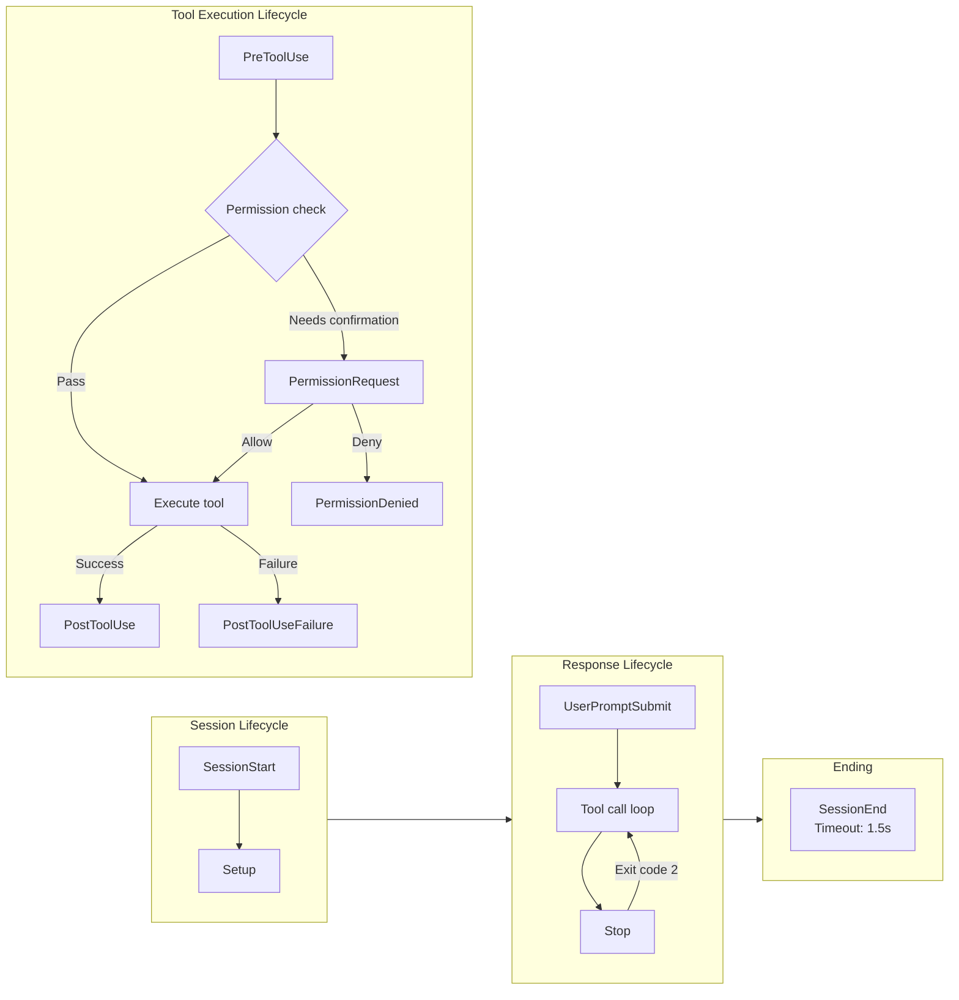
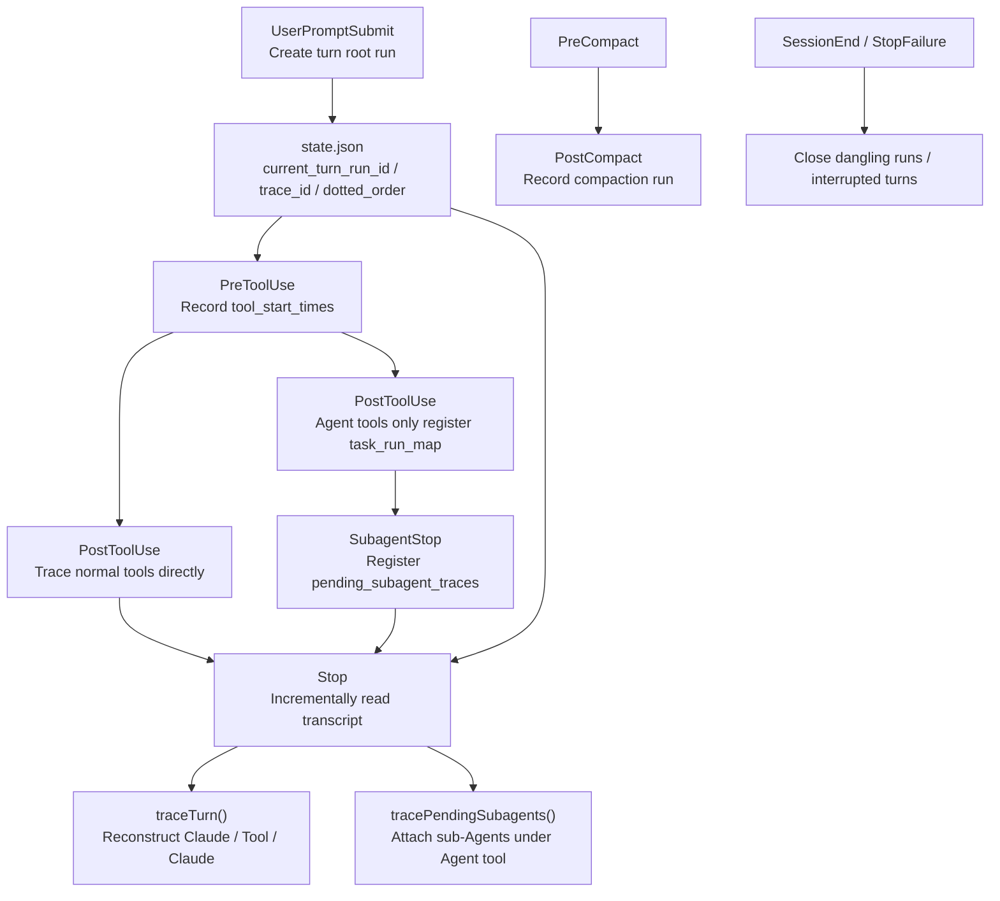

# Chapter 18: Hooks — User-Defined Interception Points

> **Positioning**: 이 Chapter는 Hooks 시스템 — Agent 라이프사이클의 26개 이벤트 지점에서 커스텀 Shell 명령, LLM prompt, 또는 HTTP request를 등록하는 메커니즘 — 을 분석한다. 사전 지식: Chapter 16 (Permission System). 대상 독자: CC의 사용자 정의 interception point 메커니즘을 이해하고 싶은 독자, 또는 자신의 Agent에 hook 시스템을 구현하려는 개발자.

## Why This Matters

Claude Code의 permission 시스템(Chapter 16)과 YOLO classifier(Chapter 17)는 built-in 보안 방어를 제공하지만, 모두 "pre-configured"다 — 사용자는 tool 실행 파이프라인의 중요 노드에 자신의 로직을 삽입할 수 없다. Hooks 시스템은 이 gap을 채운다: AI Agent 라이프사이클의 26개 이벤트 지점에서 커스텀 shell 명령, LLM prompt, HTTP request, 또는 Agent validator를 등록할 수 있게 하여 "format checking"에서 "auto-deployment"까지 모든 workflow 커스터마이제이션을 가능하게 한다.

이것은 단순한 "callback function" 메커니즘이 아니다. Hooks 시스템은 네 가지 핵심 과제를 해결해야 한다: Trust — 임의 명령 실행에 대한 보안 경계는 어디인가? Timeout — Hook이 hang될 때 전체 Agent loop를 블로킹하는 것을 어떻게 방지하는가? Semantics — Hook의 exit code가 "allow" 또는 "block" 결정으로 어떻게 번역되는가? 그리고 설정 격리 — 여러 소스의 Hook 설정이 서로 간섭 없이 어떻게 merge되는가?

이 Chapter는 이 메커니즘을 소스 코드 레벨에서 철저히 해부한다.

### Hook 이벤트 라이프사이클 개요 (Hook Event Lifecycle Overview)



---

## 18.1 Hook 이벤트 타입의 완전한 목록 (Complete List of Hook Event Types)

Hooks 시스템은 26개 이벤트 타입을 지원하며, `hooksConfigManager.ts`의 `getHookEventMetadata` 함수(lines 28-264)에 정의된다. 라이프사이클 phase별로 5개 범주로 그룹화할 수 있다.

### Tool 실행 라이프사이클 (Tool Execution Lifecycle)

| Event | Trigger Timing | matcher Field | Exit Code 2 Behavior |
|-------|---------------|---------------|---------------------|
| `PreToolUse` | Tool 실행 전 | `tool_name` | Tool 호출 block; stderr를 모델에 전송 |
| `PostToolUse` | Tool 성공 실행 후 | `tool_name` | stderr를 즉시 모델에 전송 |
| `PostToolUseFailure` | Tool 실패 실행 후 | `tool_name` | stderr를 즉시 모델에 전송 |
| `PermissionRequest` | Permission 대화상자 표시 시 | `tool_name` | Hook의 결정 사용 |
| `PermissionDenied` | Auto mode classifier가 tool 호출 거부 후 | `tool_name` | — |

`PreToolUse`는 가장 일반적으로 사용되는 Hook 지점이다. 그 `hookSpecificOutput`은 세 가지 permission 결정을 지원한다(lines 72-78, `types/hooks.ts`).

```typescript
// types/hooks.ts:72-78
z.object({
  hookEventName: z.literal('PreToolUse'),
  permissionDecision: permissionBehaviorSchema().optional(),
  permissionDecisionReason: z.string().optional(),
  updatedInput: z.record(z.string(), z.unknown()).optional(),
  additionalContext: z.string().optional(),
})
```

`updatedInput` 필드에 주목하라 — Hook은 "허용 여부"를 결정할 뿐만 아니라 tool의 입력 파라미터를 수정할 수도 있다. 이는 "명령 재작성"을 가능하게 한다: 예를 들어 모든 `git push` 전에 자동으로 `--no-verify`를 추가.

### Session 라이프사이클 (Session Lifecycle)

| Event | Trigger Timing | matcher Field | Special Behavior |
|-------|---------------|---------------|-----------------|
| `SessionStart` | 새 세션/resume/clear/compact | `source` (startup/resume/clear/compact) | stdout을 Claude에 전송; blocking error 무시 |
| `SessionEnd` | 세션 종료 시 | `reason` (clear/logout/prompt_input_exit/other) | Timeout 1.5초만 |
| `Setup` | Repo 초기화 및 유지보수 중 | `trigger` (init/maintenance) | stdout을 Claude에 전송 |
| `Stop` | Claude가 응답 종료 직전 | — | Exit code 2는 대화 계속 |
| `StopFailure` | API 에러로 turn 종료 시 | `error` (rate_limit/authentication_failed/...) | fire-and-forget |
| `UserPromptSubmit` | 사용자가 prompt 제출 시 | — | Exit code 2는 처리 block하고 원래 prompt 지움 |

`SessionStart` Hook은 독특한 기능을 가진다: `CLAUDE_ENV_FILE` 환경 변수를 통해 Hook은 bash export statement를 지정된 파일에 기록할 수 있으며, 이 환경 변수는 모든 후속 BashTool 명령에서 효력을 발휘한다(lines 917-926, `hooks.ts`).

```typescript
// hooks.ts:917-926
if (
  !isPowerShell &&
  (hookEvent === 'SessionStart' ||
    hookEvent === 'Setup' ||
    hookEvent === 'CwdChanged' ||
    hookEvent === 'FileChanged') &&
  hookIndex !== undefined
) {
  envVars.CLAUDE_ENV_FILE = await getHookEnvFilePath(hookEvent, hookIndex)
}
```

### Multi-Agent 라이프사이클 (Multi-Agent Lifecycle)

| Event | Trigger Timing | matcher Field |
|-------|---------------|---------------|
| `SubagentStart` | Sub-Agent 시작 시 | `agent_type` |
| `SubagentStop` | Sub-Agent 응답 종료 직전 | `agent_type` |
| `TeammateIdle` | Teammate가 idle 상태 진입 직전 | — |
| `TaskCreated` | Task 생성 시 | — |
| `TaskCompleted` | Task 완료 시 | — |

### 파일과 설정 변경 (File and Configuration Changes)

| Event | Trigger Timing | matcher Field |
|-------|---------------|---------------|
| `FileChanged` | Watch된 파일 변경 시 | Filename (예: `.envrc\|.env`) |
| `CwdChanged` | Working directory 변경 후 | — |
| `ConfigChange` | 세션 중 config 파일 변경 시 | `source` (user_settings/project_settings/...) |
| `InstructionsLoaded` | CLAUDE.md 또는 rule 파일 로드 시 | `load_reason` (session_start/path_glob_match/...) |

### Compaction, MCP 상호작용, Worktree (Compaction, MCP Interaction, and Worktree)

| Event | Trigger Timing | matcher Field |
|-------|---------------|---------------|
| `PreCompact` | 대화 compaction 전 | `trigger` (manual/auto) |
| `PostCompact` | 대화 compaction 후 | `trigger` (manual/auto) |
| `Elicitation` | MCP 서버가 사용자 입력 요청 시 | `mcp_server_name` |
| `ElicitationResult` | 사용자가 MCP elicitation에 응답한 후 | `mcp_server_name` |
| `WorktreeCreate` | 격리된 worktree 생성 시 | — |
| `WorktreeRemove` | Worktree 제거 시 | — |

---

## 18.2 4가지 Hook 타입 (Four Hook Types)

Hooks 시스템은 네 가지 persistable Hook 타입을 지원하며, runtime 등록 내부 타입 2개가 추가된다. 모든 persistable 타입 schema는 `schemas/hooks.ts`의 `buildHookSchemas` 함수(lines 31-163)에 정의된다.

### command Type: Shell 명령 (command Type: Shell Commands)

가장 기본이며 일반적으로 사용되는 타입:

```typescript
// schemas/hooks.ts:32-65
const BashCommandHookSchema = z.object({
  type: z.literal('command'),
  command: z.string(),
  if: IfConditionSchema(),
  shell: z.enum(SHELL_TYPES).optional(),   // 'bash' | 'powershell'
  timeout: z.number().positive().optional(),
  statusMessage: z.string().optional(),
  once: z.boolean().optional(),            // Single 실행 후 제거
  async: z.boolean().optional(),           // Background 실행, non-blocking
  asyncRewake: z.boolean().optional(),     // Background 실행, exit code 2에서 모델 rewake
})
```

`shell` 필드는 인터프리터 선택을 제어한다(lines 790-791, `hooks.ts`) — default는 `bash`(실제로는 `$SHELL` 사용, bash/zsh/sh 지원); `powershell`은 `pwsh` 사용. 두 실행 경로는 완전히 분리된다: bash 경로는 Windows Git Bash 경로 변환(`C:\Users\foo` -> `/c/Users/foo`), `.sh` 파일용 자동 `bash` prefix, `CLAUDE_CODE_SHELL_PREFIX` wrapping을 처리; PowerShell 경로는 이 모든 것을 건너뛰고 네이티브 Windows 경로 사용.

`if` 필드는 fine-grained 조건부 필터링을 제공한다. Permission rule syntax(예: `Bash(git *)`)를 사용하며, spawn 후가 아니라 Hook 매칭 단계에서 평가된다 — 매치하지 않는 명령에 대해 쓸모없는 프로세스를 spawn하는 것을 피한다(lines 1390-1421, `hooks.ts`).

```typescript
// hooks.ts:1390-1421
async function prepareIfConditionMatcher(
  hookInput: HookInput,
  tools: Tools | undefined,
): Promise<IfConditionMatcher | undefined> {
  if (
    hookInput.hook_event_name !== 'PreToolUse' &&
    hookInput.hook_event_name !== 'PostToolUse' &&
    hookInput.hook_event_name !== 'PostToolUseFailure' &&
    hookInput.hook_event_name !== 'PermissionRequest'
  ) {
    return undefined
  }
  // ...reuses permission rule parser and tool's preparePermissionMatcher
}
```

### prompt Type: LLM 평가 (prompt Type: LLM Evaluation)

Hook 입력을 경량 LLM에 보내 평가:

```typescript
// schemas/hooks.ts:67-95
const PromptHookSchema = z.object({
  type: z.literal('prompt'),
  prompt: z.string(),     // $ARGUMENTS placeholder를 사용해 Hook 입력 JSON 주입
  if: IfConditionSchema(),
  model: z.string().optional(),  // Default는 small fast model
  statusMessage: z.string().optional(),
  once: z.boolean().optional(),
})
```

### agent Type: Agent Validator

prompt보다 더 강력 — 조건 검증을 위해 완전한 Agent loop를 실행:

```typescript
// schemas/hooks.ts:128-163
const AgentHookSchema = z.object({
  type: z.literal('agent'),
  prompt: z.string(),     // "Verify that unit tests ran and passed."
  if: IfConditionSchema(),
  timeout: z.number().positive().optional(),  // Default 60초
  model: z.string().optional(),  // Default는 Haiku
  statusMessage: z.string().optional(),
  once: z.boolean().optional(),
})
```

소스 코드에 중요한 설계 노트가 있다(lines 130-141): `prompt` 필드는 이전에 `.transform()`으로 함수로 감싸져 `JSON.stringify` 중에 loss를 일으켰다 — 이 버그는 gh-24920/CC-79로 추적되었고 수정되었다.

### http Type: Webhook

Hook 입력을 지정된 URL에 POST:

```typescript
// schemas/hooks.ts:97-126
const HttpHookSchema = z.object({
  type: z.literal('http'),
  url: z.string().url(),
  if: IfConditionSchema(),
  timeout: z.number().positive().optional(),
  headers: z.record(z.string(), z.string()).optional(),
  allowedEnvVars: z.array(z.string()).optional(),
  statusMessage: z.string().optional(),
  once: z.boolean().optional(),
})
```

`headers`는 환경 변수 interpolation(`$VAR_NAME` 또는 `${VAR_NAME}`)을 지원하지만, `allowedEnvVars`에 나열된 변수만 resolve된다 — 민감한 환경 변수의 우연한 leak을 방지하는 명시적 whitelist 메커니즘.

Note: HTTP Hook은 `SessionStart`와 `Setup` 이벤트를 지원하지 않는다(lines 1853-1864, `hooks.ts`). Sandbox ask callback이 headless mode에서 deadlock되기 때문이다.

### 내부 타입: callback과 function (Internal Types: callback and function)

이 두 타입은 설정 파일로 정의할 수 없다; SDK와 내부 컴포넌트 등록에만 사용. `callback` 타입은 attribution hook, session 파일 access hook, 기타 내부 feature에 사용된다; `function` 타입은 Agent frontmatter를 통해 등록된 구조화된 출력 enforcer에 사용된다.

---

## 18.3 실행 모델 (Execution Model)

### Async Generator 아키텍처 (Async Generator Architecture)

`executeHooks`는 전체 시스템의 핵심 함수다(lines 1952-2098, `hooks.ts`), `async function*`로 선언된다 — async generator.

```typescript
// hooks.ts:1952-1977
async function* executeHooks({
  hookInput,
  toolUseID,
  matchQuery,
  signal,
  timeoutMs = TOOL_HOOK_EXECUTION_TIMEOUT_MS,
  toolUseContext,
  messages,
  forceSyncExecution,
  requestPrompt,
  toolInputSummary,
}: { /* ... */ }): AsyncGenerator<AggregatedHookResult> {
```

이 설계는 호출자가 `for await...of`로 Hook 실행 결과를 점진적으로 받을 수 있게 하여 streaming 처리가 가능하다. 각 Hook은 실행 전에 progress 메시지를 yield하고 완료 후 최종 결과를 yield한다.

### Timeout 전략 (Timeout Strategy)

Timeout 전략은 이벤트 타입에 기반해 두 tier로 나뉜다.

**Default timeout: 10분.** Line 166에 정의:

```typescript
// hooks.ts:166
const TOOL_HOOK_EXECUTION_TIMEOUT_MS = 10 * 60 * 1000
```

이 더 긴 timeout은 대부분의 Hook 이벤트에 적용된다 — 사용자 CI 스크립트, 테스트 스위트, build 명령이 몇 분 걸릴 수 있다.

**SessionEnd timeout: 1.5초.** Lines 175-182에 정의:

```typescript
// hooks.ts:174-182
const SESSION_END_HOOK_TIMEOUT_MS_DEFAULT = 1500
export function getSessionEndHookTimeoutMs(): number {
  const raw = process.env.CLAUDE_CODE_SESSIONEND_HOOKS_TIMEOUT_MS
  const parsed = raw ? parseInt(raw, 10) : NaN
  return Number.isFinite(parsed) && parsed > 0
    ? parsed
    : SESSION_END_HOOK_TIMEOUT_MS_DEFAULT
}
```

SessionEnd Hook은 close/clear 중 실행되며 극히 엄격한 timeout 제약을 가져야 한다 — 그렇지 않으면 사용자가 Ctrl+C를 누른 후 10분을 기다려야 나갈 수 있다. 1.5초는 개별 Hook의 default timeout이자 전체 AbortSignal 제한이다(모든 Hook이 parallel로 실행되기 때문). 사용자는 `CLAUDE_CODE_SESSIONEND_HOOKS_TIMEOUT_MS` 환경 변수로 override할 수 있다.

각 Hook은 `timeout` 필드(초)를 통해 자체 timeout을 지정할 수도 있으며, default를 override한다(lines 877-879).

```typescript
// hooks.ts:877-879
const hookTimeoutMs = hook.timeout
  ? hook.timeout * 1000
  : TOOL_HOOK_EXECUTION_TIMEOUT_MS
```

### Async Background Hook

Hook은 두 가지 방식으로 background 실행에 진입할 수 있다.

1. **설정 선언**: `async: true` 또는 `asyncRewake: true` 설정(lines 995-1029)
2. **Runtime 선언**: Hook이 첫 라인에 `{"async": true}` JSON 출력(lines 1117-1164)

핵심 차이는 `asyncRewake`다: 이 flag가 설정되면 background Hook은 async registry에 등록하지 않는다. 대신 완료 시 exit code를 확인한다 — exit code 2면 `enqueuePendingNotification`을 통해 에러 메시지를 `task-notification`으로 enqueue하여 모델을 rewake해 처리를 계속하게 한다(lines 205-244).

Background Hook 실행 중의 미묘한 디테일: backgrounding 전에 stdin이 작성되어야 한다. 그렇지 않으면 bash의 `read -r line`이 EOF로 인해 exit code 1을 반환한다 — 이 버그는 gh-30509/CC-161로 추적되었다(주석 lines 1001-1008).

### Prompt Request 프로토콜 (Prompt Request Protocol)

Command 타입 Hook은 양방향 상호작용 프로토콜을 지원한다: Hook 프로세스는 JSON 형식의 prompt request를 stdout에 기록할 수 있고, Claude Code는 사용자에게 선택 대화상자를 표시하며, 사용자의 선택은 stdin을 통해 돌아온다.

```typescript
// types/hooks.ts:28-40
export const promptRequestSchema = lazySchema(() =>
  z.object({
    prompt: z.string(),       // Request ID
    message: z.string(),      // 사용자에게 표시되는 메시지
    options: z.array(
      z.object({
        key: z.string(),
        label: z.string(),
        description: z.string().optional(),
      }),
    ),
  }),
)
```

이 프로토콜은 직렬화된다 — 여러 prompt request는 순차적으로 처리되어(line 1064의 `promptChain`) 응답이 순서가 어긋나 도착하지 않도록 보장한다.

---

## 18.4 Exit Code Semantics

Exit code는 Hook과 Claude Code 간의 주요 통신 프로토콜이다.

| Exit Code | Semantics | Behavior |
|-----------|-----------|----------|
| **0** | Success/allow | stdout/stderr 표시 안 됨 (또는 transcript mode에서만 표시) |
| **2** | Blocking error | stderr를 모델에 전송; 현재 작업 block |
| **Other** | Non-blocking error | stderr는 사용자에게만 표시; 작업 계속 |

그러나 서로 다른 이벤트 타입은 exit code를 다르게 해석한다. 다음은 핵심 차이다.

- **PreToolUse**: Exit code 2는 tool 호출을 block하고 stderr를 모델에 전송; exit code 0의 stdout/stderr는 표시 안 됨
- **Stop**: Exit code 2는 stderr를 모델에 전송하고 **대화를 계속**(종료 대신) — 이것이 "continue coding" mode의 구현 기반이다
- **UserPromptSubmit**: Exit code 2는 처리를 block하고 **원래 prompt를 지우며**, stderr만 사용자에게 표시
- **SessionStart/Setup**: Blocking error 무시 — 이 이벤트들은 Hook이 startup flow를 block하는 것을 허용하지 않는다
- **StopFailure**: fire-and-forget; 모든 출력과 exit code 무시

### JSON Output 프로토콜 (JSON Output Protocol)

Exit code를 넘어, Hook은 stdout JSON 출력을 통해 구조화된 정보를 전달할 수도 있다. `parseHookOutput` 함수의(lines 399-451) 로직은: stdout이 `{`로 시작하면 JSON 파싱과 Zod schema 검증을 시도; 그렇지 않으면 plain 텍스트로 처리한다.

완전한 JSON 출력 schema는 `types/hooks.ts:50-176`에 정의된다. 핵심 필드는 다음을 포함한다.

```typescript
// types/hooks.ts:50-66
export const syncHookResponseSchema = lazySchema(() =>
  z.object({
    continue: z.boolean().optional(),       // false = 실행 중지
    suppressOutput: z.boolean().optional(), // true = stdout 숨김
    stopReason: z.string().optional(),      // continue=false일 때 메시지
    decision: z.enum(['approve', 'block']).optional(),
    reason: z.string().optional(),
    systemMessage: z.string().optional(),   // 사용자에게 표시되는 경고
    hookSpecificOutput: z.union([/* per-event-type specific output */]).optional(),
  }),
)
```

`hookSpecificOutput`은 discriminated union이며, 각 이벤트 타입이 자체 특화 필드를 가진다. 예를 들어 `PermissionRequest` 이벤트(lines 121-133)는 `allow`/`deny` 결정과 permission update를 지원한다.

```typescript
// types/hooks.ts:121-133
z.object({
  hookEventName: z.literal('PermissionRequest'),
  decision: z.union([
    z.object({
      behavior: z.literal('allow'),
      updatedInput: z.record(z.string(), z.unknown()).optional(),
      updatedPermissions: z.array(permissionUpdateSchema()).optional(),
    }),
    z.object({
      behavior: z.literal('deny'),
      message: z.string().optional(),
      interrupt: z.boolean().optional(),
    }),
  ]),
})
```

---

## 18.5 Trust Gating

Hook 실행의 보안 gate는 `shouldSkipHookDueToTrust` 함수(lines 286-296)가 구현한다.

```typescript
// hooks.ts:286-296
export function shouldSkipHookDueToTrust(): boolean {
  const isInteractive = !getIsNonInteractiveSession()
  if (!isInteractive) {
    return false  // Trust is implicit in SDK mode
  }
  const hasTrust = checkHasTrustDialogAccepted()
  return !hasTrust
}
```

규칙은 단순하지만 critical하다.

1. **Non-interactive mode (SDK)**: Trust는 암묵적; 모든 Hook이 직접 실행
2. **Interactive mode**: **모든** Hook이 trust dialog 확인 필요

코드 주석(lines 267-285)은 "왜 모두"인지 상세히 설명한다: Hook 설정은 `captureHooksConfigSnapshot()` 단계에서 캡처되는데, 이것은 trust dialog 표시 전에 일어난다. 대부분의 Hook이 정상 프로그램 흐름을 통해 trust 확인 전에 실행되지 않지만, 역사적으로 두 가지 취약점이 있었다 — 사용자가 trust를 거부해도 `SessionEnd` Hook이 실행되었고, trust 확인 전에 sub-Agent가 완료되면 `SubagentStop` Hook이 실행되었다. Defense-in-depth 원칙은 모든 Hook에 대한 균일한 check를 요구한다.

`executeHooks` 함수도 실행 전에 중앙 집중식 check를 수행한다(lines 1993-1999).

```typescript
// hooks.ts:1993-1999
if (shouldSkipHookDueToTrust()) {
  logForDebugging(
    `Skipping ${hookName} hook execution - workspace trust not accepted`,
  )
  return
}
```

추가로, `disableAllHooks` 설정은 더 극단적 제어를 제공한다(lines 1978-1979) — policySettings에 설정되면 managed Hook을 포함한 모든 Hook을 비활성화; non-managed 설정에 설정되면 non-managed Hook만 비활성화한다(managed Hook은 여전히 실행).

---

## 18.6 설정 Snapshot 추적 (Configuration Snapshot Tracking)

Hook 설정은 각 실행마다 실시간으로 읽히지 않고 snapshot 메커니즘으로 관리된다. `hooksConfigSnapshot.ts`는 이 시스템을 정의한다.

### Snapshot 캡처 (Snapshot Capture)

`captureHooksConfigSnapshot()`(lines 95-97)은 애플리케이션 시작 시 한 번 호출된다.

```typescript
// hooksConfigSnapshot.ts:95-97
export function captureHooksConfigSnapshot(): void {
  initialHooksConfig = getHooksFromAllowedSources()
}
```

### Source 필터링 (Source Filtering)

`getHooksFromAllowedSources()`(lines 18-53)은 multi-layer 필터링 로직을 구현한다.

1. policySettings가 `disableAllHooks: true`를 설정하면 빈 설정 반환
2. policySettings가 `allowManagedHooksOnly: true`를 설정하면 managed hook만 반환
3. `strictPluginOnlyCustomization` 정책이 활성화되면 user/project/local 설정의 hook을 block
4. Non-managed 설정이 `disableAllHooks`를 설정하면 managed hook만 실행
5. 그렇지 않으면 모든 소스에서 merge된 설정 반환

### Snapshot 업데이트 (Snapshot Updates)

사용자가 `/hooks` 명령으로 Hook 설정을 수정하면 `updateHooksConfigSnapshot()`(lines 104-112)이 호출된다.

```typescript
// hooksConfigSnapshot.ts:104-112
export function updateHooksConfigSnapshot(): void {
  resetSettingsCache()  // 디스크에서 최신 설정 읽기 보장
  initialHooksConfig = getHooksFromAllowedSources()
}
```

`resetSettingsCache()` 호출에 주목하라 — 그것 없이는 snapshot이 stale한 캐시된 설정을 사용할 수 있다. 파일 watcher의 stability threshold가 아직 트리거되지 않았을 수 있기 때문이다(주석이 이것을 언급한다).

---

## 18.7 매칭과 중복 제거 (Matching and Deduplication)

### Matcher 패턴 (Matcher Patterns)

각 Hook 설정은 `matcher` 필드를 지정해 정밀한 트리거 조건 필터링을 할 수 있다. `matchesPattern` 함수(lines 1346-1381)는 세 모드를 지원한다.

1. **Exact match**: `Write`는 tool 이름 `Write`만 매치
2. **Pipe-separated**: `Write|Edit`는 `Write` 또는 `Edit` 매치
3. **Regular expression**: `^Write.*`는 `Write`로 시작하는 모든 tool 이름 매치

판정은 문자열 내용에 기반한다: `[a-zA-Z0-9_|]`만 포함하면 simple match로 처리; 그렇지 않으면 regex.

### 중복 제거 메커니즘 (Deduplication Mechanism)

같은 명령이 여러 설정 소스(user/project/local)에서 정의될 수 있으며; 중복 제거는 `hookDedupKey` 함수(lines 1453-1455)가 처리한다.

```typescript
// hooks.ts:1453-1455
function hookDedupKey(m: MatchedHook, payload: string): string {
  return `${m.pluginRoot ?? m.skillRoot ?? ''}\0${payload}`
}
```

핵심 설계: dedup key는 소스 context로 namespace된다 — 서로 다른 plugin 디렉터리의 같은 `echo hello` 명령은 dedupe되지 않는다(`${CLAUDE_PLUGIN_ROOT}`를 확장하면 서로 다른 파일을 가리키기 때문), 하지만 같은 소스 내 user/project/local 설정 전반의 같은 명령은 하나로 merge된다.

`callback`과 `function` 타입 Hook은 중복 제거를 건너뛴다 — 각 인스턴스는 고유하다. 모든 매칭 Hook이 callback/function 타입일 때, fast path도 있다(lines 1723-1729) — 6-round 필터링과 Map 구축을 완전히 건너뛴다; micro-benchmark는 44배 성능 개선을 보여준다.

---

## 18.8 실용적 설정 예시 (Practical Configuration Examples)

### Example 1: PreToolUse Format Check

모든 TypeScript 파일 쓰기 전 자동으로 format check 실행:

```json
{
  "hooks": {
    "PreToolUse": [
      {
        "matcher": "Write|Edit",
        "hooks": [
          {
            "type": "command",
            "command": "FILE=$(echo $ARGUMENTS | jq -r '.file_path') && prettier --check \"$CLAUDE_PROJECT_DIR/$FILE\" 2>&1 || echo '{\"decision\":\"block\",\"reason\":\"File does not pass prettier formatting\"}'",
            "if": "Write(*.ts)",
            "statusMessage": "Checking formatting..."
          }
        ]
      }
    ]
  }
}
```

이 설정은 몇 가지 핵심 기능을 보여준다.

- `matcher: "Write|Edit"`는 pipe 분리를 사용해 두 tool 매치
- `if: "Write(*.ts)"`는 추가 필터링을 위해 permission rule syntax 사용 — 이 예에서는 `.ts` 파일에만 적용. `if` 필드는 모든 permission rule 패턴을 지원한다: `"Bash(git *)"`로 git 명령만 매치, `"Edit(src/**)"`로 src 디렉터리 편집만 매치, `"Read(*.py)"`로 Python 파일 읽기만 매치 등
- `$CLAUDE_PROJECT_DIR` 환경 변수는 프로젝트 루트 디렉터리로 자동 설정됨(lines 813-816)
- Hook 입력 JSON은 stdin으로 전달; Hook은 `$ARGUMENTS`로 참조하거나 stdin에서 직접 읽을 수 있다
- JSON 출력 프로토콜의 `decision: "block"`은 비준수 쓰기를 block

### Example 2: SessionStart 환경 초기화 + Stop 자동 검증

SessionStart와 Stop Hook을 결합해 "auto 개발 환경" 구현:

```json
{
  "hooks": {
    "SessionStart": [
      {
        "matcher": "startup",
        "hooks": [
          {
            "type": "command",
            "command": "echo 'export NODE_ENV=development' >> $CLAUDE_ENV_FILE && echo '{\"hookSpecificOutput\":{\"hookEventName\":\"SessionStart\",\"additionalContext\":\"Dev environment configured. Node: '$(node -v)'\"}}'",
            "statusMessage": "Setting up dev environment..."
          }
        ]
      }
    ],
    "Stop": [
      {
        "hooks": [
          {
            "type": "agent",
            "prompt": "Check if there are uncommitted changes. If so, create an appropriate commit message and commit them. Verify the commit was successful.",
            "timeout": 120,
            "model": "claude-sonnet-4-6",
            "statusMessage": "Auto-committing changes..."
          }
        ]
      }
    ]
  }
}
```

이 예시는 다음을 보여준다.

- SessionStart Hook은 `CLAUDE_ENV_FILE`을 사용해 후속 Bash 명령에 환경 변수 주입
- `additionalContext`는 정보를 context로 Claude에 전송
- Stop Hook은 `agent` 타입을 사용해 완전한 검증 Agent 실행
- `timeout: 120`은 default 60초 timeout을 override

---

## 18.9 Hook 소스 계층과 Merge (Hook Source Hierarchy and Merging)

`getHooksConfig` 함수(lines 1492-1566)는 서로 다른 소스의 Hook 설정을 통합 목록으로 merge한다. 소스 순위 내림차순:

1. **설정 snapshot** (settings.json merge된 결과): `getHooksConfigFromSnapshot()`을 통해 획득
2. **등록된 Hook** (SDK callback + plugin 네이티브 Hook): `getRegisteredHooks()`을 통해 획득
3. **Session Hook** (Agent frontmatter로 등록된 Hook): `getSessionHooks()`을 통해 획득
4. **Session function Hook** (구조화된 출력 enforcer 등): `getSessionFunctionHooks()`을 통해 획득

`allowManagedHooksOnly` 정책이 활성화되면, 소스 2-4의 non-managed Hook은 건너뛴다. 이 필터링은 실행 단계가 아니라 merge 단계에서 일어난다 — 근본적으로 non-managed Hook이 실행 파이프라인에 들어가는 것을 block한다.

`hasHookForEvent` 함수(lines 1582-1593)는 경량 존재 check다 — 완전한 merged list를 구축하지 않고 첫 매치 발견 후 즉시 반환한다. 이는 hot path(`InstructionsLoaded`와 `WorktreeCreate` 이벤트 같은)의 short-circuit 최적화에 사용되어, Hook 설정이 없을 때 불필요한 `createBaseHookInput`과 `getMatchingHooks` 호출을 피한다.

---

## 18.10 Process 관리와 Shell Branching (Process Management and Shell Branching)

Hook process spawn 로직(lines 940-984)은 shell 타입에 기반해 두 완전히 독립된 경로로 나뉜다.

**Bash path:**
```typescript
// hooks.ts:976-983
const shell = isWindows ? findGitBashPath() : true
child = spawn(finalCommand, [], {
  env: envVars,
  cwd: safeCwd,
  shell,
  windowsHide: true,
})
```

Windows에서는 cmd.exe 대신 Git Bash가 사용된다 — 모든 경로가 POSIX 형식이어야 함을 의미한다. `windowsPathToPosixPath()`는 순수 JS 정규식 변환(LRU-500 캐시 포함)이며 cygpath로 shell-out할 필요 없다.

**PowerShell path:**
```typescript
// hooks.ts:967-972
child = spawn(pwshPath, buildPowerShellArgs(finalCommand), {
  env: envVars,
  cwd: safeCwd,
  windowsHide: true,
})
```

`-NoProfile -NonInteractive -Command` 인자 사용 — 사용자 profile 스크립트 건너뜀(더 빠르고 결정론적), 입력이 필요할 때 hang 대신 fast fail.

미묘한 안전 check: spawn 전에 `getCwd()`가 반환한 디렉터리가 존재하는지 검증한다(lines 931-938). Agent worktree가 제거되면 AsyncLocalStorage가 삭제된 경로를 반환할 수 있다; 이 경우 `getOriginalCwd()`로 fallback한다.

### Plugin Hook 변수 치환 (Plugin Hook Variable Substitution)

Hook이 plugin에서 올 때, 명령 문자열의 템플릿 변수는 spawn 전에 교체된다(lines 818-857).

- `${CLAUDE_PLUGIN_ROOT}`: Plugin의 설치 디렉터리
- `${CLAUDE_PLUGIN_DATA}`: Plugin의 persistent 데이터 디렉터리
- `${user_config.X}`: 사용자가 `/plugin`으로 설정한 옵션 값

교체 순서가 중요하다: plugin 변수가 사용자 config 변수 전에 교체된다 — 이는 사용자 config 값의 `${CLAUDE_PLUGIN_ROOT}` literal이 이중 parse되는 것을 방지한다. Plugin 디렉터리가 존재하지 않으면(GC race 또는 동시 세션 삭제로), 코드는 spawn 전에 명시적 에러를 throw하며(lines 831-836), 명령이 스크립트를 찾지 못한 후 exit code 2로 종료되는 것이 아니다 — 이는 "의도적 blocking"으로 오해될 수 있기 때문이다.

Plugin 옵션도 환경 변수로 노출된다(lines 898-906), `CLAUDE_PLUGIN_OPTION_<KEY>` 형식으로 명명되며, KEY는 대문자화되고 비식별자 문자는 언더스코어로 교체된다. 이는 Hook 스크립트가 명령 문자열에 `${user_config.X}` 템플릿을 사용하는 대신 환경 변수로 설정을 읽을 수 있게 한다.

---

## 18.11 사례 연구: Hooks로 LangSmith Runtime Tracing 구축 (Case Study: Building LangSmith Runtime Tracing with Hooks)

오픈소스 프로젝트 `langsmith-claude-code-plugins`는 매우 대표적인 사례를 제공한다: **Claude Code 소스 코드를 수정하지 않고 Anthropic API request를 proxy하지도 않으면서 turn, tool 호출, sub-Agent, compaction 이벤트를 trace할 수 있다.** 이는 Hooks 시스템의 가치가 "어떤 이벤트 지점에서 스크립트 실행"을 넘어선다는 것을 보여준다 — 외부 통합 표면을 구성하기에 충분하다.

이 plugin의 핵심 아이디어는 한 문장으로 요약할 수 있다:

> **Hook을 사용해 라이프사이클 신호를 수집하고, transcript를 fact log로 사용하며, 로컬 state machine을 사용해 흩어진 신호를 완전한 trace tree로 재조립하라.**

이것은 black magic이 아니라 Claude Code가 공식적으로 노출한 몇 가지 기능에 의존한다.

1. Plugin은 자체 `hooks/hooks.json`을 포함해 여러 라이프사이클 이벤트에 command 타입 Hook을 마운트할 수 있다
2. Hook은 모호한 환경 변수가 아니라 구조화된 JSON을 stdin으로 받는다
3. 모든 Hook 입력은 `session_id`, `transcript_path`, `cwd`를 포함한다
4. `Stop` / `SubagentStop`은 `last_assistant_message`, `agent_transcript_path` 같은 고가치 필드를 추가로 전달한다
5. Hook 명령은 `${CLAUDE_PLUGIN_ROOT}`로 plugin의 자체 bundle 디렉터리를 참조할 수 있다
6. `async: true`는 plugin이 주요 상호작용 경로를 block하지 않고 background에서 네트워크 전달을 할 수 있게 한다

### 외부 Plugin이 완전한 Trace를 조립하는 방법 (How an External Plugin Assembles a Complete Trace)

LangSmith plugin은 9개 Hook 이벤트를 등록한다.

| Hook Event | Purpose |
|-----------|---------|
| `UserPromptSubmit` | 현재 turn을 위한 LangSmith 루트 run 생성 |
| `PreToolUse` | Tool의 실제 시작 시간 기록 |
| `PostToolUse` | 일반 tool trace; Agent tool을 위해 parent run 예약 |
| `Stop` | Transcript를 점진적으로 읽고 turn/llm/tool 계층 재구성 |
| `StopFailure` | API 에러에서 dangling run 닫기 |
| `SubagentStop` | Sub-Agent transcript 경로 기록, 통합 처리를 위해 main `Stop`에 defer |
| `PreCompact` | Compaction 시작 시간 기록 |
| `PostCompact` | Compaction 이벤트와 요약 trace |
| `SessionEnd` | 사용자 exit 또는 `/clear` 시 정리, 중단된 turn 완료 |

그들의 협업 관계는 다음과 같다.



이 흐름에서 가장 주목할 만한 것은: **어떤 단일 Hook도 독립적으로 tracing을 완료할 수 없다**는 점이다. 실제 설계는 "그냥 Stop에서 transcript를 읽고 끝내라"가 아니라 각 라이프사이클 이벤트가 기여한 부분 신호를 조립하는 것이다.

### Core One: UserPromptSubmit가 먼저 루트 노드 수립

Plugin은 `UserPromptSubmit` 이벤트 발생 시 `Claude Code Turn` 루트 run을 생성하고, 다음 상태를 로컬 state 파일에 기록한다.

- `current_turn_run_id`
- `current_trace_id`
- `current_dotted_order`
- `current_turn_number`
- `last_line`

이런 방식으로 후속 `PostToolUse`, `Stop`, `PostCompact`는 모두 그들의 run을 어느 parent 노드 아래에 붙일지 안다.

이것은 중요한 설계 선택이다. 많은 사람이 직관적으로 "모든 것을 한 번에 생성"하기 위해 `Stop`에 tracing을 배치하지만, 그러면 두 가지 기능이 손실된다.

1. **진행 중인 turn**을 위한 안정된 parent run identifier를 제공할 수 없다
2. 후속 async 이벤트(tool 실행, compaction 같은)를 현재 turn 아래에 올바르게 붙일 수 없다

`UserPromptSubmit`의 의미는 "사용자가 메시지를 보냈다"가 아니라 **이 라운드 상호작용을 위한 글로벌 anchor를 수립**한다는 것이다.

### Core Two: Transcript가 Fact Log이고, Hook은 보조 신호일 뿐

실제 콘텐츠 재구성은 `Stop` Hook에서 일어난다.

Plugin은 Hook 입력의 단일 필드에 의존해 full turn trace를 구성하지 않는다. 대신 `transcript_path`를 권위 있는 이벤트 로그로 취급하고, 마지막 처리 이후의 새로운 JSONL 라인을 점진적으로 읽고, 그다음:

1. `message.id`로 assistant streaming chunk를 merge
2. `tool_use`를 후속 `tool_result`와 pair
3. 한 라운드의 사용자 입력을 `Turn`으로 조직
4. `Turn`을 LangSmith의 계층 구조로 변환:
   `Claude Code Turn -> Claude(llm) -> Tool -> Claude(llm) ...`

이 접근 뒤의 중요한 판단: **Hook은 시간 지점을 제공하고, transcript는 사실적 순서를 제공한다.**

Hook만 의존하면:
- "어떤 tool이 실행되었다"는 알지만
- 어느 LLM 호출 뒤에 따라왔는지 모를 수 있다
- Tool 호출 전후의 완전한 context를 정확히 복구하는 것도 어렵다

Transcript만 의존하면:
- 메시지와 tool 순서를 복구할 수 있지만
- Tool의 실제 wall-clock 시작/종료 시간을 얻을 수 없다
- Compaction, session 종료, API 실패 같은 host 레벨 이벤트를 즉시 감지할 수도 없다

그래서 plugin의 실제 기법은 transcript도 hook도 아니라 그들의 **역할 분리**다:

- Transcript는 **의미적 진실** 담당
- Hook은 **runtime metadata** 담당

### Core Three: 왜 PreToolUse / PostToolUse가 여전히 필요한가

`Stop`이 이미 transcript에서 tool 호출을 복구할 수 있다면, 왜 `PreToolUse` / `PostToolUse`가 여전히 필요한가?

답: transcript가 **정밀한 tool 타이머**보다는 **메시지 히스토리**에 가깝기 때문이다.

LangSmith plugin은 이 두 Hook을 두 가지에 사용한다.

1. `PreToolUse`는 `tool_use_id -> start_time` 기록
2. `PostToolUse`는 일반 tool 완료 시 즉시 tool run을 생성하고 `tool_use_id`를 `traced_tool_use_ids`에 기록

이런 방식으로 `Stop`은 transcript replay 중 이미 trace된 일반 tool을 건너뛸 수 있어 중복 run 생성을 피한다. 또한 `last_tool_end_time`은 transcript flush 지연으로 인한 timing 에러를 `Stop`이 수정하는 것을 돕는다.

다시 말해:

- `Stop`은 **의미적 재구성** 해결
- `Pre/PostToolUse`는 **timing 정밀도** 해결

이것은 매우 전형적인 host 확장 패턴이다: **의미적 로그와 성능 타이밍은 서로 다른 신호 소스에서 오며 하나의 소스로 강제 merge될 수 없다.**

### Core Four: 왜 Sub-Agent 추적이 세 단계여야 하는가

Plugin의 가장 우아한 부분은 sub-Agent를 어떻게 추적하는지다.

Claude Code는 공식적으로 두 핵심 퍼즐 조각을 제공한다.

1. `SubagentStop` 이벤트
2. `agent_transcript_path`

이 둘만으로는 충분하지 않다. Plugin은 또한 알아야 한다: **이 sub-Agent가 어느 Agent tool run 아래에 붙어야 하는가?**

그래서 세 단계 설계를 채택한다.

**Stage One: PostToolUse가 Agent Tool 처리**

Tool 반환에 `agentId`가 포함될 때, plugin은 final Agent tool run을 즉시 생성하지 않고 `task_run_map`에 다음을 등록한다.

- `run_id`
- `dotted_order`
- `deferred.start_time`
- `deferred.end_time`
- `deferred.inputs / outputs`

**Stage Two: SubagentStop은 Queue만, 즉시 Trace하지 않음**

`SubagentStop`이 `agent_id`, `agent_type`, `agent_transcript_path`를 받은 후, 즉시 LangSmith request를 만들지 않고 `pending_subagent_traces`에 append만 한다.

**Stage Three: Main Stop이 통합 정산**

Main thread `Stop`이 turn을 완료한 후:

1. 공유 상태 재-read
2. `task_run_map` merge
3. `pending_subagent_traces` 검색
4. Sub-Agent transcript 읽기
5. Agent tool run 아래에 중간 `Subagent` chain 생성
6. 각 sub-Agent의 내부 turn을 하나씩 trace

이 세 단계의 이유는 `PostToolUse`와 `SubagentStop`이 race condition을 가진 async Hook일 수 있기 때문이다. `SubagentStop`이 transcript 경로를 받자마자 즉시 trace하면 다음을 할 수 있다.

- 해당 Agent tool run ID를 아직 가지고 있지 않음
- Parent dotted order를 모름
- 결국 dangling subagent trace 생성

이 사례는 매우 명확히 보여준다: **Claude Code의 Hook 시스템은 선형 callback 모델이 아니라 동시 이벤트 소스다. 외부 plugin은 자체 상태 조정 레이어를 제공해야 한다.**

### Core Five: 왜 Compaction Run을 추적할 수 있는가

Compaction tracing은 plugin이 transcript에서 추측하는 것이 아니다 — 공식 이벤트 `PreCompact` / `PostCompact` 두 개를 직접 활용한다.

그 접근은 단순하지만 효과적이다.

1. `PreCompact`가 현재 시간을 `compaction_start_time`으로 기록
2. `PostCompact`가 `trigger`와 `compact_summary` 읽기
3. 이 세 정보로 `Context Compaction` run 생성

이것은 Claude Code가 plugin에 노출하는 것이 "tool 전후"의 고전 Hook 지점뿐만 아니라 — context compaction 같은 **Agent 내부 self-maintenance 행동**조차 first-class 이벤트로 노출됨을 보여준다. 이것이 정확히 외부 observability plugin이 "compaction run"을 추적할 수 있는 이유다.

### Claude Code가 이 Plugin에 실제로 제공하는 것 (What Claude Code Actually Provides This Plugin)

소스 코드 분석에서 LangSmith plugin이 활용하는 진짜 중요한 Claude Code "기능"은 여섯 가지다.

| Host Capability | Why It's Critical |
|----------------|-------------------|
| `hooks/hooks.json` plugin 진입점 | Plugin이 host 라이프사이클에 command 타입 Hook을 등록할 수 있게 함 |
| 구조화된 stdin JSON | Hook이 필드-구조화된 입력을 받음; 로그 텍스트를 스스로 파싱할 필요 없음 |
| `transcript_path` | Plugin이 transcript를 durable 이벤트 로그로 취급해 점진적 읽기 가능 |
| `last_assistant_message` | `Stop`이 아직 transcript에 완전히 flush되지 않은 tail 응답을 patch 가능 |
| `agent_transcript_path` + `SubagentStop` | Sub-Agent tracing이 가능해짐, main thread에서 Task tool만 보는 것이 아니라 |
| `${CLAUDE_PLUGIN_ROOT}` + `async: true` | Plugin이 자체 bundle을 안정적으로 참조하고 네트워크 전달을 background에 둘 수 있음 |

이것이 또한 그것이 일반적인 "터미널 recorder"가 아닌 이유다. Claude Code가 의도적으로 설계한 **plugin host 인터페이스**에 의존하며, 우연히 사용 가능한 side effect가 아니다.

### 경계: API 레벨 Tracing이 아님 (Boundary: It's Not API-Level Tracing)

이 plugin이 꽤 완전한 runtime tracing을 생성할 수 있지만, 그 경계도 명확하다.

1. **Claude Code runtime을 trace하며, 기반 API의 raw request를 trace하지 않는다.**
   그것이 보는 것은 transcript와 hook 입력에서 재구성된 구조이지, Anthropic API의 모든 raw 필드가 아니다.

2. **Sub-Agent는 현재 완료 후에만 trace 가능하다.**
   이것은 plugin 작성자가 게으른 것이 아니다 — 신호 표면에 의해 결정된다: `SubagentStop`이 발생해야만 plugin이 완전한 `agent_transcript_path`를 얻는다. 사용자가 sub-Agent를 mid-run에서 중단하면, README는 그런 subagent run이 trace되지 않음을 명시적으로 인정한다.

3. **Compaction 이벤트는 요약만 보여주며, compaction 내의 모든 중간 상태는 아니다.**
   `PostCompact`는 `trigger + compact_summary`를 노출하며, observability에는 충분하지만 완전한 compaction debug dump는 아니다.

### Agent Builder에게 이것이 의미하는 것 (What This Means for Agent Builders)

이 사례의 가장 가치 있는 교훈은 "LangSmith와 통합하는 방법"이 아니라, 그것이 드러내는 더 일반적인 아키텍처 원칙이다:

> **Host가 이미 라이프사이클 Hook과 persistent transcript를 제공할 때, 외부 plugin은 main 시스템을 patch하지 않고 고품질 runtime 관찰을 재구성할 수 있다.**

이 아래에 세 가지 재사용 가능한 교훈이 있다.

1. **먼저 host의 노출된 구조화된 이벤트 표면을 찾아라, packet capture가 아니라.**
2. **Transcript를 fact log로 취급하고, Hook을 meta-event patch로 취급하라.**
3. **동시 Hook을 위한 로컬 state machine을 설계하라, 중복 제거, pairing, deferred 정산을 처리하라.**

자신의 Agent 시스템에 외부 observability를 제공하려 한다면, 이 사례는 거의 템플릿 역할을 할 수 있다: **전체 내부 state machine을 노출하려 서두르지 말라 — 몇 가지 핵심 Hook 필드와 durable transcript만 노출하면, 서드파티가 꽤 강력한 통합을 구축할 수 있다.**

---

### Version Evolution: v2.1.92 — Dynamic Stop Hook Management

> 다음 분석은 v2.1.92 bundle 문자열 signal 추론에 기반하며, 완전한 소스 코드 증거는 없다.

v2.1.92는 세 개의 새 이벤트를 추가한다: `tengu_stop_hook_added`, `tengu_stop_hook_command`, `tengu_stop_hook_removed`. 이는 중요한 아키텍처 진화를 드러낸다: **Hook 설정이 순수 정적에서 runtime-manageable로 이동하고 있다**.

#### Static에서 Dynamic으로 (From Static to Dynamic)

v2.1.88(이 Chapter의 모든 선행 분석의 기반)에서 Hook 설정은 완전히 정적이었다. `settings.json`, `.claude/settings.json`, `plugin.json`에 Hook을 정의하고, 세션 시작 시 로드되며, 세션 중 immutable. Hook을 변경하고 싶은가? Config 파일을 편집하고 세션을 재시작.

v2.1.92는 이 제한을 깬다 — 적어도 Stop Hook에 대해서는. 세 새 이벤트는 완전한 CRUD 라이프사이클의 세 작업에 대응한다.

- `stop_hook_added`: Runtime에 Stop Hook 추가
- `stop_hook_command`: Stop Hook이 실행됨
- `stop_hook_removed`: Runtime에 Stop Hook 제거

이는 사용자가 세션 중간에 "이제부터 모든 stop 후 테스트 실행"이라고 말하면, Agent가 Stop Hook 등록을 위한 명령을 호출하고, 그 후 Agent Loop가 멈출 때마다 그 Hook이 트리거됨을 의미한다 — 세션을 나가고 설정을 편집하고 재진입할 필요 없이.

#### 왜 Stop Hook이 Dynamic Management를 먼저 받았는가 (Why Stop Hooks Got Dynamic Management First)

이 선택은 우연이 아니다. Stop Hook은 dynamic management에 가장 적합한 세 가지 특성을 가진다.

1. **강한 task 관련성**: Stop Hook의 전형적 사용은 "Agent가 라운드를 완료한 후 무엇을 할지"다 — 테스트 실행, auto-commit, 코드 format, 알림 전송. 이 필요는 task와 함께 변한다: 코드 쓸 때는 `cargo check`가 자동 실행되길 원하지만; docs 쓸 때는 그렇지 않다.

2. **낮은 보안 위험**: Stop Hook은 Agent가 멈춘 후 트리거되며, Agent의 결정 프로세스에 영향을 주지 않는다. 반대로 PreToolUse Hook은 tool 실행을 block할 수 있다(Section 18.3 참조); 이를 동적으로 수정하면 보안 위험이 도입된다 — 공격자가 prompt injection으로 Agent가 safety-check Hook을 제거하게 할 수 있다.

3. **명확한 사용자 의도**: Stop Hook 추가와 제거는 사용자의 명시적 action이지, Agent의 자율 결정이 아니다. 이벤트 이름의 `added`와 `removed`(`auto_added`가 아닌)는 이것이 사용자 주도 작업임을 시사한다.

#### 설계 철학: Hook Management의 점진적 개방 (Design Philosophy: Gradual Opening of Hook Management)

이 변경을 Hook 시스템의 전체 아키텍처 맥락에 놓으면, v2.1.88의 Hook은 네 소스를 가졌다(Section 18.6 참조): command 타입(settings.json), SDK callback, 등록된(`getRegisteredHooks`), plugin-native(plugin hooks.json). 네 개 모두 정적 설정이었다.

v2.1.92의 dynamic Stop Hook은 **다섯 번째 소스 — runtime 사용자 명령**으로 볼 수 있다. 이는 "progressive autonomy" 철학(Chapter 27 참조)과 정렬된다: 사용자가 세션 중에 Agent의 행동을 점진적으로 조정하며, 세션 시작 전에 모든 설정을 완전히 계획해야 할 필요 없이.

Stop Hook의 dynamic management가 성공적임이 입증되면 PostToolUse Hook("이 task를 위해 모든 파일 쓰기 후 lint 실행")으로 확장될 수 있다고 예상할 수 있다 — 하지만 PreToolUse Hook의 dynamic management는 보안 정책에 직접 영향을 주므로 더 신중해야 한다.

---

## Pattern Distillation

### Pattern One: Exit Code as Protocol

**해결 문제**: Shell 명령과 host 프로세스 간에 경량 의미적 통신 메커니즘이 필요하다.

**코드 템플릿**: 명확한 exit code semantic 정의 — `0`은 성공/allow, `2`는 blocking error(stderr가 모델에 전송), 다른 값은 non-blocking error(사용자에게만 표시). 서로 다른 이벤트 타입은 같은 exit code에 다른 의미를 할당할 수 있다(예: Stop 이벤트의 exit code 2는 "대화 계속"을 의미).

**전제 조건**: Hook 개발자는 문서화된 exit code 계약이 필요하다.

### Pattern Two: Config Snapshot Isolation

**해결 문제**: 설정 파일이 runtime에 수정될 수 있어 일관되지 않은 동작을 일으킨다.

**코드 템플릿**: 시작 시 설정 snapshot 캡처(`captureHooksConfigSnapshot`); runtime에 실시간 읽기 대신 snapshot 사용. 명시적 사용자 수정에만 snapshot 업데이트(`updateHooksConfigSnapshot`); 업데이트 전에 settings cache 리셋하여 최신 값을 읽도록 보장.

**전제 조건**: 설정 변경 빈도가 실행 빈도보다 낮다.

### Pattern Three: Namespaced Deduplication

**해결 문제**: 같은 Hook 명령이 여러 설정 소스에 나타날 수 있으며, cross-context merging 없이 중복 제거가 필요하다.

**코드 템플릿**: Dedup key는 소스 context(plugin 디렉터리 경로 같은)를 포함; 서로 다른 plugin의 같은 명령은 독립을 유지하고, 같은 소스 내 user/project/local tier 전반의 같은 명령은 merge된다.

**전제 조건**: Hook이 명확한 소스 identifier를 가진다.

### Pattern Four: Host Signal Reconstruction

**해결 문제**: 외부 plugin이 고품질 tracing을 구축하려 하지만 host는 ready-made trace tree가 아닌 흩어진 라이프사이클 이벤트를 노출한다.

**코드 템플릿**: Hook을 사용해 meta-event(시작 시간, 종료 시간, sub-task 경로, compaction 요약) 수집, transcript를 fact log로 사용해 의미적 순서 replay, 그다음 로컬 state 파일을 통해 cursor, parent-child mapping, pending queue 유지, 궁극적으로 외부 시스템에서 완전한 계층 재구성.

**전제 조건**: Host가 최소한 구조화된 Hook 입력과 점진적으로 읽을 수 있는 transcript를 노출한다.

---

## 요약 (Summary)

Hooks 시스템의 설계는 몇 가지 엔지니어링 trade-off를 반영한다.

1. **유연성 vs 보안**: Trust gating과 exit code semantic을 통해 "임의 명령 실행 허용"과 "악의적 악용 방지"의 균형을 맞춘다
2. **Synchronous vs asynchronous**: Async generator + background Hook + asyncRewake의 3-tier 전략은 사용자가 blocking 레벨을 선택할 수 있게 한다
3. **Simple vs powerful**: 단순한 shell 명령에서 완전한 Agent validator까지, 네 타입이 서로 다른 복잡도 필요를 커버한다
4. **Isolation vs sharing**: 설정 snapshot 메커니즘 + namespaced dedup key는 multi-source 설정이 서로 간섭하지 않도록 보장한다
5. **Host 인터페이스 vs 깊은 침입**: Hook 표면과 transcript가 잘 설계되면, 외부 plugin은 main 시스템을 patch하지 않고 강한 observability를 달성할 수 있다

다음 Chapter는 또 다른 사용자 커스터마이제이션 메커니즘 — CLAUDE.md instruction 시스템 — 을 검토한다. 이는 코드 실행이 아니라 자연어 instruction을 통해 모델 출력을 직접 제어한다.
