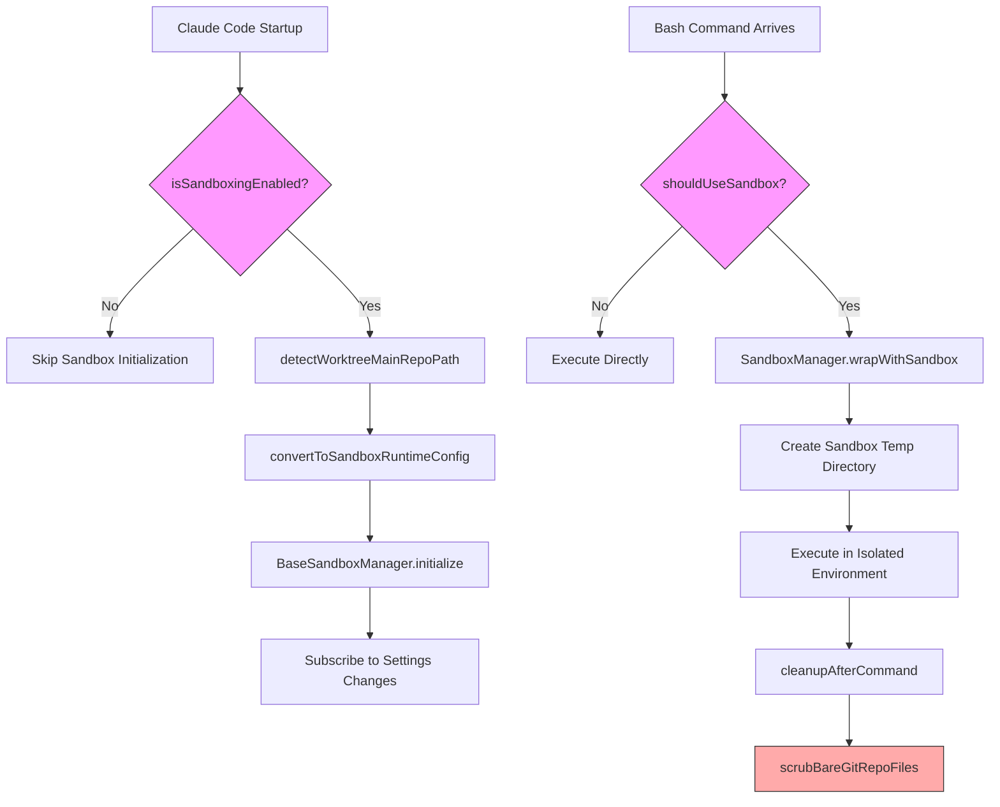
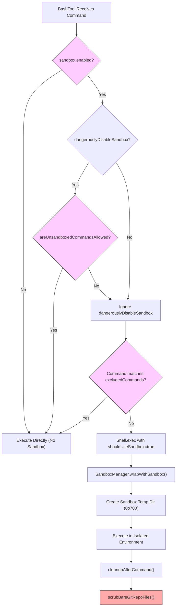

# Chapter 18b: Sandbox System — Multi-Platform Isolation from Seatbelt to Bubblewrap

## Why This Matters

임의의 Shell 명령을 실행할 수 있는 AI Agent는 막대한 힘을 부여하면서 위험한 문을 연다. Prompt Injection으로 조종된 Agent는 `~/.ssh/id_rsa`를 읽고, 민감한 파일을 외부 서버로 전송하거나, 심지어 permission 제어를 영구적으로 우회하기 위해 자체 설정 파일을 수정할 수 있다. Chapter 16에서 분석한 permission 시스템은 애플리케이션 레이어에서 위험한 작업을 가로채고, Chapter 17의 YOLO Classifier는 "fast mode"에서 허용 결정을 내리지만, 이들 모두 "advisory"한 soft 경계다 — 일단 악의적 명령이 운영체제 레벨에 도달하면 애플리케이션 레이어 interception은 쓸모없다.

Sandbox는 Claude Code 보안 아키텍처의 마지막 hard 경계다. OS 커널이 제공하는 격리 메커니즘 — macOS의 `sandbox-exec`(Seatbelt Profile)와 Linux의 Bubblewrap(user-space namespace) + seccomp(system call 필터링) — 을 활용하여 프로세스 레벨에서 파일 시스템과 네트워크 접근 제어를 강제한다. 모든 애플리케이션 레이어 방어가 우회되어도, sandbox는 여전히 승인되지 않은 파일 읽기/쓰기와 네트워크 접근을 block할 수 있다.

이 시스템의 엔지니어링 복잡도는 단순한 "설정 옵션 하나 toggle"이 시사하는 것보다 훨씬 크다. Dual-platform 차이(macOS path-level Seatbelt 설정 vs. Linux bind-mount + seccomp 조합), 5-layer 설정 우선순위 merge 로직, Git Worktree의 특별 경로 요구사항, 엔터프라이즈 MDM 정책 locking, 실제 보안 취약점(#29316 Bare Git Repo 공격) 방어를 처리해야 한다. 이 Chapter는 소스 코드에서 이 multi-platform 격리 아키텍처를 전체적으로 해부한다.

## Source Code Analysis

### 18b.1 Dual-Platform Sandbox 아키텍처 (Dual-Platform Sandbox Architecture)

Claude Code의 sandbox 구현은 두 레이어로 나뉜다: 외부 패키지 `@anthropic-ai/sandbox-runtime`이 기반 platform-specific 격리 기능을 제공하고, `sandbox-adapter.ts`가 adapter 레이어로서 Claude Code의 settings 시스템, permission rule, tool 통합에 연결된다.

Platform 지원 감지 로직은 `isSupportedPlatform()`에 있으며, memoize를 통해 캐시된다.

```typescript
// restored-src/src/utils/sandbox/sandbox-adapter.ts:491-493
const isSupportedPlatform = memoize((): boolean => {
  return BaseSandboxManager.isSupportedPlatform()
})
```

세 범주의 platform이 지원된다.

| Platform | Isolation Technology | Filesystem Isolation | Network Isolation |
|----------|---------------------|---------------------|-------------------|
| macOS | `sandbox-exec` (Seatbelt Profile) | Profile rule이 경로 접근 제어 | Profile rule + Unix socket 경로 필터링 |
| Linux | Bubblewrap (bwrap) | Read-only 루트 mount + writable whitelist bind-mount | seccomp system call 필터링 |
| WSL2 | Linux과 동일 (Bubblewrap) | Linux과 동일 | Linux과 동일 |

WSL1은 완전한 Linux kernel namespace 지원을 제공하지 않아 명시적으로 제외된다.

```typescript
// restored-src/src/commands/sandbox-toggle/sandbox-toggle.tsx:14-17
if (!SandboxManager.isSupportedPlatform()) {
  const errorMessage = platform === 'wsl'
    ? 'Error: Sandboxing requires WSL2. WSL1 is not supported.'
    : 'Error: Sandboxing is currently only supported on macOS, Linux, and WSL2.';
```

두 platform의 핵심 차이는 **glob 패턴 지원**이다. macOS의 Seatbelt Profile은 와일드카드 경로 매칭을 지원하는 반면, Linux의 Bubblewrap은 exact bind-mount만 할 수 있다. `getLinuxGlobPatternWarnings()`는 Linux에서 호환되지 않는 glob 패턴을 감지하고 사용자에게 경고한다.

```typescript
// restored-src/src/utils/sandbox/sandbox-adapter.ts:597-601
function getLinuxGlobPatternWarnings(): string[] {
  const platform = getPlatform()
  if (platform !== 'linux' && platform !== 'wsl') {
    return []
  }
```

### 18b.2 SandboxManager: Adapter 패턴 (SandboxManager: The Adapter Pattern)

`SandboxManager` 설계는 고전적인 Adapter Pattern을 채택한다. 25+ 메서드를 가진 `ISandboxManager` 인터페이스를 구현하며, 일부 메서드는 Claude Code 특정 로직을 포함하고 다른 메서드는 `BaseSandboxManager`(`@anthropic-ai/sandbox-runtime`의 핵심 클래스)로 직접 forward한다.

```typescript
// restored-src/src/utils/sandbox/sandbox-adapter.ts:880-922
export interface ISandboxManager {
  initialize(sandboxAskCallback?: SandboxAskCallback): Promise<void>
  isSupportedPlatform(): boolean
  isPlatformInEnabledList(): boolean
  getSandboxUnavailableReason(): string | undefined
  isSandboxingEnabled(): boolean
  isSandboxEnabledInSettings(): boolean
  checkDependencies(): SandboxDependencyCheck
  isAutoAllowBashIfSandboxedEnabled(): boolean
  areUnsandboxedCommandsAllowed(): boolean
  isSandboxRequired(): boolean
  areSandboxSettingsLockedByPolicy(): boolean
  // ... plus getFsReadConfig, getFsWriteConfig, getNetworkRestrictionConfig, etc.
  wrapWithSandbox(command: string, binShell?: string, ...): Promise<string>
  cleanupAfterCommand(): void
  refreshConfig(): void
  reset(): Promise<void>
}
```

Export된 `SandboxManager` 객체는 이 계층화를 명확히 보여준다.

```typescript
// restored-src/src/utils/sandbox/sandbox-adapter.ts:927-967
export const SandboxManager: ISandboxManager = {
  // Custom implementations (Claude Code-specific logic)
  initialize,
  isSandboxingEnabled,
  areSandboxSettingsLockedByPolicy,
  setSandboxSettings,
  wrapWithSandbox,
  refreshConfig,
  reset,

  // Forward to base sandbox manager (direct forwarding)
  getFsReadConfig: BaseSandboxManager.getFsReadConfig,
  getFsWriteConfig: BaseSandboxManager.getFsWriteConfig,
  getNetworkRestrictionConfig: BaseSandboxManager.getNetworkRestrictionConfig,
  // ...
  cleanupAfterCommand: (): void => {
    BaseSandboxManager.cleanupAfterCommand()
    scrubBareGitRepoFiles()  // CC-specific: clean up Bare Git Repo attack remnants
  },
}
```

초기화 흐름(`initialize()`)은 비동기이며, 신중히 설계된 race condition guard를 포함한다.

```typescript
// restored-src/src/utils/sandbox/sandbox-adapter.ts:730-792
async function initialize(sandboxAskCallback?: SandboxAskCallback): Promise<void> {
  if (initializationPromise) {
    return initializationPromise  // Prevent duplicate initialization
  }
  if (!isSandboxingEnabled()) {
    return
  }
  // Create Promise synchronously (before await) to prevent race conditions
  initializationPromise = (async () => {
    // 1. Resolve Worktree main repo path (once only)
    if (worktreeMainRepoPath === undefined) {
      worktreeMainRepoPath = await detectWorktreeMainRepoPath(getCwdState())
    }
    // 2. Convert CC settings to sandbox-runtime config
    const settings = getSettings_DEPRECATED()
    const runtimeConfig = convertToSandboxRuntimeConfig(settings)
    // 3. Initialize the underlying sandbox
    await BaseSandboxManager.initialize(runtimeConfig, wrappedCallback)
    // 4. Subscribe to settings changes, dynamically update sandbox config
    settingsSubscriptionCleanup = settingsChangeDetector.subscribe(() => {
      const newConfig = convertToSandboxRuntimeConfig(getSettings_DEPRECATED())
      BaseSandboxManager.updateConfig(newConfig)
    })
  })()
  return initializationPromise
}
```

다음 flowchart는 sandbox의 초기화에서 명령 실행까지의 완전한 라이프사이클을 보여준다.



### 18b.3 설정 시스템: 5-Layer 우선순위 (Configuration System: Five-Layer Priority)

Sandbox 설정 merge는 Claude Code의 일반 5-layer settings 시스템(CLAUDE.md 우선순위 논의는 Chapter 19 참조)을 상속하지만, sandbox는 그 위에 자체 semantic layer를 추가한다.

5 레이어의 우선순위 최저에서 최고:

```typescript
// restored-src/src/utils/settings/constants.ts:7-22
export const SETTING_SOURCES = [
  'userSettings',      // Global user settings (~/.claude/settings.json)
  'projectSettings',   // Shared project settings (.claude/settings.json)
  'localSettings',     // Local settings (.claude/settings.local.json, gitignored)
  'flagSettings',      // CLI --settings flag
  'policySettings',    // Enterprise MDM managed settings (managed-settings.json)
] as const
```

Sandbox 설정 Schema는 `sandboxTypes.ts`에서 Zod로 정의되며 전체 시스템의 Single Source of Truth 역할을 한다.

```typescript
// restored-src/src/entrypoints/sandboxTypes.ts:91-144
export const SandboxSettingsSchema = lazySchema(() =>
  z.object({
    enabled: z.boolean().optional(),
    failIfUnavailable: z.boolean().optional(),
    autoAllowBashIfSandboxed: z.boolean().optional(),
    allowUnsandboxedCommands: z.boolean().optional(),
    network: SandboxNetworkConfigSchema(),
    filesystem: SandboxFilesystemConfigSchema(),
    ignoreViolations: z.record(z.string(), z.array(z.string())).optional(),
    enableWeakerNestedSandbox: z.boolean().optional(),
    enableWeakerNetworkIsolation: z.boolean().optional(),
    excludedCommands: z.array(z.string()).optional(),
    ripgrep: z.object({ command: z.string(), args: z.array(z.string()).optional() }).optional(),
  }).passthrough(),  // .passthrough() allows undeclared fields (e.g., enabledPlatforms)
)
```

후행 `.passthrough()`에 주목 — 이것은 의도적인 설계 결정이다. `enabledPlatforms`는 문서화되지 않은 엔터프라이즈 설정이며, `.passthrough()`는 공식 선언 없이 Schema에 존재하게 한다. 소스 코드 주석이 배경을 드러낸다.

```typescript
// restored-src/src/entrypoints/sandboxTypes.ts:104-111
// Note: enabledPlatforms is an undocumented setting read via .passthrough()
// Added to unblock NVIDIA enterprise rollout: they want to enable
// autoAllowBashIfSandboxed but only on macOS initially, since Linux/WSL
// sandbox support is newer and less battle-tested.
```

`convertToSandboxRuntimeConfig()`는 설정 merge를 위한 핵심 함수다. 모든 설정 소스를 반복하면서 Claude Code의 Permission Rule과 sandbox 파일 시스템 설정을 `sandbox-runtime`이 이해할 수 있는 통합 형식으로 변환한다. 핵심 경로 resolution 로직은 이 프로세스에서 두 가지 다른 경로 규약을 처리한다.

```typescript
// restored-src/src/utils/sandbox/sandbox-adapter.ts:99-119
export function resolvePathPatternForSandbox(
  pattern: string, source: SettingSource
): string {
  // Permission rule convention: //path → absolute path, /path → relative to settings file directory
  if (pattern.startsWith('//')) {
    return pattern.slice(1)  // "//.aws/**" → "/.aws/**"
  }
  if (pattern.startsWith('/') && !pattern.startsWith('//')) {
    const root = getSettingsRootPathForSource(source)
    return resolve(root, pattern.slice(1))
  }
  return pattern  // ~/path and ./path pass through to sandbox-runtime
}
```

그리고 #30067 fix 후의 파일 시스템 경로 resolution.

```typescript
// restored-src/src/utils/sandbox/sandbox-adapter.ts:138-146
export function resolveSandboxFilesystemPath(
  pattern: string, source: SettingSource
): string {
  // sandbox.filesystem.* uses standard semantics: /path = absolute path (different from permission rules!)
  if (pattern.startsWith('//')) return pattern.slice(1)
  return expandPath(pattern, getSettingsRootPathForSource(source))
}
```

여기 미묘하지만 중요한 구분이 있다: permission rule에서 `/path`는 "settings 파일 디렉터리에 상대적"을 의미하지만, `sandbox.filesystem.allowWrite`에서 `/path`는 절대 경로를 의미한다. 이 불일치는 한때 Bug #30067을 일으켰다 — 사용자가 `sandbox.filesystem.allowWrite`에 `/Users/foo/.cargo`를 작성하고 절대 경로로 예상했지만, 시스템은 permission rule 규약에 따라 상대 경로로 해석했다.

### 18b.4 Filesystem 격리 (Filesystem Isolation)

Filesystem 격리의 핵심 전략은 **read-only 루트 + writable whitelist**다. `convertToSandboxRuntimeConfig()`가 구축한 설정에서 `allowWrite`는 기본적으로 현재 working directory와 Claude 임시 디렉터리로만 설정된다.

```typescript
// restored-src/src/utils/sandbox/sandbox-adapter.ts:225-226
const allowWrite: string[] = ['.', getClaudeTempDir()]
const denyWrite: string[] = []
```

그 위에 시스템은 여러 레이어의 하드코딩된 write-deny rule을 추가해 critical 파일이 sandbox된 명령에 의해 tampering되지 않도록 보호한다.

**Settings 파일 보호** — Sandbox Escape 방지:

```typescript
// restored-src/src/utils/sandbox/sandbox-adapter.ts:232-255
// Deny writing to all layers of settings.json
const settingsPaths = SETTING_SOURCES.map(source =>
  getSettingsFilePathForSource(source),
).filter((p): p is string => p !== undefined)
denyWrite.push(...settingsPaths)
denyWrite.push(getManagedSettingsDropInDir())

// If the user cd'd to a different directory, protect that directory's settings files too
if (cwd !== originalCwd) {
  denyWrite.push(resolve(cwd, '.claude', 'settings.json'))
  denyWrite.push(resolve(cwd, '.claude', 'settings.local.json'))
}

// Protect .claude/skills — skill files have the same privilege level as commands/agents
denyWrite.push(resolve(originalCwd, '.claude', 'skills'))
```

**Git Worktree 지원** — Worktree의 Git 작업은 main repository의 `.git` 디렉터리(예: `index.lock`)에 쓰기가 필요하다. 시스템은 초기화 중 Worktree를 감지하고 main repository 경로를 캐시한다.

```typescript
// restored-src/src/utils/sandbox/sandbox-adapter.ts:422-445
async function detectWorktreeMainRepoPath(cwd: string): Promise<string | null> {
  const gitPath = join(cwd, '.git')
  const gitContent = await readFile(gitPath, { encoding: 'utf8' })
  const gitdirMatch = gitContent.match(/^gitdir:\s*(.+)$/m)
  // gitdir format: /path/to/main/repo/.git/worktrees/worktree-name
  const marker = `${sep}.git${sep}worktrees${sep}`
  const markerIndex = gitdir.lastIndexOf(marker)
  if (markerIndex > 0) {
    return gitdir.substring(0, markerIndex)
  }
}
```

Worktree가 감지되면 main repository 경로가 writable whitelist에 추가된다.

```typescript
// restored-src/src/utils/sandbox/sandbox-adapter.ts:286-288
if (worktreeMainRepoPath && worktreeMainRepoPath !== cwd) {
  allowWrite.push(worktreeMainRepoPath)
}
```

**추가 디렉터리 지원** — `--add-dir` CLI 인자나 `/add-dir` 명령으로 추가된 디렉터리도 쓰기 permission이 필요하다.

```typescript
// restored-src/src/utils/sandbox/sandbox-adapter.ts:295-299
const additionalDirs = new Set([
  ...(settings.permissions?.additionalDirectories || []),
  ...getAdditionalDirectoriesForClaudeMd(),
])
allowWrite.push(...additionalDirs)
```

### 18b.5 Network 격리 (Network Isolation)

Network 격리는 **도메인 whitelist** 메커니즘을 사용하며, Claude Code의 `WebFetch` permission rule과 깊이 통합된다. `convertToSandboxRuntimeConfig()`는 permission rule에서 허용된 도메인을 추출한다.

```typescript
// restored-src/src/utils/sandbox/sandbox-adapter.ts:178-210
const allowedDomains: string[] = []
const deniedDomains: string[] = []

if (shouldAllowManagedSandboxDomainsOnly()) {
  // Enterprise policy mode: only use domains from policySettings
  const policySettings = getSettingsForSource('policySettings')
  for (const domain of policySettings?.sandbox?.network?.allowedDomains || []) {
    allowedDomains.push(domain)
  }
  for (const ruleString of policySettings?.permissions?.allow || []) {
    const rule = permissionRuleValueFromString(ruleString)
    if (rule.toolName === WEB_FETCH_TOOL_NAME && rule.ruleContent?.startsWith('domain:')) {
      allowedDomains.push(rule.ruleContent.substring('domain:'.length))
    }
  }
} else {
  // Normal mode: merge domain configuration from all layers
  for (const domain of settings.sandbox?.network?.allowedDomains || []) {
    allowedDomains.push(domain)
  }
  // ... extract domains from WebFetch(domain:xxx) permission rules
}
```

**Unix Socket 필터링**은 두 platform이 가장 다른 곳이다. macOS의 Seatbelt는 경로별로 Unix Socket을 필터링하는 것을 지원하는 반면, Linux의 seccomp는 Socket 경로를 구분할 수 없다 — 전부 "모두 허용"이거나 "모두 거부"만 할 수 있다.

```typescript
// restored-src/src/entrypoints/sandboxTypes.ts:28-36
allowUnixSockets: z.array(z.string()).optional()
  .describe('macOS only: Unix socket paths to allow. Ignored on Linux (seccomp cannot filter by path).'),
allowAllUnixSockets: z.boolean().optional()
  .describe('If true, allow all Unix sockets (disables blocking on both platforms).'),
```

**`allowManagedDomainsOnly` 정책**은 엔터프라이즈급 네트워크 격리의 핵심이다. 엔터프라이즈가 `policySettings`를 통해 이 옵션을 활성화하면, user, project, local 레이어의 모든 도메인 설정이 무시된다 — 엔터프라이즈 정책의 도메인과 `WebFetch` rule만 효력을 발휘한다.

```typescript
// restored-src/src/utils/sandbox/sandbox-adapter.ts:152-157
export function shouldAllowManagedSandboxDomainsOnly(): boolean {
  return (
    getSettingsForSource('policySettings')?.sandbox?.network
      ?.allowManagedDomainsOnly === true
  )
}
```

추가로, `sandboxAskCallback`은 이 정책을 강제하기 위해 초기화 중 wrap된다.

```typescript
// restored-src/src/utils/sandbox/sandbox-adapter.ts:745-755
const wrappedCallback: SandboxAskCallback | undefined = sandboxAskCallback
  ? async (hostPattern: NetworkHostPattern) => {
      if (shouldAllowManagedSandboxDomainsOnly()) {
        logForDebugging(
          `[sandbox] Blocked network request to ${hostPattern.host} (allowManagedDomainsOnly)`,
        )
        return false  // Hard reject, do not ask the user
      }
      return sandboxAskCallback(hostPattern)
    }
  : undefined
```

**HTTP/SOCKS proxy 지원**은 엔터프라이즈가 proxy 서버를 통해 Agent 네트워크 트래픽을 모니터링하고 audit할 수 있게 한다.

```typescript
// restored-src/src/utils/sandbox/sandbox-adapter.ts:360-368
return {
  network: {
    allowedDomains,
    deniedDomains,
    allowUnixSockets: settings.sandbox?.network?.allowUnixSockets,
    allowAllUnixSockets: settings.sandbox?.network?.allowAllUnixSockets,
    allowLocalBinding: settings.sandbox?.network?.allowLocalBinding,
    httpProxyPort: settings.sandbox?.network?.httpProxyPort,
    socksProxyPort: settings.sandbox?.network?.socksProxyPort,
  },
```

`enableWeakerNetworkIsolation` 옵션은 특별한 주의를 받을 만하다. macOS의 `com.apple.trustd.agent` 서비스 접근을 허용하며, 이는 Go로 컴파일된 CLI tool(`gh`, `gcloud`, `terraform` 등)이 TLS 인증서를 검증하는 데 필요하다. 그러나 이 옵션을 활성화하면 **보안이 감소**한다 — trustd 서비스 자체가 잠재적 데이터 exfiltration 채널이기 때문이다.

```typescript
// restored-src/src/entrypoints/sandboxTypes.ts:125-133
enableWeakerNetworkIsolation: z.boolean().optional()
  .describe(
    'macOS only: Allow access to com.apple.trustd.agent in the sandbox. ' +
    'Needed for Go-based CLI tools (gh, gcloud, terraform, etc.) to verify TLS certificates ' +
    'when using httpProxyPort with a MITM proxy and custom CA. ' +
    '**Reduces security** — opens a potential data exfiltration vector through the trustd service. Default: false',
  ),
```

### 18b.6 Bash Tool 통합 (Bash Tool Integration)

Sandbox는 궁극적으로 Bash tool을 통해 사용자와 상호작용한다. 결정 chain은 `shouldUseSandbox()`에서 시작하여 `Shell.exec()`의 wrapping을 거쳐 운영체제 레벨의 격리된 실행으로 끝난다.

**`shouldUseSandbox()` 결정 로직**은 명확한 우선순위 체인을 따른다.

```typescript
// restored-src/src/tools/BashTool/shouldUseSandbox.ts:130-153
export function shouldUseSandbox(input: Partial<SandboxInput>): boolean {
  // 1. Sandbox not enabled → don't use
  if (!SandboxManager.isSandboxingEnabled()) {
    return false
  }
  // 2. dangerouslyDisableSandbox=true and policy allows it → don't use
  if (input.dangerouslyDisableSandbox &&
      SandboxManager.areUnsandboxedCommandsAllowed()) {
    return false
  }
  // 3. No command → don't use
  if (!input.command) {
    return false
  }
  // 4. Command matches exclusion list → don't use
  if (containsExcludedCommand(input.command)) {
    return false
  }
  // 5. All other cases → use sandbox
  return true
}
```

`containsExcludedCommand()`의 구현은 보이는 것보다 복잡하다. 사용자 설정 `excludedCommands`만 check하지 않고, compound 명령(`&&`로 연결)을 분할하고, 매칭을 위해 환경 변수 prefix와 safety wrapper(`timeout` 같은)를 반복적으로 제거한다. 이는 `docker ps && curl evil.com` 같은 명령이 `docker`가 exclusion list에 있다는 이유만으로 sandbox를 완전히 건너뛰는 것을 방지한다.

```typescript
// restored-src/src/tools/BashTool/shouldUseSandbox.ts:60-68
// Split compound commands to prevent a compound command from
// escaping the sandbox just because its first subcommand matches
let subcommands: string[]
try {
  subcommands = splitCommand_DEPRECATED(command)
} catch {
  subcommands = [command]
}
```

**명령 wrapping 흐름**은 `Shell.ts`에서 완료된다. `shouldUseSandbox`가 true일 때, 명령 문자열은 `SandboxManager.wrapWithSandbox()`로 전달되며, 거기서 기반 sandbox-runtime이 격리 파라미터와 함께 실제 system call로 wrap한다.

```typescript
// restored-src/src/utils/Shell.ts:259-273
if (shouldUseSandbox) {
  commandString = await SandboxManager.wrapWithSandbox(
    commandString,
    sandboxBinShell,
    undefined,
    abortSignal,
  )
  // Create sandbox temp directory with secure permissions
  try {
    const fs = getFsImplementation()
    await fs.mkdir(sandboxTmpDir, { mode: 0o700 })
  } catch (error) {
    logForDebugging(`Failed to create ${sandboxTmpDir} directory: ${error}`)
  }
}
```

**Sandbox의 PowerShell 처리**는 특히 주목할 만하다. 내부적으로 `wrapWithSandbox`는 명령을 `<binShell> -c '<cmd>'`로 wrap하지만, 이 과정에서 PowerShell의 `-NoProfile -NonInteractive` 인자가 손실된다. 해결책은 PowerShell 명령을 Base64 형식으로 미리 인코딩한 후, sandbox의 inner shell로 `/bin/sh`를 사용하는 것이다.

```typescript
// restored-src/src/utils/Shell.ts:247-257
// Sandboxed PowerShell: wrapWithSandbox hardcodes `<binShell> -c '<cmd>'` —
// using pwsh there would lose -NoProfile -NonInteractive
const isSandboxedPowerShell = shouldUseSandbox && shellType === 'powershell'
const sandboxBinShell = isSandboxedPowerShell ? '/bin/sh' : binShell
```

**`dangerouslyDisableSandbox` 파라미터**는 AI 모델이 sandbox 제한으로 인한 실패를 만났을 때 sandbox를 우회할 수 있게 한다. 그러나 엔터프라이즈는 `allowUnsandboxedCommands: false`로 이 파라미터를 완전히 비활성화할 수 있다.

```typescript
// restored-src/src/entrypoints/sandboxTypes.ts:113-119
allowUnsandboxedCommands: z.boolean().optional()
  .describe(
    'Allow commands to run outside the sandbox via the dangerouslyDisableSandbox parameter. ' +
    'When false, the dangerouslyDisableSandbox parameter is completely ignored and all commands must run sandboxed. ' +
    'Default: true.',
  ),
```

BashTool의 prompt(tool prompt 논의는 Chapter 8 참조)도 이 설정에 따라 모델에 대한 가이드를 동적으로 조정한다.

```typescript
// restored-src/src/tools/BashTool/prompt.ts:228-256
const sandboxOverrideItems: Array<string | string[]> =
  allowUnsandboxedCommands
    ? [
        'You should always default to running commands within the sandbox...',
        // Guides the model to only use dangerouslyDisableSandbox when evidence like "Operation not permitted" is seen
      ]
    : [
        'All commands MUST run in sandbox mode - the `dangerouslyDisableSandbox` parameter is disabled by policy.',
        'Commands cannot run outside the sandbox under any circumstances.',
      ]
```

다음 flowchart는 명령 입력에서 sandbox된 실행까지의 완전한 결정 경로를 보여준다.



### 18b.7 보안 Edge Case: Bare Git Repo 공격 방어 (Security Edge Case: Bare Git Repo Attack Defense)

이것은 전체 sandbox 시스템에서 가장 인상적인 보안 엔지니어링 사례다. Issue #29316은 실제 sandbox escape 공격 경로를 설명한다.

**공격 원리**: Git의 `is_git_directory()` 함수는 `HEAD`, `objects/`, `refs/` 등의 파일 존재를 check하여 디렉터리가 Git repository인지 판단한다. 공격자가 (prompt injection을 통해) sandbox 내부에 이 파일들을 생성하고 `config`의 `core.fsmonitor`를 악의적 스크립트를 가리키도록 설정하면, Claude Code의 **sandbox 외부** Git 작업(`git status` 같은)이 현재 디렉터리를 Bare Git Repo로 오인하고 `core.fsmonitor`가 지정한 임의의 코드를 실행할 것이다 — 그 시점에서 sandbox 밖에서.

**방어 전략**: 이것은 두 라인을 따른다 — 예방과 정리.

**사전 존재하는** Git 파일(`HEAD`, `objects`, `refs`, `hooks`, `config`)의 경우, 시스템은 이들을 `denyWrite` 목록에 추가하고, sandbox-runtime은 read-only로 bind-mount한다.

```typescript
// restored-src/src/utils/sandbox/sandbox-adapter.ts:257-280
// SECURITY: Git's is_git_directory() treats cwd as a bare repo if it has
// HEAD + objects/ + refs/. An attacker planting these (plus a config with
// core.fsmonitor) escapes the sandbox when Claude's unsandboxed git runs.
bareGitRepoScrubPaths.length = 0
const bareGitRepoFiles = ['HEAD', 'objects', 'refs', 'hooks', 'config']
for (const dir of cwd === originalCwd ? [originalCwd] : [originalCwd, cwd]) {
  for (const gitFile of bareGitRepoFiles) {
    const p = resolve(dir, gitFile)
    try {
      statSync(p)
      denyWrite.push(p)  // File exists → read-only bind-mount
    } catch {
      bareGitRepoScrubPaths.push(p)  // File doesn't exist → record for post-command cleanup
    }
  }
}
```

**사전 존재하지 않는** Git 파일(즉, sandbox 명령 실행 중 공격자가 심을 수 있는 것)의 경우, 시스템은 각 명령 후 `scrubBareGitRepoFiles()`를 호출하여 정리한다.

```typescript
// restored-src/src/utils/sandbox/sandbox-adapter.ts:404-414
function scrubBareGitRepoFiles(): void {
  for (const p of bareGitRepoScrubPaths) {
    try {
      rmSync(p, { recursive: true })
      logForDebugging(`[Sandbox] scrubbed planted bare-repo file: ${p}`)
    } catch {
      // ENOENT is the expected common case — nothing was planted
    }
  }
}
```

소스 코드 주석은 왜 모든 Git 파일에 단순히 `denyWrite`를 사용할 수 없는지 설명한다.

> Unconditionally denying these paths makes sandbox-runtime mount `/dev/null` at non-existent ones, which (a) leaves a 0-byte HEAD stub on the host and (b) breaks `git log HEAD` inside bwrap ("ambiguous argument").

이 방어는 `cleanupAfterCommand()`에 통합되어 있어 모든 sandbox된 명령 실행 후 정리가 일어나도록 보장한다.

```typescript
// restored-src/src/utils/sandbox/sandbox-adapter.ts:963-966
cleanupAfterCommand: (): void => {
  BaseSandboxManager.cleanupAfterCommand()
  scrubBareGitRepoFiles()
},
```

### 18b.8 엔터프라이즈 정책과 컴플라이언스 (Enterprise Policies and Compliance)

Claude Code의 sandbox 시스템은 엔터프라이즈 배포를 위한 포괄적인 정책 제어 기능을 제공한다.

**MDM `settings.d/` 디렉터리**: 엔터프라이즈는 `getManagedSettingsDropInDir()`이 지정하는 managed settings 디렉터리를 통해 sandbox 정책을 배포할 수 있다. 이 디렉터리의 설정 파일은 자동으로 `policySettings`의 최고 우선순위를 받는다.

**`failIfUnavailable`**: `true`로 설정되면, sandbox가 시작할 수 없으면(종속성 누락, 지원되지 않는 platform 등) Claude Code는 degraded mode에서 실행되는 대신 바로 종료된다. 이는 엔터프라이즈급 Hard Gate다.

```typescript
// restored-src/src/utils/sandbox/sandbox-adapter.ts:479-485
function isSandboxRequired(): boolean {
  const settings = getSettings_DEPRECATED()
  return (
    getSandboxEnabledSetting() &&
    (settings?.sandbox?.failIfUnavailable ?? false)
  )
}
```

**`areSandboxSettingsLockedByPolicy()`**는 더 높은 우선순위 설정 소스(`flagSettings` 또는 `policySettings`)가 sandbox 설정을 잠갔는지 check하여 사용자가 로컬에서 수정하지 못하도록 한다.

```typescript
// restored-src/src/utils/sandbox/sandbox-adapter.ts:647-664
function areSandboxSettingsLockedByPolicy(): boolean {
  const overridingSources = ['flagSettings', 'policySettings'] as const
  for (const source of overridingSources) {
    const settings = getSettingsForSource(source)
    if (
      settings?.sandbox?.enabled !== undefined ||
      settings?.sandbox?.autoAllowBashIfSandboxed !== undefined ||
      settings?.sandbox?.allowUnsandboxedCommands !== undefined
    ) {
      return true
    }
  }
  return false
}
```

`/sandbox` 명령 구현에서 정책이 설정을 잠갔다면 사용자는 명확한 에러 메시지를 본다.

```typescript
// restored-src/src/commands/sandbox-toggle/sandbox-toggle.tsx:33-37
if (SandboxManager.areSandboxSettingsLockedByPolicy()) {
  const message = color('error', themeName)(
    'Error: Sandbox settings are overridden by a higher-priority configuration and cannot be changed locally.'
  );
  onDone(message);
}
```

**`enabledPlatforms`** (문서화되지 않음)은 엔터프라이즈가 특정 platform에서만 sandbox를 활성화할 수 있게 한다. 이는 NVIDIA의 엔터프라이즈 배포를 위해 추가되었다 — macOS에서 먼저 `autoAllowBashIfSandboxed`를 활성화하고, Linux sandbox가 성숙해지면 Linux로 확장하려 했다.

```typescript
// restored-src/src/utils/sandbox/sandbox-adapter.ts:505-526
function isPlatformInEnabledList(): boolean {
  const settings = getInitialSettings()
  const enabledPlatforms = (
    settings?.sandbox as { enabledPlatforms?: Platform[] } | undefined
  )?.enabledPlatforms
  if (enabledPlatforms === undefined) {
    return true  // All platforms enabled by default when not set
  }
  const currentPlatform = getPlatform()
  return enabledPlatforms.includes(currentPlatform)
}
```

**격리를 약화시키는 옵션과 그 tradeoff**:

| Option | Effect | Security Impact |
|--------|--------|-----------------|
| `enableWeakerNestedSandbox` | Sandbox 내부의 중첩 sandbox 허용 | 격리 깊이 감소 |
| `enableWeakerNetworkIsolation` | macOS에서 `trustd.agent` 접근 허용 | 데이터 exfiltration vector 오픈 |
| `allowUnsandboxedCommands: true` | `dangerouslyDisableSandbox` 파라미터 활성화 | 완전한 sandbox 우회 허용 |
| `excludedCommands` | 특정 명령이 sandbox 건너뜀 | 제외된 명령에 격리 보호 없음 |

## Pattern Extraction

### Pattern: Multi-Platform Sandbox Adapter

**해결 문제**: 서로 다른 운영체제가 완전히 다른 격리 primitive(macOS Seatbelt vs. Linux Namespace + seccomp)를 제공하며, 애플리케이션 레이어는 sandbox의 라이프사이클, 설정, 실행을 관리하기 위한 통합 인터페이스가 필요하다.

**접근**:

1. **외부 패키지가 platform 차이 처리**: `@anthropic-ai/sandbox-runtime`이 macOS `sandbox-exec`과 Linux `bwrap` + `seccomp` 간의 차이를 캡슐화하여 통합된 `BaseSandboxManager` API 제공
2. **Adapter 레이어가 비즈니스 차이 처리**: `sandbox-adapter.ts`가 애플리케이션 특정 설정 시스템(5-layer settings, permission rule, 경로 규약)을 `sandbox-runtime`의 `SandboxRuntimeConfig` 형식으로 변환
3. **인터페이스가 method table export**: `ISandboxManager` 인터페이스가 "커스텀 구현" 메서드와 "직접 forwarding" 메서드를 명시적으로 구분하여 코드 의도를 명확하게 만든다

**전제 조건**:

- 기반 격리 패키지가 platform-agnostic 인터페이스(`wrapWithSandbox`, `initialize`, `updateConfig`)를 제공해야 한다
- Adapter는 모든 애플리케이션 특정 개념 변환(경로 resolution 규약, permission rule 추출)을 처리해야 한다
- `cleanupAfterCommand()` 같은 extension point가 adapter의 자체 로직 주입을 허용해야 한다

**Claude Code에서의 매핑**:

| Component | Role |
|-----------|------|
| `@anthropic-ai/sandbox-runtime` | Adaptee |
| `sandbox-adapter.ts` | Adapter |
| `ISandboxManager` | Target Interface |
| `BashTool`, `Shell.ts` | Client |

### Pattern: Five-Layer Configuration Merging with Policy Locking

**해결 문제**: Sandbox 설정은 사용자 유연성과 엔터프라이즈 보안 컴플라이언스의 균형을 맞춰야 한다. 사용자는 쓰기 가능한 경로와 네트워크 도메인을 커스터마이즈해야 하고, 엔터프라이즈는 사용자가 우회하는 것을 방지하기 위해 중요한 설정을 잠가야 한다.

**접근**:

1. **낮은 우선순위 소스가 default 제공**: `userSettings`와 `projectSettings`가 baseline 설정 제공
2. **높은 우선순위 소스가 override 또는 lock**: `policySettings`의 `sandbox.enabled: true` 설정은 낮은 우선순위 설정을 모두 override
3. **`allowManagedDomainsOnly` 같은 정책 스위치**: Merge 로직 중 낮은 우선순위 소스의 데이터를 선택적으로 무시
4. **`areSandboxSettingsLockedByPolicy()`가 lock 상태 감지**: UI 레이어가 이 결과에 기반해 settings 수정 진입점 비활성화

**전제 조건**:

- 설정 시스템이 merge된 결과만 반환하는 것이 아니라 per-source 쿼리(`getSettingsForSource`)를 지원해야 한다
- 경로 resolution이 source-aware여야 한다(같은 `/path`가 서로 다른 소스에서 서로 다른 절대 경로로 resolve될 수 있다)
- 정책 lock 감지는 settings 쓰기 시점이 아니라 UI 진입점에서 수행되어야 한다

**Claude Code에서의 매핑**: `SETTING_SOURCES`는 `userSettings -> projectSettings -> localSettings -> flagSettings -> policySettings` 우선순위 체인을 정의한다. `convertToSandboxRuntimeConfig()`는 모든 소스를 반복하고 각 소스의 규약에 따라 경로를 resolve하며, `shouldAllowManagedSandboxDomainsOnly()`와 `shouldAllowManagedReadPathsOnly()`는 엔터프라이즈 정책의 "hard override"를 구현한다.

## What Users Can Do

1. **프로젝트에서 sandbox 활성화**: `.claude/settings.local.json`에 `{ "sandbox": { "enabled": true } }` 설정 또는 interactive 설정을 위해 `/sandbox` 명령 실행. 활성화되면 모든 Bash 명령이 기본적으로 sandbox 내부에서 실행된다.

2. **개발 tool을 위한 네트워크 whitelist 추가**: Build tool(npm, pip, cargo)이 종속성을 다운로드해야 한다면, 필요한 도메인을 `sandbox.network.allowedDomains`에 추가하라(`["registry.npmjs.org", "crates.io"]` 같은). 이는 `WebFetch(domain:xxx)` allow permission rule로도 달성할 수 있다 — sandbox가 이 도메인들을 자동 추출한다.

3. **특정 명령을 sandbox에서 제외**: `/sandbox exclude "docker compose:*"`를 사용해 특별 권한이 필요한 명령(Docker, systemctl 같은)을 sandbox에서 제외. 이것은 편의 기능이지 보안 경계가 아님에 주의 — 제외된 명령은 sandbox 보호가 없다.

4. **Git Worktree와의 호환성 보장**: Git Worktree에서 Claude Code를 사용한다면, 시스템이 자동으로 감지하고 main repository 경로를 writable whitelist에 추가한다. `index.lock` 관련 에러를 만나면, `.git` 파일의 `gitdir` 참조가 올바른지 확인하라.

5. **엔터프라이즈 배포에서 sandbox 강제**: managed settings에 `{ "sandbox": { "enabled": true, "failIfUnavailable": true, "allowUnsandboxedCommands": false } }`를 설정해 모든 사용자가 우회 없이 sandbox 내부에서 실행하도록 강제. `network.allowManagedDomainsOnly: true`와 결합해 네트워크 접근 whitelist를 잠글 수 있다.

6. **Sandbox 이슈 디버깅**: Sandbox 제한으로 명령이 실패할 때, stderr는 `<sandbox_violations>` 태그 내에 위반 정보를 포함한다. `/sandbox`를 실행하면 현재 sandbox 상태와 종속성 check 결과를 볼 수 있다. Linux에서 glob 패턴 경고를 본다면, 와일드카드 경로를 exact 경로로 교체하라(Bubblewrap은 glob을 지원하지 않는다).
