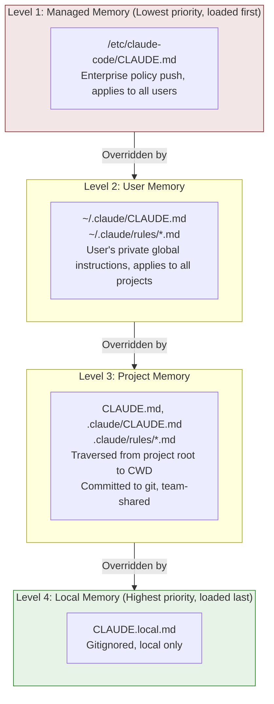

# Chapter 19: CLAUDE.md — User Instructions as an Override Layer

## Why This Matters

Hooks 시스템(Chapter 18)이 사용자가 **코드 실행**을 통해 Agent 행동을 확장하는 채널이라면, CLAUDE.md는 **자연어 instruction**을 통해 모델 출력을 제어하는 채널이다. 이것은 단순한 "설정 파일"이 아니다 — 4-level 우선순위 cascading, transitive 파일 inclusion, path-scoped rule, HTML comment stripping, 명시적 override semantic 선언을 가진 완전한 instruction 주입 시스템이다.

CLAUDE.md의 설계 철학은 한 문장으로 요약할 수 있다: **사용자 instruction이 모델의 default 행동을 override한다.** 이것은 수사가 아니다 — 문자 그대로 System Prompt에 주입된다.

```typescript
// claudemd.ts:89-91
const MEMORY_INSTRUCTION_PROMPT =
  'Codebase and user instructions are shown below. Be sure to adhere to these instructions. ' +
  'IMPORTANT: These instructions OVERRIDE any default behavior and you MUST follow them exactly as written.'
```

이 Chapter는 파일 발견, 콘텐츠 처리, prompt 최종 주입까지의 완전한 chain을 해부하고, 이 시스템의 소스 코드 구현을 검토한다.

---

## 19.1 4-Level 로딩 우선순위 (Four-Level Loading Priority)

CLAUDE.md 시스템은 4-level 우선순위 모델을 사용하며, `claudemd.ts` 파일 상단 주석(lines 1-26)에 명시적으로 정의된다. 파일은 **역 우선순위 순서**로 로드된다 — 마지막 로드된 것이 가장 높은 우선순위를 가진다. 모델이 대화 끝부분의 콘텐츠에 더 높은 "attention"을 두기 때문이다.



### 로딩 구현 (Loading Implementation)

`getMemoryFiles` 함수(lines 790-1075)가 완전한 로딩 로직을 구현한다. 이것은 `memoize`로 wrap된 async 함수다 — 같은 프로세스 라이프타임 내 첫 호출 후 결과가 캐시된다.

**Step One: Managed Memory (lines 803-823)**

```typescript
// claudemd.ts:804-822
const managedClaudeMd = getMemoryPath('Managed')
result.push(
  ...(await processMemoryFile(managedClaudeMd, 'Managed', processedPaths, includeExternal)),
)
const managedClaudeRulesDir = getManagedClaudeRulesDir()
result.push(
  ...(await processMdRules({
    rulesDir: managedClaudeRulesDir,
    type: 'Managed',
    processedPaths,
    includeExternal,
    conditionalRule: false,
  })),
)
```

Managed Memory 경로는 일반적으로 `/etc/claude-code/CLAUDE.md`다 — 엔터프라이즈 IT 부서가 MDM(Mobile Device Management)을 통해 정책을 push하는 표준 위치.

**Step Two: User Memory (lines 826-847)**

`userSettings` 설정 소스가 활성화되었을 때만 로드된다. User Memory는 특권을 가진다: `includeExternal`은 항상 `true`(line 833)이며, 이는 user-level CLAUDE.md의 `@include` directive가 프로젝트 디렉터리 외부 파일을 참조할 수 있음을 의미한다.

**Step Three: Project Memory (lines 849-920)**

이것은 가장 복잡한 단계다. 코드는 CWD에서 위로 파일 시스템 루트까지 traverse하며, 따라가는 모든 레벨에서 `CLAUDE.md`, `.claude/CLAUDE.md`, `.claude/rules/*.md`를 수집한다.

```typescript
// claudemd.ts:851-857
const dirs: string[] = []
const originalCwd = getOriginalCwd()
let currentDir = originalCwd
while (currentDir !== parse(currentDir).root) {
  dirs.push(currentDir)
  currentDir = dirname(currentDir)
}
```

그다음 루트 방향에서 CWD로 처리한다(line 878의 `dirs.reverse()`), CWD에 가까운 파일이 나중에 로드되어 더 높은 우선순위를 갖도록 보장한다.

흥미로운 edge case 처리: git worktree(lines 859-884). Worktree 내(`.claude/worktrees/<name>/` 같은)에서 실행할 때, 위로의 traversal은 worktree 루트 디렉터리와 main repository 루트 디렉터리 둘 다를 통과한다. 둘 다 `CLAUDE.md`를 포함해 중복 로딩이 발생한다. 코드는 `isNestedWorktree`를 감지하여 main repository 디렉터리의 Project 타입 파일을 건너뛴다 — 하지만 `CLAUDE.local.md`는 여전히 로드된다. Gitignore되어 main repository에만 존재하기 때문이다.

**Step Four: Local Memory (Project traversal 내에 끼어 있음)**

각 디렉터리 레벨에서 `CLAUDE.local.md`는 Project 파일 후에 로드된다(lines 922-933). 단 `localSettings` 설정 소스가 활성화된 경우에만.

**Additional 디렉터리 (`--add-dir`) 지원 (lines 936-977):**

`CLAUDE_CODE_ADDITIONAL_DIRECTORIES_CLAUDE_MD` 환경 변수로 활성화되며, `--add-dir` 인자로 지정된 디렉터리의 CLAUDE.md 파일도 로드된다. 이 파일들은 `Project` 타입으로 표시되며, 로딩 로직은 표준 Project Memory(CLAUDE.md, .claude/CLAUDE.md, .claude/rules/*.md)와 동일하다. 특히, `isSettingSourceEnabled('projectSettings')`는 여기서 check되지 않는다 — `--add-dir`이 명시적 사용자 action이며, SDK의 default 빈 `settingSources`가 이를 block해서는 안 되기 때문이다.

**AutoMem과 TeamMem (lines 979-1007):**

4개 표준 Memory 레벨 후에 두 특수 타입이 로드된다 — auto-memory(`MEMORY.md`)와 team memory. 이 타입들은 자체 feature flag 제어와 독립된 truncation 전략을 가진다(line 수와 byte 수 제한을 위해 `truncateEntrypointContent`가 처리).

### 제어 가능한 설정 소스 스위치 (Controllable Configuration Source Switches)

각 레벨(Managed 제외)은 `isSettingSourceEnabled()`에 의해 제어된다.

- `userSettings`: User Memory 제어
- `projectSettings`: Project Memory 제어 (CLAUDE.md와 rules)
- `localSettings`: Local Memory 제어

SDK 모드에서 `settingSources`는 default로 빈 배열이며, 명시적으로 활성화되지 않는 한 Managed Memory만 효력이 있다 — 이는 SDK consumer에 대한 최소 권한 원칙을 구현한다.

---

## 19.2 @include Directive

CLAUDE.md는 다른 파일을 참조하기 위해 `@include` syntax를 지원하여 modular instruction 조직을 가능하게 한다.

### Syntax 형식 (Syntax Format)

`@include`는 간결한 `@`-prefix-plus-path syntax를 사용한다(주석 lines 19-24).

| Syntax | Meaning |
|--------|---------|
| `@path` 또는 `@./path` | 현재 파일의 디렉터리에 상대적 |
| `@~/path` | 사용자 홈 디렉터리에 상대적 |
| `@/absolute/path` | 절대 경로 |
| `@path#section` | Fragment identifier 포함 (`#` 이후는 무시) |
| `@path\ with\ spaces` | Backslash-escape된 공백 |

### 경로 추출 (Path Extraction)

경로 추출은 `extractIncludePathsFromTokens` 함수(lines 451-535)가 구현한다. Raw 텍스트가 아니라 marked lexer가 미리 처리한 token 스트림을 받는다 — 다음 규칙들을 보장한다.

1. **코드 블록 내의 `@`는 무시**: `code`와 `codespan` 타입 token은 건너뜀(lines 496-498)
2. **HTML 주석 내의 `@`는 무시**: `html` 타입 token의 주석 부분은 건너뛰지만, 주석 후 남은 텍스트의 `@`는 여전히 처리됨(lines 502-514)
3. **텍스트 노드만 처리**: `tokens`와 `items` 하위 구조로 재귀(lines 522-529)

경로 추출 정규식(line 459):

```typescript
// claudemd.ts:459
const includeRegex = /(?:^|\s)@((?:[^\s\\]|\\ )+)/g
```

이 정규식은 `@` 이후의 non-whitespace 문자 시퀀스를 매치하면서 `\ ` escape된 공백도 지원한다.

### Transitive Inclusion과 순환 참조 보호 (Transitive Inclusion and Circular Reference Protection)

`processMemoryFile` 함수(lines 618-685)는 `@include`를 재귀적으로 처리한다. 두 핵심 안전 메커니즘:

**순환 참조 보호**: `processedPaths` Set(lines 629-630)을 통해 이미 처리된 파일 경로를 추적한다. 경로는 비교 전에 `normalizePathForComparison`을 통해 normalize되며, Windows 드라이브 레터 대소문자 차이(`C:\Users` vs `c:\Users`)를 처리한다.

```typescript
// claudemd.ts:629-630
const normalizedPath = normalizePathForComparison(filePath)
if (processedPaths.has(normalizedPath) || depth >= MAX_INCLUDE_DEPTH) {
  return []
}
```

**최대 깊이 제한**: `MAX_INCLUDE_DEPTH = 5`(line 537), 과도하게 깊은 중첩을 방지.

**외부 파일 보안**: `@include`가 프로젝트 디렉터리 외부 파일을 가리킬 때, default로 로드되지 않는다(lines 667-669). User Memory 레벨 파일이거나 `hasClaudeMdExternalIncludesApproved`의 명시적 사용자 승인만이 외부 inclusion을 허용한다. 승인되지 않은 외부 include가 감지되면 시스템이 경고를 표시한다(`shouldShowClaudeMdExternalIncludesWarning`, lines 1420-1430).

### Symlink 처리 (Symlink Handling)

모든 파일은 처리 전에 `safeResolvePath`를 통해 resolve되어 symlink를 처리한다(lines 640-643). 파일이 symlink면, resolve된 실제 경로도 `processedPaths`에 추가된다 — symlink로 순환 참조 감지를 우회하는 것을 방지한다.

---

## 19.3 frontmatter paths: 범위 제한 (frontmatter paths: Scope Limiting)

`.claude/rules/` 디렉터리의 `.md` 파일은 YAML frontmatter `paths` 필드를 통해 적용성을 제한할 수 있다 — Claude가 작업 중인 파일 경로가 이 glob 패턴과 매치할 때만 rule이 context에 주입된다.

### frontmatter 파싱 (frontmatter Parsing)

`parseFrontmatterPaths` 함수(lines 254-279)는 frontmatter의 `paths` 필드를 처리한다.

```typescript
// claudemd.ts:254-279
function parseFrontmatterPaths(rawContent: string): {
  content: string
  paths?: string[]
} {
  const { frontmatter, content } = parseFrontmatter(rawContent)
  if (!frontmatter.paths) {
    return { content }
  }
  const patterns = splitPathInFrontmatter(frontmatter.paths)
    .map(pattern => {
      return pattern.endsWith('/**') ? pattern.slice(0, -3) : pattern
    })
    .filter((p: string) => p.length > 0)
  if (patterns.length === 0 || patterns.every((p: string) => p === '**')) {
    return { content }
  }
  return { content, paths: patterns }
}
```

`/**` suffix 처리에 주목하라 — `ignore` 라이브러리는 `path`를 경로 자체와 그 안의 모든 콘텐츠를 매치하는 것으로 처리하므로, `/**`는 redundant하며 자동으로 제거된다. 모든 패턴이 `**`(모든 것 매치)면 glob 제약이 없는 것으로 처리된다.

### 경로 Syntax (Path Syntax)

`splitPathInFrontmatter` 함수(`frontmatterParser.ts:189-232`)는 복잡한 경로 syntax를 지원한다.

```yaml
---
paths: src/**/*.ts, tests/**/*.test.ts
---
```

또는 YAML list 형식:

```yaml
---
paths:
  - src/**/*.ts
  - tests/**/*.test.ts
---
```

Brace expansion도 지원된다 — `src/*.{ts,tsx}`는 `["src/*.ts", "src/*.tsx"]`로 확장(`expandBraces` 함수 at `frontmatterParser.ts:240-266`). 이 expander는 multi-level brace를 재귀적으로 처리한다: `{a,b}/{c,d}`는 `["a/c", "a/d", "b/c", "b/d"]`를 생성한다.

### YAML 파싱 Fault Tolerance

frontmatter YAML 파싱(`frontmatterParser.ts:130-175`)은 두 레벨의 fault tolerance를 가진다.

1. **첫 시도**: Raw frontmatter 텍스트 직접 파싱
2. **실패 시 retry**: `quoteProblematicValues`를 통해 YAML 특수 문자를 포함하는 값을 자동으로 따옴표로 감쌈

이 retry 메커니즘은 흔한 문제를 해결한다: `**/*.{ts,tsx}` 같은 glob 패턴은 YAML의 flow mapping 표시자 `{}`를 포함해 직접 파싱이 실패한다. `quoteProblematicValues`(lines 85-121)는 단순한 `key: value` 라인에서 특수 문자(`{}[]*, &#!|>%@``)를 감지하고 자동으로 double quote로 wrap한다. 이미 따옴표된 값은 건너뛴다.

이는 사용자가 `paths: src/**/*.{ts,tsx}`를 수동으로 따옴표를 추가하지 않고 직접 쓸 수 있음을 의미한다 — parser가 첫 YAML 파싱 실패 후 자동으로 따옴표를 추가하고 retry한다.

### 조건부 Rule 매칭 (Conditional Rule Matching)

조건부 rule 매칭은 `processConditionedMdRules` 함수(lines 1354-1397)가 실행한다. Rule 파일을 로드한 후 `ignore()` 라이브러리(gitignore 호환 glob 매칭)를 사용해 대상 파일 경로를 필터링한다.

```typescript
// claudemd.ts:1370-1396
return conditionedRuleMdFiles.filter(file => {
  if (!file.globs || file.globs.length === 0) {
    return false
  }
  const baseDir =
    type === 'Project'
      ? dirname(dirname(rulesDir))  // Parent of .claude directory
      : getOriginalCwd()            // managed/user rules use project root
  const relativePath = isAbsolute(targetPath)
    ? relative(baseDir, targetPath)
    : targetPath
  if (!relativePath || relativePath.startsWith('..') || isAbsolute(relativePath)) {
    return false
  }
  return ignore().add(file.globs).ignores(relativePath)
})
```

핵심 설계 디테일:

- **Project rule**의 glob base 디렉터리는 `.claude` 디렉터리를 포함하는 디렉터리
- **Managed/User rule**의 glob base 디렉터리는 `getOriginalCwd()` — 즉 프로젝트 루트
- Base 디렉터리 외부 경로(`..` prefix)는 제외됨 — base-directory-relative glob과 매치할 수 없음
- Windows에서 드라이브 레터 전반의 `relative()`는 절대 경로를 반환, 이것도 제외됨

### Unconditional Rule vs. Conditional Rule

`processMdRules` 함수(lines 697-788)의 `conditionalRule` 파라미터는 어느 타입의 rule을 로드할지 제어한다.

- `conditionalRule: false`: `paths` frontmatter가 **없는** 파일 로드 — 이들은 unconditional rule, 항상 context에 주입
- `conditionalRule: true`: `paths` frontmatter가 **있는** 파일 로드 — 이들은 conditional rule, 매치될 때만 주입

세션 시작 시 CWD-to-root 경로의 unconditional rule과 managed/user-level unconditional rule이 모두 미리 로드된다. Conditional rule은 Claude가 특정 파일을 작업할 때만 on-demand로 로드된다.

---

## 19.4 HTML Comment Stripping

CLAUDE.md의 HTML 주석은 context에 주입되기 전에 제거된다. 이는 maintainer가 Claude가 보지 않았으면 하는 주석을 instruction 파일에 남길 수 있게 한다.

`stripHtmlComments` 함수(lines 292-301)는 marked lexer를 사용해 block-level HTML 주석을 식별한다.

```typescript
// claudemd.ts:292-301
export function stripHtmlComments(content: string): {
  content: string
  stripped: boolean
} {
  if (!content.includes('<!--')) {
    return { content, stripped: false }
  }
  return stripHtmlCommentsFromTokens(new Lexer({ gfm: false }).lex(content))
}
```

`stripHtmlCommentsFromTokens` 함수(lines 303-334)의 처리 로직은 정밀하고 신중하다.

1. `<!--`로 시작하고 `-->`를 포함하는 `html` 타입 token만 처리
2. **닫히지 않은 주석**(`-->`가 없는 `<!--`)은 보존됨 — 단일 오타가 나머지 파일 콘텐츠를 조용히 삼키는 것을 방지
3. 주석 후 **남은 콘텐츠**는 보존됨 — 예: `<!-- note --> Use bun`은 ` Use bun`을 보존
4. Inline 코드와 코드 블록 내의 `<!-- -->`는 영향 없음 — lexer가 이미 `code`/`codespan` 타입으로 표시했음

주목할 만한 구현 디테일: `gfm: false` 옵션(line 300). 이는 `@include` 경로의 `~`가 GFM 모드에서 marked에 의해 strikethrough markup으로 파싱되기 때문이다 — GFM 비활성화는 이 충돌을 피한다. HTML block 감지는 CommonMark 규칙이며 GFM 설정에 영향받지 않는다.

### 가짜 contentDiffersFromDisk 방지 (Avoiding Spurious contentDiffersFromDisk)

`parseMemoryFileContent` 함수(lines 343-399)는 우아한 최적화를 포함한다: 파일이 실제로 `<!--`를 포함할 때만 token을 통해 콘텐츠를 재구성한다(lines 370-374). 이것은 성능 고려사항만이 아니다 — marked는 lexing 중 `\r\n`을 `\n`으로 normalize하며, CRLF 파일에서 불필요한 token round-trip이 수행되면 `contentDiffersFromDisk` flag가 가짜로 트리거되어 캐시 시스템이 파일이 수정되었다고 생각하게 된다.

---

## 19.5 Prompt 주입 (Prompt Injection)

### 최종 주입 형식 (Final Injection Format)

`getClaudeMds` 함수(lines 1153-1195)는 로드된 모든 memory 파일을 최종 System Prompt 문자열로 조립한다.

```typescript
// claudemd.ts:1153-1195
export const getClaudeMds = (
  memoryFiles: MemoryFileInfo[],
  filter?: (type: MemoryType) => boolean,
): string => {
  const memories: string[] = []
  for (const file of memoryFiles) {
    if (filter && !filter(file.type)) continue
    if (file.content) {
      const description =
        file.type === 'Project'
          ? ' (project instructions, checked into the codebase)'
          : file.type === 'Local'
            ? " (user's private project instructions, not checked in)"
            : " (user's private global instructions for all projects)"
      memories.push(`Contents of ${file.path}${description}:\n\n${content}`)
    }
  }
  if (memories.length === 0) {
    return ''
  }
  return `${MEMORY_INSTRUCTION_PROMPT}\n\n${memories.join('\n\n')}`
}
```

각 파일의 주입 형식:

```
Contents of /path/to/CLAUDE.md (type description):

[file content]
```

모든 파일은 통합된 instruction 헤더(`MEMORY_INSTRUCTION_PROMPT`)로 prefix되며, 모델에게 명시적으로 알린다.

> "Codebase and user instructions are shown below. Be sure to adhere to these instructions. IMPORTANT: These instructions OVERRIDE any default behavior and you MUST follow them exactly as written."

이 "override" 선언은 장식이 아니다 — System Prompt의 명시적 instruction에 대한 Claude 모델의 높은 compliance를 활용한다. Prompt에서 "이 instruction이 default 행동을 override한다"를 명시적으로 선언함으로써 CLAUDE.md 콘텐츠는 built-in System Prompt와 동등한(또는 더 큰) 영향력을 얻는다.

### Type 설명의 역할 (The Role of Type Descriptions)

각 파일의 type 설명은 인간 읽기용만이 아니다 — 모델이 instruction의 소스와 권위를 이해하는 데 도움이 된다.

| Type | Description | Semantic Implication |
|------|-------------|---------------------|
| Project | `project instructions, checked into the codebase` | 팀 consensus, 엄격히 따라야 함 |
| Local | `user's private project instructions, not checked in` | 개인 선호, 적당한 유연성 |
| User | `user's private global instructions for all projects` | 사용자 습관, cross-project 일관성 |
| AutoMem | `user's auto-memory, persists across conversations` | 학습된 지식, 참조용 |
| TeamMem | `shared team memory, synced across the organization` | 조직적 지식, `<team-memory-content>` 태그로 wrap |

---

## 19.6 크기 Budget (Size Budget)

### 40K 문자 제한 (40K Character Limit)

단일 memory 파일에 대한 권장 최대 크기는 40,000 문자다(line 93).

```typescript
// claudemd.ts:93
export const MAX_MEMORY_CHARACTER_COUNT = 40000
```

`getLargeMemoryFiles` 함수(lines 1132-1134)는 이 제한을 초과하는 파일을 감지하는 데 사용된다.

```typescript
// claudemd.ts:1132-1134
export function getLargeMemoryFiles(files: MemoryFileInfo[]): MemoryFileInfo[] {
  return files.filter(f => f.content.length > MAX_MEMORY_CHARACTER_COUNT)
}
```

이 제한은 hard block이 아니다 — 경고 임계값이다. 시스템은 oversized 파일이 감지될 때 사용자에게 prompt하지만 로딩을 막지는 않는다. 실제 상한은 전체 System Prompt의 token budget에 의해 제약된다(Chapter 12 참조); oversized CLAUDE.md 파일은 다른 context 공간을 squeeze out한다.

### AutoMem과 TeamMem Truncation

Auto-memory와 team memory 타입의 경우 더 엄격한 truncation 로직이 있다(lines 382-385).

```typescript
// claudemd.ts:382-385
let finalContent = strippedContent
if (type === 'AutoMem' || type === 'TeamMem') {
  finalContent = truncateEntrypointContent(strippedContent).content
}
```

`truncateEntrypointContent`는 `memdir/memdir.ts`에서 오며 line 수와 byte 수 제한 둘 다 강제한다 — auto-memory는 사용과 함께 시간이 지나며 성장할 수 있으며 더 공격적인 truncation 전략을 필요로 한다.

---

## 19.7 파일 변경 추적 (File Change Tracking)

### contentDiffersFromDisk Flag

`MemoryFileInfo` 타입(lines 229-243)은 두 캐시 관련 필드를 포함한다.

```typescript
// claudemd.ts:229-243
export type MemoryFileInfo = {
  path: string
  type: MemoryType
  content: string
  parent?: string
  globs?: string[]
  contentDiffersFromDisk?: boolean
  rawContent?: string
}
```

`contentDiffersFromDisk`가 `true`일 때, `content`는 처리된 버전(frontmatter 제거, HTML 주석 제거, truncated)이고, `rawContent`는 raw 디스크 콘텐츠를 보존한다. 이는 캐시 시스템이 "파일이 읽혔음"을 기록하면서(중복 제거와 변경 감지를 위해) Edit/Write tool이 작업 전에 re-Read를 강제하지 않게 한다 — context에 주입되는 것은 처리된 버전이며 디스크 콘텐츠와 정확히 같지 않기 때문이다.

### 캐시 무효화 전략 (Cache Invalidation Strategy)

`getMemoryFiles`는 lodash `memoize` 캐싱을 사용한다(line 790). 캐시 삭제는 두 가지 semantic을 가진다.

**Hook 트리거 없이 삭제(`clearMemoryFileCaches`, lines 1119-1122)**: 순수 캐시 정확성 시나리오용 — worktree 진입/종료, settings sync, `/memory` 대화상자.

**삭제하고 InstructionsLoaded Hook 트리거(`resetGetMemoryFilesCache`, lines 1124-1130)**: instruction이 실제로 context에 reload되는 시나리오용 — 세션 시작, compaction.

```typescript
// claudemd.ts:1124-1130
export function resetGetMemoryFilesCache(
  reason: InstructionsLoadReason = 'session_start',
): void {
  nextEagerLoadReason = reason
  shouldFireHook = true
  clearMemoryFileCaches()
}
```

`shouldFireHook`은 일회성 flag다 — Hook 발사 후 `false`로 설정(lines 1102-1108의 `consumeNextEagerLoadReason`), 같은 로딩 round 내 중복 발사를 방지. 이 flag의 소비는 Hook이 실제로 설정되었는지에 의존하지 않는다 — InstructionsLoaded Hook이 없어도 flag가 소비된다; 그렇지 않으면 후속 Hook 등록 + 캐시 삭제가 가짜 `session_start` 트리거를 생성할 것이다.

---

## 19.8 파일 타입 지원과 보안 필터링 (File Type Support and Security Filtering)

### 허용된 파일 확장자 (Allowed File Extensions)

`@include` directive는 텍스트 파일만 로드한다. `TEXT_FILE_EXTENSIONS` Set(lines 96-227)은 120+ 허용된 확장자를 정의하며 다음을 커버한다.

- Markdown과 텍스트: `.md`, `.txt`, `.text`
- 데이터 형식: `.json`, `.yaml`, `.yml`, `.toml`, `.xml`, `.csv`
- 프로그래밍 언어: `.js`에서 `.rs`까지, `.py`에서 `.go`까지, `.java`에서 `.swift`까지
- 설정 파일: `.env`, `.ini`, `.cfg`, `.conf`
- Build 파일: `.cmake`, `.gradle`, `.sbt`

파일 확장자 check는 `parseMemoryFileContent` 함수(lines 343-399)에서 수행된다.

```typescript
// claudemd.ts:349-353
const ext = extname(filePath).toLowerCase()
if (ext && !TEXT_FILE_EXTENSIONS.has(ext)) {
  logForDebugging(`Skipping non-text file in @include: ${filePath}`)
  return { info: null, includePaths: [] }
}
```

이는 바이너리 파일(이미지, PDF 등)이 메모리에 로드되는 것을 방지한다 — 이런 콘텐츠는 무의미할 뿐만 아니라 많은 token budget을 소비할 수 있다.

### claudeMdExcludes 제외 패턴 (claudeMdExcludes Exclusion Patterns)

`isClaudeMdExcluded` 함수(lines 547-573)는 사용자가 `claudeMdExcludes` 설정을 통해 특정 CLAUDE.md 파일 경로를 제외하는 것을 지원한다.

```typescript
// claudemd.ts:547-573
function isClaudeMdExcluded(filePath: string, type: MemoryType): boolean {
  if (type !== 'User' && type !== 'Project' && type !== 'Local') {
    return false  // Managed, AutoMem, TeamMem are never excluded
  }
  const patterns = getInitialSettings().claudeMdExcludes
  if (!patterns || patterns.length === 0) {
    return false
  }
  // ...picomatch matching logic
}
```

제외 패턴은 glob syntax를 지원하고, macOS symlink 이슈를 처리한다 — macOS의 `/tmp`는 실제로 `/private/tmp`를 가리키며, `resolveExcludePatterns` 함수(lines 581-612)는 절대 경로 패턴의 symlink prefix를 resolve하여 양쪽이 비교를 위해 같은 실제 경로를 사용하도록 보장한다.

---

## 19.9 사용자가 할 수 있는 것: CLAUDE.md 작성 Best Practice (What Users Can Do: CLAUDE.md Writing Best Practices)

소스 코드 분석에 기반한 CLAUDE.md 작성을 위한 실용적 권장사항.

### 우선순위 Cascading 활용 (Leverage Priority Cascading)

```
~/.claude/CLAUDE.md          # 개인 선호: 코드 스타일, 언어 설정
project/CLAUDE.md             # 팀 convention: 기술 스택, 아키텍처 표준
project/.claude/rules/*.md    # Fine-grained rule: 도메인별 조직
project/CLAUDE.local.md       # 로컬 override: debug config, 개인 toolchain
```

Local Memory가 가장 높은 우선순위를 가진다 — 팀 convention이 4-space 들여쓰기를 사용하지만 2-space를 선호한다면 `CLAUDE.local.md`에서 override하라.

### Modularization을 위한 @include 사용 (Use @include for Modularization)

```markdown
# CLAUDE.md

@./docs/coding-standards.md
@./docs/api-conventions.md
@~/.claude/snippets/common-patterns.md
```

주의: `@include`는 최대 깊이 5 레벨을 가지며, 순환 참조는 조용히 무시된다. 외부 파일(프로젝트 디렉터리 외부 경로)은 Project Memory 레벨에서 default로 로드되지 않는다 — User-level `@include`는 이 제한의 대상이 아니다.

### On-Demand 로딩을 위한 frontmatter paths 사용 (Use frontmatter paths for On-Demand Loading)

```markdown
---
paths: src/api/**/*.ts, src/api/**/*.test.ts
---

# API Development Guidelines

- All API endpoints must have corresponding integration tests
- Use Zod for request/response validation
- Error responses follow RFC 7807 Problem Details format
```

이 rule은 Claude가 `src/api/` 하위의 TypeScript 파일을 작업할 때만 주입된다 — 무관한 rule이 귀중한 context 공간을 점유하는 것을 피한다. Brace expansion도 지원된다: `src/*.{ts,tsx}`는 `.ts`와 `.tsx` 파일 둘 다 매치한다.

### 내부 노트를 숨기기 위한 HTML 주석 사용 (Use HTML Comments to Hide Internal Notes)

```markdown
<!-- TODO: API v3 release 후 이 사양 업데이트 -->
<!-- 이 rule은 gh-12345 버그로 인해 일시적으로 추가됨 -->

All database queries must use parameterized statements; string concatenation is prohibited.
```

HTML 주석은 Claude의 context에 주입되기 전에 제거된다. 하지만 주의: 닫히지 않은 `<!--`는 보존된다 — 이는 의도적인 보안 설계다.

### 파일 크기 제어 (Control File Size)

단일 CLAUDE.md의 권장 최대는 40,000 문자다. Instruction이 너무 많다면, 다음 전략을 선호하라.

1. **`.claude/rules/` 디렉터리의 여러 파일로 분할** — 각 파일이 하나의 주제에 집중
2. **On-demand 로딩을 위한 frontmatter paths 사용** — 무관한 rule이 context를 소비하지 않음
3. **외부 문서 참조를 위한 `@include` 사용** — CLAUDE.md에서 정보 중복 피함

### Override Semantic 이해 (Understand Override Semantics)

CLAUDE.md 콘텐츠는 "제안"이 아니다 — `MEMORY_INSTRUCTION_PROMPT`의 명시적 선언을 통해 따라야 하는 instruction으로 표시된다. 이는 다음을 의미한다.

- "`any` 타입 사용 금지"를 쓰는 것이 "`any` 타입 사용 피할 것"보다 더 효과적 — 모델은 명확한 금지를 엄격히 compliance
- 모순된 instruction(서로 다른 CLAUDE.md 레벨이 반대 요구사항을 주는 것)은 마지막에 로드된(가장 높은 우선순위) 것이 이기는 것으로 resolve된다 — 하지만 모델이 reconcile하려 할 수 있으므로 직접 모순을 피하라
- 각 파일의 경로와 type 설명이 context에 주입된다 — 모델은 instruction이 어디서 오는지 볼 수 있으며, 이는 그 compliance 판단에 영향을 준다

### `.claude/rules/` 디렉터리 구조 활용 (Leverage the `.claude/rules/` Directory Structure)

Rules 디렉터리는 재귀적 subdirectory를 지원한다 — 팀 또는 모듈별 조직을 허용.

```
.claude/rules/
  frontend/
    react-patterns.md
    css-conventions.md
  backend/
    api-design.md
    database-rules.md
  testing/
    unit-test-rules.md
    e2e-rules.md
```

모든 `.md` 파일은 로드되거나(unconditional rule) on-demand로 매치된다(`paths` frontmatter가 있는 conditional rule). Symlink는 지원되지만 실제 경로로 resolve된다 — 순환 참조는 `visitedDirs` Set을 통해 감지된다.

---

## 19.10 제외 메커니즘과 Rule 디렉터리 Traversal (Exclusion Mechanism and Rule Directory Traversal)

### .claude/rules/ 재귀적 Traversal (.claude/rules/ Recursive Traversal)

`processMdRules` 함수(lines 697-788)는 `.claude/rules/` 디렉터리와 그 subdirectory를 재귀적으로 traverse하며 모든 `.md` 파일을 로드한다. 여러 edge case를 처리한다.

1. **Symlink된 디렉터리**: `safeResolvePath`를 통해 resolve, `visitedDirs` Set을 통한 cycle 감지(lines 712-714)
2. **Permission 에러**: `ENOENT`, `EACCES`, `ENOTDIR`은 조용히 처리 — 누락된 디렉터리는 에러가 아님(lines 734-738)
3. **Dirent 최적화**: Non-symlink는 Dirent 메서드를 사용해 파일/디렉터리 타입 결정, 추가 `stat` 호출 피함(lines 748-752)

### InstructionsLoaded Hook 통합 (InstructionsLoaded Hook Integration)

Memory 파일 로딩이 완료되면, `InstructionsLoaded` Hook이 설정되어 있을 때 로드된 각 파일에 대해 한 번씩 트리거된다(lines 1042-1071). Hook 입력은 다음을 포함한다.

- `file_path`: 파일 경로
- `memory_type`: User/Project/Local/Managed
- `load_reason`: session_start/nested_traversal/path_glob_match/include/compact
- `globs`: frontmatter paths 패턴 (optional)
- `parent_file_path`: `@include`의 parent 파일 경로 (optional)

이는 audit와 observability를 위한 완전한 instruction 로딩 추적을 제공한다. AutoMem과 TeamMem 타입은 의도적으로 제외된다 — 그들은 독립된 memory 시스템이며 "instruction"의 의미적 범위에 속하지 않는다.

---

## Pattern Distillation

### Pattern One: Layered Override Configuration

**해결 문제**: 서로 다른 레벨의 사용자(엔터프라이즈 admin, 개인 사용자, 팀, 로컬 개발자)가 같은 시스템에 대해 다양한 정도의 제어를 행사해야 한다.

**코드 템플릿**: 명확한 우선순위 레벨 정의(Managed -> User -> Project -> Local), 역 우선순위 순서로 로드(마지막 로드된 것이 가장 높은 우선순위). 각 레이어는 이전 것을 override하거나 보완할 수 있다. 각 레이어가 효력을 발휘하는지 `isSettingSourceEnabled()` 스위치로 제어.

**전제 조건**: 사용 중인 LLM이 메시지 끝 콘텐츠에 더 높은 attention을 가진다(recency bias).

### Pattern Two: Explicit Override Declaration

**해결 문제**: 모델이 사용자 설정을 무시하고 default 행동에 따라 출력할 수 있다.

**코드 템플릿**: 사용자 instruction 주입 전에 명시적 meta-instruction 추가 — "These instructions OVERRIDE any default behavior and you MUST follow them exactly as written." — 모델의 명시적 instruction에 대한 높은 compliance를 활용.

**전제 조건**: Instruction 주입 지점이 System Prompt 또는 고권한 메시지에 있다.

### Pattern Three: Conditional On-Demand Loading

**해결 문제**: Context window가 제한되어 있으며, 무관한 rule이 token budget을 낭비한다.

**코드 템플릿**: Frontmatter의 `paths` 필드를 통해 rule의 적용 범위(glob 패턴) 선언. Startup에 unconditional rule 로드; conditional rule은 Agent가 paths와 매치하는 파일을 작업할 때만 on-demand 주입. Gitignore 호환 glob 매칭을 위한 `ignore()` 라이브러리 사용.

**전제 조건**: Rule과 파일 경로의 연관이 미리 결정될 수 있다.

---

## 요약 (Summary)

CLAUDE.md 시스템의 핵심 설계 철학은 **layered overriding**이다: 엔터프라이즈 정책에서 개인 선호까지, 각 레이어는 다음 레이어에 의해 override되거나 보완될 수 있다. 이 아키텍처는 CSS의 cascading 메커니즘, git의 `.gitignore` 상속, npm의 `.npmrc` 계층과 유사성을 공유한다 — 모두 "글로벌 default"와 "로컬 커스터마이제이션" 사이의 균형을 찾는다.

AI Agent builder에게 차용할 가치가 있는 몇 가지 설계 선택:

1. **명시적 override 선언**: `MEMORY_INSTRUCTION_PROMPT`가 모델에게 "이 instruction이 default 행동을 override한다"를 알림 — 모델의 자체 우선순위 판단에 의존하지 않음
2. **On-demand 로딩**: frontmatter paths가 rule이 관련 있을 때만 context를 점유하도록 보장 — 200K token arena에서 모든 token이 scarce resource
3. **명확한 보안 경계**: 외부 파일 inclusion은 명시적 승인 필요, 바이너리 파일은 필터링, HTML 주석 stripping은 닫힌 주석만 처리
4. **분리된 캐시 semantic**: `clearMemoryFileCaches` vs `resetGetMemoryFilesCache`의 구분이 캐시 무효화 중 side effect 방지

---

## Version Evolution: v2.1.91 변경사항

> 다음 분석은 v2.1.91 bundle signal 비교에 기반한다.

v2.1.91은 새로운 `tengu_hook_output_persisted`와 `tengu_pre_tool_hook_deferred` 이벤트를 추가하여, hook 출력 persistence와 pre-tool hook deferred 실행을 각각 추적한다. 이 이벤트들은 이 Chapter에서 설명한 CLAUDE.md instruction 시스템과 parallel로 실행된다 — CLAUDE.md는 자연어를 통해 행동을 제어하고, Hook은 코드 실행을 통해 행동을 제어하며, 함께 사용자 커스터마이제이션 harness 레이어를 형성한다.
