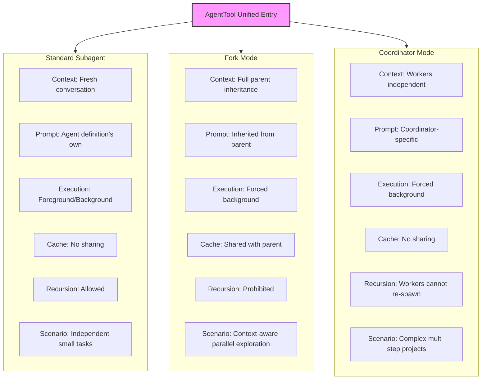
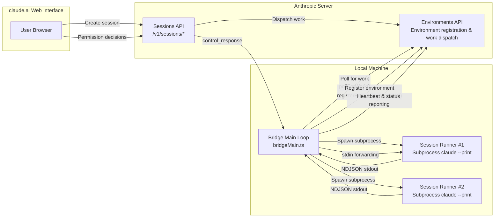

# Chapter 20: Agent 생성과 오케스트레이션 (Agent Spawning and Orchestration)

> **포지셔닝**: 이 Chapter는 Claude Code가 Subagent, Fork, Coordinator 세 가지 모드를 통해 다중 Agent 생성과 오케스트레이션을 어떻게 구현하는지 분석한다. 사전 지식: Chapter 3과 4. 대상 독자: CC가 어떻게 sub-Agent(Subagent/Fork/Coordinator)를 생성하는지 이해하고 싶은 독자, 또는 다중 Agent 시스템을 구축하는 개발자.

## 왜 여러 Agent가 필요한가 (Why Multiple Agents Are Needed)

단일 Agent Loop의 context window는 유한한 자원이다. 작업 규모가 하나의 대화가 담을 수 있는 범위를 초과할 때 — 예를 들어, "이 버그의 근본 원인을 조사하고, 수정하고, 테스트를 실행하고, PR을 작성해" — 단일 Agent는 중간 결과물을 context에 억지로 구겨 넣거나, 반복적으로 압축하면서 세부 사항을 잃어야 한다. 더 근본적인 문제는: **단일 Agent는 병렬화할 수 없다**는 것이다. 그러나 소프트웨어 엔지니어링 작업은 본질적으로 분할 정복(divide-and-conquer)에 적합하다.

Claude Code는 점진적으로 무거워지는 세 가지 다중 Agent 패턴을 제공한다: **Subagent**, **Fork Mode**, 그리고 **Coordinator Mode**. 이 셋은 단일 진입점인 `AgentTool`을 공유하지만, context 상속, 실행 모델, 생명주기 관리 면에서 근본적인 차이가 있다. 이 Chapter는 이 세 가지 모드를 층층이 해부하고, 그 주변에 구축된 검증 Agent와 tool pool 조립 로직도 함께 살펴본다.

Teams 시스템은 Chapter 20b에서, Ultraplan 원격 계획은 Chapter 20c에서 다룬다.

---

> **인터랙티브 버전**: [Agent 생성 애니메이션 보기](agent-spawn-viz.html) — 메인 Agent가 3개의 subagent를 생성하여 병렬로 작업하는 모습, context 전달 및 격리를 확인할 수 있다.

## 20.1 AgentTool: 통합 Agent 생성 진입점

모든 Agent 생성은 단일 tool을 통해 이루어진다. `AgentTool`은 `tools/AgentTool/AgentTool.tsx`에 정의되어 있으며, `name`은 `'Agent'`(226번째 줄)로 설정되고 레거시 `'Task'`에 대한 alias(228번째 줄)도 있다.

### 동적 Schema 조합 (Dynamic Schema Composition)

AgentTool의 입력 Schema는 정적이지 않다 — Feature Flag와 런타임 조건에 따라 동적으로 조합된다:

```typescript
// tools/AgentTool/AgentTool.tsx:82-88
const baseInputSchema = lazySchema(() => z.object({
  description: z.string().describe('A short (3-5 word) description of the task'),
  prompt: z.string().describe('The task for the agent to perform'),
  subagent_type: z.string().optional(),
  model: z.enum(['sonnet', 'opus', 'haiku']).optional(),
  run_in_background: z.boolean().optional()
}));
```

기본 Schema는 다섯 개의 필드를 포함한다. 다중 Agent 기능(Agent Swarm)이 활성화되면 `name`, `team_name`, `mode` 필드도 병합된다(93-97번째 줄). `isolation` 필드는 `'worktree'`(전체 빌드) 또는 `'remote'`(내부 빌드)를 지원한다. 백그라운드 작업이 비활성화되거나 Fork 모드가 활성화되면 `run_in_background` 필드는 `.omit()`으로 제거된다(122-124번째 줄).

이 동적 Schema 조합에는 중요한 설계 의도가 있다: **모델이 보는 파라미터 목록이 현재 사용할 수 있는 기능을 정확하게 반영한다**는 것이다. Fork 모드가 활성화되면 모델은 `run_in_background`를 볼 수 없다. Fork 모드에서는 모든 Agent가 자동으로 백그라운드로 실행되기 때문이다(557번째 줄) — 모델이 이를 명시적으로 제어할 필요도 없고, 제어해서도 안 된다.

### AsyncLocalStorage Context 격리 (AsyncLocalStorage Context Isolation)

여러 Agent가 동일한 프로세스에서 동시에 실행될 때(예: 사용자가 Ctrl+B를 눌러 하나의 Agent를 백그라운드로 보내고 즉시 다른 Agent를 시작하는 경우), 어떻게 각자의 신원 정보를 격리하는가? 그 답은 `AsyncLocalStorage`다.

```typescript
// utils/agentContext.ts:24
import { AsyncLocalStorage } from 'async_hooks'

// utils/agentContext.ts:93
const agentContextStorage = new AsyncLocalStorage<AgentContext>()

// utils/agentContext.ts:108-109
export function runWithAgentContext<T>(context: AgentContext, fn: () => T): T {
  return agentContextStorage.run(context, fn)
}
```

소스 코드 주석(`agentContext.ts` 17-21번째 줄)은 `AppState`를 사용하지 않는 이유를 직접 설명한다:

> Agent가 백그라운드로 전환될 때(ctrl+b), 동일한 프로세스에서 여러 Agent가 동시에 실행될 수 있다. AppState는 단일 공유 상태로 덮어쓰여질 수 있으며, 이로 인해 Agent A의 이벤트가 Agent B의 context를 잘못 사용하게 된다. AsyncLocalStorage는 각 비동기 실행 체인을 격리하므로, 동시에 실행되는 Agent들이 서로 간섭하지 않는다.

`AgentContext`는 판별 유니온(discriminated union) 타입으로, `agentType` 필드로 구분된다:

| Context 타입 | `agentType` 값 | 목적 | 주요 필드 |
|:---:|:---:|:---|:---|
| `SubagentContext` | `'subagent'` | Agent tool이 생성한 Subagent | `agentId`, `subagentName`, `isBuiltIn` |
| `TeammateAgentContext` | `'teammate'` | Teammate Agent (Swarm 구성원) | `agentName`, `teamName`, `planModeRequired`, `isTeamLead` |

두 context 타입 모두 `invokingRequestId` 필드를 가진다(43-49번째 줄, 77-83번째 줄). 이 필드는 어떤 Agent가 이 Agent를 생성했는지 추적하는 데 사용된다. `consumeInvokingRequestId()` 함수(163-178번째 줄)는 "희소 엣지(sparse edge)" 의미론을 구현한다: 각 생성/재개 시 `invokingRequestId`는 첫 번째 API 이벤트에서만 방출되고, 이후에는 `undefined`를 반환하여 중복 마킹을 방지한다.

---

## 20.2 세 가지 Agent 모드 (Three Agent Modes)

### 모드 1: 표준 Subagent (Standard Subagent)

이것이 가장 기본적인 모드다. 모델이 `Agent` tool을 호출할 때 `subagent_type`을 지정하면, AgentTool은 등록된 Agent 정의 목록에서 일치하는 정의를 찾아 **완전히 새로운** 대화를 시작한다.

라우팅 로직은 `AgentTool.tsx` 322-356번째 줄에 있다:

```typescript
// tools/AgentTool/AgentTool.tsx:322-323
const effectiveType = subagent_type
  ?? (isForkSubagentEnabled() ? undefined : GENERAL_PURPOSE_AGENT.agentType);
```

`subagent_type`이 지정되지 않고 Fork 모드가 꺼져 있으면 기본 `general-purpose` 타입이 사용된다.

내장 Agent 정의는 `builtInAgents.ts`(45-72번째 줄)에 등록되어 있으며 다음을 포함한다:

| Agent 타입 | 목적 | Tool 제한 | 모델 |
|:---:|:---|:---|:---:|
| `general-purpose` | 일반 작업: 검색, 분석, 다단계 작업 | 모든 tool | 기본값 |
| `verification` | 구현 정확성 검증 | Edit tool 금지 | 상속 |
| `Explore` | 코드 탐색 | - | - |
| `Plan` | 작업 계획 | - | - |
| `claude-code-guide` | 사용 가이드 | - | - |

Subagent의 핵심 특성은 **context 격리**다: 처음부터 시작하며 부모 Agent가 전달한 `prompt`만 볼 수 있다. System prompt도 독립적으로 생성된다(518-534번째 줄). 이는 Subagent가 부모 Agent의 대화 기록을 알지 못한다는 것을 의미한다 — "방금 막 들어온 똑똑한 동료"와 같다.

### 모드 2: Fork Mode

Fork 모드는 실험적 기능으로, 빌드 타임 게이팅(`feature('FORK_SUBAGENT')`)과 런타임 조건에 의해 공동으로 제어된다:

```typescript
// tools/AgentTool/forkSubagent.ts:32-39
export function isForkSubagentEnabled(): boolean {
  if (feature('FORK_SUBAGENT')) {
    if (isCoordinatorMode()) return false
    if (getIsNonInteractiveSession()) return false
    return true
  }
  return false
}
```

Fork 모드와 표준 Subagent의 근본적인 차이는 **context 상속**이다. Fork 자식 프로세스는 부모 Agent의 완전한 대화 context와 system prompt를 상속한다:

```typescript
// tools/AgentTool/forkSubagent.ts:60-71
export const FORK_AGENT = {
  agentType: FORK_SUBAGENT_TYPE,
  tools: ['*'],
  maxTurns: 200,
  model: 'inherit',
  permissionMode: 'bubble',
  source: 'built-in',
  baseDir: 'built-in',
  getSystemPrompt: () => '',  // Not used -- inherits parent's system prompt
} satisfies BuiltInAgentDefinition
```

`model: 'inherit'`과 `getSystemPrompt: () => ''`에 주목하라 — Fork 자식 프로세스는 부모 Agent의 모델을 사용하고(일관된 context 길이 유지), 부모 Agent의 이미 렌더링된 system prompt를 사용한다(prompt cache 히트를 극대화하기 위해 바이트 단위로 동일한 내용 유지).

#### Prompt Cache 공유 (Prompt Cache Sharing)

Fork 모드의 핵심 가치는 **prompt cache 공유**에 있다. `buildForkedMessages()` 함수(`forkSubagent.ts` 107-164번째 줄)는 모든 Fork 자식 프로세스가 바이트 단위로 동일한 API 요청 prefix를 생성하도록 메시지 구조를 구성한다:

1. 부모 Agent의 완전한 assistant 메시지 보존 (모든 `tool_use` 블록, thinking, text)
2. 각 `tool_use` 블록에 대해 동일한 플레이스홀더 `tool_result` 구성(142-150번째 줄, 고정 텍스트 `'Fork started — processing in background'` 사용)
3. 마지막에 자식별 지시 텍스트 블록만 추가

```
[...history messages, assistant(all tool_use blocks), user(placeholder tool_results..., instruction)]
```

마지막 텍스트 블록만 자식마다 다르므로, cache 히트율이 극대화된다.

#### 재귀 Fork 방지 (Recursive Fork Protection)

Fork 자식 프로세스는 tool pool에 `Agent` tool을 유지하지만(cache 일관성을 위해), 호출 시 가로채어진다(332-334번째 줄):

```typescript
// tools/AgentTool/AgentTool.tsx:332-334
if (toolUseContext.options.querySource === `agent:builtin:${FORK_AGENT.agentType}`
    || isInForkChild(toolUseContext.messages)) {
  throw new Error('Fork is not available inside a forked worker.');
}
```

감지 메커니즘은 두 가지 계층으로 이루어진다: 기본 검사는 `querySource`를 사용하고(압축에 강함 — autocompact가 메시지를 재작성해도 사라지지 않음), 백업 검사는 메시지에서 `<fork-boilerplate>` 태그를 스캔한다(78-89번째 줄).

### 모드 3: Coordinator Mode

Coordinator Mode는 환경 변수 `CLAUDE_CODE_COORDINATOR_MODE`를 통해 활성화된다:

```typescript
// coordinator/coordinatorMode.ts:36-41
export function isCoordinatorMode(): boolean {
  if (feature('COORDINATOR_MODE')) {
    return isEnvTruthy(process.env.CLAUDE_CODE_COORDINATOR_MODE)
  }
  return false
}
```

이 모드에서 메인 Agent는 **직접 코딩하지 않는 coordinator**가 되며, tool 세트는 오케스트레이션 tool로 축소된다: `Agent`(Worker 생성), `SendMessage`(Worker에 후속 지시 전송), `TaskStop`(Worker 중지) 등. Worker들이 실제 코딩 tool을 가진다.

Coordinator의 system prompt(`coordinatorMode.ts` 111-368번째 줄)는 4단계 워크플로를 정의하는 상세한 오케스트레이션 프로토콜이다:

| 단계 | 실행자 | 목적 |
|:---:|:---:|:---|
| Research | Workers (병렬) | 코드베이스 조사, 문제 파악 |
| Synthesis | **Coordinator** | 결과 읽기, 문제 이해, 구현 spec 작성 |
| Implementation | Workers | spec에 따라 코드 수정, 커밋 |
| Verification | Workers | 변경 사항이 올바른지 테스트 |

prompt에서 가장 강조되는 원칙은 **"이해를 절대 위임하지 말라(never delegate understanding)"**(256-259번째 줄)는 것이다:

> "your findings에 기반하여" 또는 "research에 기반하여"와 같은 표현은 절대 쓰지 마라. 이러한 표현은 이해를 직접 하지 않고 Worker에게 위임하는 것이다.

`getCoordinatorUserContext()` 함수(80-109번째 줄)는 Worker tool context 정보를 생성하며, Worker가 사용할 수 있는 tool 목록과 MCP 서버 목록을 포함한다. Scratchpad 기능이 활성화되면 공유 디렉터리를 Worker 간 지식 지속성에 사용할 수 있다는 정보도 coordinator에게 알린다(104-106번째 줄).

### 보충: `/btw` 측면 질문 — tool 없는 Fork

`/btw`는 네 번째 Agent 모드가 아니지만, Claude Code의 기능 매트릭스를 이해하는 데 있어 매우 중요한 **사이드 채널 특수 사례**다. 명령 정의 자체가 `local-jsx`이고 `immediate: true`이므로, 메인 스레드가 여전히 출력을 스트리밍하는 동안 독립적인 오버레이를 유지할 수 있으며, 일반 tool UI에 가려지지 않는다.

실행 경로에서 `/btw`는 메인 Loop에 큐잉되지 않고 `runSideQuestion()`이 `runForkedAgent()`를 호출한다: 부모 세션의 cache-safe prefix와 현재 대화 context를 상속하지만, `canUseTool`을 통해 모든 tool을 명시적으로 거부하고, `maxTurns`를 1로 제한하며, 이 일회성 suffix를 위한 새로운 cache prefix 쓰기를 방지하기 위해 `skipCacheWrite`를 설정한다. 즉, `/btw`는 "전체 context + tool 없음 + 단일 턴 답변"으로 차원 축소된 버전이다.

기능 매트릭스 관점에서 보면, `/btw`는 표준 Subagent와 대칭적 관계를 형성한다:

- **표준 Subagent**: tool 기능을 유지하지만 일반적으로 새로운 context에서 시작
- **`/btw`**: context 기능을 유지하지만 tool과 다중 턴 실행을 제거

이 대칭성은 Claude Code의 위임 시스템이 이진 스위치가 아니라 "context, tool, 턴 수"라는 세 가지 차원을 독립적으로 조정한다는 것을 드러내므로 중요하다. 사용자가 항상 "모든 것을 할 수 있는 또 다른 Agent"를 원하는 것은 아니다 — 때로는 단지 "현재 context를 사용하여 부작용 없이 측면 질문에 대한 답변"을 원할 뿐이다.

### 세 가지 모드 비교 (Three-Mode Comparison)



| 차원 | 표준 Subagent | Fork Mode | Coordinator Mode |
|:---:|:---:|:---:|:---:|
| Context 상속 | 없음 (새 대화) | 전체 상속 | 없음 (Worker 독립) |
| System Prompt | Agent 정의 자체 | 부모에서 상속 | Coordinator 전용 prompt |
| 모델 선택 | 오버라이드 가능 | 부모에서 상속 | 오버라이드 불가 |
| 실행 모드 | Foreground/Background | 강제 백그라운드 | 강제 백그라운드 |
| Cache 공유 | 없음 | 부모와 공유 | 없음 |
| Tool Pool | 독립적으로 조립 | 부모에서 상속 | Worker가 독립적으로 조립 |
| 재귀 생성 | 허용 | 금지 | Worker는 재생성 불가 |
| 게이팅 방식 | 항상 사용 가능 | 빌드 + 런타임 | 빌드 + 환경 변수 |
| 사용 사례 | 독립적인 소규모 작업 | context 인식 병렬 탐색 | 복잡한 다단계 프로젝트 |

---

## 20.4 검증 Agent (Verification Agent)

검증 Agent는 내장 Agent 중 가장 우아하게 설계된 것이다. 그 system prompt(`built-in/verificationAgent.ts` 10-128번째 줄)는 약 120줄에 달하며 — 본질적으로 "진짜 검증을 어떻게 수행하는가"에 대한 엔지니어링 사양(spec)이다.

### 핵심 설계 원칙 (Core Design Principles)

검증 Agent에는 두 가지 명시적인 실패 모드가 있다(12-13번째 줄):

1. **검증 회피**: 확인해야 할 상황에서 실행하지 않을 핑계를 찾음 — 코드를 읽고, 테스트 단계를 설명하고, "PASS"를 쓴 다음 넘어감
2. **처음 80%에 속음**: 예쁜 UI나 통과한 테스트 suite를 보고 통과 판정을 내리려 하면서, 버튼 절반이 작동하지 않는다는 것을 눈치채지 못함

### 엄격한 읽기 전용 제약 (Strict Read-Only Constraints)

검증 Agent는 프로젝트 수정이 명시적으로 금지된다:

```typescript
// built-in/verificationAgent.ts:139-145
disallowedTools: [
  AGENT_TOOL_NAME,
  EXIT_PLAN_MODE_TOOL_NAME,
  FILE_EDIT_TOOL_NAME,
  FILE_WRITE_TOOL_NAME,
  NOTEBOOK_EDIT_TOOL_NAME,
],
```

단, temp 디렉터리(`/tmp`)에는 임시 테스트 스크립트를 **작성할 수 있다** — 이 권한은 프로젝트를 오염시키지 않고 임시 테스트 tool을 작성하기에 충분하다.

### VERDICT 결정 (VERDICT Determination)

검증 Agent의 출력은 엄격하게 형식화된 verdict로 끝나야 한다(117-128번째 줄):

| Verdict | 의미 |
|:---:|:---|
| `VERDICT: PASS` | 검증 통과 |
| `VERDICT: FAIL` | 문제 발견, 구체적인 오류 출력과 재현 단계 포함 |
| `VERDICT: PARTIAL` | 환경 제한으로 완전한 검증 불가 ("불확실"이 아님) |

`PARTIAL`은 환경 제한(테스트 프레임워크 없음, tool 사용 불가, 서버 시작 불가)에만 사용할 수 있다 — "이것이 버그인지 확실하지 않다"는 의미로 사용할 수 없다.

### 적대적 탐색 (Adversarial Probing)

검증 Agent의 prompt는 최소 하나의 적대적 탐색을 실행하도록 요구한다(63-69번째 줄): 동시 요청, 경계값, 멱등성(idempotency), 고아 작업(orphaned operations) 등. 모든 확인이 "200을 반환한다" 또는 "테스트 suite 통과"에 그친다면, 그것은 happy path만 확인하는 것이며 진짜 검증으로 볼 수 없다.

---

## 20.7 독립 Tool Pool 조립 (Independent Tool Pool Assembly)

각 Worker의 tool pool은 독립적으로 조립되며, 부모 Agent의 제한을 상속하지 않는다(573-577번째 줄):

```typescript
// tools/AgentTool/AgentTool.tsx:573-577
const workerPermissionContext = {
  ...appState.toolPermissionContext,
  mode: selectedAgent.permissionMode ?? 'acceptEdits'
};
const workerTools = assembleToolPool(workerPermissionContext, appState.mcp.tools);
```

유일한 예외는 Fork 모드다: Fork 자식 프로세스는 부모의 정확한 tool 배열을 사용한다(`useExactTools: true`, 631-633번째 줄). tool 정의의 차이가 prompt cache를 깨뜨리기 때문이다.

### MCP 서버 대기 및 유효성 검사 (MCP Server Waiting and Validation)

Agent 정의는 필요한 MCP 서버를 선언할 수 있다(`requiredMcpServers`). AgentTool은 시작 전에 이 서버들이 사용 가능한지 확인하고(369-409번째 줄), MCP 서버가 아직 연결 중이면 최대 30초 대기하며(379-391번째 줄), 조기 종료 로직도 있다 — 필요한 서버가 이미 실패했다면, 다른 서버 대기를 중단한다.

---

## 20.8 설계 인사이트 (Design Insights)

**왜 하나가 아닌 세 가지 모드인가?** 이는 근본적인 트레이드오프에서 비롯된다: **context 공유 대 실행 격리**. 표준 Subagent는 최대 격리를 제공하지만 context가 없고, Fork는 최대 context 공유를 제공하지만 재귀할 수 없으며, Coordinator 모드는 그 중간에 위치한다 — Worker는 격리되어 있지만 coordinator가 전체적인 뷰를 유지한다. 어떤 단일 범용 솔루션도 모든 시나리오를 만족할 수 없다.

**플랫 팀 구조의 설계 철학.** teammate가 teammate를 생성하는 것을 금지하는 것은 단순한 기술적 제약이 아니다 — 이는 조직 원칙을 반영한다: 효과적인 팀에서 조율은 하나의 노드(Leader)에서 집중되어야 하며, 임의로 깊은 위임 체인을 형성해서는 안 된다. 이는 소프트웨어 엔지니어링에서 "너무 깊은 call stack을 피하라"는 직관과 일치한다.

**검증 Agent의 "안티 패턴 체크리스트" 설계.** 검증 Agent의 prompt는 LLM이 검증자 역할을 할 때의 전형적인 실패 모드를 명시적으로 나열하고(53-61번째 줄), "자신의 합리화 핑계를 인식하도록" 요구한다. 이 메타인지(meta-cognition) prompting은 LLM의 고유한 약점에 대한 엔지니어링 보완이다 — 모델이 이런 실수를 하지 않기를 기대하는 것이 아니라, 모델이 자신이 이런 실수를 하는 경향이 있다는 것을 인식하게 만드는 것이다.

---

## 사용자가 할 수 있는 것 (What Users Can Do)

**다중 Agent 모드를 활용하여 업무 효율 향상:**

1. **독립적인 조사에 Subagent 활용.** 메인 대화 context를 방해하지 않고 독립적인 하위 작업을 완료해야 할 때(예: "이 API의 모든 호출자 찾기"), 모델이 Subagent를 시작하도록 하는 것이 최선이다. Subagent는 자체 context window를 가지며, 완료되면 요약을 반환하고 메인 대화를 오염시키지 않는다.

2. **Coordinator Mode의 4단계 워크플로 이해.** 조직에서 Coordinator Mode(`CLAUDE_CODE_COORDINATOR_MODE=true`)를 활성화했다면, Research -> Synthesis -> Implementation -> Verification 4단계 워크플로를 이해하면 더 효과적으로 협업할 수 있다. 특히 주목할 점: coordinator는 직접 코딩하지 않으며 — 오직 문제 이해와 작업 할당만 처리한다.

3. **품질 게이트를 위해 검증 Agent 활용.** 복잡한 변경 완료 후 검증 Agent 실행을 명시적으로 요청할 수 있다. 읽기 전용 제약과 적대적 탐색 설계가 신뢰할 수 있는 "두 번째 검토자" 역할을 한다.

4. **Worktree 격리로 메인 브랜치 보호.** Agent가 `isolation: 'worktree'`를 사용하면 모든 수정이 임시 git worktree에서 이루어진다. 변경 사항이 없는 worktree는 자동으로 정리되고, 변경 사항이 있는 것은 브랜치를 유지한다 — Agent가 실험적 수정을 시도하도록 자신 있게 허용할 수 있다는 의미다.

---

## 20.9 원격 실행: Bridge 아키텍처 (Remote Execution: Bridge Architecture)

앞 섹션에서는 세 가지 Agent 생성 모드인 Subagent, Fork, Coordinator를 분석했으며, 이 모두는 로컬 프로세스에서 실행된다. 그러나 Claude Code는 단순한 로컬 CLI tool 이상이다. Bridge 서브시스템(`restored-src/src/bridge/`, 총 33개 파일)은 Agent 실행 기능을 네트워크 경계 너머로 확장하여, 사용자가 claude.ai Web 인터페이스에서 로컬 머신의 Agent 세션을 원격으로 트리거할 수 있게 한다. Fork가 "로컬 머신에서의 프로세스 수준 Agent 분할"이라면, Bridge는 "크로스 네트워크 Agent 투영(projection)"이다.

### 세 가지 컴포넌트 아키텍처 (Three-Component Architecture)

Bridge의 설계는 클래식한 client-server-worker 패턴을 따른다. 전체 시스템은 세 가지 컴포넌트로 구성된다:



**Bridge Main Loop**(`bridgeMain.ts`)은 핵심 오케스트레이터다. `runBridgeLoop()`(141번째 줄)를 통해 지속적인 polling 루프를 시작한다: 서버에 로컬 환경을 등록한 다음, `pollForWork()`를 반복적으로 호출하여 새로운 세션 요청을 받는다. 새 작업이 도착하면, Bridge는 `SessionSpawner`를 사용하여 실제 Agent 작업을 실행할 자식 Claude Code 프로세스를 생성한다.

**Session Runner**(`sessionRunner.ts`)는 각 서브프로세스의 생명주기를 관리한다. `createSessionSpawner()`(248번째 줄)를 통해 팩토리를 생성한다. 각 `.spawn()` 호출은 새로운 `claude --print` 서브프로세스를 시작하며, `--input-format stream-json --output-format stream-json` NDJSON 스트리밍 모드로 구성된다(287-299번째 줄). 서브프로세스의 stdout은 `readline`으로 줄 단위로 파싱되어, tool 호출 활동(`extractActivities`)과 권한 요청(`control_request`)을 추출한다.

### JWT 인증 흐름 (JWT Authentication Flow)

Bridge 인증은 두 계층의 JWT(JSON Web Token) 시스템에 기반한다: 외부 계층은 환경 등록과 관리 API를 위한 OAuth 토큰이고, 내부 계층은 서브프로세스의 실제 추론 요청을 위한 Session Ingress Token(prefix `sk-ant-si-`)이다.

`jwtUtils.ts`의 `createTokenRefreshScheduler()`(72번째 줄)는 우아한 토큰 갱신 스케줄러를 구현한다. 핵심 로직:

1. **JWT 만료 시간 디코딩.** `decodeJwtPayload()` 함수(21번째 줄)는 `sk-ant-si-` prefix를 제거한 후 Base64url 인코딩된 payload 세그먼트를 디코딩하여 `exp` claim을 추출한다. 여기서 **서명은 검증되지 않는다** — Bridge는 만료 시간만 알면 된다. 검증은 서버 측에서 수행된다.

2. **사전 갱신.** 스케줄러는 토큰 만료 5분 전에 사전적으로 갱신을 시작한다(`TOKEN_REFRESH_BUFFER_MS`, 52번째 줄). 만료된 토큰 사용으로 인한 요청 실패를 방지한다.

3. **경쟁 조건 방지를 위한 generation 카운팅.** 각 세션은 generation 카운터를 유지한다(94번째 줄). `schedule()`과 `cancel()` 모두 generation 번호를 증가시킨다. 비동기 `doRefresh()`가 완료되면, 현재 generation이 시작 시점의 generation과 일치하는지 확인한다(178번째 줄) — 일치하지 않으면 세션이 재스케줄되거나 취소된 것이므로 갱신 결과를 버려야 한다. 이 패턴은 동시 갱신으로 인한 고아 타이머 문제를 효과적으로 방지한다.

4. **실패 재시도와 circuit breaking.** 3번 연속 실패 후(`MAX_REFRESH_FAILURES`, 58번째 줄) 재시도를 중단하여 토큰 소스가 완전히 사용 불가능한 경우 무한 루프를 방지한다. 각 실패 후 60초 대기 후 재시도한다.

### 세션 포워딩과 권한 프록시 (Session Forwarding and Permission Proxying)

Bridge의 가장 우아한 설계는 원격 권한 프록시에 있다. 서브프로세스가 민감한 작업을 수행해야 할 때(파일 쓰기나 셸 명령 실행 등), stdout을 통해 `control_request` 메시지를 방출한다. `sessionRunner.ts`의 NDJSON 파서가 이러한 메시지를 감지하고(417-431번째 줄), `onPermissionRequest` 콜백을 호출하여 요청을 서버로 전달한다.

`bridgePermissionCallbacks.ts`는 권한 프록시의 타입 계약을 정의한다:

```typescript
// restored-src/src/bridge/bridgePermissionCallbacks.ts:3-8
type BridgePermissionResponse = {
  behavior: 'allow' | 'deny'
  updatedInput?: Record<string, unknown>
  updatedPermissions?: PermissionUpdate[]
  message?: string
}
```

Web 인터페이스에서 사용자가 내린 허용/거부 결정은 `control_response` 메시지를 통해 Bridge로 전달되고, Bridge는 서브프로세스의 stdin을 통해 Session Runner로 전달한다. 이는 완전한 권한 루프를 형성한다: 서브프로세스 요청 -> Bridge 포워딩 -> 서버 -> Web 인터페이스 -> 사용자 결정 -> 동일한 경로로 반환.

토큰 업데이트도 stdin을 통해 이루어진다. `SessionHandle.updateAccessToken()`(`sessionRunner.ts` 527번째 줄)은 새 토큰을 `update_environment_variables` 메시지로 감싸 서브프로세스의 stdin에 쓴다. 서브프로세스의 StructuredIO 핸들러가 직접 `process.env`를 설정하므로, 이후 인증 헤더는 자동으로 새 토큰을 사용한다.

### 용량 관리 (Capacity Management)

Bridge는 여러 동시 세션의 용량 문제를 처리해야 한다. `types.ts`는 세 가지 spawn 모드(SpawnMode, 68-69번째 줄)를 정의한다:

| 모드 | 동작 | 사용 사례 |
|------|----------|----------|
| `single-session` | 단일 세션, 완료 시 종료 | 기본 모드, 가장 단순 |
| `worktree` | 세션별 독립 git worktree | 병렬 다중 세션, 간섭 없음 |
| `same-dir` | 모든 세션이 작업 디렉터리 공유 | 가볍지만 충돌 가능성 있음 |

`bridgeMain.ts`의 기본 최대 동시 세션 수는 32개이며(`SPAWN_SESSIONS_DEFAULT`, 83번째 줄), 다중 세션 기능은 GrowthBook Feature Gate(`tengu_ccr_bridge_multi_session`, 97번째 줄)를 통해 단계적으로 출시된다.

`capacityWake.ts`는 용량 wake 프리미티브를 구현한다(`createCapacityWake()`, 28번째 줄). 모든 세션 슬롯이 가득 찼을 때 polling 루프는 슬립한다. 두 가지 이벤트가 이를 깨운다: (a) 외부 abort 신호(종료), 또는 (b) 세션 완료로 슬롯 해방. 이 모듈은 `bridgeMain.ts`와 `replBridge.ts`에서 이전에 중복되었던 wake 로직을 공유 프리미티브로 추상화한다 — 주석이 말하듯: "두 poll 루프가 이전에 바이트 단위로 중복되었다"(8번째 줄).

각 세션에는 타임아웃 보호도 있다: 기본 24시간(`DEFAULT_SESSION_TIMEOUT_MS`, `types.ts` 2번째 줄). 타임아웃된 세션은 Bridge의 watchdog에 의해 사전적으로 종료되며, 먼저 SIGTERM을 보낸 후 유예 기간 후에 SIGKILL을 보낸다.

### Agent 생성과의 관계 (Relationship to Agent Spawning)

Bridge는 이 Chapter 전반부에서 논의된 Agent 생성 메커니즘의 네트워크 차원을 따른 자연스러운 확장이다. 세 가지 Agent 모드와 Bridge를 같은 스펙트럼에 놓으면:

| 차원 | Subagent | Fork | Coordinator | Bridge |
|-----------|---------|------|------------|--------|
| 실행 위치 | 동일 프로세스 | 서브프로세스 | 서브프로세스 그룹 | 원격 서브프로세스 |
| Context 상속 | 없음 | 전체 스냅샷 | 요약 전달 | 없음 (독립 세션) |
| 트리거 소스 | LLM 자율 | LLM 자율 | LLM 자율 | 사용자 via Web |
| 권한 모델 | 부모 상속 | 부모 상속 | 부모 상속 | 원격 프록시 반환 |
| 생명주기 | 부모 관리 | 부모 관리 | Coordinator 관리 | Bridge polling 루프 관리 |

Bridge 세션은 본질적으로 context 상속이 없는 원격 Subagent다 — 정확히 동일한 `claude --print` 실행 모드를 사용하지만, 세션 생성, 권한 결정, 생명주기 관리가 모두 네트워크 경계를 넘는다. `sessionRunner.ts`의 `createSessionSpawner()`는 개념적으로 AgentTool의 서브프로세스 생성과 동형(isomorphic)이며, 트리거 소스와 통신 채널만 다르다.

이 설계의 우아함은 Agent가 로컬에서 실행되든 원격에서 실행되든 상관없이, 핵심 Agent Loop(Chapter 3 참조)은 전혀 변경할 필요가 없다는 사실에 있다. Bridge는 Loop 외부에 네트워크 전송과 인증 프로토콜 계층을 감싸기만 하며, 커널의 단순성을 유지한다.
