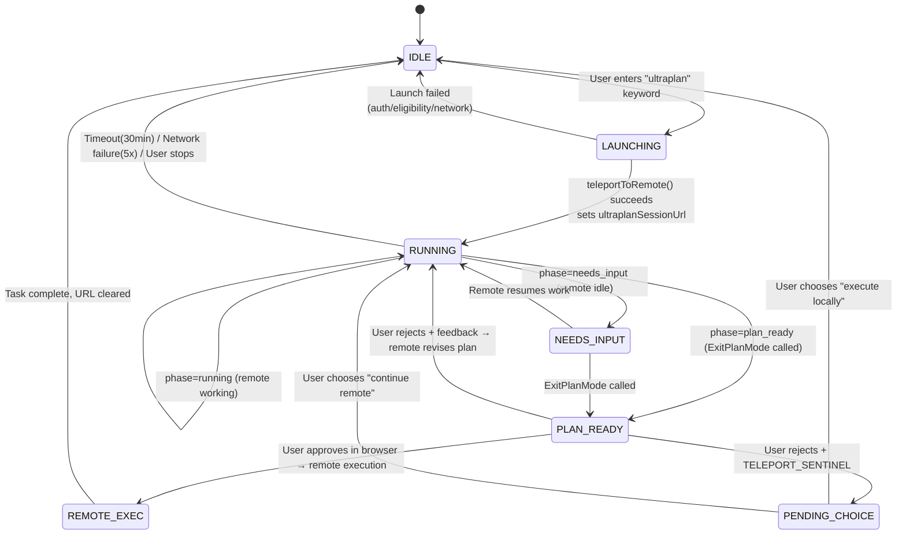

# Chapter 20c: Ultraplan — Remote Multi-Agent Planning

## Ultraplan이 필요한 이유 (Why Ultraplan Is Needed)

이 Chapter의 앞부분에서 설명한 multi-Agent orchestration은 모두 **로컬(local)** 방식이다 — Agent가 사용자의 터미널에서 실행되고, 터미널 I/O를 점유하며, 사용자와 context window를 공유한다. Ultraplan은 다른 문제를 해결한다: **planning 단계를 remote로 오프로드(offload)** 하여 사용자의 터미널을 계속 사용 가능한 상태로 유지하는 것이다.

| 차원 | 로컬 Plan Mode | Ultraplan |
|------|---------------|-----------|
| 실행 위치 | 로컬 터미널 | CCR (Claude Code on the web) remote container |
| 모델 | 현재 세션 모델 | Opus 4.6 강제 적용 (GrowthBook `tengu_ultraplan_model` config) |
| 탐색 방식 | 단일 Agent 순차 탐색 | 선택적 multi-Agent 병렬 탐색 (prompt variant에 따라 다름) |
| Timeout | 고정 timeout 없음 | 30분 (GrowthBook `tengu_ultraplan_timeout_seconds`, 기본값 1800) |
| 사용자 터미널 | 차단됨 | 계속 사용 가능, 사용자가 다른 작업 진행 가능 |
| 결과 전달 | 세션에서 직접 실행 | "remote로 실행 후 PR 생성" 또는 "로컬 터미널로 teleport하여 실행" |
| 승인 방식 | 터미널 dialog | 브라우저 PlanModal |

## 아키텍처 개요 (Architecture Overview)

Ultraplan은 5개의 핵심 모듈로 구성된다:

```
┌──────────────────────────────────────────────────────────────┐
│                    User Terminal (Local)                       │
│                                                              │
│  PromptInput.tsx                processUserInput.ts           │
│  ┌─────────────┐              ┌──────────────────┐           │
│  │ Keyword      │─→ Rainbow    │ "ultraplan"       │          │
│  │ detection    │   highlight  │ replacement       │          │
│  │ + toast      │              │ → /ultraplan cmd   │          │
│  └─────────────┘              └────────┬─────────┘           │
│                                        ↓                     │
│  commands/ultraplan.tsx ──────────────────────────            │
│  ┌─────────────────────────────────────────────┐             │
│  │ launchUltraplan()                           │             │
│  │  ├─ checkRemoteAgentEligibility()           │             │
│  │  ├─ buildUltraplanPrompt(blurb, seed, id)   │             │
│  │  ├─ teleportToRemote() ──→ CCR session      │             │
│  │  ├─ registerRemoteAgentTask()               │             │
│  │  └─ startDetachedPoll() ──→ Background poll │             │
│  └───────────────────────────┬─────────────────┘             │
│                              ↓                               │
│  utils/ultraplan/ccrSession.ts                               │
│  ┌─────────────────────────────────────────────┐             │
│  │ pollForApprovedExitPlanMode()               │             │
│  │  ├─ Poll remote session events every 3s     │             │
│  │  ├─ ExitPlanModeScanner.ingest() state machine│           │
│  │  └─ Phase detection: running → needs_input → ready│       │
│  └───────────────────────────┬─────────────────┘             │
│                              ↓                               │
│  Task system Pill display                                     │
│  ◇ ultraplan (running)                                       │
│  ◇ ultraplan needs your input (remote idle)                  │
│  ◆ ultraplan ready (plan ready)                              │
└──────────────────────────────────────────────────────────────┘
                               ↕ HTTP polling
┌──────────────────────────────────────────────────────────────┐
│                   CCR Remote Container                        │
│                                                              │
│  Opus 4.6 + plan mode permissions                            │
│  ├─ Explore codebase (Glob/Grep/Read)                        │
│  ├─ Optional: Task tool spawns parallel subagents            │
│  ├─ Call ExitPlanMode to submit plan                         │
│  └─ Wait for user approval (approve/reject/teleport to local)│
└──────────────────────────────────────────────────────────────┘
```

## CCR이란 무엇인가 — "원격 작업"의 의미 (What CCR Is — The Meaning of "Working Remotely")

아키텍처 다이어그램에 등장하는 "CCR Remote Container"는 **Claude Code Remote** (Claude Code on the web)를 의미하며, 본질적으로 Anthropic 서버에서 실행되는 완전한 Claude Code 인스턴스(instance)다:

```
Your terminal (local CLI client)          Anthropic cloud (CCR container)
┌──────────────────────┐            ┌────────────────────────────┐
│ Only responsible for: │            │ Running:                    │
│ · Bundle and upload   │──HTTP──→   │ · Complete Claude Code      │
│   codebase            │            │   instance                  │
│ · Display task Pill   │            │ · Opus 4.6 model (forced)   │
│ · Poll status every 3s│←─poll──    │ · Your codebase copy        │
│ · Receive final plan  │            │   (bundle)                  │
│                      │            │ · Glob/Grep/Read etc. tools  │
│ You can continue      │            │ · Optional: multiple         │
│ other work            │            │   subagents in parallel      │
│                      │            │ · Plan mode permissions       │
│                      │            │   (read-only)                │
└──────────────────────┘            └────────────────────────────┘
```

## 사용자가 할 수 있는 것 (What Users Can Do)

**트리거 방법**:

1. **키워드 트리거** — prompt에 자연스럽게 "ultraplan"을 작성:
   ```
   ultraplan refactor the auth module to support both OAuth2 and API key methods
   ```
2. **Slash command** — 명시적으로 `/ultraplan <description>` 호출

**사전 조건** (`checkRemoteAgentEligibility()` 확인 항목):
- OAuth를 통해 Claude Code에 로그인되어 있을 것
- 구독 등급이 remote Agent를 지원할 것 (Pro/Max/Team/Enterprise)
- 계정에 Feature Flag `ULTRAPLAN`이 활성화되어 있을 것 (GrowthBook 서버 사이드 제어)

**가용성 확인**: "ultraplan"이 포함된 텍스트를 입력했을 때 키워드가 rainbow 하이라이트로 표시되고 "This prompt will launch an ultraplan session in Claude Code on the web"라는 toast 알림이 나타나면 기능이 활성화된 것이다. 아무 반응이 없으면 해당 계정에 feature flag가 활성화되어 있지 않은 것이다.

**사용 흐름**:

```
1. "ultraplan"이 포함된 prompt 입력
2. 실행 dialog 확인
3. 터미널에 CCR URL이 표시되며, 다른 작업 계속 진행 가능
4. Task bar Pill로 진행 상황 확인:
   ◇ ultraplan               → Remote에서 코드베이스 탐색 중
   ◇ ultraplan needs your input → 브라우저에서 조치 필요
   ◆ ultraplan ready          → Plan 준비 완료, 승인 대기 중
5. 브라우저에서 plan 승인:
   a. Approve → Remote로 실행하여 Pull Request 생성
   b. Reject + feedback → Remote가 피드백 기반으로 수정 후 재제출
   c. Teleport to local → Plan이 터미널로 돌아와 로컬 실행
6. 중간에 중단하려면 task system을 통해 취소
```

**소스 코드 위치**:

| 파일 | 라인 수 | 역할 |
|------|---------|------|
| `commands/ultraplan.tsx` | 470 | 메인 command: 실행, poll, 중단, 에러 처리 |
| `utils/ultraplan/ccrSession.ts` | 350 | Poll state machine, ExitPlanModeScanner, phase 감지 |
| `utils/ultraplan/keyword.ts` | 128 | 키워드 감지: 트리거 규칙, context 제외 조건 |
| `state/AppStateStore.ts` | -- | State 필드: `ultraplanSessionUrl`, `ultraplanPendingChoice` 등 |
| `tasks/RemoteAgentTask/` | -- | Remote task 등록 및 lifecycle 관리 |
| `components/PromptInput/PromptInput.tsx` | -- | 키워드 rainbow 하이라이트 + toast |

## 키워드 트리거 시스템 (Keyword Trigger System)

사용자는 `/ultraplan`을 직접 입력할 필요가 없다 — prompt에 자연스럽게 "ultraplan"을 작성하기만 해도 트리거된다.

```typescript
// restored-src/src/utils/ultraplan/keyword.ts
export function findUltraplanTriggerPositions(text: string): TriggerPosition[]
export function hasUltraplanKeyword(text: string): boolean
export function replaceUltraplanKeyword(text: string): string
```

**제외 규칙** — 다음 context에서의 "ultraplan"은 트리거되지 않는다:

| Context | 예시 | 이유 |
|---------|------|------|
| 따옴표/백틱 내부 | `` `ultraplan` `` | 코드 참조 |
| Path 내부 | `src/ultraplan/foo.ts` | 파일 경로 |
| 식별자(identifier) 내부 | `--ultraplan-mode` | CLI argument |
| 파일 확장자 앞 | `ultraplan.tsx` | 파일명 |
| 물음표 뒤 | `ultraplan?` | 기능에 대한 질문, 트리거 의도 아님 |
| `/`로 시작 | `/ultraplan` | slash command 경로를 통해 처리됨 |

트리거 후 `processUserInput.ts`는 키워드를 `/ultraplan {재작성된 prompt}`로 교체하고 command handler로 라우팅한다.

## State Machine: Lifecycle 관리 (State Machine: Lifecycle Management)

Ultraplan은 5개의 AppState 필드를 사용하여 lifecycle을 관리한다:

```typescript
// restored-src/src/state/AppStateStore.ts
ultraplanLaunching?: boolean         // 실행 중 (중복 실행 방지, ~5s 윈도우)
ultraplanSessionUrl?: string         // 활성 세션 URL (존재 시 키워드 트리거 비활성화)
ultraplanPendingChoice?: {           // 승인된 plan으로 사용자의 실행 위치 선택 대기 중
  plan: string
  sessionId: string
  taskId: string
}
ultraplanLaunchPending?: {           // 실행 전 확인 dialog 상태
  blurb: string
}
isUltraplanMode?: boolean            // Remote 측 flag (set_permission_mode를 통해 설정)
```

**State 전이 다이어그램**:



## Polling과 Phase 감지 (Polling and Phase Detection)

`startDetachedPoll()`은 백그라운드 async IIFE로 실행되며, 터미널을 차단하지 않는다:

```typescript
// restored-src/src/utils/ultraplan/ccrSession.ts

const POLL_INTERVAL_MS = 3000             // 3초마다 poll
const MAX_CONSECUTIVE_FAILURES = 5        // 연속 5번 네트워크 에러 시 포기
const ULTRAPLAN_TIMEOUT_MS = 30 * 60 * 1000  // 30분 timeout
```

**ExitPlanModeScanner**는 remote 세션 이벤트 스트림에서 신호를 추출하는 순수 stateless 이벤트 프로세서다:

```typescript
// Scan result 타입
type ScanResult =
  | { kind: 'approved'; plan: string }    // 사용자 승인 (remote 실행)
  | { kind: 'teleport'; plan: string }    // 사용자 거부 + teleport 마커 (로컬 실행)
  | { kind: 'rejected'; id: string }      // 일반 거부 (수정 후 재제출)
  | { kind: 'pending' }                   // ExitPlanMode 호출됨, 승인 대기 중
  | { kind: 'terminated'; subtype: string } // 세션 종료됨
  | { kind: 'unchanged' }                 // 새 신호 없음
```

**Phase 감지 로직**:

```typescript
// remote 세션의 현재 phase 결정
const quietIdle =
  (sessionStatus === 'idle' || sessionStatus === 'requires_action') &&
  newEvents.length === 0

const phase: UltraplanPhase = scanner.hasPendingPlan
  ? 'plan_ready'      // ExitPlanMode 호출됨, 브라우저 승인 대기 중
  : quietIdle
    ? 'needs_input'    // Remote가 idle 상태, 사용자 입력이 필요할 수 있음
    : 'running'        // 정상 작동 중
```

## GrowthBook 기반 Prompt Variant (v2.1.91 신규) (GrowthBook-Driven Prompt Variants)

v2.1.91에서 `tengu_ultraplan_prompt_identifier` 이벤트가 도입되어 **GrowthBook 제어 prompt variant 시스템**이 공개되었다. 번들에서 최소 3가지 prompt variant가 추출되었다:

**Variant 1: `simple_plan` (기본값)** — 경량 단일 agent planning

```
You're running in a remote planning session.
Run a lightweight planning process, consistent with how you would
in regular plan mode:
- Explore the codebase directly with Glob, Grep, and Read.
- Do not spawn subagents.
When you've settled on an approach, call ExitPlanMode with the plan.
```

**Variant 2: Multi-agent 탐색** — Task tool을 사용하여 병렬 subagent 생성

```
Produce an exceptionally thorough implementation plan using
multi-agent exploration.
Instructions:
1. Use the Task tool to spawn parallel agents to explore different
   aspects of the codebase simultaneously:
   - One agent to understand the relevant existing code and architecture
   - One agent to find all files that will need modification
   - One agent to identify potential risks, edge cases, and dependencies
2. Synthesize their findings into a detailed, step-by-step plan.
3. Use the Task tool to spawn a critique agent to review the plan.
4. Incorporate the critique feedback, then call ExitPlanMode.
```

**Variant 전환 메커니즘**:

```typescript
// v2.1.91 번들 역공학(reverse engineering)
function getPromptIdentifier(): string {
  // GrowthBook에서 읽어옴, 기본값 "simple_plan"
  let id = getFeatureValue('tengu_ultraplan_prompt_identifier', 'simple_plan')
  return isValidId(id) ? id : 'simple_plan'
}

function getTimeout(): number {
  // GrowthBook에서 읽어옴, 기본값 1800초 (30분)
  return getFeatureValue('tengu_ultraplan_timeout_seconds', 1800) * 1000
}
```

이는 Anthropic이 새 릴리스를 배포하지 않고도 GrowthBook을 통해 다양한 planning 전략을 A/B 테스트할 수 있음을 의미한다. `tengu_ultraplan_config` 이벤트는 각 실행 시 사용된 특정 설정 조합을 기록한다.

## Plan Teleport 프로토콜 (Plan Teleport Protocol)

사용자가 브라우저에서 plan을 거부하되 "로컬 터미널로 teleport"를 선택하면, 브라우저는 피드백에 sentinel 문자열을 삽입한다:

```typescript
const ULTRAPLAN_TELEPORT_SENTINEL = '__ULTRAPLAN_TELEPORT_LOCAL__'
```

Remote 측 prompt는 모델이 이 sentinel을 인식하도록 명시적으로 지시한다:

> 피드백에 `__ULTRAPLAN_TELEPORT_LOCAL__`이 포함되어 있으면, 구현하지 말 것 — plan이 사용자의 로컬 터미널로 teleport되었다. "Plan teleported. Return to your terminal to continue."라고만 응답할 것.

로컬의 `ExitPlanModeScanner`가 sentinel을 감지하고, plan 텍스트를 추출하며, `ultraplanPendingChoice`를 설정하여 사용자에게 로컬 실행 또는 remote 계속 진행 중 하나를 선택하는 dialog를 표시한다.

## 에러 처리 매트릭스 (Error Handling Matrix)

| 에러 | Reason Code | 발생 시점 | 복구 전략 |
|------|------------|----------|-----------|
| `UltraplanPollError` | `terminated` | Remote 세션 비정상 종료 | 사용자 알림 + 세션 아카이브 |
| `UltraplanPollError` | `timeout_pending` | 30분 timeout, plan이 pending 상태에 도달 | 알림 + 아카이브 |
| `UltraplanPollError` | `timeout_no_plan` | 30분 timeout, ExitPlanMode 미호출 | 알림 + 아카이브 |
| `UltraplanPollError` | `network_or_unknown` | 연속 5번 네트워크 에러 | 알림 + 아카이브 |
| `UltraplanPollError` | `stopped` | 사용자가 수동으로 중단 | 조기 종료, kill이 아카이브 처리 |
| Launch 에러 | `precondition` | 인증/구독/자격 미충족 | 사용자 알림 |
| Launch 에러 | `bundle_fail` | 번들 생성 실패 | 사용자 알림 |
| Launch 에러 | `teleport_null` | Remote 세션 생성이 null 반환 | 사용자 알림 |
| Launch 에러 | `unexpected_error` | 예외 발생 | 고아(orphan) 세션 아카이브 + URL 초기화 |

## Telemetry 이벤트 개요 (Telemetry Event Overview)

| 이벤트 | 소스 버전 | 트리거 시점 | 주요 메타데이터 |
|--------|----------|------------|---------------|
| `tengu_ultraplan_keyword` | v2.1.88 | 사용자 입력에서 키워드 감지 | -- |
| `tengu_ultraplan_launched` | v2.1.88 | CCR 세션 생성 성공 | `has_seed_plan`, `model`, `prompt_identifier` |
| `tengu_ultraplan_approved` | v2.1.88 | Plan 승인됨 | `duration_ms`, `plan_length`, `reject_count`, `execution_target` |
| `tengu_ultraplan_awaiting_input` | v2.1.88 | Phase가 needs_input으로 전환 | -- |
| `tengu_ultraplan_failed` | v2.1.88 | Poll 에러 | `duration_ms`, `reason`, `reject_count` |
| `tengu_ultraplan_create_failed` | v2.1.88 | Launch 실패 | `reason`, `precondition_errors` |
| `tengu_ultraplan_model` | v2.1.88 | GrowthBook config 이름 | 모델 ID (기본값 Opus 4.6) |
| `tengu_ultraplan_config` | **v2.1.91** | Launch 시 설정 조합 기록 | 모델 + timeout + prompt variant |
| `tengu_ultraplan_keyword` | **v2.1.91** | (재사용) 향상된 트리거 추적 | -- |
| `tengu_ultraplan_prompt_identifier` | **v2.1.91** | GrowthBook config 이름 | Prompt variant ID |
| `tengu_ultraplan_stopped` | **v2.1.91** | 사용자 수동 중단 | -- |
| `tengu_ultraplan_timeout_seconds` | **v2.1.91** | GrowthBook config 이름 | Timeout 초 (기본값 1800) |

## 패턴 정제: Remote Offloading 패턴 (Pattern Distillation: Remote Offloading Pattern)

Ultraplan은 재사용 가능한 아키텍처 패턴을 구현한다 — **remote offloading**:

```
Local Terminal                     Remote Container
┌──────────┐                   ┌──────────────┐
│ Fast      │───create session──→ │ Long-running  │
│ feedback  │                   │ High-compute  │
│ Stays     │                   │ model         │
│ available │←──poll status──   │ Multi-agent   │
│           │                   │ parallel      │
│ Pill      │                   │              │
│ display   │←──plan ready──   │ ExitPlanMode │
│ ◇/◆      │                   │              │
│ status    │                   │              │
│           │                   │              │
│ Choose    │───approve/       │ Execute/     │
│ execution │   teleport──→    │ stop         │
└──────────┘                   └──────────────┘
```

**핵심 설계 결정**:

1. **비동기 분리**: `startDetachedPoll()`이 async IIFE로 실행되어, 터미널 이벤트 루프를 차단하지 않고 즉시 사용자 친화적인 메시지를 반환한다.
2. **State machine 기반 UI**: 세 가지 phase (running/needs_input/plan_ready)가 task Pill 시각 상태 (열린/채워진 다이아몬드)에 매핑되어, 사용자가 브라우저를 열지 않고도 remote 진행 상황을 파악할 수 있다.
3. **Sentinel 프로토콜**: `__ULTRAPLAN_TELEPORT_LOCAL__`은 tool result 텍스트를 프로세스 간 통신 채널로 활용한다 — 단순하지만 효과적이다.
4. **GrowthBook 기반 variant**: 모델, timeout, prompt variant가 모두 원격으로 설정 가능한 feature flag이며, 릴리스 없이 A/B 테스트를 지원한다.
5. **고아(orphan) 방지**: 모든 에러 경로에서 `archiveRemoteSession()`을 실행하여 아카이브함으로써 CCR 세션 누수를 방지한다.

## Subagent 개선 사항 (v2.1.91) (Subagent Enhancements)

v2.1.91에서는 Ultraplan의 multi-agent 전략을 보완하는 여러 subagent 관련 이벤트도 추가되었다:

- `tengu_forked_agent_default_turns_exceeded` — Forked agent가 기본 turn 한도를 초과하여 비용 제어 트리거
- `tengu_subagent_lean_schema_applied` — Subagent가 lean schema 사용 (context 사용량 감소)
- `tengu_subagent_md_report_blocked` — Subagent가 CLAUDE.md 보고서 생성 시도 시 차단됨 (보안 경계)
- `tengu_mcp_subagent_prompt` — MCP subagent prompt 주입 추적
- `CLAUDE_CODE_AGENT_COST_STEER` (신규 환경 변수) — Subagent 비용 조정 메커니즘
