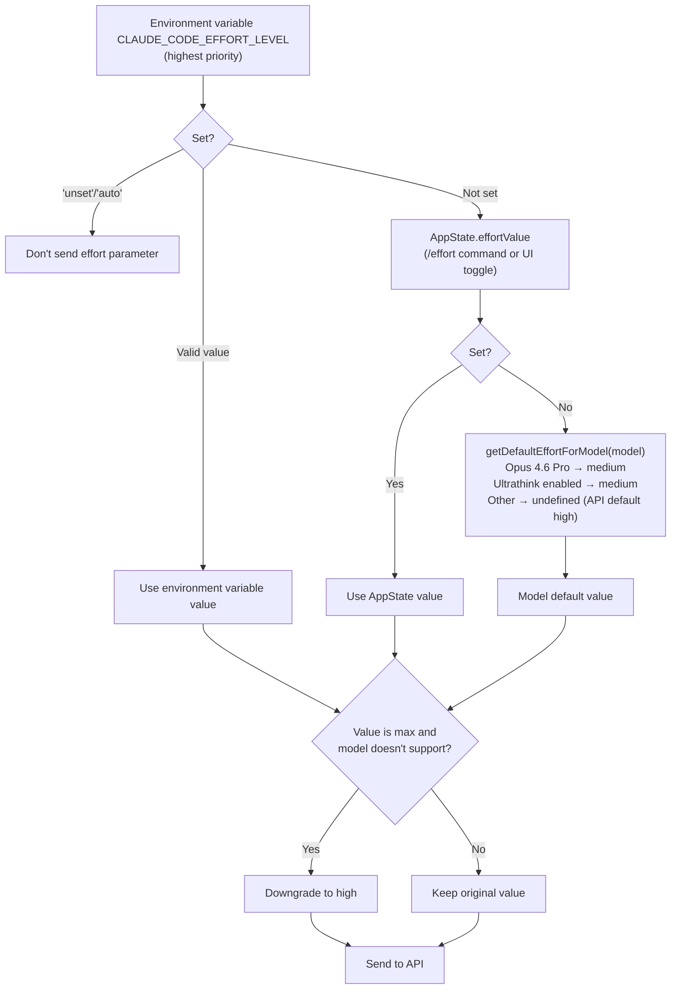

# Chapter 21: Effort, Fast Mode, 그리고 Thinking

## 왜 계층적 추론 제어가 필요한가 (Why Layered Reasoning Control Is Needed)

모델의 추론 깊이는 "많을수록 좋다"는 공식이 성립하지 않는다. 더 깊은 사고는 더 높은 latency, 더 많은 token 소비, 그리고 더 낮은 throughput을 의미한다. "변수 `foo`를 `bar`로 이름 바꾸기" 같은 작업에 Opus 4.6이 10초 동안 깊은 추론을 수행하는 것은 낭비이고, "전체 인증 모듈의 오류 처리 리팩터링"에 빠르고 얕은 응답을 내놓는 것은 품질이 낮은 코드를 만들어낸다.

Claude Code는 세 가지 독립적이면서도 협력하는 메커니즘을 통해 추론 깊이를 제어한다: **Effort** (추론 노력 수준), **Fast Mode** (가속 모드), 그리고 **Thinking** (chain-of-thought 설정). 각각 서로 다른 설정 소스, 우선순위 규칙, 모델 호환성 요구사항을 가지며, 함께 각 API 호출의 추론 동작을 결정한다. 이 Chapter에서는 이 세 가지 메커니즘을 하나씩 해부하고, 런타임에서 어떻게 협력하는지 분석한다.

---

## 21.1 Effort: 추론 노력 수준 (Reasoning Effort Level)

Effort는 모델이 응답을 생성하기 전에 얼마나 많은 "사고 시간"을 투자하는지를 제어하는 Claude API의 네이티브 파라미터다. Claude Code는 이 위에 다중 계층 우선순위 chain을 구축한다.

### 네 가지 수준 (Four Levels)

```typescript
// utils/effort.ts:13-18
export const EFFORT_LEVELS = [
  'low',
  'medium',
  'high',
  'max',
] as const satisfies readonly EffortLevel[]
```

| 수준 | 설명 (lines 224-235) | 제한 |
|:---:|:---|:---|
| `low` | 빠르고 직접적인 구현, 최소한의 오버헤드 | - |
| `medium` | 균형 잡힌 접근, 표준 구현 및 테스트 | - |
| `high` | 광범위한 테스트와 문서화를 포함한 포괄적 구현 | - |
| `max` | 가장 깊은 추론 능력 | Opus 4.6 전용 |

`max` 수준의 모델 제한은 `modelSupportsMaxEffort()`(lines 53-65)에 하드코딩되어 있다: `opus-4-6` 및 내부 모델만 지원된다. 다른 모델이 `max`를 사용하려 하면 `high`로 다운그레이드된다(line 164).

### 우선순위 Chain (Priority Chain)

Effort의 실제 값은 명확한 3단계 우선순위 chain에 의해 결정된다:

```typescript
// utils/effort.ts:152-167
export function resolveAppliedEffort(
  model: string,
  appStateEffortValue: EffortValue | undefined,
): EffortValue | undefined {
  const envOverride = getEffortEnvOverride()
  if (envOverride === null) {
    return undefined  // Environment variable set to 'unset'/'auto': don't send effort parameter
  }
  const resolved =
    envOverride ?? appStateEffortValue ?? getDefaultEffortForModel(model)
  if (resolved === 'max' && !modelSupportsMaxEffort(model)) {
    return 'high'
  }
  return resolved
}
```

높은 우선순위에서 낮은 순서로:



### 모델별 기본값 차별화 (Differentiated Model Defaults)

`getDefaultEffortForModel()` 함수(lines 279-329)는 세밀한 기본값 전략을 드러낸다:

```typescript
// utils/effort.ts:309-319
if (model.toLowerCase().includes('opus-4-6')) {
  if (isProSubscriber()) {
    return 'medium'
  }
  if (
    getOpusDefaultEffortConfig().enabled &&
    (isMaxSubscriber() || isTeamSubscriber())
  ) {
    return 'medium'
  }
}
```

Opus 4.6은 Pro 구독자에게 `high`가 아닌 `medium`을 기본값으로 사용한다 — 이는 A/B 테스트를 통해 결정된 사항이다(GrowthBook의 `tengu_grey_step2`로 제어, lines 268-276). 소스 코드 주석(lines 307-308)에는 명시적 경고가 포함되어 있다:

> IMPORTANT: Do not change the default effort level without notifying the model launch DRI and research. Default effort is a sensitive setting that can greatly affect model quality and bashing.

Ultrathink 기능이 활성화되어 있을 때, effort를 지원하는 모든 모델도 `medium`을 기본값으로 사용한다(lines 322-324). Ultrathink가 사용자 입력에서 키워드를 감지하면 effort를 `high`로 올려주기 때문에 — `medium`은 동적으로 상향될 수 있는 기준점이 된다.

### 숫자형 Effort (내부 전용) (Numeric Effort — Internal Only)

네 가지 문자열 수준 외에, 내부 사용자는 숫자형 effort도 사용할 수 있다(lines 198-216):

```typescript
// utils/effort.ts:202-216
export function convertEffortValueToLevel(value: EffortValue): EffortLevel {
  if (typeof value === 'string') {
    return isEffortLevel(value) ? value : 'high'
  }
  if (process.env.USER_TYPE === 'ant' && typeof value === 'number') {
    if (value <= 50) return 'low'
    if (value <= 85) return 'medium'
    if (value <= 100) return 'high'
    return 'max'
  }
  return 'high'
}
```

숫자형 effort는 설정 파일에 저장될 수 없다(`toPersistableEffort()` 함수, lines 95-105에서 모든 숫자를 필터링) — 오직 세션 런타임에만 존재한다. 이는 실험적 메커니즘으로, 사용자의 `settings.json`에 실수로 유출되어서는 안 된다.

### Effort 지속성 경계 (Effort Persistence Boundaries)

`toPersistableEffort()`의 필터링 로직은 미묘한 설계를 드러낸다: `max` 수준도 외부 사용자에게는 저장되지 않으며(line 101), 오직 현재 세션에서만 유효하다. 이는 `/effort max`로 설정한 `max`가 다음 실행 시에는 모델 기본값으로 돌아간다는 것을 의미한다 — 이는 의도적인 설계로, 사용자가 max를 끄는 것을 잊어 장기적으로 과도한 리소스를 소비하는 것을 방지한다.

---

## 21.2 Fast Mode: Opus 4.6 가속 (Opus 4.6 Acceleration)

Fast Mode(내부 코드명 "Penguin Mode")는 Sonnet 클래스 모델이 Opus 4.6을 "가속기"로 활용할 수 있게 해주는 모드다 — 사용자의 기본 모델이 Opus가 아닐 때, 특정 요청을 더 높은 품질의 응답을 위해 Opus 4.6으로 라우팅할 수 있다.

### 가용성 확인 Chain (Availability Check Chain)

Fast Mode 가용성은 여러 단계의 확인을 거친다:

```typescript
// utils/fastMode.ts:38-40
export function isFastModeEnabled(): boolean {
  return !isEnvTruthy(process.env.CLAUDE_CODE_DISABLE_FAST_MODE)
}
```

최상위 스위치 이후, `getFastModeUnavailableReason()`은 다음 조건들을 확인한다(lines 72-140):

1. **Statsig 원격 킬 스위치** (`tengu_penguins_off`): 최고 우선순위의 원격 스위치
2. **Non-native binary**: 선택적 확인, GrowthBook으로 제어
3. **SDK mode**: Agent SDK에서는 명시적 opt-in 없이는 기본적으로 비활성화
4. **Non-first-party provider**: Bedrock/Vertex/Foundry 미지원
5. **조직 수준 비활성화**: API가 반환하는 조직 상태

### 모델 바인딩 (Model Binding)

Fast Mode는 Opus 4.6에 하드 바인딩되어 있다:

```typescript
// utils/fastMode.ts:143-147
export const FAST_MODE_MODEL_DISPLAY = 'Opus 4.6'

export function getFastModeModel(): string {
  return 'opus' + (isOpus1mMergeEnabled() ? '[1m]' : '')
}
```

`isFastModeSupportedByModel()`도 Opus 4.6에 대해서만 `true`를 반환한다(lines 167-176) — 즉, 사용자가 이미 Opus 4.6을 기본 모델로 사용하고 있다면, Fast Mode는 자기 자신이 된다.

### Cooldown 상태 머신 (Cooldown State Machine)

Fast Mode의 런타임 상태는 우아한 상태 머신이다:

```typescript
// utils/fastMode.ts:183-186
export type FastModeRuntimeState =
  | { status: 'active' }
  | { status: 'cooldown'; resetAt: number; reason: CooldownReason }
```

```
┌─────────────────────────────────────────────────────────────┐
│               Fast Mode Cooldown State Machine               │
│                                                             │
│   ┌──────────┐    triggerFastModeCooldown()   ┌──────────┐ │
│   │          │──────────────────────────────►│          │ │
│   │  active  │                               │ cooldown │ │
│   │          │◄──────────────────────────────│          │ │
│   └──────────┘    Date.now() >= resetAt      └──────────┘ │
│       │                                          │         │
│       │ handleFastModeRejectedByAPI()            │         │
│       │ handleFastModeOverageRejection()         │         │
│       ▼                                          │         │
│   ┌──────────┐                                   │         │
│   │ disabled │  (orgStatus = {status:'disabled'})│         │
│   │ (perm.)  │◄──────────────────────────────────┘         │
│   └──────────┘  (if reason is not out_of_credits)          │
│                                                             │
│   Trigger reasons (CooldownReason):                        │
│   • 'rate_limit'  — API 429 rate limit                     │
│   • 'overloaded'  — Service overloaded                     │
│                                                             │
│   Cooldown expiry auto-recovers                            │
│   (check timing: getFastModeRuntimeState())                │
└─────────────────────────────────────────────────────────────┘
```

Cooldown이 트리거될 때(`triggerFastModeCooldown()`, lines 214-233), 시스템은 cooldown 종료 타임스탬프와 이유를 기록하고, analytics 이벤트를 전송하며, Signal을 통해 UI에 알린다:

```typescript
// utils/fastMode.ts:214-233
export function triggerFastModeCooldown(
  resetTimestamp: number,
  reason: CooldownReason,
): void {
  runtimeState = { status: 'cooldown', resetAt: resetTimestamp, reason }
  hasLoggedCooldownExpiry = false
  logEvent('tengu_fast_mode_fallback_triggered', {
    cooldown_duration_ms: cooldownDurationMs,
    cooldown_reason: reason,
  })
  cooldownTriggered.emit(resetTimestamp, reason)
}
```

Cooldown 만료 감지는 **지연(lazy)** 방식이다 — 타이머를 사용하지 않고, 대신 `getFastModeRuntimeState()`를 호출할 때마다 확인한다(lines 199-212). 이는 불필요한 타이머 리소스 소비를 피하며, `cooldownExpired` signal은 상태가 다음에 쿼리될 때만 발생한다.

### 조직 수준 상태 Prefetch (Organization-Level Status Prefetch)

조직이 Fast Mode를 허용하는지 여부는 API prefetch를 통해 결정된다. `prefetchFastModeStatus()` 함수(lines 407-532)는 시작 시 `/api/claude_code_penguin_mode` 엔드포인트를 호출하며, 결과는 `orgStatus` 변수에 캐싱된다.

Prefetching에는 스로틀 보호(최소 30초 간격, lines 383-384)와 디바운스(한 번에 하나의 inflight 요청만, lines 416-420)가 있다. 인증 실패 시 자동으로 OAuth 토큰 갱신을 시도한다(lines 466-479).

네트워크 요청 실패 시, 내부 사용자는 기본적으로 허용(내부 개발을 차단하지 않음)되고, 외부 사용자는 디스크에 캐시된 `penguinModeOrgEnabled` 값으로 폴백된다(lines 511-520).

### 3상태 출력 (Three-State Output)

`getFastModeState()` 함수는 모든 상태를 사용자에게 보이는 세 가지 상태로 압축한다:

```typescript
// utils/fastMode.ts:319-335
export function getFastModeState(
  model: ModelSetting,
  fastModeUserEnabled: boolean | undefined,
): 'off' | 'cooldown' | 'on' {
  const enabled =
    isFastModeEnabled() &&
    isFastModeAvailable() &&
    !!fastModeUserEnabled &&
    isFastModeSupportedByModel(model)
  if (enabled && isFastModeCooldown()) {
    return 'cooldown'
  }
  if (enabled) {
    return 'on'
  }
  return 'off'
}
```

이 세 가지 상태는 UI에서 서로 다른 시각적 피드백에 매핑된다 — `on`은 가속 아이콘을 표시하고, `cooldown`은 임시 성능 저하 안내를 표시하며, `off`는 아무것도 표시하지 않는다.

---

## 21.3 Thinking 설정 (Thinking Configuration)

Thinking(chain-of-thought / extended thinking)은 모델이 추론 과정을 출력할지 여부와 방법을 제어한다.

### 세 가지 모드 (Three Modes)

```typescript
// utils/thinking.ts:10-13
export type ThinkingConfig =
  | { type: 'adaptive' }
  | { type: 'enabled'; budgetTokens: number }
  | { type: 'disabled' }
```

| 모드 | API 동작 | 적용 조건 |
|:---:|:---|:---|
| `adaptive` | 모델이 사고 여부와 깊이를 스스로 결정 | Opus 4.6, Sonnet 4.6 및 기타 신형 모델 |
| `enabled` | 고정된 token budget chain-of-thought | adaptive를 지원하지 않는 구형 Claude 4 모델 |
| `disabled` | chain-of-thought 출력 없음 | API key 검증 및 기타 저오버헤드 호출 |

### 모델 호환성 계층 (Model Compatibility Layers)

세 가지 독립적인 기능 감지 함수가 서로 다른 수준의 Thinking 지원을 처리한다:

**`modelSupportsThinking()`** (lines 90-110): 모델이 chain-of-thought를 지원하는지 감지한다.

```typescript
// utils/thinking.ts:105-109
if (provider === 'foundry' || provider === 'firstParty') {
  return !canonical.includes('claude-3-')  // All Claude 4+ supported
}
return canonical.includes('sonnet-4') || canonical.includes('opus-4')
```

first-party 및 Foundry provider의 경우: Claude 3을 제외한 모든 모델이 지원된다. 서드파티 provider(Bedrock/Vertex)의 경우: Sonnet 4+ 및 Opus 4+만 지원 — 서드파티 배포에서의 모델 가용성 차이를 반영한다.

**`modelSupportsAdaptiveThinking()`** (lines 113-144): 모델이 adaptive 모드를 지원하는지 감지한다.

```typescript
// utils/thinking.ts:119-123
if (canonical.includes('opus-4-6') || canonical.includes('sonnet-4-6')) {
  return true
}
```

4.6 버전 모델만 명시적으로 adaptive를 지원한다. 알 수 없는 모델 문자열의 경우, first-party와 Foundry는 기본적으로 `true`(line 143), 서드파티는 기본적으로 `false` — 소스 주석이 그 이유를 설명한다(lines 136-141):

> Newer models (4.6+) are all trained on adaptive thinking and MUST have it enabled for model testing. DO NOT default to false for first party, otherwise we may silently degrade model quality.

**`shouldEnableThinkingByDefault()`** (lines 146-162): Thinking이 기본적으로 활성화되어야 하는지 결정한다.

```typescript
// utils/thinking.ts:146-162
export function shouldEnableThinkingByDefault(): boolean {
  if (process.env.MAX_THINKING_TOKENS) {
    return parseInt(process.env.MAX_THINKING_TOKENS, 10) > 0
  }
  const { settings } = getSettingsWithErrors()
  if (settings.alwaysThinkingEnabled === false) {
    return false
  }
  return true
}
```

우선순위: `MAX_THINKING_TOKENS` 환경 변수 > 설정의 `alwaysThinkingEnabled` > 기본 활성화.

### 세 가지 모드 비교 (Three-Mode Comparison)

```
┌─────────────────────────────────────────────────────────────────────┐
│                    Thinking Three-Mode Comparison                    │
├──────────────┬────────────────┬──────────────────┬─────────────────┤
│              │ adaptive       │ enabled          │ disabled        │
├──────────────┼────────────────┼──────────────────┼─────────────────┤
│ Think budget │ Model decides  │ Fixed budgetTkns │ No thinking     │
│ API param    │ {type:'adaptive│ {type:'enabled', │ No thinking     │
│              │  '}            │  budget_tokens:N}│ param or disable│
│ Supported    │ Opus/Sonnet 4.6│ All Claude 4     │ All models      │
│ models       │                │ series           │                 │
│ Default      │ Preferred for  │ Fallback for     │ When explicitly │
│ state        │ 4.6 models     │ older 4 series   │ disabled        │
│ Interaction  │ Effort controls│ Budget controls  │ N/A             │
│ with Effort  │ thinking depth │ thinking ceiling  │                 │
│ Use case     │ Most convos    │ When precise     │ API validation, │
│              │                │ budget needed    │ tool schema etc │
└──────────────┴────────────────┴──────────────────┴─────────────────┘
```

### API 수준 적용 (API-Level Application)

`services/api/claude.ts`(lines 1602-1622)에서 ThinkingConfig는 실제 API 파라미터로 변환된다:

```typescript
// services/api/claude.ts:1604-1622 (simplified)
if (hasThinking && modelSupportsThinking(options.model)) {
  if (!isEnvTruthy(process.env.CLAUDE_CODE_DISABLE_ADAPTIVE_THINKING)
      && modelSupportsAdaptiveThinking(options.model)) {
    thinking = { type: 'adaptive' }
  } else {
    let thinkingBudget = getMaxThinkingTokensForModel(options.model)
    if (thinkingConfig.type === 'enabled' && thinkingConfig.budgetTokens !== undefined) {
      thinkingBudget = thinkingConfig.budgetTokens
    }
    thinking = { type: 'enabled', budget_tokens: thinkingBudget }
  }
}
```

결정 로직은: adaptive 우선 -> adaptive가 지원되지 않으면 fixed budget 사용 -> 사용자 지정 budget이 기본값을 오버라이드. 환경 변수 `CLAUDE_CODE_DISABLE_ADAPTIVE_THINKING`은 최후의 탈출구로, 강제로 fixed-budget 모드로 폴백할 수 있게 한다.

---

## 21.4 Ultrathink: 키워드 트리거 Effort 상향 (Keyword-Triggered Effort Boost)

Ultrathink는 영리한 인터랙션 설계다: 사용자가 메시지에 `ultrathink` 키워드를 포함하면, Effort가 자동으로 `medium`에서 `high`로 상향된다.

### 이중 게이팅 메커니즘 (Gating Mechanism)

Ultrathink는 이중으로 게이팅된다:

```typescript
// utils/thinking.ts:19-24
export function isUltrathinkEnabled(): boolean {
  if (!feature('ULTRATHINK')) {
    return false
  }
  return getFeatureValue_CACHED_MAY_BE_STALE('tengu_turtle_carbon', true)
}
```

빌드 타임 Feature Flag(`ULTRATHINK`)는 코드가 빌드 아티팩트에 포함되는지를 제어하고, GrowthBook 런타임 Flag(`tengu_turtle_carbon`)는 현재 사용자에 대해 활성화되어 있는지를 제어한다.

### 키워드 감지 (Keyword Detection)

```typescript
// utils/thinking.ts:29-31
export function hasUltrathinkKeyword(text: string): boolean {
  return /\bultrathink\b/i.test(text)
}
```

감지는 단어 경계 매칭(`\b`), 대소문자 무시 방식을 사용한다. `findThinkingTriggerPositions()` 함수(lines 36-58)는 UI 하이라이팅을 위해 각 매칭의 위치 정보도 추가로 반환한다.

소스 코드의 한 세부 사항에 주목할 필요가 있다(lines 42-44 주석): 공유 인스턴스를 재사용하는 대신 매 호출마다 새로운 regex 리터럴이 생성된다. 이는 `String.prototype.matchAll`이 소스 regex의 `lastIndex`에서 상태를 복사하기 때문이다 — `hasUltrathinkKeyword`의 `.test()`와 인스턴스를 공유하면 `lastIndex`가 호출 간에 누출될 수 있다.

### Attachment 주입 (Attachment Injection)

Ultrathink의 effort 상향은 attachment 시스템을 통해 구현된다(`utils/attachments.ts` lines 1446-1452):

```typescript
// utils/attachments.ts:1446-1452
function getUltrathinkEffortAttachment(input: string | null): Attachment[] {
  if (!isUltrathinkEnabled() || !input || !hasUltrathinkKeyword(input)) {
    return []
  }
  logEvent('tengu_ultrathink', {})
  return [{ type: 'ultrathink_effort', level: 'high' }]
}
```

이 attachment는 대화에 주입되는 system reminder 메시지로 변환된다(`utils/messages.ts` lines 4170-4175):

```typescript
case 'ultrathink_effort': {
  return wrapMessagesInSystemReminder([
    createUserMessage({
      content: `The user has requested reasoning effort level: ${attachment.level}. Apply this to the current turn.`,
      isMeta: true,
    }),
  ])
}
```

Ultrathink는 `resolveAppliedEffort()`의 출력을 직접 수정하지 않는다 — 메시지 시스템을 통해 모델에게 "사용자가 더 높은 추론 노력을 요청했다"고 알리고, 모델이 adaptive thinking 모드에서 스스로 조정하게 한다. 이는 API 파라미터를 변경하지 않는 순수한 prompt 수준의 개입이다.

### 기본 Effort와의 시너지 (Synergy with Default Effort)

Ultrathink의 설계는 Opus 4.6의 기본 `medium` effort와 완벽하게 맞물린다:

1. 기본 effort는 `medium`이다 (대부분의 요청에 빠른 응답)
2. 사용자가 깊은 추론이 필요할 때 `ultrathink`를 입력한다
3. attachment 시스템이 effort 상향 메시지를 주입한다
4. 모델이 adaptive thinking 모드에서 추론 깊이를 높인다

이 설계의 우아함: 사용자는 **의미론적 제어 인터페이스**를 얻는다 — effort 파라미터의 기술적 세부사항을 이해할 필요 없이, "더 깊은 사고가 필요할 때" 메시지에 `ultrathink`를 쓰기만 하면 된다.

### 레인보우 UI (Rainbow UI)

Ultrathink가 활성화되면, UI는 키워드를 무지개 색상으로 표시한다(lines 60-86):

```typescript
// utils/thinking.ts:60-68
const RAINBOW_COLORS: Array<keyof Theme> = [
  'rainbow_red',
  'rainbow_orange',
  'rainbow_yellow',
  'rainbow_green',
  'rainbow_blue',
  'rainbow_indigo',
  'rainbow_violet',
]
```

`getRainbowColor()` 함수는 문자 인덱스에 따라 색상을 순환 할당하며, 반짝이는 효과를 위한 shimmer 변형도 있다. 이 시각적 피드백은 사용자에게 Ultrathink가 인식되고 활성화되었음을 알려준다.

---

## 21.5 세 가지 메커니즘의 협력 (How the Three Mechanisms Cooperate)

Effort, Fast Mode, Thinking은 독립적으로 작동하지 않는다. API 호출 경로에서의 상호작용은 다중 계층 제어 패널을 형성한다:

```
User Input
  │
  ├─ Contains "ultrathink"? ──► Inject ultrathink_effort attachment
  │
  ▼
resolveAppliedEffort(model, appState.effortValue)
  │
  ├─ env CLAUDE_CODE_EFFORT_LEVEL ──► Use directly
  ├─ appState.effortValue ──► Set via /effort command
  └─ getDefaultEffortForModel() ──► Opus 4.6 Pro → 'medium'
  │
  ▼
Effort value ──► effort parameter sent to API
  │
  ▼
Fast Mode check
  │
  ├─ getFastModeState() = 'on' ──► Route to Opus 4.6
  ├─ getFastModeState() = 'cooldown' ──► Use original model
  └─ getFastModeState() = 'off' ──► Use original model
  │
  ▼
Thinking configuration
  │
  ├─ modelSupportsAdaptiveThinking()? ──► { type: 'adaptive' }
  ├─ modelSupportsThinking()? ──► { type: 'enabled', budget_tokens: N }
  └─ Neither supported ──► { type: 'disabled' }
  │
  ▼
API call: messages.create({
  model, effort, thinking, ...
})
```

주요 상호작용 지점:

- **Effort + Thinking**: Effort가 `medium`이고 Thinking이 `adaptive`일 때, 모델은 추론을 적게 선택할 수 있다. Ultrathink가 Effort를 `high`로 상향하면, adaptive thinking이 그에 맞춰 추론 깊이를 높인다.
- **Fast Mode + Effort**: Fast Mode는 모델을 변경(Opus 4.6으로 라우팅)하고, Effort는 동일 모델의 추론 깊이를 변경한다. 두 가지는 직교(orthogonal)한다.
- **Fast Mode + Thinking**: Fast Mode가 요청을 Opus 4.6으로 라우팅하면, 해당 모델은 adaptive thinking을 지원하므로 Thinking 설정이 자동으로 업그레이드된다.

---

## 21.6 설계 통찰 (Design Insights)

**"medium"을 기본값으로 삼는 철학.** Opus 4.6은 Pro 사용자에게 직관적인 `high`가 아닌 `medium` effort를 기본값으로 사용한다. 이는 깊은 트레이드오프를 반영한다: 대부분의 프로그래밍 인터랙션은 가장 깊은 추론이 필요하지 않으며, 기본 effort를 낮추면 throughput을 크게 향상하고 latency를 줄일 수 있다. Ultrathink 메커니즘은 그다음 **마찰 없는 업그레이드 경로**를 제공한다 — 사용자는 설정을 조정하기 위해 대화 흐름을 벗어날 필요 없이, 문장에 단어 하나만 추가하면 된다.

**지연 상태 확인 패턴.** Fast Mode cooldown 만료 감지는 타이머를 사용하지 않고, 대신 각 상태 쿼리마다 지연 계산한다(lines 199-212). 이 패턴은 Claude Code에서 여러 번 등장한다 — 타이머 리소스 오버헤드와 경쟁 조건을 피하는 대신, 상태 전환 시점의 정밀도가 쿼리 빈도에 따라 달라지는 비용을 치른다. UI 구동 시스템에서 이 비용은 사실상 제로다.

**3단계 기능 감지 구조.** `modelSupportsThinking` -> `modelSupportsAdaptiveThinking` -> `shouldEnableThinkingByDefault`는 "사용 가능한가"에서 "활성화해야 하는가"까지의 결정 chain을 형성한다. 각 계층은 서로 다른 요소(모델 기능, provider 차이, 사용자 선호)를 고려하며, 각각 "담당자에게 알리지 않고 수정하지 말 것"이라는 명시적 경고 주석을 달고 있다. 이 다중 계층 보호는 추론 설정이 모델 품질에 얼마나 민감한지를 반영한다 — 기본값을 부주의하게 변경하면 전체 사용자 기반의 경험을 저하시킬 수 있다.

**신중한 지속성 경계.** 외부 사용자에게는 `max` effort가 저장되지 않고, 숫자형 effort도 저장되지 않으며, Fast Mode의 per-session opt-in 옵션도 — 이 설계 선택들은 모두 같은 원칙을 따른다: **고비용 설정이 세션 간에 누출되어서는 안 된다.** 한 세션에서 `max`를 활성화하는 것은 의식적인 선택이지만, 그 선택이 다음 세션으로 묵묵히 이어진다면 잊혀진 리소스 낭비가 될 수 있다.

---

## 사용자가 할 수 있는 것 (What Users Can Do)

**작업 복잡도에 맞게 추론 깊이를 조정하라:**

1. **`/effort` 명령어로 추론 수준을 조정한다.** 간단한 코드 변경(변수 이름 바꾸기, 주석 추가)에는 `/effort low`로 latency를 크게 줄일 수 있다. 복잡한 아키텍처 결정이나 버그 조사에는 `/effort high` 또는 `max`(Opus 4.6 전용)가 더 깊은 분석을 제공한다.

2. **메시지에 `ultrathink`를 입력해 깊은 추론을 트리거한다.** 기본 effort가 `medium`인 Opus 4.6을 사용할 때, `ultrathink` 키워드를 추가하면 일시적으로 `high` 수준의 추론으로 상향된다 — 설정을 조정하기 위해 대화 흐름을 벗어날 필요가 없다.

3. **환경 변수를 통해 Effort를 고정한다.** 팀에 통일된 추론 전략이 있다면, `.env`나 시작 스크립트에 `CLAUDE_CODE_EFFORT_LEVEL=high`를 설정한다. `unset` 또는 `auto`로 설정하면 effort 파라미터를 완전히 건너뛰어 API가 서버 측 기본값을 사용하게 한다.

4. **Fast Mode의 cooldown 메커니즘을 이해한다.** Fast Mode(Opus 4.6 가속)가 rate limiting으로 인해 cooldown에 진입하면, 시스템은 자동으로 원래 모델로 폴백한다. Cooldown은 일시적이며 만료 시 자동 복구된다 — 수동 개입이 필요 없다.

5. **Thinking 모드와 모델 매칭에 주의한다.** Opus 4.6과 Sonnet 4.6은 `adaptive` thinking 모드(모델이 스스로 사고 깊이를 결정)를 지원하고, 구형 Claude 4 모델은 fixed-budget 모드를 사용한다. adaptive thinking을 강제로 비활성화하려면 환경 변수 `CLAUDE_CODE_DISABLE_ADAPTIVE_THINKING=true`를 설정한다.

6. **`max` effort는 세션 간에 저장되지 않는다.** 이는 의도적인 설계다 — 잊혀진 `max`가 장기적으로 과도한 리소스를 소비하는 것을 방지한다. 각 새 세션은 모델 기본값으로 복원된다.

---

## 버전 진화: v2.1.91 변경사항 (Version Evolution: v2.1.91 Changes)

> 아래 분석은 v2.1.91 번들 signal 비교와 v2.1.88 소스 코드 추론을 기반으로 한다.

### Agent 비용 제어 (Agent Cost Control)

v2.1.91은 환경 변수 `CLAUDE_CODE_AGENT_COST_STEER`를 추가하며, 서브에이전트 비용 스티어링 메커니즘 도입을 시사한다. 새로운 `tengu_forked_agent_default_turns_exceeded` 이벤트와 결합하여, v2.1.91은 다중 에이전트 시나리오에서 더 세밀한 비용 제어를 제공한다 — 개별 Agent의 사고 budget을 제한(이 Chapter에서 설명한 것처럼)할 뿐만 아니라, 집계 수준에서 리소스 소비를 스티어링한다.

---

## 버전 진화: v2.1.100 — Advisor Tool (Version Evolution: v2.1.100 — Advisor Tool)

> 아래 분석은 v2.1.100 번들 signal 비교와 v2.1.88 소스 코드 추론을 기반으로 한다.

### Advisor: 강한 모델이 약한 모델을 검토 (Advisor: Strong Model Reviewing Weak Model)

v2.1.100은 Advisor tool을 도입한다 — 강한 reviewer 모델이 현재 작동 중인 모델의 출력을 검토하는 server-side tool(`server_tool_use`)이다. 이는 추론 깊이 제어의 완전히 새로운 차원이다: effort 파라미터를 조정해 동일 모델의 사고 깊이를 변경하는 대신, **독립적인 더 강한 모델을 reviewer로 도입**한다.

**핵심 메커니즘**:

Advisor는 파라미터가 없는 tool로 등록된다 — `advisor()`를 호출하는 데 입력이 필요 없으며, 시스템이 자동으로 전체 대화 히스토리를 reviewer 모델에게 전달한다. 번들에서 추출한 tool 설명:

```text
# Advisor Tool
You have access to an `advisor` tool backed by a stronger reviewer model.
It takes NO parameters -- when you call advisor(), your entire conversation
history is automatically forwarded.
```

**호출 규칙** (번들의 advisor prompt에서 추출):

1. **실질적인 작업 전에 호출**: "Call advisor BEFORE substantive work — before writing, before committing"
2. **경량 탐색은 제외**: "Orientation is not substantive work. Writing, editing, and committing are"
3. **긴 작업에서는 최소 두 번**: "On tasks longer than a few steps, call advisor at least once before committing to an approach and once before finalizing"
4. **충돌 처리**: "If you've already retrieved data pointing one way and the advisor points another: don't silently switch. Surface the conflict"

**모델 선택과 Feature Gate**:

```javascript
// v2.1.100 bundle reverse engineering
// Feature gate
UZ1 = "advisor-tool-2026-03-01"

// Model compatibility checks
if (!OR6(K)) {
  N("[AdvisorTool] Skipping advisor - base model does not support advisor");
  return;
}
if (!O88(_)) {
  N("[AdvisorTool] Skipping advisor - not a valid advisor model");
  return;
}
```

advisor 모델은 `advisorModel` 설정 필드를 통해 지정되며 두 가지 조건을 충족해야 한다: 기본 모델이 advisor를 지원(`OR6`)하고 지정된 advisor 모델이 유효(`O88`)해야 한다. 일반적인 설정은 약한 모델이 작업 + 강한 모델이 검토하는 구성일 가능성이 높지만, 정확한 모델 매칭 규칙은 내부 함수 `OR6`과 `O88`에 의해 제어되며 번들에서 정확하게 재구성할 수 없다.

**Effort와의 관계**:

Advisor는 Effort를 대체하지 않는다 — 두 가지는 서로 다른 차원의 문제를 해결한다:

| 차원 | Effort | Advisor |
|-----------|--------|---------|
| 제어 대상 | 동일 모델의 사고 깊이 | 다른 모델의 검토 도입 |
| 비용 모델 | 호출당 더 많은 thinking token | 독립적인 전체 API 호출 |
| Latency | 현재 응답 latency 증가 | Advisor 호출에 추가 시간 필요 |
| 사용 사례 | 단일 단계의 복잡한 추론 | 다단계 작업의 방향 검증 |

**Agent 빌더를 위한 통찰**: Advisor 패턴은 "검토 주도 개발" Agent 아키텍처를 시사한다 — 저렴한 모델이 일상적인 작업을 처리하고, 비싼 모델이 중요한 결정 지점에서 게이트키핑을 담당한다. 이는 가장 강한 모델을 일률적으로 사용하는 것보다 경제적이고, 약한 모델에만 의존하는 것보다 안전하다.
