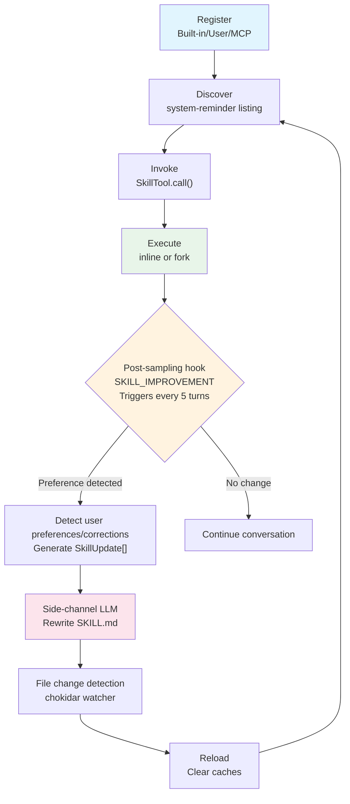

# Chapter 22: Skills System — 내장 기능에서 사용자 정의까지

## 이 장이 중요한 이유 (Why This Matters)

앞선 Chapter들에서 Claude Code의 Tool 시스템, Permission 모델, Context 관리를 분석했다. 그런데 이 모든 시스템을 관통하는 핵심 확장 레이어가 하나 있다: **Skill 시스템**이다.

사용자가 `/batch migrate from react to vue`를 입력할 때, Claude Code는 "명령어"를 실행하는 게 아니다 — 세심하게 만들어진 Prompt 템플릿을 불러와 Context window에 주입하고, 모델이 미리 정의된 워크플로우에 따라 동작하게 만드는 것이다. Skill 시스템의 본질은 **호출 가능한 Prompt 템플릿**이다 — 반복적으로 검증된 모범 사례(best practice)를 Markdown 파일로 인코딩하여, `Skill` Tool을 통해 대화 흐름에 주입한다.

이 설계 철학은 심오한 엔지니어링적 함의를 가진다: Skill은 코드 로직이 아니라 **구조화된 지식**이다. Skill 파일은 어떤 Tool이 필요한지, 어떤 모델을 사용할지, 어떤 실행 Context에서 돌아갈지를 정의할 수 있지만, 그 핵심은 언제나 Markdown 텍스트 한 조각 — LLM이 해석하고 실행하는 텍스트다.

이 Chapter는 내장 Skill에서 출발하여 등록, 발견, 로딩, 실행, 개선 메커니즘을 순차적으로 밝혀나간다.

---

## 22.1 Skill의 본질: Command 타입과 등록 (The Nature of Skills: Command Types and Registration)

### BundledSkillDefinition 구조

모든 Skill은 궁극적으로 `Command` 객체로 표현된다. 내장 Skill은 `registerBundledSkill` 함수를 통해 등록되며, 정의 타입은 다음과 같다:

```typescript
// skills/bundledSkills.ts:15-41
export type BundledSkillDefinition = {
  name: string
  description: string
  aliases?: string[]
  whenToUse?: string
  argumentHint?: string
  allowedTools?: string[]
  model?: string
  disableModelInvocation?: boolean
  userInvocable?: boolean
  isEnabled?: () => boolean
  hooks?: HooksSettings
  context?: 'inline' | 'fork'
  agent?: string
  files?: Record<string, string>
  getPromptForCommand: (
    args: string,
    context: ToolUseContext,
  ) => Promise<ContentBlockParam[]>
}
```

이 타입은 Skill의 몇 가지 핵심 차원을 드러낸다:

| 필드 | 목적 | 대표적인 값 |
|------|------|------------|
| `name` | Skill 호출 이름, `/name` 문법에 대응 | `"batch"`, `"simplify"` |
| `whenToUse` | 모델에게 **언제** 이 Skill을 자발적으로 호출할지 알려줌 | system-reminder에 나타남 |
| `allowedTools` | Skill 실행 중 자동 승인되는 Tool 목록 | `['Read', 'Grep', 'Glob']` |
| `context` | 실행 Context — `inline`은 메인 대화에 주입, `fork`는 서브에이전트에서 실행 | `'fork'` |
| `disableModelInvocation` | 모델의 자발적 호출 방지, 사용자 명시적 입력만 허용 | `true` (batch) |
| `files` | Skill에 번들된 참조 파일, 최초 호출 시 디스크에 추출 | verify Skill의 유효성 검사 스크립트 |
| `getPromptForCommand` | **핵심**: Context에 주입될 Prompt 내용 생성 | `ContentBlockParam[]` 반환 |

등록 흐름 자체는 단순하다 — `registerBundledSkill`은 정의를 표준 `Command` 객체로 변환하여 내부 배열에 push한다:

```typescript
// skills/bundledSkills.ts:53-100
export function registerBundledSkill(definition: BundledSkillDefinition): void {
  const { files } = definition
  let skillRoot: string | undefined
  let getPromptForCommand = definition.getPromptForCommand

  if (files && Object.keys(files).length > 0) {
    skillRoot = getBundledSkillExtractDir(definition.name)
    let extractionPromise: Promise<string | null> | undefined
    const inner = definition.getPromptForCommand
    getPromptForCommand = async (args, ctx) => {
      extractionPromise ??= extractBundledSkillFiles(definition.name, files)
      const extractedDir = await extractionPromise
      const blocks = await inner(args, ctx)
      if (extractedDir === null) return blocks
      return prependBaseDir(blocks, extractedDir)
    }
  }

  const command: Command = {
    type: 'prompt',
    name: definition.name,
    // ... field mapping ...
    source: 'bundled',
    loadedFrom: 'bundled',
    getPromptForCommand,
  }
  bundledSkills.push(command)
}
```

67번째 줄의 `extractionPromise ??= ...` 패턴에 주목하라 — 이것은 "memoized Promise"다. 여러 동시 호출자가 동시에 최초 호출을 트리거하면, 이들 모두 **동일한 Promise**를 기다리게 되어 중복 파일 쓰기를 유발하는 race condition을 방지한다.

### 파일 추출 안전 장치

내장 Skill 참조 파일 추출은 보안에 민감한 파일 시스템 작업을 포함한다. 소스 코드는 `safeWriteFile`에서 `O_NOFOLLOW | O_EXCL` 플래그 조합(176-184번째 줄)을 0o600 권한과 함께 사용한다. 주석이 위협 모델(threat model)을 명시적으로 설명한다:

```typescript
// skills/bundledSkills.ts:169-175
// The per-process nonce in getBundledSkillsRoot() is the primary defense
// against pre-created symlinks/dirs. Explicit 0o700/0o600 modes keep the
// nonce subtree owner-only even on umask=0, so an attacker who learns the
// nonce via inotify on the predictable parent still can't write into it.
```

이것은 전형적인 **defense in depth(심층 방어)** 설계다 — per-process nonce가 주요 방어선이고, `O_NOFOLLOW`와 `O_EXCL`은 보조 방어선이다.

---

## 22.2 내장 Skill 목록 (Built-In Skills Inventory)

모든 내장 Skill은 `skills/bundled/index.ts`의 `initBundledSkills` 함수에 등록된다. 소스 분석에 따르면, 내장 Skill은 두 범주로 구분된다: **무조건 등록**과 **Feature Flag에 의한 등록**.

### 표 22-1: 내장 Skill 목록

| Skill 이름 | 등록 조건 | 기능 요약 | 실행 모드 | 사용자 호출 가능 |
|------------|----------|----------|----------|----------------|
| `update-config` | 무조건 | settings.json을 통해 Claude Code 설정 | inline | 예 |
| `keybindings` | 무조건 | 키보드 단축키 커스터마이징 | inline | 예 |
| `verify` | `USER_TYPE === 'ant'` | 앱 실행을 통해 코드 변경 사항 검증 | inline | 예 |
| `debug` | 무조건 | 디버그 로그 활성화 및 문제 진단 | inline | 예 (모델 호출 비활성화) |
| `lorem-ipsum` | 무조건 | 개발/테스트용 플레이스홀더 | inline | 예 |
| `skillify` | `USER_TYPE === 'ant'` | 현재 세션을 재사용 가능한 Skill로 포착 | inline | 예 (모델 호출 비활성화) |
| `remember` | `USER_TYPE === 'ant'` | Agent 메모리 레이어 검토 및 정리 | inline | 예 |
| `simplify` | 무조건 | 변경된 코드의 품질 및 효율성 검토 | inline | 예 |
| `batch` | 무조건 | 대규모 변경을 위한 병렬 worktree 에이전트 | inline | 예 (모델 호출 비활성화) |
| `stuck` | `USER_TYPE === 'ant'` | 멈추거나 느린 Claude Code 세션 진단 | inline | 예 |
| `dream` | `KAIROS \|\| KAIROS_DREAM` | autoDream 메모리 통합 | inline | 예 |
| `hunter` | `REVIEW_ARTIFACT` | 아티팩트(artifact) 검토 | inline | 예 |
| `loop` | `AGENT_TRIGGERS` | 타이머 기반 루프 Prompt 실행 | inline | 예 |
| `schedule` | `AGENT_TRIGGERS_REMOTE` | 원격 타이머 기반 Agent 트리거 생성 | inline | 예 |
| `claude-api` | `BUILDING_CLAUDE_APPS` | Claude API를 사용하여 앱 빌드 | inline | 예 |
| `claude-in-chrome` | `shouldAutoEnableClaudeInChrome()` | Chrome 브라우저 통합 | inline | 예 |
| `run-skill-generator` | `RUN_SKILL_GENERATOR` | Skill 생성기 | inline | 예 |

**표 22-1: 내장 Skill 등록 조건 목록**

Feature Flag로 제한된 Skill은 ESM의 `import()` 대신 `require()` 동적 임포트를 사용한다. 소스에는 36-38번째 줄에 eslint-disable 주석이 있다 — 이는 Bun의 빌드 타임 tree-shaking이 정적 분석에 의존하기 때문이다. `feature()` 호출은 Bun이 컴파일 타임에 boolean 상수로 평가하여, 일치하지 않는 빌드 구성에서는 전체 `require()` 분기를 완전히 제거한다.

### 대표 Skill 해부: batch

`batch` Skill(`skills/bundled/batch.ts`)은 Skill이 어떻게 동작하는지 이해하기 위한 훌륭한 예시다. 그 Prompt 템플릿은 세 단계 워크플로우를 정의한다:

1. **조사 및 계획 단계**: Plan Mode에 진입하여, 포그라운드 서브에이전트를 실행해 코드베이스를 조사하고 5-30개의 독립적인 작업 단위로 분해
2. **병렬 실행 단계**: 각 작업 단위마다 백그라운드 `worktree`-격리 에이전트 실행
3. **진행 추적 단계**: 상태 테이블 유지 및 PR 링크 집계

```typescript
// skills/bundled/batch.ts:9-10
const MIN_AGENTS = 5
const MAX_AGENTS = 30
```

핵심 엔지니어링적 결정은 `disableModelInvocation: true`(109번째 줄)다 — batch Skill은 **오직** 사용자가 `/batch`를 명시적으로 입력해야만 트리거된다. 모델이 자율적으로 대규모 병렬 리팩터링을 시작하기로 결정할 수 없다. 이것은 합리적인 안전 경계다 — batch 작업은 수많은 worktree와 PR을 생성하므로, 자율 트리거는 위험도가 너무 높다.

### 대표 Skill 해부: simplify

`simplify` Skill은 또 다른 일반적인 패턴을 보여준다 — `AgentTool`을 통해 **세 개의 병렬 검토 에이전트**를 실행한다:

1. **코드 재사용 검토**: 기존 유틸리티 함수를 검색하여 중복 구현 표시
2. **코드 품질 검토**: 중복 상태, 파라미터 비대화, copy-paste, 불필요한 주석 감지
3. **효율성 검토**: 과도한 연산, 누락된 동시성(concurrency), hot path 비대화, 메모리 누수 감지

이 세 에이전트가 병렬로 실행되고 결과를 집계하여 통합 수정에 사용한다 — Skill Prompt 자체가 "인간 코드 리뷰 모범 사례" 지식을 인코딩한다.

### 대표 Skill 해부: skillify (세션-투-Skill 증류기)

`skillify`는 시스템에서 가장 "메타(meta)"적인 Skill이다 — 그 역할은 **현재 세션에서 반복 가능한 워크플로우를 새 Skill 파일로 추출**하는 것이다. 소스는 `skills/bundled/skillify.ts`에 위치한다.

**제한 조건**: `USER_TYPE === 'ant'`(159번째 줄), Anthropic 내부 사용자에게만 제공. `disableModelInvocation: true`(177번째 줄), `/skillify`를 통한 수동 트리거만 가능.

```typescript
// skills/bundled/skillify.ts:158-162
export function registerSkillifySkill(): void {
  if (process.env.USER_TYPE !== 'ant') {
    return
  }
  // ...
}
```

**데이터 소스**: skillify의 Prompt 템플릿(22-156번째 줄)은 런타임에 두 Context를 동적으로 주입한다:

1. **세션 메모리 요약**: 현재 세션의 구조화된 요약을 위한 `getSessionMemoryContent()` 호출 (Chapter 24 세션 메모리 섹션 참조)
2. **사용자 메시지 추출**: `extractUserMessages()`를 통해 compact 경계 이후의 모든 사용자 메시지 추출

```typescript
// skills/bundled/skillify.ts:179-194
async getPromptForCommand(args, context) {
  const sessionMemory =
    (await getSessionMemoryContent()) ?? 'No session memory available.'
  const userMessages = extractUserMessages(
    getMessagesAfterCompactBoundary(context.messages),
  )
  // ...
}
```

**4라운드 인터뷰 구조**: skillify의 Prompt는 구조화된 4라운드 인터뷰를 정의하며, 모두 `AskUserQuestion` Tool(일반 텍스트 출력이 아님)을 통해 진행하여 사용자가 명확한 선택지를 갖도록 한다:

| 라운드 | 목표 | 핵심 결정 사항 |
|--------|------|--------------|
| 1라운드 | 고수준 확인 | Skill 이름, 설명, 목표 및 성공 기준 |
| 2라운드 | 세부 사항 보완 | 단계 목록, 파라미터 정의, inline vs fork, 저장 위치 |
| 3라운드 | 단계별 정제 | 단계별 성공 기준, 결과물, 인간 체크포인트, 병렬화 기회 |
| 4라운드 | 최종 확인 | 트리거 조건, 트리거 구문, 엣지 케이스(edge case) |

Prompt는 특히 "사용자가 당신을 교정한 부분에 주의를 기울여라"(`Pay special attention to places where the user corrected you during the session`)를 강조한다 — 이러한 교정에는 가장 가치 있는 암묵적 지식이 담겨 있으며, Skill의 하드 룰로 인코딩되어야 한다.

**생성되는 SKILL.md 형식**: skillify가 생성하는 Skill은 표준 frontmatter 형식을 따르며 몇 가지 핵심 어노테이션(annotation) 관례를 갖는다:
- 각 단계에는 **반드시** `Success criteria`가 포함되어야 함
- 병렬화 가능한 단계는 하위 번호(3a, 3b)를 사용
- 사용자 액션이 필요한 단계는 `[human]`으로 표시
- `allowed-tools`는 최소 권한 모드 사용 (예: `Bash` 대신 `Bash(gh:*)`)

skillify와 SKILL_IMPROVEMENT(22.8절)는 상호 보완적이다: skillify는 처음부터 Skill을 생성하고, SKILL_IMPROVEMENT는 사용 중 지속적으로 개선한다. 함께 완전한 "생성 -> 개선" 생명주기 루프를 형성한다.

---

## 22.3 사용자 정의 Skill: loadSkillsDir.ts의 발견과 로딩 (User-Defined Skills: Discovery and Loading in loadSkillsDir.ts)

### Skill 파일 구조

사용자 정의 Skill은 디렉터리 형식을 따른다:

```
.claude/skills/
  my-skill/
    SKILL.md        ← 메인 파일 (frontmatter + Markdown 본문)
    reference.ts    ← 선택적 참조 파일
```

`SKILL.md` 파일은 YAML frontmatter를 사용하여 메타데이터를 선언한다:

```yaml
---
description: My custom skill
when_to_use: When the user asks for X
allowed-tools: Read, Grep, Bash
context: fork
model: opus
effort: high
arguments: [target, scope]
paths: src/components/**
---

# Skill prompt content here...
```

### 4계층 로딩 우선순위

`getSkillDirCommands` 함수(`loadSkillsDir.ts:638`)는 4개 소스에서 병렬로 Skill을 로드하며, 우선순위는 높은 것부터 낮은 순서다:

```typescript
// skills/loadSkillsDir.ts:679-713
const [
  managedSkills,      // 1. 정책 관리 Skill (엔터프라이즈 배포)
  userSkills,         // 2. 사용자 전역 Skill (~/.claude/skills/)
  projectSkillsNested,// 3. 프로젝트 Skill (.claude/skills/)
  additionalSkillsNested, // 4. --add-dir 추가 디렉터리
  legacyCommands,     // 5. 레거시 /commands/ 디렉터리 (deprecated)
] = await Promise.all([
  loadSkillsFromSkillsDir(managedSkillsDir, 'policySettings'),
  loadSkillsFromSkillsDir(userSkillsDir, 'userSettings'),
  // ... project and additional directories ...
  loadSkillsFromCommandsDir(cwd),
])
```

각 소스는 독립적인 스위치로 제어된다:

| 소스 | 스위치 조건 | 디렉터리 경로 |
|------|------------|-------------|
| 정책 관리 | `!CLAUDE_CODE_DISABLE_POLICY_SKILLS` | `<managed>/.claude/skills/` |
| 사용자 전역 | `isSettingSourceEnabled('userSettings') && !skillsLocked` | `~/.claude/skills/` |
| 프로젝트 로컬 | `isSettingSourceEnabled('projectSettings') && !skillsLocked` | `.claude/skills/` (상위 디렉터리로 탐색) |
| --add-dir | 동일 | `<dir>/.claude/skills/` |
| 레거시 commands | `!skillsLocked` | `.claude/commands/` |

**표 22-2: Skill 로딩 소스 및 스위치 조건**

`skillsLocked` 플래그는 `isRestrictedToPluginOnly('skills')`에서 온다 — 엔터프라이즈 정책이 플러그인 전용 Skill로 제한할 때, 모든 로컬 Skill 로딩이 건너뛰어진다.

### Frontmatter 파싱

`parseSkillFrontmatterFields` 함수(185-265번째 줄)는 모든 Skill 소스의 공유 파싱 진입점이다. 처리하는 필드는 다음과 같다:

```typescript
// skills/loadSkillsDir.ts:185-206
export function parseSkillFrontmatterFields(
  frontmatter: FrontmatterData,
  markdownContent: string,
  resolvedName: string,
): {
  displayName: string | undefined
  description: string
  allowedTools: string[]
  argumentHint: string | undefined
  whenToUse: string | undefined
  model: ReturnType<typeof parseUserSpecifiedModel> | undefined
  disableModelInvocation: boolean
  hooks: HooksSettings | undefined
  executionContext: 'fork' | undefined
  agent: string | undefined
  effort: EffortValue | undefined
  shell: FrontmatterShell | undefined
  // ...
}
```

주목할 것은 `effort` 필드(228-235번째 줄)다 — Skill은 전역 설정을 재정의하는 자체 "effort 수준"을 지정할 수 있다. 유효하지 않은 effort 값은 debug 로그와 함께 조용히 무시되며, 이는 관대한 파싱 원칙을 따른다.

### Prompt 실행 시 변수 치환

`createSkillCommand`의 `getPromptForCommand` 메서드(344-399번째 줄)는 Skill이 호출될 때 다음 처리 체인을 수행한다:

```
Raw Markdown
    │
    ▼
"Base directory" 접두사 추가 (baseDir가 있는 경우)
    │
    ▼
인수 치환 ($1, $2 또는 명명된 인수)
    │
    ▼
${CLAUDE_SKILL_DIR} → Skill 디렉터리 경로
    │
    ▼
${CLAUDE_SESSION_ID} → 현재 세션 ID
    │
    ▼
Shell 명령어 실행 (!`command` 문법, MCP Skill은 이 단계 건너뜀)
    │
    ▼
ContentBlockParam[] 반환
```

**그림 22-1: Skill Prompt 변수 치환 흐름**

보안 경계는 374번째 줄에서 명시적이다:

```typescript
// skills/loadSkillsDir.ts:372-376
// Security: MCP skills are remote and untrusted — never execute inline
// shell commands (!`…` / ```! … ```) from their markdown body.
if (loadedFrom !== 'mcp') {
  finalContent = await executeShellCommandsInPrompt(...)
}
```

MCP에서 온 Skill은 **신뢰할 수 없는** 것으로 취급된다 — Markdown에서 `!command` 문법이 실행되지 않는다. 이것은 원격 Prompt injection이 임의 명령어 실행으로 이어지는 것을 방어하는 핵심 수단이다.

### 중복 제거 메커니즘

로딩 후, 심볼릭 링크는 `realpath`를 통해 해석되어 중복을 탐지한다:

```typescript
// skills/loadSkillsDir.ts:728-734
const fileIds = await Promise.all(
  allSkillsWithPaths.map(({ skill, filePath }) =>
    skill.type === 'prompt'
      ? getFileIdentity(filePath)
      : Promise.resolve(null),
  ),
)
```

소스 주석(107-117번째 줄)은 inode 대신 `realpath`를 사용하는 이유를 구체적으로 설명한다 — 일부 가상 파일 시스템, 컨테이너 환경, 또는 NFS 마운트는 신뢰할 수 없는 inode 값을 보고한다 (예: inode 0 또는 ExFAT에서의 정밀도 손실).

---

## 22.4 조건부 Skill: Path 필터링과 동적 활성화 (Conditional Skills: Path Filtering and Dynamic Activation)

### paths Frontmatter

Skill은 `paths` frontmatter를 통해 사용자가 특정 경로의 파일을 작업할 때만 활성화되도록 선언할 수 있다:

```yaml
---
paths: src/components/**, src/hooks/**
---
```

`getSkillDirCommands`(771-790번째 줄)에서, `paths`가 있는 Skill은 즉시 Skill 목록에 나타나지 않는다:

```typescript
// skills/loadSkillsDir.ts:771-790
const unconditionalSkills: Command[] = []
const newConditionalSkills: Command[] = []
for (const skill of deduplicatedSkills) {
  if (
    skill.type === 'prompt' &&
    skill.paths &&
    skill.paths.length > 0 &&
    !activatedConditionalSkillNames.has(skill.name)
  ) {
    newConditionalSkills.push(skill)
  } else {
    unconditionalSkills.push(skill)
  }
}
for (const skill of newConditionalSkills) {
  conditionalSkills.set(skill.name, skill)
}
```

조건부 Skill은 `conditionalSkills` Map에 저장되어 **파일 작업 트리거 활성화**를 기다린다. 사용자가 Read/Write/Edit Tool을 통해 경로와 일치하는 파일을 작업하면, `activateConditionalSkillsForPaths` 함수(1001-1033번째 줄)가 `ignore` 라이브러리를 사용하여 gitignore 스타일의 경로 매칭을 수행하고, 매칭된 Skill을 대기 중인 Map에서 활성 집합으로 이동시킨다:

```typescript
// skills/loadSkillsDir.ts:1007-1033
for (const [name, skill] of conditionalSkills) {
  // ... path matching logic ...
  conditionalSkills.delete(name)
  activatedConditionalSkillNames.add(name)
}
```

일단 활성화되면, Skill 이름은 `activatedConditionalSkillNames`에 기록된다 — 이 Set은 캐시가 지워져도 **초기화되지 않는다** (`clearSkillCaches`는 로딩 캐시만 지우고 활성화 상태는 유지함). 이로써 "파일에 한 번 접근하면 해당 세션 전체에서 Skill이 유지된다"는 의미론(semantics)이 보장된다.

### 동적 디렉터리 발견

조건부 Skill 외에도, `discoverSkillDirsForPaths` 함수(861-915번째 줄)는 **하위 디렉터리 수준의 Skill 발견**을 구현한다. 사용자가 깊이 중첩된 파일을 작업할 때, 시스템은 해당 파일의 디렉터리에서 cwd까지 상위 디렉터리를 탐색하며 각 수준에서 `.claude/skills/` 디렉터리가 존재하는지 확인한다. 이를 통해 모노레포(monorepo)의 각 패키지가 자체 Skill 세트를 가질 수 있다.

발견 과정에는 두 가지 안전 검사가 있다:
1. **gitignore 검사**: `node_modules/pkg/.claude/skills/`와 같은 경로는 건너뜀
2. **중복 제거 검사**: 이미 확인된 경로는 `dynamicSkillDirs` Set에 기록되어 존재하지 않는 디렉터리에 대한 반복적인 `stat()` 호출을 방지

---

## 22.5 MCP Skill 브리징: mcpSkillBuilders.ts (MCP Skill Bridging: mcpSkillBuilders.ts)

### 순환 의존성 문제

MCP Skill(MCP 서버 연결을 통해 주입된 Skill)은 고전적인 엔지니어링 문제에 직면한다: 순환 의존성. MCP Skill을 로드하려면 `loadSkillsDir.ts`의 `createSkillCommand`와 `parseSkillFrontmatterFields` 함수가 필요하지만, `loadSkillsDir.ts`의 임포트 체인은 결국 MCP 클라이언트 코드에 도달하여 사이클을 형성한다.

`mcpSkillBuilders.ts`는 **일회성 등록 패턴**을 통해 이 사이클을 끊는다:

```typescript
// skills/mcpSkillBuilders.ts:26-44
export type MCPSkillBuilders = {
  createSkillCommand: typeof createSkillCommand
  parseSkillFrontmatterFields: typeof parseSkillFrontmatterFields
}

let builders: MCPSkillBuilders | null = null

export function registerMCPSkillBuilders(b: MCPSkillBuilders): void {
  builders = b
}

export function getMCPSkillBuilders(): MCPSkillBuilders {
  if (!builders) {
    throw new Error(
      'MCP skill builders not registered — loadSkillsDir.ts has not been evaluated yet',
    )
  }
  return builders
}
```

소스 주석(9-23번째 줄)은 동적 `import()`를 사용할 수 없는 이유를 상세히 설명한다 — Bun의 bunfs 가상 파일 시스템이 모듈 경로 해석 실패를 유발하며, 리터럴 동적 임포트는 bunfs에서 작동하더라도 dependency-cruiser가 새로운 사이클 위반을 감지하게 만든다.

등록은 `loadSkillsDir.ts`의 모듈 초기화 중에 발생한다 — `commands.ts`의 정적 임포트 체인을 통해 이 코드는 MCP 서버가 연결을 확립하기 훨씬 이전인 시작 초기에 실행된다.

---

## 22.6 Skill 검색: EXPERIMENTAL_SKILL_SEARCH (Skill Search: EXPERIMENTAL_SKILL_SEARCH)

### 원격 Skill 발견

`SkillTool.ts` 108-116번째 줄에서, `EXPERIMENTAL_SKILL_SEARCH` 플래그가 원격 Skill 검색 모듈의 로딩을 제어한다:

```typescript
// tools/SkillTool/SkillTool.ts:108-116
const remoteSkillModules = feature('EXPERIMENTAL_SKILL_SEARCH')
  ? {
      ...(require('../../services/skillSearch/remoteSkillState.js') as ...),
      ...(require('../../services/skillSearch/remoteSkillLoader.js') as ...),
      ...(require('../../services/skillSearch/telemetry.js') as ...),
      ...(require('../../services/skillSearch/featureCheck.js') as ...),
    }
  : null
```

원격 Skill은 `_canonical_<slug>` 명명 접두사를 사용한다 — `validateInput`(378-396번째 줄)에서 이러한 Skill은 로컬 Command 레지스트리를 우회하여 직접 조회된다:

```typescript
// tools/SkillTool/SkillTool.ts:381-395
const slug = remoteSkillModules!.stripCanonicalPrefix(normalizedCommandName)
if (slug !== null) {
  const meta = remoteSkillModules!.getDiscoveredRemoteSkill(slug)
  if (!meta) {
    return {
      result: false,
      message: `Remote skill ${slug} was not discovered in this session.`,
      errorCode: 6,
    }
  }
  return { result: true }
}
```

원격 Skill은 AKI/GCS에서 SKILL.md 내용을 로드하며(로컬 캐싱 포함), 실행 중 Shell 명령어 치환이나 인수 보간(interpolation)을 수행하지 **않는다** — 선언적이고 순수한 Markdown으로 취급된다.

Permission 수준에서, 원격 Skill은 자동 승인을 받는다(488-504번째 줄). 하지만 이 승인은 deny 규칙 검사 **이후**에 배치된다 — 사용자가 설정한 `Skill(_canonical_:*) deny` 규칙은 여전히 효력을 갖는다.

---

## 22.7 Skill 예산 제약: 1% Context Window와 3단계 잘라내기 (Skill Budget Constraints: 1% Context Window and Three-Level Truncation)

### 예산 계산

Context window에서 Skill 목록이 차지하는 공간은 엄격하게 제어된다. 핵심 상수는 `tools/SkillTool/prompt.ts`에 정의된다:

```typescript
// tools/SkillTool/prompt.ts:21-29
export const SKILL_BUDGET_CONTEXT_PERCENT = 0.01  // Context window의 1%
export const CHARS_PER_TOKEN = 4
export const DEFAULT_CHAR_BUDGET = 8_000  // 폴백(fallback): 200k의 1% × 4
export const MAX_LISTING_DESC_CHARS = 250  // 항목당 하드 상한선
```

예산 공식: `contextWindowTokens x 4 x 0.01`. 200K Token Context window라면 8,000자 — 약 40개 Skill의 이름과 설명이 들어간다.

### 3단계 잘라내기 폭포

Skill 목록이 예산을 초과하면, `formatCommandsWithinBudget` 함수(70-171번째 줄)가 3단계 잘라내기 폭포를 실행한다:

```
┌──────────────────────────────────────────────┐
│          1단계: 전체 설명                      │
│   "- batch: Research and plan a large-scale   │
│    change, then execute it in parallel..."    │
│                                               │
│   전체 크기 ≤ 예산 → 출력                      │
└─────────────────────┬────────────────────────┘
                      │ 초과
                      ▼
┌──────────────────────────────────────────────┐
│          2단계: 잘라낸 설명                    │
│   내장 Skill은 전체 설명 유지 (절대 잘라내지 않음)│
│   비내장 설명은 maxDescLen으로 잘라냄           │
│   maxDescLen = (남은 예산 - 이름 오버헤드)       │
│   / Skill 수                                  │
│                                               │
│   maxDescLen ≥ 20 → 출력                      │
└─────────────────────┬────────────────────────┘
                      │ maxDescLen < 20
                      ▼
┌──────────────────────────────────────────────┐
│          3단계: 이름만                         │
│   내장 Skill은 전체 설명 유지                   │
│   비내장 Skill은 이름만 표시                    │
│   "- my-custom-skill"                         │
└──────────────────────────────────────────────┘
```

**그림 22-2: 3단계 잘라내기 폭포 전략**

이 설계의 핵심 통찰은 **내장 Skill은 절대 잘라내지 않는다**(93-99번째 줄)는 것이다. 내장 Skill은 검증된 핵심 기능이며 — 그 `whenToUse` 설명은 모델의 매칭 결정에 핵심적이다. 사용자 정의 Skill은 잘라내져도 호출 시 `SkillTool`의 전체 로딩 메커니즘을 통해 상세 내용에 접근할 수 있다 — 목록은 **발견**을 위한 것이지 **실행**을 위한 것이 아니다.

각 Skill 항목은 `MAX_LISTING_DESC_CHARS = 250` 하드 상한선도 적용받는다 — 1단계 모드에서도 지나치게 긴 `whenToUse` 문자열은 250자로 잘라낸다. 소스 주석은 다음과 같이 설명한다:

> The listing is for discovery only -- the Skill tool loads full content on invoke, so verbose whenToUse strings waste turn-1 cache_creation tokens without improving match rate.

---

## 22.8 Skill 생명주기: 등록부터 개선까지 (Skill Lifecycle: From Registration to Improvement)

### 완전한 생명주기 흐름



**그림 22-3: 완전한 Skill 생명주기 흐름**

### 1단계: 등록

- **내장 Skill**: `initBundledSkills()`가 시작 시 동기적으로 등록
- **사용자 Skill**: `getSkillDirCommands()`가 `memoize`를 통해 첫 번째 로드 결과를 캐싱
- **MCP Skill**: MCP 서버 연결 후 `getMCPSkillBuilders()`를 통해 등록

### 2단계: 발견

Skill은 모델이 두 가지 메커니즘을 통해 발견한다:
1. **system-reminder 목록**: 로드된 모든 Skill의 이름과 설명이 `<system-reminder>` 태그에 주입됨
2. **Skill Tool 설명**: `SkillTool.prompt`에 호출 지침 포함

### 3단계: 호출 및 실행

`SkillTool.call` 메서드(580-841번째 줄)가 호출 로직을 처리하며, 핵심 분기는 622번째 줄에 있다:

```typescript
// tools/SkillTool/SkillTool.ts:621-632
if (command?.type === 'prompt' && command.context === 'fork') {
  return executeForkedSkill(...)
}
// ... inline execution path ...
```

- **inline 모드**: Skill Prompt가 메인 대화의 메시지 스트림에 주입됨. 모델이 동일한 Context에서 실행
- **fork 모드**: 격리된 Context에서 서브에이전트를 실행. 완료 시 결과 요약 반환

inline 모드는 `contextModifier`를 통해 Tool 승인 및 모델 재정의 주입을 구현한다 — 전역 상태를 수정하지 않고 `getAppState()` 함수를 체인 래핑한다.

### 4단계: 개선 (SKILL_IMPROVEMENT)

`skillImprovement.ts`는 Skill 실행 중 사용자 선호도와 교정을 자동으로 감지하는 post-sampling Hook을 구현한다. 이 기능은 이중 게이팅(double gating)으로 보호된다:

```typescript
// utils/hooks/skillImprovement.ts:176-181
export function initSkillImprovement(): void {
  if (
    feature('SKILL_IMPROVEMENT') &&
    getFeatureValue_CACHED_MAY_BE_STALE('tengu_copper_panda', false)
  ) {
    registerPostSamplingHook(createSkillImprovementHook())
  }
}
```

`feature('SKILL_IMPROVEMENT')`는 빌드 타임 게이팅(`ant` 빌드만 이 코드를 포함), `tengu_copper_panda`는 런타임 GrowthBook 플래그다. 이중 게이팅은 내부 빌드에서도 이 기능을 원격으로 비활성화할 수 있음을 의미한다.

**트리거 조건**: 현재 세션에서 **프로젝트 수준 Skill**(`projectSettings:` 접두사)이 호출된 경우에만 실행된다(`findProjectSkill()` 검사). 매 사용자 메시지 5번마다 분석을 트리거한다(`TURN_BATCH_SIZE = 5`):

```typescript
// utils/hooks/skillImprovement.ts:84-87
const userCount = count(context.messages, m => m.type === 'user')
if (userCount - lastAnalyzedCount < TURN_BATCH_SIZE) {
  return false
}
```

**감지 Prompt**: 분석기는 세 가지 유형의 신호를 찾는다 — 단계 추가/수정/삭제 요청("X도 물어봐 줄 수 있나요"), 선호도 표현("캐주얼한 톤을 사용해"), 교정("아니요, 대신 X를 해줘"). 일회성 대화와 이미 Skill에 있는 동작은 명시적으로 무시한다.

**2단계 처리**:

1. **감지 단계**: 최근 대화 단편(전체 기록이 아닌 마지막 확인 이후의 새 메시지만)을 소형 빠른 모델(`getSmallFastModel()`)에 전송하여 `SkillUpdate[]` 배열을 출력하고 AppState에 저장
2. **적용 단계**: `applySkillImprovement`(188번째 줄 이후)가 **독립적인 사이드 채널 LLM 호출**을 통해 `.claude/skills/<name>/SKILL.md`를 재작성. 결정론적 출력을 위해 `temperatureOverride: 0`을 사용하며 "frontmatter를 그대로 보존하고, 명시적으로 교체하지 않는 한 기존 내용을 삭제하지 말라"고 명시적으로 지시

전체 과정은 fire-and-forget 방식으로, 메인 대화를 블록하지 않는다. 재작성으로 인한 파일 변경은 5단계의 파일 와처가 감지하여 핫 리로드를 트리거한다.

**skillify와의 보완 관계**: skillify(22.2절)는 처음부터 Skill을 생성한다 — 워크플로우를 완료한 후 사용자가 `/skillify`를 수동으로 호출하면 4라운드 인터뷰를 통해 SKILL.md가 생성된다. SKILL_IMPROVEMENT는 사용 중 지속적으로 개선한다 — 각 Skill 실행마다 자동으로 선호도 변화를 감지하고 정의를 업데이트한다. 함께 "생성 -> 개선" 생명주기 루프를 형성한다.

### 5단계: 변경 감지 및 리로드

`skillChangeDetector.ts`는 chokidar 파일 와처를 사용하여 Skill 파일 변경을 감지한다:

```typescript
// utils/skills/skillChangeDetector.ts:27-28
const FILE_STABILITY_THRESHOLD_MS = 1000
const FILE_STABILITY_POLL_INTERVAL_MS = 500
```

변경이 감지되면:
1. 1초 파일 안정성 임계값 대기
2. 300ms 디바운스(debounce) 윈도우 내 다중 변경 이벤트 집계
3. Skill 캐시 및 Command 캐시 초기화
4. `skillsChanged` 시그널을 통해 모든 구독자에게 알림

특히 주목할 것은 62번째 줄의 플랫폼 적응이다:

```typescript
// utils/skills/skillChangeDetector.ts:62
const USE_POLLING = typeof Bun !== 'undefined'
```

Bun의 네이티브 `fs.watch()`는 `PathWatcherManager` 교착 상태(deadlock) 문제가 있다(oven-sh/bun#27469) — 파일 와치 스레드가 이벤트를 전달하는 중 와처를 닫으면 두 스레드 모두 `__ulock_wait2`에서 영원히 대기하게 된다. 소스는 임시 해결책으로 stat() 폴링을 선택하고, 업스트림 수정 후 제거 계획을 어노테이션으로 남겼다.

---

## 22.9 Skill Tool Permission 모델 (Skill Tool Permission Model)

### 자동 승인 조건

모든 Skill 호출이 사용자 확인을 요구하는 것은 아니다. `SkillTool.checkPermissions`(529-538번째 줄)에서, `skillHasOnlySafeProperties` 조건을 만족하는 Skill은 자동 승인된다:

```typescript
// tools/SkillTool/SkillTool.ts:875-908
const SAFE_SKILL_PROPERTIES = new Set([
  'type', 'progressMessage', 'contentLength', 'model', 'effort',
  'source', 'name', 'description', 'isEnabled', 'isHidden',
  'aliases', 'argumentHint', 'whenToUse', 'paths', 'version',
  'disableModelInvocation', 'userInvocable', 'loadedFrom',
  // ...
])
```

이것은 **허용 목록(allowlist) 패턴**이다 — 허용 목록에 올라온 속성만 선언한 Skill만 자동 승인된다. 미래에 `PromptCommand` 타입에 새로운 속성이 추가되면, 허용 목록에 명시적으로 추가하기 전까지는 **Permission 필요** 상태가 기본값이다. `allowedTools`, `hooks` 등 민감한 필드를 포함한 Skill은 사용자 확인 다이얼로그를 트리거한다.

### Permission 규칙 매칭

Permission 검사는 정확한 매칭과 접두사 와일드카드를 지원한다:

```typescript
// tools/SkillTool/SkillTool.ts:451-467
const ruleMatches = (ruleContent: string): boolean => {
  const normalizedRule = ruleContent.startsWith('/')
    ? ruleContent.substring(1)
    : ruleContent
  if (normalizedRule === commandName) return true
  if (normalizedRule.endsWith(':*')) {
    const prefix = normalizedRule.slice(0, -2)
    return commandName.startsWith(prefix)
  }
  return false
}
```

이는 사용자가 `Skill(review:*) allow`를 설정하여 `review`로 시작하는 모든 Skill을 한 번에 승인할 수 있음을 의미한다.

---

## 패턴 증류 (Pattern Distillation)

Skill 시스템 설계에서 추출한 재사용 가능한 패턴들:

**패턴 1: Memoized Promise 패턴**
- **해결하는 문제**: 여러 동시 호출자가 동시에 최초 초기화를 트리거할 때의 race condition
- **패턴**: `extractionPromise ??= extractBundledSkillFiles(...)` — `??=`를 사용하여 단 하나의 Promise만 생성되도록 보장하고, 모든 호출자가 동일한 결과를 기다림
- **전제 조건**: 초기화 작업이 멱등(idempotent)이며 결과를 재사용 가능

**패턴 2: 허용 목록(Allowlist) 보안 모델**
- **해결하는 문제**: 새 속성은 기본적으로 안전하지 않음 — 알 수 없는 속성은 Permission 필요
- **패턴**: `SAFE_SKILL_PROPERTIES` 허용 목록에는 알려진 안전한 필드만 포함. 새 필드는 자동으로 "Permission 필요" 경로로 진입
- **전제 조건**: 속성 집합이 시간이 지남에 따라 성장하며, 안전성은 보수적인 기본값이 필요

**패턴 3: 계층적 신뢰 및 기능 저하**
- **해결하는 문제**: 서로 다른 소스의 확장 기능이 서로 다른 신뢰 수준을 가짐
- **패턴**: 내장 Skill(절대 잘라내지 않음) > 사용자 로컬 Skill(잘라낼 수 있음, Shell 실행 가능) > MCP 원격 Skill(Shell 금지, 자동 승인은 deny 규칙에 종속)
- **전제 조건**: 시스템이 여러 신뢰 도메인에서 입력을 받음

**패턴 4: 예산 인식 점진적 저하**
- **해결하는 문제**: 제한된 자원(Context window) 하에서 가변적인 수의 항목 표시
- **패턴**: 3단계 잘라내기 폭포(전체 설명 -> 잘라낸 설명 -> 이름만), 고우선순위 항목은 절대 잘라내지 않음
- **전제 조건**: 항목 수가 예측 불가능하며, 자원 예산은 고정

---

## 사용자가 할 수 있는 것 (What Users Can Do)

**커스텀 Skill을 만들고 사용하여 생산성을 높여라:**

1. **나만의 Skill을 만들어라.** `.claude/skills/my-skill/SKILL.md`에 Markdown 파일을 작성하고, YAML frontmatter로 메타데이터(설명, 허용 Tool, 실행 Context 등)를 선언한 후, `/my-skill`을 통하거나 모델의 자동 호출로 사용하라.

2. **`paths` frontmatter를 사용하여 조건부 활성화를 구현하라.** Skill이 특정 디렉터리에서 작업할 때만 필요하다면(예: `paths: src/components/**`), 모든 대화에 나타나지 않고 매칭 파일을 작업할 때 자동으로 활성화된다 — 소중한 Context window 공간을 절약한다.

3. **`/skillify`를 사용하여 세션을 Skill로 포착하라.** 대화에서 효과적인 워크플로우를 확립했다면, `/skillify`가 이를 자동으로 재사용 가능한 Skill 파일로 변환할 수 있다.

4. **1% 예산 제한을 이해하라.** Skill 목록은 Context window의 1%(약 8000자)만 차지한다. 초과하면 잘라내기가 트리거된다. `whenToUse` 설명을 간결하게 유지하면 제한된 예산 내에서 더 많은 Skill을 표시하는 데 도움이 된다.

5. **Permission 접두사 와일드카드를 사용하라.** `Skill(my-prefix:*) allow`를 설정하면 `my-prefix`로 시작하는 모든 Skill을 한 번에 승인하여 확인 다이얼로그 인터럽트를 줄일 수 있다.

6. **MCP Skill 보안 제한을 숙지하라.** 원격 MCP Skill의 Shell 명령어 문법(`!command`)은 실행되지 않는다 — 이것은 원격 Prompt injection에 대한 보안 방어다. Skill이 Shell 명령어를 실행해야 한다면, 로컬 Skill을 사용하라.

---

## 22.10 요약 (Summary)

Skill 시스템은 **모범 사례 지식**을 실행 가능한 워크플로우로 인코딩하는 Claude Code의 핵심 메커니즘이다. 그 설계는 몇 가지 핵심 원칙을 따른다:

1. **코드로서의 Prompt**: Skill은 전통적인 플러그인 API가 아니다 — LLM이 해석하고 실행하는 Markdown 텍스트다. 이것은 Skill을 만들고 반복하는 장벽을 극도로 낮춘다.

2. **계층적 신뢰**: 내장 Skill은 절대 잘라내지 않고, MCP Skill은 Shell 실행을 금지하며, 원격 Skill은 자동 승인되지만 deny 규칙에 종속된다 — 각 소스는 서로 다른 신뢰 수준을 갖는다.

3. **자기 개선**: `SKILL_IMPROVEMENT` 메커니즘은 사용 중 사용자 피드백을 기반으로 Skill이 자동으로 진화할 수 있게 한다 — "사용으로부터 학습"하는 닫힌 루프다.

4. **예산 인식**: 1% Context window 하드 예산과 3단계 잘라내기 폭포는 Skill 발견이 실제 작업의 Context 공간을 빼앗지 않도록 보장한다.

다음 Chapter에서는 소스 코드에 있는 89개 Feature Flag 뒤의 미출시 기능 파이프라인을 통해 시스템의 발전 방향을 살펴보는 또 다른 각도에서 Claude Code의 확장성을 살펴본다.

---

## 버전 진화: v2.1.91 변경 사항 (Version Evolution: v2.1.91 Changes)

> 다음 분석은 v2.1.91 번들 신호 비교에 기반한다.

v2.1.91은 `tengu_bridge_client_presence_enabled` 이벤트와 `CLAUDE_CODE_DISABLE_CLAUDE_API_SKILL` 환경 변수를 추가했다. 전자는 IDE 브리징 프로토콜에 클라이언트 존재 감지 기능이 추가되었음을 나타내고, 후자는 내장 Claude API Skill을 비활성화하는 런타임 스위치를 제공한다 — 엔터프라이즈 컴플라이언스 시나리오에서 특정 Skill 가용성을 제한하는 데 사용될 수 있다.
