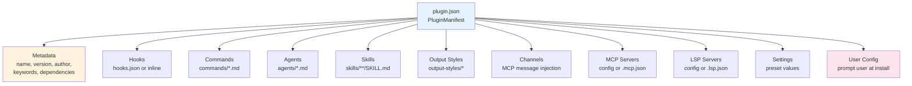
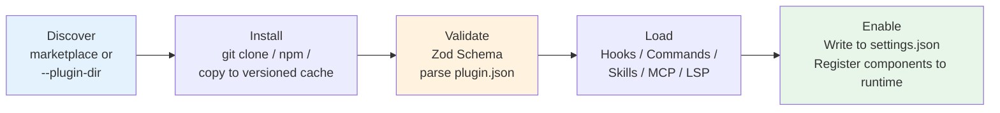
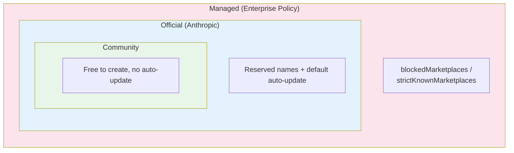

# Chapter 22b: Plugin System — 패키징에서 마켓플레이스까지의 Extension Engineering

> **위치**: 이 Chapter는 Claude Code의 Plugin system을 분석한다 — extension 아키텍처의 최상위 컨테이너로, 패키징과 배포에서 마켓플레이스까지의 완전한 engineering을 다룬다. 사전 요건: Chapter 22. 대상 독자: CC 플러그인의 패키징부터 마켓플레이스까지 extension engineering을 이해하고 싶은 독자.

## 왜 중요한가

Chapter 22는 skill system을 분석했다 — Claude Code가 Markdown 파일을 모델이 실행 가능한 명령으로 변환하는 방법을. 그러나 skill은 Claude Code의 extension 메커니즘에서 빙산의 일각에 불과하다. 하나의 skill 세트, 여러 Hook, 몇 개의 MCP 서버, 그리고 사용자 정의 명령 모음을 배포 가능한 제품으로 패키징하고 싶을 때, 필요한 것은 skill system이 아니라 **plugin system**이다.

Plugin은 Claude Code extension 아키텍처의 최상위 컨테이너다. 이는 "어떻게 capability를 정의하는가"가 아니라 더 어려운 일련의 질문에 답한다: **어떻게 capability를 발견하는가? 어떻게 신뢰하는가? 어떻게 설치하고, 업데이트하고, 제거하는가? 어떻게 수천 명의 사용자가 서로 간섭하지 않고 같은 플러그인을 사용하게 하는가?**

이 질문들의 engineering 복잡성은 skill 자체를 훨씬 능가한다. Claude Code는 plugin manifest 형식을 정의하기 위해 거의 1,700줄의 Zod Schema를 사용하고, 로딩 실패를 처리하기 위해 25개의 discriminated union 오류 타입을 사용하며, 서로 다른 plugin 버전을 격리하기 위한 버전 관리 캐싱을, 그리고 민감한 설정을 분리하기 위한 보안 저장소를 사용한다. 이 인프라는 클로즈드 소스 AI Agent 제품에 오픈 소스 생태계와 유사한 extension 기능을 부여한다 — 이것이 이 Chapter에서 분석할 핵심 설계다.

Chapter 22가 "plugin 내부에 무엇이 있는가"를 분석했다면, 이 Chapter는 "plugin 컨테이너 자체가 어떻게 설계되어 있는가"를 분석한다.

## 소스 코드 분석

### 22b.1 Plugin Manifest: 거의 1,700줄의 Zod Schema 설계

플러그인에 관한 모든 것은 `plugin.json`에서 시작된다 — 플러그인의 메타데이터와 제공하는 모든 컴포넌트를 정의하는 JSON manifest 파일. 이 manifest의 유효성 검사 Schema는 1,681줄(`schemas.ts`)에 달하며, Claude Code에서 가장 큰 단일 Schema 정의다.

manifest의 최상위 구조는 11개의 하위 Schema로 구성된다:

```typescript
// restored-src/src/utils/plugins/schemas.ts:884-898
export const PluginManifestSchema = lazySchema(() =>
  z.object({
    ...PluginManifestMetadataSchema().shape,
    ...PluginManifestHooksSchema().partial().shape,
    ...PluginManifestCommandsSchema().partial().shape,
    ...PluginManifestAgentsSchema().partial().shape,
    ...PluginManifestSkillsSchema().partial().shape,
    ...PluginManifestOutputStylesSchema().partial().shape,
    ...PluginManifestChannelsSchema().partial().shape,
    ...PluginManifestMcpServerSchema().partial().shape,
    ...PluginManifestLspServerSchema().partial().shape,
    ...PluginManifestSettingsSchema().partial().shape,
    ...PluginManifestUserConfigSchema().partial().shape,
  }),
)
```

`MetadataSchema`를 제외한 나머지 10개의 하위 Schema는 모두 `.partial()`을 사용한다 — 즉, 플러그인은 어떤 부분 집합이든 제공할 수 있다. Hook만 제공하는 플러그인과 완전한 toolchain을 제공하는 플러그인이 같은 manifest 형식을 공유하며, 다른 필드만 채운다.



이 설계에서 주목할 만한 세 가지가 있다.

**첫째, path 보안 유효성 검사.** manifest의 모든 파일 경로는 `./`로 시작해야 하며 `..`를 포함할 수 없다. 이는 플러그인이 path traversal(경로 순회)을 통해 호스트 시스템의 다른 파일에 접근하는 것을 방지한다.

**둘째, 마켓플레이스 이름 예약.** manifest 유효성 검사는 마켓플레이스 이름에 여러 필터링 레이어를 적용한다:

```typescript
// restored-src/src/utils/plugins/schemas.ts:19-28
export const ALLOWED_OFFICIAL_MARKETPLACE_NAMES = new Set([
  'claude-code-marketplace',
  'claude-code-plugins',
  'claude-plugins-official',
  'anthropic-marketplace',
  'anthropic-plugins',
  'agent-skills',
  'life-sciences',
  'knowledge-work-plugins',
])
```

유효성 검사 체인에는 다음이 포함된다: 공백 금지, 경로 구분자 금지, 공식 이름 사칭 금지, 예약된 이름 `inline`(`--plugin-dir` 세션 플러그인용) 또는 `builtin`(내장 플러그인용) 금지. 모든 유효성 검사는 `MarketplaceNameSchema`(216-245줄)에서 완료되며, Zod의 `.refine()` 체인 표현식을 사용한다.

**셋째, command를 인라인으로 정의할 수 있다.** 파일에서 로딩하는 것 외에도, command는 `CommandMetadataSchema`를 통해 인라인으로 포함될 수도 있다:

```typescript
// restored-src/src/utils/plugins/schemas.ts:385-416
export const CommandMetadataSchema = lazySchema(() =>
  z.object({
      source: RelativeCommandPath().optional(),
      content: z.string().optional(),
      description: z.string().optional(),
      argumentHint: z.string().optional(),
      // ...
  }),
)
```

`source`(파일 경로)와 `content`(인라인 Markdown)는 상호 배타적이다. 이를 통해 작은 플러그인은 추가적인 Markdown 파일을 만들지 않고도 `plugin.json`에 직접 command 내용을 포함할 수 있다.

### 22b.2 Lifecycle: 발견에서 컴포넌트 로딩까지 5단계

플러그인은 디스크의 파일에서 Claude Code가 사용하기까지 5단계를 거친다:



**발견(discovery) 단계**에는 두 가지 소스가 있다(우선순위 순):

```typescript
// restored-src/src/utils/plugins/pluginLoader.ts:1-33
// Plugin Discovery Sources (in order of precedence):
// 1. Marketplace-based plugins (plugin@marketplace format in settings)
// 2. Session-only plugins (from --plugin-dir CLI flag or SDK plugins option)
```

**설치 단계**의 핵심 설계는 **버전 관리 캐싱**이다. 각 플러그인은 원래 위치에서 실행되지 않고 `~/.claude/plugins/cache/{marketplace}/{plugin}/{version}/`에 복사된다. 이를 통해 보장되는 것: 같은 플러그인의 서로 다른 버전이 간섭하지 않음; 제거는 캐시 디렉토리 삭제만으로 충분; 오프라인 시나리오에서도 캐시에서 부팅 가능.

**로딩 단계**는 `memoize`를 사용하여 각 컴포넌트가 한 번만 로딩되도록 한다. `getPluginCommands()`와 `getPluginSkills()`는 모두 memoized async factory 함수다. 이는 Agent 성능에 중요하다 — Hook은 모든 tool 호출 시 실행될 수 있으며, 매번 Markdown 파일을 재파싱하면 latency가 누적된다.

컴포넌트 로딩 우선순위도 주목할 만하다. `loadAllCommands()`에서 등록 순서는:

1. 번들된 skill (빌드 시 컴파일됨)
2. 내장 플러그인 skill (내장 플러그인이 제공하는 skill)
3. Skill 디렉토리 command (사용자 로컬 `~/.claude/skills/`)
4. Workflow command
5. **Plugin command** (마켓플레이스에서 설치된 플러그인의 command)
6. Plugin skill
7. 내장 command

이 순서는 다음을 의미한다: 사용자 로컬 custom skill이 같은 이름의 플러그인 command보다 우선순위를 갖는다 — 사용자 커스터마이징은 플러그인에 의해 절대 재정의되지 않는다.

### 22b.3 Trust Model: 계층적 신뢰와 사전 설치 감사

플러그인 시스템은 Agent에 고유한 신뢰 과제에 직면한다: 플러그인은 단순히 수동적인 UI 확장이 아니다 — Hook을 통해 tool 실행 전후에 command를 주입하고, MCP 서버를 통해 새로운 Tool을 제공하며, skill을 통해 모델 동작에 영향을 미칠 수도 있다.

Claude Code의 대응은 **계층적 신뢰(layered trust)**다.

**첫 번째 레이어: 지속적인 보안 경고.** 플러그인 관리 인터페이스에서 `PluginTrustWarning` 컴포넌트는 항상 표시된다:

```typescript
// restored-src/src/commands/plugin/PluginTrustWarning.tsx:1-31
// "Make sure you trust a plugin before installing, updating, or using it"
```

이것은 일회성 팝업 확인이 아니라, `/plugin` 관리 인터페이스에서 **지속적으로 표시**되는 경고다. 사용자는 플러그인 관리 인터페이스에 들어갈 때마다 이를 본다 — "설치 시 한 번 확인하고 다시는 언급하지 않는" 방식보다 안전하지만, 모든 작업 시 팝업을 띄우는 것만큼 방해가 되지 않는다.

**두 번째 레이어: 프로젝트 레벨 신뢰.** `TrustDialog` 컴포넌트는 프로젝트 디렉토리에 대한 보안 감사를 수행하며, MCP 서버, Hook, bash 권한, API key helper, 위험한 환경 변수 등을 검사한다. 신뢰 상태는 프로젝트 설정의 `hasTrustDialogAccepted` 필드에 저장되며, 디렉토리 계층 구조 위로 검색한다 — 부모 디렉토리가 신뢰된 경우 자식 디렉토리는 신뢰를 상속한다.

**세 번째 레이어: 민감한 값 격리.** `sensitive: true`로 표시된 플러그인 옵션은 `settings.json`이 아닌 보안 저장소(macOS에서는 keychain, 다른 플랫폼에서는 `.credentials.json`)에 저장된다:

```typescript
// restored-src/src/utils/plugins/pluginOptionsStorage.ts:1-13
// Storage splits by `sensitive`:
//   - `sensitive: true`  → secureStorage (keychain on macOS, .credentials.json elsewhere)
//   - everything else    → settings.json `pluginConfigs[pluginId].options`
```

로드 시 두 소스가 병합되며, 보안 저장소가 우선순위를 갖는다:

```typescript
// restored-src/src/utils/plugins/pluginOptionsStorage.ts:56-77
export const loadPluginOptions = memoize(
  (pluginId: string): PluginOptionValues => {
    // ...
    // secureStorage wins on collision — schema determines destination so
    // collision shouldn't happen, but if a user hand-edits settings.json we
    // trust the more secure source.
    return { ...nonSensitive, ...sensitive }
  },
)
```

소스 코드 주석은 실용적인 고려 사항을 드러낸다: `memoize`는 단순한 성능 최적화가 아니라 보안상 필수다 — 각 keychain 읽기는 `security find-generic-password` subprocess(약 50-100ms)를 트리거하며, Hook이 모든 tool 호출 시 실행된다면 memoize하지 않을 경우 눈에 띄는 latency가 발생한다.

### 22b.4 Marketplace System: 발견, 설치, 의존성 해결

Plugin Marketplace는 설치 가능한 플러그인 세트를 기술하는 JSON manifest다. 마켓플레이스 소스는 9가지 타입을 지원한다:

```typescript
// restored-src/src/utils/plugins/schemas.ts:906-907
export const MarketplaceSourceSchema = lazySchema(() =>
  z.discriminatedUnion('source', [
    // url, github, git, npm, file, directory, hostPattern, pathPattern, settings
  ]),
)
```

이 타입들은 직접 URL부터 GitHub 저장소, npm 패키지, 로컬 디렉토리까지 거의 모든 배포 방식을 커버한다. `hostPattern`과 `pathPattern`은 사용자의 hostname이나 프로젝트 경로에 기반하여 마켓플레이스를 자동으로 추천하는 것도 지원한다 — 엔터프라이즈 배포 시나리오를 위해 설계된 기능이다.

마켓플레이스 로딩은 **graceful degradation(점진적 성능 저하)**을 사용한다:

```typescript
// restored-src/src/utils/plugins/marketplaceHelpers.ts
loadMarketplacesWithGracefulDegradation() // Single marketplace failure doesn't affect others
```

함수 이름 자체가 설계 선언이다: 다중 소스 시스템에서 단일 소스의 실패가 전체 시스템을 사용 불가능하게 만들어서는 안 된다.

**의존성 해결(dependency resolution)**은 또 다른 중요한 메커니즘이다. 플러그인은 manifest에 의존성을 선언할 수 있다:

```typescript
// restored-src/src/utils/plugins/schemas.ts:313-318
dependencies: z
  .array(DependencyRefSchema())
  .optional()
  .describe(
    'Plugins that must be enabled for this plugin to function. Bare names (no "@marketplace") are resolved against the declaring plugin\'s own marketplace.',
  ),
```

Bare name(예: `my-dep`)은 선언 플러그인의 마켓플레이스로 자동 해결된다 — 같은 마켓플레이스의 의존성을 강제할 때 중복된 마켓플레이스 이름 작성을 피할 수 있다.

**설치 범위(installation scope)**는 4단계로 나뉜다:

| 범위 | 저장 위치 | 가시성 | 일반적 사용 |
|------|-----------|--------|-------------|
| `user` | `~/.claude/plugins/` | 모든 프로젝트 | 개인 공통 도구 |
| `project` | `.claude/plugins/` | 모든 프로젝트 협업자 | 팀 표준 도구 |
| `local` | `.claude-code.json` | 현재 세션 | 임시 테스트 |
| `managed` | `managed-settings.json` | 정책 제어 | 엔터프라이즈 통합 관리 |

이 네 가지 범위의 설계는 Git의 설정 계층(system -> global -> local)과 유사하지만, 엔터프라이즈 정책 제어를 위한 `managed` 레이어가 추가되어 있다.

### 22b.5 Error Governance: 타입 안전 처리를 갖춘 25개 오류 변형

대부분의 플러그인 시스템은 문자열 매칭으로 오류를 처리한다 — "오류 메시지에 'not found'가 포함되어 있으면". Claude Code는 훨씬 엄격한 방식을 사용한다: **discriminated union**.

```typescript
// restored-src/src/types/plugin.ts:101-283
export type PluginError =
  | { type: 'path-not-found'; source: string; plugin?: string; path: string; component: PluginComponent }
  | { type: 'git-auth-failed'; source: string; plugin?: string; gitUrl: string; authType: 'ssh' | 'https' }
  | { type: 'git-timeout'; source: string; plugin?: string; gitUrl: string; operation: 'clone' | 'pull' }
  | { type: 'network-error'; source: string; plugin?: string; url: string; details?: string }
  | { type: 'manifest-parse-error'; source: string; plugin?: string; manifestPath: string; parseError: string }
  | { type: 'manifest-validation-error'; source: string; plugin?: string; manifestPath: string; validationErrors: string[] }
  // ... 16개 이상의 추가 변형
  | { type: 'marketplace-blocked-by-policy'; source: string; marketplace: string; blockedByBlocklist?: boolean; allowedSources: string[] }
  | { type: 'dependency-unsatisfied'; source: string; plugin: string; dependency: string; reason: 'not-enabled' | 'not-found' }
  | { type: 'generic-error'; source: string; plugin?: string; error: string }
```

25개의 고유한 오류 타입(26개의 union 변형, `lsp-config-invalid`가 두 번 등장), 각각 해당 오류에 특화된 context 필드를 갖는다. `git-auth-failed`는 `authType`(ssh 또는 https)을 갖고, `marketplace-blocked-by-policy`는 `allowedSources`(허용된 소스 목록)을 갖고, `dependency-unsatisfied`는 `reason`(활성화되지 않음 또는 찾을 수 없음)을 갖는다.

소스 코드 주석은 점진적 전략도 드러낸다:

```typescript
// restored-src/src/types/plugin.ts:86-99
// IMPLEMENTATION STATUS:
// Currently used in production (2 types):
// - generic-error: Used for various plugin loading failures
// - plugin-not-found: Used when plugin not found in marketplace
//
// Planned for future use (10 types - see TODOs in pluginLoader.ts):
// These unused types support UI formatting and provide a clear roadmap for
// improving error specificity.
```

완전한 타입을 먼저 정의하고, 그 다음 점진적으로 구현한다 — 이것이 "type-first(타입 우선)" 진화 전략이다. 22개의 오류 타입을 정의한다고 해서 즉시 모두 구현할 필요는 없지만, 일단 정의되면 새로운 오류 처리 코드는 새 문자열 케이스를 계속 추가하는 대신 명확한 대상 타입을 갖게 된다.

### 22b.6 Auto-Update와 Recommendations: 세 가지 추천 소스

플러그인 시스템의 "pull"(사용자 능동적 설치)과 "push"(시스템 추천 설치) 모두 완전한 설계를 갖추고 있다.

**Auto-update**는 공식 마켓플레이스에만 기본적으로 활성화되지만, 일부는 제외된다:

```typescript
// restored-src/src/utils/plugins/schemas.ts:35
const NO_AUTO_UPDATE_OFFICIAL_MARKETPLACES = new Set(['knowledge-work-plugins'])
```

업데이트 완료 후, 사용자는 알림 시스템을 통해 `/reload-plugins`를 실행하여 새로고침하도록 알림을 받는다(Chapter 18의 Hook system 참조). 여기에 우아한 race condition 처리가 있다: 업데이트가 REPL이 마운트되기 전에 완료될 수 있으므로, 알림은 `pendingNotification` 큐 버퍼를 사용한다.

**추천 시스템**에는 세 가지 소스가 있다:

1. **Claude Code Hint**: 외부 도구(예: SDK)가 stderr로 `<claude-code-hint />` 태그를 출력하면, CC가 이를 파싱하여 해당 플러그인을 추천한다.
2. **LSP 감지**: 특정 확장자를 가진 파일을 편집할 때, 시스템에 해당 LSP 바이너리가 있지만 관련 플러그인이 설치되지 않은 경우 자동 추천이 발생한다.
3. **커스텀 추천**: `usePluginRecommendationBase`가 제공하는 범용 상태 머신을 통해.

세 소스 모두 핵심 제약을 공유한다: **각 플러그인은 세션당 최대 한 번만 추천된다**(show-once semantics). 이는 설정 파일 지속성을 통해 구현된다 — 이미 추천된 플러그인 ID가 설정 파일에 기록되어 세션 간 반복을 피한다. 추천 메뉴는 또한 30초 자동 닫기 메커니즘을 갖추며, 사용자 능동적 취소와 타임아웃 닫기를 서로 다른 analytics 이벤트로 구분한다.

### 22b.7 Command Migration Pattern: Built-In에서 Plugin으로의 점진적 진화

Claude Code는 내장 command를 점진적으로 플러그인으로 마이그레이션하고 있다. `createMovedToPluginCommand` factory 함수는 이 진화 전략을 드러낸다:

```typescript
// restored-src/src/commands/createMovedToPluginCommand.ts:22-65
export function createMovedToPluginCommand({
  name, description, progressMessage,
  pluginName, pluginCommand,
  getPromptWhileMarketplaceIsPrivate,
}: Options): Command {
  return {
    type: 'prompt',
    // ...
    async getPromptForCommand(args, context) {
      if (process.env.USER_TYPE === 'ant') {
        return [{ type: 'text', text: `This command has been moved to a plugin...` }]
      }
      return getPromptWhileMarketplaceIsPrivate(args, context)
    },
  }
}
```

이 함수는 실용적인 문제를 해결한다: **마켓플레이스가 아직 공개되지 않은 상황에서 command를 어떻게 마이그레이션하는가?** 답은 사용자 타입으로 분기하는 것이다 — 내부 사용자(`USER_TYPE === 'ant'`)는 플러그인 설치 안내를 보고, 외부 사용자는 기존 인라인 prompt를 본다. 마켓플레이스가 공개되면 `getPromptWhileMarketplaceIsPrivate` 파라미터와 분기 로직을 제거할 수 있다.

이미 마이그레이션된 command로는 `pr-comments`(PR 댓글 가져오기)와 `security-review`(보안 감사)가 있다. 마이그레이션 후 command는 `pluginName:commandName` 형식으로 명명되어 namespace 격리를 유지한다.

이 패턴의 더 깊은 의미: **Claude Code는 기능이 완전한 모놀리스에서 플랫폼으로 진화하고 있다**. 내장 command가 플러그인이 된다는 것은 이 기능들이 전체 프로젝트를 포크하지 않고도 커뮤니티에 의해 교체되고, 확장되고, 재조합될 수 있음을 의미한다.

### 22b.8 Plugin의 Agent 설계 철학적 의의

더 높은 관점으로 돌아가 보자. AI Agent는 왜 플러그인 시스템이 필요한가?

**전통적인 소프트웨어 플러그인 시스템**(VS Code, Vim 등)은 "사용자가 에디터 동작을 커스터마이징할 수 있게 하는" 문제를 해결한다 — 본질적으로 UI와 기능 확장이다. 그러나 **AI Agent의 플러그인 시스템**은 근본적으로 다른 문제를 해결한다: **Agent capability의 런타임 조합 가능성**.

Claude Code Agent가 각 세션에서 무엇을 할 수 있는지는 어떤 Tool, skill, Hook을 로딩했는지에 달려 있다. 플러그인 시스템은 이 capability 세트를 동적으로 조정 가능하게 만든다:

1. **Capability 언로드 가능성**: 사용자는 플러그인 전체를 비활성화하여 관련 capability 그룹을 종료할 수 있다. 이것은 전통적인 "기능 끄기"가 아니다 — 런타임에 Agent가 전체 인지적 및 행동적 capability 차원을 잃게 하는 것이다.

2. **Capability 소스 다각화**: Agent capability는 더 이상 한 조직의 개발팀에서만 오지 않고, 마켓플레이스의 여러 제공자로부터 온다. `createMovedToPluginCommand`의 존재가 이 방향을 증명한다 — Anthropic 자체의 내장 command조차 플러그인으로 마이그레이션되고 있다.

3. **capability 경계에 대한 사용자 제어**: 4단계 설치 범위(user/project/local/managed)는 서로 다른 이해관계자가 서로 다른 수준의 capability 경계를 제어할 수 있게 한다. 엔터프라이즈 관리자는 `managed` 정책으로 허용된 마켓플레이스와 플러그인을 제한하고; 프로젝트 리더는 `project` 범위로 팀 전체 설정을 하며; 개발자는 `user` 범위로 개인 선호도를 설정한다.

4. **신뢰가 capability의 전제 조건**: 전통적인 플러그인 시스템에서 신뢰 확인은 설치 시 일회성 확인이다. Agent 맥락에서 신뢰는 더 큰 비중을 갖는다 — 신뢰된 플러그인은 Hook을 통해 **모든 tool 호출 전후에** command를 실행하고(Chapter 18 참조), MCP 서버를 통해 모델에 **새로운 Tool**을 제공할 수 있다. 이것이 Claude Code의 신뢰 모델이 일회성이 아닌 계층적이고 지속적인 이유다.

이 관점에서 보면, `PluginManifest`의 11개 하위 Schema는 단지 "플러그인이 무엇을 제공할 수 있는가를 정의"하는 것이 아니다 — **Agent capability의 11가지 플러그 가능한 차원**을 정의하는 것이다.

### 22b.9 오픈 소스와 클로즈드 소스 사이의 제3의 길

Claude Code는 클로즈드 소스 상용 제품이다. 그러나 플러그인 시스템은 흥미로운 중간 지대를 만든다 — **클로즈드 코어 + 오픈 생태계**.

**마켓플레이스 이름 예약 메커니즘**(Section 22b.1)은 이 전략의 구체적인 구현을 드러낸다. 8개의 공식 예약 이름은 Anthropic의 브랜드 namespace를 보호하지만, `MarketplaceNameSchema` 유효성 검사 로직은 **의도적으로 간접적인 변형을 차단하지 않는다**:

```typescript
// restored-src/src/utils/plugins/schemas.ts:7-13
// This validation blocks direct impersonation attempts like "anthropic-official",
// "claude-marketplace", etc. Indirect variations (e.g., "my-claude-marketplace")
// are not blocked intentionally to avoid false positives on legitimate names.
```

이것은 신중하게 균형을 맞춘 설계다: 사칭을 방지하기에 충분히 엄격하지만, 커뮤니티가 "claude"라는 단어를 사용하여 자체 마켓플레이스를 구축하는 것을 억제하지 않을 만큼 유연하다.

**차별화된 auto-update 전략**도 이 포지셔닝을 반영한다. 공식 마켓플레이스는 기본적으로 auto-update가 활성화되고, 커뮤니티 마켓플레이스는 기본적으로 비활성화된다 — 이는 커뮤니티 마켓플레이스의 존재를 차단하지 않으면서 공식 마켓플레이스에 배포 이점을 제공한다.

**설치 범위의 `managed` 레이어**는 상업적 고려 사항을 더 드러낸다. 엔터프라이즈는 `managed-settings.json`(읽기 전용 정책 파일)을 통해 허용된 마켓플레이스와 플러그인을 제어할 수 있다. 이는 "내 직원들이 승인된 플러그인만 사용할 수 있어야 한다"는 엔터프라이즈 고객의 요구를 충족하면서, 승인된 범위 내에서는 extension 유연성을 유지한다.



이 세 레이어 구조는 Claude Code가 상업적인 것과 개방적인 것 사이에서 균형을 찾을 수 있게 한다:

- **Anthropic 입장**: 핵심 제품을 클로즈드 소스로 유지하며, 공식 마켓플레이스를 통해 품질과 보안을 제어한다.
- **커뮤니티 입장**: 완전한 플러그인 API와 마켓플레이스 메커니즘을 제공하여 서드파티 배포를 가능하게 한다.
- **엔터프라이즈 입장**: 정책 레이어를 통해 거버넌스 기능을 제공하여 컴플라이언스 요구사항을 충족한다.

Agent 생태계 구축자를 위한 교훈: **생태계 효과를 달성하기 위해 코어를 오픈 소스화할 필요는 없다**. extension 인터페이스를 열고, 배포 인프라(마켓플레이스)를 제공하고, 거버넌스 메커니즘(신뢰 + 정책)을 수립하면, 커뮤니티는 Agent 주변에 가치를 구축할 수 있다.

그러나 이 패턴에는 내재적 위험이 있다: **생태계는 플랫폼의 선의에 의존한다**. 플랫폼이 플러그인 API를 강화하거나, 마켓플레이스 입점을 제한하거나, 배포 규칙을 변경하면, 생태계 참여자들은 포크 대안이 없다 — 이것이 클로즈드 코어가 오픈 소스 기반 거버넌스와 비교했을 때 갖는 근본적인 단점이다. Claude Code는 현재 개방적인 manifest 형식과 다중 소스 마켓플레이스 메커니즘을 통해 이 위험을 줄이고 있지만, 장기적인 생태계 건전성은 여전히 플랫폼의 거버넌스 약속에 달려 있다.

---

## 패턴 증류 (Pattern Distillation)

### Pattern 1: Manifest as Contract (계약으로서의 Manifest)

**해결하는 문제**: extension 시스템이 런타임 오류를 유발하지 않고 서드파티 기여물을 어떻게 검증하는가?

**코드 템플릿**: Schema 유효성 검사 라이브러리(예: Zod)를 사용하여 완전한 manifest 형식을 정의하고, 각 필드에 타입, 제약, 설명을 부여한다. Manifest 유효성 검사는 로딩 단계에서 완료되며, 유효성 검사 실패는 런타임 예외가 아닌 구조화된 오류를 생성한다. 모든 파일 경로는 `./`로 시작해야 하고, `..` traversal은 허용되지 않는다.

**전제 조건**: extension 시스템이 신뢰할 수 없는 소스로부터 설정 파일을 받는다.

### Pattern 2: Type-First Evolution (타입 우선 진화)

**해결하는 문제**: 모든 오류 지점을 한 번에 리팩터링하지 않고 대규모 시스템에서 오류 처리를 점진적으로 개선하는 방법은?

**코드 템플릿**: 완전한 discriminated union 오류 타입을 먼저 정의하고(22개 타입), 몇 개의 지점에서만 사용하며(2개 타입), 나머지는 "향후 사용 계획"으로 표시한다. 새 코드는 명확한 대상 타입을 갖고, 기존 코드는 점진적으로 마이그레이션할 수 있다.

**전제 조건**: 팀이 일시적으로 사용되지 않는 타입 정의를 "데드 코드"가 아닌 "타입 로드맵"으로 허용할 의향이 있다.

### Pattern 3: Sensitive Value Shunting (민감한 값 분리)

**해결하는 문제**: 플러그인 설정에서 API key, 패스워드, 기타 민감한 값을 안전하게 저장하는 방법은?

**코드 템플릿**: Schema의 각 설정 필드를 `sensitive: true/false`로 표시한다. 저장 시 분리 — 민감한 값은 시스템 보안 저장소(예: macOS keychain)로, 비민감한 값은 일반 설정 파일로 이동한다. 읽기 시 두 소스를 병합하되 보안 저장소가 우선순위를 갖는다. 반복적인 보안 저장소 접근을 피하기 위해 `memoize` 캐싱을 사용한다.

**전제 조건**: 대상 플랫폼이 보안 저장소 API(keychain, credential manager 등)를 제공한다.

### Pattern 4: Closed Core, Open Ecosystem (클로즈드 코어, 오픈 생태계)

**해결하는 문제**: 클로즈드 소스 제품이 오픈 소스 생태계의 extension 효과를 달성하는 방법은?

**핵심 접근**: 오픈 extension manifest 형식 + 다중 소스 마켓플레이스 발견 + 계층적 정책 제어(전체 분석은 Section 22b.9 참조). 핵심 설계: 브랜드 namespace를 예약하되 커뮤니티의 브랜드 용어 사용을 제한하지 않음; 공식 마켓플레이스는 배포 이점을 갖지만 서드파티 마켓플레이스를 배제하지 않음.

**위험**: 생태계 건전성이 플랫폼의 거버넌스 약속에 달려 있으며, 포크 대안이 없다.

**전제 조건**: 제품이 이미 생태계를 매력적으로 만들 충분한 사용자 기반을 갖고 있다.

---

## 사용자가 할 수 있는 것

1. **자체 플러그인 구축**: `plugin.json`을 만들고, `commands/`, `skills/`, `hooks/`에 컴포넌트 파일을 배치하고, `claude plugin validate`로 manifest 형식을 검증한다. 최소한의 단일 Hook 플러그인으로 시작하여 점진적으로 컴포넌트를 추가한다.

2. **플러그인 신뢰 경계 설계**: 플러그인이 API key가 필요한 경우, `userConfig`에서 `sensitive: true`로 표시한다. command 문자열에 민감한 값을 하드코딩하지 말고 — `${user_config.KEY}` 템플릿 변수를 사용하여 Claude Code의 저장소 시스템이 보안을 처리하게 한다.

3. **설치 범위를 사용하여 팀 도구 관리**: 팀 표준 도구는 `project` 범위(`.claude/plugins/`)에, 개인 선호 도구는 `user` 범위에 설치한다. 이렇게 하면 `.claude/plugins/`를 Git에 커밋할 수 있고, 팀 구성원들이 자동으로 통합된 toolset을 갖게 된다.

4. **자체 Agent를 위한 플러그인 시스템 설계 시 Claude Code의 계층화를 참고**: Manifest 유효성 검사(서드파티 입력에 대한 방어) + 버전 관리 캐시(격리) + 보안 저장소 분리(민감한 값 보호) + 정책 레이어(엔터프라이즈 거버넌스). 이 네 레이어가 최소 실행 가능한 플러그인 인프라다.

5. **"command 마이그레이션" 전략 고려**: Agent에 커뮤니티 유지 관리로 계획된 내장 기능이 있다면, `createMovedToPluginCommand` 분기 패턴을 참고한다 — 내부 사용자가 먼저 마이그레이션하고 테스트하며, 외부 사용자는 기존 경험을 유지하다가, 마켓플레이스가 공개되면 일괄 전환한다.
