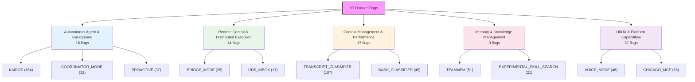
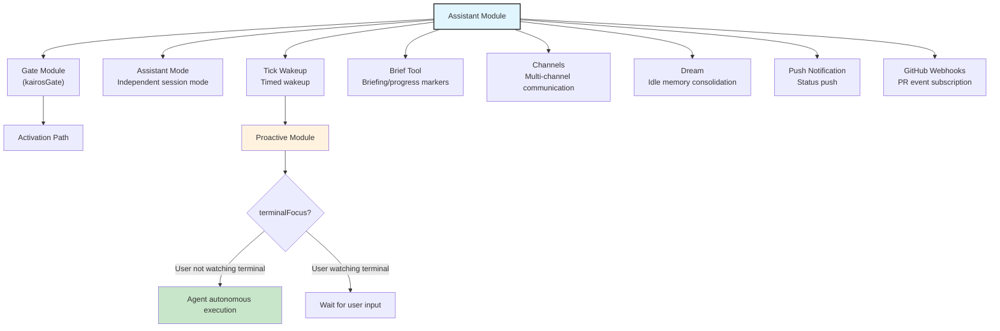
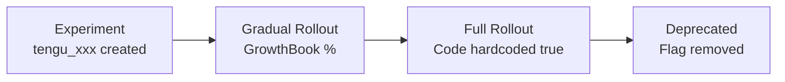

# Chapter 23: 미공개 Feature Pipeline — 89개 Feature Flag 뒤에 숨겨진 로드맵

> **위치**: 이 Chapter는 Claude Code 소스 코드에서 89개 Feature Flag로 제어되는 미공개 feature pipeline과 그 구현 깊이를 분석한다. 사전 지식 없이 독립적으로 읽을 수 있다. 대상 독자: CC가 89개 Feature Flag를 통해 미공개 feature pipeline을 어떻게 관리하는지 이해하려는 독자, 또는 자신의 제품에 feature flag 시스템을 구현하고자 하는 개발자.

## 왜 중요한가

앞선 22개 Chapter에서 우리는 Claude Code의 공개 릴리스된 기능들을 분석했다. 하지만 소스 코드에는 또 다른 차원이 숨겨져 있다: **89개의 Feature Flag가 아직 모든 사용자에게 공개되지 않은 기능들을 제어한다**. 이 Flag들은 Bun의 빌드 타임 `feature()` 함수를 통해 구현된다 — 컴파일러는 서로 다른 빌드 구성에서 `feature('FLAG_NAME')`을 `true` 또는 `false`로 평가하며, dead code elimination(죽은 코드 제거)은 비활성화된 분기를 완전히 제거한다.

이는 `feature('KAIROS')`로 제어되는 코드가 공개 빌드에는 전혀 존재하지 않음을 의미한다 — 내부 빌드(`USER_TYPE === 'ant'`)나 실험적 브랜치에서만 나타난다. 하지만 우리가 복원한 소스 코드에는 모든 Flag의 양쪽 분기가 보존되어 있어, Claude Code의 feature 진화 방향을 독특한 시각으로 살펴볼 수 있다.

이 Chapter는 89개 Flag를 기능 도메인별로 다섯 가지 주요 그룹으로 분류하고, 핵심 미공개 기능의 구현 깊이와 상호 관계를 분석한다. 강조해야 할 점은: **이 Chapter의 분석은 소스 코드에서 관찰 가능한 구현 상태를 기반으로 하며, 비즈니스 전략에 대한 추측이나 릴리스 일정을 예측하지 않는다.** Flag의 존재가 곧 기능의 임박한 릴리스를 의미하지는 않는다 — 많은 Flag가 실험적 프로토타입, A/B 테스트 구성, 또는 폐기된 탐색 방향일 수 있다.

---

## 23.1 Feature Flag 메커니즘 (Feature Flag Mechanism)

### 빌드 타임 평가 (Build-Time Evaluation)

Claude Code는 Bun의 `bun:bundle` 모듈이 제공하는 `feature()` 함수를 사용한다:

```typescript
import { feature } from 'bun:bundle'

if (feature('KAIROS')) {
  const { registerDreamSkill } = require('./dream.js')
  registerDreamSkill()
}
```

`feature()`는 빌드 타임에 리터럴 `true` 또는 `false`로 대체된다. 결과가 `false`일 때, 전체 `if` 블록은 tree-shaking 과정에서 제거된다. 이것이 제어된 코드가 `import()` 대신 `require()`를 사용하는 이유다 — `require()`는 `if` 블록 내부에 나타날 수 있는 표현식이어서, dead code elimination이 모듈 의존성과 함께 이를 제거할 수 있다.

### 참조 횟수와 성숙도 추론 (Reference Counts and Maturity Inference)

소스 코드에서 각 Flag의 참조 횟수를 세면, 구현 깊이를 대략적으로 추론할 수 있다:

| 참조 범위 | 의미 | 대표 Flag |
|-----------|------|-----------|
| 100+ | 심층 통합, 여러 핵심 서브시스템에 걸쳐 있음 | KAIROS (154), TRANSCRIPT_CLASSIFIER (107) |
| 30-99 | 기능 완성, 여러 모듈에 걸쳐 있음 | TEAMMEM (51), VOICE_MODE (46), PROACTIVE (37) |
| 10-29 | 상당히 완성됨, 특정 서브시스템 포함 | CONTEXT_COLLAPSE (20), CHICAGO_MCP (16) |
| 3-9 | 초기 구현 또는 제한된 범위 | TOKEN_BUDGET (9), WEB_BROWSER_TOOL (4) |
| 1-2 | 프로토타입/탐색 단계 또는 순수 토글 | ULTRATHINK (1), ABLATION_BASELINE (1) |

**Table 23-1: Feature Flag 참조 횟수와 성숙도 추론**

높은 참조 횟수가 반드시 "곧 릴리스"를 의미하지는 않는다 — KAIROS의 154개 참조는 오히려 장기적으로 점진적 통합이 진행 중인 복잡한 시스템임을 나타낼 수 있다.

---

## 23.2 89개 Flag 전체 분류 (All 89 Flags Categorized)

기능 도메인별로 89개 Flag는 다섯 가지 주요 카테고리로 나눌 수 있다:



### Table 23-2: 자율 Agent & 백그라운드 실행 (18)

| Flag | 참조 | 설명 |
|------|------|------|
| `KAIROS` | 154 | Assistant 모드 핵심: 백그라운드 자율 Agent, tick wakeup 메커니즘 |
| `PROACTIVE` | 37 | 자율 작업 모드: terminal focus 인식, 선제적 행동 |
| `KAIROS_BRIEF` | 39 | Brief 모드: 사용자에게 진행 메시지 전송 |
| `KAIROS_CHANNELS` | 19 | Channel 시스템: 다중 채널 통신 |
| `KAIROS_DREAM` | 1 | autoDream 메모리 통합 트리거 |
| `KAIROS_PUSH_NOTIFICATION` | 4 | Push notification: 사용자에게 상태 업데이트 전송 |
| `KAIROS_GITHUB_WEBHOOKS` | 3 | GitHub Webhook 구독: PR 이벤트 트리거 |
| `AGENT_TRIGGERS` | 11 | 타이머 트리거 (로컬 cron) |
| `AGENT_TRIGGERS_REMOTE` | 2 | 원격 타이머 트리거 (클라우드 cron) |
| `BG_SESSIONS` | 11 | 백그라운드 세션 관리 (ps/logs/attach/kill) |
| `COORDINATOR_MODE` | 32 | Coordinator 모드: 크로스 Agent 작업 조율 |
| `BUDDY` | 15 | Companion 모드: 플로팅 UI 버블 |
| `ULTRAPLAN` | 10 | Ultraplan: 구조화된 작업 분해 UI |
| `VERIFICATION_AGENT` | 4 | 검증 Agent: 작업 완료 자동 검증 |
| `BUILTIN_EXPLORE_PLAN_AGENTS` | 1 | 내장 explore/plan Agent 유형 |
| `FORK_SUBAGENT` | 4 | Subagent fork 실행 모드 |
| `MONITOR_TOOL` | 13 | Monitor tool: 백그라운드 프로세스 모니터링 |
| `TORCH` | 1 | Torch 명령어 (목적 불명) |

### Table 23-3: 원격 제어 & 분산 실행 (14)

| Flag | 참조 | 설명 |
|------|------|------|
| `BRIDGE_MODE` | 28 | Bridge 모드 핵심: 원격 제어 프로토콜 |
| `DAEMON` | 3 | Daemon 모드: 백그라운드 daemon worker |
| `SSH_REMOTE` | 4 | SSH 원격 연결 |
| `DIRECT_CONNECT` | 5 | Direct connect 모드 |
| `CCR_AUTO_CONNECT` | 3 | Claude Code Remote 자동 연결 |
| `CCR_MIRROR` | 4 | CCR mirror 모드: 읽기 전용 원격 미러 |
| `CCR_REMOTE_SETUP` | 1 | CCR 원격 설정 명령 |
| `SELF_HOSTED_RUNNER` | 1 | Self-hosted runner |
| `BYOC_ENVIRONMENT_RUNNER` | 1 | Bring-your-own-compute 환경 runner |
| `UDS_INBOX` | 17 | Unix Domain Socket inbox: 프로세스 간 통신 |
| `LODESTONE` | 6 | 프로토콜 등록 (lodestone:// 핸들러) |
| `CONNECTOR_TEXT` | 7 | Connector 텍스트 블록 처리 |
| `DOWNLOAD_USER_SETTINGS` | 5 | 클라우드에서 사용자 설정 다운로드 |
| `UPLOAD_USER_SETTINGS` | 2 | 클라우드로 사용자 설정 업로드 |

### Table 23-4: Context 관리 & 성능 (17)

| Flag | 참조 | 설명 |
|------|------|------|
| `CONTEXT_COLLAPSE` | 20 | Context collapse: 세밀한 context 관리 |
| `REACTIVE_COMPACT` | 4 | Reactive compaction: 온디맨드 compact 트리거 |
| `CACHED_MICROCOMPACT` | 12 | Cached micro-compaction 전략 |
| `COMPACTION_REMINDERS` | 1 | Compaction 리마인더 메커니즘 |
| `TOKEN_BUDGET` | 9 | Token budget 추적 UI 및 예산 제어 |
| `PROMPT_CACHE_BREAK_DETECTION` | 9 | Prompt cache break 감지 |
| `HISTORY_SNIP` | 15 | History snip 명령 |
| `BREAK_CACHE_COMMAND` | 2 | 강제 cache break 명령 |
| `ULTRATHINK` | 1 | Ultra thinking 모드 |
| `TREE_SITTER_BASH` | 3 | Tree-sitter Bash 파서 |
| `TREE_SITTER_BASH_SHADOW` | 5 | Tree-sitter Bash shadow 모드 (A/B 테스트) |
| `BASH_CLASSIFIER` | 45 | Bash 명령 분류기 |
| `TRANSCRIPT_CLASSIFIER` | 107 | Transcript 분류기 (auto 모드) |
| `STREAMLINED_OUTPUT` | 1 | Streamlined output 모드 |
| `ABLATION_BASELINE` | 1 | Ablation 실험 기준선 |
| `FILE_PERSISTENCE` | 3 | 파일 persistence 타이밍 |
| `OVERFLOW_TEST_TOOL` | 2 | Overflow 테스트 도구 |

### Table 23-5: 메모리 & 지식 관리 (9)

| Flag | 참조 | 설명 |
|------|------|------|
| `TEAMMEM` | 51 | 팀 메모리 동기화 |
| `EXTRACT_MEMORIES` | 7 | 자동 메모리 추출 |
| `AGENT_MEMORY_SNAPSHOT` | 2 | Agent 메모리 스냅샷 |
| `AWAY_SUMMARY` | 2 | Away summary: 사용자가 자리를 비울 때 진행 요약 생성 |
| `MEMORY_SHAPE_TELEMETRY` | 3 | 메모리 구조 telemetry |
| `SKILL_IMPROVEMENT` | 1 | 자동 skill 개선 (post-sampling hook) |
| `RUN_SKILL_GENERATOR` | 1 | Skill 생성기 |
| `EXPERIMENTAL_SKILL_SEARCH` | 21 | 실험적 원격 skill 검색 |
| `MCP_SKILLS` | 9 | MCP 서버 skill 발견 |

### Table 23-6: UI/UX & 플랫폼 기능 (31)

| Flag | 참조 | 설명 |
|------|------|------|
| `VOICE_MODE` | 46 | Voice 모드: 스트리밍 speech-to-text |
| `WEB_BROWSER_TOOL` | 4 | 웹 브라우저 도구 (Bun WebView) |
| `TERMINAL_PANEL` | 4 | Terminal 패널 |
| `HISTORY_PICKER` | 4 | History picker UI |
| `MESSAGE_ACTIONS` | 5 | 메시지 액션 (copy/edit 단축키) |
| `QUICK_SEARCH` | 5 | Quick search UI |
| `AUTO_THEME` | 2 | 자동 테마 전환 |
| `NATIVE_CLIPBOARD_IMAGE` | 2 | 네이티브 클립보드 이미지 지원 |
| `NATIVE_CLIENT_ATTESTATION` | 1 | 네이티브 클라이언트 attestation |
| `POWERSHELL_AUTO_MODE` | 2 | PowerShell auto 모드 |
| `CHICAGO_MCP` | 16 | Computer Use MCP 통합 |
| `MCP_RICH_OUTPUT` | 3 | MCP 리치 텍스트 출력 |
| `TEMPLATES` | 6 | 작업 템플릿/분류 |
| `WORKFLOW_SCRIPTS` | 10 | Workflow 스크립트 |
| `REVIEW_ARTIFACT` | 4 | Review artifact |
| `BUILDING_CLAUDE_APPS` | 1 | Building Claude Apps skill |
| `COMMIT_ATTRIBUTION` | 12 | Git commit attribution 추적 |
| `HOOK_PROMPTS` | 1 | Hook prompt |
| `NEW_INIT` | 2 | 새로운 초기화 플로우 |
| `HARD_FAIL` | 2 | Hard fail 모드 |
| `SHOT_STATS` | 10 | Tool 호출 통계 분포 |
| `ANTI_DISTILLATION_CC` | 1 | Anti-distillation 보호 |
| `COWORKER_TYPE_TELEMETRY` | 2 | Coworker 유형 telemetry |
| `ENHANCED_TELEMETRY_BETA` | 2 | 향상된 telemetry 베타 |
| `PERFETTO_TRACING` | 1 | Perfetto 성능 추적 |
| `SLOW_OPERATION_LOGGING` | 1 | 느린 작업 로깅 |
| `DUMP_SYSTEM_PROMPT` | 1 | System prompt 내보내기 |
| `ALLOW_TEST_VERSIONS` | 2 | 테스트 버전 허용 |
| `UNATTENDED_RETRY` | 1 | 무인 재시도 |
| `IS_LIBC_GLIBC` | 1 | glibc 런타임 감지 |
| `IS_LIBC_MUSL` | 1 | musl 런타임 감지 |

---

## 23.3 핵심 미공개 기능 심층 분석 (Deep Analysis of Core Unreleased Features)

### KAIROS: 백그라운드 자율 Assistant

KAIROS는 가장 많이 참조되는 Flag(154회)로, 코드 흔적이 거의 모든 핵심 서브시스템에 닿아 있다. 소스 분석으로부터 다음 아키텍처를 재구성할 수 있다:



**Figure 23-1: KAIROS assistant 모드 아키텍처 다이어그램**

KAIROS의 핵심 개념은 다음 코드 패턴으로부터 추론할 수 있다:

**진입점** (`main.tsx:80-81`):
```typescript
const assistantModule = feature('KAIROS')
  ? require('./assistant/index.js') as typeof import('./assistant/index.js')
  : null
const kairosGate = feature('KAIROS')
  ? require('./assistant/gate.js') as typeof import('./assistant/gate.js')
  : null
```

**Tick wakeup 메커니즘** (`REPL.tsx:2115, 2605, 2634, 2738`): KAIROS는 REPL 생명주기의 여러 지점에서 "깨어나야" 하는지 확인한다 — 메시지 처리 후, 입력 유휴 중, 그리고 terminal focus 변경 시를 포함한다. 사용자가 terminal을 떠났을 때(`!terminalFocusRef.current`), 시스템은 대기 중인 작업을 자율적으로 실행할 수 있다.

**Brief Tool 통합** (`main.tsx:2201`):
```typescript
const briefVisibility = feature('KAIROS') || feature('KAIROS_BRIEF')
  ? isBriefEnabled()
    ? 'Call SendUserMessage at checkpoints to mark where things stand.'
    : 'The user will see any text you output.'
  : 'The user will see any text you output.'
```

Brief 모드가 활성화되면, System Prompt는 모델에게 핵심 체크포인트에서 `SendUserMessage`를 사용해 진행 상황을 보고하도록 지시한다 — 모든 중간 텍스트를 출력하는 대신. 이는 백그라운드 자율 실행을 위해 설계된 통신 패턴이다.

**Team Context** (`main.tsx:3035`):
```typescript
teamContext: feature('KAIROS')
  ? assistantTeamContext ?? computeInitialTeamContext?.()
  : computeInitialTeamContext?.()
```

KAIROS는 "team context" 개념을 도입한다 — Agent가 assistant 모드로 실행될 때, 더 큰 협업 그래프 내에서 자신의 위치를 이해해야 한다.

### PROACTIVE 모드

PROACTIVE (37개 참조)는 KAIROS와 강하게 결합되어 있다 — 소스 코드에서 거의 항상 `feature('PROACTIVE') || feature('KAIROS')` 형태로 등장한다 (`REPL.tsx:194, 2115, 2605` 등). 이는 PROACTIVE가 KAIROS의 하위 기능이거나 선행 기능임을 시사한다 — 전체 KAIROS assistant 모드를 사용할 수 없을 때, PROACTIVE는 더 가벼운 "선제적 작업" 기능을 제공한다.

`REPL.tsx:2776`의 핵심 동작 차이:

```typescript
...((feature('PROACTIVE') || feature('KAIROS'))
  && proactiveModule?.isProactiveActive()
  && !terminalFocusRef.current
  ? { /* autonomous execution config */ }
  : {})
```

조건 조합 `isProactiveActive() && !terminalFocusRef.current`은 핵심 메커니즘을 드러낸다: **사용자가 terminal을 보고 있지 않고 proactive 모드가 활성화되어 있을 때, Agent는 자율 실행 권한을 얻는다**. 이는 물리적 주의 신호에 기반한 권한 상승이다 — 사용자의 terminal focus 상태가 Agent 자율성의 게이팅 조건이 된다.

### VOICE_MODE: 스트리밍 Speech-to-Text

VOICE_MODE (46개 참조)는 입력, 구성, 키 바인딩, 서비스 레이어에 걸쳐 있다:

**Voice STT 서비스** (`services/voiceStreamSTT.ts:3`):
```typescript
// Only reachable in ant builds (gated by feature('VOICE_MODE') in useVoice.ts import).
```

**키 바인딩** (`keybindings/defaultBindings.ts:96`):
```typescript
...(feature('VOICE_MODE') ? { space: 'voice:pushToTalk' } : {})
```

스페이스바는 push-to-talk으로 바인딩된다 — 표준 음성 입력 상호작용 패턴이다. Voice 통합은 `useVoiceIntegration.tsx`의 여러 Hook을 포함한다: `useVoiceEnabled`, `useVoiceState`, `useVoiceInterimTranscript`, 그리고 `startVoice`/`stopVoice`/`toggleVoice` 제어 함수들.

**구성 통합** (`tools/ConfigTool/supportedSettings.ts:144`): voice는 구성 가능한 설정으로 등록되어 `/config set voiceEnabled true`를 통해 활성화할 수 있다.

### WEB_BROWSER_TOOL: Bun WebView

WEB_BROWSER_TOOL (4개 참조)은 참조는 적지만 핵심적인 구현 흔적을 가지고 있다:

```typescript
// main.tsx:1571
const hint = feature('WEB_BROWSER_TOOL')
  && typeof Bun !== 'undefined' && 'WebView' in Bun
  ? CLAUDE_IN_CHROME_SKILL_HINT_WITH_WEBBROWSER
  : CLAUDE_IN_CHROME_SKILL_HINT
```

이는 기술 선택을 드러낸다: 웹 브라우저 도구는 Playwright나 Puppeteer 같은 외부 브라우저 자동화 도구가 아닌 **Bun의 내장 WebView**를 기반으로 한다. 런타임 감지 `typeof Bun !== 'undefined' && 'WebView' in Bun`은 이것이 Bun의 아직 안정화되지 않은 WebView API에 의존함을 나타낸다.

REPL에서 (`REPL.tsx:272, 4585`), WebBrowserTool은 자체 패널 컴포넌트 `WebBrowserPanel`을 가지며, 전체화면 모드에서 메인 대화와 나란히 표시될 수 있다.

### BRIDGE_MODE + DAEMON: 원격 제어

BRIDGE_MODE (28개 참조)와 DAEMON (3개 참조)은 원격 제어를 위한 인프라를 구성한다:

**진입점** (`entrypoints/cli.tsx:100-165`):
```typescript
if (feature('DAEMON') && args[0] === '--daemon-worker') {
  // Start daemon worker
}
if (feature('BRIDGE_MODE') && (args[0] === 'remote-control' || args[0] === 'rc'
    || args[0] === 'remote' || args[0] === 'sync' || args[0] === 'bridge')) {
  // Start remote control/bridge
}
if (feature('DAEMON') && args[0] === 'daemon') {
  // Start daemon process
}
```

DAEMON은 `--daemon-worker` 백그라운드 워커 프로세스와 `daemon` 관리 명령을 제공한다. BRIDGE_MODE는 여러 서브커맨드 별칭을 제공한다(`remote-control`, `rc`, `remote`, `sync`, `bridge`) — 이 별칭의 풍부함은 팀이 최적의 사용자 대면 이름을 여전히 탐색 중임을 시사한다.

bridge 핵심은 `bridge/bridgeEnabled.ts`에 있으며, 여러 확인 함수를 제공한다:

```typescript
// bridge/bridgeEnabled.ts:32
return feature('BRIDGE_MODE')  // isBridgeEnabled

// bridge/bridgeEnabled.ts:51
return feature('BRIDGE_MODE')  // isBridgeOutboundEnabled

// bridge/bridgeEnabled.ts:127
return feature('BRIDGE_MODE')  // isRemoteControlEnabled
```

CCR_MIRROR (4개 참조)는 BRIDGE_MODE의 하위 모드다 — 읽기 전용 미러링으로, 제어 없이 원격 관찰이 가능하다.

### TRANSCRIPT_CLASSIFIER: auto 모드

TRANSCRIPT_CLASSIFIER (107개 참조)는 두 번째로 많이 참조되는 Flag로, 새로운 권한 모드 — `auto`를 구현한다:

```typescript
// types/permissions.ts:35
...(feature('TRANSCRIPT_CLASSIFIER') ? (['auto'] as const) : ([] as const))
```

기존의 `plan`(모든 tool 호출 확인)과 `auto-accept`(모두 자동 수락) 사이에서, `auto` 모드는 **transcript 분류**에 기반한 중간 지점을 도입한다. 시스템은 분류기를 사용해 세션 내용을 분석하고 사용자 확인이 필요한지 동적으로 결정한다.

`checkAndDisableAutoModeIfNeeded` (`REPL.tsx:2772`)는 auto 모드에 안전 강등 메커니즘이 있음을 시사한다 — 분류기가 위험한 작업을 감지하면 자동으로 auto 모드를 종료하고 확인 필요 상태로 되돌아갈 수 있다.

BASH_CLASSIFIER (45개 참조)는 TRANSCRIPT_CLASSIFIER의 관련 컴포넌트로, Bash 명령 분류 및 안전성 평가를 전담한다.

### CONTEXT_COLLAPSE: 세밀한 Context 관리

CONTEXT_COLLAPSE (20개 참조)는 compact 서브시스템에 깊이 통합되어 있다:

```typescript
// services/compact/autoCompact.ts:179
if (feature('CONTEXT_COLLAPSE')) { ... }

// services/compact/autoCompact.ts:215
if (feature('CONTEXT_COLLAPSE')) { ... }
```

통합 지점으로부터, CONTEXT_COLLAPSE는 autoCompact, postCompactCleanup, sessionRestore, 그리고 query 엔진에 존재한다. `CtxInspectTool` (`tools.ts:110`)을 도입하여 모델이 context window 상태를 능동적으로 검사하고 관리할 수 있게 한다. 현재의 전체 compaction과 달리, CONTEXT_COLLAPSE는 더 세밀한 "collapse" 시맨틱을 구현할 가능성이 높다 — 일부 tool 호출 결과를 선택적으로 접으면서 다른 중요한 context는 보존한다.

REACTIVE_COMPACT (4개 참조)는 또 다른 compaction 실험이다 — 반응형 트리거로, token 임계값에 기반한 타이머 트리거 대신이다.

### TEAMMEM: 팀 메모리 동기화

TEAMMEM (51개 참조)는 크로스 세션 팀 지식 동기화를 구현한다:

```typescript
// services/teamMemorySync/watcher.ts:253
if (!feature('TEAMMEM')) { return }
```

팀 메모리 시스템은 세 가지 핵심 컴포넌트로 구성된다:
1. **watcher** (`teamMemorySync/watcher.ts`): 팀 메모리 파일 변경 감시
2. **secretGuard** (`teamMemSecretGuard.ts`): 민감한 정보가 팀 메모리로 유출되는 것을 방지
3. **memdir 통합** (`memdir/memdir.ts`): 팀 메모리 레이어를 memdir path 시스템에 통합

참조 패턴으로부터, TEAMMEM의 구현은 상당히 성숙했다 — 51개 참조가 메모리 읽기/쓰기, Prompt 구성, secret 스캔, 파일 동기화의 전체 플로우를 커버한다.

---

## 23.4 Flag 클러스터로 시스템 진화 추론 (Inferring System Evolution from Flag Clusters)

### 클러스터 1: 자율 Agent 생태계

KAIROS + PROACTIVE + KAIROS_BRIEF + KAIROS_CHANNELS + KAIROS_DREAM + KAIROS_PUSH_NOTIFICATION + KAIROS_GITHUB_WEBHOOKS + AGENT_TRIGGERS + AGENT_TRIGGERS_REMOTE + BG_SESSIONS + COORDINATOR_MODE + BUDDY + ULTRAPLAN + VERIFICATION_AGENT + MONITOR_TOOL

이것은 가장 큰 Flag 클러스터(15개+)로, 논리적 관계를 다음과 같이 재구성할 수 있다:

```
                    KAIROS (core)
                        │
          ┌─────────────┼──────────────┐
          │             │              │
     PROACTIVE      KAIROS_BRIEF   KAIROS_DREAM
   (autonomous     (briefing       (idle memory
    execution)      communication)  consolidation)
          │             │
          │        ┌────┴────┐
          │        │         │
          │   CHANNELS  PUSH_NOTIFICATION
          │   (multi-      (status
          │    channel)     push)
          │
     ┌────┴────┐
     │         │
  BG_SESSIONS  AGENT_TRIGGERS
  (background    (timed
   sessions)      triggers)
     │              │
     │         AGENT_TRIGGERS_REMOTE
     │            (remote triggers)
     │
COORDINATOR_MODE ── ULTRAPLAN
  (cross-agent      (structured
   coordination)     planning)
          │
          │
     BUDDY          VERIFICATION_AGENT
   (companion UI)    (auto-verification)
          │
     MONITOR_TOOL
    (process monitor)
```

**Figure 23-2: 자율 Agent Flag 클러스터 관계 다이어그램**

이 클러스터는 "사용자 입력에 수동적으로 응답"에서 "배경에서 지속적으로 선제적으로 작업"으로의 진화 경로를 기술한다. KAIROS는 핵심 엔진, PROACTIVE는 focus 인식 자율성, AGENT_TRIGGERS는 타이머 wakeup, BG_SESSIONS는 백그라운드 지속성, COORDINATOR_MODE는 멀티 Agent 오케스트레이션을 제공한다.

### 클러스터 2: 원격/분산 기능

BRIDGE_MODE + DAEMON + SSH_REMOTE + DIRECT_CONNECT + CCR_AUTO_CONNECT + CCR_MIRROR + CCR_REMOTE_SETUP + SELF_HOSTED_RUNNER + BYOC_ENVIRONMENT_RUNNER + LODESTONE

이 클러스터는 "사용자 머신 외부 환경에서 Claude Code 실행"을 중심으로 한다:

| 기능 레이어 | Flag | 설명 |
|------------|------|------|
| Protocol | LODESTONE | `lodestone://` 프로토콜 핸들러 등록 |
| Transport | BRIDGE_MODE, UDS_INBOX | WebSocket bridge + Unix Socket IPC |
| Connection | SSH_REMOTE, DIRECT_CONNECT | SSH와 direct connect 두 가지 접근 방법 |
| Management | CCR_AUTO_CONNECT, CCR_MIRROR | 자동 연결, 읽기 전용 mirror |
| Execution | DAEMON, SELF_HOSTED_RUNNER, BYOC | Daemon, self-hosted, BYOC runner |
| Sync | DOWNLOAD/UPLOAD_USER_SETTINGS | 클라우드 config 동기화 |

**Table 23-7: 원격/분산 기능 레이어**

### 클러스터 3: Context 인텔리전스

CONTEXT_COLLAPSE + REACTIVE_COMPACT + CACHED_MICROCOMPACT + COMPACTION_REMINDERS + TOKEN_BUDGET + PROMPT_CACHE_BREAK_DETECTION + HISTORY_SNIP

이 Flag들은 context 관리의 지속적인 최적화를 기술한다. Chapter 9-12에서 분석한 기존 compact 메커니즘과 비교하면, 이 Flag들은 차세대 context 관리를 나타낸다:
- **타이머 기반에서 반응형 compaction으로** (REACTIVE_COMPACT)
- **전체 compaction에서 선택적 collapse로** (CONTEXT_COLLAPSE)
- **수동에서 능동적 cache 관리로** (PROMPT_CACHE_BREAK_DETECTION)
- **암묵적에서 명시적 예산 제어로** (TOKEN_BUDGET)

### 클러스터 4: 보안 분류와 권한

TRANSCRIPT_CLASSIFIER + BASH_CLASSIFIER + ANTI_DISTILLATION_CC + NATIVE_CLIENT_ATTESTATION + HARD_FAIL

이 클러스터는 "더 세밀한 보안 제어"를 중심으로 한다. TRANSCRIPT_CLASSIFIER의 `auto` 모드는 중요한 방향이다 — "이진 권한"(모두 확인 또는 모두 수락)에서 "지능형 권한"(콘텐츠 분석에 기반한 동적 결정)으로의 전환을 나타낸다. ANTI_DISTILLATION_CC는 모델 출력에 대한 지식재산권 보호 메커니즘을 암시한다.

---

## 23.5 Flag 성숙도 스펙트럼 (Flag Maturity Spectrum)

```
참조수    Flag 수   성숙도 단계
━━━━━━━━━━━━━━━━━━━━━━━━━━━━━━━━━━━━━━━━━
100+       2     심층 통합       ██
 30-99     6     완전 통합       ██████
 10-29    12     모듈 통합       ████████████
  3-9     27     초기 구현       ███████████████████████████
  1-2     42     프로토타입/탐색  ██████████████████████████████████████████
```

**Figure 23-3: 89개 Flag의 성숙도 분포**

분포는 명확한 **롱테일**을 보여준다: 47%의 Flag(42개)가 참조 횟수 1-2개로, 프로토타입 또는 순수 토글 단계에 있다. 100개 이상의 심층 통합에 도달한 Flag는 단 2개뿐이다. 이는 소프트웨어 제품의 전형적인 feature 퍼널과 일치한다 — 많은 탐색적 실험 중 궁극적으로 핵심 기능이 되는 것은 소수뿐이다.

참조 횟수와 **크로스 모듈 분포** 간의 차이를 주목할 필요가 있다. KAIROS의 154개 참조는 `main.tsx`, `REPL.tsx`, `commands.ts`, `prompts.ts`, `print.ts`, `sessionStorage.ts`를 포함한 최소 15개 파일에 걸쳐 있다 — 이 광범위한 통합은 KAIROS를 활성화하면 시스템의 여러 측면을 수정해야 함을 의미한다. 반면 TEAMMEM의 51개 참조는 주로 `memdir/`, `teamMemorySync/`, `services/mcp/`에 집중되어 있다 — 이 지역화된 통합은 독립적으로 활성화하고 테스트하기 더 쉽다.

---

## 23.6 빌드 구성 추론 (Build Configuration Inference)

Flag 게이팅 패턴으로부터 최소 세 가지 빌드 구성을 추론할 수 있다:

### 공개 빌드 (Public Build)
대부분의 Flag는 `false`다. 공개적으로 활성화된 기능(기본 skill 시스템, tool chain)은 Flag 게이팅이 필요 없다 — 이것들이 소스 코드의 "기본 경로"다.

### 내부 빌드 (Internal Build, Ant Build)
`USER_TYPE === 'ant'` 확인은 여러 skill 등록 로직에 나타난다(`verify.ts:13`, `remember.ts:5`, `stuck.ts` 등). 내부 빌드는 EXPERIMENTAL_SKILL_SEARCH, SKILL_IMPROVEMENT 등 더 많은 실험적 기능을 활성화한다.

### 실험 빌드 (Experiment Build)
특정 Flag 조합은 A/B 테스트 구성을 나타낼 수 있다 — TREE_SITTER_BASH와 TREE_SITTER_BASH_SHADOW 이름 패턴은 "shadow 모드" 실험을 시사한다. ABLATION_BASELINE은 명시적으로 ablation 실험 기준선 구성을 식별한다.

---

## 23.7 미공개 기능 간 의존성 (Dependencies Between Unreleased Features)

일부 Flag는 코드의 `&&` 조합으로부터 추론 가능한 암묵적 의존성을 가진다:

```typescript
// commands.ts:77
feature('DAEMON') && feature('BRIDGE_MODE')  // daemon depends on bridge

// skills/bundled/index.ts:35
feature('KAIROS') || feature('KAIROS_DREAM')  // dream can be independent of full KAIROS

// main.tsx:1728
(feature('KAIROS') || feature('KAIROS_BRIEF')) && baseTools.length > 0

// main.tsx:2184
(feature('KAIROS') || feature('KAIROS_BRIEF'))
  && !getIsNonInteractiveSession()
  && !getUserMsgOptIn()
  && getInitialSettings().defaultView === 'chat'
```

주요 의존성 관계:

**Table 23-8: 핵심 Flag 간 의존성**

| 의존 Flag | 필요 Flag | 관계 |
|-----------|----------|------|
| DAEMON | BRIDGE_MODE | 함께 활성화되어야 함 |
| KAIROS_DREAM | KAIROS | 독립적일 수 있지만, 보통 공존 |
| KAIROS_BRIEF | KAIROS | 독립적으로 활성화 가능 |
| KAIROS_CHANNELS | KAIROS | 보통 공존 |
| CCR_MIRROR | BRIDGE_MODE | CCR_MIRROR는 BRIDGE의 하위 모드 |
| CCR_AUTO_CONNECT | BRIDGE_MODE | Bridge 인프라 필요 |
| AGENT_TRIGGERS_REMOTE | AGENT_TRIGGERS | Remote가 로컬을 확장 |
| MCP_SKILLS | MCP 인프라 | 기존 MCP 클라이언트를 확장 |

---

## 23.8 기존 아키텍처에 대한 영향 (Impact on Existing Architecture)

이 89개 Flag가 기존 아키텍처에 미치는 영향은 여러 레이어에서 이해할 수 있다:

### Context 관리 레이어

CONTEXT_COLLAPSE와 REACTIVE_COMPACT는 Chapter 9-11에서 분석한 compaction 메커니즘을 변경할 것이다. 현재 autoCompact의 token 임계값 기반 타이머 확인은 더 세밀한 반응형 전략으로 대체될 수 있다 — tool 호출이 대량의 결과를 반환할 때 즉시 지역화된 collapse를 트리거하며, 전체 token 수가 임계값을 초과할 때까지 기다리지 않는다.

### 권한 레이어

TRANSCRIPT_CLASSIFIER의 auto 모드는 권한 시스템의 패러다임 전환을 나타낸다. 현재의 이진 모델(plan vs auto-accept)은 삼항 모델로 진화할 수 있으며, auto 모드는 ML 분류기를 사용해 각 작업의 위험 수준을 실시간으로 평가한다.

### Tool 레이어

WEB_BROWSER_TOOL, TERMINAL_PANEL, MONITOR_TOOL 같은 새 도구들은 Agent의 인식 및 행동 능력을 확장한다. 특히, WEB_BROWSER_TOOL의 Bun WebView 의존성은 브라우저 기능이 외부 프로세스(Playwright 같은)가 아닌 네이티브로 통합됨을 의미한다.

### 실행 모델 레이어

KAIROS + DAEMON + BRIDGE_MODE는 함께 "지속적 백그라운드 실행" 모델을 가리킨다 — Claude Code는 더 이상 단순한 인터랙티브 REPL이 아니라, daemon으로 백그라운드에서 지속적으로 작동하고, Bridge를 통해 원격으로 제어되며, Push Notification을 통해 진행 상황을 보고할 수 있다.

---

## 23.9 요약 (Summary)

89개 Feature Flag는 현재 공개된 기능을 훨씬 뛰어넘는 Claude Code의 엔지니어링 깊이를 드러낸다. 기능 도메인별로:

- **자율 Agent 생태계** (18개 Flag): KAIROS를 핵심으로, 백그라운드 자율 실행, 타이머 트리거, 멀티 Agent 조율을 위한 완전한 기능 스택 구축
- **원격/분산 실행** (14개 Flag): Bridge + Daemon + SSH/Direct Connect로 크로스 머신 원격 제어 및 분산 실행 가능
- **Context 관리 최적화** (17개 Flag): 타이머 기반 전체 compaction에서 반응형 선택적 collapse로 진화
- **메모리 & 지식 관리** (9개 Flag): 팀 메모리 동기화, 자동 메모리 추출, skill 자기 개선
- **UI/UX & 플랫폼 기능** (31개 Flag): 음성 입력, 브라우저 통합, terminal 패널 등 새로운 상호작용 모달리티

성숙도 분포로부터, KAIROS (154개 참조)와 TRANSCRIPT_CLASSIFIER (107개 참조)가 가장 깊이 통합된 두 시스템이다 — 코드 흔적이 Claude Code의 핵심 아키텍처 깊숙이 침투해 있다. 한편, 1-2개의 참조만 가진 42개 Flag는 다수의 탐색적 실험을 나타내며, 그 대부분은 공개 기능이 되지 않을 것이다.

이 Flag들은 함께 Claude Code가 "인터랙티브 코딩 보조 도구"에서 "백그라운드 자율 개발 Agent"로 진화하기 위한 엔지니어링 준비를 그려낸다. 그러나 소스 코드에 존재한다는 것이 제품 계획을 의미하지는 않는다 — feature flag의 본질은 팀이 모든 실험을 제품으로 만들겠다고 약속하지 않으면서 안전하게 탐색하고 실험할 수 있게 하는 것이다.

---

## 패턴 정리 (Pattern Distillation)

**패턴 1: 빌드 타임 Dead Code Elimination**
- **해결하는 문제**: 실험적 코드가 프로덕션 빌드에 나타나서는 안 됨
- **패턴**: `feature('FLAG')`는 컴파일 타임에 리터럴 `true`/`false`로 대체되고, `if (false) { require(...) }` 전체 분기와 의존성이 tree-shaking으로 제거됨
- **전제 조건**: 빌드 도구가 컴파일 타임 상수 치환과 dead code elimination을 지원해야 함

**패턴 2: 참조 횟수 성숙도 추론**
- **해결하는 문제**: 대규모 코드베이스에서 실험적 기능의 통합 깊이 평가
- **패턴**: 소스에서 Flag 참조 수와 크로스 모듈 분포를 세어 확인 — 100개 이상은 심층 통합, 1-2개는 프로토타입 단계
- **전제 조건**: 일관된 Flag 이름과 통합 API를 통한 접근

**패턴 3: Flag 클러스터 의존성 관리**
- **해결하는 문제**: 관련 기능 간 활성화 순서와 의존성 관계
- **패턴**: `feature('A') && feature('B')`로 하드 의존성을 표현하고, `feature('A') || feature('B')`로 소프트 연관을 표현; 하위 기능은 부모 기능과 독립적일 수 있음 (예: `KAIROS_DREAM`은 전체 `KAIROS`와 독립 가능)
- **전제 조건**: 기능 간에 계층적 의존성 관계가 존재해야 함

---

## 사용자가 할 수 있는 것 (What Users Can Do)

**Feature Flag를 이해하여 Claude Code를 더 잘 활용하기:**

1. **사용 가능한 실험적 기능을 확인한다.** 일부 Flag는 환경 변수를 통해 사용자에게 노출된다 — 예: `CLAUDE_CODE_COORDINATOR_MODE`는 Coordinator Mode를 제어한다. 공식 문서를 참조하여 환경 변수로 활성화할 수 있는 실험적 기능을 파악한다.

2. **빌드 버전 차이를 이해한다.** 공개, 내부(`USER_TYPE=ant`), 실험적 빌드는 서로 다른 기능 세트를 가진다. 기업용 또는 내부 빌드를 사용 중이라면, `verify`, `remember`, `stuck` 등 더 많은 skill을 사용할 수 있을 것이다.

3. **KAIROS 관련 assistant 모드를 주시한다.** KAIROS는 가장 많이 참조되는 Flag(154개 참조)로, Claude Code가 "백그라운드 자율 Agent"로 진화하는 방향을 나타낸다. 이 기능이 점진적으로 공개될 때, terminal focus 인식, 타이머 wakeup, 브리핑 통신 메커니즘을 이해하면 더 잘 활용할 수 있다.

4. **auto 권한 모드의 등장을 주목한다.** TRANSCRIPT_CLASSIFIER의 `auto` 권한 모드는 `plan`(모두 확인)과 `auto-accept`(모두 수락) 사이의 지능형 중간 지점이다. 공개되면, 대부분의 사용자에게 최적의 기본 선택이 될 수 있다.

5. **Flag 존재가 기능 약속과 같지 않음을 이해한다.** 89개 Flag의 47%는 참조 횟수가 1-2개로 프로토타입 단계에 있다. 소스 코드의 Flag 존재에 기반해 기능 기대를 하지 않는다 — Flag의 본질은 팀이 안전하게 탐색하고 실험할 수 있게 하는 것이다.

---

## 23.x Feature Flag 생명주기 (Feature Flag Lifecycle)

89개 Feature Flag는 정적인 목록이 아니다 — 명확한 생명주기 단계를 가진다. v2.1.88에서 v2.1.91 비교:

### 4단계 생명주기



| 단계 | 특성 | v2.1.88->v2.1.91 예시 |
|------|------|----------------------|
| **Experiment** | `feature('FLAG_NAME')`이 코드 블록을 제어 | `TREE_SITTER_BASH_SHADOW` (shadow 테스트 AST 파싱) |
| **Gradual Rollout** | GrowthBook 서버가 롤아웃 % 제어 | `ULTRAPLAN` (원격 플랜, 구독 레벨로 오픈) |
| **Full Rollout** | `feature()` 호출이 DCE되거나 하드코딩 true | `TRANSCRIPT_CLASSIFIER` (v2.1.91 auto 모드 공개로 전체 롤아웃 추정) |
| **Deprecated** | Flag와 관련 코드가 함께 제거 | `TREE_SITTER_BASH` (v2.1.91에서 tree-sitter 제거) |

### GrowthBook 동적 평가

Feature Flag는 GrowthBook SDK를 통해 런타임에 평가된다 (`restored-src/src/utils/growthbook.ts`):

```typescript
// Two read modes
feature('FLAG_NAME')                    // Synchronous, uses local cache
getFeatureValue_CACHED_MAY_BE_STALE(    // Async, explicitly marked potentially stale
  'tengu_config_name', defaultValue
)
```

`_CACHED_MAY_BE_STALE` 접미사는 의도적인 이름 설계다 — 호출자에게 값이 최신이 아닐 수 있으며 강한 일관성이 필요한 결정에 사용해서는 안 된다는 것을 상기시킨다. CC는 이 패턴을 Ultraplan의 모델 선택(`getUltraplanModel()`)과 이벤트 샘플링 비율(`shouldSampleEvent()`)에서 사용한다.

### v2.1.91 변경 비교

| Flag | v2.1.88 상태 | v2.1.91 상태 | 단계 변화 |
|------|-------------|-------------|---------|
| `TREE_SITTER_BASH` | Experiment (feature gate) | 제거됨 | Experiment -> Deprecated |
| `TREE_SITTER_BASH_SHADOW` | Gradual (shadow 테스트) | 제거됨 | Gradual -> Deprecated |
| `ULTRAPLAN` | Experiment/Gradual | Gradual (+5개 새 telemetry 이벤트) | 계속 Gradual |
| `TRANSCRIPT_CLASSIFIER` | Gradual | 아마 Full (auto 모드 공개) | Gradual -> Full? |
| `TEAMMEM` | Gradual | Gradual (`TENGU_HERRING_CLOCK`) | 계속 Gradual |

### 버전 추적 방법

소스 맵 없이, `scripts/extract-signals.sh`를 통해 GrowthBook 구성 이름 변경을 추출하면 Flag 생명주기를 간접적으로 추론할 수 있다 — 새 구성 이름 = 새 실험, 사라진 구성 이름 = 종료된 실험. 자세한 내용은 Appendix E와 `docs/reverse-engineering-guide.md`를 참조한다.
