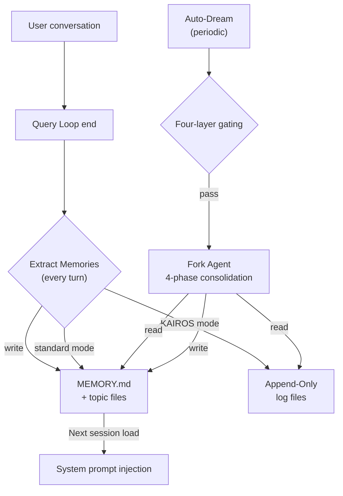

# Chapter 24: Cross-Session Memory — 망각에서 지속적 학습으로

> **포지셔닝**: 이 Chapter는 Claude Code의 6계층 Cross-Session Memory 아키텍처를 분석한다 — 원시 신호 캡처에서 구조화된 지식 증류에 이르는 완전한 시스템. 사전 조건: Chapter 5. 대상 독자: CC가 망각에서 지속적 학습으로 진화하는 Cross-Session Memory 시스템을 어떻게 구현하는지 이해하고 싶은 독자.

## 왜 중요한가 (Why This Matters)

메모리가 없는 AI Agent는 본질적으로 무상태(stateless) 함수다: 각 호출은 제로에서 시작되며, 사용자가 누구인지, 지난번에 무엇을 했는지, 어떤 결정이 이미 내려졌는지 알지 못한다. 사용자는 매번 새 세션에서 동일한 context를 반복해야 한다 — "나는 백엔드 엔지니어야", "이 프로젝트는 Bun으로 빌드해", "테스트에서 데이터베이스를 mock하지 마". 이 반복은 시간을 낭비하고, 더 중요하게는 인간-기계 협업의 연속성을 파괴한다.

Claude Code의 답은 **6계층 메모리 아키텍처**다 — 원시 신호 캡처에서 구조화된 지식 증류까지, 세션 내 요약에서 세션 간 지속성까지, 완전한 "학습 능력"을 구축한다. 이 6개의 서브시스템은 명확한 역할 분담을 갖는다:

| 서브시스템 | 핵심 파일 | 빈도 | 역할 |
|-----------|----------|------|------|
| Memdir | `memdir/memdir.ts` | 매 세션 로드 | MEMORY.md 인덱스 + 토픽 파일, system prompt에 주입 |
| Extract Memories | `services/extractMemories/extractMemories.ts` | 매 턴 종료 | Fork agent가 자동으로 메모리 추출 |
| Session Memory | `services/SessionMemory/sessionMemory.ts` | 주기적 트리거 | Rolling session 요약, compaction에 활용 |
| Transcript Persistence | `utils/sessionStorage.ts` | 매 메시지 | JSONL 세션 기록 저장 및 복구 |
| Agent Memory | `tools/AgentTool/agentMemory.ts` | Agent 생명주기 | Subagent 지속성 + VCS 스냅샷 |
| Auto-Dream | `services/autoDream/autoDream.ts` | 매일 | 야간 메모리 통합 및 정리 |

이 서브시스템들은 이전 Chapter들에서 간략히 언급되었다 — Chapter 9에서는 auto-compaction을 소개했고, Chapter 10은 compaction 후 파일 상태 유지를 다뤘으며, Chapter 19는 CLAUDE.md 로딩을 분석했고, Chapter 20은 fork agent 모드를 다뤘으며, Chapter 23에서는 KAIROS와 TEAMMEM feature flag를 언급했다. 그러나 메모리의 **생성, 생명주기, 세션 간 지속성**을 완전한 시스템으로 전체 분석한 적은 없었다. 이 Chapter가 그 공백을 채운다.

## 소스 코드 분석 (Source Code Analysis)

### 24.1 Memdir 아키텍처: MEMORY.md 인덱스와 토픽 파일

Memdir은 전체 메모리 시스템의 저장 계층이다 — 모든 메모리는 궁극적으로 이 디렉터리 구조 내의 파일로 저장된다.

#### Path 결정

메모리 디렉터리 위치는 `paths.ts`의 `getAutoMemPath()`로 결정되며, 3단계 우선순위 체인을 따른다:

```typescript
// restored-src/src/memdir/paths.ts:223-235
export const getAutoMemPath = memoize(
  (): string => {
    const override = getAutoMemPathOverride() ?? getAutoMemPathSetting()
    if (override) {
      return override
    }
    const projectsDir = join(getMemoryBaseDir(), 'projects')
    return (
      join(projectsDir, sanitizePath(getAutoMemBase()), AUTO_MEM_DIRNAME) + sep
    ).normalize('NFC')
  },
  () => getProjectRoot(),
)
```

결정 순서:
1. `CLAUDE_COWORK_MEMORY_PATH_OVERRIDE` 환경 변수 (Cowork 공간 수준 마운트)
2. `autoMemoryDirectory` 설정 (신뢰할 수 있는 소스로만 제한: policy/flag/local/user 설정, 악의적인 저장소가 쓰기 경로를 리디렉션하는 것을 방지하기 위해 projectSettings는 **제외**)
3. 기본 경로: `~/.claude/projects/<sanitized-git-root>/memory/`

특히 `getAutoMemBase()`는 `getProjectRoot()` 대신 `findCanonicalGitRoot()`를 사용한다는 점이 주목할 만하다 — 이는 동일한 저장소의 모든 worktree가 하나의 메모리 디렉터리를 공유한다는 의미다. 이는 의도적인 설계 결정이다 — 메모리는 작업 디렉터리가 아닌 프로젝트에 관한 것이기 때문이다.

#### 인덱스와 Truncation

`MEMORY.md`는 메모리 시스템의 진입점이다 — 각 줄이 토픽 파일을 가리키는 인덱스 파일이다. 시스템은 매 세션 시작 시 이를 system prompt에 주입한다. 인덱스 비대화가 귀중한 context 공간을 소비하는 것을 방지하기 위해, `memdir.ts`는 이중 truncation을 적용한다:

```typescript
// restored-src/src/memdir/memdir.ts:34-38
export const ENTRYPOINT_NAME = 'MEMORY.md'
export const MAX_ENTRYPOINT_LINES = 200
export const MAX_ENTRYPOINT_BYTES = 25_000
```

Truncation 로직은 계단식이다: 먼저 줄 수로 (200줄, 자연 경계), 그다음 바이트 확인 (25KB); 바이트 truncation이 줄 중간을 잘라야 하는 경우, 마지막 줄바꿈으로 폴백한다. 이 "줄 먼저, 그다음 바이트" 전략은 경험에서 비롯된 것이다 — 주석에서는 p97 콘텐츠 길이가 제한 내에 있지만 p100에서 197KB가 여전히 200줄 이내인 사례가 관찰되었다고 기록되어 있으며, 이는 인덱스 파일에 매우 긴 줄이 존재한다는 것을 나타낸다.

`truncateEntrypointContent()` (`memdir.ts:57-103`)는 계단식 truncation 후 WARNING 메시지를 추가하여, 인덱스가 truncation되었으며 상세 내용을 토픽 파일로 이동하도록 제안한다 (truncation 함수의 전체 분석은 Chapter 19에 있다). 이는 영리한 자기 치유 메커니즘이다 — 모델은 다음에 메모리를 정리할 때 이 경고를 보고 적절히 행동할 것이다.

#### 토픽 파일 형식

각 메모리는 YAML frontmatter가 있는 독립적인 Markdown 파일로 저장된다:

```markdown
---
name: Memory name
description: One-line description (used to judge relevance)
type: user | feedback | project | reference
---

Memory content...
```

네 가지 타입이 폐쇄적인 분류 체계를 형성한다:
- **user**: 사용자 역할, 선호도, 지식 수준
- **feedback**: Agent 동작에 대한 사용자의 수정 및 지도
- **project**: 진행 중인 작업, 목표, 마감일
- **reference**: 외부 시스템에 대한 포인터 (Linear 프로젝트, Grafana 대시보드)

`memoryScan.ts`의 스캐너는 frontmatter를 파싱하기 위해 각 파일의 처음 30줄만 읽어, 많은 메모리 파일이 있을 때 과도한 IO를 방지한다:

```typescript
// restored-src/src/memdir/memoryScan.ts:21-22
const MAX_MEMORY_FILES = 200
const FRONTMATTER_MAX_LINES = 30
```

스캔 결과는 수정 시간 내림차순으로 정렬되며, 최대 200개 파일만 유지한다. 이는 가장 오래 업데이트되지 않은 메모리가 자연스럽게 단계적으로 제거된다는 의미다.

#### KAIROS 로그 모드

KAIROS (장기 실행 어시스턴트 모드)가 활성화되면, 메모리 쓰기 전략이 "토픽 파일 + MEMORY.md 직접 업데이트"에서 "일별 로그 파일에 추가"로 전환된다:

```typescript
// restored-src/src/memdir/paths.ts:246-251
export function getAutoMemDailyLogPath(date: Date = new Date()): string {
  const yyyy = date.getFullYear().toString()
  const mm = (date.getMonth() + 1).toString().padStart(2, '0')
  const dd = date.getDate().toString().padStart(2, '0')
  return join(getAutoMemPath(), 'logs', yyyy, mm, `${yyyy}-${mm}-${dd}.md`)
}
```

경로 형식: `memory/logs/YYYY/MM/YYYY-MM-DD.md`. 이 append-only 전략은 긴 세션 동안 동일한 파일에 대한 잦은 재작성을 방지한다 — 증류는 야간 Auto-Dream 처리에 맡긴다.

### 24.2 Extract Memories: 자동 메모리 추출

Extract Memories는 메모리 시스템의 "지각 계층"이다 — 각 쿼리 턴이 끝날 때, fork agent가 조용히 대화를 분석하고 지속할 가치가 있는 정보를 추출한다.

#### 트리거 메커니즘

추출은 `stopHooks.ts`에서, 쿼리 루프가 끝날 때 트리거된다 (stop hook 논의는 Chapter 4 참조):

```typescript
// restored-src/src/query/stopHooks.ts:141-156
if (
  feature('EXTRACT_MEMORIES') &&
  !toolUseContext.agentId &&
  isExtractModeActive()
) {
  void extractMemoriesModule!.executeExtractMemories(
    stopHookContext,
    toolUseContext.appendSystemMessage,
  )
}
if (!toolUseContext.agentId) {
  void executeAutoDream(stopHookContext, toolUseContext.appendSystemMessage)
}
```

두 가지 핵심 제약:
1. **Main Agent만**: `!toolUseContext.agentId`가 subagent stop hook을 제외
2. **Fire-and-forget**: `void` 프리픽스는 추출이 비동기로 실행되어 다음 쿼리 턴을 블로킹하지 않음을 의미

#### Throttle 메커니즘

모든 쿼리 턴이 추출을 트리거하는 것은 아니다. `tengu_bramble_lintel` feature flag가 빈도를 제어한다 (기본값 1, 즉 매 턴 실행):

```typescript
// restored-src/src/services/extractMemories/extractMemories.ts:377-385
if (!isTrailingRun) {
  turnsSinceLastExtraction++
  if (
    turnsSinceLastExtraction <
    (getFeatureValue_CACHED_MAY_BE_STALE('tengu_bramble_lintel', null) ?? 1)
  ) {
    return
  }
}
turnsSinceLastExtraction = 0
```

#### Main Agent와의 상호 배제

Main Agent 자체가 메모리 파일을 쓸 때 (예: 사용자가 명시적으로 "이것을 기억해"라고 요청할 때), fork agent는 해당 턴의 추출을 건너뛴다:

```typescript
// restored-src/src/services/extractMemories/extractMemories.ts:121-148
function hasMemoryWritesSince(
  messages: Message[],
  sinceUuid: string | undefined,
): boolean {
  // ... autoMemPath를 대상으로 하는 Edit/Write tool 호출에 대해 assistant 메시지를 확인
}
```

이는 두 agent가 동시에 동일한 파일에 쓰는 것을 방지한다. main agent가 쓸 때, 커서는 최신 메시지로 직접 이동하여 해당 메시지들이 이후 추출에서 중복 처리되지 않도록 한다.

#### Permission 격리

Fork agent의 permission은 엄격히 제한된다:

`createAutoMemCanUseTool()` (`extractMemories.ts:171-222`)이 구현하는 내용:

- **허용**: Read/Grep/Glob (읽기 전용 tool, 제한 없음)
- **허용**: Bash (`isReadOnly`를 통과하는 명령만 — `ls`, `find`, `grep`, `cat` 등)
- **허용**: Edit/Write (`isAutoMemPath()`로 검증된 `memoryDir` 내 경로만)
- **거부**: 기타 모든 tool (MCP, Agent, 쓰기 가능한 Bash 등)

이 permission 함수는 Extract Memories와 Auto-Dream 모두에서 공유된다 (섹션 24.6 참조).

#### 추출 Prompt

추출 agent의 prompt는 효율적인 운영을 명시적으로 지시한다:

```typescript
// restored-src/src/services/extractMemories/prompts.ts:39
`You have a limited turn budget. ${FILE_EDIT_TOOL_NAME} requires a prior
${FILE_READ_TOOL_NAME} of the same file, so the efficient strategy is:
turn 1 — issue all ${FILE_READ_TOOL_NAME} calls in parallel for every file
you might update; turn 2 — issue all ${FILE_WRITE_TOOL_NAME}/${FILE_EDIT_TOOL_NAME}
calls in parallel.`
```

또한 조사 행동을 명시적으로 금지한다 — "Do not waste any turns attempting to investigate or verify that content further." 이는 fork agent가 (prompt cache를 포함하여) 메인 대화의 완전한 context를 상속받아 추가 정보 수집이 필요 없기 때문이다. 최대 턴 수는 5회(`maxTurns: 5`)로 제한되어, agent가 검증 루프에 빠지는 것을 방지한다.

### 24.3 Session Memory: Rolling Session 요약

Session Memory는 다른 문제를 해결한다: **세션 내** 정보 유지. context window가 포화 상태에 가까워져 auto-compaction이 트리거될 때 (Chapter 9 참조), compactor는 어떤 정보가 중요한지 알아야 한다. Session Memory가 이 신호를 제공한다.

#### 트리거 조건

Session Memory는 post-sampling hook(`registerPostSamplingHook`)으로 등록되어, 각 모델 샘플링 후 실행된다. 실제 추출은 세 가지 임계값으로 보호된다:

```typescript
// restored-src/src/services/SessionMemory/sessionMemoryUtils.ts:32-36
export const DEFAULT_SESSION_MEMORY_CONFIG: SessionMemoryConfig = {
  minimumMessageTokensToInit: 10000,   // 첫 트리거: 10K tokens
  minimumTokensBetweenUpdate: 5000,    // 업데이트 간격: 5K tokens
  toolCallsBetweenUpdates: 3,          // 최소 tool 호출: 3회
}
```

트리거 로직 (`sessionMemory.ts:134-181`) 요구 사항:
1. **초기화 임계값**: context window가 10K token에 도달할 때 처음 트리거
2. **업데이트 조건**: token 임계값 (5K)이 **반드시** 충족되어야 하며, 추가로 (a) tool 호출 수 >= 3, 또는 (b) 마지막 assistant 턴에 tool 호출이 없음 (자연스러운 대화 중단점)

이는 Session Memory가 짧은 대화에서는 트리거되지 않으며, 밀도 높은 tool 호출 중에는 워크플로우를 방해하지 않는다는 의미다.

#### 요약 템플릿

요약 파일은 고정된 섹션 구조를 사용한다 (`prompts.ts:11-41`):

```markdown
# Session Title
# Current State
# Task specification
# Files and Functions
# Workflow
# Errors & Corrections
# Codebase and System Documentation
# Learnings
# Key results
# Worklog
```

각 섹션에는 크기 제한이 있다 (`MAX_SECTION_LENGTH = 2000` token), 총 파일 크기는 12,000 token을 초과하지 않는다 (token budget 전략 논의는 Chapter 12 참조). 예산이 초과되면, prompt는 agent에게 가장 중요하지 않은 부분을 능동적으로 압축하도록 요청한다.

#### Auto-Compaction과의 관계

Session Memory의 초기화 게이트 `initSessionMemory()`는 `isAutoCompactEnabled()`를 확인한다 — auto-compaction이 비활성화되어 있으면 Session Memory도 실행되지 않는다. 이는 Session Memory의 주요 소비자가 compaction 시스템이기 때문이다. 요약 파일 `summary.md`는 compaction 중에 주입되어, compactor에게 "무엇이 중요한지"라는 핵심 신호를 제공한다 (Chapter 9 `sessionMemoryCompact.ts` 참조).

#### Extract Memories와의 차이

| 차원 | Session Memory | Extract Memories |
|------|---------------|-----------------|
| 지속성 범위 | 세션 내 | 세션 간 |
| 저장 위치 | `~/.claude/projects/<root>/<session-id>/session-memory/` | `~/.claude/projects/<root>/memory/` |
| 트리거 시점 | Token 임계값 + tool 호출 임계값 | 매 턴 종료 |
| 소비자 | Compaction 시스템 | 다음 세션의 system prompt |
| 콘텐츠 구조 | 고정 섹션 템플릿 | 자유 형식 토픽 파일 |

둘 다 간섭 없이 병렬로 실행된다 — Session Memory는 "이 세션에서 무엇을 했는지"에 집중하고, Extract Memories는 "세션 간에 유지할 가치 있는 정보가 무엇인지"에 집중한다.

### 24.4 Transcript Persistence: JSONL 세션 저장

`sessionStorage.ts` (5,105줄, 소스에서 가장 큰 단일 파일 중 하나)는 완전한 세션 기록을 JSONL (JSON Lines) 형식으로 지속하는 작업을 처리한다.

#### 저장 형식

각 메시지는 하나의 JSON 줄로 직렬화되어 세션 파일에 추가된다. 저장 경로: `~/.claude/projects/<root>/<session-id>.jsonl`. JSONL은 성능을 위해 선택되었다 — 증분 추가는 `appendFile`만 필요하며, 전체 파일을 파싱하고 재작성할 필요가 없다.

표준 user/assistant 메시지 외에도, 세션 기록에는 여러 특수 항목 타입이 포함된다:

| 항목 타입 | 목적 |
|----------|------|
| `file_history_snapshot` | 파일 히스토리 스냅샷, compaction 후 파일 상태를 복원하는 데 사용 (Chapter 10 참조) |
| `attribution_snapshot` | Attribution 스냅샷, 각 파일 수정의 출처를 기록 |
| `context_collapse_snapshot` | Compaction 경계 마커, compaction이 발생한 위치와 보존된 메시지를 기록 |
| `content_replacement` | 콘텐츠 교체 기록, REPL 모드에서 출력 truncation에 사용 |

#### 세션 재개

사용자가 `claude --resume`으로 세션을 재개할 때, `sessionStorage.ts`는 JSONL 파일로부터 완전한 메시지 체인을 재구성한다. 재개 프로세스:
1. 모든 JSONL 항목 파싱
2. `uuid`/`parentUuid`를 기반으로 메시지 트리 재구성
3. Compaction 경계 마커(`context_collapse_snapshot`) 적용, compaction 후 상태로 복원
4. 파일 히스토리 스냅샷 재구성, 모델의 파일 상태 이해가 디스크와 일치하도록 보장

이로써 세션 간 "계속"이 가능해진다 — 사용자는 하루 끝에 터미널을 닫고 다음 날 정확히 동일한 대화 context를 재개할 수 있다.

### 24.5 Agent Memory: Subagent 지속성

Subagent (Chapter 20 참조)는 자체적인 메모리 필요성을 가진다 — 반복적인 코드 리뷰 agent는 팀 코드 스타일 선호도를 기억해야 하며, 테스트 agent는 프로젝트의 테스트 프레임워크 설정을 기억해야 한다.

#### 3-Scope 모델

`agentMemory.ts`는 세 가지 메모리 scope를 정의한다:

```typescript
// restored-src/src/tools/AgentTool/agentMemory.ts:12-13
export type AgentMemoryScope = 'user' | 'project' | 'local'
```

| Scope | 경로 | VCS Commit 가능 | 목적 |
|-------|------|----------------|------|
| `user` | `~/.claude/agent-memory/<agentType>/` | 아니오 | 프로젝트 간 사용자 수준 선호도 |
| `project` | `<cwd>/.claude/agent-memory/<agentType>/` | 예 | 팀 공유 프로젝트 지식 |
| `local` | `<cwd>/.claude/agent-memory-local/<agentType>/` | 아니오 | 머신별 프로젝트 설정 |

각 scope는 독립적으로 자체 `MEMORY.md` 인덱스와 토픽 파일을 유지하며, Memdir과 완전히 동일한 `buildMemoryPrompt()`를 사용하여 system prompt 콘텐츠를 구성한다.

#### VCS 스냅샷 동기화

`agentMemorySnapshot.ts`는 실용적인 문제를 해결한다: `project` scope 메모리는 팀 전반에 걸쳐 Git을 통해 공유되어야 하지만, `.claude/agent-memory/`는 `.gitignore`에 있다. 해결책은 별도의 스냅샷 디렉터리다:

```typescript
// restored-src/src/tools/AgentTool/agentMemorySnapshot.ts:31-33
export function getSnapshotDirForAgent(agentType: string): string {
  return join(getCwd(), '.claude', SNAPSHOT_BASE, agentType)
}
```

스냅샷은 `snapshot.json`의 `updatedAt` 타임스탬프를 통해 버전을 추적한다. 스냅샷이 로컬 메모리보다 최신인 것이 감지되면, 세 가지 전략이 제공된다:

```typescript
// restored-src/src/tools/AgentTool/agentMemorySnapshot.ts:98-144
export async function checkAgentMemorySnapshot(
  agentType: string,
  scope: AgentMemoryScope,
): Promise<{
  action: 'none' | 'initialize' | 'prompt-update'
  snapshotTimestamp?: string
}> {
  // 스냅샷 없음 → 'none'
  // 로컬 메모리 없음 → 'initialize' (스냅샷을 로컬에 복사)
  // 스냅샷이 더 최신 → 'prompt-update' (모델에게 병합 프롬프트)
}
```

`initialize`는 파일을 직접 복사하고, `prompt-update`는 자동으로 덮어쓰지 않고 prompt를 통해 모델에게 "새 팀 지식이 사용 가능하다"고 알려 모델이 병합 방법을 결정하도록 한다. 이는 자동 덮어쓰기로 인한 로컬 커스터마이징 손실을 방지한다.

### 24.6 Auto-Dream: 자동 메모리 통합

Auto-Dream은 메모리 시스템의 "수면 단계"다 — 트리거하려면 시간 게이트 (기본 24시간)와 세션 게이트 (기본 5개의 새 세션) 모두 필요한 백그라운드 통합 작업이다. 흩어진 메모리 조각들을 포괄적으로 정리하고, 오래된 정보를 정리하며, 메모리 시스템 건강을 유지한다.

#### 4계층 게이팅 시스템

Auto-Dream 트리거는 비용이 가장 낮은 것에서 높은 순서로 네 가지 검사를 통과한다 (`autoDream.ts:95-191`):

**1계층: Master Gate**

```typescript
// restored-src/src/services/autoDream/autoDream.ts:95-100
function isGateOpen(): boolean {
  if (getKairosActive()) return false  // KAIROS 모드는 disk-skill dream 사용
  if (getIsRemoteMode()) return false
  if (!isAutoMemoryEnabled()) return false
  return isAutoDreamEnabled()
}
```

KAIROS 모드는 자체 dream skill을 갖고 있기 때문에 제외된다 (`/dream`을 통해 수동으로 트리거). Remote 모드 (CCR)는 지속적인 저장이 신뢰할 수 없기 때문에 제외된다. `isAutoDreamEnabled()`는 사용자 설정과 `tengu_onyx_plover` feature flag를 확인한다 (`config.ts:13-21`).

**2계층: Time Gate**

```typescript
// restored-src/src/services/autoDream/autoDream.ts:131-141
let lastAt: number
try {
  lastAt = await readLastConsolidatedAt()
} catch { ... }
const hoursSince = (Date.now() - lastAt) / 3_600_000
if (!force && hoursSince < cfg.minHours) return
```

기본 `minHours = 24`, 마지막 통합 이후 최소 24시간. 시간 정보는 lock 파일 mtime을 통해 얻는다 — 하나의 `stat` 시스템 호출.

**3계층: Session Gate**

```typescript
// restored-src/src/services/autoDream/autoDream.ts:153-171
let sessionIds: string[]
try {
  sessionIds = await listSessionsTouchedSince(lastAt)
} catch { ... }
const currentSession = getSessionId()
sessionIds = sessionIds.filter(id => id !== currentSession)
if (!force && sessionIds.length < cfg.minSessions) return
```

기본 `minSessions = 5`, 마지막 통합 이후 수정된 새 세션이 최소 5개. 현재 세션은 제외된다 (mtime이 항상 최신). 스캔에는 10분 쿨다운이 있다 (`SESSION_SCAN_INTERVAL_MS = 10 * 60 * 1000`), time gate가 통과된 후 매 턴마다 세션 목록 스캔이 반복되는 것을 방지한다.

**4계층: Lock Gate** — 세 가지 검사를 통과한 후, 동시성 lock을 획득해야 한다. 다른 프로세스가 통합 중이라면 현재 프로세스는 포기한다. Lock 메커니즘 구현 세부 사항은 다음 섹션에서 다룬다.

#### PID Lock 메커니즘

동시성 제어는 `.consolidate-lock` 파일을 사용한다 (`consolidationLock.ts`):

```typescript
// restored-src/src/services/autoDream/consolidationLock.ts:16-19
const LOCK_FILE = '.consolidate-lock'
const HOLDER_STALE_MS = 60 * 60 * 1000  // 1시간
```

이 lock 파일은 이중 의미를 갖는다:
- **mtime** = `lastConsolidatedAt` (마지막 성공적인 통합의 타임스탬프)
- **파일 내용** = 보유자의 PID

Lock 획득 흐름:
1. `stat` + `readFile`로 mtime과 PID 가져오기
2. mtime이 1시간 이내이고 PID가 살아있음 -> 점유 중, `null` 반환
3. PID가 죽었거나 mtime이 만료됨 -> lock 회수
4. 자신의 PID 쓰기
5. 재읽기로 검증 (두 프로세스가 동시에 회수할 때의 경쟁 방지)

```typescript
// restored-src/src/services/autoDream/consolidationLock.ts:46-84
export async function tryAcquireConsolidationLock(): Promise<number | null> {
  // ... stat + readFile ...
  await writeFile(path, String(process.pid))
  // 이중 확인: 두 회수자가 모두 씀 → 나중에 쓰는 자가 PID에서 이김
  let verify: string
  try {
    verify = await readFile(path, 'utf8')
  } catch { return null }
  if (parseInt(verify.trim(), 10) !== process.pid) return null
  return mtimeMs ?? 0
}
```

실패 롤백은 `rollbackConsolidationLock()`을 통해 mtime을 획득 전 값으로 복원한다. `priorMtime`이 0이면 (이전에 lock 파일이 없었음), lock 파일이 삭제된다. 이는 실패한 통합이 다음 재시도를 막지 않도록 보장한다.

#### 4단계 통합 Prompt

통합 agent는 구조화된 4단계 prompt를 받는다:

```
Phase 1 — Orient: ls memory directory, read MEMORY.md, browse topic files
Phase 2 — Gather: Search logs and session records for new signals
Phase 3 — Consolidate: Merge into existing files, resolve contradictions, relative dates → absolute dates
Phase 4 — Prune & Index: Keep MEMORY.md within 200 lines / 25KB
```

Prompt는 특히 "병합 우선 생성" (`Merging new signal into existing topic files rather than creating near-duplicates`)과 "수정 우선 보존" (`if today's investigation disproves an old memory, fix it at the source`)을 강조한다 — 메모리 파일의 무한 증가를 방지한다.

자동 트리거 시나리오에서, prompt는 추가 제약 정보도 추가한다 — `Tool constraints for this run`과 세션 목록:

```typescript
// restored-src/src/services/autoDream/autoDream.ts:216-221
const extra = `
**Tool constraints for this run:** Bash is restricted to read-only commands...
Sessions since last consolidation (${sessionIds.length}):
${sessionIds.map(id => `- ${id}`).join('\n')}`
```

#### Fork Agent 제약

통합은 `runForkedAgent`를 통해 실행된다 (fork agent 모드는 Chapter 20 참조), 섹션 24.2에서 설명한 `createAutoMemCanUseTool` permission 함수를 사용한다. 핵심 제약:

```typescript
// restored-src/src/services/autoDream/autoDream.ts:224-233
const result = await runForkedAgent({
  promptMessages: [createUserMessage({ content: prompt })],
  cacheSafeParams: createCacheSafeParams(context),
  canUseTool: createAutoMemCanUseTool(memoryRoot),
  querySource: 'auto_dream',
  forkLabel: 'auto_dream',
  skipTranscript: true,
  overrides: { abortController },
  onMessage: makeDreamProgressWatcher(taskId, setAppState),
})
```

- `cacheSafeParams: createCacheSafeParams(context)` — 부모의 prompt cache 상속, token 비용을 크게 절감
- `skipTranscript: true` — 세션 히스토리에 기록되지 않음 (통합은 백그라운드 작업이며 사용자의 대화 기록을 오염시키면 안 됨)
- `onMessage` — 진행 상황 콜백, Edit/Write 경로를 캡처하여 DreamTask UI 업데이트

#### Task UI 통합

`DreamTask.ts`는 Auto-Dream을 Claude Code의 백그라운드 task UI (푸터 pill 및 Shift+Down 대화상자)에 노출한다:

```typescript
// restored-src/src/tasks/DreamTask/DreamTask.ts:25-41
export type DreamTaskState = TaskStateBase & {
  type: 'dream'
  phase: DreamPhase               // 'starting' | 'updating'
  sessionsReviewing: number
  filesTouched: string[]
  turns: DreamTurn[]
  abortController?: AbortController
  priorMtime: number              // 종료 시 롤백용
}
```

사용자는 UI에서 dream task를 능동적으로 종료할 수 있다. `kill` 메서드는 `abortController.abort()`를 통해 fork agent를 중단하고, 다음 세션이 재시도할 수 있도록 lock 파일의 mtime을 롤백한다:

```typescript
// restored-src/src/tasks/DreamTask/DreamTask.ts:136-156
async kill(taskId, setAppState) {
  updateTaskState<DreamTaskState>(taskId, setAppState, task => {
    task.abortController?.abort()
    priorMtime = task.priorMtime
    return { ...task, status: 'killed', ... }
  })
  if (priorMtime !== undefined) {
    await rollbackConsolidationLock(priorMtime)
  }
}
```

#### Extract Memories vs Auto-Dream 보완 관계

두 서브시스템은 **고빈도 증분 + 저빈도 전체** 보완 아키텍처를 형성한다:



| 차원 | Extract Memories | Auto-Dream |
|------|-----------------|------------|
| 빈도 | 매 턴 (flag로 throttle 가능) | 매일 (24h + 5 세션) |
| 입력 | 최근 N개 메시지 | 전체 메모리 디렉터리 + 세션 기록 |
| 작업 | 토픽 파일 생성/업데이트 | 병합, 정리, 모순 해결 |
| 비유 | 단기 → 장기 메모리 인코딩 | 수면 중 메모리 통합 |

KAIROS 모드에서 이 보완성은 더욱 두드러진다: Extract Memories는 append-only 로그(원시 신호 스트림)만 쓰고, Auto-Dream은 매일 통합 시 로그를 구조화된 토픽 파일로 증류한다. 표준 모드에서는, Extract Memories가 토픽 파일을 직접 업데이트하고, Auto-Dream이 주기적인 정리와 중복 제거를 처리한다.

## 패턴 증류 (Pattern Distillation)

### Pattern One: 다계층 메모리 아키텍처

**해결하는 문제**: 단일 저장 전략이 고빈도 쓰기와 고품질 검색을 동시에 만족시킬 수 없다.

**패턴**: 메모리 시스템을 세 계층으로 분리한다 — 원시 신호 계층 (로그/세션 기록), 구조화된 지식 계층 (토픽 파일), 인덱스 계층 (MEMORY.md). 각 계층은 독립적인 쓰기 빈도와 품질 요구 사항을 갖는다.

```
원시 신호 ──(매 턴)──→ 구조화된 지식 ──(매일)──→ 인덱스
  (로그)               (토픽 파일)               (MEMORY.md)
  고빈도, 저품질        중빈도, 중품질              저빈도, 고품질
```

**전제 조건**: 백그라운드 처리 능력 필요 (fork agent), 예측 가능한 저장 예산 필요 (truncation 메커니즘).

### Pattern Two: Fork Agent를 통한 백그라운드 추출

**해결하는 문제**: 메모리 추출은 모델 추론이 필요하지만 사용자의 상호작용 루프를 블로킹할 수 없다.

**패턴**: 쿼리 루프 종료 시 fork agent 실행, 부모의 prompt cache 상속 (비용 절감), 엄격한 permission 격리 적용 (메모리 디렉터리에만 쓸 수 있음), tool 호출 및 턴 제한 설정 (runaway 방지). 상호 배제 검사(`hasMemoryWritesSince`)를 통해 main agent와 조율.

**전제 조건**: Prompt cache 메커니즘 사용 가능, fork agent 인프라 준비 (Chapter 20 참조), 메모리 디렉터리 경로 결정.

### Pattern Three: 상태로서의 파일 mtime

**해결하는 문제**: Auto-Dream은 외부 데이터베이스 없이 "마지막 통합 시간"과 "현재 보유자"를 지속해야 한다.

**패턴**: 하나의 lock 파일 사용; mtime은 `lastConsolidatedAt`, 내용은 보유자 PID. `stat`/`utimes`/`writeFile`을 통해 읽기, 획득, 롤백 구현. PID 생존 감지 + 1시간 만료가 크래시 복구를 제공한다.

**전제 조건**: 파일 시스템이 밀리초 정밀도 mtime을 지원, 프로세스 PID는 합리적인 시간 창 내에 재사용되지 않음.

### Pattern Four: 예산 제한 메모리 주입

**해결하는 문제**: 무한한 메모리 증가는 결국 유용한 context 공간을 잠식한다.

**패턴**: 다단계 truncation 적용 — MEMORY.md 최대 200줄 / 25KB, 토픽 파일 최대 `MAX_MEMORY_FILES = 200`, Session Memory 섹션당 2000 token / 총 12000 token. Truncation 시 경고 메시지 추가, 자기 치유 루프 형성.

**전제 조건**: 결정된 context 예산 (Chapter 12 참조), truncated된 콘텐츠도 여전히 의미 있는 정보 제공 가능.

### Pattern Five: 보완적 빈도 설계

**해결하는 문제**: 단일 빈도 메모리 처리는 정보 손실 (너무 드물게) 또는 노이즈 축적 (너무 자주) 중 하나를 초래한다.

**패턴**: 이중 빈도 전략 — 고빈도 증분 추출 (매 턴 / 매 N 턴)은 잠재적으로 가치 있는 모든 신호를 캡처하고; 저빈도 전체 통합 (매일)은 노이즈를 정리하고, 모순을 해결하며, 중복을 병합한다. 전자는 false positive를 허용하고 (중요하지 않은 것들을 기억); 후자는 false positive를 수정한다 (중요하지 않은 메모리 삭제).

**전제 조건**: 두 처리 빈도 간의 충분한 시간 차이 (최소 한 자릿수 차이), 고빈도 작업 비용이 제어 가능 (prompt cache 상속).

## 사용자가 할 수 있는 것 (What Users Can Do)

### MEMORY.md 관리

200줄 제한을 이해하는 것이 핵심이다. 프로젝트의 메모리 인덱스가 200줄을 초과하면 이후 항목들이 truncated된다. MEMORY.md를 수동으로 편집하여 가장 중요한 항목들이 먼저 오도록 하고, 세부 내용을 토픽 파일로 이동한다. 각 인덱스 항목은 줄당 150자 이하로 유지한다.

### 기억되는 것 이해

네 가지 타입은 각각 최적의 용도를 갖는다:
- **feedback**은 가장 가치 있는 타입이다 — Agent 동작을 직접 변경한다. "테스트에서 데이터베이스를 mock하지 마"는 "우리는 PostgreSQL을 사용한다"보다 더 유용하다
- **user**는 Agent가 커뮤니케이션 스타일과 제안 깊이를 조정하는 데 도움을 준다
- **project**는 시간 민감성이 있으며, 주기적인 정리가 필요하다
- **reference**는 외부 리소스로의 바로가기이며, 간결하게 유지한다

### 자동 메모리 제어

- `CLAUDE_CODE_DISABLE_AUTO_MEMORY=1`은 모든 auto-memory 기능을 완전히 비활성화한다
- `settings.json`에서 `autoMemoryEnabled: false`는 프로젝트별로 비활성화한다
- `autoDreamEnabled: false`는 야간 통합만 비활성화하며, 즉각적인 추출은 유지한다

### 통합 수동 트리거

매일 자동 트리거를 기다리지 않겠다면? `/dream` 명령으로 즉각적인 메모리 통합을 실행한다. 특히 유용한 경우:
- 큰 리팩터링을 완료한 후, 프로젝트 context 업데이트
- 팀원 전환 후, 개인 선호도 정리
- 오래되었거나 모순된 메모리 파일을 발견했을 때

### CLAUDE.md로 메모리 보완

CLAUDE.md와 메모리 시스템은 보완적이다:
- CLAUDE.md는 **수정되어서는 안 되는 지시사항** 저장 — 코딩 표준, 아키텍처 제약, 팀 프로세스
- 메모리 시스템은 **진화할 수 있는 지식** 저장 — 사용자 선호도, 프로젝트 context, 외부 참조

Auto-Dream에 의해 정리되거나 수정되어서는 안 되는 정보라면, 메모리 시스템이 아닌 CLAUDE.md에 넣는다.

---

## 버전 진화: v2.1.91 메모리 시스템 변경

> 다음 분석은 v2.1.91 bundle 신호 비교를 기반으로 하며, v2.1.88 소스 코드 추론과 결합한다.

### Memory Feature Toggle

v2.1.91은 `tengu_memory_toggled` 이벤트를 추가하여, 메모리 기능의 런타임 토글을 시사한다 — 사용자가 세션 중에 세션 간 메모리를 동적으로 활성화하거나 비활성화할 수 있다. 이는 v2.1.88에서 메모리가 항상 활성화되어 있던 것과 다르다 (Feature Flag가 켜져 있는 경우).

### No-Prose Skip 최적화

`tengu_extract_memories_skipped_no_prose` 이벤트는 v2.1.91이 메모리 추출 전에 콘텐츠 감지를 추가했음을 나타낸다: 메시지에 prose 콘텐츠가 없는 경우 (순수 코드, tool 결과, JSON 출력), 메모리 추출을 건너뛴다 — 의미 없는 콘텐츠에 대한 비용이 높은 LLM 추출을 방지한다.

이는 **예산 인식 최적화**다: 메모리 추출은 추가 API 호출이 필요하며, 순수 기술적 상호작용 (일괄 파일 읽기, 테스트 실행)에서 추출하는 것은 비용을 낭비할 뿐만 아니라 낮은 품질의 메모리 항목을 생성할 수 있다.

### Team Memory

v2.1.91은 `tengu_team_mem_*` 이벤트 시리즈 (sync_pull, sync_push, push_suppressed, secret_skipped 등)를 추가하며, team memory가 실험에서 활성 사용으로 이동했음을 나타낸다.

Team memory는 `~/.claude/projects/{project}/memory/team/`에 저장되며, 개인 메모리와 독립적이다. 핵심 메커니즘:
- **동기화**: `sync_pull` / `sync_push` 이벤트는 구성원 간 동기화를 나타냄
- **보안 필터링**: `secret_skipped` 이벤트는 민감한 콘텐츠 (API 키, 비밀번호)가 공유 메모리에 기록되지 않음을 나타냄
- **쓰기 억제**: `push_suppressed` 이벤트는 쓰기 제한을 나타냄 (빈도 또는 용량일 수 있음)
- **항목 상한**: `entries_capped` 이벤트는 team memory에 용량 제한이 있음을 나타냄

Teams 구현 세부 사항 내의 team memory 보안 보호 분석은 Chapter 20b를 참조.

---

## 버전 진화: v2.1.100 Dream 시스템 성숙

> 다음 분석은 v2.1.100 bundle 신호 비교를 기반으로 하며, v2.1.88 소스 코드 (`services/autoDream/autoDream.ts`) 추론과 결합한다.

### Kairos Dream: 백그라운드 스케줄 통합

v2.1.88 소스에서 `getKairosActive()`는 `auto_dream`이 조기에 `false`를 반환하게 한다 (`autoDream.ts:95-100`), KAIROS 모드가 "자체 dream skill을 갖고 있기" 때문이다. v2.1.100은 이 설계를 변경한다: 별도의 dream skill 대신, KAIROS 모드는 이제 `tengu_kairos_dream`을 백그라운드 cron 스케줄 dream task로 사용한다 — Dream 시스템의 세 번째 트리거 모드.

| 트리거 모드 | 이벤트 | 시점 | 전제 조건 |
|------------|-------|------|----------|
| 수동 | `tengu_dream_invoked` | 사용자가 `/dream` 실행 | 없음 |
| 자동 | `tengu_auto_dream_fired` | 세션 시작 시 확인 | Time gate + session gate |
| 스케줄 | `tengu_kairos_dream` | 백그라운드 cron 스케줄 | KAIROS 모드 활성 |

v2.1.100 bundle에서 추출한 cron 표현식 생성 로직:

```javascript
// v2.1.100 bundle reverse engineering
function P_A() {
  let q = Math.floor(Math.random() * 360);
  return `${q % 60} ${Math.floor(q / 60)} * * *`;
}
```

`Math.random() * 360`은 0-359의 난수를 생성하고; `q % 60`은 분 (0-59), `Math.floor(q / 60)`은 시간 (0-5)을 제공한다. 이는 Kairos Dream이 **자정에서 오전 5시 사이에만 실행**된다는 의미다 — 야간 실행으로 활성 사용자 세션과 자원 경쟁을 방지하며, 무작위 오프셋은 여러 사용자가 동시에 트리거하는 것을 방지한다. 이는 v2.1.88 소스의 `consolidationLock` 파일 lock과 동일한 분산 친화적 철학을 공유한다 (`autoDream.ts:153-171`).

### 명시적 Skip 이유

v2.1.100은 skip 원인을 기록하는 `reason` 필드와 함께 `tengu_auto_dream_skipped`를 추가한다. Bundle에서 추출한 두 가지 skip 경로:

```javascript
// v2.1.100 bundle reverse engineering
d("tengu_auto_dream_skipped", {
  reason: "sessions",          // 새 세션 부족 (< minSessions)
  session_count: j.length,
  min_required: Y.minSessions
})

d("tengu_auto_dream_skipped", {
  reason: "lock"               // 다른 프로세스가 lock 보유 중
})
```

이 두 skip 경로는 v2.1.88 소스의 2계층 게이팅과 일치한다 (`autoDream.ts:131-171`) — 그러나 v2.1.88은 조용히 반환했고, v2.1.100은 skip 이유를 telemetry 이벤트로 기록한다. 이는 관찰 가능성을 향상시킨다: 운영자가 `reason` 분포를 조사하여 "왜 dream이 트리거되지 않는지"를 진단할 수 있다.

### 두 가지 Dream Prompt 모드

v2.1.100 bundle에서 추출한 두 가지 고유한 dream prompt는 v2.1.88 소스의 dream 실행 로직과 일치한다 (`autoDream.ts:216-233`):

1. **Pruning 모드**: "You are performing a dream — a pruning pass over your memory files" — 오래되고, 중복되거나 모순된 메모리 항목 삭제
2. **Reflective 모드**: "You are performing a dream — a reflective pass over your memory files. Synthesize what..." — 흩어진 메모리 조각을 구조화된 지식으로 합성

모드 간의 명시적 구분은, v2.1.100 bundle의 `team/` 디렉터리 처리 규칙과 결합하여 ("Do not promote personal memories into `team/` during a dream — that's a deliberate choice the user makes via `/remember`, not something to do reflexively"), 명확한 Dream 동작 경계를 확립한다: dream은 정리하고 정리할 수 있지만, 메모리 공유 범위를 일방적으로 확대할 수 없다.

### toolStats: 세션 수준 Tool 통계

v2.1.100의 `sdk-tools.d.ts`는 7차원 세션 수준 tool 사용 통계를 제공하는 `toolStats` 필드를 추가한다:

```typescript
toolStats?: {
  readCount: number;       // 파일 읽기 횟수
  searchCount: number;     // 검색 횟수
  bashCount: number;       // Bash 명령 횟수
  editFileCount: number;   // 파일 편집 횟수
  linesAdded: number;      // 추가된 줄 수
  linesRemoved: number;    // 제거된 줄 수
  otherToolCount: number;  // 기타 tool 횟수
};
```

이는 Dream 시스템의 "세션 가치 평가"에 정량적 기반을 제공한다 — `auto_dream`은 최근 세션이 통합할 가치 있는 충분한 "실질적 상호작용"을 포함하는지 판단해야 하며, 순수 기술적 작업 (높은 `bashCount`이지만 `linesAdded`가 없는 디버깅 세션 등)은 제외된다.
