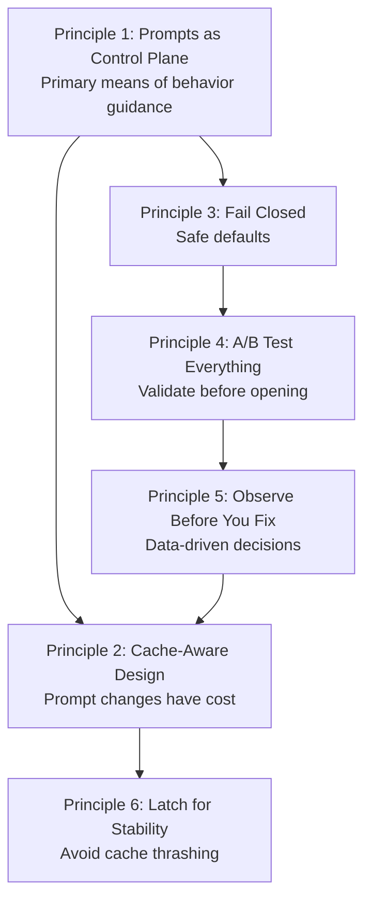

# Chapter 25: Harness Engineering 원칙 (Harness Engineering Principles)

## 왜 중요한가 (Why This Matters)

앞선 여섯 Part에서 우리는 Claude Code의 모든 하위 시스템을 소스 코드 수준에서 해부했다 — tool 등록, Agent Loop, system prompt, context compaction, prompt caching, permission 보안, 그리고 skill 시스템. 이러한 분석들은 풍부한 구현 세부 사항을 드러냈지만, "어떻게 동작하는가" 수준에서 멈춘다면 reverse engineering의 가장 가치 있는 산출물인 **재사용 가능한 엔지니어링 원칙**을 낭비하는 셈이다.

이 Chapter에서는 앞선 23개 Chapter의 소스 코드 분석으로부터 6가지 핵심 Harness Engineering 원칙을 추출한다. 각 원칙은 명확한 소스 코드 추적 경로, 적용 가능한 시나리오, 그리고 anti-pattern 경고를 갖추고 있다. 이러한 원칙들을 관통하는 공통 주제는 다음과 같다: **AI Agent 시스템에서 행동을 제어하는 최선의 방법은 더 많은 코드를 작성하는 것이 아니라 더 나은 제약 조건을 설계하는 것이다**.

---

## Agent Loop 아키텍처 스펙트럼에서 Claude Code의 위치 (Claude Code's Position in the Agent Loop Architecture Spectrum)

원칙을 추출하기에 앞서, 하나의 메타 질문에 답할 가치가 있다: **Claude Code는 어떤 유형의 Agent 아키텍처인가?**

학계에서는 Agent Loop을 여섯 가지 패턴으로 분류한다: monolithic loop(ReAct 스타일의 추론-행동 인터리빙), hierarchical agent(목표-태스크-실행 3계층), distributed multi-agent(다중 역할 협업), reflection/metacognitive loop(Reflexion 스타일의 자기 개선), tool-augmented loop(외부 도구 기반 상태 업데이트), 그리고 learning/online update loop(메모리 지속 및 전략 반복). 대부분의 프레임워크(LangGraph, AutoGen, CrewAI)는 이 중 하나 또는 두 가지 패턴을 핵심 추상화로 선택한다.

Claude Code의 독특한 점은 다음과 같다: **어떤 단일 패턴의 순수한 구현이 아니라, 여섯 가지 모두의 실용적 혼합체라는 것이다**.

```
┌─────────────────────────────────────────────────────────────┐
│           Claude Code Architecture Spectrum Position         │
├──────────────────────┬──────────────────────────────────────┤
│ Academic Pattern     │ CC Implementation                    │
├──────────────────────┼──────────────────────────────────────┤
│ Monolithic Loop      │ queryLoop() — core Agent Loop (ch03) │
│ Tool-Augmented Loop  │ 40+ tools in ReAct-style (ch02-04)  │
│ Hierarchical Agent   │ Coordinator Mode layers (ch20)      │
│ Distributed Multi-   │ Team parallel + Ultraplan remote     │
│   Agent              │   delegation (ch20)                  │
│ Reflection (weak)    │ Advisor Tool + stop hooks (ch21)    │
│ Learning (weak)      │ Cross-session memory + CLAUDE.md    │
│                      │   persistence (ch24)                │
└──────────────────────┴──────────────────────────────────────┘
```

이 혼합은 설계 실수가 아니라 실용적 선택이다. CC의 핵심은 monolithic `queryLoop()`(패턴 1)이지만, 그 위에 다음이 구축된다:

- **Tool augmentation**은 기본 동작이다 — 각 반복에서 tool을 호출하고, observation을 얻고, 상태를 업데이트할 수 있으며, 이는 정확히 ReAct의 "추론-행동 인터리빙"이다
- **Hierarchical agent**는 필요 시 활성화된다 — Coordinator Mode는 "계획"과 "실행"을 서로 다른 계층으로 분리하여, 상위 계층은 의사결정만, 하위 계층은 실행만 담당한다
- **Distributed multi-agent**는 필요 시 활성화된다 — Team mode에서는 여러 Agent가 `SendMessageTool`을 통해 협업하고, Ultraplan은 계획 수립을 원격 컨테이너로 위임한다
- **Reflection**은 암묵적이다 — 명시적인 Reflexion 메모리는 없지만, Advisor Tool이 "비평가" 역할을, stop hook이 "실행 후 점검"을 제공한다
- **Learning**은 영속적이다 — cross-session memory(`~/.claude/memory/`)와 CLAUDE.md를 통해 Agent가 세션 간 경험을 축적할 수 있지만, model weight를 업데이트하지는 않는다

이 "기본은 단순하게, 필요할 때 복잡하게"라는 아키텍처 철학은 이 Chapter에서 추출하는 모든 원칙에 스며들어 있다.

---

## 소스 코드 분석 (Source Code Analysis)

### 25.1 원칙 1: Prompt를 Control Plane으로 (Principle One: Prompts as the Control Plane)

**정의**: 코드 로직에 제한을 하드코딩하는 대신 system prompt 세그먼트를 통해 모델 행동을 가이드한다.

Claude Code의 행동 가이드 대부분은 코드의 if/else 분기가 아닌 prompt를 통해 달성된다. 가장 전형적인 예는 미니멀리즘 지시문이다:

```typescript
// restored-src/src/constants/prompts.ts:203
"Don't create helpers, utilities, or abstractions for one-time operations.
Don't design for hypothetical future requirements. The right amount of
complexity is what the task actually requires — no speculative abstractions,
but no half-finished implementations either. Three similar lines of code
is better than a premature abstraction."
```

이 텍스트는 코드 주석이 아니다 — 실제로 모델에 전송되는 지시문이다. Claude Code는 모델이 over-engineering을 하고 있는지 코드 수준에서 감지하지 않으며(이는 기술적으로 거의 불가능하다), 대신 자연어를 통해 직접 모델에게 "이렇게 하지 마라"고 지시한다.

동일한 패턴이 전체 system prompt 아키텍처에 퍼져 있다(자세한 내용은 Chapter 5 참조). `systemPromptSections.ts`는 system prompt를 여러 조합 가능한 섹션으로 구성하며, 각 섹션은 명확한 cache scope(`scope: 'global'` 또는 `null`)를 갖는다. 이 설계는 행동 조정에 텍스트 수정만 필요하다는 것을 의미한다 — 코드 변경도, 테스트 변경도, 릴리스 프로세스도 필요 없다.

Tool prompt는 이 원칙의 전형적인 구현이다(자세한 내용은 Chapter 8 참조). BashTool의 Git Safety Protocol — "hook을 절대 건너뛰지 마라, 절대 amend하지 마라, 특정 파일 git add를 선호하라" — 는 전적으로 prompt 텍스트로 표현된다. 팀이 언젠가 amend를 허용하기로 결정한다면, prompt 텍스트 한 줄만 삭제하면 되며 실행 로직은 전혀 건드릴 필요가 없다.

더 나아가, Claude Code는 모든 행동 스위치를 메인 system prompt에 집어넣지 않는다. `<system-reminder>`는 **out-of-band control channel**로 기능한다: Plan Mode의 다단계 워크플로우(인터뷰 → 탐색 → 계획 → 승인 → 실행), Todo/Task 부드러운 알림, Read tool의 빈 파일/offset 경고, ToolSearch의 deferred tool 힌트는 모두 메시지 스트림에 조건부로 주입되는 meta-instruction이지, 메인 system prompt의 재작성이 아니다. 다시 말해, Claude Code는 "안정적인 헌법"과 "런타임 스위치"를 두 계층의 control plane으로 분리한다: 전자는 안정성과 캐시 가능성을, 후자는 필요 시 동작, 단기 수명, 교체 가능한 특성을 추구한다.

**적용 범위**: 구조적 제약(permission, token 예산)은 코드로, 행동적 제약(스타일, 전략, 선호도)은 prompt로 처리한다.

**Anti-pattern: 하드코딩된 행동**. 바람직하지 않은 모든 모델 행동에 대해 감지기와 인터셉터를 작성하여, 결국 모델 능력 진화 속도를 결코 따라잡을 수 없는 거대한 규칙 엔진을 만들어내는 것이다.

---

### 25.2 원칙 2: Cache-Aware 설계는 타협할 수 없다 (Principle Two: Cache-Aware Design Is Non-Negotiable)

**정의**: 모든 prompt 변경에는 `cache_creation` token으로 측정되는 비용이 있으며, 시스템 설계는 cache 안정성을 일급 제약 조건으로 다루어야 한다.

`SYSTEM_PROMPT_DYNAMIC_BOUNDARY` 마커(`restored-src/src/constants/prompts.ts:114-115`)는 system prompt를 두 영역으로 분할한다:

```typescript
// restored-src/src/constants/prompts.ts:105-115
/**
 * Boundary marker separating static (cross-org cacheable) content
 * from dynamic content.
 * Everything BEFORE this marker in the system prompt array can use
 * scope: 'global'.
 * Everything AFTER contains user/session-specific content and should
 * not be cached.
 */
export const SYSTEM_PROMPT_DYNAMIC_BOUNDARY =
  '__SYSTEM_PROMPT_DYNAMIC_BOUNDARY__'
```

`splitSysPromptPrefix()`(`restored-src/src/utils/api.ts:321-435`)는 cache breakpoint가 올바르게 배치되도록 세 가지 코드 경로를 구현한다: MCP가 있는 경우의 tool 기반 캐싱, global cache + boundary marker, 그리고 기본 org 수준 캐싱. 이 함수의 복잡성은 전적으로 cache 최적화 필요에서 비롯된다 — 캐싱을 신경 쓰지 않는다면 그냥 문자열을 연결하면 된다.

cache break 감지 시스템(자세한 내용은 Chapter 14 참조)은 거의 20개 필드의 전후 상태 변화를 추적한다(`restored-src/src/services/api/promptCacheBreakDetection.ts:28-69`): `systemHash`, `toolsHash`, `cacheControlHash`, `perToolHashes`, `betas` 등. 어떤 필드든 변경되면 cache 무효화가 발생할 수 있다.

Beta Header latching 메커니즘은 극단적인 사례이다: **beta header가 한번 전송되면, 해당 기능이 비활성화되더라도 영원히 계속 전송된다** — 전송을 중단하면 요청 서명이 변경되어 약 50-70K token의 캐시된 prefix가 무효화되기 때문이다. 소스 코드 주석은 latching의 이유를 명시적으로 기록하고 있다:

```typescript
// restored-src/src/services/api/promptCacheBreakDetection.ts:47-48
/** AFK_MODE_BETA_HEADER presence — should NOT break cache anymore
 *  (sticky-on latched in claude.ts). Tracked to verify the fix. */
```

Date memoization(`getSessionStartDate()`)은 또 다른 예이다: 세션이 자정을 넘기면 모델이 보는 날짜가 "만료"되지만 — 이는 의도적이다. 날짜 문자열 변경이 cache prefix를 깨뜨리기 때문이다.

**Anti-pattern: 빈번한 prompt 변경**. agent 목록이 한때 system prompt에 인라인되어 global `cache_creation` token의 10.2%를 차지했다(자세한 내용은 Chapter 15 참조). 해결책은 이를 `system-reminder` 메시지로 옮기는 것이었다 — cache 세그먼트 밖이므로 수정이 cache에 영향을 미치지 않는다.

`/btw`와 SDK `side_question`은 이 사고를 또 다른 방향으로 밀고 나간다: **cache-safe sideband query**. 메인 대화에 일반 turn을 삽입하는 대신, stop hook 단계에서 메인 스레드가 저장한 cache-safe prefix snapshot을 재사용하고, 단일 `<system-reminder>` side question을 추가하며, tool 없는 one-shot fork를 시작하고, 명시적으로 `skipCacheWrite`한다. 결과: side question은 부모 세션의 prefix cache를 공유하면서도 자체 Q&A로 메인 대화 기록을 오염시키지 않는다.

---

### 25.3 원칙 3: 기본은 폐쇄, 개방은 명시적으로 (Principle Three: Fail Closed, Open Explicitly)

**정의**: 시스템 기본값은 가장 안전한 옵션을 선택해야 하며, 위험한 작업은 명시적 선언 후에만 허용된다.

`buildTool()` 팩토리 함수는 모든 tool 속성에 방어적 기본값을 설정한다:

```typescript
// restored-src/src/Tool.ts:748-761
/**
 * Defaults (fail-closed where it matters):
 * - `isConcurrencySafe` → `false` (assume not safe)
 * - `isReadOnly` → `false` (assume writes)
 * - `isDestructive` → `false`
 * - `checkPermissions` → `{ behavior: 'allow', updatedInput }`
 *   (defer to general permission system)
 * - `toAutoClassifierInput` → `''`
 *   (skip classifier — security-relevant tools must override)
 */
const TOOL_DEFAULTS = {
  isEnabled: () => true,
  isConcurrencySafe: (_input?: unknown) => false,
  isReadOnly: (_input?: unknown) => false,
  ...
}
```

이는 새로운 tool이 **기본적으로 동시성 안전하지 않음**을 의미한다 — `partitionToolCalls()`(`restored-src/src/services/tools/toolOrchestration.ts:91-116`)는 `isConcurrencySafe: true`를 선언하지 않은 tool을 직렬 큐에 배치한다. `isConcurrencySafe` 호출이 예외를 던질 때, catch 블록도 `false`를 반환한다 — 보수적인 fallback이다:

```typescript
// restored-src/src/services/tools/toolOrchestration.ts:98-108
const isConcurrencySafe = parsedInput?.success
  ? (() => {
      try {
        return Boolean(tool?.isConcurrencySafe(parsedInput.data))
      } catch {
        // If isConcurrencySafe throws, treat as not concurrency-safe
        // to be conservative
        return false
      }
    })()
  : false
```

permission 시스템도 동일한 원칙을 따른다(자세한 내용은 Chapter 16 참조). Permission mode는 가장 제한적인 것에서 가장 허용적인 것까지 단계적이다: `default` → `acceptEdits` → `plan` → `bypassPermissions` → `auto` → `dontAsk`. 시스템은 `default`를 기본값으로 한다 — 사용자가 더 허용적인 모드를 능동적으로 선택해야 한다.

YOLO classifier의 denial tracking은 또 다른 발현이다(`restored-src/src/utils/permissions/denialTracking.ts:12-15`): `DENIAL_LIMITS`는 연속 3회 또는 총 20회의 classifier denial 후 시스템이 자동으로 수동 사용자 확인으로 되돌아가도록 지정한다 — **자동화된 의사결정이 신뢰할 수 없을 때, 인간의 의사결정으로 fallback한다**(전체 코드는 Chapter 27, Pattern Two 참조).

**Anti-pattern: 기본 개방, 사고 후 폐쇄**. tool이 기본적으로 동시성 안전하여, 부작용이 있는 tool이 병렬 실행 중 race condition을 일으키는 경우 — 이런 종류의 버그는 재현과 진단이 극도로 어렵다.

---

### 25.4 원칙 4: 모든 것을 A/B 테스트하라 (Principle Four: A/B Test Everything)

**정의**: 행동 변경은 먼저 내부 사용자 그룹에서 검증하고, 데이터로 성공이 확인된 후에만 전체 사용자로 확대한다.

Claude Code에는 89개의 Feature Flag이 있으며(자세한 내용은 Chapter 23 참조), 상당 부분이 A/B 테스트에 사용된다. 가장 주목할 점은 flag의 수가 아니라 gating 패턴이다.

`USER_TYPE === 'ant'` gate는 가장 직접적인 staging 메커니즘이다(자세한 내용은 Chapter 7 참조). 소스 코드에는 Capybara v8 과잉 주석 완화와 같은 수많은 ant 전용 섹션이 포함되어 있다:

```typescript
// restored-src/src/constants/prompts.ts:205-213
...(process.env.USER_TYPE === 'ant'
  ? [
      `Default to writing no comments. Only add one when the WHY
       is non-obvious...`,
      // @[MODEL LAUNCH]: capy v8 thoroughness counterweight
      // (PR #24302) — un-gate once validated on external via A/B
      `Before reporting a task complete, verify it actually works...`,
    ]
  : []),
```

주석 `un-gate once validated on external via A/B`는 이 워크플로우를 명확하게 보여준다: **먼저 내부에서 검증하고, 효과가 확인되면 A/B 테스트를 통해 외부 사용자에게 롤아웃한다**.

GrowthBook 통합은 더 세밀한 실험 기능을 제공한다: `tengu_*` 접두사의 Feature Flag은 원격 설정 서버를 통해 제어되며, 백분율 기반 점진적 롤아웃을 지원한다. `_CACHED_MAY_BE_STALE`과 `_CACHED_WITH_REFRESH` 캐싱 전략이 공존하는 것은(자세한 내용은 Chapter 7 참조) "cache-aware A/B 테스트"를 반영한다 — flag 값 전환이 cache 무효화를 유발해서는 안 된다.

**Anti-pattern: Big Bang 릴리스**. 행동 변경을 모든 사용자에게 직접 배포하는 것. AI Agent 영역에서 행동 변경의 영향은 일반적으로 "충돌"이 아니라 "충분히 좋지 않음" 또는 "너무 공격적임"이며 — 이를 감지하려면 정량적 메트릭과 대조군이 필요하다.

---

### 25.5 원칙 5: 고치기 전에 관찰하라 (Principle Five: Observe Before You Fix)

**정의**: 문제를 고치려 시도하기 전에, 먼저 observability 인프라를 구축하여 전체 그림을 이해한다.

cache break 감지 시스템(`restored-src/src/services/api/promptCacheBreakDetection.ts`)은 이 원칙의 패러다임이다. 이 시스템은 어떤 문제도 고치지 않는다 — 전체 책임은 **관찰하고 보고하는 것**이다:

1. **호출 전**: `recordPromptState()`가 거의 20개 필드의 snapshot을 캡처한다
2. **호출 후**: `checkResponseForCacheBreak()`가 전후 상태를 비교하여 어떤 필드가 변경되었는지 식별한다
3. **설명 생성**: 사람이 읽을 수 있는 이유로 변환한다 — "system prompt changed", "TTL likely expired"
4. **diff 생성**: `createPatch()`가 전후 prompt 상태 비교를 출력한다

특히 주목할 만한 것은 `PreviousState`의 주석 스타일이다(`restored-src/src/services/api/promptCacheBreakDetection.ts:36-37`):

```typescript
/** Per-tool schema hash. Diffed to name which tool's description changed
 *  when toolSchemasChanged but added=removed=0 (77% of tool breaks per
 *  BQ 2026-03-22). AgentTool/SkillTool embed dynamic agent/command lists. */
perToolHashes: Record<string, number>
```

특정 BigQuery 쿼리 날짜와 백분율 데이터(77%)에 대한 참조는 팀이 observability 세분화에 데이터 기반 설계를 사용하고 있음을 보여준다 — 모든 필드를 무작위로 추적하는 것이 아니라, 프로덕션 데이터에서 "대부분의 tool schema 변경이 특정 tool의 description 변경에서 비롯된다"는 것을 발견한 후 타겟팅 방식으로 per-tool hash를 추가한 것이다.

YOLO classifier의 `CLAUDE_CODE_DUMP_AUTO_MODE=1`(자세한 내용은 Chapter 17 참조)도 같은 패턴을 따른다: 개발자가 "classifier가 왜 이 작업을 거부했는지"를 정확히 이해할 수 있도록 완전한 입출력 export 기능을 제공한다.

**Anti-pattern: 직감으로 수정**. cache hit rate가 떨어지는 것을 보고 가장 최근 변경을 롤백하지만, 실제 원인은 Beta Header 전환, TTL 만료, 또는 MCP tool 목록 변경일 수 있다.

---

### 25.6 원칙 6: 안정성을 위한 Latch (Principle Six: Latch for Stability)

**정의**: 한번 상태에 진입하면 진동하지 않는다 — 상태 요동(state thrashing)은 차선의 상태보다 더 해롭다.

"Latch" 패턴은 Claude Code 전반에 걸쳐 여러 곳에서 나타난다:

**Beta Header latching**(자세한 내용은 Chapter 13 참조): `afkModeHeaderLatched`, `fastModeHeaderLatched`, `cacheEditingHeaderLatched`. Beta Header가 세션에서 처음 전송되면, 해당 기능이 비활성화되더라도 이후 모든 요청에서 계속 전송된다. 이유: 전송을 중단하면 요청 서명이 변경되어 cache prefix 무효화가 발생한다.

**Cache TTL eligibility latching**(자세한 내용은 Chapter 13 참조): `should1hCacheTTL()`은 세션에서 한 번만 실행되며, 결과가 latch된다. 소스 코드 주석(`promptCacheBreakDetection.ts:50-51`)이 이를 확인한다:

```typescript
/** Overage state flip — should NOT break cache anymore (eligibility is
 *  latched session-stable in should1hCacheTTL). Tracked to verify the fix. */
isUsingOverage: boolean
```

**Auto-compaction circuit breaker**(`restored-src/src/services/compact/autoCompact.ts:67-70`):

```typescript
// Stop trying autocompact after this many consecutive failures.
// BQ 2026-03-10: 1,279 sessions had 50+ consecutive failures
// (up to 3,272) in a single session, wasting ~250K API calls/day globally.
const MAX_CONSECUTIVE_AUTOCOMPACT_FAILURES = 3
```

연속 3회 실패 후, 시스템은 "compaction 중단" 상태로 latch된다. 주석의 BigQuery 데이터(1,279개 세션, 일일 250K API 호출)는 충분한 엔지니어링 정당성을 제공한다.

**Anti-pattern: 상태 요동(State thrashing)**. 매 요청마다 설정을 재계산하여 상태가 서로 다른 값 사이에서 진동하는 것. 캐싱 시스템에서 이는 cache key가 끊임없이 변경되어 hit rate가 0을 향해 떨어지는 것을 의미한다.

---

## 패턴 추출 (Pattern Distillation)

### 6가지 원칙 요약표 (Six Principles Summary Table)

| 원칙 | 핵심 소스 코드 추적 | Anti-pattern |
|------|---------------------|--------------|
| Prompt를 Control Plane으로 | `prompts.ts:203` + `system-reminder` injection chain — 메인 prompt와 메시지 수준 reminder가 협력 | 하드코딩된 행동: 바람직하지 않은 모든 행동에 감지기 작성 |
| Cache-Aware 설계 | `prompts.ts:114` + `stopHooks/forkedAgent` — 동적 콘텐츠 외부화와 sideband 재사용 | 빈번한 prompt 변경: agent 목록 인라인으로 cache_creation의 10.2% 소비 |
| 기본은 폐쇄 | `Tool.ts:748-761` — `isConcurrencySafe: false` | 기본 개방: 새 tool을 바로 동시성 안전으로 설정, 나중에 race 수정 |
| 모든 것을 A/B 테스트 | `prompts.ts:210` — `un-gate once validated via A/B` | Big Bang 릴리스: 변경을 모든 사용자에게 직접 배포 |
| 고치기 전에 관찰 | `promptCacheBreakDetection.ts:36` — 77% 데이터 기반 | 직감으로 수정: 데이터를 보지 않고 롤백 |
| 안정성을 위한 Latch | `autoCompact.ts:68-70` — 일일 250K API 호출 교훈 | 상태 요동: 매 요청마다 모든 상태 재계산 |

**Table 25-1: 6가지 Harness Engineering 원칙 요약**

### 원칙 간 관계 (Relationships Between Principles)



**Figure 25-1: 6가지 Harness Engineering 원칙의 관계도**

**Prompt를 Control Plane으로**에서 시작한다: 행동이 주로 prompt로 제어되므로, prompt 변경에는 비용을 통제하기 위한 **Cache-Aware 설계**와 요동을 방지하기 위한 **안정성을 위한 Latch**가 필요하다. 행동의 안전 경계는 **기본은 폐쇄**로 보장되며, 폐쇄에서 개방으로의 전환에는 **A/B 테스트**를 통한 검증이 필요하다. 문제가 발생하면 **고치기 전에 관찰**이 조치를 취하기 전에 전체 그림을 이해하도록 보장하며, 관찰 결과는 cache-aware 설계에 피드백된다.

### 패턴: Prompt 기반 행동 제어 (Pattern: Prompt-Driven Behavior Control)

- **해결하는 문제**: 모델 능력 반복에 결합되지 않으면서 AI 모델 행동을 어떻게 가이드할 것인가
- **핵심 접근법**: 자연어 prompt를 통해 행동 기대치를 표현하고, 코드는 구조적 제약에만 사용
- **전제 조건**: 모델이 충분한 instruction-following 능력을 갖추고 있어야 한다

### 패턴: Out-of-Band Control Channel

- **해결하는 문제**: 고빈도 런타임 가이드가 메인 system prompt를 비대하게 만들고, 요동을 일으키며, cache를 깨뜨린다
- **핵심 접근법**: 안정적인 행동 헌법을 system prompt에 유지하고, 단기적이고 조건부적인 가이드는 `<system-reminder>` 같은 meta-message에 넣는다
- **전제 조건**: 모델이 사용자 의도와 harness가 주입한 control message를 구분할 수 있어야 한다

### 패턴: Cache Prefix 안정화 (Pattern: Cache Prefix Stabilization)

- **해결하는 문제**: prompt cache가 사소한 변경으로 빈번하게 무효화된다
- **핵심 접근법**: static/dynamic 경계 분리 + date memoization + header latching + schema 캐싱
- **전제 조건**: prefix caching을 지원하는 API를 사용해야 한다

### 패턴: Cache-Safe Sideband Query

- **해결하는 문제**: 빠른 side question이 메인 loop를 중단하거나 메인 세션의 cache prefix를 깨뜨린다
- **핵심 접근법**: 메인 스레드의 cache-safe prefix snapshot을 저장하고, 제한된 single-shot query를 fork하며, 결과는 메인 대화 기록에 기록하지 않는다
- **전제 조건**: 런타임이 부모의 cache-safe message prefix를 재사용하고 sidechain의 상태와 transcript을 격리할 수 있어야 한다

### 패턴: Fail-Closed 기본값 (Pattern: Fail-Closed Defaults)

- **해결하는 문제**: 새로운 컴포넌트가 보안 또는 동시성 위험을 도입한다
- **핵심 접근법**: 모든 속성은 가장 안전한 값을 기본으로 하며, 잠금 해제를 위해서는 명시적 선언이 필요하다
- **전제 조건**: "안전"과 "안전하지 않음"에 대한 명확한 정의가 존재해야 한다

---

## 실천 가이드 (What You Can Do)

1. **행동 지시문을 코드 로직에서 분리하라**. 행동 설정 파일(CLAUDE.md와 유사)을 만들어 행동 조정에 코드 변경이 필요 없도록 한다
2. **prompt caching 도입 전에 cache 경계를 설계하라**. 사용자 간 공유 콘텐츠와 세션 수준 콘텐츠를 구분한다
3. **기본값을 감사하라**. 모든 설정 옵션에 대해 다음을 물어라: 사용자가 설정하지 않으면, 시스템의 행동이 가장 안전한가 가장 위험한가?
4. **중요한 행동 변경에 대한 점진적 롤아웃 계획을 설계하라**. 두 사용자 그룹(내부/외부)만 있더라도 전체 릴리스보다 안전하다
5. **수정 전에 로깅을 추가하라**. cache hit rate가 떨어지거나 모델 행동이 이상할 때, 먼저 전체 context를 기록한 후 수정을 시도한다
6. **시스템의 "latch point"를 식별하라**. 세션 수명 동안 어떤 상태가 변경되어서는 안 되는가? 안정성 메커니즘을 사전에 설계한다
7. **고빈도 가이드를 메인 prompt 밖으로 옮겨라**. 안정적인 규칙은 system prompt에, 단기적 런타임 스위치는 `system-reminder` 또는 attachment message에 넣는다
8. **빠른 side question을 위한 별도의 sidechain을 설계하라**. 메인 대화에 강제로 삽입하는 것보다 "tool 없이, single-turn, cache 재사용, 결과를 메인 스레드에 기록하지 않는" 구현을 선호한다
