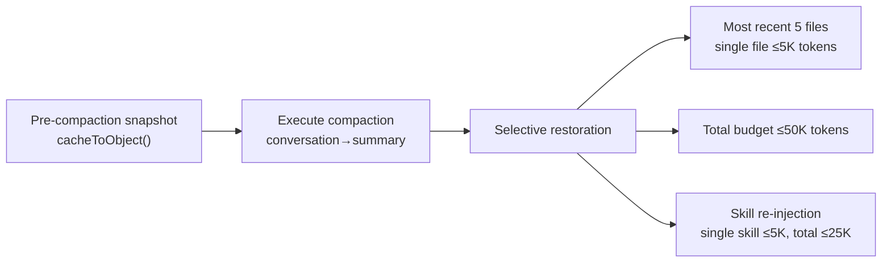
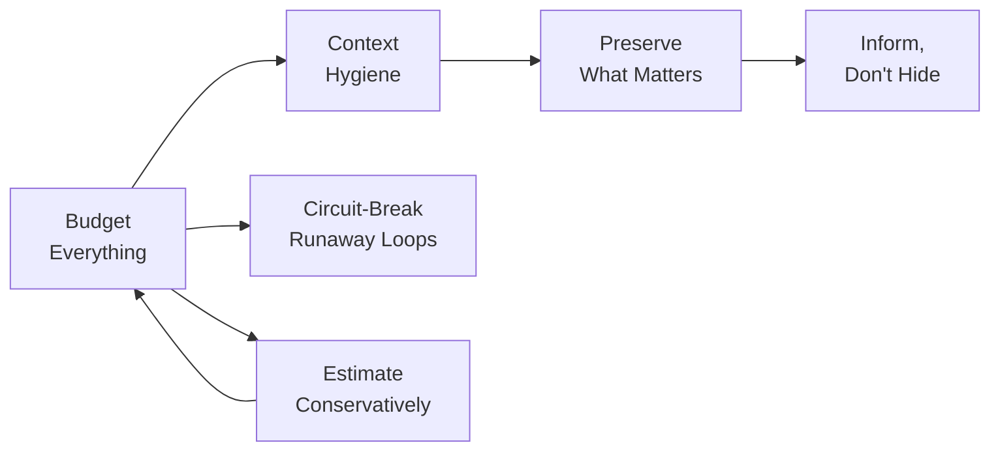

# Chapter 26: Context Management를 핵심 역량으로 (Context Management as a Core Competency)

## 왜 중요한가 (Why This Matters)

Claude Code의 전체 코드베이스에서 가장 과소평가된 서브시스템 하나를 꼽으라면, 그것은 context management일 것이다. Permission 시스템은 눈길을 끌고, Agent Loop는 핵심이며, prompt engineering은 널리 알려져 있지만 — context management는 AI Agent가 "효과적으로 계속 작업할 수 있는지"를 결정하는 핵심 인프라다.

200K token context window는 넉넉해 보이지만, 실제 시나리오에서는 예상보다 빠르게 소진된다: System Prompt가 약 15-20K를 차지하고, 각 tool call 결과가 5-50K를 차지하며, 파일 읽기와 코드 검색을 몇 라운드만 거치면 이미 절반을 사용하게 된다. 더 중요한 것은, context window는 단순한 "용량" 문제가 아니라 "정보 밀도" 문제라는 점이다. window가 오래된 tool 결과, 중복된 파일 내용, 이미 해결된 논의로 가득 차면 모델의 attention이 분산되고 응답 품질이 저하된다.

Part Three(Chapter 9-12)에서 분석한 context management 시스템은 6가지 핵심 원칙을 드러내며, 공통된 주제가 있다: **context window는 메모리만큼 신중하게 관리해야 하는 희소 자원이다**.

---

## 소스 코드 분석 (Source Code Analysis)

### 26.1 원칙 1: 모든 것에 예산을 설정하라 (Principle One: Budget Everything)

**정의**: context window에 들어가는 모든 콘텐츠는 명확한 token 예산 상한을 가져야 하며, 예외는 없다.

Claude Code의 예산 시스템은 context window 내 모든 콘텐츠 소스를 포괄한다:

| 콘텐츠 소스 | 예산 한도 | 소스 위치 |
|-------------|----------|----------|
| 단일 tool 결과 | 50K characters | `restored-src/src/constants/toolLimits.ts:13` |
| 단일 메시지 내 모든 tool 결과 | 200K characters | `restored-src/src/constants/toolLimits.ts:49` |
| 파일 읽기 | 기본 2000줄 + offset/limit 점진적 읽기 | Chapter 8 참조 |
| Skill 목록 | context window의 1% | `restored-src/src/tools/SkillTool/prompt.ts:20-23` |
| Compaction 후 파일 복원 | 최대 5개 파일, 파일당 5K tokens, 총 50K | `restored-src/src/services/compact/compact.ts:122` |
| Compaction 후 skill 복원 | skill당 5K tokens, 총 25K | Chapter 10 참조 |
| Agent 설명 목록 | 메인 prompt 크기 제어를 위해 attachment로 이동 | Chapter 15 참조 |

**Table 26-1: Claude Code의 token 예산 시스템**

설계의 세분화에 주목하라: "총 예산"만 있는 것이 아니라 "항목별 예산"도 있다. 두 가지의 소스:

```typescript
// restored-src/src/constants/toolLimits.ts:13
export const DEFAULT_MAX_RESULT_SIZE_CHARS = 50_000

// restored-src/src/constants/toolLimits.ts:49
export const MAX_TOOL_RESULTS_PER_MESSAGE_CHARS = 200_000
```

`MAX_TOOL_RESULTS_PER_MESSAGE_CHARS = 200_000`은 N개의 병렬 tool이 동시에 대용량 결과를 반환하여 context를 범람시키는 것을 방지한다 — 각 tool 결과가 50K 이내라 하더라도, 10개의 병렬 tool이 500K characters를 생성할 수 있다. 메시지별 예산은 이런 "합법적이지만 위험한" 조합에 대한 안전장치다.

Skill 목록에 대한 1% 예산은 특히 주목할 만하다:

```typescript
// restored-src/src/tools/SkillTool/prompt.ts:20-23
// Skill listing gets 1% of the context window (in characters)
export const SKILL_BUDGET_CONTEXT_PERCENT = 0.01
export const CHARS_PER_TOKEN = 4
export const DEFAULT_CHAR_BUDGET = 8_000 // Fallback: 1% of 200k × 4
```

사용자가 점점 더 많은 skill을 설치하면 skill 목록이 무한히 커질 수 있다. Claude Code의 해결책은 3단계 truncation cascade다: 먼저 설명을 truncate하고(`MAX_LISTING_DESC_CHARS = 250`), 그다음 우선순위가 낮은 skill을 truncate하며, 마지막으로 내장 skill의 이름만 유지한다. 이를 통해 사용자가 1,000개의 skill을 설치하더라도 skill 목록이 context window의 1%를 초과하지 않도록 보장한다.

**Anti-pattern: 무제한 콘텐츠 주입(Unbounded content injection)**. Tool 결과, 파일 내용, 또는 설정 정보를 제한 없이 context window에 주입하여 결국 낮은 정보 밀도의 콘텐츠로 context를 채우는 것.

---

### 26.2 원칙 2: Context 위생 (Principle Two: Context Hygiene)

**정의**: Context management는 이미 window에 있는 콘텐츠를 압축하는 것만이 아니라, 현재 agent의 목표와 무관한 고비용 정보를 주입 전에 능동적으로 필터링하는 것이다.

Claude Code는 sub-agent 시스템 내에서 이 원칙을 철저히 구현한다. `Explore` / `Plan` 같은 read-only agent는 메인 agent의 완전한 control plane을 상속받지 않는다: `runAgent()`는 조건이 충족되면 `CLAUDE.md` 계층적 지시사항을 능동적으로 생략하고, `Explore` / `Plan`에 대해서는 `gitStatus`도 추가로 제거한다. 이 정보가 절대 유용하지 않아서가 아니라, read-only 검색 agent에게는 일반적으로 **불필요한 부담(dead weight)**이기 때문이다: commit 규칙, PR 규칙, lint 제약은 메인 agent만 해석하면 되고, 오래된 `git status`는 수십 KB를 차지하지만 코드 검색에는 도움이 되지 않는다.

더 중요한 것은, 이 trimming이 token 압박이 발생한 후의 압축 보정이 아니라 **sub-agent의 context를 생성할 때** 일어난다는 점이다. 표준 sub-agent는 자체 대화 내에서 검색 노이즈를 격리하고, 부모에게는 압축된 결과만 반환한다; `Explore`는 심지어 기본적으로 `omitClaudeMd: true`를 사용한다. 이것이 "context hygiene"의 본질이다: 낮은 정보 밀도의 콘텐츠가 먼저 window에 들어간 후 압축 시스템이 나중에 정리해주길 바라지 마라.

**Anti-pattern: 전체 상속(Full inheritance)**. 모든 helper agent에 완전한 System Prompt, `CLAUDE.md`, git status, 최근 tool 출력, 사용자 설정을 모두 넣어서 모든 read-only 쿼리가 비싼 prefix에 대해 중복 비용을 지불하게 되는 것.

---

### 26.3 원칙 3: 중요한 것을 보존하라 (Principle Three: Preserve What Matters)

**정의**: Compaction은 필요하지만, compaction 후에는 가장 중요한 context를 선별적으로 복원해야 한다.

Auto-compaction(Chapter 9 참조)은 전체 대화 기록을 요약으로 압축하여 context 공간을 확보한다. 그러나 compaction은 구체적인 코드 내용, 파일 경로, 정확한 줄 번호 참조를 잃게 된다. 모델이 compaction 후 이전에 읽었던 파일의 내용을 완전히 잃으면 다시 읽어야 하므로, tool call과 사용자 대기 시간이 낭비된다.

Claude Code의 해결책은 **compaction 후 복원**(Chapter 10 참조)이다:

```typescript
// restored-src/src/services/compact/compact.ts:122
export const POST_COMPACT_MAX_FILES_TO_RESTORE = 5
```

복원 전략 흐름:



**Figure 26-1: Compaction-복원 흐름**

복원 전략의 핵심은 **선별성**이다: 모든 파일을 복원하는 것이 아니라 가장 최근 5개만; 완전한 파일 내용을 복원하는 것이 아니라 5K tokens 이내로 truncate; 총합은 50K를 초과하지 않는다. 이 숫자들은 신중하게 고려된 trade-off를 반영한다: **너무 많이 복원하면 compaction을 안 한 것과 같고, 너무 적게 복원하면 과도하게 compaction한 것과 같다**.

Skill 복원 설계도 마찬가지로 정교하다. Compaction 후 이미 전송된 skill(`sentSkillNames`)의 이름을 다시 주입하지 않는데, 모델이 여전히 SkillTool의 Schema를 보유하고 있기 때문이다 — skill 시스템이 존재한다는 것은 알지만 구체적인 skill 내용만 잊은 것이다. 이를 통해 약 4K tokens를 절약한다.

**Anti-pattern: 전면 compaction 또는 전면 보존(Full compaction or full preservation)**. 아무것도 복원하지 않거나(모델이 처음부터 다시 시작해야 함) 모든 것을 보존하려 시도하는 것(compaction 효과가 제로).

---

### 26.4 원칙 4: 숨기지 말고 알려라 (Principle Four: Inform, Don't Hide)

**정의**: 콘텐츠가 truncate되거나 압축될 때, 모델에게 무엇이 일어났는지 알려서 모델이 능동적으로 완전한 정보를 얻을 수 있게 해야 한다.

Claude Code는 여러 수준에서 이 원칙을 실천한다:

**Tool 결과 truncation 알림**. Tool 결과가 50K characters(`DEFAULT_MAX_RESULT_SIZE_CHARS`)를 초과하면, 완전한 결과가 디스크에 기록되고(`restored-src/src/utils/toolResultStorage.ts`), 모델은 truncation 알림과 전체 내용의 디스크 경로를 포함한 미리보기 메시지를 받는다. 따라서 모델은 (1) 보이는 것이 전부가 아니라는 것과 (2) 전체를 어떻게 얻는지를 안다.

**Cache micro-compaction 알림**(Chapter 11 참조). `cache_edits`가 오래된 tool 결과를 제거할 때, `notifyCacheDeletion()`이 모델에게 "일부 오래된 tool 결과가 정리되었다"고 알린다. 이를 통해 모델이 더 이상 존재하지 않는 콘텐츠를 참조하는 것을 방지한다.

**파일 읽기 pagination**. FileReadTool은 기본적으로 2000줄을 읽으며, offset/limit 매개변수를 통해 pagination을 지원한다. Tool 설명에 이 동작이 명시적으로 설명되어 있어 — 모델은 기본적으로 처음 2000줄만 보인다는 것을 알고, 이후 내용이 필요할 때 offset을 지정할 수 있다.

**Compaction 요약에서의 명시적 선언**. Compaction prompt(Chapter 9 참조)는 요약에 "진행 상황이 어디까지 왔는지"와 "아직 무엇을 해야 하는지"를 포함하도록 요구한다 — compaction 후 모델이 작업의 어느 단계에 있는지 알 수 있도록 보장한다. Compaction prompt의 `<analysis>` draft 블록(`restored-src/src/services/compact/prompt.ts:31`)은 모델이 먼저 대화 내용을 분석한 후 구조화된 요약을 생성하게 한다 — 분석 블록은 포매팅 시 제거되어 최종 context 공간을 차지하지 않는다.

**Anti-pattern: 무언의 truncation(Silent truncation)**. 모델이 모르게 tool 결과를 truncate하거나 context 내용을 삭제하는 것. 모델이 불완전한 정보를 바탕으로 잘못된 결정을 내리거나, 잘 기억나지 않는 내용을 "조작(fabricate)"할 수 있다 — 자신의 정보가 불완전하다는 사실을 모르기 때문이다.

---

### 26.5 원칙 5: 폭주하는 루프를 차단하라 (Principle Five: Circuit-Break Runaway Loops)

**정의**: 자동화된 프로세스가 연속으로 실패할 때, 무한히 재시도하는 대신 강제로 중단하는 메커니즘이 있어야 한다.

Auto-compaction circuit breaker가 가장 직접적인 구현이다. `MAX_CONSECUTIVE_AUTOCOMPACT_FAILURES = 3`(`restored-src/src/services/compact/autoCompact.ts:70`) — 3번 연속 실패 후 시도를 중단한다. 소스 코드 주석(전체 코드 참조는 Chapter 25, 원칙 6 참조)은 이 숫자에 대한 엔지니어링 근거를 문서화하고 있다: BigQuery 데이터에 따르면 1,279개 세션에서 50회 이상 연속 compaction 실패(최대 3,272회)가 발생했으며, 하루 약 250K API 호출을 낭비하고 있었다.

더 넓게 보면, Claude Code는 여러 서브시스템에 걸쳐 유사한 circuit-breaking 메커니즘을 구현한다:

| 서브시스템 | Circuit Break 조건 | Circuit Break 동작 | 소스 위치 |
|-----------|-------------------|-------------------|----------|
| Auto-compaction | 3회 연속 실패 | 세션 종료까지 compaction 중단 | `autoCompact.ts:70` |
| YOLO classifier | 3회 연속/총 20회 거부 | 수동 사용자 확인으로 fallback | `denialTracking.ts:12-15` |
| max_output_tokens 복구 | 최대 3회 재시도 | 재시도 중단, truncate된 출력 수용 | Chapter 3 참조 |
| Prompt-too-long | 가장 오래된 turn 삭제 → 20% 삭제 | 성능 저하 처리, 무한 삭제는 아님 | Chapter 9 참조 |

**Table 26-2: Claude Code의 circuit breaker 개요**

각 circuit breaker는 동일한 패턴을 따른다: **합리적인 재시도 한도를 설정하고, 초과 시 안전하지만 기능이 제한된 상태로 degradation하며, 충돌하거나 무한 루프에 빠지지 않는다**.

**Anti-pattern: 무한 재시도(Infinite retry)**. "Compaction 실패? 다시 시도. 또 실패? 다른 매개변수로 시도." 이것은 AI Agent에서 특히 위험하다 — 각 재시도가 API 호출(실제 돈)을 소비하고, 실패 원인이 대개 시스템적(context가 너무 커서 요약 token 예산 내에서 압축할 수 없음)이므로 재시도해도 결과가 바뀌지 않는다.

---

### 26.6 원칙 6: 보수적으로 추정하라 (Principle Six: Estimate Conservatively)

**정의**: Token 카운팅과 예산 배분에서 소비를 과소추정하는 것보다 과대추정하는 것이 낫다 — 과소추정은 overflow를 유발하고, 과대추정은 약간의 공간만 낭비할 뿐이다.

Claude Code의 token 추정은 모든 시나리오에서 보수적인 방향을 선택한다(Chapter 12 참조):

| 콘텐츠 유형 | 추정 전략 | 보수성 수준 | 이유 |
|------------|----------|-----------|------|
| 일반 텍스트 | 4 bytes/token | 중간 | 영어는 실제로 ~3.5-4.5 |
| JSON 콘텐츠 | 2 bytes/token | 매우 보수적 | 구조 문자가 비효율적으로 tokenize됨 |
| 이미지/문서 | 고정 2000 tokens | 매우 보수적 | 실제 공식은 width x height/750이지만, 메타데이터 없을 때 고정값 사용 |
| Cache tokens | API usage에서 가져옴 | 정확 (가능할 때) | API가 반환한 카운트만 권위 있음 |

**Table 26-3: Token 추정 전략 비교**

JSON을 2 bytes/token으로 추정하는 것은 특히 의미 있는 설계 선택이다. JSON 구조 문자(`{}`, `[]`, `""`, `:`, `,`)는 자연어보다 훨씬 비효율적으로 tokenize된다 — 100 bytes의 JSON은 40-50개 token을 소비할 수 있지만, 100 bytes의 영어는 25-30개 token만 필요하다. 일반적인 4 bytes/token 추정을 사용하면 JSON 밀도가 높은 tool 결과가 심각하게 과소추정되어 context overflow를 유발할 수 있다.

Skill 목록 예산도 이를 반영한다(`restored-src/src/tools/SkillTool/prompt.ts:22`): `CHARS_PER_TOKEN = 4`는 token 예산을 character 예산으로 변환하는 데 사용된다 — 가장 보수적인 characters/token 비율을 사용하여 초과 지출이 없도록 보장한다.

보수적 추정의 이점은 비용을 훨씬 능가한다. Token 소비를 과대추정했을 때 최악의 경우는 compaction이 일찍 발동되는 것이다 — 사용자가 몇 초 더 기다린다. Token 소비를 과소추정했을 때 최악의 경우는 `prompt_too_long` 오류다 — API 호출이 실패하고, 긴급 context 삭제가 필요하며, 중요한 정보를 잃을 수 있다.

**Anti-pattern: 정확한 카운팅이라는 환상(The illusion of exact counting)**. 클라이언트 측에서 token 카운트를 정밀하게 계산하려 시도하는 것. API 서버 측 tokenizer만이 정확한 값을 제공할 수 있다 — 클라이언트 측 카운트는 모두 추정이다. 추정인 이상, 안전한 방향으로 편향되어야 한다.

---

## 패턴 정제 (Pattern Distillation)

### 6가지 원칙 요약 표 (Six Principles Summary Table)

| 원칙 | 핵심 소스 코드 근거 | Anti-pattern |
|------|-------------------|-------------|
| Budget Everything | `toolLimits.ts:13,49` — 항목당 50K, 메시지당 200K | Unbounded content injection |
| Context Hygiene | `runAgent.ts:385-404` — read-only agent가 `CLAUDE.md`와 `gitStatus` 생략 | Full inheritance |
| Preserve What Matters | `compact.ts:122` — 가장 최근 5개 파일 복원 | Full compaction or full preservation |
| Inform, Don't Hide | `toolResultStorage.ts` — truncation 시 디스크 경로 제공 | Silent truncation |
| Circuit-Break Runaway Loops | `autoCompact.ts:70` — 3회 연속 실패 후 중단 | Infinite retry |
| Estimate Conservatively | `SkillTool/prompt.ts:22` — `CHARS_PER_TOKEN = 4` | The illusion of exact counting |

**Table 26-4: 6가지 Context Management 원칙 요약**

### 원칙 간 관계 (Relationships Between Principles)



**Figure 26-2: 6가지 context management 원칙의 관계도**

**Budget Everything**은 기반이다 — 각 콘텐츠 소스의 token 상한을 정의한다. **Context Hygiene**은 어떤 콘텐츠가 현재 window에 아예 들어가지 말아야 하는지를 결정한다. **Preserve What Matters**는 compaction 후 복원을 처리하고, **Inform, Don't Hide**는 모델이 무엇이 truncate되었는지 알도록 보장하며, **Circuit-Break Runaway Loops**는 자동화된 프로세스가 예산을 초과하는 것을 방지하고, **Estimate Conservatively**는 과소추정으로 예산이 우회되지 않도록 보장한다.

### 패턴: 계층적 Token 예산 (Pattern: Tiered Token Budget)

- **해결하는 문제**: 여러 콘텐츠 소스가 제한된 context 공간을 두고 경쟁하는 상황
- **핵심 접근법**: 소스별 독립 예산 + 총 예산, 초과 시 truncation cascade 처리
- **코드 템플릿**: 항목별 한도(50K) → 집계 한도(200K/message) → 전역 한도(context window - output reserve - buffer)
- **전제 조건**: 주입 전 콘텐츠의 token 소비를 추정할 수 있는 능력

### 패턴: Context Hygiene

- **해결하는 문제**: Read-only helper agent가 무관하지만 비용이 높은 prefix 콘텐츠를 반복적으로 상속하는 것
- **핵심 접근법**: 생성 시점에 현재 책임과 무관한 context를 생략하고, 탐색 노이즈를 sub-conversation 내에 격리
- **전제 조건**: 현재 agent가 실제로 소비할 context를 구분할 수 있는 능력

### 패턴: Compaction-복원 사이클 (Pattern: Compaction-Restoration Cycle)

- **해결하는 문제**: Compaction이 중요한 context를 잃는 것
- **핵심 접근법**: Compaction 전 snapshot → compact → 가장 최근/가장 중요한 콘텐츠를 선별적으로 복원
- **전제 조건**: "가장 최근에 사용된" 콘텐츠를 추적할 수 있는 능력

### 패턴: Circuit Breaker

- **해결하는 문제**: 비정상적 조건에서 자동화된 프로세스가 무한 루프에 빠지는 것
- **핵심 접근법**: N회 연속 실패 후 중단, 안전한 상태로 degradation
- **전제 조건**: "실패"의 기준과 degradation 후 동작의 정의

---

## 실천 방안 (What You Can Do)

1. **Agent의 context 소비를 감사하라**. 실제 시나리오에서 각 콘텐츠 소스가 얼마나 많은 token을 소비하는지 측정하고, 가장 큰 소비원을 파악하라
2. **Tool 결과에 크기 제한을 설정하라**. 파일 읽기, 데이터베이스 쿼리, API 호출 결과에 character/줄 수 상한이 있도록 보장하라
3. **Read-only helper를 경량화하라**. 검색형 및 계획형 agent는 기본적으로 완전한 `CLAUDE.md`, git status, 최근 tool 출력을 상속하지 않아야 한다
4. **Compaction 후 복원을 구현하라**. Agent가 context 압축을 사용한다면, 복원 전략을 설계하라 — compaction 후 모델이 제로부터 시작할 필요가 없도록
5. **Truncation 시 모델에게 알려라**. 모델에게 "이것은 truncate되었고, 전체 버전은 여기에 있다"고 말하라 — 이것이 무언으로 truncate하고 모델이 스스로 정보 격차를 발견하게 하는 것보다 훨씬 낫다
6. **Circuit breaker를 추가하라**. 잠재적으로 루프에 빠질 수 있는 모든 자동화된 프로세스에 재시도 한도를 설정하라. Degradation된 운영이 무한 루프보다 항상 낫다
