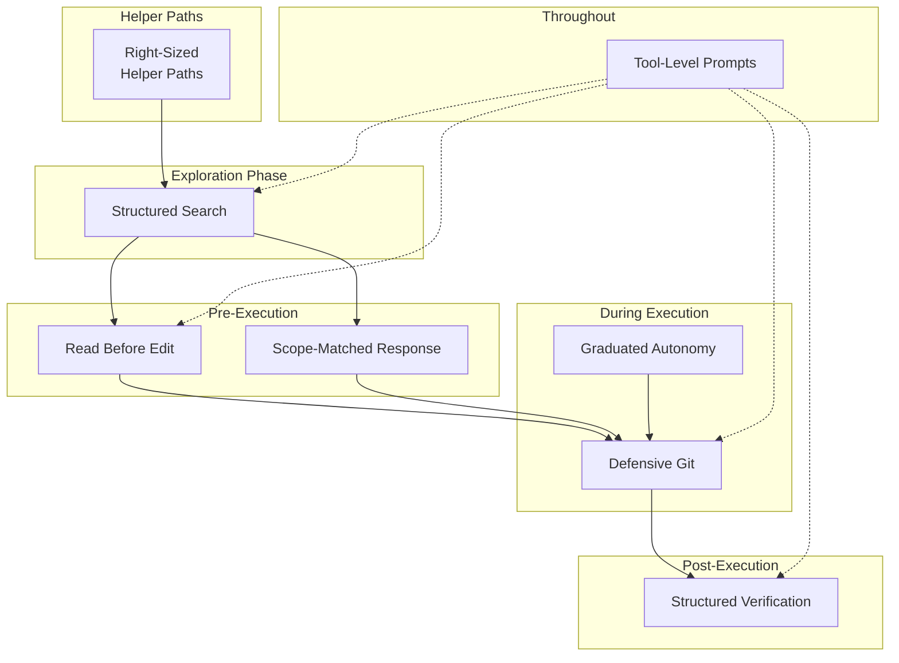

# Chapter 27: Production-Grade AI Coding Pattern

## 왜 중요한가 (Why This Matters)

앞선 두 Chapter에서는 "원칙(principles)"을 증류했다 — harness engineering과 context management에 대해 어떻게 사고할 것인지에 관한 고수준 지침이었다. 이번 Chapter는 다르다: **8가지 구체적이고 바로 재사용 가능한 coding pattern**에 초점을 맞춘다. 각 pattern은 Claude Code의 실제 구현에서 추출했으며, 명확한 문제 정의, 구현 접근법, 소스 코드 근거를 갖추고 있다.

이 pattern들은 공통 특성을 가진다: 사소해 보일 만큼 단순하지만, production 환경에서 반복적으로 필수적이라고 검증된 것들이다. "Read before edit" — 읽지 않고 편집하는 사람이 어디 있겠는가? 하지만 Claude Code는 tool error로 이를 강제한다. AI model이 실제로 읽기를 건너뛰고 바로 편집하기 때문이다. "Defensive Git" — 당연히 force push를 하면 안 되지만, Claude Code는 prompt 문단 전체를 할애하여 이를 강조한다. 압박 속에서 model이 실제로 가장 짧은 경로를 선택하기 때문이다.

---

## 소스 코드 분석 (Source Code Analysis)

### 27.1 Pattern 1: Read Before Edit

**문제**: AI model이 현재 파일 내용을 읽지 않고 편집을 시도하여, 오래되거나 잘못된 가정에 기반한 편집을 야기할 수 있다.

Claude Code는 이를 **이중 안전장치(dual-layer safeguard)**로 강제한다:

1. **Prompt 계층** (soft constraint): FileEditTool의 description에 "You must use your Read tool at least once in the conversation before editing. This tool will error if you attempt an edit without reading the file"이라고 명시되어 있다 (자세한 내용은 Chapter 8 참조)
2. **코드 계층** (hard constraint): FileEditTool의 `call()` 메서드가 편집을 실행하기 전에 현재 대화에 대상 파일에 대한 Read 호출이 포함되어 있는지 검사한다. 없으면 error를 반환한다

이중 안전장치의 설계적 의의는 다음과 같다: prompt는 "soft constraint"다 — model이 대부분의 경우 따르지만, 특정 조건(context가 너무 길어 지시가 "잊혀지거나," 다중 턴 대화에서 attention drift가 발생하는 경우)에서 무시될 수 있다. 코드 계층은 "hard constraint"다 — model이 prompt를 무시하더라도 tool 자체가 실행을 거부한다.

| 차원 | 설명 |
|------|------|
| **구현 방식** | Prompt 지시(soft constraint) + tool 코드 검사(hard constraint) |
| **소스 참조** | FileEditTool prompt (자세한 내용은 Chapter 8 참조) |
| **적용 시나리오** | 기존 콘텐츠를 수정해야 하는 모든 tool |
| **Anti-pattern** | 코드 계층에서의 강제 없이 prompt 지시에만 의존하는 것 |

---

### 27.2 Pattern 2: Graduated Autonomy

**문제**: AI Agent는 "매 단계마다 사용자에게 묻는 것"(낮은 효율)과 "전혀 묻지 않는 것"(높은 위험) 사이에서 균형을 찾아야 한다.

Claude Code는 가장 제한적인 것부터 가장 허용적인 것까지의 permission mode gradient를 설계했다 (자세한 내용은 Chapter 16 참조):

```
default → acceptEdits → plan → bypassPermissions → auto → dontAsk
  │           │           │           │               │       │
  │           │           │           │               │       └── Full autonomy
  │           │           │           │               └── Classifier auto-decides
  │           │           │           └── Skip permission checks
  │           │           └── Plan only, don't execute
  │           └── Auto-accept edits, confirm others
  └── Confirm every step
```

핵심 설계는 mode 자체가 아니라 **fallback을 갖춘 자동화(automation with fallback)**다. `auto` mode는 YOLO classifier(자세한 내용은 Chapter 17 참조)를 사용하여 자동으로 permission을 결정하지만, 두 가지 안전 밸브를 가진다. denial tracking 구현은 놀라울 만큼 간결하다:

```typescript
// restored-src/src/utils/permissions/denialTracking.ts:12-15
export const DENIAL_LIMITS = {
  maxConsecutive: 3,
  maxTotal: 20,
} as const

// restored-src/src/utils/permissions/denialTracking.ts:40-44
export function shouldFallbackToPrompting(
  state: DenialTrackingState
): boolean {
  return (
    state.consecutiveDenials >= DENIAL_LIMITS.maxConsecutive ||
    state.totalDenials >= DENIAL_LIMITS.maxTotal
  )
}
```

classifier가 연속 3회 또는 총 20회 작업을 거부하면, 시스템은 영구적으로 수동 사용자 확인으로 fallback한다. 이는 가장 자율적인 mode에서도 시스템이 인간 의사결정으로 돌아갈 수 있는 능력을 유지한다는 뜻이다. 자율성은 "전부 아니면 전무"가 아니라 연속적인 스펙트럼이며, 모든 지점에 안전망이 있다.

| 차원 | 설명 |
|------|------|
| **구현 방식** | 다중 레벨 permission mode + classifier 자동 결정 + denial tracking fallback |
| **소스 참조** | Permission mode (Chapter 16), YOLO classifier (Chapter 17), `denialTracking.ts:12-44` |
| **적용 시나리오** | 인간-기계 협업이 필요한 모든 AI Agent 시스템 |
| **Anti-pattern** | 이진적 permission: "수동"과 "자동"만 있고, 중간 지대나 안전 fallback이 없는 것 |

---

### 27.3 Pattern 3: Defensive Git

**문제**: AI model이 Git 작업을 수행할 때 "가장 짧은 경로"를 선택하여 데이터 손실이나 복구 어려운 상태를 초래할 수 있다.

Claude Code는 BashTool prompt에 완전한 Git Safety Protocol을 내장한다 (자세한 내용은 Chapter 8 참조). 핵심 규칙은 다음과 같다:

1. **절대 hook을 건너뛰지 않는다** (`--no-verify`): pre-commit hook은 프로젝트의 품질 관문이다
2. **절대 amend하지 않는다** (사용자가 명시적으로 요청하지 않는 한): `git commit --amend`는 이전 commit을 수정하며, hook 실패 후 사용하면 사용자의 이전 commit을 덮어쓰게 된다
3. **특정 파일을 지정한다**: `git add -A` 대신 `git add <specific-files>`를 사용하여, `.env`나 credential 파일이 실수로 추가되는 것을 방지한다
4. **절대 main/master에 force push하지 않는다**: 사용자가 요청하더라도 경고한다
5. **amend 대신 새 commit을 생성한다**: hook 실패 후에는 commit이 발생하지 않았으므로 — 그 시점에서 `--amend`는 **이전** commit을 수정하게 된다

규칙 5가 특히 중요하다. hook이 실패하면 model의 자연스러운 경향은 "문제를 고친 다음 amend하자"이지만 — prompt는 인과 관계를 명시적으로 설명한다:

> pre-commit hook 실패는 commit이 **발생하지 않았음**을 의미한다 — 따라서 `--amend`는 **이전** commit을 수정하게 되며, 이는 기존 작업을 파괴하거나 변경사항을 잃을 수 있다. 올바른 조치는 문제를 수정하고, 다시 staging한 후, **새로운** commit을 생성하는 것이다.

이 규칙들의 존재는 model이 실제로 이런 실수를 한다는 것을 나타낸다. 학습 데이터에는 "마지막 commit을 수정하기" 위해 amend를 권장하는 수많은 Git 튜토리얼이 포함되어 있지만 — hook 실패와 일반 commit을 구분하지 않는다.

| 차원 | 설명 |
|------|------|
| **구현 방식** | tool prompt에 명시적인 안전 프로토콜을 두어 일반적인 위험 작업 경로를 다룬다 |
| **소스 참조** | BashTool prompt의 Git Safety Protocol (자세한 내용은 Chapter 8 참조) |
| **적용 시나리오** | AI가 Git 작업을 수행할 수 있는 모든 시스템 |
| **Anti-pattern** | model의 "상식"에 의존하는 것 — model의 Git 지식은 맥락을 구분하지 않는 튜토리얼에서 온다 |

---

### 27.4 Pattern 4: Structured Verification

**문제**: AI model이 실제로 검증을 실행하지 않고 "테스트 통과" 또는 "코드가 정확하다"고 주장할 수 있다.

Claude Code는 system prompt에서 명확한 검증 체인을 수립한다 (자세한 내용은 Chapter 6 참조): 테스트 실행 → 출력 확인 → 정직하게 보고. 이 단순해 보이는 흐름은 여러 메커니즘을 통해 강화된다:

**되돌림 가능성 인식(reversibility awareness)**. 작업은 위험도에 따라 등급이 매겨지며, model은 이를 다르게 처리해야 한다:

| 작업 유형 | 예시 | 요구되는 model 행동 |
|-----------|------|-------------------|
| 되돌릴 수 있는 작업 | 파일 편집, 파일 생성, 읽기 전용 명령어 | 바로 실행 |
| 되돌릴 수 없는 작업 | 파일 삭제, force push, 메시지 전송 | 확인 후 실행 |
| 고위험 작업 | `rm -rf`, DROP TABLE, 프로세스 종료 | 위험 설명 + 확인 |

**범위 제약(scope constraints)**. model에게 "X에 대한 승인이 Y까지 확장되지 않는다"고 알린다 — 버그 수정이 테스트 케이스 수정이나 테스트 건너뛰기를 승인하지 않는다.

**반복 강화 지시문(reinforcement directives)**. Capybara v8은 model의 "검증 없이 완료를 주장하는" 경향에 대한 명시적 대책을 추가했다:

```typescript
// restored-src/src/constants/prompts.ts:211
// @[MODEL LAUNCH]: capy v8 thoroughness counterweight
`Before reporting a task complete, verify it actually works: run the
test, execute the script, check the output. Minimum complexity means
no gold-plating, not skipping the finish line. If you can't verify
(no test exists, can't run the code), say so explicitly rather than
claiming success.`
```

`@[MODEL LAUNCH]` 어노테이션은 이것이 model 버전에 특화된 행동 교정임을 나타낸다 — model이 업그레이드되면 팀은 이 지시문이 여전히 필요한지 재평가한다.

| 차원 | 설명 |
|------|------|
| **구현 방식** | 검증 체인(실행→확인→보고) + 되돌림 가능성 등급 + 범위 제약 |
| **소스 참조** | System prompt 검증 지시문 (Chapter 6), `prompts.ts:211` |
| **적용 시나리오** | AI가 코드를 수정하고 정확성을 검증해야 하는 모든 시나리오 |
| **Anti-pattern** | 실제 테스트 출력을 요구하지 않고 model의 자기 보고를 신뢰하는 것 |

---

### 27.5 Pattern 5: Scope-Matched Response

**문제**: AI model은 "부수적으로" 추가 작업을 하는 경향이 있다 — 버그를 고치면서 리팩토링하고, 기능을 추가하면서 문서를 업데이트하는 식으로 — 변경 범위가 통제 불능으로 확대된다.

Claude Code의 system prompt에는 극도로 구체적인 범위 제한 지시문이 연속으로 포함되어 있다 (자세한 내용은 Chapter 6 참조). 가장 핵심적인 세트는 `getSimpleDoingTasksSection()`에서 나온다:

```typescript
// restored-src/src/constants/prompts.ts:200-203
"Don't add features, refactor code, or make 'improvements' beyond what
 was asked. A bug fix doesn't need surrounding code cleaned up. A simple
 feature doesn't need extra configurability. Don't add docstrings,
 comments, or type annotations to code you didn't change."

"Don't add error handling, fallbacks, or validation for scenarios that
 can't happen. Trust internal code and framework guarantees."

"Don't create helpers, utilities, or abstractions for one-time operations.
 Don't design for hypothetical future requirements. ... Three similar
 lines of code is better than a premature abstraction."
```

이 지시문들의 구체성에 주목하라 — 추상적인 "간단하게 유지하라"가 아니라, 판단 가능한(decidable) 규칙이다: "수정하지 않은 코드에 docstring을 추가하지 마라," "세 줄 반복이 성급한 추상화보다 낫다."

또 다른 우아한 범위 제한은 "승인이 확장되지 않는다"이다. 사용자가 `git push`를 승인하면 model은 이를 "사용자가 모든 Git 작업을 승인한다"로 해석할 수 있다. prompt는 이 추론을 깨뜨린다: 승인의 범위는 명시적으로 지정된 것에 한하며, 그 이상은 아무것도 아니다.

| 차원 | 설명 |
|------|------|
| **구현 방식** | system prompt의 명시적 범위 제한 + 최소 복잡도 원칙 |
| **소스 참조** | `prompts.ts:200-203` (최소주의 지시문 세트) |
| **적용 시나리오** | 모든 AI 지원 코딩 시나리오 |
| **Anti-pattern** | "철저함"을 장려하는 것 — "코드 품질을 보장해 주세요"는 model에게 무제한의 범위를 부여한다 |

---

### 27.6 Pattern 6: Tool-Level Prompts Over Generic Instructions

**문제**: 범용 system prompt에 지시문이 너무 많으면 model이 적시에 올바른 지시를 떠올리기 어렵다.

Claude Code는 모든 행동 지시를 system prompt에 몰아넣는 대신, 각 tool이 자체적인 행동 harness를 갖도록 한다 (자세한 내용은 Chapter 8 참조):

| 위치 | 내용 |
|------|------|
| System prompt | 일반 행동 지시, 출력 형식, 보안 원칙 |
| BashTool description | Git safety protocol, sandbox 설정, background task 지시 |
| FileEditTool description | "Read before edit," 최소 고유 `old_string`, `replace_all` 사용법 |
| FileReadTool description | 기본 줄 수, offset/limit pagination, PDF 페이지 범위 |
| GrepTool description | ripgrep 문법, multiline matching, "grep 대신 항상 Grep을 사용하라" |
| AgentTool description | fork 가이드, isolation mode, "fork 출력을 엿보지 마라" |
| SkillTool description | budget 제약, 3단계 truncation cascade, built-in skill 우선순위 |

tool-level prompt의 장점은 **시간적 정렬(temporal alignment)**이다: model이 BashTool을 호출하기로 결정하면, BashTool의 description(Git safety protocol 포함)이 attention 초점 안에 있다. Git safety protocol이 system prompt에 있었다면, model은 수만 token의 context에서 이를 "떠올려야" 하며 — 긴 session에서는 신뢰할 수 없다.

tool-level prompt의 또 다른 장점은 **cache 효율성**이다. tool description은 `tools` parameter의 일부로서 API 요청에서 비교적 안정적인 위치를 차지한다. tool description을 수정하면 tool 목록 hash만 영향을 받고, system prompt 세그먼트에는 영향을 미치지 않는다 — cache break detection(`restored-src/src/services/api/promptCacheBreakDetection.ts:36-38`)의 `perToolHashes`는 정확히 어떤 tool의 description이 변경되었는지를 추적하기 위해 존재하며, 전체 cache prefix를 무효화하지 않는다.

| 차원 | 설명 |
|------|------|
| **구현 방식** | 행동 지시문이 tool description을 따르며, tool이 호출될 때 자연스럽게 model의 attention에 진입한다 |
| **소스 참조** | 각 tool의 prompt 필드 (자세한 내용은 Chapter 8 참조), `promptCacheBreakDetection.ts:36-38` |
| **적용 시나리오** | 다수의 tool을 제공하는 모든 AI Agent |
| **Anti-pattern** | 중앙 집중식 지시 라이브러리 — 모든 지시를 system prompt에 넣어, 긴 session에서 준수율이 하락하는 것 |

---

### 27.7 Pattern 7: Structured Search Over Shell Text Parsing

**문제**: model이 `grep`, `find`, `ls` 등 shell 명령의 원시 출력을 직접 소비하면, 매 라운드마다 `path:line:text`, 줄바꿈으로 구분된 경로, count 요약, 다양한 노이즈 접두사를 파싱해야 한다. 검색 라운드가 늘어날수록, 이 "model에게 반복적으로 문자열 분할을 시키는" 접근법은 context와 reasoning budget을 모두 낭비한다.

Claude Code의 검색 설계는 이미 반대 방향을 부분적으로 반영한다: **검색은 Bash의 사용 사례가 아니라 독립적인 읽기 전용 tool이다** (자세한 내용은 Chapter 8 참조). `GrepTool`과 `GlobTool` 모두 내부적으로 shell pipeline이 아닌 전용 구현을 사용하며, 내부적으로 구조화된 결과를 먼저 생성한 다음, model이 소비할 수 있는 최소 형태로 직렬화하여 `tool_result`로 전달한다.

`GrepTool`의 내부 출력은 검색 패턴, 파일 목록, 매칭 콘텐츠, count, pagination 정보를 포함한다:

```typescript
// Simplified from GrepTool's outputSchema
{
  mode: 'content' | 'files_with_matches' | 'count',
  numFiles,
  filenames,
  content,
  numLines,
  numMatches,
  appliedLimit,
  appliedOffset,
}
```

`GlobTool`의 내부 출력도 마찬가지로 구조화된 객체이며, `rg --files`의 원시 stdout을 model에 직접 전달하는 것이 아니다:

```typescript
// Simplified from GlobTool's outputSchema
{
  durationMs,
  numFiles,
  filenames,
  truncated,
}
```

하지만 더 흥미로운 것은 다음 단계다: Claude Code는 이 객체들을 model에게 완전히 JSON 직렬화하여 돌려주지 **않는다**. 대신, "내부적으로 구조화하되 외부적으로 텍스트화하는" 절충안을 택한다. `GrepTool`은 `files_with_matches` mode에서 파일 경로 목록만 반환하고, `count` mode에서 `path:count` 요약을 반환하며, `content` mode에서만 실제 매칭 줄을 반환한다; `GlobTool`은 경로 목록과 truncation 힌트만 반환한다. 이는 실제 최적화 대상이 "구조 그 자체"가 아니라, **harness가 구조를 소유하고 model은 현재 결정에 필요한 최소한의 정보만 보게 하는 것**임을 보여준다.

harness engineering 관점에서 이는 `grep`/`glob` 자체보다 더 중요한 pattern으로 이어진다: **단계적 검색 프로토콜(phased search protocol)**. 이상적인 agent-native 검색은 model이 처음부터 대량의 매칭 줄을 한꺼번에 삼키게 해서는 안 되며, 세 단계로 분리해야 한다:

1. **후보 파일 계층**: 먼저 경로, 안정적 ID, 수정 시각 등 경량 메타데이터를 반환하여 "어떤 파일이 볼 가치가 있는지"에 답한다
2. **Hit 요약 계층**: 그 다음 파일당 매치 수, 첫 hit 위치, 첫 발췌문을 반환하여 "어떤 파일을 먼저 펼칠지"에 답한다
3. **Snippet 확장 계층**: 마지막으로 선택된 파일에 대해서만 정밀한 snippet과 줄 번호를 반환하여 "어떤 특정 코드 구간을 볼 것인지"에 답한다

Claude Code는 아직 이 세 계층을 독립적인 tool로 완전히 분리하지 않았지만, 기존 구현에는 이미 두 가지 핵심 전제조건이 있다: **전용 검색 tool**과 **구조화된 중간 결과**. 추가적인 근거로 `ToolSearchTool`은 이미 `tool_reference` — 일반 텍스트에 국한되지 않는 더 풍부한 block type — 를 반환할 수 있다. 이는 Claude Code 같은 harness에서 "model이 직접 shell 텍스트를 파싱하는 것"이 유일한 옵션이 아니며, 최선의 옵션도 아닐 수 있음을 나타낸다.

| 차원 | 설명 |
|------|------|
| **구현 방식** | 전용 Grep/Glob tool + 구조화된 중간 결과 + 텍스트화된 최소 반환 |
| **소스 참조** | `GrepTool.ts` / `GlobTool.ts`의 `outputSchema` 및 `mapToolResultToToolResultBlockParam()`; `ToolSearchTool.ts`의 `tool_reference` 반환 |
| **적용 시나리오** | 대규모 codebase 탐색, 다중 라운드 검색, sub-agent 조사, 엄격한 context 비용 제어가 필요한 시스템 |
| **Anti-pattern** | 검색을 Bash `grep/find/cat` 텍스트 파이프라인으로 격하시키고, model에게 매 라운드마다 문자열을 다시 파싱하게 하는 것 |

---

### 27.8 Pattern 8: Right-Sized Helper Paths

**문제**: 모든 쿼리가 메인 loop의 무거운 model, 전체 tool pool, 다중 턴 agent loop를 따른다면, 경량 helper path가 비싸고 느려지며, 태스크가 요구하는 것보다 더 많은 capability surface를 부여받게 된다.

Claude Code의 접근법은 무작정 "전역적으로 작은 model로 전환"하는 것이 아니라, 호출 지점별로 **가장 비용이 큰 차원을 줄이는** 것이다. session 제목 생성과 tool 사용 요약은 모두 `queryHaiku()`를 거치며; `claude.ts`도 `compact`, `side_question`, `extract_memories` 등을 `non-agentic queries`로 분류한다. 한편 `/btw`는 작은 model로 새 Agent를 띄우는 것이 아니라, 부모 session의 context를 상속하고 `runForkedAgent()`를 통해 one-shot side query를 실행하며, tool capability를 0으로, 턴을 1로 줄인다.

이는 Claude Code의 실제 pattern이 단순히 "로컬 model 선택"이 아니라, 더 일반적인 **capability right-sizing**임을 보여준다: 때로는 model을 줄이고, 때로는 tool을 줄이고, 때로는 턴을 줄이고, 때로는 context를 줄인다. 표준 sub-agent, fork, `/btw`, title/summary helper는 각각 다른 차원을 따라 축소한다.

| Path | Context | Tools | Turns | Model |
|------|---------|-------|-------|-------|
| Main Loop | 전체 메인 대화 | 전체 tool pool | Multi-turn | Main model |
| Standard Sub-Agent | 새 context | 역할별 조립 | Multi-turn | 재정의 가능 |
| `/btw` | 부모 context 상속 | 전부 비활성화 | Single-turn | 부모 model 상속 |
| Title/Summary helper | 최소 입력 | tool 없음 | Single-turn | Haiku |

여기서 가장 가치 있는 교훈은: **모든 helper path에 동일한 "풀 기능 Agent" 형태를 부여하지 마라**이다. Side Question이 경량인 이유는 "현재 질문에 답하는" 데 필요한 capability만 유지하기 때문이다; title 생성이 저렴한 이유는 "짧은 문자열을 생성하는" 데 필요한 model 강도만 유지하기 때문이다. Claude Code는 "model 크기, tool 권한, 턴 budget, context 상속"을 네 가지 독립적으로 조절 가능한 노브(knob)로 취급하며, 전역적으로 통합된 설정이 아니다.

| 차원 | 설명 |
|------|------|
| **구현 방식** | 호출 지점별로 model/tool/턴/context를 독립적으로 축소 |
| **소스 참조** | `sessionTitle.ts`, `toolUseSummaryGenerator.ts`, `claude.ts`, `sideQuestion.ts` |
| **적용 시나리오** | title 생성, 요약, 빠른 side question, memory 추출, 읽기 전용 조사 및 기타 helper path |
| **Anti-pattern** | 모든 helper 쿼리가 main model, 전체 tool pool, multi-turn loop을 사용하는 것 |

---

## Pattern 증류 (Pattern Distillation)

### 8가지 Pattern 요약 표 (Eight Patterns Summary Table)

| Pattern | 구현 방식 | 소스 참조 |
|---------|----------|----------|
| Read Before Edit | Prompt(soft) + tool 코드 검사(hard) | FileEditTool (Chapter 8) |
| Graduated Autonomy | 다중 레벨 permission + classifier + denial tracking fallback | `denialTracking.ts:12-44` |
| Defensive Git | tool prompt에 완전한 safety protocol | BashTool prompt (Chapter 8) |
| Structured Verification | 실행→확인→보고 + 되돌림 가능성 등급 | `prompts.ts:211` |
| Scope-Matched Response | 구체적이고 판단 가능한 범위 제한 지시문 | `prompts.ts:200-203` |
| Tool-Level Prompts | 행동 지시문을 해당 tool에 부착 | 각 tool의 prompt + `perToolHashes` |
| Structured Search | 전용 검색 tool + 구조화된 중간 결과 + 단계적 확장 | `GrepTool.ts`, `GlobTool.ts`, `ToolSearchTool.ts` |
| Right-Sized Helper Paths | 호출 지점별 model/tool/턴/context 축소 | `sessionTitle.ts`, `toolUseSummaryGenerator.ts`, `sideQuestion.ts` |

**표 27-1: 8가지 production-grade pattern 요약**

### Tool 실행 생명주기에서의 Pattern 위치 (Pattern Positions in the Tool Execution Lifecycle)



**그림 27-1: 8가지 pattern의 tool 실행 생명주기 내 위치**

**Right-Sized Helper Paths**는 helper path에서 작동한다 — helper 쿼리가 정말로 무거운 model, 전체 tool, multi-turn 상태를 필요로 하는지 결정한다. **Structured Search**는 가장 이른 탐색 단계에 위치한다 — model이 어떤 검색 결과를 보는지, 그리고 이 결과가 어떤 세분도(granularity)로 context에 진입하는지를 결정한다. **Tool-Level Prompts**는 전체 생명주기를 관통한다 — 나머지 7가지 pattern은 모두 tool prompt를 통해 구현된다. **Read Before Edit**와 **Scope-Matched Response**는 실행 전 준비를 제약한다. **Defensive Git**와 **Graduated Autonomy**는 실행 중 안전 경계를 제어한다. **Structured Verification**은 실행 후 정확성을 보장한다.

### 글로벌 Pattern: 이중 계층 제약 (Global Pattern: Dual-Layer Constraint)

- **해결하는 문제**: prompt만으로는 model의 규칙 준수를 100% 보장할 수 없다
- **핵심 접근법**: 고위험 행동에 대해 prompt를 "soft constraint"로, 코드를 "hard constraint"로 사용한다
- **코드 템플릿**: tool description이 규칙을 명시 → `call()` 메서드가 전제조건 검사 → 불충족 시 error 반환
- **전제조건**: 코드 계층에서 전제조건을 감지할 수 있는 능력

### 글로벌 Pattern: 안전 기울기 (Global Pattern: Safety Gradient)

- **해결하는 문제**: 다른 태스크는 다른 정도의 자율성을 요구한다
- **핵심 접근법**: 다중 레벨 mode, 각각 명확한 안전망을 가짐
- **전제조건**: 작업의 위험 수준을 평가할 수 있는 능력

### 글로벌 Pattern: 단계적 검색 프로토콜 (Global Pattern: Phased Search Protocol)

- **해결하는 문제**: 개방형 codebase 검색이 빠르게 context를 소진하고 model이 텍스트 결과를 반복적으로 파싱하게 만든다
- **핵심 접근법**: 먼저 후보 파일을 반환하고, 다음으로 hit 요약, 그 다음 요청 시 정밀한 snippet을 확장한다
- **전제조건**: 검색 tool이 원시 stdout이 아닌 pagination, count, 안정적 참조를 반환할 수 있어야 한다

### 글로벌 Pattern: Capability Right-Sizing

- **해결하는 문제**: helper 쿼리가 기본적으로 메인 thread의 전체 capability를 상속하여, 비용과 위험이 필요 이상으로 높아진다
- **핵심 접근법**: 하나의 "풀 기능 agent"만 제공하는 것이 아니라, 호출 지점별로 model, tool, 턴 또는 context를 독립적으로 축소한다
- **전제조건**: runtime이 model 라우팅, tool 권한, 턴 budget을 독립적으로 제어할 수 있어야 한다

---

## 실천 가이드 (What You Can Do)

1. **핵심 행동에 이중 계층 제약을 구현하라**. 행동 위반이 되돌릴 수 없는 결과를 초래한다면, prompt에만 의존하지 말고 — tool 코드에 전제조건 검사를 추가하라
2. **이진 스위치가 아닌 permission gradient를 설계하라**. Agent에 최소 3단계의 자율성 수준을 제공하라: 수동 확인, classifier 자동 결정(fallback 포함), 완전 자율
3. **Git 작업 prompt에 인과 관계를 명시적으로 설명하라**. "amend하지 마라"만으로는 부족하다 — "hook 실패 후 amend하면 이전 commit이 수정되어 변경 사항이 소실된다"고 설명하라
4. **model에게 검증 출력을 보여줄 것을 요구하라**. "테스트 통과"라는 텍스트 보고를 수용하지 말고 — 실제 테스트 출력을 보여줄 것을 요구하라
5. **모호한 지시를 구체적 규칙으로 대체하라**. "코드 품질을 유지하라"를 "수정하지 않은 코드에 주석을 추가하지 마라," "세 줄 반복이 성급한 추상화보다 낫다"로 대체하라
6. **행동 지시문을 해당 tool에 부착하라**. Git 안전 규칙은 Bash tool description에, 파일 작업 규칙은 파일 tool description에 넣어라 — 모든 것을 system prompt에 쌓지 마라
7. **model에게 shell 검색 텍스트를 반복적으로 파싱하게 하지 마라**. 검색을 "후보 파일 → hit 요약 → 정밀 snippet" 세 단계로 분리하는 것이 대량의 `grep` 출력을 처음부터 반환하는 것보다 context 효율적이다
8. **모든 helper에 전체 capability를 부여하지 마라**. title, 요약, side question, memory 추출 path는 각각 model, tool 또는 턴을 별도로 축소해야 하며, 메인 Loop을 그대로 복사하면 안 된다
