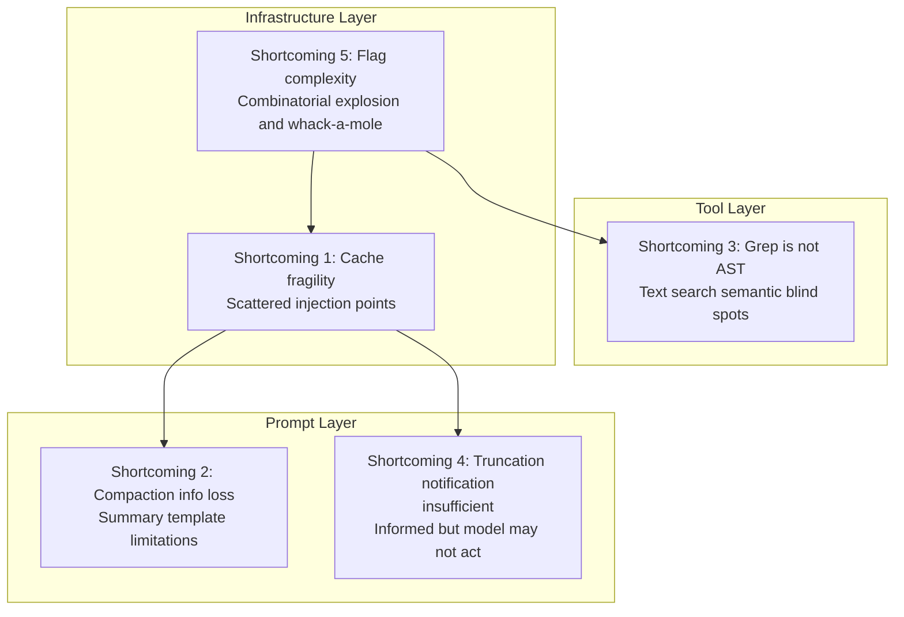
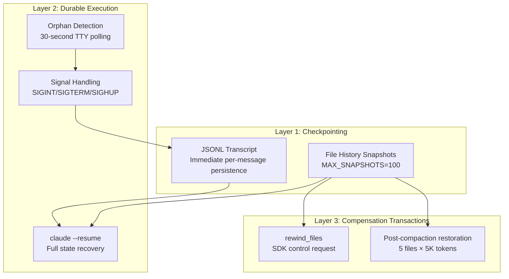

# Chapter 28: Claude Code의 한계점 (그리고 당신이 고칠 수 있는 것들)

## 왜 중요한가 (Why This Matters)

앞선 세 Chapter에서는 Claude Code의 뛰어난 설계를 정리했다 — harness engineering 원칙, context 관리 전략, production-grade 코딩 패턴. 그러나 진지한 기술 분석은 "잘한 점"만 논의할 수 없다 — "부족한 점"도 객관적으로 검토해야 한다.

이 Chapter에서는 소스 코드에서 관찰 가능한 5가지 설계상의 한계를 나열한다. 각 한계에는 세 가지 파트가 포함된다: **문제 설명** (무엇인지), **소스 코드 근거** (왜 문제인지), **개선 제안** (무엇을 할 수 있는지).

강조해야 할 점이 있다: 이러한 분석은 전적으로 엔지니어링 설계 수준에서 이루어지며, Anthropic 팀의 역량에 대한 평가를 포함하지 않는다. 모든 "한계"는 특정 엔지니어링 trade-off 내에서의 합리적인 선택이다 — 다만 이러한 선택에는 관찰 가능한 비용이 따를 뿐이다.

---

## 소스 코드 분석 (Source Code Analysis)

### 28.1 한계 1: Cache 취약성 — 분산된 injection 지점이 cache break 위험을 초래한다

#### 문제 설명 (Problem Description)

Claude Code의 prompt caching 시스템은 핵심 가정에 의존한다: **`SYSTEM_PROMPT_DYNAMIC_BOUNDARY` 이전의 콘텐츠가 세션 전체에서 변경되지 않는다는 것이다**. 그러나 여러 분산된 injection 지점이 이 영역을 수정할 수 있다:

- `systemPromptSections.ts`의 조건부 섹션: Feature Flag 또는 runtime 상태에 따라 포함되거나 제외됨
- MCP 연결/해제 이벤트: `DANGEROUS_uncachedSystemPromptSection()`이 명시적으로 "cache를 깨뜨릴 것"이라고 표시
- Tool 목록 변경: MCP 서버의 가동/중단이 `tools` parameter hash 변경을 유발
- GrowthBook Flag 전환: 원격 설정 변경이 직렬화된 tool schema 변경을 유발

#### 소스 코드 근거 (Source Code Evidence)

cache break 감지 시스템이 거의 20개의 필드를 추적해야 한다는 것(`restored-src/src/services/api/promptCacheBreakDetection.ts:28-69`)이 직접적인 증거다 — cache가 안정적이었다면 "왜 깨졌는지"를 설명하기 위한 이렇게 복잡한 감지 시스템은 필요하지 않았을 것이다.

`DANGEROUS_uncachedSystemPromptSection()`이라는 이름 자체가 경고 표시다 — 함수명의 `DANGEROUS` 접두사는 팀이 cache를 깨뜨린다는 것을 잘 알고 있음을 나타내지만, 특정 시나리오(MCP 상태 변경)에서는 더 나은 대안이 없다.

Agent 목록은 한때 system prompt에 인라인되어 있었으며, 전체 `cache_creation` token의 10.2%를 차지했다(자세한 내용은 Chapter 15 참조). 이후 attachment로 이동되었지만, 경험 많은 팀조차 불안정한 콘텐츠를 cache 세그먼트 내에 부주의하게 배치할 수 있음을 보여준다.

`splitSysPromptPrefix()`의 세 가지 코드 경로(`restored-src/src/utils/api.ts:321-435`) — MCP tool 기반, global+boundary, 기본 org-level — 의 복잡성은 전적으로 "cache 세그먼트 내에서 발생할 수 있는 다양한 변경"을 처리하는 데서 비롯된다. 소스 코드 주석이 명시적으로 상호 참조를 표시한다:

```typescript
// restored-src/src/constants/prompts.ts:110-112
// WARNING: Do not remove or reorder this marker without updating
// cache logic in:
// - src/utils/api.ts (splitSysPromptPrefix)
// - src/services/api/claude.ts (buildSystemPromptBlocks)
```

이러한 파일 간 `WARNING` 주석은 아키텍처 취약성의 신호다 — 컴포넌트들이 명시적 interface가 아닌 암묵적 관례를 통해 결합되어 있다.

#### 개선 제안 (Improvement Suggestions)

**Prompt 구성의 중앙 집중화**. 분산된 injection을 중앙 집중식 구성으로 전환한다:

1. **Build 단계**: 모든 섹션이 중앙 함수에서 조립되고, 조립 후 전체 hash가 계산된다
2. **불변성 제약**: cache 세그먼트 콘텐츠에 대해 compile-time 또는 runtime 불변성 검사를 적용한다 — 세션 중 변경되는 콘텐츠는 cache 세그먼트 외부로 강제된다
3. **변경 감사**: commit 전에 "cache 세그먼트 내에 불안정한 콘텐츠가 추가되었는지" 자동 감지한다

---

### 28.2 한계 2: Compaction 정보 손실 — 9섹션 요약 템플릿이 모든 추론 체인을 보존할 수 없다

#### 문제 설명 (Problem Description)

Auto-compaction(자세한 내용은 Chapter 9 참조)은 구조화된 prompt 템플릿을 사용하여 모델에게 대화 요약을 생성하도록 요구한다. compaction prompt(`restored-src/src/services/compact/prompt.ts`)는 `<analysis>` 블록에 다음을 포함하도록 요구한다:

```typescript
// restored-src/src/services/compact/prompt.ts:31-44
"1. Chronologically analyze each message and section of the conversation.
    For each section thoroughly identify:
    - The user's explicit requests and intents
    - Your approach to addressing the user's requests
    - Key decisions, technical concepts and code patterns
    - Specific details like:
      - file names
      - full code snippets
      - function signatures
      ..."
```

이것은 신중하게 설계된 체크리스트이지만, 근본적인 한계가 있다: **모델의 추론 체인과 실패한 시도가 compaction에서 손실된다**.

손실되는 정보의 구체적인 유형:

- **실패한 접근법**: 모델이 접근법 A를 시도했지만 실패하고, 접근법 B를 사용하여 성공했다 — compaction 후에는 "접근법 B를 사용하여 문제를 해결했다"만 보존되고, 접근법 A의 실패 경험은 손실된다
- **결정 맥락**: 접근법 A 대신 접근법 B를 선택한 이유가 결론으로 단순화된다
- **정확한 참조**: 구체적인 파일 경로와 줄 번호가 요약에서 일반화될 수 있다 — "`auth/middleware.ts:42-67`을 수정했다" 대신 "인증 모듈을 수정했다"

#### 소스 코드 근거 (Source Code Evidence)

compaction token 예산은 `MAX_OUTPUT_TOKENS_FOR_SUMMARY = 20_000`이다(`restored-src/src/services/compact/autoCompact.ts:30`). 압축 비율은 7:1 이상에 도달할 수 있다 — 이러한 압축 비율에서 정보 손실은 불가피하다.

compaction 이후 파일 복원 메커니즘(`POST_COMPACT_MAX_FILES_TO_RESTORE = 5`, `restored-src/src/services/compact/compact.ts:122`)이 문제를 부분적으로 완화하지만, 파일 내용만 복원할 뿐 추론 체인은 복원하지 않는다.

`NO_TOOLS_PREAMBLE`(`restored-src/src/services/compact/prompt.ts:19-25`)의 존재는 또 다른 compaction 품질 문제를 시사한다: 모델이 compaction 중 요약 텍스트를 생성하는 대신 tool을 호출하려고 시도하는 경우가 있으며(Sonnet 4.6에서 2.79% 발생률), 명시적으로 금지해야 한다. 이는 compaction 작업 자체가 모델에게 단순하지 않다는 것을 의미한다.

#### 개선 제안 (Improvement Suggestions)

**구조화된 정보 추출 + 계층적 compaction**:

1. **구조화된 추출**: compaction 전에 전용 단계를 사용하여 구조화된 정보를 추출한다 — 파일 수정 목록, 실패한 접근법 목록, 결정 그래프 — 자연어 요약이 아닌 JSON으로 저장
2. **계층적 compaction**: 대화를 "사실 계층"(파일 수정, 명령어 출력)과 "추론 계층"(왜 이렇게 했는지)으로 분리한다. 사실 계층은 추출적 압축(직접 추출)을 사용하고, 추론 계층은 추상적 압축(현재 방식)을 사용한다
3. **실패 기억**: "시도했지만 실패한 접근법" 목록을 구체적으로 보존하여, compaction 이후 모델이 과거 실패를 반복하는 것을 방지한다

---

### 28.3 한계 3: Grep은 AST가 아니다 — 텍스트 검색은 의미적 관계를 놓친다

#### 문제 설명 (Problem Description)

Claude Code의 코드 검색은 전적으로 GrepTool(텍스트 regex 매칭)과 GlobTool(파일명 패턴 매칭)에 기반한다. 이는 대부분의 시나리오에서 잘 작동하지만, **의미 수준의 코드 관계**를 다루지 못한다:

- **Dynamic import**: `require(variableName)` — 변수가 runtime 값이므로 텍스트 검색으로 추적할 수 없다
- **Re-export**: `export { default as Foo } from './bar'` — `Foo`의 정의를 검색할 때 올바르게 추적되지 않는다
- **문자열 참조**: 문자열로 등록된 tool 이름(`name: 'Bash'`) — tool 사용 지점을 검색하려면 문자열과 변수명 모두를 검색해야 한다
- **타입 추론**: TypeScript의 타입 추론은 많은 변수에 명시적 annotation이 없음을 의미한다 — 특정 타입의 사용 위치를 검색하는 것이 불완전하다

#### 소스 코드 근거 (Source Code Evidence)

Claude Code의 자체 tool 목록에는 40개 이상의 tool이 포함되어 있지만(자세한 내용은 Chapter 2 참조), AST 쿼리 tool은 없다. system prompt는 명시적으로 모델에게 Bash의 grep 대신 Grep을 사용하도록 안내한다(자세한 내용은 Chapter 8 참조) — 그러나 이는 단지 텍스트 검색을 한 tool에서 다른 tool로 옮긴 것일 뿐, 검색의 의미 수준을 높이지는 않는다.

Claude Code의 자체 코드베이스(1,902개의 TypeScript 파일)에서 이러한 누락의 영향을 관찰할 수 있다. 예를 들어: Feature Flag는 `feature('KAIROS')` 호출을 통해 사용된다 — 문자열 `KAIROS`를 검색하면 사용 지점을 찾을 수 있지만, `feature` 함수의 호출을 검색하면 89개 flag 전체의 결과가 반환되어 노이즈가 엄청나다. AST 쿼리 없이는 "`feature()` 함수가 parameter 값 `KAIROS`로 호출되는 위치를 찾아라"를 표현할 방법이 없다.

#### 개선 제안 (Improvement Suggestions)

**LSP (Language Server Protocol) 통합 추가**:

1. **타입 조회**: TypeScript Language Server를 통해 변수의 추론된 타입을 쿼리
2. **정의로 이동**: re-export, type alias, dynamic import의 완전한 체인을 처리
3. **참조 찾기**: 타입 추론을 통한 간접 사용을 포함하여 symbol의 모든 사용 위치를 찾기
4. **호출 계층**: 함수의 호출자와 피호출자를 쿼리하여 call graph를 구축

LSP 통합을 위한 인프라는 이미 소스 코드에서 징후를 보인다 — Feature Flag 분석에서 일부 실험적 LSP 관련 코드 경로를 관찰할 수 있지만(자세한 내용은 Chapter 23 참조), 아직 널리 활성화되지 않았다. Grep + LSP의 조합은 순수 Grep이나 순수 LSP 단독보다 더 강력할 것이다: Grep은 빠른 전문 검색과 패턴 매칭을 처리하고, LSP는 정확한 의미 쿼리를 처리한다.

---

### 28.4 한계 4: Truncation 알림 ≠ 조치 — 대규모 결과가 디스크에 기록되지만 모델이 다시 읽지 않을 수 있다

#### 문제 설명 (Problem Description)

Tool 결과가 50K 문자를 초과하면(`DEFAULT_MAX_RESULT_SIZE_CHARS`, `restored-src/src/constants/toolLimits.ts:13`), 처리 전략은: 전체 결과를 디스크에 기록하고, 미리보기 메시지를 반환한다(자세한 내용은 Chapter 12 참조).

문제는: **모델이 다시 읽지 않을 수 있다는 것이다**. 모델은 미리보기를 기반으로 판단한다 — 미리보기가 "충분해" 보이면(예: 검색 결과의 처음 50K 문자가 이미 일부 관련 결과를 포함하고 있는 경우), 모델은 전체 내용을 읽지 않을 수 있다. 그러나 중요한 정보가 truncation 지점 바로 뒤에 있을 수 있다.

#### 소스 코드 근거 (Source Code Evidence)

`restored-src/src/utils/toolResultStorage.ts`가 대규모 결과 persistence 로직을 구현한다. truncation 시 모델은 다음을 받는다:

```
[Result truncated. Full output saved to /tmp/claude-tool-result-xxx.txt]
[Showing first 50000 characters of N total]
```

이는 Chapter 25의 "알리되 숨기지 마라(Inform, Don't Hide)" 원칙을 따른다 — 모델에게 truncation이 발생했음을 알린다. 그러나 "알리는 것"과 "모델이 조치를 취하도록 보장하는 것"은 다른 문제다.

근본 원인은 **attention economy(주의 경제)**다: 모델은 매 단계마다 다음에 무엇을 할지 결정해야 한다. truncation된 전체 파일을 읽는 것은 tool 호출 한 번, 몇 초 더 기다리는 것을 의미한다 — 모델이 미리보기가 "충분하다"고 판단하면, 이 단계를 건너뛸 것이다. 그러나 이 판단 자체가 틀릴 수 있다, 왜냐하면 모델은 truncation 지점 이후의 내용을 **볼 수 없기** 때문이다.

#### 개선 제안 (Improvement Suggestions)

**스마트 미리보기 + 능동적 제안**:

1. **구조화된 미리보기**: 처음 N 문자로 truncation하는 대신 요약을 추출한다 — 검색 결과의 총 매칭 수, 파일 분포, 처음과 마지막 N개 매칭의 주변 context
2. **관련성 힌트**: 미리보기에 "결과에 총 M개의 매칭이 포함되어 있으며, 현재 처음 K개만 표시 중. 특정 파일이나 패턴을 찾고 있다면, 전체 내용을 확인하는 것을 고려하라"를 추가
3. **자동 페이지네이션**: truncation 시 디스크에 저장하고 모델이 읽으러 올 때까지 기다리는 대신 — 결과를 페이지네이션하고 미리보기에 페이지네이션 정보를 표시하여 모델이 필요에 따라 계속할 수 있도록 한다

---

### 28.5 한계 5: Feature Flag 복잡성 — 89개 Flag의 창발적 동작

#### 문제 설명 (Problem Description)

Claude Code에는 89개의 Feature Flag가 있으며(자세한 내용은 Chapter 23 참조), 두 가지 메커니즘을 통해 제어된다:

1. **Build-time**: `feature()` 함수가 compile time에 평가되며, dead code elimination이 비활성화된 분기를 제거한다
2. **Runtime**: GrowthBook `tengu_*` 접두사 flag가 API를 통해 가져와진다

문제는 flag 간의 **상호작용 효과**다. 89개의 이진 flag는 이론적으로 2^89개의 조합을 만들어 낸다. flag의 10%만 상호작용하더라도, 조합 공간은 거대하다.

#### 소스 코드 근거 (Source Code Evidence)

다음은 소스 코드에서 관찰 가능한 flag 상호작용 예시다:

| Flag A | Flag B | 상호작용 |
|--------|--------|----------|
| `KAIROS` | `PROACTIVE` | Assistant 모드와 proactive 작업 모드의 활성화 메커니즘이 겹친다 |
| `COORDINATOR_MODE` | `TEAMMEM` | 둘 다 multi-agent 통신을 포함하며, 서로 다른 messaging 메커니즘을 사용한다 |
| `BRIDGE_MODE` | `DAEMON` | Bridge 모드는 daemon 지원이 필요하지만, lifecycle 관리는 독립적이다 |
| `FAST_MODE` | `ULTRATHINK` | 더 빠른 출력과 심층 사고가 effort 설정에서 충돌할 수 있다 |

**Table 28-1: Feature Flag 상호작용 예시**

latching 메커니즘(Chapter 25, 원칙 6 참조)은 flag 상호작용 복잡성에 대한 완화책이다 — 특정 상태를 고정하여 runtime 조합을 줄인다. 그러나 latching 자체도 이해 난이도를 높인다: 시스템의 현재 동작은 현재 flag 값뿐만 아니라, **세션 이력 전체에 걸친 flag 값 변경 순서**에도 의존한다.

Tool schema caching(`getToolSchemaCache()`, 자세한 내용은 Chapter 15 참조)은 또 다른 완화책이다 — 세션당 한 번 tool 목록을 계산하여, 세션 중간 flag 전환이 schema 변경을 유발하는 것을 방지한다. 그러나 이는 세션 중간에 전환된 flag가 tool 목록에 영향을 미치지 않음을 의미한다 — 기능이자 동시에 제한이다.

`promptCacheBreakDetection.ts`의 각 latch 관련 필드에는 `Tracked to verify the fix` 주석이 달려 있다:

```typescript
// restored-src/src/services/api/promptCacheBreakDetection.ts:47-55
/** AFK_MODE_BETA_HEADER presence — should NOT break cache anymore
 *  (sticky-on latched in claude.ts). Tracked to verify the fix. */
autoModeActive: boolean
/** Overage state flip — should NOT break cache anymore (eligibility is
 *  latched session-stable in should1hCacheTTL). Tracked to verify the fix. */
isUsingOverage: boolean
/** Cache-editing beta header presence — should NOT break cache anymore
 *  (sticky-on latched in claude.ts). Tracked to verify the fix. */
cachedMCEnabled: boolean
```

3개의 필드, 3번의 `should NOT break cache anymore`, 3번의 `Tracked to verify the fix` — 이는 이러한 flag의 상태 변경이 **이전에** cache break를 유발했으며, 팀이 이를 하나씩 수정하고 수정이 효과적인지 확인하기 위한 추적을 추가했음을 나타낸다. 이것이 전형적인 "두더지 잡기(whack-a-mole)" 패턴이다 — flag 상호작용 문제에 대한 체계적 해결책 없이, 문제가 표면화될 때마다 수정한다.

#### 개선 제안 (Improvement Suggestions)

**Flag 의존성 그래프 + 상호 배제 제약**:

1. **명시적 의존성 선언**: 각 flag가 다른 flag에 대한 의존성을 선언하고(`KAIROS_DREAM`은 `KAIROS`에 의존), compile time에 의존성 관계를 검증하는 도구를 구축한다
2. **상호 배제 제약**: 동시에 활성화될 수 없는 flag 조합을 선언한다
3. **조합 테스트**: 주요 flag 조합에 대해 자동화된 테스트를 실행하며, 최소한 모든 pairwise 조합을 커버한다
4. **Flag 상태 시각화**: debug 모드에서 모든 flag 값과 latch 상태를 출력하여 동작 이상을 진단하는 데 도움을 준다

---

## 패턴 추출 (Pattern Distillation)

### 5가지 한계 요약 테이블 (Five Shortcomings Summary Table)

| 한계 | 소스 코드 근거 | 개선 제안 |
|------|----------------|-----------|
| Cache 취약성 | `promptCacheBreakDetection.ts`가 18개 필드를 추적 | 중앙 집중식 구성 + 불변성 제약 |
| Compaction 정보 손실 | `compact/prompt.ts` 압축 비율 7:1+ | 구조화된 추출 + 계층적 compaction |
| Grep은 AST가 아니다 | 40개 이상 tool 중 AST 쿼리 tool 없음 | LSP 통합 |
| Truncation 알림 불충분 | `toolResultStorage.ts` 미리보기가 읽힌다는 보장 없음 | 스마트 미리보기 + 자동 페이지네이션 |
| Flag 복잡성 | 3개의 `Tracked to verify the fix` 주석 | Flag 의존성 그래프 + 상호 배제 제약 |

**Table 28-2: 5가지 한계 요약**

### 3계층 방어와 5가지 한계 (Three Defense Layers and the Five Shortcomings)



**Figure 28-1: 5가지 한계의 3계층 방어 분포**

두 가지 infrastructure 계층 한계(cache 취약성, flag 복잡성)가 가장 깊다 — 전체 시스템 동작에 영향을 미치며 수정 비용이 가장 높다. 두 가지 prompt 계층 한계(compaction 정보 손실, silent truncation)는 완화하기 더 쉽다 — compaction 템플릿이나 미리보기 형식을 개선하는 것은 대규모 리팩토링을 필요로 하지 않는다. tool 계층 한계(Grep은 AST가 아니다)는 둘 사이에 위치한다 — LSP tool을 추가하려면 새로운 외부 의존성이 필요하지만 핵심 아키텍처를 변경하지는 않는다.

### Anti-pattern: 분산된 Injection (Scattered Injection)

- **문제**: 여러 독립적인 injection 지점이 동일한 공유 상태를 수정하여, 상태 변경을 예측할 수 없게 만든다
- **식별 신호**: "왜 상태가 변경되었는지"를 설명하기 위한 복잡한 감지 시스템이 필요하다
- **해결 방향**: 중앙 집중식 구성 + 불변성 제약

### Anti-pattern: 비가역적 손실 압축 (Irreversible Lossy Compression)

- **문제**: 압축 후 손실된 정보를 복구할 수 없다
- **식별 신호**: compaction 이후 모델이 이전에 시도했던 실패한 접근법을 반복한다
- **해결 방향**: 핵심 정보의 구조화된 추출, 계층적 저장

---

## 당신이 할 수 있는 것 (What You Can Do)

### 직접 조치할 수 있는 것 (What You Can Act on Directly)

1. **Cache 취약성**: CLAUDE.md를 통해 제어할 수 있는 변수를 관리하라 — 프로젝트 CLAUDE.md를 안정적으로 유지하고 빈번한 수정을 피하라. API 청구서에서 `cache_creation` token 소비를 모니터링하라
2. **Silent truncation**: CLAUDE.md에 지시문을 추가하라: "tool 결과가 truncation되면, 항상 Read tool을 사용하여 전체 내용을 확인하라." 100% 따르는 것은 보장되지 않지만, 확률을 높인다
3. **Grep의 한계**: MCP 서버를 통해 LSP 기능을 추가하라(자세한 내용은 Chapter 22 참조). 커뮤니티에는 이미 TypeScript LSP와 Python LSP MCP 통합이 존재한다

### 인식은 필요하지만 직접 수정할 수 없는 것 (What Needs Awareness But Can't Be Directly Fixed)

4. **Compaction 정보 손실**: 긴 세션에서 모델이 이전에 시도한 접근법을 "잊는" 경우, 수동으로 상기시켜라. 중요한 기술적 결정은 CLAUDE.md에 기록할 수 있다(이는 compaction되지 않는다)
5. **Feature Flag 복잡성**: 내부 아키텍처 문제이지만, 이를 이해하면 Claude Code의 동작이 때때로 "일관성 없는" 이유를 설명하는 데 도움이 된다 — flag 상호작용이 원인일 수 있다

---

### 한계는 Trade-off의 다른 면이다 (Shortcomings Are the Other Side of Trade-offs)

| 한계 | Trade-off의 다른 면 |
|------|---------------------|
| Cache 취약성 | 유연한 prompt 구성 능력 |
| Compaction 정보 손실 | 200K window 내에서 수백 턴 동안 지속적으로 작업하는 능력 |
| Grep은 AST가 아니다 | 외부 의존성 제로, 크로스 언어 보편성 |
| Truncation 알림 불충분 | 단일 대규모 결과로 context가 잠식되는 것을 방지 |
| Flag 복잡성 | 빠른 iteration과 A/B 테스트 능력 |

**Table 28-3: 5가지 한계와 그에 대응하는 엔지니어링 trade-off**

이러한 trade-off를 이해하는 것이 단순히 한계를 비판하는 것보다 더 가치 있다. 자신의 AI Agent 시스템에서도 동일한 선택에 직면할 수 있다 — 그리고 Claude Code의 경험이 각 옵션의 장기적 비용을 예측하는 데 도움을 줄 수 있다.

---

## CC의 Fault Tolerance 아키텍처: 3계층 보호 (CC's Fault Tolerance Architecture: Three-Layer Protection)

학술 문헌은 Agent 시스템의 fault tolerance를 세 계층으로 분류한다: checkpointing, durable execution, 그리고 idempotent/compensation transaction. Claude Code는 세 계층 모두에서 엔지니어링 구현을 갖추고 있지만, 이 책에서 서로 다른 Chapter에 분산되어 있어 통합 아키텍처로 제시되지 못했다.

### 계층 1: Checkpointing (Layer One: Checkpointing)

CC는 두 가지 차원에서 persistent checkpointing을 수행한다:

**파일 이력 스냅샷** (`fileHistory.ts:39-52`):

```typescript
// restored-src/src/utils/fileHistory.ts:39-52
export type FileHistorySnapshot = {
  messageId: UUID
  trackedFileBackups: Record<string, FileHistoryBackup>
  timestamp: Date
}
```

각 tool이 파일을 수정한 후, CC는 스냅샷을 생성한다: 파일의 content hash + 수정 시간 + 버전 번호. 백업은 `~/.claude/file-backups/`에 저장되며, content-addressed storage를 사용하여 중복 저장을 방지한다. 최대 100개의 스냅샷이 유지된다(`MAX_SNAPSHOTS = 100`).

**세션 transcript persistence** (`sessionStorage.ts`):

각 메시지는 JSONL 형식으로 `~/.claude/projects/{project-id}/sessions/{sessionId}.jsonl`에 append된다. 이것은 주기적 저장이 아니라 — 모든 메시지에 대한 즉시 persistence다. crash 후, JSONL 파일이 복구 소스가 된다.

### 계층 2: Durable Execution (Graceful Shutdown + Resume)

**Signal handling** (`gracefulShutdown.ts:256-276`):

CC는 SIGINT, SIGTERM, SIGHUP signal에 대한 handler를 등록한다. 더 영리하게도, **orphan detection**(278-296행)을 포함한다: 30초마다 stdin/stdout TTY 유효성을 확인하고, macOS에서 터미널이 닫힐 때(file descriptor가 회수될 때), 능동적으로 graceful shutdown을 트리거한다.

**Cleanup 우선순위 시퀀스** (`gracefulShutdown.ts:431-511`):

```
1. Exit fullscreen mode + print resume hint (immediate)
2. Execute registered cleanup functions (2-second timeout, throws CleanupTimeoutError on timeout)
3. Execute SessionEnd hooks (allows user-custom cleanup)
4. Flush telemetry data (500ms cap)
5. Failsafe timer: max(5s, hookTimeout + 3.5s) then force exit
```

**Crash recovery**: `claude --resume {sessionId}`가 JSONL 파일에서 전체 메시지 이력, 파일 이력 스냅샷, attribution 상태를 로드한다(`sessionRestore.ts:99-150`). 복구된 세션은 crash 이전 상태와 일관성이 있다 — 사용자는 중단 지점에서 작업을 계속할 수 있다.

### 계층 3: Compensation Transaction (파일 되감기)

모델이 잘못된 수정을 할 때, CC는 두 가지 보상 메커니즘을 제공한다:

**SDK Rewind control request** (`controlSchemas.ts:308-315`):

```typescript
SDKControlRewindFilesRequest {
  subtype: 'rewind_files',
  user_message_id: string,  // Revert to this message's file state
  dry_run?: boolean,        // Preview changes without executing
}
```

Rewind 알고리즘(`fileHistory.ts:347-591`)은 대상 스냅샷을 찾고, 현재 상태를 스냅샷 상태와 파일별로 비교한다: 대상 버전에 파일이 존재하지 않으면 삭제하고, 내용이 다르면 `~/.claude/file-backups/`에서 복원한다.

**Compaction 이후 파일 복원** (`compact.ts:122-129`, 자세한 내용은 Chapter 10 참조):

| 상수 | 값 | 용도 |
|------|-----|------|
| `POST_COMPACT_MAX_FILES_TO_RESTORE` | 5 | 최대 5개 파일 복원 |
| `POST_COMPACT_TOKEN_BUDGET` | 50,000 | 총 복원 예산 |
| `POST_COMPACT_MAX_TOKENS_PER_FILE` | 5,000 | 파일당 상한 |

복원은 접근 시간 기준으로 우선순위를 매기고(가장 최근 접근한 것 우선), 유지된 메시지에 이미 있는 파일은 건너뛰며, FileReadTool을 사용하여 최신 내용을 다시 읽는다.

### 3계층 통합 뷰 (Three-Layer Unified View)



**Figure 28-x: CC의 3계층 fault tolerance 아키텍처**

### Agent 빌더를 위한 시사점 (Implications for Agent Builders)

1. **모든 메시지를 주기적이 아니라 즉시 persist하라**. CC는 주기적 스냅샷 대신 JSONL append write를 선택했다, 왜냐하면 모든 Agent 단계가 파일시스템을 수정할 수 있기 때문이다 — persist되지 않은 단계는 복구 불가능하다
2. **Checkpoint 세분도 = 사용자 메시지**. 파일 이력 스냅샷은 `messageId`에 연결되어, rewind 의미를 명확하게 한다: "이 메시지 시점의 파일 상태로 돌아가라"
3. **Failsafe timer는 타협할 수 없다**. `gracefulShutdown.ts`의 failsafe timer는 모든 cleanup 함수가 hang되더라도 프로세스가 결국 종료되도록 보장한다 — 이는 시스템 모니터(systemd, Docker)의 health check에 필수적이다
4. **Compensation에는 dry_run 모드가 필요하다**. `rewind_files`의 `dry_run` parameter는 사용자가 실행 전에 변경 사항을 미리 확인할 수 있게 한다 — 비가역적 작업에 필수적인 패턴이다
