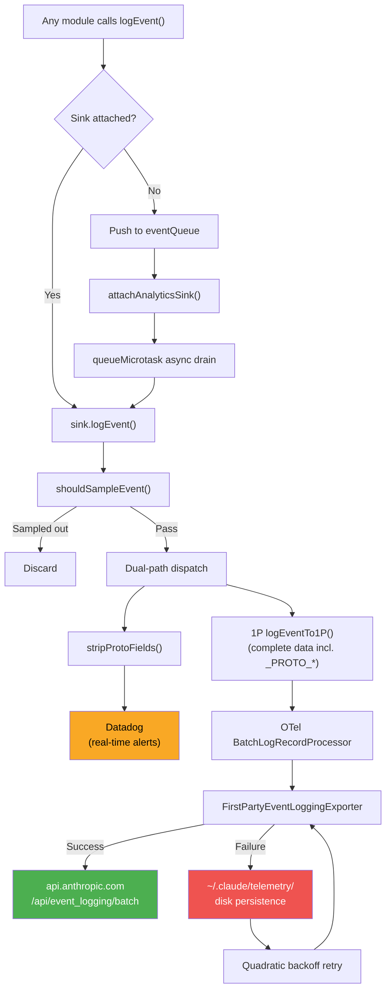
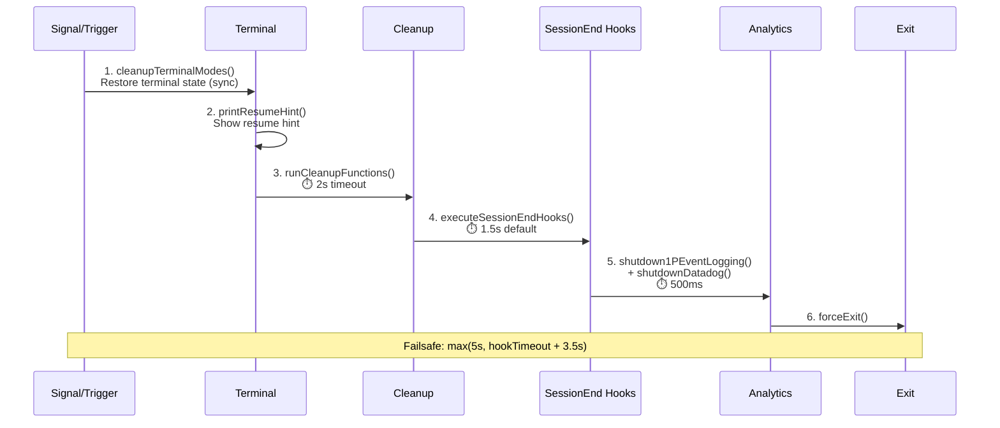

# Chapter 29: Observability Engineering — logEvent에서 Production-Grade Telemetry까지

## 왜 중요한가 (Why This Matters)

CLI 도구의 observability는 고유한 제약 조건을 가진다: 영구적인 서버 측이 없고, 코드는 사용자 디바이스에서 실행되며, 네트워크는 언제든 끊길 수 있고, 사용자는 프라이버시에 매우 민감하다. 전통적인 웹 서비스는 서버 측에서 계측하고 중앙 집중식 로그를 수집할 수 있지만, Claude Code는 이벤트 수집, PII 필터링, 배치 전송에서 실패 재시도까지 전체 파이프라인을 클라이언트에서 완료해야 한다.

Claude Code는 이를 위해 5계층 telemetry 시스템을 구축했다:

| 계층 | 책임 | 주요 파일 |
|------|------|----------|
| **Event Entry** | `logEvent()` queue-attach 패턴 | `services/analytics/index.ts` |
| **Routing & Dispatch** | Dual-path dispatch (Datadog + 1P) | `services/analytics/sink.ts` |
| **PII Safety** | 타입 시스템 수준 보호 + 런타임 필터링 | `services/analytics/metadata.ts` |
| **Delivery Resilience** | OTel batch 처리 + 디스크 영속 재시도 | `services/analytics/firstPartyEventLoggingExporter.ts` |
| **Remote Control** | Feature Flag circuit breaker (Kill Switch) | `services/analytics/sinkKillswitch.ts` |

이 Chapter는 하나의 `logEvent()` 호출에서 시작하여, 이벤트가 sampling, PII 필터링, dual-path dispatch, 배치 전송, 실패 재시도를 거쳐 최종적으로 Datadog 대시보드 또는 Anthropic의 내부 data lake에 도달하는 전체 과정을 분석한다.

---

> **Interactive version**: [telemetry pipeline 애니메이션 보기](telemetry-viz.html) — logEvent()가 type checking, sampling, PII 필터링을 거쳐 최종적으로 Datadog/1P/OTel에 도달하는 흐름을 확인할 수 있다.

## 소스 코드 분석 (Source Code Analysis)

### 29.1 Telemetry Pipeline 아키텍처: logEvent()에서 Data Lake까지

Claude Code의 telemetry pipeline은 **queue-attach 패턴**을 사용한다: 이벤트는 애플리케이션 시작의 가장 초기 단계에서 생산될 수 있지만, telemetry 백엔드는 아직 초기화되지 않았을 수 있다. 해결책은 이벤트를 먼저 큐에 캐시한 뒤, 백엔드가 준비되면 비동기적으로 drain하는 것이다.

```typescript
// restored-src/src/services/analytics/index.ts:80-84
// Event queue for events logged before sink is attached
const eventQueue: QueuedEvent[] = []

// Sink - initialized during app startup
let sink: AnalyticsSink | null = null
```

`logEvent()`는 전역 진입점이다 — 전체 코드베이스가 이 함수를 통해 이벤트를 기록한다. sink가 아직 attach되지 않았을 때, 이벤트는 큐에 push된다:

```typescript
// restored-src/src/services/analytics/index.ts:133-144
export function logEvent(
  eventName: string,
  metadata: LogEventMetadata,
): void {
  if (sink === null) {
    eventQueue.push({ eventName, metadata, async: false })
    return
  }
  sink.logEvent(eventName, metadata)
}
```

`attachAnalyticsSink()`가 호출되면, 큐는 `queueMicrotask()`를 통해 비동기적으로 drain되어 시작 경로를 차단하지 않는다:

```typescript
// restored-src/src/services/analytics/index.ts:101-122
if (eventQueue.length > 0) {
  const queuedEvents = [...eventQueue]
  eventQueue.length = 0
  // ... ant-only logging (omitted)
  queueMicrotask(() => {
    for (const event of queuedEvents) {
      if (event.async) {
        void sink!.logEventAsync(event.eventName, event.metadata)
      } else {
        sink!.logEvent(event.eventName, event.metadata)
      }
    }
  })
}
```

이 설계에는 중요한 속성이 있다: `index.ts`는 **의존성이 없다** (주석에 명시적으로 "This module has NO dependencies to avoid import cycles"라고 되어 있다). 이는 어떤 모듈이든 순환 import를 발생시키지 않고 안전하게 `logEvent`를 import할 수 있음을 의미한다.

실제 Sink 구현은 `sink.ts`에 있으며, dual-path dispatch를 담당한다:

```typescript
// restored-src/src/services/analytics/sink.ts:48-72
function logEventImpl(eventName: string, metadata: LogEventMetadata): void {
  const sampleResult = shouldSampleEvent(eventName)
  if (sampleResult === 0) {
    return
  }
  const metadataWithSampleRate =
    sampleResult !== null
      ? { ...metadata, sample_rate: sampleResult }
      : metadata
  if (shouldTrackDatadog()) {
    void trackDatadogEvent(eventName, stripProtoFields(metadataWithSampleRate))
  }
  logEventTo1P(eventName, metadataWithSampleRate)
}
```

두 가지 핵심 세부 사항에 주목하라:

1. **Sampling이 dispatch 전에 실행된다** — `shouldSampleEvent()`가 GrowthBook 원격 설정에 기반하여 이벤트를 버릴지 결정하며, sample rate는 downstream 보정을 위해 metadata에 첨부된다.
2. **Datadog은 `stripProtoFields()` 처리된 데이터를 수신한다** — 모든 `_PROTO_*` 접두사 PII 필드가 제거된다; 반면 1P 채널은 완전한 데이터를 수신한다.

다음 Mermaid 다이어그램은 이벤트 생성에서 최종 저장까지의 전체 경로를 보여준다:



원격 circuit breaker 메커니즘은 `sinkKillswitch.ts`를 통해 구현되며, 의도적으로 난독화된 GrowthBook 설정 이름을 사용한다:

```typescript
// restored-src/src/services/analytics/sinkKillswitch.ts:4
const SINK_KILLSWITCH_CONFIG_NAME = 'tengu_frond_boric'
```

설정 값은 `{ datadog?: boolean, firstParty?: boolean }` 객체이며, `true`로 설정하면 해당 채널을 비활성화한다. 이 설계는 Anthropic이 새 버전을 릴리스하지 않고도 원격으로 telemetry를 비활성화할 수 있게 해준다 — 예를 들어, 이벤트 타입이 예기치 않게 민감한 데이터를 포함할 때, 몇 분 내에 유출을 차단할 수 있다. Feature Flag 메커니즘에 대한 자세한 내용은 Chapter 23을 참조하라.

### 29.2 PII Safety 아키텍처: 타입 시스템 수준 보호 (Type-System-Level Protection)

Claude Code의 PII 보호는 코드 리뷰와 문서 관례에 의존하지 않고, TypeScript의 타입 시스템을 통해 **컴파일 타임에 강제한다**. 핵심은 두 개의 `never` 타입 마커다:

```typescript
// restored-src/src/services/analytics/index.ts:19
export type AnalyticsMetadata_I_VERIFIED_THIS_IS_NOT_CODE_OR_FILEPATHS = never

// restored-src/src/services/analytics/index.ts:33
export type AnalyticsMetadata_I_VERIFIED_THIS_IS_PII_TAGGED = never
```

왜 `never` 타입을 사용하는가? `never`는 어떤 값도 담을 수 없기 때문이다 — `as` 강제 캐스팅으로만 할당할 수 있다. 이는 개발자가 telemetry 이벤트에 문자열을 기록하고자 할 때마다 `myString as AnalyticsMetadata_I_VERIFIED_THIS_IS_NOT_CODE_OR_FILEPATHS`를 작성해야 함을 의미한다. 이 장황한 타입 이름 자체가 체크리스트다: "이것이 코드나 파일 경로가 아님을 확인했다."

Section 29.1에서 보여준 `logEvent()` 시그니처를 다시 보면, metadata 파라미터 타입은 `{ [key: string]: boolean | number | undefined }`다 — **문자열이 허용되지 않음**에 주목하라. 소스 코드 주석에 명시적으로 "intentionally no strings unless AnalyticsMetadata_I_VERIFIED_THIS_IS_NOT_CODE_OR_FILEPATHS, to avoid accidentally logging code/filepaths"라고 되어 있다. 문자열을 전달하려면 마커 타입으로 강제 캐스팅해야 한다.

실제로 PII 데이터를 기록해야 하는 시나리오(skill 이름, MCP 서버 이름 등)에는 `_PROTO_` 접두사 필드를 사용한다:

```typescript
// restored-src/src/services/analytics/firstPartyEventLoggingExporter.ts:719-724
const {
  _PROTO_skill_name,
  _PROTO_plugin_name,
  _PROTO_marketplace_name,
  ...rest
} = formatted.additional
const additionalMetadata = stripProtoFields(rest)
```

`_PROTO_*` 필드 라우팅 로직:
- **Datadog**: `sink.ts`가 dispatch 전에 `stripProtoFields()`를 호출하여 모든 `_PROTO_*` 필드를 제거하므로, Datadog은 PII를 볼 수 없다
- **1P Exporter**: 알려진 `_PROTO_*` 필드를 구조 분해하여 최상위 proto 필드로 승격시키고(BigQuery 권한 컬럼에 저장), 나머지 필드에 대해 `stripProtoFields()`를 다시 실행하여 인식되지 않는 새 필드의 유출을 방지한다

MCP tool 이름 처리는 graduated disclosure(단계적 공개) 전략을 보여준다:

```typescript
// restored-src/src/services/analytics/metadata.ts:70-77
export function sanitizeToolNameForAnalytics(
  toolName: string,
): AnalyticsMetadata_I_VERIFIED_THIS_IS_NOT_CODE_OR_FILEPATHS {
  if (toolName.startsWith('mcp__')) {
    return 'mcp_tool' as AnalyticsMetadata_I_VERIFIED_THIS_IS_NOT_CODE_OR_FILEPATHS
  }
  return toolName as AnalyticsMetadata_I_VERIFIED_THIS_IS_NOT_CODE_OR_FILEPATHS
}
```

MCP tool 이름은 `mcp__<server>__<tool>` 형식이며, 서버 이름은 사용자 설정 정보를 노출할 수 있다(PII-medium). 기본적으로 모든 MCP tool은 `'mcp_tool'`로 대체된다. 단, 상세 이름 기록을 허용하는 세 가지 예외가 있다:

1. Cowork 모드 (`entrypoint=local-agent`) — ZDR 개념이 없음
2. `claudeai-proxy` 타입 MCP 서버 — claude.ai 공식 목록에서 제공
3. URL이 공식 MCP 레지스트리와 일치하는 서버

파일 확장자 처리도 마찬가지로 신중하다 — 10자보다 긴 확장자는 `'other'`로 대체되는데, 과도하게 긴 "확장자"는 해시된 파일명일 수 있기 때문이다(예: `key-hash-abcd-123-456`).

### 29.3 1P Event 전송: OpenTelemetry + 디스크 영속 재시도 (Disk-Persistent Retry)

1P (First Party) 채널은 Claude Code telemetry의 핵심이다 — Anthropic이 자체 호스팅하는 `/api/event_logging/batch` 엔드포인트로 이벤트를 전송하며, BigQuery에 저장되어 오프라인 분석에 사용된다.

아키텍처는 OpenTelemetry SDK를 기반으로 한다:

```typescript
// restored-src/src/services/analytics/firstPartyEventLogger.ts:362-389
const eventLoggingExporter = new FirstPartyEventLoggingExporter({
  maxBatchSize: maxExportBatchSize,
  skipAuth: batchConfig.skipAuth,
  maxAttempts: batchConfig.maxAttempts,
  path: batchConfig.path,
  baseUrl: batchConfig.baseUrl,
  isKilled: () => isSinkKilled('firstParty'),
})
firstPartyEventLoggerProvider = new LoggerProvider({
  resource,
  processors: [
    new BatchLogRecordProcessor(eventLoggingExporter, {
      scheduledDelayMillis,
      maxExportBatchSize,
      maxQueueSize,
    }),
  ],
})
```

OTel의 `BatchLogRecordProcessor`는 다음 조건 중 하나가 충족되면 export를 트리거한다:
- 시간 간격 도달 (기본 10초, `tengu_1p_event_batch_config` 원격 설정으로 구성 가능)
- 배치 크기 제한 도달 (기본 200 이벤트)
- 큐 가득 참 (기본 8192 이벤트)

하지만 진정한 엔지니어링 도전은 커스텀 `FirstPartyEventLoggingExporter`(806줄)에 있다. 이 Exporter는 표준 OTel export 위에 CLI 도구에 필요한 resilience(복원력)를 쌓는다:

**Batch sharding + 배치 간 지연**: 대규모 이벤트 배치는 여러 소규모 배치(각각 최대 `maxBatchSize`)로 분할되며, 배치 사이에 100ms 지연을 둔다:

```typescript
// restored-src/src/services/analytics/firstPartyEventLoggingExporter.ts:379-421
private async sendEventsInBatches(
  events: FirstPartyEventLoggingEvent[],
): Promise<FirstPartyEventLoggingEvent[]> {
  const batches: FirstPartyEventLoggingEvent[][] = []
  for (let i = 0; i < events.length; i += this.maxBatchSize) {
    batches.push(events.slice(i, i + this.maxBatchSize))
  }
  // ...
  for (let i = 0; i < batches.length; i++) {
    const batch = batches[i]!
    try {
      await this.sendBatchWithRetry({ events: batch })
    } catch (error) {
      // Short-circuit all subsequent batches on first batch failure
      for (let j = i; j < batches.length; j++) {
        failedBatchEvents.push(...batches[j]!)
      }
      break
    }
    if (i < batches.length - 1 && this.batchDelayMs > 0) {
      await sleep(this.batchDelayMs)
    }
  }
  return failedBatchEvents
}
```

short-circuit 로직에 주목하라: 첫 번째 배치가 실패하면 엔드포인트가 이용 불가능하다고 가정하고 나머지 모든 배치를 즉시 실패로 표시하여, 무의미한 네트워크 요청을 방지한다.

**Quadratic backoff 재시도**: 실패한 이벤트는 quadratic backoff(Statsig SDK 전략과 동일)를 사용한다:

```typescript
// restored-src/src/services/analytics/firstPartyEventLoggingExporter.ts:451-455
// Quadratic backoff (matching Statsig SDK): base * attempts²
const delay = Math.min(
  this.baseBackoffDelayMs * this.attempts * this.attempts,
  this.maxBackoffDelayMs,
)
```

기본 파라미터: `baseBackoffDelayMs=500`, `maxBackoffDelayMs=30000`, `maxAttempts=8`. 8번의 export 시도는 최대 7번의 backoff 지연을 생성한다: 500ms → 2s → 4.5s → 8s → 12.5s → 18s → 24.5s (8번째 시도 실패 후 이벤트는 폐기되며, 더 이상의 backoff는 없다).

**401 degraded 재시도**: 인증 실패 시, 포기하지 않고 자동으로 인증 없이 재시도한다:

```typescript
// restored-src/src/services/analytics/firstPartyEventLoggingExporter.ts:593-611
if (
  useAuth &&
  axios.isAxiosError(error) &&
  error.response?.status === 401
) {
  // 401 auth error, retrying without auth
  const response = await axios.post(this.endpoint, payload, {
    timeout: this.timeout,
    headers: baseHeaders,
  })
  this.logSuccess(payload.events.length, false, response.data)
  return
}
```

이 설계는 OAuth 토큰이 만료되었지만 자동 갱신할 수 없는 시나리오를 처리한다 — telemetry 데이터는 비인증 채널을 통해 여전히 서버에 도달할 수 있으며, 단지 서버 측에서 사용자 신원 연결이 되지 않을 뿐이다.

**디스크 영속성**: export에 실패한 이벤트는 JSONL 파일에 append된다:

```typescript
// restored-src/src/services/analytics/firstPartyEventLoggingExporter.ts:44-46
function getStorageDir(): string {
  return path.join(getClaudeConfigHomeDir(), 'telemetry')
}
```

파일 경로 형식은 `~/.claude/telemetry/1p_failed_events.<sessionId>.<batchUUID>.json`이다. `appendFile`을 사용하여 append 쓰기를 수행한다. 각 세션이 고유한 session ID + batch UUID로 파일 이름을 지정하므로, 여러 프로세스가 동시에 같은 파일에 쓰는 시나리오는 사실상 없다.

**시작 시 자동 재전송**: Exporter 생성자가 `retryPreviousBatches()`를 호출하여, 동일 session ID 하의 다른 batch UUID의 실패 파일을 스캔하고 백그라운드에서 재전송한다:

```typescript
// restored-src/src/services/analytics/firstPartyEventLoggingExporter.ts:137-138
// Retry any failed events from previous runs of this session (in background)
void this.retryPreviousBatches()
```

**런타임 hot-reload**: GrowthBook 설정이 갱신되면, `reinitialize1PEventLoggingIfConfigChanged()`가 이벤트 손실 없이 전체 파이프라인을 재구축할 수 있다 — null logger(새 이벤트 일시 중지) → 이전 provider `forceFlush()` → 새 provider 초기화 → 이전 provider 백그라운드 종료 순서를 통해.

| 기능 | 1P Exporter | 표준 OTel HTTP Exporter |
|------|-------------|------------------------|
| Batch sharding | maxBatchSize 단위 분할, 100ms 배치 간 지연 | 없음 (단일 배치 전송) |
| 실패 처리 | 디스크 영속성 + quadratic backoff + short-circuit | 제한된 재시도 후 폐기 (인메모리, 영속성 없음) |
| 인증 | OAuth → 401 시 비인증으로 degraded | 고정 헤더 |
| 세션 간 복구 | 시작 시 이전 실패 스캔 및 재전송 | 없음 |
| 원격 제어 | Killswitch + GrowthBook hot config | 없음 |
| PII 처리 | `_PROTO_*` 승격 + `stripProtoFields()` | 없음 |

### 29.4 Datadog 통합: Curated Event Allowlist

Datadog 채널은 **실시간 알림**에 사용되며, 1P 채널의 오프라인 분석을 보완한다. 핵심 설계 특징은 curated allowlist다:

```typescript
// restored-src/src/services/analytics/datadog.ts:19-64 (excerpt)
const DATADOG_ALLOWED_EVENTS = new Set([
  'chrome_bridge_connection_succeeded',
  'chrome_bridge_connection_failed',
  // ... chrome_bridge_* events
  'tengu_api_error',
  'tengu_api_success',
  'tengu_cancel',
  'tengu_exit',
  'tengu_init',
  'tengu_started',
  'tengu_tool_use_error',
  'tengu_tool_use_success',
  'tengu_uncaught_exception',
  'tengu_unhandled_rejection',
  // ... approximately 38 events total
])
```

목록에 있는 이벤트만 Datadog으로 전송된다 — 이는 외부 서비스에 대한 데이터 노출 표면을 제한한다. `stripProtoFields()` PII 제거와 결합하면, Datadog은 안전하고 제한된 운영 데이터만 볼 수 있다.

Datadog은 public client token(`pubbbf48e6d78dae54bceaa4acf463299bf`), 배치 flush 간격 15초, 배치 제한 100개, 네트워크 타임아웃 5초를 사용한다.

태그 시스템(TAG_FIELDS)은 주요 차원을 포괄한다: `arch`, `platform`, `model`, `userType`, `toolName`, `subscriptionType` 등. MCP tool은 Datadog 수준에서 (`'mcp_tool'`이 아닌) `'mcp'`로 추가 압축되어 cardinality를 줄인다.

사용자 bucketing 설계는 주목할 만하다:

```typescript
// restored-src/src/services/analytics/datadog.ts:295-298
const getUserBucket = memoize((): number => {
  const userId = getOrCreateUserID()
  const hash = createHash('sha256').update(userId).digest('hex')
  return parseInt(hash.slice(0, 8), 16) % NUM_USER_BUCKETS
})
```

사용자 ID를 해시하여 30개 버킷 중 하나에 할당한다. 이를 통해 고유 버킷 수를 세어 고유 사용자 수를 근사할 수 있으며, 사용자 ID를 직접 기록할 때의 cardinality 폭발과 프라이버시 문제를 피할 수 있다.

### 29.5 API 호출 Observability: Request에서 Retry까지

API 호출은 Claude Code의 가장 중요한 작업 경로다 — 각 Agent Loop 반복(자세한 내용은 Chapter 3 참조)은 최소 하나의 API 호출을 트리거하며, 완전한 telemetry 이벤트 체인을 생성한다. `services/api/logging.ts`는 **three-event model**을 구현한다:

1. **`tengu_api_query`**: 요청이 전송될 때 기록되며, model 이름, token 예산, cache 설정을 포함한다
2. **`tengu_api_success`**: 요청 성공 시 기록되며, 성능 메트릭을 포함한다
3. **`tengu_api_error`**: 요청 실패 시 기록되며, 에러 타입과 상태 코드를 포함한다

성능 메트릭은 특히 주목할 만하다:

- **TTFT (Time to First Token)**: 요청 전송부터 첫 번째 token 수신까지의 시간으로, model 시작 latency를 측정한다
- **TTLT (Time to Last Token)**: 요청 전송부터 마지막 token 수신까지의 시간으로, 전체 응답 시간을 측정한다
- **Total duration**: 네트워크 왕복 포함
- **각 재시도에 대한 독립적인 타임스탬프**

Retry telemetry는 `services/api/withRetry.ts`를 통해 구현된다. 각 재시도는 독립적인 이벤트(`tengu_api_retry`)로 기록되며, 재시도 사유, backoff 시간, HTTP 상태 코드를 포함한다.

429/529 상태 코드는 차별화된 처리를 받는다:
- **429 (Rate Limited)**: 표준 backoff, Fast Mode에서 30분 쿨다운 트리거 (자세한 내용은 Chapter 21 참조)
- **529 (Overloaded)**: 서버 측 과부하, 더 공격적인 backoff 전략
- **Background 요청**: 빠르게 포기하여 사용자 foreground 작업을 차단하지 않는다

Gateway fingerprint 감지는 방어적 설계다 — 사용자가 프록시 게이트웨이(LiteLLM, Helicone, Portkey, Cloudflare, Kong 등)를 통해 API에 접근할 때, Claude Code는 게이트웨이 타입을 감지하고 기록한다. 이는 Anthropic이 자체 API 문제와 서드파티 프록시가 도입한 문제를 구별하는 데 도움을 준다.

### 29.6 Tool 실행 Telemetry

Tool 실행은 `services/tools/toolExecution.ts`를 통해 네 가지 이벤트 타입을 기록한다:

- **`tengu_tool_use_success`**: Tool이 성공적으로 실행됨
- **`tengu_tool_use_error`**: Tool 실행 에러
- **`tengu_tool_use_cancelled`**: 사용자가 취소
- **`tengu_tool_use_rejected_in_prompt`**: 권한 거부

각 이벤트는 실행 시간, 결과 크기(bytes), 파일 확장자(보안 필터링됨)를 포함한다. MCP tool의 경우, Section 29.2에서 설명한 graduated disclosure 전략을 따른다.

완전한 tool 실행 생명주기(validateInput → checkPermissions → call → postToolUse hooks)는 Chapter 4에서 상세히 분석했으므로 여기서는 반복하지 않는다.

### 29.7 Cache 효율성 추적 (Cache Efficiency Tracking)

cache break 감지 시스템(`promptCacheBreakDetection.ts`)은 telemetry와 cache 최적화의 교차점이다. 각 API 호출 전에 `PreviousState`를 스냅샷하고(systemHash, toolsHash, cacheControlHash 등 15개 이상 필드 포함), 응답 수신 후 실제 cache hit 결과와 비교한다.

cache break가 감지되면(`cache_read_input_tokens`가 2000 token 이상 감소), 20개 이상 필드의 break 컨텍스트를 포함한 `tengu_prompt_cache_break` 이벤트가 생성된다. 2000 token 노이즈 필터링 임계값은 사소한 변동으로 인한 오탐을 방지한다.

이 시스템의 상세 설계는 Chapter 14에서 깊이 분석했다; 여기서는 telemetry 시스템에서의 위치만 언급한다: 이는 Claude Code의 "observe before you fix(수정 전에 관찰)" 철학(자세한 내용은 Chapter 25 참조)의 패러다임 실천이다.

### 29.8 세 가지 Debug/Diagnostic 채널 (Three Debug/Diagnostic Channels)

Claude Code는 세 가지 독립적인 debug/diagnostic 채널을 제공하며, 각각 다른 사용 사례와 PII 정책을 가진다:

| 채널 | 파일 | 트리거 | PII 정책 | 출력 위치 | 사용 사례 |
|------|------|--------|----------|----------|----------|
| **Debug Log** | `utils/debug.ts` | `--debug` 또는 `/debug` | PII 포함 가능 | `~/.claude/debug/<session>.log` | 개발자 디버깅, ant의 경우 기본 활성화 |
| **Diagnostic Log** | `utils/diagLogs.ts` | `CLAUDE_CODE_DIAGNOSTICS_FILE` 환경 변수 | **PII 엄격히 금지** | 컨테이너 지정 경로 | 컨테이너 모니터링, session-ingress 경유 |
| **Error Log** | `utils/errorLogSink.ts` | 자동 (ant-only 파일 출력) | 에러 정보 (제어됨) | `~/.claude/errors/<date>.jsonl` | 에러 회고 분석 |

**Debug Log** (`utils/debug.ts`)는 여러 활성화 방법을 지원한다:

```typescript
// restored-src/src/utils/debug.ts:44-57
export const isDebugMode = memoize((): boolean => {
  return (
    runtimeDebugEnabled ||
    isEnvTruthy(process.env.DEBUG) ||
    isEnvTruthy(process.env.DEBUG_SDK) ||
    process.argv.includes('--debug') ||
    process.argv.includes('-d') ||
    isDebugToStdErr() ||
    process.argv.some(arg => arg.startsWith('--debug=')) ||
    getDebugFilePath() !== null
  )
})
```

Ant 사용자(Anthropic 내부)는 기본적으로 debug 로그를 기록한다; 외부 사용자는 명시적으로 활성화해야 한다. `/debug` 명령어는 세션을 재시작하지 않고 런타임 활성화(`enableDebugLogging()`)를 지원한다. 로그 파일은 빠른 접근을 위해 가장 최근 로그 파일을 가리키는 `latest` 심볼릭 링크를 자동 생성한다.

로그 레벨 시스템은 5단계 필터링(verbose → debug → info → warn → error)을 지원하며, `CLAUDE_CODE_DEBUG_LOG_LEVEL` 환경 변수로 제어된다. `--debug=pattern` 구문은 특정 모듈의 로그 필터링을 지원한다.

**Diagnostic Log** (`utils/diagLogs.ts`)는 PII-safe 컨테이너 진단 채널이다 — 컨테이너 환경 관리자가 읽고 session-ingress 서비스로 전송하도록 설계되었다:

```typescript
// restored-src/src/utils/diagLogs.ts:27-31
export function logForDiagnosticsNoPII(
  level: DiagnosticLogLevel,
  event: string,
  data?: Record<string, unknown>,
): void {
```

함수 이름의 `NoPII` 접미사는 의도적인 명명 관례다 — 호출자에게 상기시키고 코드 리뷰를 용이하게 한다. 출력 형식은 JSONL(한 줄당 하나의 JSON 객체)이며, 타임스탬프, 레벨, 이벤트 이름, 데이터를 포함한다. 종료 경로에서 자주 호출되기 때문에 동기식 쓰기(`appendFileSync`)를 사용한다.

`withDiagnosticsTiming()` 래퍼 함수는 async 작업에 대해 `_started`와 `_completed` 이벤트 쌍을 자동 생성하며, `duration_ms`를 첨부한다.

### 29.9 Distributed Tracing: OpenTelemetry + Perfetto

Claude Code의 tracing 시스템은 두 계층으로 나뉜다: OTel 기반 구조화 tracing과 Perfetto 기반 시각적 tracing이다.

**OTel tracing** (`utils/telemetry/sessionTracing.ts`)는 3단계 span 계층 구조를 사용한다:

1. **Interaction Span**: 사용자 요청 → Claude 응답 사이클을 감싼다
2. **LLM Request Span**: 단일 API 호출
3. **Tool Span**: 단일 tool 실행 (하위 span: blocked_on_user, tool.execution, hook)

Span context는 `AsyncLocalStorage`를 통해 전파되어, async 호출 체인 전반에 걸쳐 올바른 부모-자식 관계를 보장한다. Agent 계층 구조(main agent → sub-agent)는 부모-자식 span 관계를 통해 표현된다.

중요한 엔지니어링 세부 사항은 **orphan span 정리**다:

```typescript
// restored-src/src/utils/telemetry/sessionTracing.ts:79
const SPAN_TTL_MS = 30 * 60 * 1000 // 30 minutes
```

활성 span은 60초마다 스캔되며, 30분 내에 종료되지 않은 span은 강제 종료되고 레지스트리에서 제거된다. 이는 비정상 중단(스트림 취소, tool 실행 중 미포착 예외 등)으로 인한 span 누수를 처리한다. `activeSpans`는 `WeakRef`를 사용하여 GC가 도달 불가능한 span context를 회수할 수 있게 한다.

Feature gate 제어(`ENHANCED_TELEMETRY_BETA`)는 tracing을 기본적으로 비활성화하고, 환경 변수 또는 GrowthBook 사용자 그룹별 점진적 롤아웃을 통해 활성화한다.

**Perfetto tracing** (`utils/telemetry/perfettoTracing.ts`)는 ant-only 시각적 tracing이다 — ui.perfetto.dev에서 분석 가능한 Chrome Trace Event 형식 JSON 파일을 생성한다:

```typescript
// restored-src/src/utils/telemetry/perfettoTracing.ts:16
// Enable via CLAUDE_CODE_PERFETTO_TRACE=1 or CLAUDE_CODE_PERFETTO_TRACE=<path>
```

Trace 파일은 다음을 포함한다:
- Agent 계층 관계 (서로 다른 agent를 구별하기 위해 process ID 사용)
- API 요청 세부 사항 (TTFT, TTLT, cache hit rate, speculative flag)
- Tool 실행 세부 사항 (이름, 기간, token 사용량)
- 사용자 입력 대기 시간

이벤트 배열에는 상한 가드(`MAX_EVENTS = 100_000`)가 있으며, 도달하면 가장 오래된 절반이 제거된다 — 이는 장시간 실행 세션(cron 구동 세션 등)이 메모리를 무한히 증가시키는 것을 방지한다. 메타데이터 이벤트(process/thread 이름)는 Perfetto UI가 트랙 라벨에 필요하므로 제거에서 면제된다.

### 29.10 Crash Recovery와 Graceful Shutdown

`utils/gracefulShutdown.ts`(529줄)는 Claude Code의 graceful shutdown 시퀀스를 구현한다 — "last mile" telemetry 데이터 전송의 핵심이다.

Shutdown 트리거 소스는 다음을 포함한다: SIGINT (Ctrl+C), SIGTERM, SIGHUP, 그리고 macOS 전용 **orphan process 감지**:

```typescript
// restored-src/src/utils/gracefulShutdown.ts:281-296
if (process.stdin.isTTY) {
  orphanCheckInterval = setInterval(() => {
    if (getIsScrollDraining()) return
    if (!process.stdout.writable || !process.stdin.readable) {
      clearInterval(orphanCheckInterval)
      void gracefulShutdown(129)
    }
  }, 30_000)
  orphanCheckInterval.unref()
}
```

macOS는 터미널이 닫힐 때 항상 SIGHUP을 보내지 않고, 대신 TTY 파일 디스크립터를 취소한다. 30초마다 stdout/stdin의 가용성을 확인한다.

Shutdown 시퀀스는 **cascading timeout(계단식 타임아웃)** 설계를 사용한다:



핵심 설계 결정:

1. **터미널 모드 복원이 가장 먼저 실행된다** — 모든 async 작업 전에 동기적으로 터미널 상태를 복원한다. cleanup 중에 SIGKILL이 발생해도 최소한 터미널이 손상된 상태에 놓이지 않는다.
2. **Cleanup 함수는 독립적인 타임아웃을 가진다** (2초) — `Promise.race`로 구현되어, MCP 연결 행 방지.
3. **SessionEnd hook에는 예산이 있다** (기본 1.5초) — `CLAUDE_CODE_SESSIONEND_HOOKS_TIMEOUT_MS`로 사용자 구성 가능.
4. **Analytics flush는 500ms로 제한된다** — 이전에는 무제한이어서 1P Exporter가 모든 대기 중인 axios POST(각각 10초 타임아웃)를 기다려 전체 failsafe 예산을 소진할 수 있었다.
5. **Failsafe 타이머**는 동적으로 계산된다: `max(5000, sessionEndTimeoutMs + 3500)`, hook 예산이 충분한 시간을 갖도록 보장한다.

`forceExit()`는 극단적 상황을 처리한다 — 죽은 터미널로 인해 `process.exit()`가 예외를 던질 때(EIO 에러), `SIGKILL`로 폴백한다:

```typescript
// restored-src/src/utils/gracefulShutdown.ts:213-222
try {
  process.exit(exitCode)
} catch (e) {
  if ((process.env.NODE_ENV as string) === 'test') {
    throw e
  }
  process.kill(process.pid, 'SIGKILL')
}
```

미포착 예외와 미처리 Promise rejection은 이중 채널을 통해 기록된다 — PII-free diagnostic 로그에 기록되는 동시에 analytics로 전송된다:

```typescript
// restored-src/src/utils/gracefulShutdown.ts:301-310
process.on('uncaughtException', error => {
  logForDiagnosticsNoPII('error', 'uncaught_exception', {
    error_name: error.name,
    error_message: error.message.slice(0, 2000),
  })
  logEvent('tengu_uncaught_exception', {
    error_name:
      error.name as AnalyticsMetadata_I_VERIFIED_THIS_IS_NOT_CODE_OR_FILEPATHS,
  })
})
```

`error.name`(예: "TypeError")은 비민감 정보로 판단되어 안전하게 기록할 수 있다. 에러 메시지는 긴 스택 트레이스가 과도한 저장 공간을 소비하는 것을 방지하기 위해 2000자로 잘린다.

### 29.11 비용 추적과 사용량 시각화 (Cost Tracking and Usage Visualization)

`cost-tracker.ts`는 Claude Code의 런타임 비용 회계를 관리한다 — USD 비용, token 사용량(input/output/cache creation/cache read), 코드 라인 변경을 추적하며, 세션 간에 영속된다.

비용 상태는 완전한 리소스 소비 스냅샷을 포함한다:

```typescript
// restored-src/src/cost-tracker.ts:71-80
type StoredCostState = {
  totalCostUSD: number
  totalAPIDuration: number
  totalAPIDurationWithoutRetries: number
  totalToolDuration: number
  totalLinesAdded: number
  totalLinesRemoved: number
  lastDuration: number | undefined
  modelUsage: { [modelName: string]: ModelUsage } | undefined
}
```

비용 상태는 프로젝트 설정(`.claude.state`)에 `lastSessionId`를 키로 저장된다. session ID가 일치할 때만 이전 비용 데이터가 복원되어, 서로 다른 세션 간의 교차 오염을 방지한다. 각 성공적인 API 호출 후, `addToTotalSessionCost()`가 token 사용량을 누적하고 `logEvent`를 통해 telemetry 파이프라인에 기록하여, 비용 데이터를 로컬 표시와 원격 분석 모두에 사용할 수 있게 한다.

`/cost` 명령어의 출력은 구독자와 비구독자를 구분한다 — 구독자는 더 상세한 사용량 분석을 보고, 비구독자는 소비 패턴 이해를 돕는 데 집중한다.

---

## 패턴 추출 (Pattern Distillation)

### Pattern 1: 타입 시스템 수준 PII 보호 (Type-System-Level PII Protection)

**문제**: Telemetry 이벤트가 실수로 민감한 데이터(파일 경로, 코드 스니펫, 사용자 설정)를 포함할 수 있다. 코드 리뷰와 문서 관례로는 이를 확실하게 방지할 수 없다.

**해결책**: `never` 타입 마커를 사용하여 개발자가 데이터 안전성을 명시적으로 선언하도록 강제한다.

```typescript
// Pattern template
type PII_VERIFIED = never
function logEvent(data: { [k: string]: number | boolean | undefined }): void
// To pass a string, you must:
logEvent({ name: value as PII_VERIFIED })
```

**전제 조건**: TypeScript 또는 유사한 강타입 시스템을 사용해야 한다. 타입 마커의 이름이 충분히 서술적이어서 `as` 캐스팅 자체가 리뷰가 되어야 한다.

### Pattern 2: Dual-Path Telemetry 전송 (Dual-Path Telemetry Delivery)

**문제**: 단일 telemetry 채널로는 실시간 알림(저지연, 저비용)과 오프라인 분석(완전한 데이터, 높은 신뢰성)을 동시에 만족시킬 수 없다.

**해결책**: telemetry를 두 채널로 dispatch한다 — 실시간 채널은 allowlist와 PII 제거를 사용하고, 오프라인 채널은 완전한 데이터를 유지한다.

**전제 조건**: 두 채널은 서로 다른 보안 수준과 SLA를 가진다. allowlist는 지속적인 유지보수가 필요하다.

### Pattern 3: 디스크 영속 재시도 (Disk-Persistent Retry)

**문제**: CLI 도구는 사용자 디바이스에서 실행되며, 네트워크는 불안정하고, 프로세스는 언제든 종료될 수 있다. 인메모리 재시도 큐는 프로세스 종료와 함께 손실된다.

**해결책**: 실패한 이벤트를 디스크 파일(JSONL 형식, 세션당 하나의 파일)에 append하고, 시작 시 이전 세션의 실패 이벤트를 스캔하여 재전송한다.

**전제 조건**: 파일 시스템이 쓰기 권한과 함께 사용 가능해야 한다. 이벤트에 암호화 저장이 필요한 데이터가 포함되어 있지 않아야 한다(PII는 기록 전에 이미 필터링됨).

### Pattern 4: Curated Event Allowlist

**문제**: 외부 서비스(Datadog)로 이벤트를 전송하려면 데이터 노출 표면을 제어해야 한다. 새로운 이벤트 타입이 실수로 민감한 정보를 포함할 수 있다.

**해결책**: `Set`을 사용하여 명시적인 allowlist를 정의한다. 목록에 없는 이벤트는 무시된다. 새 이벤트는 명시적으로 목록에 추가해야 하며, 이것이 리뷰 체크포인트가 된다.

**전제 조건**: 기능이 발전함에 따라 allowlist를 업데이트해야 한다. 그렇지 않으면 새 이벤트가 외부 서비스에 도달하지 못한다.

### Pattern 5: Cascading Timeout Graceful Shutdown

**문제**: 프로세스 종료 시 여러 cleanup 작업(터미널 복원, 세션 저장, hook 실행, telemetry flush)을 완료해야 하지만, 어떤 단계든 행할 수 있다.

**해결책**: 계층별 독립 타임아웃 + 전체 failsafe. 우선순위: 터미널 복원(동기, 최우선) → 데이터 영속화 → hook → telemetry. Failsafe 타임아웃 = max(하드 플로어, hook 예산 + 마진).

**전제 조건**: cleanup 작업 간의 우선순위가 명확히 정의되어야 한다. 가장 중요한 작업(터미널 복원)은 반드시 동기적이어야 한다.

---

## CC의 OpenTelemetry 구현: logEvent에서 표준화된 Telemetry까지 (CC's OpenTelemetry Implementation: From logEvent to Standardized Telemetry)

앞선 분석에서 CC의 860개 이상의 `tengu_*` 이벤트와 `logEvent()` 호출 패턴을 다뤘다. 하지만 더 깊은 계층에서 CC는 **완전한 OpenTelemetry telemetry 인프라**를 구축하여, 이벤트 로깅, distributed tracing, metric 측정을 OTel 표준 프레임워크로 통합했다.

### 세 가지 OTel Scope (Three OTel Scopes)

CC는 세 개의 독립적인 OTel scope를 등록하며, 각각 다른 책임을 가진다:

| Scope | OTel 컴포넌트 | 용도 |
|-------|--------------|------|
| `com.anthropic.claude_code.events` | Logger | 이벤트 로깅 (860개 이상의 tengu 이벤트) |
| `com.anthropic.claude_code.tracing` | Tracer | Distributed tracing (API 호출, tool 실행) |
| `com.anthropic.claude_code` | Meter | Metric 측정 (OTLP/Prometheus/BigQuery) |

```typescript
// restored-src/src/utils/telemetry/instrumentation.ts:602-606
const eventLogger = logs.getLogger(
  'com.anthropic.claude_code.events',
  MACRO.VERSION,
)
```

### Span 계층 구조 (Span Hierarchy Structure)

CC의 tracing 시스템은 6가지 span 타입을 정의하여 명확한 부모-자식 계층 구조를 형성한다:

```
claude_code.interaction (Root Span: one user interaction)
  ├─ claude_code.llm_request (API call)
  ├─ claude_code.tool (Tool invocation)
  │   ├─ claude_code.tool.blocked_on_user (Waiting for permission approval)
  │   └─ claude_code.tool.execution (Actual execution)
  └─ claude_code.hook (Hook execution, beta tracing)
```

각 span은 표준화된 attribute를 포함한다(`sessionTracing.ts:162-166`):

| Span 타입 | 주요 Attribute |
|-----------|---------------|
| `interaction` | `session_id`, `platform`, `arch` |
| `llm_request` | `model`, `speed`(fast/normal), `query_source`(agent 이름) |
| `llm_request` response | `duration_ms`, `input_tokens`, `output_tokens`, `cache_read_tokens`, `cache_creation_tokens`, `ttft_ms`, `success` |
| `tool` | `tool_name`, `tool_input` (beta tracing) |

`ttft_ms` (Time to First Token)는 LLM 애플리케이션에서 가장 중요한 latency 메트릭 중 하나다 — CC는 이를 span attribute에 네이티브로 기록한다.

### Context 전파: AsyncLocalStorage (Context Propagation: AsyncLocalStorage)

CC는 span context 전파를 위해 Node.js `AsyncLocalStorage`를 사용한다(`sessionTracing.ts:65-76`):

```typescript
const interactionContext = new AsyncLocalStorage<SpanContext | undefined>()
const toolContext = new AsyncLocalStorage<SpanContext | undefined>()
const activeSpans = new Map<string, WeakRef<SpanContext>>()
```

두 개의 독립적인 AsyncLocalStorage 인스턴스가 각각 interaction 수준과 tool 수준의 context를 추적한다. `WeakRef` + 30분 TTL 주기적 정리(60초마다 스캔)가 orphan span의 메모리 누수를 방지한다.

### Event Export Pipeline

`logEvent()`는 단순한 `console.log`가 아니다. 완전한 OTel 파이프라인을 거친다:

```
logEvent("tengu_api_query", metadata)
  ↓
Sampling check (tengu_event_sampling_config)
  ↓ Pass
Logger.emit({ body: eventName, attributes: {...} })
  ↓
BatchLogRecordProcessor (5-second interval / 200-entry batch)
  ↓
FirstPartyEventLoggingExporter (custom LogRecordExporter)
  ↓
POST /api/event_logging/batch → api.anthropic.com
  ↓ On failure
Append to ~/.claude/config/telemetry/1p_failed_events.{session}.{batch}.json
  ↓ Retry
Quadratic backoff: delay = min(500ms × attempts², 30000ms), max 8 attempts
```

**원격 circuit breaker**: GrowthBook 설정 `tengu_frond_boric`가 전체 sink의 on/off 스위치를 제어한다 — Anthropic은 릴리스 없이 긴급하게 telemetry export를 비활성화할 수 있다.

### Datadog Dual-Write

1P export 외에도 CC는 **일부** 이벤트를 Datadog에 dual-write한다(`datadog.ts:19-64`):

- Allowlist 메커니즘: `tengu_api_*`, `tengu_compact_*`, `tengu_tool_use_*` 등 유사한 접두사를 가진 핵심 이벤트만 export (약 60개 접두사 패턴)
- Batching: 100개/배치, 15초 간격
- Endpoint: `https://http-intake.logs.us5.datadoghq.com/api/v2/logs`

이 dual-write 전략은 전형적인 "production observability 계층화"다: 1P가 장기 분석을 위해 전체 볼륨 이벤트를 수집하고, Datadog이 실시간 알림과 대시보드를 위해 핵심 이벤트를 수집한다.

### Beta Tracing: 더 풍부한 Tracing 데이터

CC는 별도의 "beta tracing" 시스템(`betaSessionTracing.ts`)도 가지고 있으며, 환경 변수 `ENABLE_BETA_TRACING_DETAILED=1`로 제어된다:

| 표준 Tracing | Beta Tracing 추가 Attribute |
|-------------|---------------------------|
| model, duration_ms | + `system_prompt_hash`, `system_prompt_preview` |
| input_tokens, output_tokens | + `response.model_output`, `response.thinking_output` |
| tool_name | + `tool_input` (완전한 입력 내용) |
| — | + `new_context` (턴당 새 메시지 delta) |

콘텐츠 잘림 임계값은 60KB다(Honeycomb 제한은 64KB). SHA-256 해싱을 사용하여 중복 제거한다 — 동일한 system prompt는 한 번만 기록된다.

### Metric Exporter 에코시스템 (Metric Exporter Ecosystem)

CC는 5가지 metric exporter를 지원하며(`instrumentation.ts:130-215`), 주류 observability 플랫폼을 포괄한다:

| Exporter | Protocol | Export 간격 | 용도 |
|----------|----------|------------|------|
| OTLP (gRPC) | `@opentelemetry/exporter-metrics-otlp-grpc` | 60s | 표준 OTel 백엔드 |
| OTLP (HTTP) | `@opentelemetry/exporter-metrics-otlp-http` | 60s | HTTP 호환 백엔드 |
| Prometheus | `@opentelemetry/exporter-prometheus` | Pull | Grafana 에코시스템 |
| BigQuery | Custom `BigQueryMetricsExporter` | 5min | 장기 분석 |
| Console | `ConsoleMetricExporter` | 60s | 디버깅 |

### Prompt Replay: Supportability 디버깅 내부 도구

Claude Code에는 내부 사용자 전용(`USER_TYPE === 'ant'`) 디버깅 도구가 있다 — `dumpPrompts.ts`로, 매 API 호출마다 각 API 요청을 투명하게 JSONL 파일로 직렬화하여, 완전한 prompt 상호작용 이력의 사후 재생을 지원한다.

파일 쓰기 경로는 `~/.claude/dump-prompts/{sessionId}.jsonl`이며, 한 줄당 하나의 JSON 객체로 네 가지 타입이 있다:

| 타입 | 트리거 | 내용 |
|------|--------|------|
| `init` | 첫 번째 API 호출 | System prompt, tool schema, model 메타데이터 |
| `system_update` | system prompt 또는 tool이 변경될 때 | init과 동일하지만 증분 업데이트로 표시 |
| `message` | 각 새 사용자 메시지 | 사용자 메시지만 (assistant 메시지는 response에서 캡처) |
| `response` | API 성공 후 | 완전한 streaming chunk 또는 JSON 응답 |

```typescript
// restored-src/src/services/api/dumpPrompts.ts:146-167
export function createDumpPromptsFetch(
  agentIdOrSessionId: string,
): ClientOptions['fetch'] {
  const filePath = getDumpPromptsPath(agentIdOrSessionId)
  return async (input, init?) => {
    // ...
    // Defer so it doesn't block the actual API call —
    // this is debug tooling for /issue, not on the critical path.
    setImmediate(dumpRequest, init.body as string, timestamp, state, filePath)
    // ...
  }
}
```

이 코드에서 가장 주목할 만한 설계는 **`setImmediate` 지연 직렬화**(167줄)다. System prompt + tool schema는 쉽게 수 MB가 될 수 있다; 동기식 직렬화는 실제 API 호출을 차단할 것이다. `setImmediate`는 직렬화를 다음 이벤트 루프 틱으로 밀어, 디버깅 도구가 사용자 경험에 영향을 미치지 않도록 보장한다.

변경 감지는 **2단계 fingerprinting**을 사용한다: 먼저 경량 `initFingerprint`(`model|toolNames|systemLength`, 74-88줄)로 빠른 "구조가 같은가?" 확인을 하고, 구조가 변경되었을 때만 비용이 큰 `JSON.stringify + SHA-256 해시`를 수행한다. 이는 멀티턴 대화의 매 라운드마다 변경되지 않은 system prompt에 대해 300ms 직렬화 비용을 지불하는 것을 피한다.

또한, `dumpPrompts.ts`는 최근 5개 API 요청의 인메모리 캐시(`MAX_CACHED_REQUESTS = 5`, 14줄)를 유지하여, 사용자가 버그를 보고할 때 `/issue` 명령어가 JSONL 파일 파싱 없이 빠르게 최근 요청 context를 얻을 수 있게 한다.

Agent 빌더에 대한 시사점: **디버깅 도구는 zero-cost sidecar여야 한다**. `dumpPrompts`는 세 가지 메커니즘으로 "항상 켜져 있지만 성능에 중립적인" 디버깅 기능을 달성한다: `setImmediate` 지연, fingerprint 중복 제거, 인메모리 캐싱. Agent에 유사한 prompt replay 기능이 필요하다면, 이 패턴을 직접 재사용할 수 있다.

### Agent 빌더를 위한 시사점 (Implications for Agent Builders)

1. **첫날부터 OTel 표준을 사용하라**. CC는 커스텀 telemetry 프로토콜을 만들지 않았다 — 표준 `Logger`, `Tracer`, `Meter`를 사용하여, 모든 OTel 호환 백엔드와 통합할 수 있다. 당신의 Agent도 그렇게 해야 한다
2. **Span 계층 구조는 Agent Loop 구조를 반영해야 한다**. `interaction → llm_request / tool` 계층 구조는 Agent Loop의 한 반복에 직접 매핑된다. span을 설계할 때, 먼저 Agent Loop 구조 다이어그램을 그려라
3. **Sampling은 필수다**. 860개 이상의 이벤트를 전체 볼륨으로 export하면 막대한 비용이 발생한다. CC는 GrowthBook 원격 설정을 통해 각 이벤트의 sample rate를 제어한다 — 이는 코드에 `if (Math.random() < 0.01)`을 하드코딩하는 것보다 훨씬 유연하다
4. **서로 다른 목적에 맞게 서로 다른 백엔드에 dual-write하라**. 1P 전체 볼륨 + Datadog 핵심 = 장기 분석 + 실시간 알림. 하나의 백엔드로 모든 요구를 충족시키려 하지 마라
5. **AsyncLocalStorage는 Node.js Agent의 tracing 무기다**. context 객체를 수동으로 전달하는 것을 피할 수 있다 — span 부모-자식 관계가 실행 context를 통해 자동으로 전파된다

---

## 활용 방법 (What You Can Do)

### Debug 로깅 (Debug Logging)

- **시작 시 활성화**: `claude --debug` 또는 `claude -d`
- **런타임 활성화**: 대화에서 `/debug` 입력
- **특정 모듈 필터링**: `claude --debug=api`로 API 관련 로그만 확인
- **stderr로 출력**: `claude --debug-to-stderr` 또는 `claude -d2e` (파이핑에 편리)
- **출력 파일 지정**: `claude --debug-file=/path/to/log`

로그는 `~/.claude/debug/` 디렉토리에 위치하며, 가장 최근 파일을 가리키는 `latest` 심볼릭 링크가 있다.

### 성능 분석 (Performance Analysis)

- **Perfetto tracing** (ant-only): `CLAUDE_CODE_PERFETTO_TRACE=1 claude`
- Trace 파일은 `~/.claude/traces/trace-<session-id>.json`에 위치
- [ui.perfetto.dev](https://ui.perfetto.dev)에서 열어 시각적 타임라인 확인

### 비용 확인 (Cost Viewing)

- 대화에서 `/cost`를 입력하면 현재 세션의 token 사용량과 비용을 확인할 수 있다
- 비용 데이터는 세션 간에 영속된다 — 재개 시 이전 세션의 누적 값이 자동으로 로드된다

### 프라이버시 제어 (Privacy Controls)

- Claude Code의 telemetry는 표준 opt-out 메커니즘을 따른다
- 서드파티 API 제공자(Bedrock, Vertex) 호출은 telemetry를 생성하지 않는다
- Observability 데이터에는 사용자 코드 내용이나 파일 경로가 포함되지 않는다(타입 시스템에 의해 보장)
