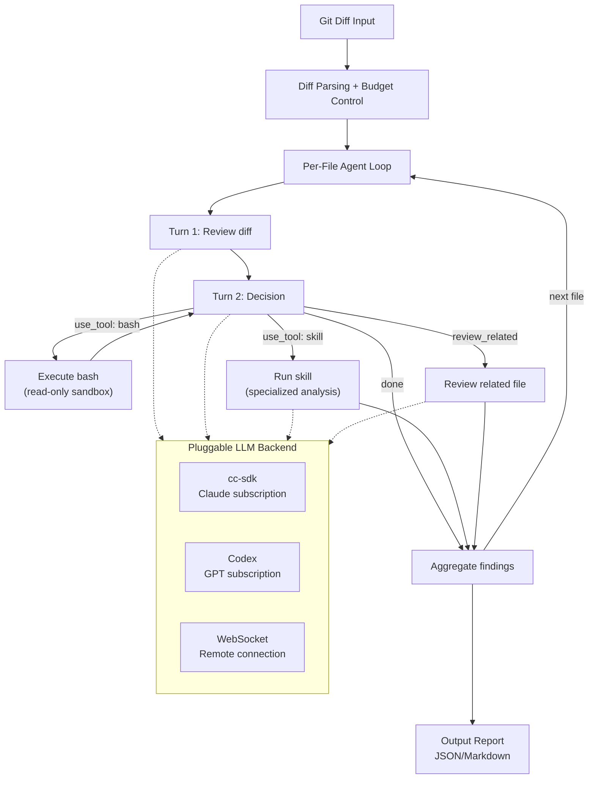
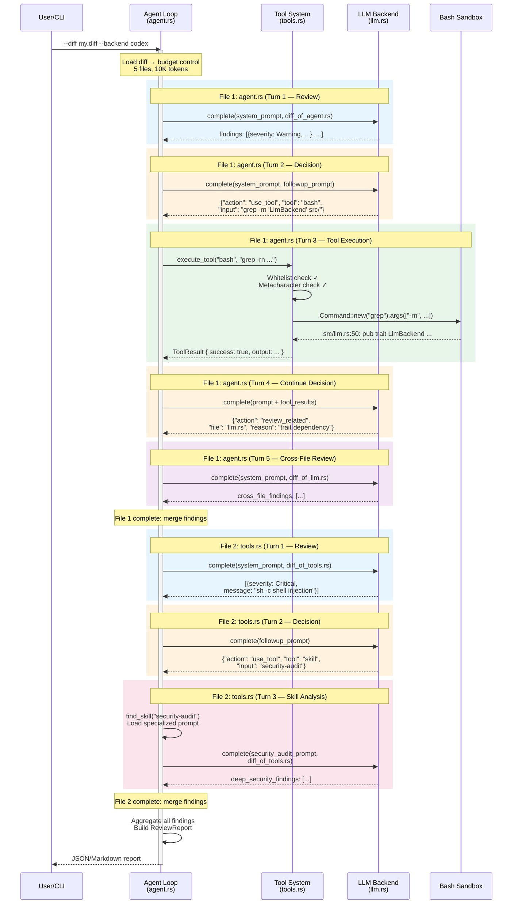
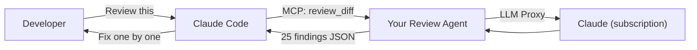
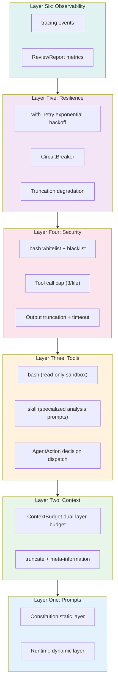

# Chapter 30: 나만의 AI Agent 만들기 — Claude Code Pattern에서 실전으로 (Build Your Own AI Agent — From Claude Code Patterns to Practice)

## 왜 이 챕터가 존재하는가 (Why This Chapter Exists)

### 왜 "나만의 Claude Code 만들기"가 아닌가 (Why Not "Build Your Own Claude Code")

독자는 이렇게 기대할 수 있다: 앞선 29개 Chapter에서 Claude Code의 모든 하위 시스템을 해부했으니, 이 Chapter에서는 이를 다시 조립하는 방법을 가르쳐야 한다고. 하지만 이것이 바로 우리가 하지 **않을** 일이다.

Claude Code는 **제품**이다 — 40개 이상의 tool, 특정 UI interaction, 특정 session 형식, 특정 과금 통합을 갖추고 있다. 이러한 구현 세부 사항을 복제하는 것은 무의미하다: 당신의 Agent는 coding assistant일 필요가 없으며 — security scanner, data pipeline monitor, code review tool, 또는 고객 서비스 봇일 수도 있다. 만약 "Claude Code의 FileEditTool을 어떻게 구현하는가"를 가르친다면, 다른 맥락에서는 전혀 활용할 수 없을 것이다.

이 책의 앞선 29개 Chapter가 정제한 것은 구현 세부 사항이 아니라 **pattern**이다 — prompt layering, context budgeting, tool sandboxing, graduated permissions, circuit-break retry, structured observability. 이러한 pattern은 특정 제품 형태에 종속되지 않으며 어떤 Agent 시나리오에도 이전할 수 있다.

따라서 이 Chapter가 하는 것은: **완전히 다른 Agent**(coding assistant가 아닌 code review), **완전히 다른 언어**(TypeScript가 아닌 Rust), **완전히 다른 실행 모델**(Claude Code에 위임하지 않고 직접 Agent Loop을 제어) — 을 사용하여 동일한 22개 pattern이 어떻게 조합되어 적용되는지를 보여주는 것이다. pattern이 이런 수준의 cross-scenario, cross-language, cross-architecture 이전에서 살아남을 수 있다면, 이는 Claude Code 한정 지식이 아니라 진정으로 재사용 가능한 Agent engineering 원칙이다.

### Pattern을 조합하는 것은 개별적으로 이해하는 것보다 어렵다 (Combining Patterns Is Harder Than Understanding Them Individually)

Chapter 25-27에서 22개의 명명된 pattern과 원칙을 정제했다. 그러나 pattern의 가치는 나열에 있는 것이 아니라 — 조합에 있다. "**Budget Everything**"(Chapter 26 참조)을 단독으로 이해하는 것은 어렵지 않지만, 이것이 "**Inform, Don't Hide**"(Chapter 26 참조)와 함께 동작하면서 "**Cache-Aware Design**"(Chapter 25 참조)을 깨뜨리지 않아야 할 때, engineering 복잡도는 가파르게 상승한다.

이 Chapter는 **실제로 실행 가능한 프로젝트**(약 800줄의 Rust)를 사용하여 이러한 pattern을 분석 결과에서 자신만의 코드로 전환하는 방법을 시연한다.

우리의 프로젝트는 **Rust code review Agent**다 — Git diff를 입력하면 구조화된 review 보고서를 출력한다. 이 시나리오를 선택한 이유는 Agent 구축의 핵심 차원을 자연스럽게 다루기 때문이다: 파일을 읽어야 하고(context 관리), 코드를 검색해야 하고(tool orchestration), 이슈를 분석해야 하고(prompt 제어), 권한을 제어해야 하고(보안 제약), 실패를 처리해야 하고(resilience), 품질을 추적해야 한다(observability). 그리고 모든 개발자가 code review를 해본 적이 있으므로, 시나리오에 대한 추가 설명이 필요 없다.

## 30.1 프로젝트 정의: Code Review Agent (Project Definition: Code Review Agent)

### cc-sdk: Claude Code의 Rust SDK

프로젝트를 소개하기 전에, 우리의 핵심 의존성인 [`cc-sdk`](https://crates.io/crates/cc-sdk)([GitHub](https://github.com/zhanghandong/claude-code-api-rs))를 알아보자. 이것은 커뮤니티에서 유지 관리하는 Rust SDK로, subprocess를 통해 Claude Code CLI와 상호작용한다. 세 가지 사용 모드를 제공한다:

| 모드 | API | Agent Loop | Tools | 인증 방식 | 적합한 용도 |
|------|-----|-----------|-------|-------------|-------------|
| **Full Agent** | `cc_sdk::query()` | CC 내부 | CC 내장 tool | API key 또는 CC 구독 | Agent가 자율적으로 파일 읽기/쓰기, 명령 실행이 필요한 경우 |
| **Interactive Client** | `ClaudeSDKClient` | CC 내부 | CC 내장 tool | API key 또는 CC 구독 | 멀티턴 대화, session 관리 |
| **LLM Proxy** | `cc_sdk::llm::query()` | **자체 코드** | **없음 (모두 비활성화)** | CC 구독 (API key 불필요) | 입력이 정해져 있고, 텍스트 분석만 필요한 경우 |

LLM Proxy 모드(v0.8.1에서 신규)가 이 Chapter의 핵심이다 — Claude Code CLI를 순수 LLM proxy로 취급하며, `--tools ""`로 모든 tool을 비활성화하고, `PermissionMode::DontAsk`로 모든 tool 요청을 거부하며, `max_turns: 1`로 단일 턴으로 제한한다. 더 중요한 것은, Claude Code 구독 인증을 사용하므로 별도의 `ANTHROPIC_API_KEY`가 필요하지 않다는 것이다.

### 프로젝트 정의 (Project Definition)

프로젝트의 입력, 출력, 제약은 다음과 같다:

- **입력**: 통합 diff 파일 (`git diff` 또는 PR에서 생성)
- **출력**: 구조화된 review 보고서 (JSON 또는 Markdown), 각 finding에 파일, 줄 번호, 심각도, 카테고리, 수정 제안을 포함
- **제약**: 읽기 전용 (리뷰 대상 코드를 수정하지 않음), token 예산 보유, 추적 가능

핵심 아키텍처 결정은: **Agent Loop이 우리 자체 코드에 존재**하며, LLM backend은 교체 가능하다는 것이다. `LlmBackend` trait를 통해, 동일한 Agent가 Claude(cc-sdk) 또는 GPT(Codex 구독)로 구동될 수 있으며, review 로직은 전혀 수정할 필요가 없다.

전체 코드는 이 프로젝트의 `examples/code-review-agent/` 디렉토리에 있다.



각 파일 review는 최대 3번의 LLM 호출(review → decide → followup)과 최대 3번의 tool 호출을 거친다. LLM은 tool을 직접 실행하지 않으며 — JSON 요청(`AgentAction`)을 출력하고, 우리의 Rust 코드가 이를 실행할지 여부와 방법을 결정한다.

> **왜 Agent Loop을 직접 제어하는가?** Claude Code의 내장 Agent(`cc_sdk::query`)에 위임하는 것이 더 간단하지만, 세밀한 제어를 잃게 된다: 파일별 circuit breaking, 예산 할당, tool whitelist, cross-backend 전환을 구현할 수 없다. Loop을 직접 제어한다는 것은 모든 결정 지점이 명시적이라는 의미다 — 이것이 harness engineering의 핵심이다.

프로젝트의 코드 아키텍처는 우리가 논의할 6개 layer에 직접 매핑된다:

| 코드 모듈 | 대응 Layer | 적용된 핵심 Pattern |
|------------|-------------------|---------------------|
| `prompts.rs` | L1 Prompt Architecture | Prompts as control plane, out-of-band control channel, tool-level prompts |
| `context.rs` | L2 Context Management | Budget everything, context hygiene, inform don't hide |
| `agent.rs` + `tools.rs` | L3 Tools & Search | Read before edit, structured search |
| `llm.rs` + `tools.rs` | L4 Security & Permissions | Fail closed, graduated autonomy |
| `resilience.rs` | L5 Resilience | Finite retry budget, circuit-break runaway loops, right-sized helper paths |
| `agent.rs` (tracing) | L6 Observability | Observe before you fix, structured verification |

다음으로 layer별로 해부하며, 각 layer는 먼저 Claude Code 소스 코드의 pattern 원형을 살펴본 후 Rust 구현을 다룬다.

## 30.2 Layer One: Prompt Architecture

**적용 pattern**: **Prompts as Control Plane**(Chapter 25 참조), **Out-of-Band Control Channel**(Chapter 25 참조), **Tool-Level Prompts**(Chapter 27 참조), **Scope-Matched Response**(Chapter 27 참조)

### CC 소스 코드의 Pattern (Patterns in CC Source Code)

Claude Code의 prompt architecture에는 핵심 설계가 있다: **안정적인 부분과 변동적인 부분의 분리**. 안정적인 부분은 캐시되고(prompt cache를 깨뜨리지 않음), 변동적인 부분은 "dangerous"로 명시적으로 표시된다:

```typescript
// restored-src/src/constants/systemPromptSections.ts:20-24
export function systemPromptSection(
  name: string,
  compute: ComputeFn,
): SystemPromptSection {
  return { name, compute, cacheBreak: false }
}
```

```typescript
// restored-src/src/constants/systemPromptSections.ts:32-38
export function DANGEROUS_uncachedSystemPromptSection(
  name: string,
  compute: ComputeFn,
  _reason: string,
): SystemPromptSection {
  return { name, compute, cacheBreak: true }
}
```

`DANGEROUS_` prefix는 장식이 아니다 — engineering 제약이다. 매 턴마다 재계산이 필요한 모든 prompt section은 이 함수를 통해 생성되어야 하며, 개발자가 왜 cache break이 필요한지를 설명하는 `_reason` 매개변수를 반드시 채워야 한다. 이것이 **Out-of-Band Control Channel** pattern의 구현이다: 주석이 아닌 함수 시그니처를 통해 동작을 제약한다.

### Rust 구현 (Rust Implementation)

우리의 code review Agent는 동일한 layered 접근법을 채택하되, 더 단순한 구현을 사용한다 — "Constitution" layer와 "Runtime" layer:

```rust
// examples/code-review-agent/src/prompts.rs:38-42
pub fn build_system_prompt(pr_info: &PrInfo) -> String {
    let constitution = build_constitution();
    let runtime = build_runtime_section(pr_info);
    format!("{constitution}\n\n---\n\n{runtime}")
}
```

Constitution layer는 정적이다 — review 원칙, 심각도 정의, 출력 형식 명세. 이 내용은 모든 review session에서 동일하다:

```rust
// examples/code-review-agent/src/prompts.rs:45-84
fn build_constitution() -> String {
    r#"# Code Review Agent — Constitution

You are a code review agent. Your job is to review diffs and produce
a structured list of findings.

## Review Principles
1. **Correctness first**: Flag logic errors, off-by-one bugs...
2. **Security**: Identify injection vulnerabilities...
// ...

## Output Format
You MUST output a JSON array of finding objects..."#
        .to_string()
}
```

Runtime layer는 동적이다 — 현재 PR 제목, 변경된 파일 목록, 파일 확장자에서 추론된 언어별 규칙:

```rust
// examples/code-review-agent/src/prompts.rs:113-154
fn infer_language_rules(files: &[String]) -> String {
    let mut rules = Vec::new();
    let mut seen_rust = false;
    // ...
    for file in files {
        if !seen_rust && file.ends_with(".rs") {
            seen_rust = true;
            rules.push("## Rust-Specific Rules\n- Check for `.unwrap()`...");
        }
        // TypeScript, Python rules similar...
    }
    rules.join("\n\n")
}
```

**Scope-Matched Response** pattern은 출력 형식 설계에 반영된다: 모델이 자유 텍스트가 아닌 JSON 배열을 출력하도록 요구하며, 각 finding은 고정된 필드 구조를 갖는다. 이는 미관을 위한 것이 아니라 — 하위 단계의 `parse_findings_from_response`가 결과를 안정적으로 파싱할 수 있도록 하기 위함이다.

## 30.3 Layer Two: Context Management

**적용 pattern**: **Budget Everything**(Chapter 26 참조), **Context Hygiene**(Chapter 26 참조), **Inform, Don't Hide**(Chapter 26 참조), **Estimate Conservatively**(Chapter 26 참조)

### CC 소스 코드의 Pattern (Patterns in CC Source Code)

Claude Code는 context 관리에 3단계 예산 제약을 두고 있다: tool별 결과 상한, 메시지별 집계 상한, 전역 context window. 핵심 상수는 동일 파일에 정의되어 있다:

```typescript
// restored-src/src/constants/toolLimits.ts:13
export const DEFAULT_MAX_RESULT_SIZE_CHARS = 50_000

// restored-src/src/constants/toolLimits.ts:22
export const MAX_TOOL_RESULT_TOKENS = 100_000

// restored-src/src/constants/toolLimits.ts:49
export const MAX_TOOL_RESULTS_PER_MESSAGE_CHARS = 200_000
```

내용이 잘릴 때, CC는 조용히 버리지 않는다 — 메타 정보를 보존하여 모델에게 전체 내용이 어디에 있는지 알려준다:

```typescript
// restored-src/src/utils/toolResultStorage.ts:30-34
export const PERSISTED_OUTPUT_TAG = '<persisted-output>'
export const PERSISTED_OUTPUT_CLOSING_TAG = '</persisted-output>'
export const TOOL_RESULT_CLEARED_MESSAGE = '[Old tool result content cleared]'
```

이것이 **Inform, Don't Hide**다 — 잘림(truncation)은 불가피하지만, 모델은 잘림이 발생했다는 사실과 전체 정보가 어디에 있는지를 알아야 한다.

### Rust 구현 (Rust Implementation)

우리의 Agent는 동일한 이중 예산을 구현한다: 파일별 상한 + 총 예산. `ContextBudget` 구조체는 할당 전에 확인하고 할당 후에 기록한다:

```rust
// examples/code-review-agent/src/context.rs:12-45
pub struct ContextBudget {
    pub max_total_tokens: usize,
    pub max_file_tokens: usize,
    pub used_tokens: usize,
}

impl ContextBudget {
    pub fn remaining(&self) -> usize {
        self.max_total_tokens.saturating_sub(self.used_tokens)
    }

    pub fn try_consume(&mut self, tokens: usize) -> bool {
        if self.used_tokens + tokens <= self.max_total_tokens {
            self.used_tokens += tokens;
            true
        } else {
            false
        }
    }
}
```

**Context Hygiene**는 `apply_budget` 함수에 반영된다 — 각 파일에 대해 먼저 총 예산 잔여량을 확인한 후 파일별 상한을 적용하며, 초과된 파일은 조용히 버려지지 않고 건너뛴다:

```rust
// examples/code-review-agent/src/context.rs:201-245
pub fn apply_budget(diff: &DiffContext, budget: &mut ContextBudget) -> (DiffContext, usize) {
    let mut files = Vec::new();
    let mut skipped = 0;

    for file in &diff.files {
        if budget.remaining() == 0 {
            warn!(file = %file.path, "Skipping file — total token budget exhausted");
            skipped += 1;
            continue;
        }
        let effective_max = budget.max_file_tokens.min(budget.remaining());
        let (content, was_truncated) = truncate_file_content(&file.diff, effective_max);
        // ...
    }
    (DiffContext { files }, skipped)
}
```

잘림 시 메타 정보가 주입된다 — 파일 내용이 잘릴 때, 모델에게 원본 크기를 명시적으로 알려준다:

```rust
// examples/code-review-agent/src/context.rs:100-102
truncated.push_str(&format!(
    "\n[Truncated: full file has {total_lines} lines, showing first {lines_shown}]"
));
```

Token 추정은 **보수적 추정(conservative estimation)** 전략을 사용한다 — byte 길이를 4로 나누는 방식(Rust의 `str::len()`은 byte 수를 반환)으로, ASCII 코드의 경우 대략 문자 수와 같으며, non-ASCII 내용의 경우 더욱 보수적으로 동작한다:

```rust
// examples/code-review-agent/src/context.rs:66-69
pub fn estimate_tokens(text: &str) -> usize {
    (text.len() + 3) / 4  // Conservative estimate: ~4 bytes/token
}
```

## 30.4 Layer Three: Tool과 검색 (Tools and Search)

**적용 pattern**: **Read Before Edit**(Chapter 27 참조), **Structured Search**(Chapter 27 참조)

### CC 소스 코드의 Pattern (Patterns in CC Source Code)

Claude Code의 FileEditTool에는 강제 제약이 있다 — 파일을 먼저 읽지 않으면 edit가 직접 에러를 발생시킨다:

```typescript
// restored-src/src/tools/FileEditTool/prompt.ts:4-6
function getPreReadInstruction(): string {
  return `\n- You must use your \`${FILE_READ_TOOL_NAME}\` tool at least once
    in the conversation before editing. This tool will error if you
    attempt an edit without reading the file. `
}
```

이것은 제안이 아니라 강제 사항이다. 한편, 검색 tool(Grep, Glob)은 안전한 동시 읽기 전용 작업으로 표시된다:

```typescript
// restored-src/src/tools/GrepTool/GrepTool.ts:183-187
isConcurrencySafe() { return true }
isReadOnly() { return true }
```

### Rust 구현 (Rust Implementation)

우리의 Agent는 [just-bash](https://github.com/vercel-labs/just-bash)에서 영감을 받아 자체 tool 시스템을 구현한다 — bash 자체가 범용 tool 인터페이스이며, LLM은 자연스럽게 이를 사용할 줄 안다. 그러나 just-bash와 달리, 우리의 tool은 **읽기 전용 sandbox**에서 실행된다:

```rust
// examples/code-review-agent/src/tools.rs — tool safety constraints
const ALLOWED_COMMANDS: &[&str] = &[
    "cat", "head", "tail", "wc", "grep", "find", "ls", "sort", "awk", "sed", ...
];

const BLOCKED_COMMANDS: &[&str] = &[
    "rm", "mv", "curl", "python", "bash", "npm", ...
];
```

LLM은 `AgentAction::UseTool`을 통해 tool을 요청하고, 우리의 코드가 검증하고 실행한다:

```rust
// examples/code-review-agent/src/review.rs — Agent decisions
pub enum AgentAction {
    Done,
    ReviewRelated { file: String, reason: String },
    UseTool { tool: String, input: String, reason: String },
}
```

두 가지 tool 유형이 있다:
- **bash**: 읽기 전용 명령(`cat file | grep pattern`), subprocess sandbox에서 실행
- **skill**: 특화된 분석 prompt(`security-audit`, `performance-review`, `rust-idioms`, `api-review`), 우리 코드가 로드하여 현재 LLM backend을 통해 전송

이것이 **Structured Search** pattern의 실전 적용이다: LLM이 필요를 진술하면("이 함수의 정의를 보고 싶다"), 우리 코드가 이를 충족하는 방법을 결정한다(`grep -rn 'fn validate_input' src/` 실행). tool 실행 결과는 LLM에 전달되고, LLM은 분석을 계속한다.

## 30.5 Layer Four: 보안과 권한 (Security and Permissions)

**적용 pattern**: **Fail Closed**(Chapter 25 참조), **Graduated Autonomy**(Chapter 27 참조)

### CC 소스 코드의 Pattern (Patterns in CC Source Code)

Claude Code는 5가지 외부 permission 모드를 정의한다(알파벳 순):

```typescript
// restored-src/src/types/permissions.ts:16-22
export const EXTERNAL_PERMISSION_MODES = [
  'acceptEdits',
  'bypassPermissions',
  'default',
  'dontAsk',
  'plan',
] as const
```

가장 제한적인 것에서 가장 느슨한 것 순으로: `plan`(계획만, 실행 안 함) > `default`(매 단계 확인) > `acceptEdits`(edit 자동 수락) > `dontAsk`(미승인 tool 거부) > `bypassPermissions`(완전 자율). 이것이 **Graduated Autonomy**다 — 사용자가 신뢰 수준에 따라 점진적으로 권한을 완화할 수 있다. **Fail Closed**는 `default` 모드 설계에 반영된다: 허용 여부가 불확실할 때, 기본 답은 "아니오"다.

### Rust 구현 (Rust Implementation)

우리의 review Agent는 다중 계층 **Fail Closed**를 구현한다:

| 보안 계층 | 메커니즘 | 효과 |
|---------------|-----------|--------|
| LLM Backend | `LlmBackend` trait, 순수 텍스트 인터페이스 | LLM이 어떤 작업도 직접 실행할 수 없음 |
| Tool Whitelist | `ALLOWED_COMMANDS` — 읽기 전용 명령만 포함 | bash는 `cat`/`grep`만 가능, `rm`/`curl`은 불가 |
| Tool Blacklist | `BLOCKED_COMMANDS` — 위험한 명령을 명시적으로 차단 | 이중 보험 |
| Output Redirection | `>` 연산자 차단 | bash를 통한 파일 쓰기 불가 |
| 호출 제한 | 파일당 최대 3회 tool 호출 | LLM이 tool 호출 무한 루프에 빠지는 것을 방지 |
| Timeout | tool 실행당 30초 timeout | 명령 hang 방지 |
| Output Truncation | tool 출력 50KB 제한 | 대용량 파일이 context를 소비하는 것을 방지 |

이것이 **Graduated Autonomy**의 실전 적용이다 — 동일한 Agent 내에 세 가지 permission 수준이 공존한다:

1. **Turn 1 (Review)**: LLM은 diff만 볼 수 있고, tool 접근 없음
2. **Turn 2+ (Tools)**: LLM이 읽기 전용 bash 또는 skill을 요청할 수 있지만, 우리 코드가 검증하고 실행
3. **MCP 모드**: 외부 Agent(예: Claude Code)가 우리 Agent를 호출하여 중첩 authorization을 형성

## 30.6 Layer Five: Resilience

**적용 pattern**: **Finite Retry Budget**(Chapter 6b 참조), **Circuit-Break Runaway Loops**(Chapter 26 참조), **Right-Sized Helper Paths**(Chapter 27 참조)

### CC 소스 코드의 Pattern (Patterns in CC Source Code)

Claude Code의 retry 로직에는 두 가지 핵심 제약이 있다 — 총 retry 횟수와 특정 에러별 retry 상한:

```typescript
// restored-src/src/services/api/withRetry.ts:52-54
const DEFAULT_MAX_RETRIES = 10
const FLOOR_OUTPUT_TOKENS = 3000
const MAX_529_RETRIES = 3
```

Circuit Breaker pattern은 auto-compaction에 등장한다 — compaction이 3회 연속 실패하면 시도를 중단한다:

```typescript
// restored-src/src/services/compact/autoCompact.ts:67-70
// Stop trying autocompact after this many consecutive failures.
// BQ 2026-03-10: 1,279 sessions had 50+ consecutive failures (up to 3,272)
// in a single session, wasting ~250K API calls/day globally.
const MAX_CONSECUTIVE_AUTOCOMPACT_FAILURES = 3
```

소스 코드 주석의 데이터가 circuit breaker의 필요성을 보여준다: 이 상수가 추가되기 전에, 1,279개의 session이 50회 이상의 연속 실패를 누적하여 하루에 약 250,000건의 API 호출을 낭비했다. 이것이 **Circuit-Breaking Runaway Loops**가 선택 사항이 아닌 이유다.

### Rust 구현 (Rust Implementation)

우리의 `with_retry` 함수는 30초 상한의 exponential backoff retry를 구현한다. 이것은 production-grade retry의 단순화 버전이다 — CC의 구현은 동기화된 다중 클라이언트 retry의 "thundering herd" 효과를 피하기 위한 jitter(랜덤 변동)도 포함한다:

```rust
// examples/code-review-agent/src/resilience.rs:34-68
pub async fn with_retry<F, Fut, T>(config: &RetryConfig, mut operation: F) -> Result<T>
where
    F: FnMut() -> Fut,
    Fut: Future<Output = Result<T>>,
{
    for attempt in 0..=config.max_retries {
        match operation().await {
            Ok(value) => return Ok(value),
            Err(e) => {
                if attempt < config.max_retries {
                    let delay_ms = (config.base_delay_ms * 2u64.saturating_pow(attempt))
                        .min(MAX_BACKOFF_MS);
                    warn!(attempt, delay_ms, error = %e, "Operation failed, retrying");
                    tokio::time::sleep(Duration::from_millis(delay_ms)).await;
                }
                last_error = Some(e);
            }
        }
    }
    Err(last_error.expect("at least one attempt must have been made"))
}
```

`CircuitBreaker`는 atomic counter로 연속 실패 횟수를 추적한다. 파일별 review 루프에서 Agent Loop에 직접 통합된다 — 3회 연속 파일 실패 시 나머지 파일의 review를 중단하여 무의미한 API 낭비를 방지한다:

```rust
// examples/code-review-agent/src/main.rs:107-130
let circuit_breaker = CircuitBreaker::new(3);

for file in &constrained_diff.files {
    if !circuit_breaker.check() {
        warn!("Circuit breaker OPEN — skipping remaining files");
        break;
    }
    // ... call LLM with retry ...
    match result {
        Ok(response_text) => { circuit_breaker.record_success(); /* ... */ }
        Err(e) => { circuit_breaker.record_failure(); /* ... */ }
    }
}
```

`CircuitBreaker` 자체:

```rust
// examples/code-review-agent/src/resilience.rs:74-118
pub struct CircuitBreaker {
    max_failures: u32,
    failures: AtomicU32,
}

impl CircuitBreaker {
    pub fn check(&self) -> bool {
        self.failures.load(Ordering::Relaxed) < self.max_failures
    }
    pub fn record_failure(&self) { /* atomic increment, warn at threshold */ }
    pub fn record_success(&self) { self.failures.store(0, Ordering::Relaxed); }
}
```

**Right-Sized Helper Paths**는 context 관리 layer에 반영된다 — 파일이 파일별 token 예산을 초과하면, Agent는 review를 포기하지 않고 잘린 부분만 review하는 것으로 degradation한다(Section 30.3의 truncation 로직 참조). 이것이 "전부 아니면 전무"보다 더 실용적이다.

## 30.7 Layer Six: Observability

**적용 pattern**: **Observe Before You Fix**(Chapter 25 참조), **Structured Verification**(Chapter 27 참조)

### CC 소스 코드의 Pattern (Patterns in CC Source Code)

Claude Code의 event 로깅에는 독특한 타입 안전 설계가 있다 — `logEvent` 함수의 `metadata` 매개변수는 `LogEventMetadata` 타입을 사용하며, 값으로 `boolean | number | undefined`만 허용하고 타입 정의 수준에서 `string`을 배제하여 코드나 파일 경로가 실수로 telemetry 로그에 기록되는 것을 방지한다:

```typescript
// restored-src/src/services/analytics/index.ts:133-144
export function logEvent(
  eventName: string,
  // intentionally no strings unless
  // AnalyticsMetadata_I_VERIFIED_THIS_IS_NOT_CODE_OR_FILEPATHS,
  // to avoid accidentally logging code/filepaths
  metadata: LogEventMetadata,
): void {
  if (sink === null) {
    eventQueue.push({ eventName, metadata, async: false })
    return
  }
  sink.logEvent(eventName, metadata)
}
```

marker 타입 이름 `AnalyticsMetadata_I_VERIFIED_THIS_IS_NOT_CODE_OR_FILEPATHS`는 code review 시 시각적 경고 역할을 한다 — 명시적으로 string을 전달해야 한다면, 이 타입의 "선언"을 거쳐야 한다.

### Rust 구현 (Rust Implementation)

우리는 `tracing` crate를 사용하여 핵심 지점에서 구조화된 event를 기록한다. `review_started`와 `review_completed` event가 Agent의 전체 lifecycle을 커버한다:

```rust
// examples/code-review-agent/src/main.rs:68-75
info!(
    diff = %cli.diff.display(),
    max_tokens = cli.max_tokens,
    max_file_tokens = cli.max_file_tokens,
    "review_started"
);

// Per-file review events
info!(file = %file.path, tokens = file.estimated_tokens, "Reviewing file");
info!(file = %file.path, findings = findings.len(), "File review complete");

// Summary event
info!(summary = %report.summary_line(), "review_completed");
```

`ReviewReport` 자체가 observability 구조체다 — review 커버리지(reviewed vs skipped), token 소비량, 소요 시간, 비용을 기록한다:

```rust
// examples/code-review-agent/src/review.rs:46-59
pub struct ReviewReport {
    pub files_reviewed: usize,
    pub files_skipped: usize,
    pub total_tokens_used: u64,
    pub duration_ms: u64,
    pub findings: Vec<Finding>,
    pub cost_usd: Option<f64>,
}
```

이 metric들로 핵심 질문에 답할 수 있다: 몇 개의 파일이 review되었는가? 몇 개가 건너뛰어졌는가? finding당 몇 token을 사용했는가? 전체 review 비용은 얼마인가? **Observe Before You Fix**는 무엇이든 최적화하기 전에 먼저 그것을 볼 수 있어야 한다는 의미다.

## 30.8 실전 데모: Agent가 자기 자신의 코드를 Review하다 (Live Demo: Agent Reviewing Its Own Code)

가장 좋은 테스트는 Agent가 자기 자신을 review하는 것이다. `git diff --no-index`를 사용하여 5개의 Rust 소스 파일(1261줄의 새 코드)을 포함하는 diff를 생성한 후, review를 실행한다:

```
$ cargo run -- --diff /tmp/new-code-review.diff

review_started  diff=/tmp/new-code-review.diff max_tokens=50000
Parsed diff into per-file chunks  file_count=5
Budget applied  files_to_review=5 files_skipped=0 tokens_used=10171
Reviewing file  file=context.rs   tokens=2579
File review complete  file=context.rs   findings=5
Reviewing file  file=main.rs      tokens=1651
File review complete  file=main.rs      findings=5
Reviewing file  file=prompts.rs   tokens=1722
File review complete  file=prompts.rs   findings=5
Reviewing file  file=resilience.rs tokens=1580
File review complete  file=resilience.rs findings=5
Reviewing file  file=review.rs    tokens=2639
File review complete  file=review.rs    findings=5
review_completed  25 findings (0 critical, 10 warnings, 15 info) across 5 files in 128.3s
```

Agent는 128초 동안 5개 파일을 하나씩 review하여 25개의 이슈를 찾았다. 대표적인 finding 몇 가지를 소개한다:

**Diff 파싱 경계 버그** (Warning):
> `splitn(2, " b/")`는 파일 경로에 공백이 포함되어 있을 때 잘못 분할된다. 예를 들어, `diff --git a/foo b/bar b/foo b/bar`는 `a/` 경로 내의 ` b/`에서 잘릴 것이다.

**Atomic counter overflow** (Warning):
> `record_failure`의 `fetch_add(1, Relaxed)`에는 overflow 보호가 없다. 계속 호출되면 counter가 `u32::MAX`에서 0으로 wrap되어 circuit breaker가 의도치 않게 닫힐 것이다.

**JSON 파싱 취약성** (Warning):
> `extract_json_array`의 bracket 매칭은 JSON 문자열 값 내부의 `[`와 `]`를 처리하지 못하여 조기 매칭이나 지연 매칭을 유발할 수 있다.

**성능 최적화 제안** (Info):
> `content.lines().count()`가 총 줄 수를 세기 위해 한 번 순회하고, 이후 `for` 루프에서 다시 순회한다. 대용량 파일의 경우, 이는 불필요한 이중 순회다.

Codex(GPT-5.4) backend으로 전환하여 동일한 코드를 review한 후, Agent는 cross-file follow-up 능력을 보여주었다 — `agent.rs`를 review할 때, trait 의존성으로 인해 자율적으로 `llm.rs`도 검토하기로 결정하여 67초 만에 8개 파일에서 39개의 finding을 생성했다. 동일한 Agent Loop에서 LLM backend만 교체하면 서로 다른 모델 간의 review 품질을 비교할 수 있다.

### Bootstrapping: Agent가 자기 자신의 보안 취약점을 발견하고 수정하다

가장 인상적인 테스트는 Agent가 자체 tool 시스템 코드(`tools.rs`)를 review하는 것이다. Codex backend은 2개의 Critical finding을 반환했다:

> **Shell command injection** (Critical): bash tool이 `sh -c`를 통해 명령을 실행하므로, shell metacharacter가 해석된다 — 첫 번째 token이 whitelist에 있더라도. `cat file; uname -a`, `grep foo $(id)`, 또는 backtick substitution이 모두 `is_command_allowed`를 우회할 수 있다.

이것은 **실제 보안 취약점**이다. 수정 방법:

1. **`sh -c` 사용 중단** — `Command::new(program).args(args)`로 직접 실행으로 전환하여 shell interpreter를 우회
2. **모든 shell metacharacter 차단**: `;|&`$(){}`, 명령이 실행에 도달하기 전에 차단
3. **5개의 injection 공격 테스트 추가**: semicolon chaining, pipe, subshell, backtick, `&&` chaining

```rust
// Before fix: sh -c interprets shell metacharacters
let mut cmd = Command::new("sh");
cmd.arg("-c").arg(command);  // ← "cat file; rm -rf /" executes two commands

// After fix: direct execution, no shell
const SHELL_METACHARACTERS: &[char] = &[';', '|', '&', '`', '$', '(', ')'];
if command.contains(SHELL_METACHARACTERS) {
    return blocked("Shell metacharacters not allowed");
}
let mut cmd = Command::new(program);
cmd.args(args);  // ← arguments are not shell-interpreted
```

이 과정은 완전한 Agent 주도 개발 cycle을 보여준다: **Agent review → 취약점 발견 → 개발자 수정 → Agent 수정 검증**. 더 중요한 것은, code review Agent의 보안 layer(Layer Four) 자체도 review가 필요한 이유를 보여준다는 것이다 — 어떤 시스템도 설계만으로 보안을 보장할 수 없으며, 지속적인 review cycle이 방어선이다.

### Agent Workflow 전경 (Agent Workflow Panorama)

다음 sequence diagram은 Agent가 의존 관계가 있는 두 파일을 review할 때의 완전한 상호작용을 보여준다 — 초기 review, tool 호출, cross-file follow-up, 최종 집계를 포함한다:



> **인터랙티브 버전**: [애니메이션 시각화 보기](agent-viz.html) — 단계별 진행, 일시 정지, 속도 조절, 각 단계 클릭 시 상세 설명을 확인할 수 있다.

이 diagram은 6개 layer가 런타임에 협력하는 모습을 명확하게 보여준다:

- **L1 Prompts**: `system_prompt`과 `followup_prompt`이 각 LLM 호출의 동작을 제어
- **L2 Context**: 예산 제어가 어떤 파일이 로드되고 어떤 파일이 잘리는지를 결정
- **L3 Tools**: Agent가 자율적으로 bash(코드 찾기) 또는 skill(심층 분석) 호출을 결정
- **L4 Security**: tool 시스템이 실행 전에 whitelist와 metacharacter를 검증
- **L5 Resilience**: 각 LLM 호출에 retry + circuit breaker 보호(diagram에서 생략)
- **L6 Observability**: 각 색상 블록에 대응하는 tracing event가 존재

이 finding들은 6-layer 아키텍처가 함께 동작하는 것을 검증한다: prompt layer의 Constitution이 review 원칙과 출력 형식을 정의하고, context layer의 예산 제어가 모든 파일이 예산 내에 맞도록 보장하며, Agent Loop이 파일별로 순환하면서 tool 시스템을 통해 심층 분석을 수행하고, resilience layer의 retry와 circuit breaker가 전체 cycle을 보호하며, observability layer의 tracing event가 각 파일의 review 진행, tool 호출, finding 수를 볼 수 있게 한다.

## 30.9 루프 완성: Claude Code가 당신의 Agent를 사용하게 하기 (Closing the Loop: Let Claude Code Use Your Agent)

Agent를 구축하는 것의 궁극적 검증은 다른 Agent에 의해 사용되는 것이다. 우리의 code review Agent는 MCP(Model Context Protocol, Chapter 22의 skill 시스템 참조)를 통해 Claude Code tool로 노출될 수 있다.

단순히 `--serve` 인자를 추가하면, Agent가 CLI에서 MCP Server 모드로 전환되어 stdio를 통해 Claude Code와 통신한다:

```rust
// examples/code-review-agent/src/mcp.rs (core definition)
#[tool(description = "Review a unified diff file for bugs, security issues, and code quality.")]
async fn review_diff(&self, Parameters(req): Parameters<ReviewDiffRequest>) -> String {
    // Reuse the complete Agent Loop: load diff → budget control → per-file LLM → aggregate
    match self.do_review(req).await {
        Ok(report) => serde_json::to_string_pretty(&report).unwrap_or_default(),
        Err(e) => format!("{{\"error\": \"{e}\"}}"),
    }
}
```

Claude Code의 `settings.json`에 등록한다:

```json
{
  "mcpServers": {
    "code-review": {
      "command": "cargo",
      "args": ["run", "--manifest-path", "/path/to/Cargo.toml", "--", "--serve"]
    }
  }
}
```

이후 Claude Code는 자연스럽게 `review_diff` tool을 호출할 수 있다 — 대화에서 "이 diff를 review해줘"라고 말하면, CC가 당신의 Agent를 호출하고, 구조화된 finding을 받은 후, 하나씩 수정한다. 이것이 완전한 루프를 형성한다:



CC 소스 코드에서 pattern을 학습하고, 그 pattern으로 자신만의 Agent를 구축한 후, CC가 이를 사용하게 하는 것 — 이것이 harness engineering의 실천적 의의다.

## 30.10 전체 아키텍처 리뷰 (Complete Architecture Review)

6개 layer를 쌓으면 완전한 Agent 아키텍처가 형성된다:



다음 표는 각 layer의 대응 CC pattern과 책의 Chapter를 요약한다:

| Layer | 핵심 Pattern | 출처 | CC 핵심 소스 파일 |
|-------|-------------|--------|-------------------|
| L1 Prompts | Prompts as control plane, out-of-band control channel, tool-level prompts, scope-matched response | ch25, ch27 | `systemPromptSections.ts` |
| L2 Context | Budget everything, context hygiene, inform don't hide, estimate conservatively | ch26 | `toolLimits.ts`, `toolResultStorage.ts` |
| L3 Tools | Read before edit, structured search | ch27 | `FileEditTool/prompt.ts`, `GrepTool.ts` |
| L4 Security | Fail closed, graduated autonomy | ch25, ch27 | `types/permissions.ts` |
| L5 Resilience | Finite retry budget, circuit-break runaway loops, right-sized helper paths | ch6b, ch26, ch27 | `withRetry.ts`, `autoCompact.ts` |
| L6 Observability | Observe before you fix, structured verification | ch25, ch27 | `analytics/index.ts` |

22개의 명명된 pattern 중 이 Chapter는 **16개(73%)**를 다룬다. 다루지 않은 6개 — cache-aware design, A/B test everything, preserve what matters, defensive Git, dual watchdog, cache break detection — 는 의미를 가지려면 더 큰 시스템 규모가 필요하거나(A/B testing), 특정 하위 시스템에 밀접하게 결합되어 있다(cache break detection, defensive Git).

## Pattern 정제 (Pattern Distillation)

### Pattern: Six-Layer Agent Construction Stack

- **해결하는 문제**: Agent 구축에 체계적 방법론이 부재하여, 개발자가 "모델 호출"에만 집중하고 주변 engineering을 소홀히 하는 경향
- **핵심 접근법**: prompt → context → tool → security → resilience → observability 순으로 layer를 쌓으며, 각 layer에 명확한 책임 경계를 부여
- **전제 조건**: 이 책의 앞선 29개 Chapter의 단일 layer pattern에 대한 이해, 특히 Chapter 25-27의 원칙 정제
- **CC 매핑**: 각 layer가 Claude Code의 하위 시스템에 직접 대응 — `systemPrompt`, `compaction`, `toolSystem`, `permissions`, `retry`, `telemetry`

### Pattern: Pattern Composition Over Pattern Stacking

- **해결하는 문제**: 22개 pattern이 개별적으로는 모두 가치가 있지만, 조합 시 충돌할 수 있음
- **핵심 접근법**: pattern 간 관계를 식별 — 보완적 또는 긴장 관계
  - **보완적**: Context hygiene + inform don't hide (내용은 잘라내되 메타 정보는 보존, 30.3 참조)
  - **보완적**: Fail closed + graduated autonomy (기본은 잠금 + 필요 시 업그레이드, 30.5 참조)
  - **긴장**: Budget everything vs cache-aware design (truncation이 cache breakpoint를 깨뜨릴 수 있음)
  - **긴장**: Read before edit vs token budget (전체 파일 읽기가 예산을 초과할 수 있음)
- **긴장 해소**: truncation 동작에 메타 정보 주입을 추가하여, 예산 시스템이 잘라내면서도 모델의 인식을 유지하게 함

## 실천할 수 있는 것 (What You Can Do)

layer당 하나씩 6가지 권장 사항:

1. **Prompt layer**: system prompt을 정적 "constitution"과 동적 "runtime" 부분으로 분리하라. constitution은 버전 관리에 넣고, runtime 부분은 호출마다 생성한다. 이것은 단순한 코드 정리가 아니다 — 나중에 prompt caching을 통합하면 정적 부분을 직접 재사용할 수 있다.

2. **Context layer**: Agent의 모든 입력 채널에 명시적인 token 예산을 설정하고, truncation 시 메타 정보를 주입하라(Section 30.3의 구현 참조). 모델이 모든 것을 보고 있지 않다는 사실을 알게 하는 것이 조용히 잘라내는 것보다 훨씬 낫다.

3. **Tool layer**: just-bash의 통찰을 배워라 — bash는 LLM이 자연스럽게 사용할 줄 아는 범용 tool 인터페이스다. 단, 항상 sandboxing을 추가하라: 허용 명령을 whitelist로 관리하고, output redirection을 차단하고, 호출 횟수를 제한하라. LLM이 tool을 요청하게 하고(`AgentAction::UseTool`), 당신의 코드가 검증하고 실행하라. 또한, skill은 외부 시스템 의존성이 필요 없다 — 단지 특화된 분석 prompt template이며, Agent 자체에서 관리하고 로드한다.

4. **Security layer**: 다중 계층 fail-closed가 단일 계층보다 신뢰할 수 있다. 우리 Agent에는 7개의 보안 제약 layer가 있다(whitelist + blacklist + redirection 차단 + 호출 제한 + timeout + output truncation + LLM이 tool을 직접 실행하지 않음). 어느 한 layer가 우회되더라도 나머지가 유효하다.

5. **Resilience layer**: retry에 상한을 설정하고, 연속 실패에 circuit breaker를 설정하라. 무제한 retry는 resilience가 아니라 — 낭비다. CC 소스 코드 주석(Section 30.6 참조)은 제한 없는 retry 루프가 경악할 수준의 자원 낭비를 초래함을 보여준다.

6. **Observability layer**: 첫 줄의 비즈니스 로직을 작성하기 전에 tracing을 통합하라. `review_started`와 `review_completed` event만으로 "Agent가 무엇을 하고 있는가"와 "얼마나 잘 하고 있는가"에 답할 수 있다. 이후의 모든 최적화는 관측 데이터 위에 구축된다 — 데이터 없는 최적화는 추측이다.
