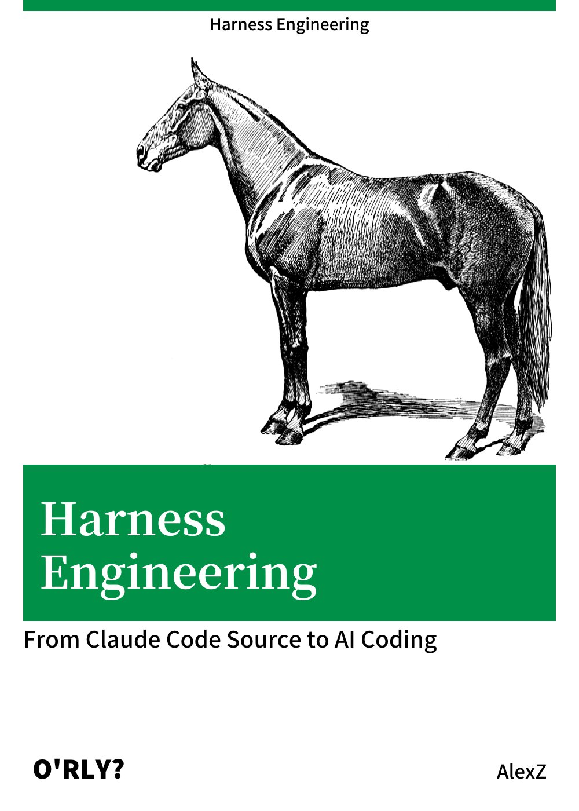
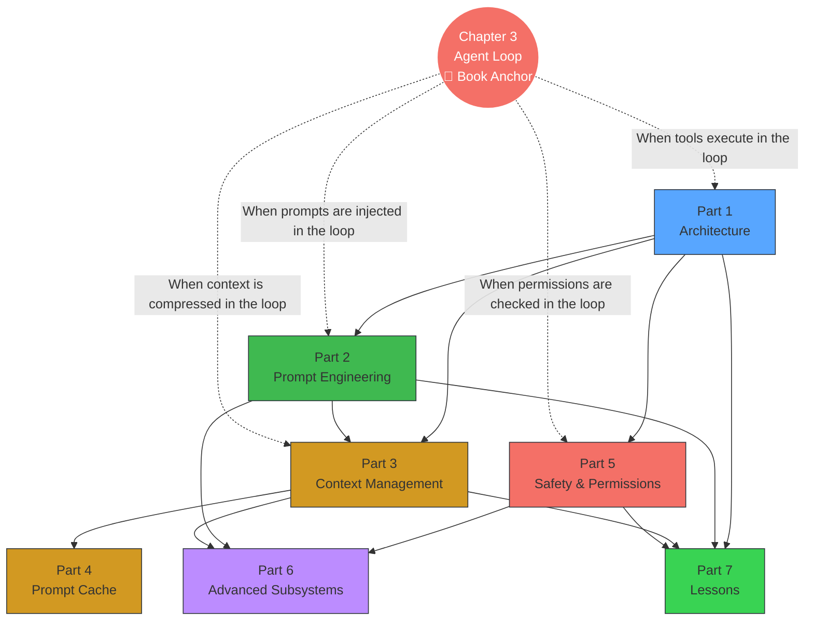

# 서문 (Preface)

  

*Harness Engineering* — 중국어권에서는 비공식적으로 "The Horse Book(马书, 마책)"으로 불린다. 중국어 제목이 말의 마구(harness)를 연상시키는 발음이기 때문이다.

나는 Claude Code의 소스 코드를 "소화(consume)"하는 가장 좋은 방법은 이를 체계적으로 학습할 수 있는 한 권의 책으로 바꾸는 것이라고 믿는다. 개인적으로는 원시 소스 코드를 직접 읽는 것보다 책을 통해 학습하는 쪽이 훨씬 편안하고, 완전한 인지 프레임워크를 형성하기에도 수월하다.

그래서 나는 Claude Code에게 유출된 TypeScript 소스 코드로부터 책을 추출하도록 시켰다. 이 책은 이제 오픈소스로 공개되어 누구나 온라인에서 읽을 수 있다.

- Repository: <https://github.com/ZhangHanDong/harness-engineering-from-cc-to-ai-coding>
- 온라인 열람: <https://zhanghandong.github.io/harness-engineering-from-cc-to-ai-coding/>

책을 읽으면서 Claude Code의 내부 메커니즘을 더 직관적으로 이해하고 싶다면, 다음 시각화 사이트와 함께 보는 것을 강력히 추천한다.

- 시각화 사이트: <https://ccunpacked.dev>

AI 작문 품질을 최대한 보장하기 위해, 추출 과정은 단순히 "모델에게 소스 코드를 던지고 생성시키는" 방식이 아니었다. 그 대신 다음과 같은 상당히 엄격한 엔지니어링 워크플로를 따랐다.

1. 먼저 소스 코드를 바탕으로 `DESIGN.md`를 논의·정제한다. 즉, 책 전체의 개요와 설계를 확립한다.
2. 다음으로 각 Chapter에 대한 spec을 작성한다. 내가 공개한 오픈소스 `agent-spec`을 사용해 Chapter의 목표, 범위(boundaries), 그리고 완료 기준(acceptance criteria)을 제약한다.
3. 그다음 plan을 수립하여 구체적인 실행 단계를 분해한다.
4. 마지막으로 내 기술 저술 스킬을 덧씌운 뒤에야 AI가 본격적인 집필을 시작한다.

이 책은 출판을 목적으로 하지 않는다. 내가 Claude Code를 더 체계적으로 학습하기 위한 용도다. 기본 판단은 다음과 같다. AI는 결코 완벽한 책을 쓰지 못할 것이다. 하지만 초기 버전을 오픈소스로 공개하기만 하면, 모두가 함께 읽고 토론하며 점진적으로 개선하여 진정으로 가치 있는 공공 도메인의 책으로 공동 구축할 수 있다.

다만 객관적으로 보자면, 이 초판은 이미 꽤 잘 쓰여 있다. 기여와 토론을 환영한다. 별도의 토론 그룹을 만드는 대신 모든 관련 대화는 GitHub Discussions에서 진행된다.

- Discussions: <https://github.com/ZhangHanDong/harness-engineering-from-cc-to-ai-coding/discussions>

---

## 읽기 전 준비 (Reading Preparation)

### 사전 지식 (Prerequisites)

이 책은 독자가 다음과 같은 기본기를 갖추었다고 가정한다. 전문가일 필요는 없으며, 읽고 이해할 수 있을 정도면 충분하다.

- **TypeScript / JavaScript**: 책의 모든 소스 코드는 TypeScript다. `async/await`, interface 정의, generics 등 기본 문법은 이해해야 하지만 직접 작성할 필요는 없다.
- **CLI 개발 개념**: process, 환경 변수, stdin/stdout, subprocess 통신. git, npm, cargo 같은 터미널 도구를 사용해 보았다면 이미 익숙한 개념들이다.
- **LLM API 기초**: messages API(system/user/assistant role), tool_use(function calling), streaming(스트리밍 응답) 이해. 어떤 LLM API든 호출해 본 경험이 있다면 충분하다.

필수는 아닌 항목: React / Ink 경험, Bun runtime 지식, Claude Code 사용 경험.

### 추천 독서 경로 (Recommended Reading Paths)

이 책의 30개 Chapter는 7개 Part로 구성되어 있지만, 처음부터 끝까지 순서대로 읽을 필요는 없다. 아래는 서로 다른 목표를 가진 독자를 위한 세 가지 경로다.

**Path A: Agent Builder** (자신만의 AI Agent를 만들고자 하는 경우)

> Chapter 1 (Tech Stack) → Chapter 3 (Agent Loop) → Chapter 5 (System Prompt) → Chapter 9 (Auto Compaction) → Chapter 20 (Agent Spawning) → Chapter 25–27 (Pattern Extraction) → Chapter 30 (Hands-on)

이 경로는 architecture → loop → prompt → context management → multi-agent까지 다루며, Chapter 30에서 Rust로 완전한 code review Agent를 직접 만드는 것으로 마무리된다.

**Path B: Security Engineer** (AI Agent의 보안 경계(security boundary)에 관심이 있는 경우)

> Chapter 16 (Permission System) → Chapter 17 (YOLO Classifier) → Chapter 18 (Hooks) → Chapter 19 (CLAUDE.md) → Chapter 4 (Tool Orchestration) → Chapter 25 (Fail-Closed Principle)

이 경로는 defense in depth(심층 방어)에 초점을 맞춘다. permission model부터 자동 분류, 그리고 사용자 개입 지점(interception point)까지 살펴보며, Claude Code가 자율성과 안전성을 어떻게 균형 잡는지 이해한다.

**Path C: Performance Optimization** (LLM 애플리케이션의 비용과 latency에 관심이 있는 경우)

> Chapter 9 (Auto Compaction) → Chapter 11 (Micro Compaction) → Chapter 12 (Token Budget) → Chapter 13 (Cache Architecture) → Chapter 14 (Cache Break Detection) → Chapter 15 (Cache Optimization) → Chapter 21 (Effort/Thinking)

이 경로는 context management → prompt caching → reasoning control을 다루며, Claude Code가 API 비용을 90%까지 감소시키는 방법을 이해한다.

> **Chapter 번호 표기에 관하여**: 일부 Chapter는 문자 suffix가 붙어 있다(예: ch06b, ch20b, ch20c, ch22b). 이는 메인 Chapter의 심화 확장편이다. 예를 들어 ch20b (Teams)와 ch20c (Ultraplan)은 ch20 (Agent Spawning)에 대한 deep dive다.

### 책 지식 지도 (Book Knowledge Map)

Chapter 3 (Agent Loop)은 이 책의 anchor다. 사용자 입력부터 모델 응답에 이르는 완전한 cycle을 정의한다. 다른 Part들은 각자 해당 cycle 내 특정 단계의 심층 메커니즘을 분석한다.

### 읽기 표기 규칙 (Reading Notation)

이 책은 다음 표기 규칙을 사용한다.

- **Source reference**: 형식은 `restored-src/src/path/file.ts:line`이며, Claude Code v2.1.88의 복원 소스(restored source)를 가리킨다.
- **Evidence level(근거 수준)**:
  - "v2.1.88 source evidence" — 완전한 소스 코드와 라인 번호 참조를 보유, 최고 수준의 신뢰도
  - "v2.1.91/v2.1.92 bundle reverse engineering" — bundle string signal로부터 추론. Anthropic은 v2.1.89부터 source map을 제거했다
  - "Inference" — event name 또는 variable name만으로 추정한 것이며, 직접적인 소스 근거는 없음
- **Mermaid 다이어그램**: flowchart와 architecture 다이어그램은 Mermaid 문법을 사용하며, 온라인 열람 시 자동으로 렌더링된다.
- **Interactive 시각화**: 일부 Chapter는 D3.js 기반의 interactive animation 링크를 제공한다("click to view"로 표시). 브라우저에서 열어야 하며, 각 애니메이션마다 fallback으로 정적 Mermaid 다이어그램이 함께 제공된다.
